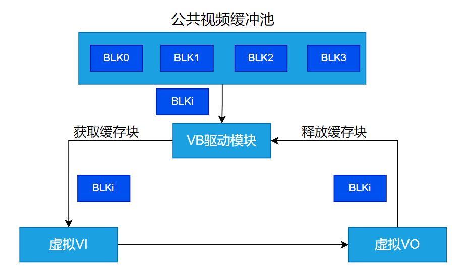

# K230系统控制API参考


版权所有©2023北京嘉楠捷思信息技术有限公司

<div style="page-break-after:always"></div>

## 免责声明

您购买的产品、服务或特性等应受北京嘉楠捷思信息技术有限公司（“本公司”，下同）及其关联公司的商业合同和条款的约束，本文档中描述的全部或部分产品、服务或特性可能不在您的购买或使用范围之内。除非合同另有约定，本公司不对本文档的任何陈述、信息、内容的正确性、可靠性、完整性、适销性、符合特定目的和不侵权提供任何明示或默示的声明或保证。除非另有约定，本文档仅作为使用指导参考。

由于产品版本升级或其他原因，本文档内容将可能在未经任何通知的情况下，不定期进行更新或修改。

## 商标声明

、“嘉楠”和其他嘉楠商标均为北京嘉楠捷思信息技术有限公司及其关联公司的商标。本文档可能提及的其他所有商标或注册商标，由各自的所有人拥有。

**版权所有 © 2023北京嘉楠捷思信息技术有限公司。保留一切权利。**
非经本公司书面许可，任何单位和个人不得擅自摘抄、复制本文档内容的部分或全部，并不得以任何形式传播。

<div style="page-break-after:always"></div>

## 目录

[TOC]

## 前言

### 概述

本文档主要介绍媒体子系统中系统控制模块的功能和用法，其它模块的功能和用法将各有专门的文档加以论述。

### 读者对象

本文档（本指南）主要适用于以下人员：

- 技术支持工程师
- 软件开发工程师

### 缩略词定义

| 简称 | 说明                                |
|------|-------------------------------------|
| mpp  | Media Process Platform 媒体处理平台 |
| vb   | video buffer 视频缓存池             |

### 修订记录

| 文档版本号 | 修改说明 | 修改者 | 日期     |
|------------|----------|--------|----------|
| V1.0       | 初版     | 郝海波 | 2023/3/4 |

## 1. 概述

### 1.1 概述

系统控制根据 k230芯片特性，完成硬件各个部件的复位、基本初始化工作，同时负责完成 MPP（Media Process Platform 媒体处理平台）系统内存管理，日志管理，绑定管理等模块的初始化、去初始化。

### 1.2 功能描述

#### 1.2.1 视频缓存池

视频缓存池是一组缓冲区（而不是一个），主要提供给多媒体硬件设备使用，并在多媒体硬件设备之间流转。缓存池分为公共缓存池和私有缓存池，公共缓存池主要是针对VI的，使用前要根据VI的图像参数确定缓存块的大小，然后申请一定数量的缓存块组成一个缓存池。总体来说，对于VI输入的原始画面，一帧的大小对应一个缓存块的大小，多个缓存块相当于给VI提供了多帧缓存的机制。同时这些公共缓存块也可以给VO或VENC使用。私有的缓存池往往代表存储在内存中的数据是与多媒体设备本身紧密相关的，例如编码的码流数据与实际的图像像素组成的视频流差别还是很大的，这些码流只有编解码器可用，而VB为这些设备提供专用的缓冲池。下图展示了虚拟VI和虚拟VO使用VB进行缓存块流转的流程。



#### 1.2.2 系统绑定

系统绑定，即通过数据接收者绑定数据源来建立两者之间的关联关系（只允许数据接收者绑定数据源）。绑定后，数据源生成的数据将自动发送给接收者。K230大的语音和视频处理主要分为几个大的模块如下：

语音：语音输入（Audio Input,简称AI）， 语音编码（Audio Encoder，简称AENC），语音解码（Audio Decoder，简称ADEC），语音输出（Audio Output，简称AO）

图像：视频输入（Video Input，简称VI），视频编码（Video Encoder，简称VENC），图像旋转（由GSDMA完成，简称DMA），深度处理单元(Depth Process Unit, 简称DPU)，图像解码（Video Decoder，简称VDEC），视频输出（Video Output，简称VO），虚拟视频输入（Virtual Video Input，简称VVI），虚拟视频输出（Virtual Video Output，简称VVO）

K230支持的绑定关系如下

表 11

| **数据源**        | **数据接收者** | **说明**                                                 |
|-------------------|----------------|----------------------------------------------------------|
| VI(视频输入)      | GSDMA          | VI的数据可以送到GSDMA进行旋转处理                        |
|                   | VO             | VI的数据可以直接送到VO进行显示                           |
|                   | DPU            | VI的数据可以直接送到DPU进行处理                          |
|                   | VENC           | VI的数据可以直接送到VENC进行处理                         |
| GSDMA（图像旋转） | VO             | GSDMA 处理后的数据，可以直接送给VO显示                   |
|                   | DPU            | GSDMA处理后的数据，可以直接送给DPU进行处理               |
|                   | VENC           | GSDMA处理后的数据，可以直接送给VENC进行编码              |
| VDEC(视频解码)    | GSDMA          | VDEC的数据最终会本地播放，播放前可能需要做旋转           |
|                   | VO             | VDEC的数据最终会本地播放                                 |
| DPU(深度处理单元) | 无             | DPU是视频数据的终点，不支持绑定关系                      |
| VENC(视频编码)    | 无             | 不支持绑定关系                                           |
| VO(视频显示)      | 无             | VO是视频数据的终点，不支持绑定关系                       |
| AI(音频输入)      | AREC           | AI处理后的数据，可以直接送给语音识别模块进行识别         |
|                   | AENC           | AI处理后的数据，可以直接送给语音编码模块进行编码         |
|                   | AO             | AI处理后的数据，可以直接进行播放                         |
| ADEC(语音解码)    | AO             | ADEC处理后的数据，可以直接进行播放                       |
| AENC(语音编码)    | 无             | 不支持绑定关系                                           |
| AO(音频输出)      | 无             | AO是音频数据的终点，不支持绑定关系                       |

## 2. API 参考

### 2.1 多媒体内存管理

该功能模块提供以下API：

- [kd\_mpi\_sys\_mmz\_alloc](#211-kd_mpi_sys_mmz_alloc)
- [kd\_mpi\_sys\_mmz\_alloc\_cached](#212-kd_mpi_sys_mmz_alloc_cached)
- [kd\_mpi\_sys\_mmap](#213-kd_mpi_sys_mmap)
- [kd\_mpi\_sys\_mmap\_cached](#214-kd_mpi_sys_mmap_cached)
- [kd\_mpi\_sys\_munmap](#215-kd_mpi_sys_munmap)
- [kd\_mpi\_sys\_mmz\_flush\_cache](#216-kd_mpi_sys_mmz_flush_cache)
- [kd\_mpi\_sys\_mmz\_free](#217-kd_mpi_sys_mmz_free)
- [kd\_mpi\_sys\_get\_virmem\_info](#218-kd_mpi_sys_get_virmem_info)
- [kd\_mpi\_vb\_set\_config](#219-kd_mpi_vb_set_config)
- [kd\_mpi\_vb\_get\_config](#2110-kd_mpi_vb_get_config)
- [kd\_mpi\_vb\_init](#2111-kd_mpi_vb_init)
- [kd\_mpi\_vb\_exit](#2112-kd_mpi_vb_exit)
- [kd\_mpi\_vb\_create\_pool](#2113-kd_mpi_vb_create_pool)
- [kd\_mpi\_vb\_destory\_pool](#2114-kd_mpi_vb_destory_pool)
- [kd\_mpi\_vb\_get\_block](#2115-kd_mpi_vb_get_block)
- [kd\_mpi\_vb\_release\_block](#2116-kd_mpi_vb_release_block)
- [kd\_mpi\_vb\_phyaddr\_to\_handle](#2117-kd_mpi_vb_phyaddr_to_handle)
- [kd\_mpi\_vb\_handle\_to\_phyaddr](#2118-kd_mpi_vb_handle_to_phyaddr)
- [kd\_mpi\_vb\_handle\_to\_pool\_id](#2119-kd_mpi_vb_handle_to_pool_id)
- [kd\_mpi\_vb\_inquire\_user\_cnt](#2120-kd_mpi_vb_inquire_user_cnt)
- [kd\_mpi\_vb\_get\_supplement\_attr](#2121-kd_mpi_vb_get_supplement_attr)
- [kd\_mpi\_vb\_set\_supplement\_config](#2122-kd_mpi_vb_set_supplement_config)
- [kd\_mpi\_vb\_get\_supplement\_config](#2123-kd_mpi_vb_get_supplement_config)
- [kd\_mpi\_vb\_set\_mod\_pool\_config](#2124-kd_mpi_vb_set_mod_pool_config)
- [kd\_mpi\_vb\_get\_mod\_pool\_config](#2125-kd_mpi_vb_get_mod_pool_config)
- [kd\_mpi\_vb\_init\_mod\_common\_pool](#2126-kd_mpi_vb_init_mod_common_pool)
- [kd\_mpi\_vb\_exit\_mod\_common\_pool](#2127-kd_mpi_vb_exit_mod_common_pool)

#### 2.1.1 kd_mpi_sys_mmz_alloc

【描述】

在用户空间申请MMZ内存

【语法】

k_s32 kd_mpi_sys_mmz_alloc(k_u64\* phy_addr, void\*\* virt_addr, const k_char\* mmb, const k_char\* zone, k_u32 len);

【参数】

| **参数名称**  | **描述**                          | 输入/输出 |
|-----------|------------------------------|-----------|
| phy_addr  | 物理地址指针。               | 输出      |
| virt_addr | 指向虚拟地址指针的指针。     | 输出      |
| mmb       | Mmb 名称的字符串指针。       | 输入      |
| zone      | MMZ zone 名称的字符串指针。  | 输入      |
| len       | 内存块大小。                 | 输入      |

【返回值】

| 返回值 | **描述**                                           |
|--------|-----------------------------------------------|
| 0      | 成功                                          |
| 非0    | 失败，其值参见[错误码](#412-多媒体内存zone错误码) |

【芯片差异】

无。

【需求】

- 头文件：mpi_sys_api.h
- 库文件：libsys.a

【注意】

MMZ由多个zone组成，每个zone有多个MMB。你可以调用这个MPI，在\*zone的MMZ分配一个大小为len的内存块\*mmb。在这种情况下，指向物理地址和用户模式虚拟地址的指针被返回。如果在MMZ中存在匿名区，将\*zone设置为null。如果\*mmb被设置为null，创建的MMB就被命名为null。

【举例】

无

【相关主题】

无

#### 2.1.2 kd_mpi_sys_mmz_alloc_cached

【描述】

在用户空间申请带cache的MMZ内存

【语法】

k_s32 kd_mpi_sys_mmz_alloc_cached(k_u64\* phy_addr, void\*\* virt_addr, const k_char\* mmb, const k_char\* zone, k_u32 len);

【参数】

| **参数名称**  | **描述**                          | 输入/输出 |
|-----------|------------------------------|-----------|
| phy_addr  | 物理地址指针。               | 输出      |
| virt_addr | 指向虚拟地址指针的指针。     | 输出      |
| mmb       | Mmb 名称的字符串指针。       | 输入      |
| zone      | MMZ zone 名称的字符串指针。  | 输入      |
| len       | 内存块大小。                 | 输入      |

【返回值】

| 返回值 | **描述**                                           |
|--------|-----------------------------------------------|
| 0      | 成功                                          |
| 非0    | 失败，其值参见[错误码](#412-多媒体内存zone错误码) |

【芯片差异】

无

【需求】

- 头文件：mpi_sys_api.h
- 库文件：libsys.a

【注意】

- [kd_mpi_sys_mmz_alloc_cached](#212-kd_mpi_sys_mmz_alloc_cached)与[kd_mpi_sys_mmz_alloc](#211-kd_mpi_sys_mmz_alloc)之间的区别：通过调用[kd_mpi_sys_mmz_alloc_cached](#212-kd_mpi_sys_mmz_alloc_cached)分配的内存支持缓存，如果要分配的内存将被频繁使用，推荐使用[kd_mpi_sys_mmz_alloc_cached](#212-kd_mpi_sys_mmz_alloc_cached)。这样可以提高CPU的读/写效率和系统性能。
- 当 cpu 访问此接口分配的内存时，会将内存中的数据放在 cache 中。若硬件设备只能访问物理内存而不是缓存，在这种情况下[kd_mpi_sys_mmz_flush_cache](#216-kd_mpi_sys_mmz_flush_cache)需要被调用来同步数据。

【举例】

无

【相关主题】

无

#### 2.1.3 kd_mpi_sys_mmap

【描述】

memory 存储映射接口。

【语法】

void \*kd_mpi_sys_mmap(k_u64 phy_addr, k_u32 size);

【参数】

| **参数名称** | **描述**                      | 输入/输出 |
|----------|--------------------------|-----------|
| phy_addr | 需映射的内存单元起始地址 | 输入      |
| size     | 映射的字节数             | 输入      |

【返回值】

| 返回值 | **描述**      |
|--------|----------|
| 0      | 无效地址 |
| 非0    | 有效地址 |

【芯片差异】

无

【需求】

- 头文件：mpi_sys_api.h
- 库文件：libsys.a

【注意】

- 通过MMZ申请得到的物理地址才可以使用这个API进行映射
- 如果地址区间属于一个VB，那么映射的大小需要小于VB池的大小

【举例】

无

【相关主题】

[kd_mpi_sys_munmap()](#215-kd_mpi_sys_munmap)

#### 2.1.4 kd_mpi_sys_mmap_cached

【描述】

memory 存储映射带cache的接口。

【语法】

void \*kd_mpi_sys_mmap_cached(k_u64 phy_addr, k_u32 size);

【参数】

| **参数名称** | **描述**                      | 输入/输出 |
|----------|--------------------------|-----------|
| phy_addr | 需映射的内存单元起始地址 | 输入      |
| size     | 映射的字节数             | 输入      |

【返回值】

| 返回值 | **描述**      |
|--------|----------|
| 0      | 无效地址 |
| 非0    | 有效地址 |

【芯片差异】

无

【需求】

- 头文件：mpi_sys_api.h
- 库文件：libsys.a

【注意】

- 通过MMZ申请得到的物理地址才可以使用这个API进行映射
- 如果地址区间属于一个VB，那么映射的大小需要小于VB池的大小

【举例】

无

【相关主题】

无

#### 2.1.5 kd_mpi_sys_munmap

【描述】

memory 存储映射解除接口。

【语法】

void \*kd_mpi_sys_munmap(void \*virt_addr, k_u32 size);

【参数】

| **参数名称**  | **描述**                | 输入/输出 |
|-----------|--------------------|-----------|
| virt_addr | mmap返回的虚拟地址 | 输入      |
| size      | 映射的字节数       | 输入      |

【返回值】

| 返回值 | **描述**  |
|--------|------|
| 0      | 成功 |
| 非0    | 失败 |

【芯片差异】

无

【需求】

- 头文件：mpi_sys_api.h
- 库文件：libsys.a

【注意】

无

【举例】

无

【相关主题】

- [kd_mpi_sys_mmap](#213-kd_mpi_sys_mmap)
- [kd_mpi_sys_mmap_cached](#214-kd_mpi_sys_mmap_cached)

#### 2.1.6 kd_mpi_sys_mmz_flush_cache

【描述】

刷新 cache 里的内容到内存并且使 cache 里的内容无效。

【语法】

k_s32 kd_mpi_sys_mmz_flush_cache(k_u64 phy_addr, void\* virt_addr, k_u32 size);

【参数】

| **参数名称**  | **描述**                                       | 输入/输出 |
|-----------|-------------------------------------------|-----------|
| phy_addr  | 待操作数据的起始物理地址。                | 输入      |
| virt_addr | 待操作数据的起始虚拟地址指针。不能传 NULL | 输入      |
| size      | 待操作数据的大小                          | 输入      |

【返回值】

| 返回值 | **描述**                                           |
|--------|-----------------------------------------------|
| 0      | 成功                                          |
| 非0    | 失败，其值参见[错误码](#412-多媒体内存zone错误码) |

【芯片差异】

无

【需求】

- 头文件：mpi_sys_api.h
- 库文件：libsys.a

【注意】

- 如果缓存中的数据是最新的数据，你需要调用这个MPI来同步数据到内存。这可以确保不能直接访问缓存的硬件可以获得正确的数据。.
- 必须先调用[kd_mpi_sys_mmz_alloc_cached](#212-kd_mpi_sys_mmz_alloc_cached)然后再使用这个MPI
- 若将 phy_addr 设为 0，则表示操作整个 cache 区域。(暂不支持)
- 你需要确保传输的参数是有效的
- 确保在执行刷新操作时不调用[kd_mpi_sys_mmz_free](#217-kd_mpi_sys_mmz_free)来释放被刷新的内存。否则，可能会发生不可预知的异常。

【举例】

无

【相关主题】

- [kd_mpi_sys_mmz_alloc_cached](#212-kd_mpi_sys_mmz_alloc_cached)
- [kd_mpi_sys_mmap_cached](#214-kd_mpi_sys_mmap_cached)

#### 2.1.7 kd_mpi_sys_mmz_free

【描述】

在用户态释放 MMZ 内存。

【语法】

k_s32 kd_mpi_sys_mmz_free(k_u64 phy_addr, void\* virt_addr);

【参数】

| **参数名称**  | **描述**            | 输入/输出 |
|-----------|----------------|-----------|
| phy_addr  | 物理地址。     | 输入      |
| virt_addr | 虚拟地址指针。 | 输入      |

【返回值】

| 返回值 | **描述**                                           |
|--------|-----------------------------------------------|
| 0      | 成功                                          |
| 非0    | 失败，其值参见[错误码](#412-多媒体内存zone错误码) |

【芯片差异】

无

【需求】

- 头文件：mpi_sys_api.h
- 库文件：libsys.a

【注意】

- 输入的地址必须为有效的物理地址，虚拟地址指针可以置为 NULL。
- 不能释放正在进行 flush 操作的内存，否则会引发不可预知的异常。

【举例】

无

【相关主题】

- [kd_mpi_sys_mmz_alloc](#211-kd_mpi_sys_mmz_alloc)
- [kd_mpi_sys_mmz_alloc_cached](#212-kd_mpi_sys_mmz_alloc_cached)

#### 2.1.8 kd_mpi_sys_get_virmem_info

【描述】

根据虚拟地址获取对应的内存信息，包括物理地址及 cached 属性

【语法】

k_s32 kd_mpi_sys_get_virmem_info(const void\* virt_addr, k_sys_virmem_info\* mem_info);

【参数】

| **参数名称**  | **描述**                                                     | 输入/输出 |
|-----------|---------------------------------------------------------|-----------|
| virt_addr | 虚拟地址指针。                                          | 输入      |
| mem_info  | 虚拟地址对应的内存信息，含物理地址、cached 属性等信息。 | 输出      |

【返回值】

| 返回值 | **描述**                                           |
|--------|-----------------------------------------------|
| 0      | 成功                                          |
| 非0    | 失败，其值参见[错误码](#412-多媒体内存zone错误码) |

【芯片差异】

无

【需求】

- 头文件：mpi_sys_api.h k_mmz_comm.h
- 库文件：libsys.a

【注意】

- 输入必须为用户态虚拟地址。
- 不支持跨进程使用。

【举例】

无

【相关主题】

- [kd_mpi_sys_mmz_alloc](#211-kd_mpi_sys_mmz_alloc)
- [kd_mpi_sys_mmz_alloc_cached](#212-kd_mpi_sys_mmz_alloc_cached)

#### 2.1.9 kd_mpi_vb_set_config

【描述】

设置 MPP 视频缓存池属性。

【语法】

k_s32 kd_mpi_vb_set_config(const [k_vb_config](#323-k_vb_config) \*config);

【参数】

| **参数名称** | **描述**                  | 输入/输出 |
|----------|----------------------|-----------|
| config   | 视频缓存池属性指针。 | 输入      |

【返回值】

| 返回值 | **描述**                                       |
|--------|-------------------------------------------|
| 0      | 成功                                      |
| 非0    | 失败，其值参见[错误码](#411-视频缓存池错误码) |

【芯片差异】

无

【需求】

- 头文件：mpi_vb_api.h k_vb_comm.h
- 库文件：libvb.a

【注意】

- 只能在系统处于未初始化的状态下，才可以设置缓存池属性，否则会返回失败。
- 公共缓存池中每个缓存块的大小应根据当前图像像素格式以及图像是否压缩而有所不同。具体分配大小请参考 [k_vb_config](#323-k_vb_config) 结构体中的描述。

【举例】

无

【相关主题】

[kd_mpi_vb_get_config](#2110-kd_mpi_vb_get_config)

#### 2.1.10 kd_mpi_vb_get_config

【描述】

获取 MPP 视频缓存池属性。

【语法】

k_s32 kd_mpi_vb_get_config(const [k_vb_config](#323-k_vb_config) \*config);

【参数】

| **参数名称** | **描述**                  | 输入/输出 |
|----------|----------------------|-----------|
| config   | 视频缓存池属性指针。 | 输出      |

【返回值】

| 返回值 | **描述**                                       |
|--------|-------------------------------------------|
| 0      | 成功                                      |
| 非0    | 失败，其值参见[错误码](#411-视频缓存池错误码) |

【芯片差异】

无

【需求】

- 头文件：mpi_vb_api.h k_vb_comm.h
- 库文件：libvb.a

【注意】

必须先调用 [kd_mpi_vb_set_config](#219-kd_mpi_vb_set_config) 设置 MPP 视频缓存池属性，再获取属性。

【举例】

无

【相关主题】

[kd_mpi_vb_set_config](#219-kd_mpi_vb_set_config)

#### 2.1.11 kd_mpi_vb_init

【描述】

初始化 MPP 视频缓存池。。

【语法】

k_s32 kd_mpi_vb_init(void);

【参数】

无

【返回值】

| 返回值 | **描述**                                       |
|--------|-------------------------------------------|
| 0      | 成功                                      |
| 非0    | 失败，其值参见[错误码](#411-视频缓存池错误码) |

【芯片差异】

无

【需求】

- 头文件：mpi_vb_api.h k_vb_comm.h
- 库文件：libvb.a

【注意】

- 必须先调用 [kd_mpi_vb_set_config](#219-kd_mpi_vb_set_config) 设置 MPP 视频缓存池属性，再初始化缓存池，否则会失败。
- 可反复初始化，不返回失败。

【举例】

无

【相关主题】

[kd_mpi_vb_exit](#2112-kd_mpi_vb_exit)

#### 2.1.12 kd_mpi_vb_exit

【描述】

去初始化 MPP 视频缓存池。

【语法】

k_s32 kd_mpi_vb_exit(void);

【参数】

无

【返回值】

| 返回值 | **描述**                                       |
|--------|-------------------------------------------|
| 0      | 成功                                      |
| 非0    | 失败，其值参见[错误码](#411-视频缓存池错误码) |

【芯片差异】

无

【需求】

- 头文件：mpi_vb_api.h k_vb_comm.h
- 库文件：libvb.a

【注意】

- 去初始化不会清除先前对缓存池的配置。
- 可反复去初始化，不返回失败。
- 退出 VB 池之前请确保 VB 池里的任何 VB 都没有被占用，否则无法退出。

【举例】

无

【相关主题】

[kd_mpi_vb_init](#2111-kd_mpi_vb_init)

#### 2.1.13 kd_mpi_vb_create_pool

【描述】

创建一个视频缓存池

【语法】

k_s32 kd_mpi_vb_create_pool([k_vb_pool_config](#324-k_vb_pool_config) \*config);

【参数】

| **参数名称** | **描述**                    | 输入/输出 |
|----------|------------------------|-----------|
| config   | 缓存池配置属性参数指针 | 输入      |

【返回值】

| 返回值               | **描述**                                              |
|----------------------|--------------------------------------------------|
| 非 VB_INVALID_POOLID | 有效的缓存池 ID 号                               |
| VB_INVALID_POOLID    | 创建缓存池失败，可能是参数非法或者保留内存不够。 |

【芯片差异】

无

【需求】

- 头文件：mpi_vb_api.h k_vb_comm.h
- 库文件：libvb.a

【注意】

无

【举例】

无

【相关主题】

[kd_mpi_vb_destory_pool](#2114-kd_mpi_vb_destory_pool)

#### 2.1.14 kd_mpi_vb_destory_pool

【描述】

销毁一个视频缓存池。

【语法】

k_s32 kd_mpi_vb_destory_pool(k_u32 pool_id);

【参数】

| **参数名称** | **描述**                                          | 输入/输出 |
|----------|----------------------------------------------|-----------|
| pool_id  | 缓存池 ID 号。 取值范围：[0, VB_MAX_POOLS)。 | 输入      |

【返回值】

| 返回值 | **描述**                                         |
|--------|---------------------------------------------|
| 0      | 成功。                                      |
| 非 0   | 失败，其值参见[错误码](#411-视频缓存池错误码)。 |

【芯片差异】

无

【需求】

- 头文件：mpi_vb_api.h k_vb_comm.h
- 库文件：libvb.a

【注意】

- 销毁一个不存在的缓存池，会返回[K_ERR_VB_UNEXIST](#411-视频缓存池错误码)
- 只有通过[k_mpi_vb_create_pool](#2113-kd_mpi_vb_create_pool)创建的缓存池才可以销毁

【举例】

无

【相关主题】

[kd_mpi_vb_create_pool](#2113-kd_mpi_vb_create_pool)

#### 2.1.15 kd_mpi_vb_get_block

【描述】

用户态获取一个缓存块

【语法】

k_vb_blk_handle kd_mpi_vb_get_block(k_u32 pool_id, k_u64 blk_size, const k_char \*mmz_name);

【参数】

| **参数名称** | **描述**                                                     | 输入/输出 |
|----------|---------------------------------------------------------|-----------|
| pool_id  | 缓存池 ID 号。 取值范围：[0, VB_MAX_POOLS)。            | 输入      |
| blk_size | 缓存块大小。 取值范围：数据类型全范围，以 byte 为单位。 | 输入      |
| mmz_name | 缓存池所在 DDR 的名字。                                 | 输入      |

【返回值】

| 返回值               | **描述**              |
|----------------------|------------------|
| 非 VB_INVALID_HANDLE | 有效的缓存块句柄 |
| VB_INVALID_HANDLE    | 获取缓存块失败   |

【芯片差异】

无

【需求】

- 头文件：mpi_vb_api.h k_vb_comm.h
- 库文件：libvb.a

【注意】

- 用户可以在创建一个缓存池之后，调用本接口从该缓存池中获取一个缓存块；即将第1个参数 Pool 设置为创建的缓存池ID；从指定缓存池获取缓存块时，参数mmz_name无效
- 如果用户需要从任意一个公共缓存池中获取一块指定大小的缓存块，则可以将第 1个参数 Pool 设置为无效 ID 号（VB_INVALID_POOLID），将第 2 个参数blk_size 设置为需要的缓存块大小，并指定要从哪个 DDR 上的公共缓存池获取缓存块。如果指定的 DDR 上并没有公共缓存池，那么将获取不到缓存块。如果mmz_name 等于 NULL，则表示在匿名DDR 上的公共缓存池获取缓存块。

【举例】

无

【相关主题】

[kd_mpi_vb_release_block](#2116-kd_mpi_vb_release_block)

#### 2.1.16 kd_mpi_vb_release_block

【描述】

用户态释放一个缓存块

【语法】

k_s32 kd_mpi_vb_release_block(k_vb_blk_handle block);

【参数】

| **参数名称** | **描述**       | 输入/输出 |
|----------|-----------|-----------|
| block    | vb 块句柄 | 输入      |

【返回值】

| 返回值 | **描述**                                         |
|--------|---------------------------------------------|
| 0      | 成功。                                      |
| 非 0   | 失败，其值参见[错误码](#411-视频缓存池错误码)。 |

【芯片差异】

无

【需求】

- 头文件：mpi_vb_api.h k_vb_comm.h
- 库文件：libvb.a

【注意】

获取的缓存块使用完后，应该调用此接口释放缓存块。

【举例】

无

【相关主题】

[kd_mpi_vb_get_block](#2115-kd_mpi_vb_get_block)

#### 2.1.17 kd_mpi_vb_phyaddr_to_handle

【描述】

用户态通过缓存块的物理地址获取其句柄。

【语法】

k_vb_blk_handle kd_mpi_vb_phyaddr_to_handle(k_u64 phys_addr);

【参数】

| **参数名称**  | **描述**       | 输入/输出 |
|-----------|-----------|-----------|
| phys_addr | 物理地址 | 输入      |

【返回值】

| 返回值               | **描述**                |
|----------------------|--------------------|
| 非 VB_INVALID_HANDLE | 有效的缓存块句柄   |
| VB_INVALID_HANDLE    | 获取缓存快句柄失败 |

【芯片差异】

无

【需求】

- 头文件：mpi_vb_api.h k_vb_comm.h
- 库文件：libvb.a

【注意】

物理地址应该是从 MPP 视频缓存池中获取的有效缓存块的地址。

【举例】

无

【相关主题】

无

#### 2.1.18 kd_mpi_vb_handle_to_phyaddr

【描述】

用户态获取一个缓存块的物理地址

【语法】

k_u64 kd_mpi_vb_handle_to_phyaddr(k_vb_blk_handle block);

【参数】

| **参数名称** | **描述**       | 输入/输出 |
|----------|-----------|-----------|
| block    | vb 块句柄 | 输入      |

【返回值】

| 返回值 | **描述**                          |
|--------|------------------------------|
| 0      | 无效返回值，缓存块句柄非法。 |
| 非 0   | 有效物理地址。               |

【芯片差异】

无

【需求】

- 头文件：mpi_vb_api.h k_vb_comm.h
- 库文件：libvb.a

【注意】

指定的缓存块应该是从 MPP 视频缓存池中获取的有效缓存块。

【举例】

无

【相关主题】

无

#### 2.1.19 kd_mpi_vb_handle_to_pool_id

【描述】

用户态获取一个帧缓存块所在缓存池的 ID。

【语法】

k_s32 kd_mpi_vb_handle_to_pool_id(k_vb_blk_handle block);

【参数】

| **参数名称** | **描述**       | 输入/输出 |
|----------|-----------|-----------|
| block    | vb 块句柄 | 输入      |

【返回值】

| 返回值               | **描述**                |
|----------------------|--------------------|
| 非 VB_INVALID_POOLID | 有效的缓存池 ID 号 |
| VB_INVALID_POOLID    | 获取缓存池ID失败。 |

【芯片差异】

无

【需求】

- 头文件：mpi_vb_api.h k_vb_comm.h
- 库文件：libvb.a

【注意】

指定的缓存块应该是从 MPP 视频缓存池中获取的有效缓存块。

【举例】

无

【相关主题】

无

#### 2.1.20 kd_mpi_vb_inquire_user_cnt

【描述】

查询缓存块使用计数信息。

【语法】

k_s32 kd_mpi_vb_inquire_user_cnt(k_vb_blk_handle block);

【参数】

| **参数名称** | **描述**       | 输入/输出 |
|----------|-----------|-----------|
| block    | vb 块句柄 | 输入      |

【返回值】

| 返回值   | **描述**                |
|----------|--------------------|
| K_FAILED | 查询失败           |
| 其他值   | 缓存块使用计数值。 |

【芯片差异】

无

【需求】

- 头文件：mpi_vb_api.h k_vb_comm.h
- 库文件：libvb.a

【注意】

无。

【举例】

无

【相关主题】

无

#### 2.1.21 kd_mpi_vb_get_supplement_attr

【描述】

获取 VB Block 内存的辅助信息。

【语法】

k_s32 kd_mpi_vb_get_supplement_attr(k_vb_blk_handle block, [k_video_supplement](#333-k_video_supplement) \*supplement);

【参数】

| **参数名称**   | **描述**                                             | 输入/输出 |
|------------|-------------------------------------------------|-----------|
| block      | vb 块句柄                                       | 输入      |
| supplement | vb block 内存的辅助信息。 如ISP信息、DCF 信息等 | 输出      |

【返回值】

| 返回值 | **描述**                                       |
|--------|-------------------------------------------|
| 0      | 成功                                      |
| 非0    | 失败，其值参见[错误码](#411-视频缓存池错误码) |

【芯片差异】

无

【需求】

- 头文件：mpi_vb_api.h k_vb_comm.h
- 库文件：libvb.a

【注意】

Supplement保存的DCF和ISP的虚拟地址信息为内核态虚拟地址

【举例】

无

【相关主题】

无

#### 2.1.22 kd_mpi_vb_set_supplement_config

【描述】

设置 VB 内存的附加信息。

说明

有些信息需要附加在 VB 内存的后面。例如 DCF 信息、ISP 的统计信息、ISP 的一些实时参数等，这些附加的信息可以跟着 VB 内存在 MPP 各个模块传递。用户态获取 VB 内存，也可以获取到这些信息。

【语法】

k_s32 kd_mpi_vb_set_supplement_config(const [k_vb_supplement_config](#326-k_vb_supplement_config) \*supplement_config);

【参数】

| **参数名称**          | **描述**                                                | 输入/输出 |
|-------------------|----------------------------------------------------|-----------|
| supplement_config | VB 内存附加信息控制结构体。 用于附加信息分配内存。 | 输入      |

【返回值】

| 返回值 | **描述**                                       |
|--------|-------------------------------------------|
| 0      | 成功                                      |
| 非0    | 失败，其值参见[错误码](#411-视频缓存池错误码) |

【芯片差异】

无

【需求】

- 头文件：mpi_vb_api.h k_vb_comm.h
- 库文件：libvb.a

【注意】

- 当前支持 2 种 VB 内存附加信息，分别为：
- DCF 信息，对应结构体[k_jpeg_dcf](#335-k_jpeg_dcf)。对应的 MASK 为VB_SUPPLEMENT_JPEG_MASK。
- ISP信息，对应结果提[k_isp_frame_info](#334-k_isp_frame_info)。对应的MASK为VB_SUPPLEMENT_ISPINFO_MASK。
- 需要在 [kd_mpi_vb_init](#2111-kd_mpi_vb_init) 前调用此接口，辅助信息才能生效。

【举例】

无

【相关主题】

[kd_mpi_vb_get_supplement_config](#2123-kd_mpi_vb_get_supplement_config)

#### 2.1.23 kd_mpi_vb_get_supplement_config

【描述】

获取VB 内存的附加信息。

【语法】

k_s32 kd_mpi_vb_set_supplement_config(const [k_vb_supplement_config](#326-k_vb_supplement_config) \*supplement_config);

【参数】

| **参数名称**          | **描述**                                                | 输入/输出 |
|-------------------|----------------------------------------------------|-----------|
| supplement_config | VB 内存附加信息控制结构体。 用于附加信息分配内存。 | 输出      |

【返回值】

| 返回值 | **描述**                                       |
|--------|-------------------------------------------|
| 0      | 成功                                      |
| 非0    | 失败，其值参见[错误码](#411-视频缓存池错误码) |

【芯片差异】

无

【需求】

- 头文件：mpi_vb_api.h k_vb_comm.h
- 库文件：libvb.a

【注意】

无

【举例】

无

【相关主题】

kd_mpi_vb_set_supplement_config

#### 2.1.24 kd_mpi_vb_set_mod_pool_config

【描述】

设置模块公共视频缓存池属性。

【语法】

k_s32 kd_mpi_vb_set_mod_pool_config(k_vb_uid vb_uid, const [k_vb_config](#323-k_vb_config) \*config);

【参数】

| **参数名称** | **描述**                               | 输入/输出 |
|----------|-----------------------------------|-----------|
| vb_uid   | 使用模块公共视频缓冲池的模块 ID。 | 输入      |
| config   | 视频缓存池属性指针。              | 输入      |

【返回值】

| 返回值 | **描述**                                       |
|--------|-------------------------------------------|
| 0      | 成功                                      |
| 非0    | 失败，其值参见[错误码](#411-视频缓存池错误码) |

【芯片差异】

无

【需求】

- 头文件：mpi_vb_api.h k_vb_comm.h
- 库文件：libvb.a

【注意】

- 模块公共视频缓冲区的配置根据实际需要配置，否则会造成内存浪费
- 如果模块 VB 已创建，再次配置返回错误码 KD_ERR_VB_BUSY

【举例】

无

【相关主题】

[kd_mpi_vb_get_mod_pool_config](#2125-kd_mpi_vb_get_mod_pool_config)

#### 2.1.25 kd_mpi_vb_get_mod_pool_config

【描述】

获取模块公共视频缓存池属性。

【语法】

k_s32 kd_mpi_vb_get_mod_pool_config(k_vb_uid vb_uid, [k_vb_config](#323-k_vb_config) \*config);

【参数】

| **参数名称** | **描述**                               | 输入/输出 |
|----------|-----------------------------------|-----------|
| vb_uid   | 使用模块公共视频缓冲池的模块 ID | 输入      |
| config   | 视频缓存池属性指针。              | 输出      |

【返回值】

| 返回值 | **描述**                                       |
|--------|-------------------------------------------|
| 0      | 成功                                      |
| 非0    | 失败，其值参见[错误码](#411-视频缓存池错误码) |

【芯片差异】

无

【需求】

- 头文件：mpi_vb_api.h k_vb_comm.h
- 库文件：libvb.a

【注意】

必须先调用 [kd_mpi_vb_set_mod_pool_config](#2124-kd_mpi_vb_set_mod_pool_config) 设置模块公共视频缓存池属性，再获取属

性。

【举例】

无

【相关主题】

[kd_mpi_vb_set_mod_pool_config](#2124-kd_mpi_vb_set_mod_pool_config)

#### 2.1.26 kd_mpi_vb_init_mod_common_pool

【描述】

初始化模块公共视频缓存池。

【语法】

k_s32 kd_mpi_vb_init_mod_common_pool([k_vb_uid](#322-k_vb_uid) vb_uid);

【参数】

| **参数名称** | **描述**                               | 输入/输出 |
|----------|-----------------------------------|-----------|
| vb_uid   | 使用模块公共视频缓冲池的模块 ID。 | 输入      |

【返回值】

| 返回值 | **描述**                                       |
|--------|-------------------------------------------|
| 0      | 成功                                      |
| 非0    | 失败，其值参见[错误码](#411-视频缓存池错误码) |

【芯片差异】

无

【需求】

- 头文件：mpi_vb_api.h k_vb_comm.h
- 库文件：libvb.a

【注意】

- 必须先调用[kd_mpi_vb_init](#2111-kd_mpi_vb_init) 进行公共视频缓冲池初始化。
- 必须先调用 [kd_mpi_vb_set_mod_pool_config](#2124-kd_mpi_vb_set_mod_pool_config)f配置缓存池属性，再初始化缓存池，否则会失败。
- 可反复初始化，不返回失败。

【举例】

无

【相关主题】

[kd_mpi_vb_exit_mod_common_pool](#2127-kd_mpi_vb_exit_mod_common_pool)

#### 2.1.27 kd_mpi_vb_exit_mod_common_pool

【描述】

退出模块公共视频缓存池。

【语法】

k_s32 kd_mpi_vb_exit_mod_common_pool([k_vb_uid](#322-k_vb_uid) vb_uid);

【参数】

| **参数名称** | **描述**                               | 输入/输出 |
|----------|-----------------------------------|-----------|
| vb_uid   | 使用模块公共视频缓冲池的模块 ID。 | 输入      |

【返回值】

| 返回值 | **描述**                                       |
|--------|-------------------------------------------|
| 0      | 成功                                      |
| 非0    | 失败，其值参见[错误码](#411-视频缓存池错误码) |

【芯片差异】

无

【需求】

- 头文件：mpi_vb_api.h k_vb_comm.h
- 库文件：libvb.a

【注意】

- 必须在调用[kd_mpi_vb_exit](#2112-kd_mpi_vb_exit) 之前调用该接口，否则会返回失败。
- 退出后会清除先前对模块公共视频缓存池的配置。
- 可反复退出，不返回失败。
- 退出 VB 池之前请确保 VB 池里的任何 VB 都没有被占用，否则无法退出。

【举例】

无

【相关主题】

[kd_mpi_vb_init_mod_common_pool](#2126-kd_mpi_vb_init_mod_common_pool)

### 2.2 系统绑定

该功能模块提供以下API：

- [kd_mpi_sys_bind](#221-kd_mpi_sys_bind)
- [kd_mpi_sys_unbind](#222-kd_mpi_sys_unbind)
- [kd_mpi_sys_get_bind_by_dest](#223-kd_mpi_sys_get_bind_by_dest)

#### 2.2.1 kd_mpi_sys_bind

【描述】

数据源到数据接收者绑定接口

【语法】

k_s32 kd_mpi_sys_bind([k_mpp_chn](#312-k_mpp_chn) \*src_chn, [k_mpp_chn](#312-k_mpp_chn) \*dest_chn);

【参数】

| **参数名称** | **描述**            | 输入/输出 |
|----------|----------------|-----------|
| src_chn  | 源通道指针。   | 输入      |
| dest_chn | 目的通道指针。 | 输入      |

【返回值】

| 返回值 | **描述**                                     |
|--------|-----------------------------------------|
| 0      | 成功                                    |
| 非0    | 失败，其值参见[错误码](#42-系统绑定错误码) |

【芯片差异】

无

【需求】

- 头文件：mpi_sys_api.h k_module.h
- 库文件：libsys.a

【注意】

- 系统目前支持的绑定关系，请参见[表 1-1](#411-视频缓存池错误码)。
- 同一个数据接收者只能绑定一个数据源。
- 绑定是指数据源和数据接收者建立关联关系。绑定后，数据源生成的数据将自动
    发送给接收者

【举例】

无/xx。

【相关主题】

[kd_mpi_sys_unbind](#222-kd_mpi_sys_unbind)

#### 2.2.2 kd_mpi_sys_unbind

【描述】

数据源到数据接收者解绑定接口。

【语法】

k_s32 kd_mpi_sys_unbind([k_mpp_chn](#312-k_mpp_chn) \*src_chn, [k_mpp_chn](#312-k_mpp_chn) \*dest_chn);

【参数】

| **参数名称** | **描述**            | 输入/输出 |
|----------|----------------|-----------|
| src_chn  | 源通道指针。   | 输入      |
| dest_chn | 目的通道指针。 | 输入      |

【返回值】

| 返回值 | **描述**                                     |
|--------|-----------------------------------------|
| 0      | 成功                                    |
| 非0    | 失败，其值参见[错误码](#42-系统绑定错误码) |

【芯片差异】

无

【需求】

- 头文件：mpi_sys_api.h k_module.h
- 库文件：libsys.a

【注意】

pstDestChn 如果找不到绑定的源通道，则直接返回成功。如果找到了绑定的源通道，
但是绑定的源通道和 pstSrcChn 不匹配，则返回失败。

【举例】

无/xx。

【相关主题】

[kd_mpi_sys_bind](#221-kd_mpi_sys_bind)

#### 2.2.3 kd_mpi_sys_get_bind_by_dest

【描述】

获取此通道上绑定的源通道的信息。

【语法】

k_s32 kd_mpi_sys_get_bind_by_dest([k_mpp_chn](#312-k_mpp_chn) \*dest_chn, [k_mpp_chn](#312-k_mpp_chn) \*src_chn);

【参数】

| **参数名称** | **描述**            | 输入/输出 |
|----------|----------------|-----------|
| src_chn  | 源通道指针。   | 输出      |
| dest_chn | 目的通道指针。 | 输入      |

【返回值】

| 返回值 | **描述**                                     |
|--------|-----------------------------------------|
| 0      | 成功                                    |
| 非0    | 失败，其值参见[错误码](#42-系统绑定错误码) |

【芯片差异】

无

【需求】

- 头文件：mpi_sys_api.h k_module.h
- 库文件：libsys.a

【注意】

无

【举例】

无/xx。

【相关主题】

- [kd_mpi_sys_bind](#221-kd_mpi_sys_bind)
- [kd_mpi_sys_unbind](#222-kd_mpi_sys_unbind)

### 2.3 日志管理

该功能模块提供以下API：

- [kd_mpi_log_set_level_conf](#231-kd_mpi_log_set_level_conf)
- [kd_mpi_log_get_level_conf](#232-kd_mpi_log_get_level_conf)
- [kd_mpi_log_set_wait_flag](#233-kd_mpi_log_set_wait_flag)
- [kd_mpi_log_read](#234-kd_mpi_log_read)
- [kd_mpi_log_close](#235-kd_mpi_log_close)
- [kd_mpi_log_set_console](#236-kd_mpi_log_set_console)
- [kd_mpi_log_get_console](#237-kd_mpi_log_get_console)

#### 2.3.1 kd_mpi_log_set_level_conf

【描述】

设置日志等级。

【语法】

k_s32 kd_mpi_log_set_level_conf(const [k_log_level_conf](#341-k_log_level_conf) \*conf);

【参数】

| **参数名称** | **描述**                   | 输入/输出 |
|----------|-----------------------|-----------|
| conf     | 日志等级信息结构体。  | 输入      |

【返回值】

| 返回值 | **描述**                                     |
|--------|-----------------------------------------|
| 0      | 成功                                    |
| 非0    | 失败，其值参见[错误码](#43-日志管理错误码) |

【芯片差异】

无

【需求】

- 头文件：mpi_sys_api.h k_module.h k_log_comm.h
- 库文件：libsys.a

【注意】

当 conf中的成员 mod_name 设置为字符串“all”时，将设置全部模块的日志等级。否
则，只设定mod_id指定的模块的日志等级

【举例】

无

【相关主题】

[kd_mpi_log_get_level_conf](#232-kd_mpi_log_get_level_conf)

#### 2.3.2 kd_mpi_log_get_level_conf

【描述】

设置日志等级。

【语法】

k_s32 kd_mpi_log_get_level_conf([k_log_level_conf](#341-k_log_level_conf) \*conf);

【参数】

| **参数名称**        | **描述**                         | 输入/输出 |
|-----------------|-----------------------------|-----------|
| conf-\>mod_id   | 需要获取日志等级的模块 ID。 | 输入      |
| conf-\>level    | 获取到的日志等级            | 输出      |
| conf-\>mod_name | 模块的名字                  | 输出      |

【返回值】

| 返回值 | **描述**                                     |
|--------|-----------------------------------------|
| 0      | 成功                                    |
| 非0    | 失败，其值参见[错误码](#43-日志管理错误码) |

【芯片差异】

无

【需求】

- 头文件：mpi_sys_api.h k_module.h k_log_comm.h
- 库文件：libsys.a

【注意】

无

【举例】

无

【相关主题】

[kd_mpi_log_set_level_conf](#231-kd_mpi_log_set_level_conf)

#### 2.3.3 kd_mpi_log_set_wait_flag

【描述】

设置读取日志时等待标志。

【语法】

k_s32 kd_mpi_log_set_wait_flag(k_bool is_wait);

【参数】

| **参数名称** | **描述**                         | 输入/输出 |
|----------|-----------------------------|-----------|
| is_wait  | 读取日志时是否等待的标志。  | 输入      |

【返回值】

| 返回值 | **描述**                                     |
|--------|-----------------------------------------|
| 0      | 成功                                    |
| 非0    | 失败，其值参见[错误码](#43-日志管理错误码) |

【芯片差异】

无

【需求】

- 头文件：mpi_sys_api.h k_module.h k_log_comm.h
- 库文件：libsys.a

【注意】

无

【举例】

无

【相关主题】

无

#### 2.3.4 kd_mpi_log_read

【描述】

读取日志。

【语法】

k_s32 kd_mpi_log_read(k_char \*buf, k_u32 size);

【参数】

| **参数名称** | **描述**                       | 输入/输出 |
|----------|---------------------------|-----------|
| buf      | 用于存放日志的内存指针。  | 输出      |
| size     | 读取日志的大小。          | 输入      |

【返回值】

| 返回值     | **描述**                    |
|------------|------------------------|
| 大于等于 0 | 成功读取的日志的大小。 |

【芯片差异】

无

【需求】

- 头文件：mpi_sys_api.h k_module.h k_log_comm.h
- 库文件：libsys.a

【注意】

无

【举例】

无

【相关主题】

无

#### 2.3.5 kd_mpi_log_close

【描述】

关闭日志文件。

【语法】

void kd_mpi_log_close(void);

【参数】

无

【返回值】

无

【芯片差异】

无

【需求】

- 头文件：mpi_sys_api.h k_module.h k_log_comm.h
- 库文件：libsys.a

【注意】

无

【举例】

无

【相关主题】

无

#### 2.3.6 kd_mpi_log_set_console

【描述】

配置日志是否直接通过控制台打印。

【语法】

k_s32 kd_mpi_log_set_console(k_bool is_console);

【参数】

| **参数名称**   | **描述**                | 输入/输出 |
|------------|--------------------|-----------|
| is_console | 是否通过控制台打印 | 输入      |

【返回值】

| 返回值 | **描述**                                     |
|--------|-----------------------------------------|
| 0      | 成功                                    |
| 非0    | 失败，其值参见[错误码](#43-日志管理错误码) |

【芯片差异】

无

【需求】

- 头文件：mpi_sys_api.h k_module.h k_log_comm.h
- 库文件：libsys.a

【注意】

无

【举例】

无

【相关主题】

[kd_mpi_log_get_console](#237-kd_mpi_log_get_console)

#### 2.3.7 kd_mpi_log_get_console

【描述】

获取日志是否直接通过控制台打印。

【语法】

k_s32 kd_mpi_log_set_console(k_bool is_console);

【参数】

| **参数名称**   | **描述**                | 输入/输出 |
|------------|--------------------|-----------|
| is_console | 是否通过控制台打印 | 输出      |

【返回值】

| 返回值 | **描述**                                     |
|--------|-----------------------------------------|
| 0      | 成功                                    |
| 非0    | 失败，其值参见[错误码](#43-日志管理错误码) |

【芯片差异】

无

【需求】

- 头文件：mpi_sys_api.h k_module.h k_log_comm.h
- 库文件：libsys.a

【注意】

无

【举例】

无

【相关主题】

[kd_mpi_log_set_console](#236-kd_mpi_log_set_console)

## 3. 数据类型

### 3.1 公共数据类型

该模块有如下数据类型

- [k_mod_id](#311-k_mod_id)
- [k_mpp_chn](#312-k_mpp_chn)

#### 3.1.1 k_mod_id

【说明】

定义模块 ID 枚举类型。

【定义】

```C
typedef enum {

K_ID_CMPI = 0, /*< common module platform interface */

K_ID_LOG = 1, /*< mpi device log */

K_ID_MMZ = 2, /*< media memory zone */

K_ID_MMZ_USER_DEV = 3, /*< media memory zone user used */

K_ID_VB = 4, /*< video buffer device */

K_ID_SYS = 5, /*< system contrl device */

K_ID_VI = 6, /*< video in device */

K_ID_VPROC = 7, /*< video proc device */

K_ID_VREC = 8, /*< video recognize device */

K_ID_VENC = 9, /*< video encoding device */

K_ID_VDEC = 10, /*< video decoding device */

K_ID_VO = 11, /*< video output device */

K_ID_AI = 12, /*< audio input device */

K_ID_AREC = 13, /*< audio recognize device */

K_ID_AENC = 14, /*< audio encoding device */

K_ID_ADEC = 15, /*< audio decoding device */

K_ID_AO = 16, /*< audio output device */

K_ID_DPU = 17, /*< depth Process Unit */

K_ID_V_VI, /*< virtual video input device */

K_ID_V_VO, /*< virtual video output device */

K_ID_DMA, /*< dma device */

K_ID_BUTT, /*< Invalid */

} k_mod_id;
```

【注意事项】

无

【相关数据类型及接口】

无

#### 3.1.2 k_mpp_chn

【说明】

定义模块 ID 枚举类型。

【定义】

```C
typedef struct {

k_mod_id mod_id; /*< Module ID */

k_s32 dev_id; /*< Device ID */

k_s32 chn_id; /*< Channel ID */

} k_mpp_chn;
```

【成员】

| **成员名称** | **描述**    |
|----------|--------|
| mod_id   | 模块号 |
| dev_id   | 设备号 |
| chn_id   | 通道号 |

【注意事项】

无

【相关数据类型及接口】

- [kd_mpi_sys_bind](#221-kd_mpi_sys_bind)
- [kd_mpi_sys_unbind](#222-kd_mpi_sys_unbind)
- [kd_mpi_sys_get_bind_by_dest](#223-kd_mpi_sys_get_bind_by_dest)

### 3.2 多媒体内存管理

该模块有如下数据类型

- [VB_MAX_POOLS](#321-vb_max_pools)
- [k_vb_uid](#322-k_vb_uid)
- [k_vb_config](#323-k_vb_config)
- [k_vb_pool_config](#324-k_vb_pool_config)
- [k_vb_remap_mode](#325-k_vb_remap_mode)
- [k_vb_supplement_config](#326-k_vb_supplement_config)

#### 3.2.1 VB_MAX_POOLS

【说明】

最大的视频缓存池个数

【定义】

```C
#define VB_SINGLE_MAX_BLKS 256
```

【注意事项】

无

【相关数据类型及接口】

无

#### 3.2.2 k_vb_uid

【说明】

定义模块 ID 枚举类型。

【定义】

``` C
typedef enum {

VB_UID_VI = 0,

VB_UID_VPROC = 1,

VB_UID_VREC = 2,

VB_UID_VENC = 3,

VB_UID_VDEC = 4,

VB_UID_VO = 5,

VB_UID_USER = 6,

VB_UID_AI = 7,

VB_UID_AREC = 8,

VB_UID_AENC = 9,

VB_UID_ADEC = 10,

VB_UID_AO = 11,

VB_UID_V_VI = 12,

VB_UID_V_VO = 13,

VB_UID_DMA = 14,

VB_UID_BUTT = 15,

}k_vb_uid;
```

【注意事项】

无

【相关数据类型及接口】

无

#### 3.2.3 k_vb_config

【说明】

定义视频缓存池属性结构体。

【定义】

``` C
typedef struct {

k_u32 max_pool_cnt;

k_vb_pool_config comm_pool[VB_MAX_COMM_POOLS];

} k_vb_config;
```

【成员】

| **成员名称**     | **描述**                                                        |
|--------------|------------------------------------------------------------|
| max_pool_cnt | 整个系统中可容纳的缓存池个数。 取值范围：(0, VB_MAX_POOLS] |
| comm_pool    | 公共缓存池属性结构体。 静态属性                            |

【注意事项】

- blk_size等于 0 或blk_cnt 等于 0，则对应的缓存池不会被创建。
- 建议整个结构体先 memset 为 0 再按需赋值。

【相关数据类型及接口】

- kd_mpi_vb_get_config

#### 3.2.4 k_vb_pool_config

【说明】

定义视频缓存池属性结构体。

【定义】

```C
typedef struct

{

k_u64 blk_size; /*< Size of each VB block*/

k_u32 blk_cnt; /*< Number of blocks*/

k_vb_remap_mode mode; /*< Mapping mode of the kernel mode virtual addresses of the VB*/

char mmz_name[MAX_MMZ_NAME_LEN];/*< Name of the MMZ that allocates the memory for the current VB pool*/

}k_vb_pool_config;
```

【成员】

| **成员名称** | **描述**                                             |
|----------|-------------------------------------------------|
| blk_size | 缓存块大小，以 Byte 位单位。                    |
| blk_cnt  | 每个缓存池的缓存块个数。0 \~ VB_SINGLE_MAX_BLKS |
| mode     | VB 的内核态虚拟地址映射模式                     |
| mmz_name | 当前缓存池从哪个 MMZ 区域分配内存。             |

【注意事项】

- 每个缓存块的大小 u64BlkSize 应根据当前图像宽高、像素格式、数据位宽、是否压缩等来计算。
- 该缓存池是从空闲 MMZ 内存中分配，一个缓存池包含若干个大小相同的缓存块。如果该缓存池的大小超过了保留内存中的空闲空间，则创建缓存池会失败。
- 用户需保证输入的 DDR 名字已经存在，如果输入不存在 DDR 的名字，会造成分不到内存。如果数组 mmz_name 被 memset 为 0 则表示在没有命名的 DDR 中创建缓存池。

【相关数据类型及接口】

- [kd_mpi_vb_set_config](#219-kd_mpi_vb_set_config)
- [kd_mpi_vb_create_pool](#2113-kd_mpi_vb_create_pool)

#### 3.2.5 k_vb_remap_mode

【说明】

定义 VB 内核态虚拟地址映射模式。

【定义】

```C
typedef enum {

VB_REMAP_MODE_NONE = 0, /*< no remap */

VB_REMAP_MODE_NOCACHE = 1, /*< no cache remap */

VB_REMAP_MODE_CACHED = 2, /*< cache remap, if you use this mode, you should flush cache by yourself */

VB_REMAP_MODE_BUTT

} k_vb_remap_mode;
```

【成员】

| **成员名称**              | **描述**           |
|-----------------------|---------------|
| VB_REMAP_MODE_NONE    | 不映射。      |
| VB_REMAP_MODE_NOCACHE | 映射为nocache |
| VB_REMAP_MODE_CACHED  | 映射为cache   |

【注意事项】

无

【相关数据类型及接口】

无

#### 3.2.6 k_vb_supplement_config

【说明】

定义 VB 附加信息结构体。

【定义】

```C
typedef struct

{

k_u32 supplement_config; /*<Control of the auxiliary information*/

}k_vb_supplement_config;
```

【成员】

| **成员名称**          | **描述**          |
|-------------------|--------------|
| supplement_config | 附加信息控制 |

【注意事项】

当前支持 2种附加信息，具体请参考接口[kd_mpi_vb_set_supplement_config](#2122-kd_mpi_vb_set_supplement_config)的描述。

【相关数据类型及接口】

- [kd_mpi_vb_set_supplement_config](#2122-kd_mpi_vb_set_supplement_config)
- [kd_mpi_vb_get_supplement_config](#2123-kd_mpi_vb_get_supplement_config)

### 3.3 视频公共数据类型

本模块有如下数据类型

- [k_video_frame_info](#331-k_video_frame_info)
- [k_video_frame](#332-k_video_frame)
- [k_video_supplement](#333-k_video_supplement)
- [k_isp_frame_info](#334-k_isp_frame_info)
- [k_jpeg_dcf](#335-k_jpeg_dcf)
- [k_isp_dcf_info](#336-k_isp_dcf_info)
- [k_isp_dcf_update_info](#337-k_isp_dcf_update_info)
- [k_isp_dcf_const_info](#338-k_isp_dcf_const_info)
- [k_compress_mode](#339-k_compress_mode)
- [k_color_gamut](#3310-k_color_gamut)
- [k_dynamic_range](#3311-k_dynamic_range)
- [k_video_format](#3312-k_video_format)
- [k_video_field](#3313-k_video_field)
- [k_pixel_format](#3314-k_pixel_format)

#### 3.3.1 k_video_frame_info

【说明】

定义视频图像帧信息结构体

【定义】

```C
typedef struct {

k_video_frame v_frame; /*< Video picture frame */

k_u32 pool_id; /*< VB pool ID */

k_mod_id mod_id; /*< Logical unit for generating video frames */

} k_video_frame_info;
```

【成员】

| **成员名称** | **描述**                                      |
|----------|------------------------------------------|
| v_frame  | 视频图像帧。                             |
| pool_id  | 视频缓存池 ID。                          |
| mod_id   | 当前帧数据是由哪一个硬件逻辑模块写出的。 |

【注意事项】

当前支持 2种附加信息，具体请参考接口[kd_mpi_vb_set_supplement_config](#2122-kd_mpi_vb_set_supplement_config)的描述。

【相关数据类型及接口】

[k_video_frame](#332-k_video_frame)

#### 3.3.2 k_video_frame

【说明】

定义视频图像帧信息结构体

【定义】

```C
typedef struct {

k_u32 width; /*< Picture width */

k_u32 height; /*< Picture height */

k_video_field field; /*< video frame filed*/

k_pixel_format pixel_format; /*< Pixel format of a picture */

k_video_format video_format;

k_dynamic_range dynamic_range;

k_compress_mode compress_mode;

k_color_gamut color_gamut;

k_u32 header_stride;

k_u32 stride;

k_u64 header_phys_addr;

k_u64 header_virt_addr;

k_u64 phys_addr;

k_u64 virt_addr;

k_s16 offset_top; /* top offset of show area */

k_s16 offset_bottom; /* bottom offset of show area */

k_s16 offset_left; /* left offset of show area */

k_s16 offset_right; /* right offset of show area */

k_u32 time_ref;

k_u64 pts;

k_u64 priv_data;

k_video_supplement supplement; /*< Supplementary information about images */

} k_video_frame;
```

【成员】

| **成员名称**         | **描述**                                |
|------------------|------------------------------------|
| width            | 图像宽度                           |
| height           | 图像高度                           |
| filed            | 帧场模式。                         |
| pixel_format     | 视频图像像素格式。                 |
| video_format     | 视频图像格式。                     |
| dynamic_range    | 动态范围。                         |
| compress_mode    | 视频压缩模式。                     |
| color_gamut      | 色域范围。                         |
| header_stride    | 图像压缩头跨距。                   |
| stride           | 图像数据跨距。                     |
| header_phys_addr | 压缩头物理地址                     |
| header_virt_addr | 压缩头虚拟地址（内核态虚拟地址）   |
| phys_addr        | 图像数据物理地址                   |
| virt_addr        | 图像数据虚拟地址（内核态虚拟地址） |
| offset_top       | 图像顶部剪裁宽度。                 |
| offset_bottom    | 图像底部剪裁宽度。                 |
| offset_left      | 图像左侧裁剪宽度                   |
| offset_right     | 图像右侧裁剪宽度                   |
| time_ref         | 图像帧序列号                       |
| pts              | 图像时间戳                         |
| priv_data        | 私有数据                           |
| supplement       | 图像的补充信息                     |

【注意事项】

无

【相关数据类型及接口】

无

#### 3.3.3 k_video_supplement

【说明】

定义视频图像帧补充信息。

【定义】

```C
typedef struct {

k_u64 jpeg_dcf_phy_addr;

k_u64 isp_info_phy_addr;

void  jpeg_dcf_kvirt_addr; /*< jpeg_dcf, used in JPEG DCF */

void isp_info_kvirt_addr; /*< isp_frame_info, used in ISP debug, when get raw and send raw */

} k_video_supplement;
```

【成员】

| **成员名称**            | **描述**                                        |
|---------------------|--------------------------------------------|
| jpeg_dcf_phy_addr   | Jpeg DCF 信息的物理地址。                  |
| isp_info_phy_addr   | ISP 辅助信息的物理地址。                   |
| jpeg_dcf_kvirt_addr | Jpeg DCF 信息的虚拟地址（内核态虚拟地址）  |
| isp_info_kvirt_addr | ISP 辅助信息的虚拟地址。（内核态虚拟地址） |

【注意事项】

无

【相关数据类型及接口】

[k_video_frame](#332-k_video_frame)

#### 3.3.4 k_isp_frame_info

【说明】

ISP 的实时信息。

【定义】

```C
typedef struct {

k_u32 iso; /*< ISP internal ISO : again\*dgain\*is_pgain */

k_u32 exposure_time; /*< exposure time (reciprocal of shutter speed),unit is us */

k_u32 isp_dgain;

k_u32 again;

k_u32 dgain;

k_u32 ratio;

k_u32 isp_nr_strength;

k_u32 f_number; /*< the actual F-number (F-stop) of lens when the image was taken */

k_u32 sensor_id; /*< which sensor is used */

k_u32 sensor_mode;

k_u32 hmax_times; /*< sensor hmax_times,unit is ns */

k_u32 vmax; /*< sensor vmax,unit is line */

k_u32 vc_num; /*< when dump wdr frame, which is long or short exposure frame. */

} k_isp_frame_info;
```

【成员】

| **成员名称**        | **描述**                                                        |
|-----------------|------------------------------------------------------------|
| iso             | 当前 sensor 模拟增益\*sensor 数字增益\*ISP 数字增益\*100。 |
| exposure_time   | 曝光时间，单位是微秒（us）。                               |
| isp_dgain       | ISP数字增益。                                              |
| again           | Sensor的模拟增益。                                         |
| dgain           | Sensor的数字增益。                                         |
| ratio           | 多帧合成WDR相邻2帧默认曝光比。                             |
| isp_nr_strength | ISP的NR强度。当前未支持，默认值为0。                       |
| f_number        | 当前使用的镜头的F值。                                      |
| sensor_id       | 当前使用的sensorID。                                       |
| sensor_mode     | 当前使用的seneor序列模式。                                 |
| hmax_times      | 当前使用的sensor对应读出一行的时间，单位是纳秒(ns)。       |
| vmax            | 一帧的行数                                                 |
| vc_num          | 当前采集的帧的序列号。                                     |

【注意事项】

无

【相关数据类型及接口】

无

#### 3.3.5 k_jpeg_dcf

【说明】

JPEG 图片使用的 DCF 信息。

【定义】

``` C
typedef struct {

k_u8 capture_time [DCF_CAPTURE_TIME_LENGTH]; /*< the date and time when the picture data was generated*/

k_u32 flash; /*< whether the picture is captured when a flash lamp is on*/

k_u32 digital_zoom_ratio; /*< indicates the digital zoom ratio when the image was shot.*

*if the numerator of the recorded value is 0, this indicates that digital zoom was not used.*/

k_isp_dcf_info isp_dcf_info;

} k_jpeg_dcf;
```

【成员】

| **成员名称**           | **描述**                              |
|--------------------|----------------------------------|
| capture_time       | Jpeg图片拍摄的时间               |
| flash              | Jpeg照片拍摄的时候是否有闪光灯   |
| digital_zoom_ratio | Jpeg照片拍摄的时候的数码缩放倍数 |
| isp_dcf_info       | DCF其他信息                      |

【注意事项】

无

【相关数据类型及接口】

无

#### 3.3.6 k_isp_dcf_info

当前版本暂不更新该数据类型的详细信息

#### 3.3.7 k_isp_dcf_update_info

当前版本暂不更新该数据类型的详细信息

#### 3.3.8 k_isp_dcf_const_info

当前版本暂不更新该数据类型的详细信息

#### 3.3.9 k_compress_mode

【说明】

定义视频压缩数据格式结构体

【定义】

``` C
typedef enum

{

COMPRESS_MODE_NONE = 0, /* no compress */

COMPRESS_MODE_SEG, /* compress unit is 256x1 bytes as a segment.*/

COMPRESS_MODE_TILE, /* compress unit is a tile.*/

COMPRESS_MODE_LINE, /* compress unit is the whole line. raw for VI */

COMPRESS_MODE_FRAME, /* compress unit is the whole frame. YUV for VI), RGB for VO(read) */

COMPRESS_MODE_BUTT

} k_compress_mode;
```

【成员】

| **成员名称**            | **描述**                                             |
|---------------------|-------------------------------------------------|
| COMPRESS_MODE_NONE  | 非压缩的视频格式。                              |
| COMPRESS_MODE_SEG   | 段压缩的视频格式                                |
| COMPRESS_MODE_TILE  | Tile 压缩的视频格式，按照 Tile 为一段进行压缩。 |
| COMPRESS_MODE_LINE  | 行压缩的视频格式，按照一行为一段进行压缩。      |
| COMPRESS_MODE_FRAME | 帧压缩的视频格式，以一帧为单位进行压缩。        |

【注意事项】

无

【相关数据类型及接口】

无

#### 3.3.10 k_color_gamut

【说明】

定义色域范围枚举。

【定义】

``` C
typedef enum {

COLOR_GAMUT_BT601 = 0,

COLOR_GAMUT_BT709,

COLOR_GAMUT_BT2020,

COLOR_GAMUT_USER,

COLOR_GAMUT_BUTT

} k_color_gamut;
```

【成员】

| **成员名称**           | **描述**                        |
|--------------------|----------------------------|
| COLOR_GAMUT_BT601  | BT601色域范围              |
| COLOR_GAMUT_BT709  | BT709色域范围              |
| COLOR_GAMUT_BT2020 | BT2020色域范围             |
| COLOR_GAMUT_USER   | 用户自定义色域，非标准色域 |

【注意事项】

各个色域范围的蓝、绿、红、白点坐标如下

| ColorGamut  | Primary          |                  |                 |                  |
|-------------|------------------|------------------|-----------------|------------------|
|             | Green            | Blue             | Red             | White            |
| BT601       | （0.29, 0.60）   | (0.15, 0.06)     | (0.64, 0.33)    | (0.3127, 0.3290) |
| BT709       | (0.300, 0.600）  | (0.150, 0.060）  | (0.640, 0.330)  | (0.3127, 0.3290) |
| BT2020      | (0.170, 0.797)   | (0.131, 0.046)   | (0.708, 0.292)  | (0.3127, 0.3290) |

【相关数据类型及接口】

无

#### 3.3.11 k_dynamic_range

【说明】

定义动态范围枚举。

【定义】

typedef enum {

DYNAMIC_RANGE_SDR8 = 0,

DYNAMIC_RANGE_SDR10,

DYNAMIC_RANGE_HDR10,

DYNAMIC_RANGE_HLG,

DYNAMIC_RANGE_SLF,

DYNAMIC_RANGE_XDR,

DYNAMIC_RANGE_BUTT

} k_dynamic_range;

【成员】

| **成员名称**            | **描述**                        |
|---------------------|----------------------------|
| DYNAMIC_RANGE_SDR8  | 8bit 数据的标准动态范围。  |
| DYNAMIC_RANGE_SDR10 | 10bit 数据的标准动态范围。 |
| DYNAMIC_RANGE_HDR10 | 10bit 数据的高动态范围。   |
| DYNAMIC_RANGE_HLG   | 10bit 数据的高动态范围。   |
| DYNAMIC_RANGE_SLF   | 无效                       |
| DYNAMIC_RANGE_XDR   | 无效                       |

【注意事项】

各个动态范围对应的曲线如下：

| Dynamic Range  | Transfer Characteristic                                                                                                                                                                                                                                                                                                                                                                                                 |
|----------------|-------------------------------------------------------------------------------------------------------------------------------------------------------------------------------------------------------------------------------------------------------------------------------------------------------------------------------------------------------------------------------------------------------------------------|
| SDR8/ SDR10    | V = α \* Lc0.45 - (α - 1) for 1 \>= Lc \>= β V = 4.500 \* Lcfor β \> Lc \>= 0                                                                                                                                                                                                                                                                                                                                           |
| HDR10          | V = ( ( c1 + c2 \* Lc n ) ÷ ( 1 + c3 \* Lc n ) )m for all values of Lc c1 = c3 - c2 + 1 = 3424 ÷ 4096 = 0.8359375 c2 = 32 \* 2413 ÷ 4096 = 18.8515625 c3 = 32 \* 2392 ÷ 4096 = 18.6875 m = 128 \* 2523 ÷ 4096 = 78.84375 n = 0.25 \* 2610 ÷ 4096 = 0.1593017578125 for which Lc equal to 1 for peak white is ordinarily intended to correspond to a reference output luminance level of 10000 candelas per square metre |
| HLG            | V = a \* Ln( 12 \* Lc - b ) + c for 1 \>= Lc \> 1 ÷ 12 V = Sqrt( 3 ) \* Lc0.5 for 1 ÷ 12 \>= Lc \>= 0 a = 0.17883277, b = 0.28466892, c = 0.55991073                                                                                                                                                                                                                                                                    |

【相关数据类型及接口】

无

#### 3.3.12 k_video_format

【说明】

定义视频格式结构体。

【定义】

```C
typedef enum

{

VIDEO_FORMAT_LINEAR = 0, /* nature video line */

VIDEO_FORMAT_TILE_64x16, /* tile cell: 64pixel x 16line */

VIDEO_FORMAT_TILE_16x8, /* tile cell: 16pixel x 8line */

VIDEO_FORMAT_LINEAR_DISCRETE, /* The data bits are aligned in bytes */

VIDEO_FORMAT_BUTT

} k_video_format;
```

【成员】

| **成员名称**                     | **描述**                                                                                      |
|------------------------------|------------------------------------------------------------------------------------------|
| VIDEO_FORMAT_LINEAR          | 线性存储的视频格式。                                                                     |
| VIDEO_FORMAT_TILE_64x16      | TILE 格式存储的视频格式，其中 tile 的块大小为 64 像素宽，16 行像素高。                   |
| VIDEO_FORMAT_TILE_16x8       | TILE 格式存储的视频格式，其中 tile 的块大小为 16 像素宽，8 行像素高，也称为小TILE 格式。 |
| VIDEO_FORMAT_LINEAR_DISCRETE | 线性离散自然行存储数据格式，数据 bit位宽按字节对齐，低位有效，高位无效。                 |

【注意事项】

无

【相关数据类型及接口】

无

#### 3.3.13 k_video_field

【说明】

定义视频图像帧场类型。

【定义】

``` C
typedef enum

{

VIDEO_FIELD_TOP = 0x1, /* even field */

VIDEO_FIELD_BOTTOM = 0x2, /* odd field */

VIDEO_FIELD_INTERLACED = 0x3, /* two interlaced fields */

VIDEO_FIELD_FRAME = 0x4, /* frame */

VIDEO_FIELD_BUTT

} k_video_field;
```

【成员】

| **成员名称**               | **描述**          |
|------------------------|--------------|
| VIDEO_FIELD_TOP        | 顶场类型     |
| VIDEO_FIELD_BOTTOM     | 底场类型     |
| VIDEO_FIELD_INTERLACED | 俩场间插类型 |
| VIDEO_FIELD_FRAME      | 帧类型       |

【注意事项】

无

【相关数据类型及接口】

[k_video_frame](#332-k_video_frame)

#### 3.3.14 k_pixel_format

【说明】

定义像素格式类型。

【定义】

``` C
typedef enum {

PIXEL_FORMAT_RGB_444 = 0,

PIXEL_FORMAT_RGB_555,

PIXEL_FORMAT_RGB_565,

PIXEL_FORMAT_RGB_888,

PIXEL_FORMAT_BGR_444,

PIXEL_FORMAT_BGR_555,

PIXEL_FORMAT_BGR_565,

PIXEL_FORMAT_BGR_888,

PIXEL_FORMAT_ARGB_1555,

PIXEL_FORMAT_ARGB_4444,

PIXEL_FORMAT_ARGB_8565,

PIXEL_FORMAT_ARGB_8888,

PIXEL_FORMAT_ARGB_2BPP,

PIXEL_FORMAT_ABGR_1555,

PIXEL_FORMAT_ABGR_4444,

PIXEL_FORMAT_ABGR_8565,

PIXEL_FORMAT_ABGR_8888,

PIXEL_FORMAT_RGB_MONOCHROME_8BPP,

PIXEL_FORMAT_RGB_BAYER_8BPP,

PIXEL_FORMAT_RGB_BAYER_10BPP,

PIXEL_FORMAT_RGB_BAYER_12BPP,

PIXEL_FORMAT_RGB_BAYER_14BPP,

PIXEL_FORMAT_RGB_BAYER_16BPP,

PIXEL_FORMAT_YVU_PLANAR_422,

PIXEL_FORMAT_YVU_PLANAR_420,

PIXEL_FORMAT_YVU_PLANAR_444,

PIXEL_FORMAT_YVU_SEMIPLANAR_422,

PIXEL_FORMAT_YVU_SEMIPLANAR_420,

PIXEL_FORMAT_YVU_SEMIPLANAR_444,

PIXEL_FORMAT_YUV_SEMIPLANAR_422,

PIXEL_FORMAT_YUV_SEMIPLANAR_420,

PIXEL_FORMAT_YUV_SEMIPLANAR_444,

PIXEL_FORMAT_YUYV_PACKAGE_422,

PIXEL_FORMAT_YVYU_PACKAGE_422,

PIXEL_FORMAT_UYVY_PACKAGE_422,

PIXEL_FORMAT_VYUY_PACKAGE_422,

PIXEL_FORMAT_YYUV_PACKAGE_422,

PIXEL_FORMAT_YYVU_PACKAGE_422,

PIXEL_FORMAT_UVYY_PACKAGE_422,

PIXEL_FORMAT_VUYY_PACKAGE_422,

PIXEL_FORMAT_VY1UY0_PACKAGE_422,

PIXEL_FORMAT_YUV_400,

PIXEL_FORMAT_UV_420,

/* SVP data format */

PIXEL_FORMAT_BGR_888_PLANAR,

PIXEL_FORMAT_HSV_888_PACKAGE,

PIXEL_FORMAT_HSV_888_PLANAR,

PIXEL_FORMAT_LAB_888_PACKAGE,

PIXEL_FORMAT_LAB_888_PLANAR,

PIXEL_FORMAT_S8C1,

PIXEL_FORMAT_S8C2_PACKAGE,

PIXEL_FORMAT_S8C2_PLANAR,

PIXEL_FORMAT_S8C3_PLANAR,

PIXEL_FORMAT_S16C1,

PIXEL_FORMAT_U8C1,

PIXEL_FORMAT_U16C1,

PIXEL_FORMAT_S32C1,

PIXEL_FORMAT_U32C1,

PIXEL_FORMAT_U64C1,

PIXEL_FORMAT_S64C1,

PIXEL_FORMAT_BUTT

} k_pixel_format;
```

【成员】

无

【注意事项】

无

【相关数据类型及接口】

略

### 3.4 多媒体日志管理

本模块有以下数据结构

- [k_log_level_conf](#341-k_log_level_conf)

#### 3.4.1 k_log_level_conf

【说明】

定义日志等级信息结构体。

【定义】

```C
typedef struct {

k_mod_id mod_id;

k_s32 level;

k_char mod_name[16];

} k_log_level_conf;
```

【成员】

| **成员名称** | **描述**        |
|----------|------------|
| mod_id   | 模块的ID   |
| level    | 日志等级   |
| mod_name | 模块的名字 |

【注意事项】

无

【相关数据类型及接口】

- [kd_mpi_log_set_level_conf](#231-kd_mpi_log_set_level_conf)
- [kd_mpi_log_get_level_conf](#232-kd_mpi_log_get_level_conf)

## 4. 错误码

### 4.1 多媒体内存管理错误码

#### 4.1.1 视频缓存池错误码

表 41

| **错误代码**   | **宏定义**                 | **描述**              |
|------------|------------------------|------------------|
| 0xa0048006 | K_ERR_VB_NULL_PTR      | 参数空指针错误   |
| 0xa004800c | K_ERR_VB_NOMEM         | 分配内存失败     |
| 0xa004800d | K_ERR_VB_NOBUF         | 分配缓存失败     |
| 0xa0048005 | K_ERR_VB_UNEXIST       | 视频缓存不存在   |
| 0xa0048003 | K_ERR_VB_ILLEGAL_PARAM | 参数设置无效     |
| 0xa0048010 | K_ERR_VB_NOTREADY      | 缓存池还未就绪   |
| 0xa0048012 | K_ERR_VB_BUSY          | 系统忙           |
| 0xa0048009 | K_ERR_VB_NOT_PERM      | 操作不允许       |
| 0xa0048040 | K_ERR_VB_2MPOOLS       | 创建的缓存池太多 |

#### 4.1.2 多媒体内存zone错误码

表 42

| **错误代码**   | **宏定义**                          | **描述**            |
|------------|---------------------------------|----------------|
| 0xa0038003 | K_ERR_MMZ_USERDEV_ILLEGAL_PARAM | 参数设置微小   |
| 0xa0038006 | K_ERR_MMZ_USERDEV_NULL_PTR      | 参数空指针错误 |
| 0xa0038008 | K_ERR_MMZ_USERDEV_NOT_SUPPORT   | 不支持的操作   |
| 0xa0038009 | K_ERR_MMZ_USERDEV_NOT_PERM      | 操作不允许     |
| 0xa003800c | K_ERR_MMZ_USERDEV_NOMEM         | 分配内存失败   |
| 0xa0038010 | K_ERR_MMZ_USERDEV_NOTREADY      | 系统未就绪     |
| 0xa0038011 | K_ERR_MMZ_USERDEV_BADADDR       | 错误的地址     |
| 0xa0038012 | K_ERR_MMZ_USERDEV_BUSY          | 系统忙         |

### 4.2 系统绑定错误码

表 43

| **错误代码**   | **宏定义**                  | **描述**                          |
|------------|-------------------------|------------------------------|
| 0xa0058003 | K_ERR_SYS_ILLEGAL_PARAM | 参数错误                     |
| 0xa0058006 | K_ERR_SYS_NULL_PTR      | 空指针错误                   |
| 0xa0058008 | K_ERR_SYS_NOT_SUPPORT   | 不支持的功能                 |
| 0xa0058009 | K_ERR_SYS_NOT_PERM      | 操作不允许                   |
| 0xa0058010 | K_ERR_SYS_NOTREADY      | 系统控制属性未配置           |
| 0xa0058011 | K_ERR_SYS_BADADDR       | 错误的地址                       |
| 0xa005800c | K_ERR_SYS_NOMEM         | 分配内存失败，如系统内存不足 |

### 4.3 日志管理错误码

表 44

| **错误代码**   | **宏定义**                  | **描述**                          |
|------------|-------------------------|------------------------------|
| 0xa0018003 | K_ERR_LOG_ILLEGAL_PARAM | 参数错误                     |
| 0xa0018006 | K_ERR_LOG_NULL_PTR      | 空指针错误                   |
| 0xa0018009 | K_ERR_LOG_NOT_PERM      | 操作不允许                   |
| 0xa0018010 | K_ERR_LOG_NOTREADY      | 日志设备未就绪               |
| 0xa001800c | K_ERR_LOG_NOMEM         | 分配内存失败，如系统内存不足 |

## 5. 调试信息

### 5.1 概述

调试信息采用了 proc 文件系统，可实时反映当前系统的运行状态，所记录的信息可供问题定位及分析时使用

【文件目录】

/proc/

【文件清单】

| **文件名称**      | **描述**                                 |
|---------------|--------------------------------------|
| umap/sysbind  | 记录当前 系统绑定的情况              |
| umap/vb       | 记录当前 VB 模块的 buffer 使用情况。 |
| mem-media     | 记录当前多媒体内存的使用情况         |

### 5.2 多媒体内存管理

#### 5.2.1 视频缓存池调试信息

【调试信息】

```text
-----VB PUB CONFIG--------------------------------------------------------------
MaxPoolCnt
        10
-----VB SUPPLEMENT ATTR---------------------------------------------------------
Config  Size    VbCnt
1       204     21
-----COMMON POOL CONFIG---------------------------------------------------------
PoolConfId        BlkSize           Count   RemapMode
0                 8294400           5       CACHED
1                 8192              3       NONE
2                 4096              5       NOCACHE
-----MODULE COMMON MOD POOL CONFIG of [2]---------------------------------------
PoolConfId        BlkSize           Count   RemapMode
0                 4096              5       CACHED
1                 8192              3       NONE

-------------------------------------------------------------------------------------
PoolId  PhysAddr            VirtAddr            IsComm  Owner  BlkSz     BlkCnt  Free    MinFree
0       0x18001000          0xc00d1000          1       -1     8294400   5       2       2
BLK   VI    VENC  VDEC  VO    USER  AI    AREC  AENC  ADEC  AO    V_VI  V_VO  DMA   DPU
0     0     0     0     0     1     0     0     0     0     0     0     0     0     0
1     0     0     0     0     1     0     0     0     0     0     0     0     0     0
2     0     0     0     0     1     0     0     0     0     0     0     0     0     0
Sum   0     0     0     0     3     0     0     0     0     0     0     0     0     0

-------------------------------------------------------------------------------------
PoolId  PhysAddr            VirtAddr            IsComm  Owner  BlkSz     BlkCnt  Free    MinFree
1       0x1a78f000          0x0                 1       -1     8192      3       3       3

-------------------------------------------------------------------------------------
PoolId  PhysAddr            VirtAddr            IsComm  Owner  BlkSz     BlkCnt  Free    MinFree
2       0x1a796000          0xc2860000          1       -1     4096      5       5       5

-------------------------------------------------------------------------------------
PoolId  PhysAddr            VirtAddr            IsComm  Owner  BlkSz     BlkCnt  Free    MinFree
3       0x1a79c000          0xc2866000          1       2      4096      5       5       5

-------------------------------------------------------------------------------------
PoolId  PhysAddr            VirtAddr            IsComm  Owner  BlkSz     BlkCnt  Free    MinFree
4       0x1a7a2000          0x0                 1       2      8192      3       3       3
```

【调试信息分析】

记录当前VB模块的block使用情况

【参数说明】

| **参数**                                                         | **描述**                                                               |                                                                                                        |
|--------------------------------------------------------------|------------------------------------------------------------------------|--------------------------------------------------------------------------------------------------------|
| VB PUB CONFIG                                                | MaxPoolCnt                                                             | 最大的缓存池的个数。                                                                                   |
| VB SUPPLEMENT ATTR                                           | Config                                                                 | 视频帧补充信息配置。                                                                                   |
|                                                              | Size                                                                   | 视频帧补充信息占用内存空间。                                                                           |
|                                                              | VbCnt                                                                  | 所有 VB 池（共有、私有）包含的的 VB块总数。                                                            |
| COMMON POOL CONFIG                                           | PoolId                                                                 | 公共缓存池的句柄。                                                                                     |
|                                                              | Size                                                                   | 缓存池内块的大小。                                                                                     |
|                                                              | Count                                                                  | 缓存池内块的个数。                                                                                     |
| MODULE COMMON POOL CONFIG of VB_UID （模块分配的 公共 VB）   | PoolId                                                                 | 公共缓存池的句柄。                                                                                     |
|                                                              | Size                                                                   | 缓存池内块的大小。                                                                                     |
|                                                              | Count                                                                  | 缓存池内块的个数。                                                                                     |
| NULL(表空，即匿名的DDR)                                      | PoolId                                                                 | 公共/私有缓存池的句柄。                                                                                |
|                                                              | PhysAddr                                                               | 公共/私有缓存池的开始物理地址。                                                                        |
|                                                              | VirtAddr                                                               | 公共/私有缓存池的开始虚拟地址。                                                                        |
|                                                              | IsComm                                                                 | 是否公共缓存池。 取值：{0, 1}。                                                                        |
|                                                              | Owner                                                                  | 缓存池的拥有者。 -2：私有池。 -1：公共池。 ≥0：模块 VB。                                               |
|                                                              | BlkSz                                                                  | 缓存池内缓存块的大小。                                                                                 |
|                                                              | BlkCnt                                                                 | 缓存池内缓存块的个数。                                                                                 |
|                                                              | Free                                                                   | 缓存池空闲缓存块的个数。                                                                               |
|                                                              | MinFree                                                                | MinFree 程序运行以来，空闲缓存块的最小剩余个数。若该计数为 0，则说明可能存在因缓存块不够而丢帧的情况。 |
|                                                              | BLK                                                                    | 缓存池内缓存块的句柄。                                                                                 |
|                                                              | VI/VPROC/VREC/VENC /VDEC/VO/USER/AI/AREC /AENC/ADEC/AO/V_VI/ V_VO/DMA  | 模块名 下面对应的数字表示当前模块有多少个 地方占用缓存池内的该缓存块。  0：没占用。  非 0：占用次数    |

### 5.2.2 多媒体内存zone调试信息

【调试信息】

```text
msh /bin\>cat /proc/media-mem

+---ZONE: PHYS(0x18000000, 0x1FEFFFFF), GFP=0, nBYTES=130048KB,    NAME="anonymous"
   |-MMB: phys(0x18000000, 0x18000FFF), kvirt=0xC00D0000, flags=0x00000001, length=4KB,    name="sup_nc"
   |-MMB: phys(0x18001000, 0x1A78DFFF), kvirt=0xC00D1000, flags=0x00000003, length=40500KB,    name="vb_pool"
   |-MMB: phys(0x1A78E000, 0x1A78EFFF), kvirt=0xC285E000, flags=0x00000001, length=4KB,    name="sup_nc"
   |-MMB: phys(0x1A78F000, 0x1A794FFF), kvirt=0x00000000, flags=0x00000000, length=24KB,    name="vb_pool"
   |-MMB: phys(0x1A795000, 0x1A795FFF), kvirt=0xC285F000, flags=0x00000001, length=4KB,    name="sup_nc"
   |-MMB: phys(0x1A796000, 0x1A79AFFF), kvirt=0xC2860000, flags=0x00000001, length=20KB,    name="vb_pool"
   |-MMB: phys(0x1A79B000, 0x1A79BFFF), kvirt=0xC2865000, flags=0x00000001, length=4KB,    name="sup_nc"
   |-MMB: phys(0x1A79C000, 0x1A7A0FFF), kvirt=0xC2866000, flags=0x00000003, length=20KB,    name="vb_mod_pool"
   |-MMB: phys(0x1A7A1000, 0x1A7A1FFF), kvirt=0xC286B000, flags=0x00000001, length=4KB,    name="sup_nc"
   |-MMB: phys(0x1A7A2000, 0x1A7A7FFF), kvirt=0x00000000, flags=0x00000000, length=24KB,    name="vb_mod_pool"

---MMZ_USE_INFO:
 total size=130048KB(127MB),used=40608KB(39MB + 672KB),remain=89440KB(87MB + 352KB),zone_number=1,block_number=10

```

【调试信息分析】

记录当前多媒体内存的使用情况

【参数说明】

无

### 5.3 系统绑定

#### 5.3.1 系统绑定调试信息

【调试信息】

```text
msh /bin\>cat /proc/umap/sysbind

\-----BIND RELATION TABLE--------------------------------------------------------

FirMod FirDev FirChn SecMod SecDev SecChn TirMod TirDev TirChn SendCnt rstCnt

vvi 0 0 vvo 0 0 null 0 0 42 0

vvi 0 0 vvo 1 1 null 0 0 42 0
```

【调试信息分析】

记录当前系统绑定的情况

【参数说明】

| **参数**    | **描述**                                 |
|---------|------------------------------------------|
| FirMod  | 数据源的模块号                           |
| FirDev  | 数据源的设备号                           |
| FirChn  | 数据源的通道号                           |
| SecMod  | 第二个模块的模块号（与数据源绑定）       |
| SecDev  | 第二个模块的的设备号（与数据源绑定）     |
| SecChn  | 第二个模块的的通道号（与数据源绑定）     |
| ThrMod  | 第三个模块的模块号（与第二个模块绑定）   |
| ThrDev  | 第三个模块的的设备号（与第二个模块绑定） |
| ThrChn  | 第三个模块的的通道号（与第二个模块绑定） |
| Sendcnt | 数据发送的次数                           |
| Rstcnt  | 复位的次数                               |
