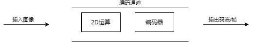
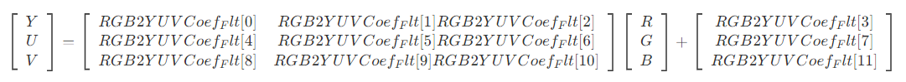
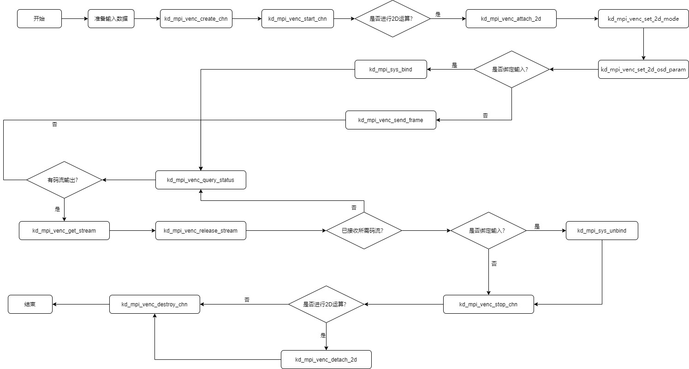
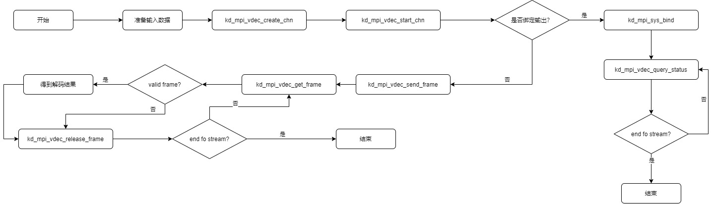
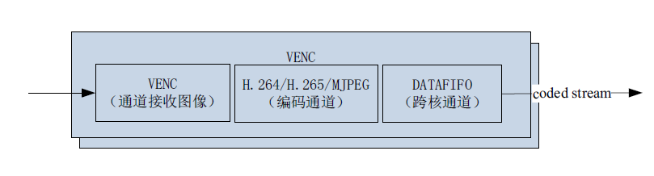

# K230视频编解码API参考

版权所有©2023北京嘉楠捷思信息技术有限公司

## 免责声明

您购买的产品、服务或特性等应受北京嘉楠捷思信息技术有限公司（“本公司”，下同）及其关联公司的商业合同和条款的约束，本文档中描述的全部或部分产品、服务或特性可能不在您的购买或使用范围之内。除非合同另有约定，本公司不对本文档的任何陈述、信息、内容的正确性、可靠性、完整性、适销性、符合特定目的和不侵权提供任何明示或默示的声明或保证。除非另有约定，本文档仅作为使用指导参考。

由于产品版本升级或其他原因，本文档内容将可能在未经任何通知的情况下，不定期进行更新或修改。

## 商标声明

、“嘉楠”和其他嘉楠商标均为北京嘉楠捷思信息技术有限公司及其关联公司的商标。本文档可能提及的其他所有商标或注册商标，由各自的所有人拥有。

**版权所有 © 2023北京嘉楠捷思信息技术有限公司。保留一切权利。**
非经本公司书面许可，任何单位和个人不得擅自摘抄、复制本文档内容的部分或全部，并不得以任何形式传播。

## 目录

[TOC]

## 前言

### 概述

本文档主要介绍视频编解码模块的功能和用法。

### 读者对象

本文档（本指南）主要适用于以下人员：

- 技术支持工程师
- 软件开发工程师

### 缩略词定义

| 简称 | 说明 |
|------|------|
|      |      |
|      |      |

### 修订记录

| 文档版本号 | 修改者 | 日期 | 修改说明 |
|---|---|---|---|
| V1.0       | 系统软件部 | 2023.03.10 | 初版  |
| V1.1       | 系统软件部 | 2023.03.31 | 1. 新增2d设置/获取运算模式接口kd_mpi_venc_set_2d_mode、 kd_mpi_venc_get_2d_mode 2.修改2d的参数设置/获取接口，kd_mpi_venc_set_2d_osd_param、 kd_mpi_venc_get_2d_osd_param 3. 新增设置2D运算中的图像格式转换系数接口kd_mpi_venc_set_2d_set_custom_coef 4. kd_mpi_venc_set_2d_set_custom_coef删除编码器属性结构体k_venc_attr的pic_format属性 |
| V1.1.1     | 系统软件部 | 2023.04.11 | 1. 新增编码图像旋转设置/获取接口 kd_mpi_venc_set_rotaion、 kd_mpi_venc_get_rotaion 2. 新增2D画框属性的设置/获取接口 kd_mpi_venc_set_2d_border_param、 kd_mpi_venc_get_2d_border_param 3. 删除2D运算属性结构体`k_venc_2d_attr`4. 增加OSD背景层格式说明 5. 增加部分MAPI函数接口及数据类型，具体是章节4 MAPI。|
| V1.2       | 系统软件部 | 2023.04.27 | 1. 修改2D画框结构体k_venc_2d_border_attr的线宽参数 2. 修改2D用户自定义转换系数API名称kd_mpi_venc_set_2d_custom_coef 3. 修改kd_mpi_venc_set_2d_custom_coef的转换系数参数类型。 4. 增加获取转换系数的接口kd_mpi_venc_get_2d_custom_coef 5. 增加色域设置和获取接口kd_mpi_venc_set_2d_color_gamut、kd_mpi_venc_get_2d_color_gamut 6. 修改kd_mpi_venc_set_rotaion的旋转角度参数。7. 修改视频编码功能描述中JPEG的输入格式 |
| V1.2.1     | 系统软件部 | 2023-04-28 | 1. 在 k_venc_chn_attr中增加GOP属性 |
| V1.2.2     | 系统软件部 | 2023-05-24 | 1. 增加图像翻转设置/获取接口kd_mpi_venc_set_mirror、kd_mpi_venc_get_mirror 2. 增加IDR帧使能接口kd_mpi_venc_enable_idr |
| V1.3       | 系统软件部 |  2023-05-25  | 1. mapi增加IDR帧使能接口 kd_mapi_venc_request_idr |
| V1.3.1       | 系统软件部 |  2023-06-14  | 1. 添加mpi可设置解码输出缩小的图像。kd_mpi_vdec_set_downscale |
| V1.3.2       | 系统软件部 |  2023-06-19  | 1. 修改kd_mapi_venc_request_idr 2. 增加kd_mpi_venc_request_idr、kd_mapi_venc_enable_idr 3.增加H.265 SAO设置和获取接口kd_mpi_venc_set_h265_sao、kd_mpi_venc_get_h265_sao 4. 增加deblocking设置/获取接口kd_mpi_venc_set_dblk、kd_mpi_venc_get_dblk 5. 增加ROI接口kd_mpi_venc_set_roi_attr、kd_mpi_venc_get_roi_attr |
| V1.3.3       | 系统软件部 |  2023-06-20  | 1. 增加H.264/H.265熵编码模式设置/获取接口kd_mpi_venc_set_h264_entropy、kd_mpi_venc_get_h264_entropy、kd_mpi_venc_set_h265_entropy、kd_mpi_venc_get_h265_entropy 2. k_venc_rotation枚举更明为k_rotation 3. 增加解码旋转设置接口kd_mpi_vdec_set_rotation |
| V1.3.4 | 系统软件部 | 2023-06-30 | 修改编解码及2D支持的数据类型 |

## 1. 概述

### 1.1 概述

视频编解码模块，支持H.264、H.265、JPEG编解码。VENC模块实现2D运算和编码功能，两者既可以同时使能，也可以单独运算。VDEC模块实现解码功能。

VENC、VENC+2D和VDEC支持系统绑定，2D单独运算时不支持系统绑定。

### 1.2 功能描述

#### 1.2.1 视频编码

图1-1编码数据流程图

典型的编码流程包括了输入图像的接收、图像内容的遮挡和覆盖、图像的编码、以及码流的输出等过程。

编码模块由VENC接收通道、编码通道、2D接收通道、2D运算模块组成。编码能力和2D运算能力见下表。

编码数据流程图中的绿色箭头所示路径，为单独做2D运算的流程。蓝色箭头所示路径为单独做编码运算的流程。紫色箭头所示路径为先做2D运算再进行编码的流程。

表 1-1 编码能力

| | H264 | HEVC | JPEG |
|---|---|---|---|
| 输入格式 | YUV420 NV12 8bit, ARGB8888, BGRA8888 | YUV420 NV12 8bit, ARGB8888, BGRA8888 | YUV420 NV12 8bit, YUV422 UYVY 8bit, ARGB8888, BGRA8888 |
| 输出格式 | YUV420 H.264 Baseline Profile(BP) ; H.264 Main Profile(MP) ; H.264 High Profile(HP);  H.264 High 10 Profile(HP) | YUV420 HEVC (H.265) Main ; HEVC (H.265) Main 10 Profile | YUV420 and YUV422 JPEG baseline sequential |
| 最大分辨率 | 3840x2160 | 3840x2160 | 8192x8192 |
| 码率控制模式 | CBR/VBR/FIXQP | CBR/VBR/FIXQP | FIXQP |
| GOP | I/P帧 | I/P帧 | - |
| 编码通道 | 4路 | 4路 | 4路 |

注意：H264/HEVC/JPEG共用4路。

表1-2 2D运算能力

| video输入格式 | video输出格式 | 叠加数据格式 | 最大分辨率 |
|---|---|---|---|
| I420/NV12/ARGB8888/BGRA8888 | 同输入格式 | ARGB8888/ARGB4444/ARGB1555 | 3840x2160  |

##### 1.2.1.1 编码通道

编码通道作为基本容器，保存编码通道的多种用户设置和管理编码通道的多种内部资源。编码通道完成图像叠加和编码的功能。2D模块实现图像叠加运算，编码器模块实现图像编码，两者既可以单独使用，也可以协同使用。

图1-2 编码通道

##### 1.2.1.2 码率控制

码率控制器实现对编码码率进行控制。

从信息学的角度分析，图像的压缩比越低，压缩图像的质量越高；图像压缩比例越高，压缩图像的质量越低。在场景变化的情况下，追求图像质量稳定，则编码码率会波动较大；如追求编码码率稳定，则图像质量会波动较大。

H264/H265编码支持CBR、VBR和FIXQP三种码率控制模式。

MJPEG只支持FIXQP模式。

###### 1.2.1.2.1 CBR

（Constant Bit Rate）固定比特率。即在码率统计时间内保证编码码率平稳。

###### 1.2.1.2.2 VBR

VBR（ Variable Bit Rate）可变比特率，即允许在码率统计时间内编码码率波动，从而保证编码图像质量平稳。

###### 1.2.1.2.3 FIXQP

FIXQP固定QP值。在码率统计时间内，编码图像所有宏块QP值相同，采用用户设定的图像QP值。

##### 1.2.1.3 GOP结构

本模块只支持I帧和P帧

##### 1.2.1.4 2D运算

2D运算模块可以实现对图像数据的OSD叠加，OSD模式可以实现8个region图像叠加，各region不重叠。支持的OSD格式有：ARGB4444/ARGB1555/ARGB8888。

###### 1.2.1.4.1 2D转换系数的计算

在OSD叠加运算时，如果输入video的格式为YUV，则OSD层需要做RGB to YUV的转换。内核态有一组默认的转换系数，用户如果需要自定义一组12bit的转换系数。转换系数由RGB to YUV的转换公式得到。

已知，RGB to YUV的转换公式如下：

则，3\*3矩阵中的系数乘以256后四舍五入取整得到对应的转换系数，3\*1矩阵中的值为对应的转换系数。

以BT709 LIMITED为例，RGB-\>YUV的转换公式为：

Y = 0.1826\*R + 0.6142\*G + 0.0620\*B + 16

U = -0.1007\*R - 0.3385\*G + 0.4392\*B + 128

V = 0.4392\*R - 0.3990\*G - 0.0402\*B + 128

得到，转换系数为：{ 47, 157, 16, 16, -26, -86, 112, 128, 112, -102, -10, 128 }

###### 1.2.1.4.2 2D转换系数的配置

2D转换系数可以通过用户自定义系数接口[kd_mpi_venc_set_2d_custom_coef](#2120-kd_mpi_venc_set_2d_custom_coef)和色域配置接口[kd_mpi_venc_set_2d_color_gamut](#2122-kd_mpi_venc_set_2d_color_gamut)进行配置，两者中选择一个接口进行配置即可。如果两个接口在开始运算前都没有调用，会使用默认系数进行色域转换。

##### 1.2.1.5 限制条件

编码运算存在以下限制：

1. 如果输入数据格式为YUV420，Y、U、V各分量的图像数据的物理起始地址需要保证4k对齐。
1. 如果输入数据格式为NV12，Y和UV数据的图像数据的物理起始地址需要保证4k对齐。

2D运算存在以下限制：

1. 源图像以及目的图像在ddr的物理起始地址要保证8byte align。
1. 支持图像、osd、框的尺寸为偶数。
1. 叠加和画框运算中的video数据的src和dst地址必须相同。

解码运算存在以下限制：

1. 每帧输入数据的物理起始地址需要4k对齐。

##### 1.2.1.6 编码典型应用举例

图1-3 编码典型应用场景流程图

#### 1.2.2 视频解码

表 12 vpu解码能力

| | H264 | HEVC | JPEG |
|:--|:--|:--|:--|
| 输入格式 | H.264 Baseline;H.264 Main;H.264 High;H.264 High10;支持interlaced stream | HEVC (H.265) Main/Main10 | JPEG, baseline sequential |
| 输出格式 | YUV420 NV12 | YUV420 NV12 | YUV422 UYVY, YUV420 NV12 |
| 解码通道 | 4路 | 4路 | 4路 |

注意：H264/HEVC/JPEG共用4路。

VDEC支持流式发送：

- 流式发送（ K_VDEC_SEND_MODE_STREAM）：用户每次可发送任意长度码流到解码器，由解码器内部完成一帧码流的识别过程。须注意，对H.264/H.265而言，在收到下一帧码流才能识别当前帧码流的结束，所以在该发送模式下，输入一帧H.264/H.265码流，不能希望马上开始解码图像。

##### 1.2.2.1 解码典型应用举例

图1-3 编码典型应用场景流程图

## 2. API参考

### 2.1 视频编码

该功能模块提供以下API：

- [kd_mpi_venc_create_chn](#211-kd_mpi_venc_create_chn)：创建编码通道。
- [kd_mpi_venc_destory_chn](#212-kd_mpi_venc_destory_chn)：销毁编码通道。
- [kd_mpi_venc_start_chn](#213-kd_mpi_venc_start_chn)：开启编码通道接收输入图像。
- [kd_mpi_venc_stop_chn](#214-kd_mpi_venc_stop_chn)：停止编码通道接收输入图像。
- [kd_mpi_venc_query_status](#215-kd_mpi_venc_query_status)：查询编码通道状态。
- [kd_mpi_venc_get_stream](#216-kd_mpi_venc_get_stream)：获取编码后的码流。
- [kd_mpi_venc_release_stream](#217-kd_mpi_venc_release_stream)：释放码流缓存。
- [kd_mpi_venc_send_frame](#218-kd_mpi_venc_send_frame)：支持用户发送原始图像进行编码。
- [kd_mpi_venc_set_rotaion](#219-kd_mpi_venc_set_rotaion)：设置编码图像旋转角度。
- [kd_mpi_venc_get_rotaion](#2110-kd_mpi_venc_get_rotaion)：获取编码图像旋转角度。
- [kd_mpi_venc_set_mirror](#2111-kd_mpi_venc_set_mirror)：设置编码图像旋转角度。
- [kd_mpi_venc_get_mirror](#2112-kd_mpi_venc_get_mirror)：获取编码图像翻转方式。
- [kd_mpi_venc_enable_idr](#2113-kd_mpi_venc_enable_idr)：使能IDR帧，根据GOP间隔产生IDR帧。
- [kd_mpi_venc_set_2d_mode](#2114-kd_mpi_venc_set_2d_mode)：设置2D运算模式。
- [kd_mpi_venc_get_2d_mode](#2115-kd_mpi_venc_get_2d_mode)：获取2D运算模式。
- [kd_mpi_venc_set_2d_osd_param](#2116-kd_mpi_venc_set_2d_osd_param)：设置2D运算中OSD的区域属性。
- [kd_mpi_venc_get_2d_osd_param](#2117-kd_mpi_venc_get_2d_osd_param)：获取2D运算中指定索引的OSD的区域属性。
- [kd_mpi_venc_set_2d_border_param](#2118-kd_mpi_venc_set_2d_border_param)：设置2D运算中的画框属性。
- [kd_mpi_venc_get_2d_border_param](#2119-kd_mpi_venc_get_2d_border_param)：获取2D运算中的画框属性。
- [kd_mpi_venc_set_2d_custom_coef](#2120-kd_mpi_venc_set_2d_custom_coef)：设置2D运算中的图像格式转换系数。
- [kd_mpi_venc_get_2d_custom_coef](#2121-kd_mpi_venc_get_2d_custom_coef)：获取2D运算中的图像格式转换系数。
- [kd_mpi_venc_set_2d_color_gamut](#2122-kd_mpi_venc_set_2d_color_gamut)：设置2D运算的色域。
- [kd_mpi_venc_get_2d_color_gamut](#2123-kd_mpi_venc_get_2d_color_gamut)：获取2D运算的色域
- [kd_mpi_venc_attach_2d](#2124-kd_mpi_venc_attach_2d)：将2D运算与venc关联。
- [kd_mpi_venc_detach_2d](#2125-kd_mpi_venc_detach_2d)：将2D运算与venc分离。
- [kd_mpi_venc_send_2d_frame](#2126-kd_mpi_venc_send_2d_frame)：向2D模块发送一帧数据。
- [kd_mpi_venc_get_2d_frame](#2127-kd_mpi_venc_get_2d_frame)：获取2D运算结果。
- [kd_mpi_venc_start_2d_chn](#2128-kd_mpi_venc_start_2d_chn)：开始2D通道接收输入图像。
- [kd_mpi_venc_stop_2d_chn](#2129-kd_mpi_venc_stop_2d_chn)：停止2D通道接收输入图像。
- [kd_mpi_venc_request_idr](#2130-kd_mpi_venc_request_idr)：请求IDR帧，在调用之后立即产生一个IDR帧。
- [kd_mpi_venc_set_h265_sao](#2131-kd_mpi_venc_set_h265_sao)：设置H.265通道的Sao属性。
- [kd_mpi_venc_get_h265_sao](#2132-kd_mpi_venc_get_h265_sao)：获取H.265通道的Sao属性。
- [kd_mpi_venc_set_dblk](#2133-kd_mpi_venc_set_dblk)：设置协议编码通道的Deblocking使能。
- [kd_mpi_venc_get_dblk](#2134-kd_mpi_venc_get_dblk)：获取协议编码通道的Deblocking状态。
- [kd_mpi_venc_set_roi_attr](#2135-kd_mpi_venc_set_roi_attr)：设置H.264/H.265通道的ROI属性。
- [kd_mpi_venc_get_roi_attr](#2136-kd_mpi_venc_get_roi_attr)：获取H.264/H.265通道的ROI属性。
- [kd_mpi_venc_set_h264_entropy](#2137-kd_mpi_venc_set_h264_entropy)：设置H.264协议编码通道的熵编码模式。
- [kd_mpi_venc_get_h264_entropy](#2138-kd_mpi_venc_get_h264_entropy)：获取H.264协议编码通道的熵编码模式。
- [kd_mpi_venc_set_h265_entropy](#2139-kd_mpi_venc_set_h265_entropy)：设置H.265协议编码通道的熵编码模式。
- [kd_mpi_venc_get_h265_entropy](#2140-kd_mpi_venc_get_h265_entropy)：获取H.265协议编码通道的熵编码模式。

#### 2.1.1 kd_mpi_venc_create_chn

【描述】

创建编码通道。

【语法】

k_s32 kd_mpi_venc_create_chn(k_u32 chn_num, const [k_venc_chn_attr](#3115-k_venc_chn_attr) \*attr);

【参数】

| 参数名称 | 描述 | 输入/输出 |
|---|---|---|
| chn_num  | 编码通道信息。 取值范围：[0, [VENC_MAX_CHN_NUM](#311-venc_max_chn_num))。 | 输入      |
| attr     | 编码通道属性指针。                                                   | 输入      |

【返回值】

| 返回值 | 描述 |
|---|---|
| 0      | 成功。                        |
| 非0    | 失败，参见[错误码](#5-错误码)。 |

【芯片差异】

无。

【需求】

- 头文件：mpi_venc_api.h，k_type.h，k_module.h，k_sys_comm.h，k_venc_comm.h
- 库文件：libvenc.a

【注意】

- 编码器支持通道宽高入下表所示：

| H.264/H.265 | JPEG   |       |        |      |     |      |     |
|-------------|--------|-------|--------|------|-----|------|-----|
| WIDTH       | HEIGHT | WIDTH | HEIGHT |      |     |      |     |
| MAX         | MIN    | MAX   | MIN    | MAX  | MIN | MAX  | MIN |
| 4096        | 128    | 4096  | 64     | 8192 | 128 | 8192 | 64  |

【举例】

无。

【相关主题】

无。

#### 2.1.2 kd_mpi_venc_destory_chn

【描述】

销毁编码通道。

【语法】

k_s32 kd_mpi_venc_destory_chn(k_u32 chn_num);

【参数】

| 参数名称 | 描述 | 输入/输出 |
|---|---|---|
| chn_num  | 编码通道号。 取值范围：[0, [VENC_MAX_CHN_NUM](#311-venc_max_chn_num))。 | 输入      |

【返回值】

| 返回值 | 描述                          |
|---|---|
| 0      | 成功。                        |
| 非0    | 失败，参见[错误码](#5-错误码)。 |

【芯片差异】

无。

【需求】

- 头文件：mpi_venc_api.h，k_type.h，k_module.h，k_sys_comm.h，k_venc_comm.h
- 库文件：libvenc.a

【注意】

- 销毁前必须停止接收图像，否则返回失败。

【举例】

无。

【相关主题】

[kd_mpi_venc_stop_chn](#214-kd_mpi_venc_stop_chn)

#### 2.1.3 kd_mpi_venc_start_chn

【描述】

开启编码通道接收输入图像。

【语法】

k_s32 kd_mpi_venc_start_chn(k_u32 chn_num);

【参数】

| 参数名称 | 描述 | 输入/输出 |
|---|---|---|
| chn_num | 编码通道号。 取值范围：[0, [VENC_MAX_CHN_NUM](#311-venc_max_chn_num))。 | 输入 |

【返回值】

| 返回值 | 描述                          |
|--------|-------------------------------|
| 0      | 成功。                        |
| 非0    | 失败，参见[错误码](#5-错误码)。 |

【芯片差异】

无。

【需求】

- 头文件：mpi_venc_api.h，k_type.h，k_module.h，k_sys_comm.h，k_venc_comm.h
- 库文件：libvenc.a

【注意】

- 如果通道未创建，则返回失败K_ERR_VENC_UNEXIST。
- 如果通道已经开始接收图像，没有停止接收图像前再一次调用此接口指定接收帧数，返回操作不允许。
- 只有开启接收之后编码器才开始接收图像编码。

【举例】

无。

【相关主题】

[kd_mpi_venc_create_chn](#211-kd_mpi_venc_create_chn)
[kd_mpi_venc_stop_chn](#214-kd_mpi_venc_stop_chn)

#### 2.1.4 kd_mpi_venc_stop_chn

【描述】

停止编码通道接收输入图像。

【语法】

k_s32 kd_mpi_venc_stop_chn(k_u32 chn_num);

【参数】

| 参数名称 | 描述 | 输入/输出 |
|---|---|---|
| chn_num | 编码通道号。 取值范围：[0, [VENC_MAX_CHN_NUM](#311-venc_max_chn_num))。 | 输入 |

【返回值】

| 返回值 | 描述                          |
|--------|-------------------------------|
| 0      | 成功。                        |
| 非0    | 失败，参见[错误码](#5-错误码)。 |

【芯片差异】

无。

【需求】

- 头文件：mpi_venc_api.h，k_type.h，k_module.h，k_sys_comm.h，k_venc_comm.h
- 库文件：libvenc.a

【注意】

- 如果通道未创建，则返回失败。
- 此接口并不判断当前是否停止接收，即允许重复停止接收不返回错误。
- 此接口用于编码通道停止接收图像来编码，在编码通道销毁或复位前必须停止接收图像。
- 调用此接口仅停止接收原始数据编码，码流buffer并不会被清除。

【举例】

无。

【相关主题】

[kd_mpi_venc_destory_chn](#212-kd_mpi_venc_destory_chn)

#### 2.1.5 kd_mpi_venc_query_status

【描述】

查询编码通道状态。

【语法】

k_s32 kd_mpi_venc_query_status(k_u32 chn_num, [k_venc_chn_status](#3115-k_venc_chn_attr) \*status);

【参数】

| 参数名称 | 描述 | 输入/输出 |
|---|---|---|
| chn_num  | 编码通道号。 取值范围：[0, [VENC_MAX_CHN_NUM](#311-venc_max_chn_num))。 | 输入 |
| status   | 编码通道的状态指针。                                                     | 输出 |

【返回值】

| 返回值 | 描述 |
|---|---|
| 0      | 成功。                        |
| 非0    | 失败，参见[错误码](#5-错误码)。 |

【芯片差异】

无。

【需求】

- 头文件：mpi_venc_api.h，k_type.h，k_module.h，k_sys_comm.h，k_venc_comm.h
- 库文件：libvenc.a

【注意】

- 如果通道未创建，则返回失败。

【举例】

无。

【相关主题】

[kd_mpi_venc_create_chn](#211-kd_mpi_venc_create_chn)

#### 2.1.6 kd_mpi_venc_get_stream

【描述】

获取编码后的码流。

【语法】

k_s32 kd_mpi_venc_get_stream(k_u32 chn_num, [k_venc_stream](#3123-k_venc_stream) \*stream, k_s32 milli_sec);

【参数】

| 参数名称  | 描述 | 输入/输出 |
|---|---|---|
| chn_num | 编码通道号。 取值范围：[0, [VENC_MAX_CHN_NUM](#311-venc_max_chn_num))。 | 输入 |
| stream    | 码流结构体指针. | 输出 |
| milli_sec | 获取码流超时时间。 取值范围： [-1, +∞ ) -1：阻塞。 0：非阻塞。 大于0：超时时间 | 输入 |

【返回值】

| 返回值 | 描述                          |
|--------|-------------------------------|
| 0      | 成功。                        |
| 非0    | 失败，参见[错误码](#5-错误码)。 |

【芯片差异】

无。

【需求】

- 头文件：mpi_venc_api.h，k_type.h，k_module.h，k_sys_comm.h，k_venc_comm.h
- 库文件：libvenc.a

【注意】

- 如果通道未创建，返回失败。
- 如果stream为空，返回K_ERR_VENC_NULL_PTR。
- 如果milli_sec小于-1，返回K_ERR_VENC_ILLEGAL_PARAM。

【举例】

无。

【相关主题】

[kd_mpi_venc_create_chn](#211-kd_mpi_venc_create_chn)
[kd_mpi_venc_start_chn](#213-kd_mpi_venc_start_chn)

#### 2.1.7 kd_mpi_venc_release_stream

【描述】

释放码流缓存。

【语法】

k_s32 kd_mpi_venc_release_stream(k_u32 chn_num, [k_venc_stream](#3123-k_venc_stream) \*stream);

【参数】

| 参数名称 | 描述 | 输入/输出 |
|---|---|---|
| chn_num  | 编码通道号。 取值范围：[0, [VENC_MAX_CHN_NUM](#311-venc_max_chn_num))。 | 输入 |
| stream   | 码流结构体指针。 | 输出 |

【返回值】

| 返回值 | 描述 |
|---|---|
| 0      | 成功。                        |
| 非0    | 失败，参见[错误码](#5-错误码)。 |

【芯片差异】

无。

【需求】

- 头文件：mpi_venc_api.h，k_type.h，k_module.h，k_sys_comm.h，k_venc_comm.h
- 库文件：libvenc.a

【注意】

- 如果通道未创建，则返回错误码K_ERR_VENC_UNEXIST。
- 如果stream为空，则返回错误码K_ERR_VENC_NULL_PTR。

【举例】

无。

【相关主题】

[kd_mpi_venc_create_chn](#211-kd_mpi_venc_create_chn)
[kd_mpi_venc_start_chn](#213-kd_mpi_venc_start_chn)

#### 2.1.8 kd_mpi_venc_send_frame

【描述】

支持用户发送原始图像进行编码。

【语法】

k_s32 kd_mpi_venc_send_frame(k_u32 chn_num, k_video_frame_info \*frame, k_s32 milli_sec);

【参数】

| 参数名称  | 描述 | 输入/输出 |
|---|---|---|
| chn_num | 编码通道号。 取值范围：[0, [VENC_MAX_CHN_NUM](#311-venc_max_chn_num))。 | 输入 |
| frame | 原始图像信息结构指针，参考《K230 系统控制 API参考》。 | 输入 |
| milli_sec | 发送图像超时时间。 取值范围： [-1,+∞ ) -1：阻塞。 0：非阻塞。 \> 0：超时时间。 | 输入 |

【返回值】

| 返回值 | 描述 |
|---|---|
| 0      | 成功。                        |
| 非0    | 失败，参见[错误码](#5-错误码)。 |

【芯片差异】

无。

【需求】

- 头文件：mpi_venc_api.h，k_type.h，k_module.h，k_sys_comm.h，k_venc_comm.h
- 库文件：libvenc.a

【注意】

- 此接口支持用户发送图像至编码通道。
- 如果milli_sec小于-1，返回K_ERR_VENC_ILLEGAL_PARAM。
- 调用该接口发送图像，用户需要保证编码通道已创建且开启接收输入图像。

【举例】

无。

【相关主题】

[kd_mpi_venc_create_chn](#211-kd_mpi_venc_create_chn)
[kd_mpi_venc_start_chn](#213-kd_mpi_venc_start_chn)

#### 2.1.9 kd_mpi_venc_set_rotaion

【描述】

设置编码图像旋转角度。

【语法】

k_s32 kd_mpi_venc_set_rotaion(k_u32 chn_num, const [k_rotation](#3112-k_rotation) rotation);

【参数】

| 参数名称 | 描述 | 输入/输出 |
|---|---|---|
| chn_num  | 通道号。 取值范围：[0, [VENC_MAX_CHN_NUM](#311-venc_max_chn_num))。 | 输入 |
| rotation | 旋转角度枚举。 | 输入      |

【返回值】

| 返回值 | 描述                          |
|--------|-------------------------------|
| 0      | 成功。                        |
| 非0    | 失败，返回[错误码](#5-错误码)。 |

【芯片差异】

无。

【需求】

- 头文件：mpi_venc_api.h，k_type.h，k_module.h，k_sys_comm.h，k_venc_comm.h
- 库文件：libvenc.a

【注意】

无。

【举例】

无。

【相关主题】

无。

#### 2.1.10 kd_mpi_venc_get_rotaion

【描述】

获取编码图像旋转角度。

【语法】

k_s32 kd_mpi_venc_get_rotaion(k_u32 chn_num, [k_rotation](#3112-k_rotation) \*rotation);

【参数】

| 参数名称 | 描述 | 输入/输出 |
|---|---|---|
| chn_num  | 通道号。 取值范围：[0, [VENC_MAX_CHN_NUM](#311-venc_max_chn_num))。 | 输入      |
| rotation | 旋转角度枚举指针。                                                   | 输出      |

【返回值】

| 返回值 | 描述                          |
|--------|-------------------------------|
| 0      | 成功。                        |
| 非0    | 失败，返回[错误码](#5-错误码)。 |

【芯片差异】

无。

【需求】

- 头文件：mpi_venc_api.h，k_type.h，k_module.h，k_sys_comm.h，k_venc_comm.h
- 库文件：libvenc.a

【注意】

无。

【举例】

无。

【相关主题】

无。

#### 2.1.11 kd_mpi_venc_set_mirror

【描述】

设置编码图像镜像方式。

【语法】

k_s32 kd_mpi_venc_set_mirror(k_u32 chn_num, const [k_venc_mirror](#3113-k_venc_mirror) mirror);

【参数】

| 参数名称 | 描述 | 输入/输出 |
|---|---|---|
| chn_num | 通道号。取值范围：[0, VENC_MAX_CHN_NUM)。 | 输入 |
| mirror | 翻转方式枚举。 | 输入 |

【返回值】

| 返回值 | 描述 |
|---|---|
| 0      | 成功。                        |
| 非0    | 失败，返回[错误码](#5-错误码)。 |

【芯片差异】

无。
【需求】

- 头文件：mpi_venc_api.h，k_type.h，k_module.h，k_sys_comm.h，k_venc_comm.h
- 库文件：libvenc.a

【注意】

无。
【举例】

无。
【相关主题】

无。

#### 2.1.12 kd_mpi_venc_get_mirror

【描述】

设置编码图像镜像方式。
【语法】

| k_s32 kd_mpi_venc_get_mirror(k_u32 chn_num, [k_venc_mirror](#3113-k_venc_mirror) mirror);|

【参数】

| 参数名称 | 描述 | 输入/输出 |
|---|---|---|
| chn_num | 通道号。取值范围：[0, VENC_MAX_CHN_NUM)。 | 输入 |
| mirror | 翻转方式枚举。 | 输出 |

【返回值】

| 返回值 | 描述 |
|---|---|
| 0      | 成功。                        |
| 非0    | 失败，返回[错误码](#5-错误码)。 |

【芯片差异】

无。
【需求】

- 头文件：mpi_venc_api.h，k_type.h，k_module.h，k_sys_comm.h，k_venc_comm.h
- 库文件：libvenc.a

【注意】

无。
【举例】

无。
【相关主题】

无。

#### 2.1.13 kd_mpi_venc_enable_idr

【描述】

设置IDR帧使能。

【语法】

k_s32 kd_mpi_venc_enable_idr(k_u32 chn_num, const k_bool idr_enable);

【参数】

| 参数名称 | 描述 | 输入/输出 |
|---|---|---|
| chn_num  | 通道号。 取值范围：[0,  [K_VENC_2D_MAX_CHN_NUM](#311-venc_max_chn_num))。 | 输入 |
| idr_enable | 是否使能IDR帧。0：不使能。1：使能。 | 输入 |

【返回值】

| 返回值 | 描述                          |
|--------|-------------------------------|
| 0      | 成功。                        |
| 非0    | 失败，返回[错误码](#5-错误码)。 |

【芯片差异】

无。

【需求】

- 头文件：mpi_venc_api.h，k_type.h，k_module.h，k_sys_comm.h，k_venc_comm.h
- 库文件：libvenc.a

【注意】

- 本接口需要在创建编码通道之后，开始编码通道之前调用。

【举例】

无。

【相关主题】

无。

#### 2.1.14 kd_mpi_venc_set_2d_mode

【描述】

设置2D运算模式。

【语法】

k_s32 kd_mpi_venc_set_2d_mode(k_u32 chn_num, const [k_venc_2d_calc_mode](#318-k_venc_2d_calc_mode) mode);

【参数】

| 参数名称 | 描述 | 输入/输出 |
|---|---|---|
| chn_num  | 通道号。 取值范围：[0,  [K_VENC_2D_MAX_CHN_NUM](#311-venc_max_chn_num))。 | 输入 |
| mode     | 2D运算模式枚举。 | 输入 |

【返回值】

| 返回值 | 描述 |
|---|---|
| 0      | 成功。                        |
| 非0    | 失败，返回[错误码](#5-错误码)。 |

【芯片差异】

无。

【需求】

- 头文件：mpi_venc_api.h，k_type.h，k_module.h，k_sys_comm.h，k_venc_comm.h
- 库文件：libvenc.a

【注意】

- 目前运算模式不支持K_VENC_2D_CALC_MODE_CSC模式。

【举例】

无。

【相关主题】

无。

#### 2.1.15 kd_mpi_venc_get_2d_mode

【描述】

获取2D运算模式。

【语法】

k_s32 kd_mpi_venc_get_2d_mode(k_u32 chn_num, [k_venc_2d_calc_mode](#318-k_venc_2d_calc_mode) \*mode);

【参数】

| 参数名称 | 描述 | 输入/输出 |
|---|---|---|
| chn_num  | 通道号。 取值范围：[0,  [K_VENC_2D_MAX_CHN_NUM](#311-venc_max_chn_num))。 | 输入 |
| mode     | 2D运算模式枚举指针。                                                      | 输出 |

【返回值】

| 返回值 | 描述                          |
|---|---|
| 0      | 成功。                        |
| 非0    | 失败，返回[错误码](#5-错误码)。 |

【芯片差异】

无。

【需求】

- 头文件：mpi_venc_api.h，k_type.h，k_module.h，k_sys_comm.h，k_venc_comm.h

- 库文件：libvenc.a

【注意】

- 目前运算模式不支持K_VENC_2D_CALC_MODE_CSC模式。

【举例】

无。

【相关主题】

无。

#### 2.1.16 kd_mpi_venc_set_2d_osd_param

【描述】

设置2D运算中OSD的区域属性。

【语法】

k_s32 kd_mpi_venc_set_2d_osd_param(k_u32 chn_num, k_u8 index, const [k_venc_2d_osd_attr](#3125-k_venc_2d_osd_attr) \*attr);

【参数】

| 参数名称 | 描述 | 输入/输出 |
|---|---|---|
| chn_num  | 通道号。 取值范围：[0,  [K_VENC_2D_MAX_CHN_NUM](#311-venc_max_chn_num))。 | 输入 |
| index    | OSD区域索引。 取值范围：[0, [K_VENC_MAX_2D_OSD_REGION_NUM](#312-k_venc_max_2d_osd_region_num))。 | 输入 |
| attr     | OSD属性指针。                                                                               | 输入 |

【返回值】

| 返回值 | 描述                          |
|--------|-------------------------------|
| 0      | 成功。                        |
| 非0    | 失败，返回[错误码](#5-错误码)。 |

【芯片差异】

无。

【需求】

- 头文件：mpi_venc_api.h，k_type.h，k_module.h，k_sys_comm.h，k_venc_comm.h
- 库文件：libvenc.a

【注意】

- 如果有n个叠加区域，索引值应分别设置为0\~n-1。

【举例】

无。

【相关主题】

无。

#### 2.1.17 kd_mpi_venc_get_2d_osd_param

【描述】

获取2D运算中指定索引的OSD的区域属性。

【语法】

k_s32 kd_mpi_venc_get_2d_osd_param(k_u32 chn_num, k_u8 index, const [k_venc_2d_osd_attr](#3125-k_venc_2d_osd_attr) \*attr);

【参数】

| 参数名称 | 描述 | 输入/输出 |
|---|---|---|
| chn_num  | 通道号。 取值范围：[0,  [K_VENC_2D_MAX_CHN_NUM](#311-venc_max_chn_num))。 | 输入 |
| index    | OSD区域索引。 取值范围：[0, [K_VENC_MAX_2D_OSD_REGION_NUM](#312-k_venc_max_2d_osd_region_num))。 | 输入 |
| attr     | OSD属性指针。 | 输出 |

【返回值】

| 返回值 | 描述                          |
|--------|-------------------------------|
| 0      | 成功。                        |
| 非0    | 失败，返回[错误码](#5-错误码)。 |

【芯片差异】

无。

【需求】

- 头文件：mpi_venc_api.h，k_type.h，k_module.h，k_sys_comm.h，k_venc_comm.h
- 库文件：libvenc.a

【注意】

无。

【举例】

无。

【相关主题】

无。

#### 2.1.18 kd_mpi_venc_set_2d_border_param

【描述】

设置2D运算中的画框属性。

【语法】

k_s32 kd_mpi_venc_set_2d_border_param(k_u32 chn_num, k_u8 index, const [k_venc_2d_border_attr](#3126-k_venc_2d_border_attr) \*attr);

【参数】

| 参数名称 | 描述 | 输入/输出 |
|---|---|---|
| chn_num  | 通道号。 取值范围：[0,  [K_VENC_2D_MAX_CHN_NUM](#311-venc_max_chn_num))。        | 输入 |
| index    | 画框索引。 取值范围：[0, [K_VENC_MAX_2D_BORDER_NUM](#313-k_venc_max_2d_border_num))。 | 输入 |
| attr     | 画框属性指针。 | 输入 |

【返回值】

| 返回值 | 描述                          |
|--------|-------------------------------|
| 0      | 成功。                        |
| 非0    | 失败，返回[错误码](#5-错误码)。 |

【芯片差异】

无。

【需求】

- 头文件：mpi_venc_api.h，k_type.h，k_module.h，k_sys_comm.h，k_venc_comm.h
- 库文件：libvenc.a

【注意】

- 如果有n个框，索引值应分别设置为0\~n-1。

【举例】

无。

【相关主题】

无。

#### 2.1.19 kd_mpi_venc_get_2d_border_param

【描述】

获取2D运算中的画框属性。

【语法】

k_s32 kd_mpi_venc_get_2d_border_param(k_u32 chn_num, k_u8 index, [k_venc_2d_border_attr](#3126-k_venc_2d_border_attr) \*attr);

【参数】

| 参数名称 | 描述 | 输入/输出 |
|---|---|---|
| chn_num  | 通道号。 取值范围：[0,  [K_VENC_2D_MAX_CHN_NUM](#311-venc_max_chn_num))。 | 输入 |
| index    | 画框索引。 取值范围：[0, [K_VENC_MAX_2D_BORDER_NUM](#313-k_venc_max_2d_border_num))。 | 输入 |
| attr     | 画框属性指针。 | 输出 |

【返回值】

| 返回值 | 描述 |
|---|---|
| 0      | 成功。                        |
| 非0    | 失败，返回[错误码](#5-错误码)。 |

【芯片差异】

无。

【需求】

- 头文件：mpi_venc_api.h，k_type.h，k_module.h，k_sys_comm.h，k_venc_comm.h
- 库文件：libvenc.a

【注意】

无。

【举例】

无。

【相关主题】

无。

#### 2.1.20 kd_mpi_venc_set_2d_custom_coef

【描述】

设置2D运算中的图像格式转换系数。

【语法】

k_s32 kd_mpi_venc_set_2d_custom_coef(k_u32 chn_num, const k_s16 \*coef);

【参数】

| 参数名称 | 描述 | 输入/输出 |
|---|---|---|
| chn_num  | 通道号。 取值范围：[0,  [K_VENC_2D_MAX_CHN_NUM](#311-venc_max_chn_num))。 | 输入 |
| coef     | 转换系数指针。参考[2D转换系数的计算](#12141-2d转换系数的计算)                    | 输入 |

【返回值】

| 返回值 | 描述 |
|---|---|
| 0      | 成功。                        |
| 非0    | 失败，返回[错误码](#5-错误码)。 |

【芯片差异】

无。

【需求】

- 头文件：mpi_venc_api.h，k_type.h，k_module.h，k_sys_comm.h，k_venc_comm.h
- 库文件：libvenc.a

【注意】

- 内核态有一组默认的转换系数，如需自定义转换系数，可通过本接口配置。
- 本接口调用应该在设置运算模式之后。
- 转换系数的说明，详见[2D转换系数的计算](#12141-2d转换系数的计算)
- 在运算模式为K_VENC_2D_CALC_MODE_BORDER时，不适用转换系数，调用本接口会报错。

【举例】

无。

【相关主题】

[kd_mpi_venc_set_2d_mode](#2114-kd_mpi_venc_set_2d_mode)

#### 2.1.21 kd_mpi_venc_get_2d_custom_coef

【描述】

获取2D运算中的图像格式转换系数。

【语法】

k_s32 kd_mpi_venc_get_2d_custom_coef(k_u32 chn_num, k_s16 \*coef);

【参数】

| 参数名称 | 描述 | 输入/输出 |
|---|---|---|
| chn_num  | 通道号。 取值范围：[0,  [K_VENC_2D_MAX_CHN_NUM](#311-venc_max_chn_num))。 | 输入 |
| coef     | 转换系数指针。参考[2D转换系数的计算](#12141-2d转换系数的计算)  | 输出 |

【返回值】

| 返回值 | 描述                          |
|--------|-------------------------------|
| 0      | 成功。                        |
| 非0    | 失败，返回[错误码](#5-错误码)。 |

【芯片差异】

无。

【需求】

- 头文件：mpi_venc_api.h，k_type.h，k_module.h，k_sys_comm.h，k_venc_comm.h
- 库文件：libvenc.a

【注意】

- 本接口调用应该在设置运算模式之后。
- 在运算模式为K_VENC_2D_CALC_MODE_BORDER时，不适用转换系数，调用本接口会报错。

【举例】

无。

【相关主题】

无。

#### 2.1.22 kd_mpi_venc_set_2d_color_gamut

【描述】

设置2D运算的色域。

【语法】

k_s32 kd_mpi_venc_set_2d_color_gamut(k_u32 chn_num, const [k_venc_2d_color_gamut](#3114-k_venc_2d_color_gamut) color_gamut);

【参数】

| 参数名称    | 描述 | 输入/输出 |
|---|---|---|
| chn_num     | 通道号。 取值范围：[0,  [K_VENC_2D_MAX_CHN_NUM](#311-venc_max_chn_num))。 | 输入 |
| color_gamut | 色域枚举。 | 输入 |

【返回值】

| 返回值 | 描述                          |
|--------|-------------------------------|
| 0      | 成功。                        |
| 非0    | 失败，返回[错误码](#5-错误码)。 |

【芯片差异】

无。

【需求】

- 头文件：mpi_venc_api.h，k_type.h，k_module.h，k_sys_comm.h，k_venc_comm.h
- 库文件：libvenc.a

【注意】

- 内核态有一组默认的转换系数，如需自定义转换系数，可通过本接口配置。
- 本接口调用应该在设置运算模式之后。
- 在运算模式为K_VENC_2D_CALC_MODE_BORDER时，不适用色域，调用本接口会报错。

【举例】

无。

【相关主题】

无。

#### 2.1.23 kd_mpi_venc_get_2d_color_gamut

【描述】

获取2D运算的色域。

【语法】

k_s32 kd_mpi_venc_get_2d_color_gamut(k_u32 chn_num, [k_venc_2d_color_gamut](#3114-k_venc_2d_color_gamut) \*color_gamut);

【参数】

| 参数名称    | 描述 | 输入/输出 |
|---|---|---|
| chn_num     | 通道号。 取值范围：[0,  [K_VENC_2D_MAX_CHN_NUM](#311-venc_max_chn_num))。 | 输入 |
| color_gamut | 色域枚举指针。 | 输出 |

【返回值】

| 返回值 | 描述 |
|---|---|
| 0      | 成功。                        |
| 非0    | 失败，返回[错误码](#5-错误码)。 |

【芯片差异】

无。

【需求】

- 头文件：mpi_venc_api.h，k_type.h，k_module.h，k_sys_comm.h，k_venc_comm.h
- 库文件：libvenc.a

【注意】

- 内核态有一组默认的转换系数，如需自定义转换系数，可通过本接口配置。
- 本接口调用应该在设置运算模式之后。
- 在运算模式为K_VENC_2D_CALC_MODE_BORDER时，不适用色域，调用本接口会报错。

【举例】

无。

【相关主题】

无。

#### 2.1.24 kd_mpi_venc_attach_2d

【描述】

将2D运算与venc关联。

【语法】

k_s32 kd_mpi_venc_attach_2d(k_u32 chn_num);

【参数】

| 参数名称 | 描述 | 输入/输出 |
|---|---|---|
| chn_num  | 通道号。 取值范围：[0,  [K_VENC_2D_MAX_CHN_NUM](#311-venc_max_chn_num))。 | 输入 |

【返回值】

| 返回值 | 描述 |
|---|---|
| 0      | 成功。                        |
| 非0    | 失败，返回[错误码](#5-错误码)。 |

【芯片差异】

无。

【需求】

- 头文件：mpi_venc_api.h，k_type.h，k_module.h，k_sys_comm.h，k_venc_comm.h
- 库文件：libvenc.a

【注意】

- 目前绑定只支持编码通道号和2D运算通道号相同的模式。只有前3路编码支持attach 2D操作。

【举例】

无。

【相关主题】

无。

#### 2.1.25 kd_mpi_venc_detach_2d

【描述】

将2D运算与venc分离。

【语法】

k_s32 kd_mpi_venc_detach_2d(k_u32 chn_num);

【参数】

| 参数名称 | 描述 | 输入/输出 |
|---|---|---|
| chn_num  | 2D运算通道号。 取值范围：[0,  [K_VENC_2D_MAX_CHN_NUM](#311-venc_max_chn_num))。 | 输入 |

【返回值】

| 返回值 | 描述 |
|---|---|
| 0      | 成功。                        |
| 非0    | 失败，返回[错误码](#5-错误码)。 |

【芯片差异】

无。

【需求】

- 头文件：mpi_venc_api.h，k_type.h，k_module.h，k_sys_comm.h，k_venc_comm.h
- 库文件：libvenc.a

【注意】

- 调用该接口，用户需要保证编码通道已停止。

【举例】

无。

【相关主题】

[kd_mpi_venc_stop_chn](#214-kd_mpi_venc_stop_chn)

#### 2.1.26 kd_mpi_venc_send_2d_frame

【描述】

向2D模块发送一帧数据。

【语法】

| k_s32 kd_mpi_venc_send_2d_frame(k_u32 chn_num, const k_video_frame_info \*frame, k_s32 milli_sec);

【参数】

| 参数名称  | 描述 | 输入/输出 |
|---|---|---|
| chn_num | 2D运算通道号，取值范围[0, [K_VENC_2D_MAX_CHN_NUM](#311-venc_max_chn_num))。 | 输入 |
| frame | 原始图像信息结构指针，参考《K230 系统控制 API参考》。 | 输入 |
| milli_sec | 发送图像超时时间。 取值范围： [-1,+∞ ) -1：阻塞。 0：非阻塞。 \> 0：超时时间。 | 输入 |

【返回值】

| 返回值 | 描述 |
|---|---|
| 0      | 成功。                      |
| 非0    | 失败，返回[错误码](#5-错误码) |

【芯片差异】

无。

【需求】

- 头文件：mpi_venc_api.h，k_type.h，k_module.h，k_sys_comm.h，k_venc_comm.h
- 库文件：libvenc.a

【注意】

- 本接口只在单2D运算的场景使用，在2D运算后再进行编码的场景，需要使用venc发送图形的接口[kd_mpi_venc_send_frame](#218-kd_mpi_venc_send_frame)。

【举例】

无。

【相关主题】

[kd_mpi_venc_send_frame](#218-kd_mpi_venc_send_frame)

#### 2.1.27 kd_mpi_venc_get_2d_frame

【描述】

获取2D运算结果。

【语法】

k_s32 kd_mpi_venc_get_2d_frame(k_u32 chn_num, k_video_frame_info \*frame, k_s32 milli_sec);

【参数】

| 参数名称  | 描述 | 输入/输出 |
|---|---|---|
| chn_num | 2D运算通道号，取值范围[0, [K_VENC_2D_MAX_CHN_NUM](#311-venc_max_chn_num))。 | 输入  |
| frame | 输出图像信息结构指针，参考《K230 系统控制 API参考》。                          | 输入 |
| milli_sec | 发送图像超时时间。 取值范围： [-1,+∞ ) -1：阻塞。 0：非阻塞。 \> 0：超时时间。 | 输入 |

【返回值】

| 返回值 | 描述                          |
|--------|-------------------------------|
| 0      | 成功。                        |
| 非0    | 失败，返回[错误码](#5-错误码)。 |

【芯片差异】

无。

【需求】

- 头文件：mpi_venc_api.h，k_type.h，k_module.h，k_sys_comm.h，k_venc_comm.h
- 库文件：libvenc.a

【注意】

- 本接口只在单2D运算的场景使用，在2D运算后再进行编码的场景，获取编码后的码流需要使用[kd_mpi_venc_get_stream](#216-kd_mpi_venc_get_stream)

【举例】

无。

【相关主题】

[kd_mpi_venc_get_stream](#216-kd_mpi_venc_get_stream)

#### 2.1.28 kd_mpi_venc_start_2d_chn

【描述】

开始2D通道接收输入图像。

【语法】

k_s32 kd_mpi_venc_start_2d_chn(k_u32 chn_num);

【参数】

| 参数名称 | 描述 | 输入/输出 |
|---|---|---|
| chn_num  | 2D运算通道号，取值范围[0, [K_VENC_2D_MAX_CHN_NUM](#311-venc_max_chn_num))。 | 输入      |

【返回值】

| 返回值 | 描述                          |
|--------|-------------------------------|
| 0      | 成功。                        |
| 非0    | 失败，返回[错误码](#5-错误码)。 |

【芯片差异】

无。

【需求】

- 头文件：mpi_venc_api.h，k_type.h，k_module.h，k_sys_comm.h，k_venc_comm.h

【注意】

- 本接口只在单2D运算的场景使用，在VENC+2D的场景，需要调用[kd_mpi_venc_start_chn](#213-kd_mpi_venc_start_chn)

【举例】

无。

【相关主题】

[kd_mpi_venc_start_chn](#213-kd_mpi_venc_start_chn)

#### 2.1.29 kd_mpi_venc_stop_2d_chn

【描述】

停止2D通道接收输入图像。

【语法】

k_s32 kd_mpi_venc_stop_2d_chn(k_u32 chn_num);

【参数】

| 参数名称 | 描述 | 输入/输出 |
|---|---|---|
| chn_num | 2D运算通道号，取值范围[0, [K_VENC_2D_MAX_CHN_NUM](#311-venc_max_chn_num))。 | 输入 |

【返回值】

| 返回值 | 描述                          |
|--------|-------------------------------|
| 0      | 成功。                        |
| 非0    | 失败，返回[错误码](#5-错误码)。 |

【芯片差异】

无。

【需求】

- 头文件：mpi_venc_api.h，k_type.h，k_module.h，k_sys_comm.h，k_venc_comm.h
- 库文件：libvenc.a

【注意】

无。

【举例】

无。

【相关主题】

无。

#### 2.1.30 kd_mpi_venc_request_idr

【描述】

请求IDR帧，在调用之后立即产生一个IDR帧。

【语法】

k_s32 kd_mpi_venc_request_idr(k_u32 chn_num);

【参数】

| 参数名称 | 描述 | 输入/输出 |
|---|---|---|
| chn_num  | 通道号。 取值范围：[0,  [K_VENC_2D_MAX_CHN_NUM](#311-venc_max_chn_num))。 | 输入 |

【返回值】

| 返回值 | 描述                          |
|--------|-------------------------------|
| 0      | 成功。                        |
| 非0    | 失败，返回[错误码](#5-错误码)。 |

【芯片差异】

无。

【需求】

- 头文件：mpi_venc_api.h，k_type.h，k_module.h，k_sys_comm.h，k_venc_comm.h
- 库文件：libvenc.a

【注意】

无。

【举例】

无。

【相关主题】

无。

#### 2.1.31 kd_mpi_venc_set_h265_sao

【描述】

设置H.265通道的Sao属性。

【语法】

k_s32 kd_mpi_venc_set_h265_sao(k_u32 chn_num, const [k_venc_h265_sao](#3127-k_venc_h265_sao) *h265_sao);

【参数】

| 参数名称 | 描述 | 输入/输出 |
|---|---|---|
| chn_num  | 通道号。 取值范围：[0,  [K_VENC_2D_MAX_CHN_NUM](#311-venc_max_chn_num))。 | 输入 |
| h265_sao | H.265协议编码通道的Sao配置。 | 输入 |

【返回值】

| 返回值 | 描述                          |
|--------|-------------------------------|
| 0      | 成功。                        |
| 非0    | 失败，返回[错误码](#5-错误码)。 |

【芯片差异】

无。

【需求】

- 头文件：mpi_venc_api.h，k_type.h，k_module.h，k_sys_comm.h，k_venc_comm.h
- 库文件：libvenc.a

【注意】

- 本接口需要在创建编码通道之后，开始编码通道之前调用。

【举例】

无。

【相关主题】

无。

#### 2.1.32 kd_mpi_venc_get_h265_sao

【描述】

获取H.265通道的Sao属性。

【语法】

k_s32 kd_mpi_venc_get_h265_sao(k_u32 chn_num, [k_venc_h265_sao](#3127-k_venc_h265_sao) *h265_sao);

【参数】

| 参数名称 | 描述 | 输入/输出 |
|---|---|---|
| chn_num  | 通道号。 取值范围：[0,  [K_VENC_2D_MAX_CHN_NUM](#311-venc_max_chn_num))。 | 输入 |
| h265_sao | H.265协议编码通道的Sao配置。 | 输出 |

【返回值】

| 返回值 | 描述                          |
|--------|-------------------------------|
| 0      | 成功。                        |
| 非0    | 失败，返回[错误码](#5-错误码)。 |

【芯片差异】

无。

【需求】

- 头文件：mpi_venc_api.h，k_type.h，k_module.h，k_sys_comm.h，k_venc_comm.h
- 库文件：libvenc.a

【注意】

无。

【举例】

无。

【相关主题】

无。

#### 2.1.33 kd_mpi_venc_set_dblk

【描述】

设置H.264/H.265协议编码通道的Deblocking使能。

【语法】

k_s32 kd_mpi_venc_set_dblk(k_u32 chn_num, const k_bool dblk_en);

【参数】

| 参数名称 | 描述 | 输入/输出 |
|---|---|---|
| chn_num  | 通道号。 取值范围：[0,  [K_VENC_2D_MAX_CHN_NUM](#311-venc_max_chn_num))。 | 输入 |
| dblk_en | 是否使能deblocking。K_TRUE：使能。K_FALSE：不使能。默认使能。 | 输入 |

【返回值】

| 返回值 | 描述                          |
|--------|-------------------------------|
| 0      | 成功。                        |
| 非0    | 失败，返回[错误码](#5-错误码)。 |

【芯片差异】

无。

【需求】

- 头文件：mpi_venc_api.h，k_type.h，k_module.h，k_sys_comm.h，k_venc_comm.h
- 库文件：libvenc.a

【注意】

- 本接口需要在创建编码通道之后，开始编码通道之前调用。

【举例】

无。

【相关主题】

无。

#### 2.1.34 kd_mpi_venc_get_dblk

【描述】

获取H.264/H.265协议编码通道的Deblocking状态。

【语法】

k_s32 kd_mpi_venc_get_dblk(k_u32 chn_num, k_bool *dblk_en);

【参数】

| 参数名称 | 描述 | 输入/输出 |
|---|---|---|
| chn_num  | 通道号。 取值范围：[0,  [K_VENC_2D_MAX_CHN_NUM](#311-venc_max_chn_num))。 | 输入 |
| dblk_en | 是否使能deblocking。K_TRUE：使能。K_FALSE：不使能。默认使能。 | 输出 |

【返回值】

| 返回值 | 描述                          |
|--------|-------------------------------|
| 0      | 成功。                        |
| 非0    | 失败，返回[错误码](#5-错误码)。 |

【芯片差异】

无。

【需求】

- 头文件：mpi_venc_api.h，k_type.h，k_module.h，k_sys_comm.h，k_venc_comm.h
- 库文件：libvenc.a

【注意】

无。

【举例】

无。

【相关主题】

无。

#### 2.1.35 kd_mpi_venc_set_roi_attr

【描述】

设置H.264/H.265通道的ROI属性。

【语法】

k_s32 kd_mpi_venc_set_roi_attr(k_u32 chn_num, const [k_venc_roi_attr](#3129-k_venc_roi_attr) *roi_attr);

【参数】

| 参数名称 | 描述 | 输入/输出 |
|---|---|---|
| chn_num  | 通道号。 取值范围：[0,  [K_VENC_2D_MAX_CHN_NUM](#311-venc_max_chn_num))。 | 输入 |
| dblk_en | 是否使能deblocking。K_TRUE：使能。K_FALSE：不使能。默认使能。 | 输入 |

【返回值】

| 返回值 | 描述                          |
|--------|-------------------------------|
| 0      | 成功。                        |
| 非0    | 失败，返回[错误码](#5-错误码)。 |

【芯片差异】

无。

【需求】

- 头文件：mpi_venc_api.h，k_type.h，k_module.h，k_sys_comm.h，k_venc_comm.h
- 库文件：libvenc.a

【注意】

- 本接口需要在创建编码通道之后，开始编码通道之前调用。

【举例】

无。

【相关主题】

无。

#### 2.1.36 kd_mpi_venc_get_roi_attr

【描述】

获取H.264/H.265通道的ROI属性。

【语法】

k_s32 kd_mpi_venc_get_roi_attr(k_u32 chn_num, [k_venc_roi_attr](#3129-k_venc_roi_attr) *roi_attr);

【参数】

| 参数名称 | 描述 | 输入/输出 |
|---|---|---|
| chn_num  | 通道号。 取值范围：[0,  [K_VENC_2D_MAX_CHN_NUM](#311-venc_max_chn_num))。 | 输入 |
| dblk_en | 是否使能deblocking。K_TRUE：使能。K_FALSE：不使能。默认使能。 | 输出 |

【返回值】

| 返回值 | 描述                          |
|--------|-------------------------------|
| 0      | 成功。                        |
| 非0    | 失败，返回[错误码](#5-错误码)。 |

【芯片差异】

无。

【需求】

- 头文件：mpi_venc_api.h，k_type.h，k_module.h，k_sys_comm.h，k_venc_comm.h
- 库文件：libvenc.a

【注意】

无。

【举例】

无。

【相关主题】

无。

#### 2.1.37 kd_mpi_venc_set_h264_entropy

【描述】

设置H.264协议编码通道的熵编码模式。

【语法】

k_s32 kd_mpi_venc_set_h264_entropy(k_u32 chn_num, const [k_venc_h264_entropy](#3130-k_venc_h264_entropy) *h264_entropy);

【参数】

| 参数名称 | 描述 | 输入/输出 |
|---|---|---|
| chn_num  | 通道号。 取值范围：[0,  [K_VENC_2D_MAX_CHN_NUM](#311-venc_max_chn_num))。 | 输入 |
| h264_entropy | H.264协议编码通道的熵编码模式。 | 输入 |

【返回值】

| 返回值 | 描述                          |
|--------|-------------------------------|
| 0      | 成功。                        |
| 非0    | 失败，返回[错误码](#5-错误码)。 |

【芯片差异】

无。

【需求】

- 头文件：mpi_venc_api.h，k_type.h，k_module.h，k_sys_comm.h，k_venc_comm.h
- 库文件：libvenc.a

【注意】

- 本接口需要在创建编码通道之后，开始编码通道之前调用。

【举例】

无。

【相关主题】

无。

#### 2.1.38 kd_mpi_venc_get_h264_entropy

【描述】

获取H.264协议编码通道的熵编码模式。

【语法】

k_s32 kd_mpi_venc_get_h264_entropy(k_u32 chn_num, [k_venc_h264_entropy](#3130-k_venc_h264_entropy) *h264_entropy);

【参数】

| 参数名称 | 描述 | 输入/输出 |
|---|---|---|
| chn_num  | 通道号。 取值范围：[0,  [K_VENC_2D_MAX_CHN_NUM](#311-venc_max_chn_num))。 | 输入 |
| h264_entropy | H.264协议编码通道的熵编码模式。 | 输出 |

【返回值】

| 返回值 | 描述                          |
|--------|-------------------------------|
| 0      | 成功。                        |
| 非0    | 失败，返回[错误码](#5-错误码)。 |

【芯片差异】

无。

【需求】

- 头文件：mpi_venc_api.h，k_type.h，k_module.h，k_sys_comm.h，k_venc_comm.h
- 库文件：libvenc.a

【注意】

无。

【举例】

无。

【相关主题】

无。

#### 2.1.39 kd_mpi_venc_set_h265_entropy

【描述】

设置H.265协议编码通道的熵编码模式。

【语法】

k_s32 kd_mpi_venc_set_h265_entropy(k_u32 chn_num, const [k_venc_h265_entropy](#3131-k_venc_h265_entropy) *h265_entropy);

【参数】

| 参数名称 | 描述 | 输入/输出 |
|---|---|---|
| chn_num  | 通道号。 取值范围：[0,  [K_VENC_2D_MAX_CHN_NUM](#311-venc_max_chn_num))。 | 输入 |
| h265_entropy | H.265协议编码通道的熵编码模式。 | 输入 |

【返回值】

| 返回值 | 描述                          |
|--------|-------------------------------|
| 0      | 成功。                        |
| 非0    | 失败，返回[错误码](#5-错误码)。 |

【芯片差异】

无。

【需求】

- 头文件：mpi_venc_api.h，k_type.h，k_module.h，k_sys_comm.h，k_venc_comm.h
- 库文件：libvenc.a

【注意】

- 本接口需要在创建编码通道之后，开始编码通道之前调用。

【举例】

无。

【相关主题】

无。

#### 2.1.40 kd_mpi_venc_get_h265_entropy

【描述】

获取H.265协议编码通道的熵编码模式。

【语法】

k_s32 kd_mpi_venc_get_h265_entropy(k_u32 chn_num, [k_venc_h265_entropy](#3131-k_venc_h265_entropy) *h265_entropy);

【参数】

| 参数名称 | 描述 | 输入/输出 |
|---|---|---|
| chn_num  | 通道号。 取值范围：[0,  [K_VENC_2D_MAX_CHN_NUM](#311-venc_max_chn_num))。 | 输入 |
| h265_entropy | H.265协议编码通道的熵编码模式。 | 输出 |

【返回值】

| 返回值 | 描述                          |
|--------|-------------------------------|
| 0      | 成功。                        |
| 非0    | 失败，返回[错误码](#5-错误码)。 |

【芯片差异】

无。

【需求】

- 头文件：mpi_venc_api.h，k_type.h，k_module.h，k_sys_comm.h，k_venc_comm.h
- 库文件：libvenc.a

【注意】

无。

【举例】

无。

【相关主题】

无。

### 2.2 视频解码

该功能模块提供以下API：

- [kd_mpi_vdec_create_chn](#221-kd_mpi_vdec_create_chn)：创建视频解码通道。
- [kd_mpi_vdec_destroy_chn](#222-kd_mpi_vdec_destroy_chn)：销毁视频解码通道。
- [kd_mpi_vdec_start_chn](#223-kd_mpi_vdec_start_chn)：开启视频解码通道。
- [kd_mpi_vdec_stop_chn](#224-kd_mpi_vdec_stop_chn)：停止视频解码通道。
- [kd_mpi_vdec_query_status](#225-kd_mpi_vdec_query_status)：解码器停止接收用户发送的码流。
- [kd_mpi_vdec_send_stream](#226-kd_mpi_vdec_send_stream)：向视频解码通道发送码流数据。
- [kd_mpi_vdec_get_frame](#227-kd_mpi_vdec_get_frame)：获取视频解码通道的解码图像。
- [kd_mpi_vdec_release_frame](#228-kd_mpi_vdec_release_frame)：获取视频解码通道的解码图像。
- [kd_mpi_vdec_set_downscale](#229-kd_mpi_vdec_set_downscale)：设置解码输出缩小的图像(指定长宽或按比例)。
- [kd_mpi_vdec_set_rotation](#2210-kd_mpi_vdec_set_rotation)：设置解码旋转角度。

#### 2.2.1 kd_mpi_vdec_create_chn

【描述】

创建视频解码通道。

【语法】

k_s32 kd_mpi_vdec_create_chn(k_u32 chn_num, const [k_vdec_chn_attr](#323-k_vdec_chn_attr) \*attr);

【参数】

| 参数名称 | 描述 | 输入/输出 |
|---|---|---|
| chn_num  | 编码通道信息。 取值范围：[0, [K_VDEC_MAX_CHN_NUM](#321-k_vdec_max_chn_num))。 | 输入 |
| attr     | 解码通道属性指针。 | 输入 |

【返回值】

| 返回值 | 描述                          |
|--------|-------------------------------|
| 0      | 成功。                        |
| 非0    | 失败，参见[错误码](#5-错误码)。 |

【芯片差异】

无。

【需求】

- 头文件：mpi_vdec_api.h，k_type.h，k_module.h，k_sys_comm.h，k_vdec_comm.h
- 库文件：libvdec.a

【注意】

无。

【举例】

无。

【相关主题】

无。

#### 2.2.2 kd_mpi_vdec_destroy_chn

【描述】

销毁视频解码通道。

【语法】

k_s32 kd_mpi_vdec_destroy_chn(k_u32 chn_num);

【参数】

| 参数名称 | 描述  | 输入/输出 |
|---|---|---|
| chn_num  | 编码通道信息。 取值范围：[0, [K_VDEC_MAX_CHN_NUM](#321-k_vdec_max_chn_num))。 | 输入 |

【返回值】

| 返回值 | 描述                          |
|--------|-------------------------------|
| 0      | 成功。                        |
| 非0    | 失败，参见[错误码](#5-错误码)。 |

【芯片差异】

无。

【需求】

- 头文件：mpi_vdec_api.h，k_type.h，k_module.h，k_sys_comm.h，k_vdec_comm.h
- 库文件：libvdec.a

【注意】

无。

【举例】

无。

【相关主题】

无。

#### 2.2.3 kd_mpi_vdec_start_chn

【描述】

开启视频解码通道。

【语法】

k_s32 kd_mpi_vdec_start_chn(k_u32 chn_num);

【参数】

| 参数名称 | 描述 | 输入/输出 |
|---|---|---|
| chn_num  | 编码通道信息。 取值范围：[0, [K_VDEC_MAX_CHN_NUM](#321-k_vdec_max_chn_num))。 | 输入 |

【返回值】

| 返回值 | 描述                          |
|--------|-------------------------------|
| 0      | 成功。                        |
| 非0    | 失败，参见[错误码](#5-错误码)。 |

【芯片差异】

无。

【需求】

- 头文件：mpi_vdec_api.h，k_type.h，k_module.h，k_sys_comm.h，k_vdec_comm.h
- 库文件：libvdec.a

【注意】

无。

【举例】

无。

【相关主题】

无。

#### 2.2.4 kd_mpi_vdec_stop_chn

【描述】

停止视频解码通道。

【语法】

k_s32 kd_mpi_vdec_stop_chn(k_u32 chn_num);

【参数】

| 参数名称 | 描述 | 输入/输出 |
|---|---|---|
| chn_num  | 编码通道信息。 取值范围：[0, [K_VDEC_MAX_CHN_NUM](#321-k_vdec_max_chn_num))。 | 输入 |

【返回值】

| 返回值 | 描述                          |
|--------|-------------------------------|
| 0      | 成功。                        |
| 非0    | 失败，参见[错误码](#5-错误码)。 |

【芯片差异】

无。

【需求】

- 头文件：mpi_vdec_api.h，k_type.h，k_module.h，k_sys_comm.h，k_vdec_comm.h
- 库文件：libvdec.a

【注意】

无。

【举例】

无。

【相关主题】

无。

#### 2.2.5 kd_mpi_vdec_query_status

【描述】

查询解码通道状态。

【语法】

k_s32 kd_mpi_vdec_query_status(k_u32 chn_num, [k_vdec_chn_status](#324-k_vdec_chn_status) \*status);

【参数】

| 参数名称 | 描述 | 输入/输出 |
|---|---|---|
| chn_num  | 编码通道信息。 取值范围：[0, [K_VDEC_MAX_CHN_NUM](#321-k_vdec_max_chn_num))。 | 输入 |
| status   | 视频解码通道状态结构体指针。                                               | 输出 |

【返回值】

| 返回值 | 描述                          |
|--------|-------------------------------|
| 0      | 成功。                        |
| 非0    | 失败，参见[错误码](#5-错误码)。 |

【芯片差异】

无。

【需求】

- 头文件：mpi_vdec_api.h，k_type.h，k_module.h，k_sys_comm.h，k_vdec_comm.h
- 库文件：libvdec.a

【注意】

无。

【举例】

无。

【相关主题】

无。

#### 2.2.6 kd_mpi_vdec_send_stream

【描述】

向视频解码通道发送码流数据。

【语法】

k_s32 kd_mpi_vdec_send_stream(k_u32 chn_num, const [k_vdec_stream](#326-k_vdec_stream) \*stream, k_s32 milli_sec);

【参数】

| 参数名称  | 描述 | 输入/输出 |
|---|---|---|
| chn_num   | 编码通道信息。 取值范围：[0, [K_VDEC_MAX_CHN_NUM](#321-k_vdec_max_chn_num))。 | 输入 |
| stream    | 解码码流数据指针。 | 输入 |
| milli_sec | 送码流方式标志。 取值范围：  -1：阻塞。 0：非阻塞。 正值：超时时间，没有上限值，以ms为单位。 | 输入 |

【返回值】

| 返回值 | 描述                          |
|--------|-------------------------------|
| 0      | 成功。                        |
| 非0    | 失败，参见[错误码](#5-错误码)。 |

【芯片差异】

无。

【需求】

- 头文件：mpi_vdec_api.h，k_type.h，k_module.h，k_sys_comm.h，k_vdec_comm.h
- 库文件：libvdec.a

【注意】

无。

【举例】

无。

【相关主题】

无。

#### 2.2.7 kd_mpi_vdec_get_frame

【描述】

获取视频解码通道的解码图像。

【语法】

k_s32 kd_mpi_vdec_get_frame(k_u32 chn_num, k_video_frame_info \*frame_info, [k_vdec_supplement_info](#327-k_vdec_supplement_info) \*supplement, k_s32 milli_sec);

【参数】

| 参数名称   | 描述 | 输入/输出 |
|---|---|---|
| chn | 编码通道信息。 取值范围：[0, [K_VDEC_MAX_CHN_NUM](#321-k_vdec_max_chn_num))。  | 输入 |
| frame_info | 获取的解码图像信息，参考《K230 系统控制 API参考》。| 输出 |
| supplement | 获取的解码图像补充信息。 | 输出 |
| milli_sec  | 送码流方式标志。 取值范围：  -1：阻塞。 0：非阻塞。 正值：超时时间，没有上限值，以ms为单位 动态属性。 | 输入 |

【返回值】

| 返回值 | 描述                          |
|--------|-------------------------------|
| 0      | 成功。                        |
| 非0    | 失败，参见[错误码](#5-错误码)。 |

【芯片差异】

无。

【需求】

- 头文件：mpi_vdec_api.h，k_type.h，k_module.h，k_sys_comm.h，k_vdec_comm.h
- 库文件：libvdec.a

【注意】

无。

【举例】

无。

【相关主题】

无。

#### 2.2.8 kd_mpi_vdec_release_frame

【描述】

获取视频解码通道的解码图像。

【语法】

k_s32 kd_mpi_vdec_release_frame(k_u32 chn_num, const k_video_frame_info \*frame_info);

【参数】

| 参数名称   | 描述 | 输入/输出 |
|---|---|---|
| chn        | 编码通道信息。 取值范围：[0, [K_VDEC_MAX_CHN_NUM](#321-k_vdec_max_chn_num))。 | 输入 |
| frame_info | 解码后的图像信息指针，由[kd_mpi_vdec_get_frame](#227-kd_mpi_vdec_get_frame)接口获取，参考《K230 系统控制 API参考》。 | 输入 |

【返回值】

| 返回值 | 描述                          |
|--------|-------------------------------|
| 0      | 成功。                        |
| 非0    | 失败，参见[错误码](#5-错误码)。 |

【芯片差异】

无。

【需求】

- 头文件：mpi_vdec_api.h，k_type.h，k_module.h，k_sys_comm.h，k_vdec_comm.h
- 库文件：libvdec.a

【注意】

无。

【举例】

无。

【相关主题】

[kd_mpi_vdec_get_frame](#227-kd_mpi_vdec_get_frame)

#### 2.2.9 kd_mpi_vdec_set_downscale

【描述】

设置解码输出缩小的图像(指定长宽或按比例)。

【语法】

k_s32 kd_mpi_vdec_set_downscale(k_u32 chn_num, const  [k_vdec_downscale](#3211-k_vdec_downscale)  *downscale)

【参数】

| 参数名称 | 描述 | 输入/输出 |
|---|---|---|
| chn_num  | 编码通道信息。 取值范围：[0, [K_VDEC_MAX_CHN_NUM](#321-k_vdec_max_chn_num))。 | 输入 |
| downscale    | 缩小尺寸参数结构体指针。 | 输入 |

【返回值】

| 返回值 | 描述                          |
|--------|-------------------------------|
| 0      | 成功。                        |
| 非0    | 失败，参见[错误码](#5-错误码)。 |

【芯片差异】

无。

【需求】

- 头文件：mpi_vdec_api.h，k_type.h，k_module.h，k_sys_comm.h，k_vdec_comm.h
- 库文件：libvdec.a

【注意】

在kd_mpi_vdec_create_chn和kd_mpi_vdec_start_chn之间设置。

【举例】

无。

【相关主题】

无。

#### 2.2.10 kd_mpi_vdec_set_rotation

【描述】

设置解码旋转角度。

【语法】

k_s32 kd_mpi_vdec_set_rotation(k_u32 chn_num, const  [k_rotation](#3112-k_rotation) rotation)

【参数】

| 参数名称 | 描述 | 输入/输出 |
|---|---|---|
| chn_num  | 编码通道信息。 取值范围：[0, [K_VDEC_MAX_CHN_NUM](#321-k_vdec_max_chn_num))。 | 输入 |
| rotation | 旋转角度枚举。 | 输入      |

【返回值】

| 返回值 | 描述                          |
|--------|-------------------------------|
| 0      | 成功。                        |
| 非0    | 失败，参见[错误码](#5-错误码)。 |

【芯片差异】

无。

【需求】

- 头文件：mpi_vdec_api.h，k_type.h，k_module.h，k_sys_comm.h，k_vdec_comm.h
- 库文件：libvdec.a

【注意】

在kd_mpi_vdec_create_chn和kd_mpi_vdec_start_chn之间设置。

【举例】

无。

【相关主题】

无。

## 3. 数据类型

### 3.1 视频编码

该功能模块的相关数据类型定义如下：

- [VENC_MAX_CHN_NUM](#311-venc_max_chn_num)：定义最大通道个数。
- [K_VENC_MAX_2D_OSD_REGION_NUM](#312-k_venc_max_2d_osd_region_num)：定义2D运算叠加OSD的最大Region个数。
- [K_VENC_MAX_2D_BORDER_NUM](#313-k_venc_max_2d_border_num)：定义2D运算画框的最大个数。
- [K_VENC_2D_COFF_NUM](#314-k_venc_2d_coff_num)：定义2D运算CSC转换系数的个数。
- [K_VENC_2D_MAX_CHN_NUM](#315-k_venc_2d_max_chn_num)：定义2D运算channel个数。
- [k_venc_rc_mode](#316-k_venc_rc_mode)：定义编码通道码率控制器模式。
- [k_venc_pack_type](#317-k_venc_pack_type)：定义JPEG码流PACK类型枚举。
- [k_venc_2d_calc_mode](#318-k_venc_2d_calc_mode)：定义2d运算的计算模式枚举。
- [k_venc_2d_src_dst_fmt](#319-k_venc_2d_src_dst_fmt)：定义2D运算的输入输出数据格式枚举。
- [k_venc_2d_osd_fmt](#3110-k_venc_2d_osd_fmt)：定义2D运算的OSD层数据格式枚举。
- [k_venc_2d_add_order](#3111-k_venc_2d_add_order)：定义2D运算的OSD叠加枚举。
- [k_rotation](#3112-k_rotation)：定义编码旋转角度枚举。
- [k_venc_mirror](#3113-k_venc_mirror)：定义编码翻转方式枚举。
- [k_venc_2d_color_gamut](#3114-k_venc_2d_color_gamut)：定义2D运算的色域枚举。
- [k_venc_chn_attr](#3115-k_venc_chn_attr)：定义编码通道属性结构体。
- [k_venc_attr](#3116-k_venc_attr)：定义编码器属性结构体。
- [k_venc_rc_attr](#3117-k_venc_rc_attr)：定义编码通道码率控制器属性结构体。
- [k_venc_cbr](#3118-k_venc_cbr)：定义H.264/H.265编码通道CBR属性结构体。
- [k_venc_vbr](#3119-k_venc_vbr)：定义H.264/H.265编码通道VBR属性结构体。
- [k_venc_fixqp](#3120-k_venc_fixqp)：定义H.264/H.265编码通道Fixqp属性结构体。
- [k_venc_mjpeg_fixqp](#3121-k_venc_mjpeg_fixqp)：定义MJPEG编码通道Fixqp属性结构体。
- [k_venc_chn_status](#3122-k_venc_chn_status)：定义编码通道的状态结构体。
- [k_venc_stream](#3123-k_venc_stream)：定义帧码流类型结构体。
- [k_venc_pack](#3124-k_venc_pack)：定义帧码流包结构体。
- [k_venc_2d_osd_attr](#3125-k_venc_2d_osd_attr)：2D叠加属性结构体。
- [k_venc_2d_border_attr](#3126-k_venc_2d_border_attr)：2D画框结构体。
- [k_venc_h265_sao](#3127-k_venc_h265_sao)：定义H.265协议编码通道Sao的结构体。
- [k_venc_rect](#3128-k_venc_rect)：定义矩形区域信息结构体。
- [k_venc_roi_attr](#3129-k_venc_roi_attr)：定义编码感兴趣区域信息。
- [k_venc_h264_entropy](#3130-k_venc_h264_entropy)：定义H.264协议编码通道熵编码结构体。
- [k_venc_h265_entropy](#3131-k_venc_h265_entropy)：定义H.265协议编码通道熵编码结构体。

#### 3.1.1 VENC_MAX_CHN_NUM

【说明】

定义最大通道个数。

【定义】

\#define VENC_MAX_CHN_NUM 4

【注意事项】

无。

【相关数据类型及接口】

无。

#### 3.1.2 K_VENC_MAX_2D_OSD_REGION_NUM

【说明】

定义2D运算叠加OSD的最大Region个数。

【定义】

\#define K_VENC_MAX_2D_OSD_REGION_NUM 8

【注意事项】

无。

【相关数据类型及接口】

无。

#### 3.1.3 K_VENC_MAX_2D_BORDER_NUM

【说明】

定义2D运算画框的最大个数。

【定义】

\#define K_VENC_MAX_2D_BORDER_NUM 32

【注意事项】

无。

【相关数据类型及接口】

无。

#### 3.1.4 K_VENC_2D_COFF_NUM

【说明】

定义2D运算CSC转换系数的个数。

【定义】

\#define K_VENC_2D_COFF_NUM 12

【注意事项】

无。

【相关数据类型及接口】

无。

#### 3.1.5 K_VENC_2D_MAX_CHN_NUM

【说明】

定义2D运算channel个数。

【定义】

\#define K_VENC_2D_MAX_CHN_NUM 3

【注意事项】

无。

【相关数据类型及接口】

无。

#### 3.1.6 k_venc_rc_mode

【说明】

定义编码通道码率控制器模式。

【定义】

typedef enum {  
&emsp;K_VENC_RC_MODE_CBR = 1,  
&emsp;K_VENC_RC_MODE_VBR,  
&emsp;K_VENC_RC_MODE_FIXQP,  
&emsp;K_VENC_RC_MODE_MJPEG_FIXQP,  
&emsp;K_VENC_RC_MODE_BUTT,  
} k_venc_rc_mode;

【成员】

| 成员名称 | 描述 |
|---|---|
| K_VENC_RC_MODE_CBR | H.264/H.265 CBR模式。 |
| K_VENC_RC_MODE_VBR | H.264/H.265 VBR模式。 |
| K_VENC_RC_MODE_FIXQP | H.264/H.265 Fixqp模式。 |
| K_VENC_RC_MODE_MJPEG_FIXQP | MJPEG Fixqp模式。 |

【注意事项】

无。

【相关数据类型及接口】

无。

#### 3.1.7 k_venc_pack_type

【说明】

定义JPEG码流PACK类型枚举。

【定义】

typedef enum {  
&emsp;K_VENC_P_FRAME = 1,  
&emsp;K_VENC_I_FRAME = 2,  
&emsp;K_VENC_HEADER = 3,  
&emsp;K_VENC_BUTT  
} k_venc_pack_type;

【成员】

| 成员名称       | 描述     |
|----------------|----------|
| K_VENC_P_FRAME | I帧。    |
| K_VENC_I_FRAME | P帧。    |
| K_VENC_HEADER  | Header。 |

【注意事项】

无。

【相关数据类型及接口】

无。

#### 3.1.8 k_venc_2d_calc_mode

【说明】

定义2d运算的计算模式枚举。

【定义】

typedef enum {  
&emsp;K_VENC_2D_CALC_MODE_CSC = 0,  
&emsp;K_VENC_2D_CALC_MODE_OSD,  
&emsp;K_VENC_2D_CALC_MODE_BORDER,  
&emsp;K_VENC_2D_CALC_MODE_OSD_BORDER,  
&emsp;K_VENC_2D_CALC_MODE_BUTT  
} k_venc_2d_calc_mode;

【成员】

| 成员名称                       | 描述                     |
|--------------------------------|--------------------------|
| K_VENC_2D_CALC_MODE_CSC        | 图片格式转换。           |
| K_VENC_2D_CALC_MODE_OSD        | 图片叠加。               |
| K_VENC_2D_CALC_MODE_BORDER     | 画框。                   |
| K_VENC_2D_CALC_MODE_OSD_BORDER | 先进行图片叠加，再画框。 |

【注意事项】

- 目前不支持K_VENC_2D_CALC_MODE_CSC模式。

【相关数据类型及接口】

无。

#### 3.1.9 k_venc_2d_src_dst_fmt

【说明】

定义2D运算的输入输出数据格式枚举。

【定义】

typedef enum {  
&emsp;K_VENC_2D_SRC_DST_FMT_YUV420_NV12= 0,  
&emsp;K_VENC_2D_SRC_DST_FMT_YUV420_NV21,  
&emsp;K_VENC_2D_SRC_DST_FMT_YUV420_I420,  
&emsp;K_VENC_2D_SRC_DST_FMT_ARGB8888 = 4,  
&emsp;K_VENC_2D_SRC_DST_FMT_ARGB4444,  
&emsp;K_VENC_2D_SRC_DST_FMT_ARGB1555,  
&emsp;K_VENC_2D_SRC_DST_FMT_XRGB8888,  
&emsp;K_VENC_2D_SRC_DST_FMT_XRGB4444,  
&emsp;K_VENC_2D_SRC_DST_FMT_XRGB1555,  
&emsp;K_VENC_2D_SRC_DST_FMT_BGRA8888,  
&emsp;K_VENC_2D_SRC_DST_FMT_BGRA4444,  
&emsp;K_VENC_2D_SRC_DST_FMT_BGRA5551,  
&emsp;K_VENC_2D_SRC_DST_FMT_BGRX8888,  
&emsp;K_VENC_2D_SRC_DST_FMT_BGRX4444,  
&emsp;K_VENC_2D_SRC_DST_FMT_BGRX5551,  
&emsp;K_VENC_2D_SRC_DST_FMT_RGB888,  
&emsp;K_VENC_2D_SRC_DST_FMT_BGR888,  
&emsp;K_VENC_2D_SRC_DST_FMT_RGB565,  
&emsp;K_VENC_2D_SRC_DST_FMT_BGR565,  
&emsp;K_VENC_2D_SRC_DST_FMT_SEPERATE_RGB,  
&emsp;K_VENC_2D_SRC_DST_FMT_BUTT  
} k_venc_2d_src_dst_fmt;

【注意事项】

无。

【相关数据类型及接口】

无。

#### 3.1.10 k_venc_2d_osd_fmt

【说明】

定义2D运算的OSD层数据格式枚举。

【定义】

typedef enum {  
&emsp;K_VENC_2D_OSD_FMT_ARGB8888= 0,  
&emsp;K_VENC_2D_OSD_FMT_ARGB4444,  
&emsp;K_VENC_2D_OSD_FMT_ARGB1555,  
&emsp;K_VENC_2D_OSD_FMT_XRGB8888,  
&emsp;K_VENC_2D_OSD_FMT_XRGB4444,  
&emsp;K_VENC_2D_OSD_FMT_XRGB1555,  
&emsp;K_VENC_2D_OSD_FMT_BGRA8888,  
&emsp;K_VENC_2D_OSD_FMT_BGRA4444,  
&emsp;K_VENC_2D_OSD_FMT_BGRA5551,  
&emsp;K_VENC_2D_OSD_FMT_BGRX8888,  
&emsp;K_VENC_2D_OSD_FMT_BGRX4444,  
&emsp;K_VENC_2D_OSD_FMT_BGRX5551,  
&emsp;K_VENC_2D_OSD_FMT_RGB888,  
&emsp;K_VENC_2D_OSD_FMT_BGR888,  
&emsp;K_VENC_2D_OSD_FMT_RGB565,  
&emsp;K_VENC_2D_OSD_FMT_BGR565,  
&emsp;K_VENC_2D_OSD_FMT_SEPERATE_RGB,  
&emsp;K_VENC_2D_OSD_FMT_BUTT  
} k_venc_2d_osd_fmt;

【注意事项】

- 目前叠加图像只支持ARGB8888、ARGB4444和ARGB1555的格式。

【相关数据类型及接口】

无。

#### 3.1.11 k_venc_2d_add_order

【说明】

定义2D运算的OSD叠加（video、osd和背景层）顺序枚举。

【定义】

typedef enum {  
/\* bottom ------\> top \*/  
&emsp;K_VENC_2D_ADD_ORDER_VIDEO_OSD= 0,  
&emsp;K_VENC_2D_ADD_ORDER_OSD_VIDEO,  
&emsp;K_VENC_2D_ADD_ORDER_VIDEO_BG,  
&emsp;K_VENC_2D_ADD_ORDER_BG_VIDEO,  
&emsp;K_VENC_2D_ADD_ORDER_VIDEO_BG_OSD,  
&emsp;K_VENC_2D_ADD_ORDER_VIDEO_OSD_BG,  
&emsp;K_VENC_2D_ADD_ORDER_BG_VIDEO_OSD,  
&emsp;K_VENC_2D_ADD_ORDER_BG_OSD_VIDEO,  
&emsp;K_VENC_2D_ADD_ORDER_OSD_VIDEO_BG,  
&emsp;K_VENC_2D_ADD_ORDER_OSD_BG_VIDEO,  
&emsp;K_VENC_2D_ADD_ORDER_BUTT  
} k_venc_2d_add_order;

【成员】

| 成员名称                         | 描述                                     |
|----------------------------------|------------------------------------------|
| K_VENC_2D_ADD_ORDER_VIDEO_OSD    | Video在底层，OSD在顶层。                 |
| K_VENC_2D_ADD_ORDER_OSD_VIDEO    | OSD在底层，video在顶层。                 |
| K_VENC_2D_ADD_ORDER_VIDEO_BG     | Video在底层，背景色顶层。                |
| K_VENC_2D_ADD_ORDER_BG_VIDEO     | 背景色在底层，video顶层。                |
| K_VENC_2D_ADD_ORDER_VIDEO_BG_OSD | Video在底层，背景色在中间层，OSD在顶层。 |
| K_VENC_2D_ADD_ORDER_VIDEO_OSD_BG | Video在底层，OSD在中间层，背景色在顶层。 |
| K_VENC_2D_ADD_ORDER_BG_VIDEO_OSD | 背景色在底层，video在中间层，OSD在顶层。 |
| K_VENC_2D_ADD_ORDER_BG_OSD_VIDEO | 背景色在底层，OSD在中间层，video在顶层。 |
| K_VENC_2D_ADD_ORDER_OSD_VIDEO_BG | OSD在底层，video在中间层，背景色在顶层。 |
| K_VENC_2D_ADD_ORDER_OSD_BG_VIDEO | OSD在底层，背景色在中间层，video在顶层。 |

【注意事项】

无。

【相关数据类型及接口】

无。

#### 3.1.12 k_rotation

【说明】

定义编码旋转角度枚举。

【定义】

typedef enum {  
&emsp;K_VPU_ROTATION_0 = 0,  
&emsp;K_VPU_ROTATION_90 = 1,  
&emsp;K_VPU_ROTATION_180 = 2,  
&emsp;K_VPU_ROTATION_270 = 3,  
&emsp;K_VPU_ROTATION_BUTT  
} k_rotation;

【成员】

| 成员名称             | 描述              |
|----------------------|-------------------|
| K_VPU_ROTATION_0    | 不旋转，旋转0度。 |
| K_VPU_ROTATION_90   | 旋转90度。        |
| K_VPU_ROTATION_180  | 旋转180度。       |
| K_VPU_ROTATION_270  | 旋转270度。       |

【注意事项】

无。

【相关数据类型及接口】

无。

#### 3.1.13 k_venc_mirror

【说明】

定义编码翻转方式枚举。

【定义】

typedef enum {  
&emsp;K_VENC_MIRROR_HORI = 0,  
&emsp;K_VENC_MIRROR_VERT = 1,  
&emsp;K_VENC_MIRROR_BUTT  
} k_venc_mirror;

【成员】

| 成员名称             | 描述              |
|----------------------|-------------------|
| K_VENC_MIRROR_HORI   | 水平翻转。 |
| K_VENC_MIRROR_VERT   | 垂直翻转。 |

【注意事项】

无。

【相关数据类型及接口】

无。

#### 3.1.14 k_venc_2d_color_gamut

【说明】

定义2D运算的色域枚举。

【定义】

typedef enum {  
&emsp;VENC_2D_COLOR_GAMUT_BT601 = 0,  
&emsp;VENC_2D_COLOR_GAMUT_BT709,  
&emsp;VENC_2D_COLOR_GAMUT_BT2020,  
&emsp;VENC_2D_COLOR_GAMUT_BUTT  
} k_venc_2d_color_gamut;

【成员】

| 成员名称                   | 描述        |
|----------------------------|-------------|
| VENC_2D_COLOR_GAMUT_BT601  | BT.601色域  |
| VENC_2D_COLOR_GAMUT_BT709, | BT.709色域  |
| VENC_2D_COLOR_GAMUT_BT2020 | BT.2020色域 |

【注意事项】

无。

【相关数据类型及接口】

无。

#### 3.1.15 k_venc_chn_attr

【说明】

定义编码通道属性结构体。

【定义】

typedef struct {
&emsp;[k_venc_attr](#3116-k_venc_attr) venc_attr;
&emsp;[k_venc_rc_attr](#3117-k_venc_rc_attr) rc_attr;
} k_venc_chn_attr;

【成员】

| 成员名称  | 描述             |
|-----------|------------------|
| venc_attr | 编码器属性。     |
| rc_attr   | 码率控制器属性。 |

【注意事项】

无。

【相关数据类型及接口】

无。

#### 3.1.16 k_venc_attr

【说明】

定义编码器属性结构体。

【定义】

typedef struct {  
&emsp;k_payload_type type;  
&emsp;k_u32 stream_buf_size;  
&emsp;k_u32 stream_buf_cnt;  
&emsp;k_u32 pic_width;  
&emsp;k_u32 pic_height;  
&emsp;k_venc_profile profile;  
} k_venc_attr;

【成员】

| 成员名称 | 描述 |
|---|---|
| type            | 编码协议类型枚。 |
| stream_buf_size | 码流buffer大小。 |
| stream_buf_size | 码流buffer大小。 |
| stream_buf_cnt  | 码流buffer个数。|
| profile         | 编码的等级枚举。|
| pic_width       | 编码图像宽度。 取值范围： `[MIN_WIDTH, MAX_WIDTH]`，以像素为单位。 必须是MIN_ALIGN的整数倍。   |
| pic_height      | 编码图像高度。 取值范围： `[MIN_HEIGHT, MAX_HEIGHT]`，以像素为单位。 必须是MIN_ALIGN的整数倍。 |

【注意事项】

无。

【相关数据类型及接口】

无。

#### 3.1.17 k_venc_rc_attr

【说明】

定义编码通道码率控制器属性结构体。

【定义】

typedef struct {  
&emsp;[k_venc_rc_mode](#316-k_venc_rc_mode) rc_mode;  
&emsp;union { [k_venc_cbr](#3118-k_venc_cbr) cbr;  
&emsp;&emsp;[k_venc_vbr](#3119-k_venc_vbr) vbr;  
&emsp;&emsp;[k_venc_fixqp](#3120-k_venc_fixqp) fixqp;  
&emsp;&emsp;[k_venc_mjpeg_fixqp](#3121-k_venc_mjpeg_fixqp) mjpeg_fixqp;  
&emsp;};  
} k_venc_rc_attr;

【成员】

| 成员名称     | 描述                                        |
|--------------|---------------------------------------------|
| rc_mode      | RC模式。                                    |
| cbr          | H.264/H.265协议编码通道固定比特率模式属性。 |
| vbr          | H.264/H.265协议编码通道可变比特率模式属性。 |
| fixqp        | H.264/H.265协议编码通道固定qp模式属性。     |
| mjpeg_fixqp  | Mjpeg协议编码通道Fixqp模式属性。            |

【注意事项】

无。

【相关数据类型及接口】

无。

#### 3.1.18 k_venc_cbr

【说明】

定义H.264/H.265编码通道CBR属性结构体。

【定义】

typedef struct {  
&emsp;k_u32 gop;  
&emsp;k_u32 stats_time;  
&emsp;k_u32 src_frame_rate;  
&emsp;k_u32 dst_frame_rate;  
&emsp;k_u32 bit_rate;  
} k_venc_cbr;

【成员】

| 成员名称        | 描述                                               |
|-----------------|----------------------------------------------------|
| gop             | gop值。                                            |
| stats_time      | CBR码率统计时间，以秒为单位。 取值范围： `[1, 60]`。 |
| src_frame_rate  | 输入帧率，以fps为单位。                            |
| dst_frame_rate  | 编码器输出帧率，以fps为单位。                      |
| bit_rate        | 平均bitrate，以kbps为单位。                        |

【注意事项】

- 如果设置的码率超过芯片手册中规定的最大实时码率，则不能保证实时编码。

【相关数据类型及接口】

无。

#### 3.1.19 k_venc_vbr

【说明】

定义H.264/H.265编码通道VBR属性结构体。

【定义】

typedef struct {  
&emsp;k_u32 gop;  
&emsp;k_u32 stats_time;  
&emsp;k_u32 src_frame_rate;  
&emsp;k_u32 dst_frame_rate;  
&emsp;k_u32 max_bit_rate;  
&emsp;k_u32 bit_rate;  
} k_venc_vbr;

【成员】

| 成员名称        | 描述                                               |
|-----------------|----------------------------------------------------|
| gop             | gop值。                                            |
| stats_time      | VBR码率统计时间，以秒为单位。 取值范围： `[1, 60]`。 |
| src_frame_rate  | 输入帧率，以fps为单位。                            |
| dst_frame_rate  | 编码器输出帧率，以fps为单位。                      |
| max_bit_rate    | 最大bitrate，以kbps为单位。                        |
| bit_rate        | 平均bitrate，以kbps为单位。                        |

【注意事项】

请参见[k_venc_cbr](#3118-k_venc_cbr)关于src_frame_rate和dst_frame_rate的说明。

【相关数据类型及接口】

无。

#### 3.1.20 k_venc_fixqp

【说明】

定义H.264/H.265编码通道Fixqp属性结构体。

【定义】

typedef struct {  
&emsp;k_u32 gop;  
&emsp;k_u32 src_frame_rate;  
&emsp;k_u32 dst_frame_rate;  
&emsp;k_u32 i_qp; k_u32 p_qp;  
} k_venc_fixqp;

【成员】

| 成员名称        | 描述                                   |
|-----------------|----------------------------------------|
| gop             | gop值。                                |
| src_frame_rate  | 输入帧率，以fps为单位。                |
| dst_frame_rate  | 编码器输出帧率，以fps为单位。          |
| i_qp            | I帧所有宏块Qp值。 取值范围： `[0, 51]`。 |
| q_qp            | P帧所有宏块Qp值。 取值范围： `[0, 51]`。 |

【注意事项】

请参见[k_venc_cbr](#3118-k_venc_cbr)关于src_frame_rate和dst_frame_rate的说明。

【相关数据类型及接口】

无。

#### 3.1.21 k_venc_mjpeg_fixqp

【说明】

定义MJPEG编码通道Fixqp属性结构体。

【定义】

typedef struct {  
&emsp;k_u32 src_frame_rate;  
&emsp;k_u32 dst_frame_rate;  
&emsp;k_u32 q_factor;  
} k_venc_mjpeg_fixqp;

【成员】

| 成员名称        | 描述                                      |
|-----------------|-------------------------------------------|
| src_frame_rate  | 输入帧率，以fps为单位。                   |
| dst_frame_rate  | 编码器输出帧率，以fps为单位。             |
| q_factor        | MJPEG编码的Qfactor。 取值范围： `[1, 99]`。 |

【注意事项】

请参见[k_venc_cbr](#3118-k_venc_cbr)关于src_frame_rate和dst_frame_rate的说明。

【相关数据类型及接口】

无。

#### 3.1.22 k_venc_chn_status

【说明】

定义编码通道的状态结构体。

【定义】

typedef struct {  
&emsp;k_u32 cur_packs;  
&emsp;k_u64 release_pic_pts;  
&emsp;k_bool end_of_stream;  
} k_venc_chn_status;

【成员】

| 成员名称         | 描述                    |
|------------------|-------------------------|
| cur_packs        | 当前帧的码流包个数。    |
| release_pic_pts  | 释放码流对应图像的PTS。 |
| end_of_stream    | Stream结束标志位。      |

【注意事项】

无。

【相关数据类型及接口】

无。

#### 3.1.23 k_venc_stream

【说明】

定义帧码流类型结构体。

【定义】

typedef struct {  
&emsp;[k_venc_pack](#3124-k_venc_pack) \*pack;  
&emsp;k_u32 pack_cnt;  
} k_venc_stream;

【成员】

| 成员名称 | 描述                     |
|----------|--------------------------|
| pack     | 帧码流包结构。           |
| pack_cnt | 一帧码流的所有包的个数。 |

【注意事项】

无。

【相关数据类型及接口】

无。

#### 3.1.24 k_venc_pack

【说明】

定义帧码流包结构体。

【定义】

&emsp;typedef struct {  
&emsp;k_u64 phys_addr;  
&emsp;k_u32 len;  
&emsp;k_u64 pts;  
&emsp;[k_venc_pack_type](#317-k_venc_pack_type) type;  
} k_venc_pack;

【成员】

| 成员名称   | 描述                |
|------------|---------------------|
| phys_addr  | 码流包物理地址。    |
| len        | 码流包长度。        |
| pts        | 时间戳。单位： us。 |
| type       | 包数据类型。        |

【注意事项】

无。

【相关数据类型及接口】

无。

#### 3.1.25 k_venc_2d_osd_attr

【说明】

2D叠加属性结构体。

【定义】

typedef struct{  
&emsp;k_u16 width;  
&emsp;k_u16 height;  
&emsp;k_u16 startx;  
&emsp;k_u16 starty;  
&emsp;k_u32 phys_addr`[3]`;  
&emsp;k_u8 bg_alpha;  
&emsp;k_u8 osd_alpha;  
&emsp;k_u8 video_alpha;  
&emsp;[k_venc_2d_add_order](#3111-k_venc_2d_add_order) add_order;  
&emsp;k_u32 bg_color;  
&emsp;[k_venc_2d_osd_fmt](#3110-k_venc_2d_osd_fmt) fmt;  
} k_venc_2d_osd_attr;

【成员】

| 成员名称    | 描述                                                                      |
|-------------|---------------------------------------------------------------------------|
| width       | OSD叠加区域的宽度。                                                       |
| height      | OSD叠加区域的高度。                                                       |
| startx      | OSD叠加区域左上点在原图中x方向上的像素偏移                                |
| starty      | OSD叠加区域左上点在原图中y方向上的像素偏移                                |
| phys_addr   | OSD图像的物理地址。                                                       |
| bg_alpha    | 背景层的透明度。                                                          |
| osd_alpha   | OSD图像的透明度。                                                         |
| video_alpha | video输入图像的透明度。                                                   |
| add_order   | OSD叠加顺序枚举。                                                         |
| bg_color    | OSD背景层颜色，YUV444格式。 Y: bit0\~bit7 U: bit8\~bit15 V: bit16\~bit 23 |
| fmt         | OSD图像格式枚举。                                                         |

【注意事项】

- 源图像以及目的图像在ddr的起始地址要保证8byte align。
- 支持图像、osd的尺寸为偶数。
- OSD的src和dst地址必须相同。

【相关数据类型及接口】

无。

#### 3.1.26 k_venc_2d_border_attr

【说明】

2D画框结构体。

【定义】

typedef struct {  
&emsp;k_u16 width;  
&emsp;k_u16 height;  
&emsp;k_u16 line_width;  
&emsp;k_u32 color;  
&emsp;k_u16 startx;  
&emsp;k_u16 starty;  
} k_venc_2d_border_attr;

【成员】

| 成员名称   | 描述                                                                 |
|------------|----------------------------------------------------------------------|
| width      | 画框区域的宽度，此为外框宽度，包含线宽。                             |
| height     | 画框区域的高度，此为外框高度，包含线宽。                             |
| line_width | 画框的线宽。                                                         |
| color      | 框的颜色。格式为YUV444 Y: bit0\~bit7 U: bit8\~bit15 V: bit16\~bit 23 |
| startx     | 画框区域左上点在原图中x方向上的像素偏移                              |
| starty     | 画框区域左上点在原图中y方向上的像素偏移                              |

【注意事项】

- 源图像以及目的图像在ddr的起始地址要保证8byte align。
- 支持图像、框的尺寸为偶数。
- src和dst地址必须相同。

【相关数据类型及接口】

无。

#### 3.1.27 k_venc_h265_sao

【说明】

定义H.265协议编码通道Sao的结构体。

【定义】

typedef struct {  
&emsp;k_u32 slice_sao_luma_flag;  
&emsp;k_u32 slice_sao_chroma_flag;  
} k_venc_h265_sao;

【成员】

| 成员名称 | 描述 |
|:--|:--|
| slice_sao_luma_flag | 默认为1。取值范围：0或1。 |
| slice_sao_chroma_flag | 默认为1。取值范围：0或1。 |

【注意事项】

无。

#### 3.1.28 k_venc_rect

【说明】

定义矩形区域信息结构体。

【定义】

typedef struct {  
&emsp;k_s32 left;  
&emsp;k_s32 right;  
&emsp;k_u32 top;  
&emsp;k_u32 bottom;  
} k_venc_rect;

【成员】

| 成员名称 | 描述 |
|:--|:--|
| left   | Left offset。 |
| right  | Right offset。 |
| top    | Top offset。 |
| bottom | Bottom offset。 |

【注意事项】

无。

【相关数据类型及接口】

无。

#### 3.1.29 k_venc_roi_attr

【说明】

定义编码感兴趣区域信息。

【定义】

typedef struct {  
&emsp;k_u32 idx;  
&emsp;k_bool enable;  
&emsp;k_bool is_abs_qp;  
&emsp;k_s32 qp;  
&emsp;[k_venc_rect](#3128-k_venc_rect) rect;  
} k_venc_roi_attr;

【成员】

| 成员名称 | 描述 |
|:--|:--|
| idx | ROI区域的索引，系统支持的索引范围为`[0,15]`，不支持超出这个范围的索引。 |
| enable | 是否使能这个ROI区域。 |
| is_abs_qp | ROI区域QP模式。K_FALSE：相对QP。K_TRUE：绝对QP。|
| qp | QP值，范围`[0,51]`。 |
| rect | ROI区域。left、 right、 top、bottom必须是16对齐。 |

【注意事项】

无。

【相关数据类型及接口】

无。

#### 3.1.30 k_venc_h264_entropy

【说明】

定义H.264协议编码通道熵编码结构体。

【定义】

typedef struct {  
&emsp;k_u32 entropy_coding_mode;  
&emsp;k_u32 cabac_init_idc;  
} k_venc_h264_entropy;

【成员】

| 成员名称 | 描述 |
|:--|:--|
| entropy_coding_mode | 熵编码模式。0： cavlc。1： cabac。>=2没有意义。Baseline不支持cabac。 默认值为1。|
| cabac_init_idc | 取值范围： `[0, 2]`, 默认值0，具体含义请参见H.264协议。 |

【注意事项】

无。

【相关数据类型及接口】

无。

#### 3.1.31 k_venc_h265_entropy

【说明】

定义H.265协议编码通道熵编码结构体。

【定义】

typedef struct {  
&emsp;k_u32 cabac_init_flag;  
} k_venc_h265_entropy;

【成员】

| 成员名称 | 描述 |
|:--|:--|
| cabac_init_flag | 取值范围： `[0, 1]`, 默认值1，具体含义请参见H.265协议。 |

【注意事项】

无。

【相关数据类型及接口】

无。

### 3.2 视频解码

该功能模块的相关数据类型定义如下：

- [K_VDEC_MAX_CHN_NUM](#321-k_vdec_max_chn_num)：定义最大通道个数。
- [k_vdec_send_mode](#322-k_vdec_send_mode)：定义解码通道属性结构体。
- [k_vdec_chn_attr](#323-k_vdec_chn_attr)：定义解码通道属性结构体。
- [k_vdec_chn_status](#324-k_vdec_chn_status)：定义通道状态结构体。
- [k_vdec_dec_err](#325-k_vdec_dec_err)：定义解码错误信息结构体。
- [k_vdec_stream](#326-k_vdec_stream)：定义视频解码的码流结构体。
- [k_vdec_supplement_info](#327-k_vdec_supplement_info)：定义输出帧补充信息。

#### 3.2.1 K_VDEC_MAX_CHN_NUM

【说明】

定义最大通道个数。

【定义】

\#define K_VDEC_MAX_CHN_NUM 4

【注意事项】

无。

【相关数据类型及接口】

无。

#### 3.2.2 k_vdec_send_mode

【说明】

定义解码通道属性结构体。

【定义】

typedef enum {  
&emsp;K_VDEC_SEND_MODE_STREAM = 0,  
&emsp;K_VDEC_SEND_MODE_FRAME,  
&emsp;K_VDEC_SEND_MODE_BUTT  
} k_vdec_send_mode;

【成员】

| 成员名称                | 描述                           |
|-------------------------|--------------------------------|
| K_VDEC_SEND_MODE_STREAM | 按流方式发送码流。             |
| OT_VDEC_SEND_MODE_FRAME | 按帧方式发送码流。以帧为单位。 |

【注意事项】

目前只支持流式发送。

【相关数据类型及接口】

无。

#### 3.2.3 k_vdec_chn_attr

【说明】

定义解码通道属性结构体。

【定义】

typedef struct {  
&emsp;k_payload_type type;  
&emsp;[k_vdec_send_mode](#322-k_vdec_send_mode) mode;  
&emsp;k_u32 pic_width;  
&emsp;k_u32 pic_height;  
&emsp;k_u32 stream_buf_size;  
&emsp;k_u32 frame_buf_size;  
&emsp;k_u32 frame_buf_cnt;  
&emsp;k_pixel_format pic_format;  
} k_vdec_chn_attr;

【成员】

| 成员名称         | 描述                                              |
|------------------|---------------------------------------------------|
| type             | 解码协议类型枚举值。                              |
| mode             | 码流发送方式。                                    |
| pic_width        | 通道支持的解码图像最大宽（以像素为单位）          |
| pic_height       | 通道支持的解码图像最大高（以像素为单位）          |
| stream_buf_size  | 码流缓存的大小。                                  |
| frame_buf_size   | 解码图像帧存buffer大小。                          |
| pic_format       | 输入数据格式枚举，参考《K230 系统控制 API参考》。 |

【注意事项】

- 目前支持的pic_format为：PIXEL_FORMAT_YUV_SEMIPLANAR_420和PIXEL_FORMAT_YVU_PLANAR_420。

【相关数据类型及接口】

无。

#### 3.2.4 k_vdec_chn_status

【说明】

定义通道状态结构体。

【定义】

typedef struct {  
&emsp;k_payload_type type;  
&emsp;k_bool is_started;  
&emsp;k_u32 recv_stream_frames;  
&emsp;k_u32 dec_stream_frames;  
&emsp;[k_vdec_dec_err](#325-k_vdec_dec_err) dec_err;  
&emsp;k_u32 width;  
&emsp;k_u32 height;  
&emsp;k_u64 latest_frame_pts;  
&emsp;k_bool end_of_stream;  
} k_vdec_chn_status;

【成员】

| 成员名称            | 描述                                                           |
|---------------------|----------------------------------------------------------------|
| type                | 解码协议。                                                     |
| is_started          | 解码器是否已经启动接收码流。                                   |
| recv_stream_frames  | "码流buffer中已接收码流帧数。 -1表示无效。 流模式发送时无效。" |
| dec_stream_frames   | 码流buffer中已解码帧数。                                       |
| dec_err             | 解码错误信息。                                                 |
| width               | 图像宽度。                                                     |
| height              | 图像高度。                                                     |
| latest_frame_pts    | 最新解码图像的时间戳。                                         |
| end_of_stream       | Stream结束标志位。                                             |

【注意事项】

无。

【相关数据类型及接口】

无。

#### 3.2.5 k_vdec_dec_err

【说明】

定义解码错误信息结构体。

【定义】

typedef struct {  
&emsp;k_s32 set_pic_size_err;  
&emsp;k_s32 format_err;  
&emsp;k_s32 stream_unsupport;  
} k_vdec_dec_err;

【成员】

| 成员名称          | 描述                                                     |
|-------------------|----------------------------------------------------------|
| set_pic_size_err  | 图像的宽（或高）比通道的宽（或高）大。                   |
| format_err        | 不支持的格式。                                           |
| stream_unsupport  | 不支持的规格（码流规格与解决方案宣称支持的规格不一致）。 |

【注意事项】

无。

【相关数据类型及接口】

无。

#### 3.2.6 k_vdec_stream

【说明】

定义视频解码的码流结构体。

【定义】

typedef struct {  
&emsp;k_bool end_of_stream;  
&emsp;k_u64 pts;  
&emsp;k_u32 len;  
&emsp;k_u8 \* addr;  
} k_vdec_stream;

【成员】

| 成员名称      | 描述                         |
|---------------|------------------------------|
| end_of_stream | 是否发完所有码流。           |
| pts           | 码流包的时间戳。以μs为单位。 |
| len           | 码流包的长度。以byte为单位。 |
| addr          | 码流包的地址。               |

【注意事项】

无。

【相关数据类型及接口】

无。

#### 3.2.7 k_vdec_supplement_info

【说明】

定义输出帧补充信息。

【定义】

typedef struct {  
&emsp;k_payload_type type;  
&emsp;k_bool is_valid_frame;  
&emsp;k_bool end_of_stream;  
} k_vdec_supplement_info;

【成员】

| 成员名称       | 描述                 |
|----------------|----------------------|
| type           | 解码协议类型枚举值。 |
| is_valid_frame | 是否为有效帧。       |
| end_of_stream  | Stream结束标志位。   |

【注意事项】

无。

【相关数据类型及接口】

无。

#### 3.2.8 k_vdec_dsl_mode

【说明】

定义解码减小尺寸模式枚举。

【定义】

typedef enum {  
&emsp;K_VDEC_DSL_MODE_BY_SIZE,  
&emsp;K_VDEC_DSL_MODE_BY_RATIO,  
&emsp;K_VDEC_DSL_MODE_BUTT  
} k_vdec_dsl_mode;

【成员】

| 成员名称                | 描述                           |
|-------------------------|--------------------------------|
| K_VDEC_DSL_MODE_BY_SIZE | 根据尺寸减小。             |
| K_VDEC_DSL_MODE_BY_RATIO | 根据比例减小。            |

【注意事项】

无。

【相关数据类型及接口】

无。

#### 3.2.9 k_vdec_dsl_size

【说明】

定义解码按照大小减小尺寸参数结构体。

【定义】

typedef struct {  
&emsp;k_u32 dsl_frame_width;  
&emsp;k_u32 dsl_frame_height;  
} k_vdec_dsl_size;

【成员】

| 成员名称                | 描述                           |
|-------------------------|--------------------------------|
| dsl_frame_width | 减小尺寸后的宽度。             |
| dsl_frame_height | 减小尺寸后的高度。            |

【注意事项】

无。

【相关数据类型及接口】

无。

#### 3.2.10 k_vdec_dsl_ratio

【说明】

定义解码按照比例减小尺寸参数结构体。

【定义】

typedef struct {  
&emsp;k_u8 dsl_ratio_hor;  
&emsp;k_u8 dsl_ratio_ver;  
} k_vdec_dsl_ratio;

【成员】

| 成员名称                | 描述                           |
|-------------------------|--------------------------------|
| dsl_frame_width | 减小尺寸水平方向的比例。             |
| dsl_frame_height | 减小尺寸垂直方向的比例。            |

【注意事项】

无。

【相关数据类型及接口】

无。

#### 3.2.11 k_vdec_downscale

【说明】

缩小尺寸结构体。

【定义】

typedef struct {  
    &emsp;[k_vdec_dsl_mode](#328-k_vdec_dsl_mode) dsl_mode;  
    &emsp;union  
    {  
    &emsp;&emsp;[k_vdec_dsl_size](#329-k_vdec_dsl_size) dsl_size;  
    &emsp;&emsp;[k_vdec_dsl_ratio](#3210-k_vdec_dsl_ratio) dsl_ratio;  
    };  
} k_vdec_downscale;

【成员】

| 成员名称       | 描述                 |
|----------------|----------------------|
| dsl_mode       | 减小尺寸模式枚举。 |
| dsl_size       | 按照大小减小尺寸参数结构体。       |
| dsl_ratio      | 按照比例减小尺寸参数结构体。   |

【注意事项】

无。

【相关数据类型及接口】

无。

## 4. MAPI

### 4.1 视频编码

#### 4.1.1 概述

MAPI是在小核调用，用以获取venc的码流数据。

#### 4.1.2 编码数据流图

图4-1

典型的编码流程包括了输入图像的接收、图像的编码、数据流的跨核传输以及码流的输出等过程。

上图编码模块（VENC）由VENC接收通道、编码通道、2D接收通道、2D运算模块组成，详见[1.2.1 视频编码](#121-视频编码) 。

#### 4.1.3 API

视频编码模块主要提供视频编码通道的创建和销毁、视频编码通道的开启和停止接收图像、设置和获取编码通道属性、注册和解注册获取码流的回调函数等功能。

该功能模块提供以下MAPI：

[kd_mapi_venc_init](#4131-kd_mapi_venc_init)

[kd_mapi_venc_deinit](#4132-kd_mapi_venc_deinit)

[kd_mapi_venc_registercallback](#4133-kd_mapi_venc_registercallback)

[kd_mapi_venc_unregistercallback](#4134-kd_mapi_venc_unregistercallback)

[kd_mapi_venc_start](#4135-kd_mapi_venc_start)

[kd_mapi_venc_stop](#4136-kd_mapi_venc_stop)

[kd_mapi_venc_bind_vi](#4137-kd_mapi_venc_bind_vi)

[kd_mapi_venc_unbind_vi](#4138-kd_mapi_venc_unbind_vi)

[kd_mapi_venc_request_idr](#4139-kd_mapi_venc_request_idr)

[kd_mapi_venc_enable_idr](#41310-kd_mapi_venc_enable_idr)

##### 4.1.3.1 kd_mapi_venc_init

【描述】

初始化编码通道。

【语法】

k_s32 kd_mapi_venc_init(k_u32 chn_num, [k_venc_chn_attr](#3115-k_venc_chn_attr) \* pst_venc_attr)

【参数】

| 参数名称      | 描述                                        | 输入/输出 |
|---------------|---------------------------------------------|-----------|
| chn_num       | VENC 通道号 取值范围：[0, VENC_MAX_CHN_NUM) | 输入      |
| pst_venc_attr | VENC 通道属性指针。 静态属性。              | 输入      |

【返回值】

| 返回值 | 描述               |
|--------|--------------------|
| 0      | 成功               |
| 非0    | 失败，其值为错误码 |

【芯片差异】

无 。

【需求】

头文件：mapi_venc_api.h、k_venc_comm.h
库文件：libmapi.a libipcmsg.a libdatafifo.a

【注意】

- 调用该接口前需要先初始化kd_mapi_sys_init ()和kd_mapi_media_init ()成功，详见“SYS MAPI”章节。
- 重复初始化返回成功

【举例】

请参考sample_venc代码

【相关主题】

[kd_mapi_venc_deinit](#4132-kd_mapi_venc_deinit)
[k_venc_chn_attr](#3115-k_venc_chn_attr)

##### 4.1.3.2 kd_mapi_venc_deinit

【描述】

编码通道去初始化。

【语法】

k_s32 kd_mapi_venc_deinit(k_u32 chn_num)

【参数】

| 参数名称 | 描述                                        | 输入/输出 |
|----------|---------------------------------------------|-----------|
| chn_num  | VENC 通道号 取值范围：[0, VENC_MAX_CHN_NUM) | 输入      |

【返回值】

| 返回值 | 描述                          |
|--------|-------------------------------|
| 0      | 成功                          |
| 非0    | 失败，其值为[错误码](#5-错误码) |

【芯片差异】

无 。

【需求】

头文件：mapi_venc_api.h、k_venc_comm.h
库文件：libmapi.a libipcmsg.a libdatafifo.a

【注意】

无。

【举例】

无。

【相关主题】

[kd_mapi_venc_init](#4131-kd_mapi_venc_init)

##### 4.1.3.3 kd_mapi_venc_registercallback

【描述】

注册编码通道回调函数，用于编码数据的获取。

【语法】

k_s32 kd_mapi_venc_registercallback(k_u32 chn_num, [kd_venc_callback_s](#4141-kd_venc_callback_s) \*pst_venc_cb);

【参数】

| 参数名称    | 描述                                        | 输入/输出 |
|-------------|---------------------------------------------|-----------|
| chn_num     | VENC 通道号 取值范围：[0, VENC_MAX_CHN_NUM) | 输入      |
| pst_venc_cb | 编码器回调函数结构体指针。                  | 输入      |

【返回值】

| 返回值 | 描述                          |
|--------|-------------------------------|
| 0      | 成功                          |
| 非0    | 失败，其值为[错误码](#5-错误码) |

【芯片差异】

无 。

【需求】

头文件：mapi_venc_api.h、k_venc_comm.h
库文件：libmapi.a libipcmsg.a libdatafifo.a

【注意】

- 回调函数结构体指针不能为空。
- 结构体之内容完全一致时，才表示回调函数结构体相等。
- 每个通道最多支持五个回调函数。

【举例】

无

【相关主题】

kd_mapi_venc_unregistercallback
kd_venc_callback_s

##### 4.1.3.4 kd_mapi_venc_unregistercallback

【描述】

解注册编码通道回调函数。

【语法】

k_s32 kd_mapi_venc_unregistercallback(k_u32 chn_num, [kd_venc_callback_s](#4141-kd_venc_callback_s) \*pst_venc_cb);

【参数】

| 参数名称    | 描述                                        | 输入/输出 |
|-------------|---------------------------------------------|-----------|
| chn_num     | VENC 通道号 取值范围：[0, VENC_MAX_CHN_NUM) | 输入      |
| pst_venc_cb | 编码器回调函数结构体指针。                  | 输入      |

【返回值】

| 返回值 | 描述                          |
|--------|-------------------------------|
| 0      | 成功                          |
| 非0    | 失败，其值为[错误码](#5-错误码) |

【芯片差异】

无 。

【需求】

头文件：mapi_venc_api.h、k_venc_comm.h

库文件：libmapi.a libipcmsg.a libdatafifo.a

【注意】

pst_venc_cb回调函数结构体内容与注册时的结构体内容完全一致时才能解注册该回调函数。

【举例】

无

【相关主题】

[kd_mapi_venc_registercallback](#4133-kd_mapi_venc_registercallback)

##### 4.1.3.5 kd_mapi_venc_start

【描述】

启动编码通道。

【语法】

k_s32 kd_mapi_venc_start(k_s32 chn_num ,k_s32 s32_frame_cnt);

【参数】

| 参数名称      | 描述                                        | 输入/输出 |
|---------------|---------------------------------------------|-----------|
| chn_num       | VENC 通道号 取值范围：[0, VENC_MAX_CHN_NUM) | 输入      |
| s32_frame_cnt | 期望编码帧的个数                            | 输入      |

【返回值】

| 返回值 | 描述                          |
|--------|-------------------------------|
| 0      | 成功                          |
| 非0    | 失败，其值为[错误码](#5-错误码) |

【芯片差异】

无 。

【需求】

头文件：mapi_venc_api.h、k_venc_comm.h
库文件：libmapi.a libipcmsg.a libdatafifo.a

【注意】

- 场景一：视频流编码场景下，s32_frame_cnt 取值[KD_VENC_LIMITLESS_FRAME_COUNT](#4146-kd_venc_limitless_frame_count)
- 场景二：单个或者多个数据编码的场景下，上一个编码完后才可以再次启动。
- 场景一切换场景二时，需要先调用kd_mapi_venc_stop 接口。
- 场景二切换场景一时，可以先调用kd_mapi_venc_stop 接口，也可以在编码完后再次启动编码。
- 编码完成的标记请查看[kd_venc_data_s](#4143-kd_venc_data_s) 中end_of_stream。

【举例】

无。

【相关主题】

[kd_mapi_venc_stop](#4136-kd_mapi_venc_stop)

##### 4.1.3.6 kd_mapi_venc_stop

【描述】

停止编码通道。

【语法】

k_s32 kd_mapi_venc_stop(k_s32 chn_num);

【参数】

| 参数名称 | 描述                                        | 输入/输出 |
|----------|---------------------------------------------|-----------|
| chn_num  | VENC 通道号 取值范围：[0, VENC_MAX_CHN_NUM) | 输入      |

【返回值】

| 返回值 | 描述                          |
|--------|-------------------------------|
| 0      | 成功                          |
| 非0    | 失败，其值为[错误码](#5-错误码) |

【芯片差异】

无。

【需求】

头文件：mapi_venc_api.h、k_venc_comm.h
库文件：libmapi.a libipcmsg.a libdatafifo.a

【注意】

无。

【举例】

无。

【相关主题】

[kd_mapi_venc_start](#4135-kd_mapi_venc_start)

##### 4.1.3.7 kd_mapi_venc_bind_vi

【描述】

编码通道绑定输入源VI

【语法】

k_s32 kd_mapi_venc_bind_vi(k_s32 src_dev, k_s32 src_chn,k_s32 chn_num);

【参数】

| 参数名称 | 描述                                        | 输入/输出 |
|----------|---------------------------------------------|-----------|
| src_dev  | 输入源Device ID                             | 输入      |
| src_chn  | 输入源Channel ID                            | 输入      |
| chn_num  | VENC 通道号 取值范围：[0, VENC_MAX_CHN_NUM) | 输入      |

【返回值】

| 返回值 | 描述                          |
|--------|-------------------------------|
| 0      | 成功                          |
| 非0    | 失败，其值为[错误码](#5-错误码) |

【芯片差异】

无。

【需求】

头文件：mapi_venc_api.h、k_venc_comm.h
库文件：libmapi.a libipcmsg.a libdatafifo.a

【注意】

无。

【举例】

无。

【相关主题】

[kd_mapi_venc_unbind_vi](#4138-kd_mapi_venc_unbind_vi)

##### 4.1.3.8 kd_mapi_venc_unbind_vi

【描述】

解绑定编码通道的输入源VI。

【语法】

k_s32 kd_mapi_venc_unbind_vi(k_s32 src_dev, k_s32 src_chn, k_s32 chn_num);

【参数】

| 参数名称 | 描述                                        | 输入/输出 |
|----------|---------------------------------------------|-----------|
| src_dev  | 输入源Device ID                             | 输入      |
| src_chn  | 输入源Channel ID                            | 输入      |
| chn_num  | VENC 通道号 取值范围：[0, VENC_MAX_CHN_NUM) | 输入      |

【返回值】

| 返回值 | 描述                          |
|--------|-------------------------------|
| 0      | 成功                          |
| 非0    | 失败，其值为[错误码](#5-错误码) |

【芯片差异】

无。

【需求】

头文件：mapi_venc_api.h、k_venc_comm.h
库文件：libmapi.a libipcmsg.a libdatafifo.a

【注意】

无。

【举例】

无。

【相关主题】

[kd_mapi_venc_bind_vi](#4137-kd_mapi_venc_bind_vi)

##### 4.1.3.9 kd_mapi_venc_request_idr

【描述】

请求IDR帧，在调用之后立即产生一个IDR帧。

【语法】

k_s32 kd_mapi_venc_request_idr(k_s32 chn_num);

【参数】

| 参数名称 | 描述                                        | 输入/输出 |
|----------|---------------------------------------------|-----------|
| chn_num  | VENC 通道号 取值范围：`[0, VENC_MAX_CHN_NUM]`   | 输入      |

【返回值】

| 返回值 | 描述                          |
|--------|-------------------------------|
| 0      | 成功                          |
| 非0    | 失败，其值为[错误码](#5-错误码) |

【芯片差异】

无。

【需求】

头文件：mapi_venc_api.h、k_venc_comm.h
库文件：libmapi.a libipcmsg.a libdatafifo.a

【注意】

无。

【举例】

无。

【相关主题】

[kd_mapi_venc_start](#4135-kd_mapi_venc_start)

##### 4.1.3.10 kd_mapi_venc_enable_idr

【描述】

使能IDR帧，根据GOP间隔产生IDR帧。

【语法】

k_s32 kd_mapi_venc_enable_idr(k_s32 chn_num, k_bool idr_enable);

【参数】

| 参数名称 | 描述                                        | 输入/输出 |
|----------|---------------------------------------------|-----------|
| chn_num  | VENC 通道号 取值范围：`[0, VENC_MAX_CHN_NUM]`   | 输入      |
| idr_enable  | 是否是能IDR帧，0:不使能 1:使能              | 输入      |

【返回值】

| 返回值 | 描述                          |
|--------|-------------------------------|
| 0      | 成功                          |
| 非0    | 失败，其值为[错误码](#5-错误码) |

【芯片差异】

无。

【需求】

头文件：mapi_venc_api.h、k_venc_comm.h
库文件：libmapi.a libipcmsg.a libdatafifo.a

【注意】

- 该接口应在[kd_mpi_venc_create_chn](#211-kd_mpi_venc_create_chn)之后，[kd_mpi_venc_start_chn](#213-kd_mpi_venc_start_chn)之前调用。

【举例】

无。

【相关主题】

[kd_mapi_venc_start](#4135-kd_mapi_venc_start)

#### 4.1.4 数据类型

视频编码相关的数据类型定义如下：

- [kd_venc_callback_s](#4141-kd_venc_callback_s)
- [pfn_venc_dataproc](#4142-pfn_venc_dataproc)
- [kd_venc_data_s](#4143-kd_venc_data_s)
- [k_venc_data_pack_s](#4144-k_venc_data_pack_s)
- [KD_VENC_MAX_FRAME_PACKCOUNT](#4145-kd_venc_max_frame_packcount)
- [KD_VENC_LIMITLESS_FRAME_COUNT](#4146-kd_venc_limitless_frame_count)

##### 4.1.4.1 kd_venc_callback_s

【说明】

编码回调函数结构体。

【定义】

typedef struct  
{  
&emsp;[pfn_venc_dataproc](#4142-pfn_venc_dataproc)  
&emsp;k_u8 \*p_private_data;  
}kd_venc_callback_s;

【成员】

| 成员名称       | 描述                                                  |
|----------------|-------------------------------------------------------|
| pfn_data_cb    | 回调处理函数。用于获取编码数据                        |
| p_private_data | 私有数据指针。作为参数，在pfn_venc_dataproc中被调用。 |

【注意事项】

- 该结构体被注册后，编码启动后，有编码数据时，pfn_data_cb函数会被调用。用户通过该函数获取编码数据。
- p_private_data为私有数据，用户可选用。

【相关数据类型及接口】

- [kd_mapi_venc_registercallback](#4133-kd_mapi_venc_registercallback)
- [kd_mapi_venc_unregistercallback](#4134-kd_mapi_venc_unregistercallback)
- [pfn_venc_dataproc](#4142-pfn_venc_dataproc)

##### 4.1.4.2 pfn_venc_dataproc

【说明】

定义编码数据回调函数。

【定义】

typedef k_s32 (*pfn_venc_dataproc)(k_u32 chn_num, [kd_venc_data_s](#4144-k_venc_data_pack_s) \*p_vstream_data, k_u8 \*p_private_data);

【成员】

| 成员名称       | 描述         |
|----------------|--------------|
| chn_num        | 编码通道句柄 |
| kd_venc_data_s | 数据指针     |
| p_private_data | 私有数据指针 |

【注意事项】

无。

【相关数据类型及接口】

- [kd_mapi_venc_registercallback](#4133-kd_mapi_venc_registercallback)
- [kd_mapi_venc_unregistercallback](#4134-kd_mapi_venc_unregistercallback)

##### 4.1.4.3 kd_venc_data_s

【说明】

编码后的数据包类型。

【定义】

typedef struct
{
&emsp;[k_venc_chn_status](#3122-k_venc_chn_status);
&emsp;k_u32 u32_pack_cnt;
&emsp;[k_venc_data_pack_s](#4144-k_venc_data_pack_s) astPack `[`[KD_VENC_MAX_FRAME_PACKCOUNT](#4145-kd_venc_max_frame_packcount)`]`;
}kd_venc_data_s;

【成员】

| 成员名称     | 描述     |
|--------------|----------|
| status       | 通道状态 |
| u32_pack_cnt | 包的数量 |
| astPack      | 数据包   |

【注意事项】

无。

【相关数据类型及接口】

[pfn_venc_dataproc](#4142-pfn_venc_dataproc)
[kd_mapi_venc_start](#4135-kd_mapi_venc_start)

##### 4.1.4.4 k_venc_data_pack_s

【说明】

编码后的数据包类型。

【定义】

typedef struct  
{  
&emsp;k_char * vir_addr;  
&emsp;k_u64 phys_addr;  
&emsp;k_u32 len;  
&emsp;k_u64 pts;  
&emsp;k_venc_pack_type type;  
}k_venc_data_pack_s;

【成员】

| 成员名称  | 描述             |
|-----------|------------------|
| vir_addr  | 数据包的虚拟地址 |
| phys_addr | 数据包的物理地址 |
| len       | 数据包的长度     |
| pts       | 时间戳           |
| type      | 码流PACK类型     |

【注意事项】

vir_addr和phys_addr都有一个地址；

【相关数据类型及接口】

[kd_venc_data_s](#4143-kd_venc_data_s)

##### 4.1.4.5 KD_VENC_MAX_FRAME_PACKCOUNT

【说明】

定义每帧数据中包的最大个数。

【定义】

\#define KD_VENC_MAX_FRAME_PACKCOUNT 12

【注意事项】

无

【相关数据类型及接口】

无

##### 4.1.4.6 KD_VENC_LIMITLESS_FRAME_COUNT

【说明】

定义视频无限制编码。

【定义】

\#define KD_VENC_LIMITLESS_FRAME_COUNT -1

【注意事项】

无。

【相关数据类型及接口】

[kd_mapi_venc_start](#4135-kd_mapi_venc_start)

### 4.2 视频解码

#### 4.2.1 API

视频解码模块主要提供视频解码通道的创建和销毁、视频解码通道的开启和停止接收图像、设置和获取解码通道属性、与vo绑定输出解码图像等功能。

该功能模块提供以下MAPI：

[kd_mapi_vdec_init](#4211-kd_mapi_vdec_init)

[kd_mapi_vdec_deinit](#4212-kd_mapi_vdec_deinit)

[kd_mapi_vdec_start](#4213-kd_mapi_vdec_start)

[kd_mapi_vdec_stop](#4214-kd_mapi_vdec_stop)

[kd_mapi_vdec_bind_vo](#4137-kd_mapi_venc_bind_vi)

[kd_mapi_vdec_unbind_vo](#4138-kd_mapi_venc_unbind_vi)

[kd_mapi_vdec_send_stream](#4139-kd_mapi_venc_request_idr)

[kd_mapi_vdec_query_status](#4218-kd_mapi_vdec_query_status)

##### 4.2.1.1 kd_mapi_vdec_init

【描述】

初始化解码通道。

【语法】

k_s32 kd_mapi_vdec_init(k_u32 chn_num,const [k_vdec_chn_attr](#323-k_vdec_chn_attr) *attr);

【参数】

| 参数名称      | 描述                                        | 输入/输出 |
|---------------|---------------------------------------------|-----------|
| chn_num       | VDEC 通道号 取值范围：[0, VDEC_MAX_CHN_NUM) | 输入      |
| attr          | VDEC 通道属性指针。 静态属性。              | 输入      |

【返回值】

| 返回值 | 描述               |
|--------|--------------------|
| 0      | 成功               |
| 非0    | 失败，其值为错误码 |

【芯片差异】

无 。

【需求】

头文件：mapi_vdec_api.h、k_vdec_comm.h
库文件：libmapi.a libipcmsg.a libdatafifo.a

【注意】

- 调用该接口前需要先初始化kd_mapi_sys_init ()和kd_mapi_media_init ()成功，详见“SYS MAPI”章节。
- 重复初始化返回成功

【举例】

请参考sample_vdec代码

【相关主题】

[kd_mapi_vdec_deinit](#4212-kd_mapi_vdec_deinit)

##### 4.2.1.2 kd_mapi_vdec_deinit

【描述】

编码通道去初始化。

【语法】

k_s32 kd_mapi_vdec_deinit(k_u32 chn_num);

【参数】

| 参数名称 | 描述                                        | 输入/输出 |
|----------|---------------------------------------------|-----------|
| chn_num  | VDEC 通道号 取值范围：[0, VDEC_MAX_CHN_NUM) | 输入      |

【返回值】

| 返回值 | 描述                          |
|--------|-------------------------------|
| 0      | 成功                          |
| 非0    | 失败，其值为[错误码](#5-错误码) |

【芯片差异】

无 。

【需求】

头文件：mapi_vdec_api.h、k_vdec_comm.h
库文件：libmapi.a libipcmsg.a libdatafifo.a

【注意】

无。

【举例】

无。

【相关主题】

[kd_mapi_vdec_init](#4211-kd_mapi_vdec_init)

##### 4.2.1.3 kd_mapi_vdec_start

【描述】

启动解码通道。

【语法】

k_s32 kd_mapi_vdec_start(k_u32 chn_num);

【参数】

| 参数名称      | 描述                                        | 输入/输出 |
|---------------|---------------------------------------------|-----------|
| chn_num       | VDEC 通道号 取值范围：[0, VDEC_MAX_CHN_NUM) | 输入      |

【返回值】

| 返回值 | 描述                          |
|--------|-------------------------------|
| 0      | 成功                          |
| 非0    | 失败，其值为[错误码](#5-错误码) |

【芯片差异】

无 。

【需求】

头文件：mapi_venc_api.h、k_venc_comm.h
库文件：libmapi.a libipcmsg.a libdatafifo.a

【注意】

无。
【举例】

无。

【相关主题】

[kd_mapi_vdec_stop](#4214-kd_mapi_vdec_stop)

##### 4.2.1.4 kd_mapi_vdec_stop

【描述】

停止解码通道。

【语法】

k_s32 kd_mapi_vdec_stop(k_u32 chn_num);

【参数】

| 参数名称 | 描述                                        | 输入/输出 |
|----------|---------------------------------------------|-----------|
| chn_num  | VDEC 通道号 取值范围：[0, VDEC_MAX_CHN_NUM) | 输入      |

【返回值】

| 返回值 | 描述                          |
|--------|-------------------------------|
| 0      | 成功                          |
| 非0    | 失败，其值为[错误码](#5-错误码) |

【芯片差异】

无。

【需求】

头文件：mapi_vdec_api.h、k_vdec_comm.h
库文件：libmapi.a libipcmsg.a libdatafifo.a

【注意】

无。

【举例】

无。

【相关主题】

[kd_mapi_vdec_start](#4213-kd_mapi_vdec_start)

##### 4.2.1.5 kd_mapi_vdec_bind_vo

【描述】

解码通道绑定输出源VO

【语法】

k_s32 kd_mapi_vdec_bind_vo(k_s32 chn_num,k_s32 vo_dev, k_s32 vo_chn);

【参数】

| 参数名称 | 描述                                        | 输入/输出 |
|----------|---------------------------------------------|-----------|
| chn_num  | VDEC 通道号 取值范围：[0, VDEC_MAX_CHN_NUM)  | 输入      |
| vo_dev   | 输出vo device id                            | 输入      |
| vo_chn   | 输出vo device channel                       | 输入      |

【返回值】

| 返回值 | 描述                          |
|--------|-------------------------------|
| 0      | 成功                          |
| 非0    | 失败，其值为[错误码](#5-错误码) |

【芯片差异】

无。

【需求】

头文件：mapi_vdec_api.h、k_vdec_comm.h
库文件：libmapi.a libipcmsg.a libdatafifo.a

【注意】

无。

【举例】

无。

【相关主题】

[kd_mapi_vdec_unbind_vo](#4216-kd_mapi_vdec_unbind_vo)

##### 4.2.1.6 kd_mapi_vdec_unbind_vo

【描述】

解绑定解码通道的输出源VO。

【语法】

k_s32 kd_mapi_vdec_unbind_ao(k_s32 chn_num,k_s32 vo_dev, k_s32 vo_chn);

【参数】

| 参数名称 | 描述                                        | 输入/输出 |
|----------|---------------------------------------------|-----------|
| chn_num  | VDEC 通道号 取值范围：[0, VDEC_MAX_CHN_NUM)  | 输入      |
| vo_dev   | 输出vo device id                            | 输入      |
| vo_chn   | 输出vo device channel                       | 输入      |

【返回值】

| 返回值 | 描述                          |
|--------|-------------------------------|
| 0      | 成功                          |
| 非0    | 失败，其值为[错误码](#5-错误码) |

【芯片差异】

无。

【需求】

头文件：mapi_vdec_api.h、k_vdec_comm.h
库文件：libmapi.a libipcmsg.a libdatafifo.a

【注意】

无。

【举例】

无。

【相关主题】

[kd_mapi_vdec_bind_vo](#4215-kd_mapi_vdec_bind_vo)

##### 4.2.1.7 kd_mapi_vdec_send_stream

【描述】

发送stream数据解码。

【语法】

k_s32 kd_mapi_vdec_send_stream(k_u32 chn_num, [k_vdec_stream](#326-k_vdec_stream) *stream, k_s32 milli_sec);

【参数】

| 参数名称 | 描述                                        | 输入/输出 |
|----------|---------------------------------------------|-----------|
| chn_num  | VDEC 通道号 取值范围：[0, VDEC_MAX_CHN_NUM)  | 输入      |
| stream    | 解码码流数据指针。 | 输入 |
| milli_sec | 送码流方式标志。 取值范围：  -1：阻塞。 0：非阻塞。 正值：超时时间，没有上限值，以ms为单位。 | 输入 |

【返回值】

| 返回值 | 描述                          |
|--------|-------------------------------|
| 0      | 成功                          |
| 非0    | 失败，其值为[错误码](#5-错误码) |

【芯片差异】

无。

【需求】

头文件：mapi_vdec_api.h、k_vdec_comm.h
库文件：libmapi.a libipcmsg.a libdatafifo.a

【注意】

无。

【举例】

无。

【相关主题】

无。

##### 4.2.1.8 kd_mapi_vdec_query_status

【描述】

查询解码通道状态。

【语法】

k_s32 kd_mapi_vdec_query_status(k_u32 chn_num, k_vdec_chn_status *status);

【参数】

| 参数名称 | 描述 | 输入/输出 |
|---|---|---|
| chn_num  | 编码通道信息。 取值范围：[0, [K_VDEC_MAX_CHN_NUM](#321-k_vdec_max_chn_num))。 | 输入 |
| status   | 视频解码通道状态结构体指针。                                               | 输出 |

【返回值】

| 返回值 | 描述                          |
|--------|-------------------------------|
| 0      | 成功                          |
| 非0    | 失败，其值为[错误码](#5-错误码) |

【芯片差异】

无。

【需求】

头文件：mapi_vdec_api.h、k_vdec_comm.h
库文件：libmapi.a libipcmsg.a libdatafifo.a

【注意】

无。

【举例】

无。

【相关主题】

无。

## 5. 错误码

表 41 编码 API 错误码
| 错误代码   | 宏定义                   | 描述                                         |
|------------|--------------------------|----------------------------------------------|
| 0xa0098001 | K_ERR_VENC_INVALID_DEVID | 设备ID超出合法范围                           |
| 0xa0098002 | K_ERR_VENC_INVALID_CHNID | 通道ID超出合法范围                           |
| 0xa0098003 | K_ERR_VENC_ILLEGAL_PARAM | 参数超出合法范围                             |
| 0xa0098004 | K_ERR_VENC_EXIST         | 试图申请或者创建已经存在的设备、通道或者资源 |
| 0xa0098005 | K_ERR_VENC_UNEXIST       | 试图使用或者销毁不存在的设备、通道或者资源   |
| 0xa0098006 | K_ERR_VENC_NULL_PTR      | 函数参数中有空指针                           |
| 0xa0098007 | K_ERR_VENC_NOT_CONFIG    | 使用前未配置                                 |
| 0xa0098008 | K_ERR_VENC_NOT_SUPPORT   | 不支持的参数或者功能                         |
| 0xa0098009 | K_ERR_VENC_NOT_PERM      | 该操作不允许，如试图修改静态配置参数         |
| 0xa009800c | K_ERR_VENC_NOMEM         | 分配内存失败，如系统内存不足                 |
| 0xa009800d | K_ERR_VENC_NOBUF         | 分配缓存失败，如申请的数据缓冲区太大         |
| 0xa009800e | K_ERR_VENC_BUF_EMPTY     | 缓冲区中无数据                               |
| 0xa009800f | K_ERR_VENC_BUF_FULL      | 缓冲区中数据满                               |
| 0xa0098010 | K_ERR_VENC_NOTREADY      | 系统没有初始化或没有加载相应模块             |
| 0xa0098011 | K_ERR_VENC_BADADDR       | 地址超出合法范围                             |
| 0xa0098012 | K_ERR_VENC_BUSY          | VENC系统忙                                   |

表 42 解码 API 错误码
| 错误代码   | 宏定义                   | 描述                                         |
|------------|--------------------------|----------------------------------------------|
| 0xa00a8001 | K_ERR_VDEC_INVALID_DEVID | 设备ID超出合法范围                           |
| 0xa00a8002 | K_ERR_VDEC_INVALID_CHNID | 通道ID超出合法范围                           |
| 0xa00a8003 | K_ERR_VDEC_ILLEGAL_PARAM | 参数超出合法范围                             |
| 0xa00a8004 | K_ERR_VDEC_EXIST         | 试图申请或者创建已经存在的设备、通道或者资源 |
| 0xa00a8005 | K_ERR_VDEC_UNEXIST       | 试图使用或者销毁不存在的设备、通道或者资源   |
| 0xa00a8006 | K_ERR_VDEC_NULL_PTR      | 函数参数中有空指针                           |
| 0xa00a8007 | K_ERR_VDEC_NOT_CONFIG    | 使用前未配置                                 |
| 0xa00a8008 | K_ERR_VDEC_NOT_SUPPORT   | 不支持的参数或者功能                         |
| 0xa00a8009 | K_ERR_VDEC_NOT_PERM      | 该操作不允许，如试图修改静态配置参数         |
| 0xa00a800c | K_ERR_VDEC_NOMEM         | 分配内存失败，如系统内存不足                 |
| 0xa00a800d | K_ERR_VDEC_NOBUF         | 分配缓存失败，如申请的数据缓冲区太大         |
| 0xa00a800e | K_ERR_VDEC_BUF_EMPTY     | 缓冲区中无数据                               |
| 0xa00a800f | K_ERR_VDEC_BUF_FULL      | 缓冲区中数据满                               |
| 0xa00a8010 | K_ERR_VDEC_NOTREADY      | 系统没有初始化或没有加载相应模块             |
| 0xa00a8011 | K_ERR_VDEC_BADADDR       | 地址超出合法范围                             |
| 0xa00a8012 | K_ERR_VDEC_BUSY          | VDEC系统忙                                   |

## 6. 调试信息

多媒体内存管理和和系统绑定调试信息，请参考《K230 系统控制 API参考》。
