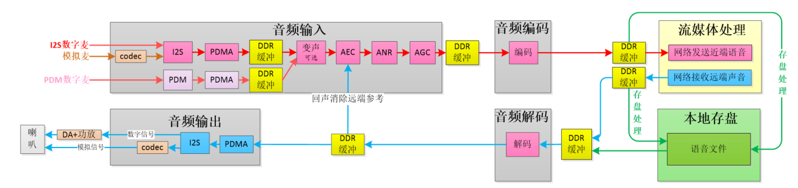
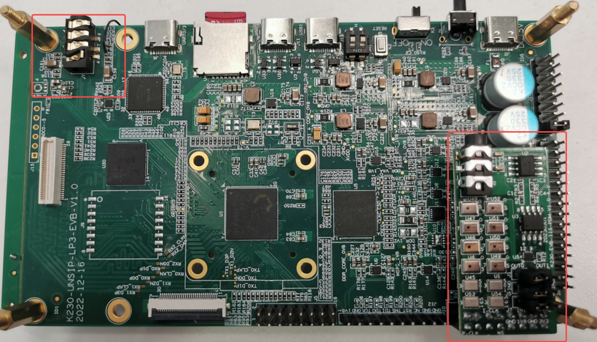

# K230音频API参考


版权所有©2023北京嘉楠捷思信息技术有限公司

<div style="page-break-after:always"></div>

## 免责声明

您购买的产品、服务或特性等应受北京嘉楠捷思信息技术有限公司（“本公司”，下同）及其关联公司的商业合同和条款的约束，本文档中描述的全部或部分产品、服务或特性可能不在您的购买或使用范围之内。除非合同另有约定，本公司不对本文档的任何陈述、信息、内容的正确性、可靠性、完整性、适销性、符合特定目的和不侵权提供任何明示或默示的声明或保证。除非另有约定，本文档仅作为使用指导参考。

由于产品版本升级或其他原因，本文档内容将可能在未经任何通知的情况下，不定期进行更新或修改。

## 商标声明

、“嘉楠”和其他嘉楠商标均为北京嘉楠捷思信息技术有限公司及其关联公司的商标。本文档可能提及的其他所有商标或注册商标，由各自的所有人拥有。

**版权所有 © 2023北京嘉楠捷思信息技术有限公司。保留一切权利。**
非经本公司书面许可，任何单位和个人不得擅自摘抄、复制本文档内容的部分或全部，并不得以任何形式传播。

<div style="page-break-after:always"></div>

## 目录

[TOC]

## 前言

### 概述

AUDIO模块包括音频输入、音频输出、音频编码、音频解码四个子模块以及对内置audio codec的控制。

### 读者对象

本文档（本指南）主要适用于以下人员：

- 技术支持工程师
- 软件开发工程师

### 缩略词定义

| 简称 | 说明         |
|------|--------------|
| ai   | 音频输入模块 |
| ao   | 音频输出模块 |
| aenc | 音频编码模块 |
| adec | 音频解码模块 |

### 修订记录

| 文档版本号 | 修改说明                                                     | 修改者      | 日期      |
| ---------- | ------------------------------------------------------------ | ----------- | --------- |
| V1.0       | 初版                                                         | 孙小朋      | 2023/3/7  |
| V1.1       | 1）增加i2s内置codec的支持 2）增加pdm 单/双声道支持 3）增加ai、ao 不同采样精度支持（16/24/32） 4）api接口不变，增加了参数属性，完善了文档。 | 孙小朋      | 2023/3/27 |
| V1.1.1     | 增加音频编解码api 接口 增加声音质量增强api接口[kd_mpi_ai_set_vqe_attr](#219-kd_mpi_ai_set_vqe_attr)/[kd_mpi_ai_get_vqe_attr](#2110-kd_mpi_ai_get_vqe_attr)，以及说明。 | 孙小朋/崔妍 | 2023/4/12 |
| V1.2       | 修改声音质量增强API接口[kd_mpi_ai_set_vqe_attr](#219-kd_mpi_ai_set_vqe_attr)/[kd_mpi_ai_get_vqe_attr](#2110-kd_mpi_ai_get_vqe_attr) 增加音频编解码mapi接口函数 | 孙小朋/崔妍 | 2023/4/27 |
| V1.3       | 1)增加内置Audio Codec API接口                                | 孙小朋      | 2023/5/10 |
| v1.4       | 1)i2s支持单双声道输入和输出，修改[k_audio_i2s_attr](#3110-k_audio_i2s_attr)属性，增加snd_mode属性。 2)增加内置Audio Codec API接口:包括音量获取和复位相关接口:[k_acodec_get_gain_micl](#257-k_acodec_get_gain_hpoutl)/[k_acodec_get_gain_micr](#2516-k_acodec_get_gain_micr)/[k_acodec_get_adcl_volume](#2518-k_acodec_get_adcl_volume)/[k_acodec_get_adcr_volume](#2519-k_acodec_get_adcr_volume)/[k_acodec_get_alc_gain_micl](#255-k_acodec_get_alc_gain_micl)/[k_acodec_get_alc_gain_micr](#256-k_acodec_get_alc_gain_micr)/[k_acodec_get_gain_hpoutl](#257-k_acodec_get_gain_hpoutl)/[k_acodec_get_gain_hpoutr](#258-k_acodec_get_gain_hpoutr)/[k_acodec_get_dacl_volume](#259-k_acodec_get_dacl_volume)/[k_acodec_get_dacr_volume](#2510-k_acodec_get_dacr_volume)/[k_acodec_reset](#2510-k_acodec_reset) | 孙小朋      | 2023/6/15 |

## 1. 概述

### 1.1 概述

音频模块包括音频输入ai、音频输出ao、音频编码aenc、音频解码adec四个子模块以及对内置模拟audio codec的支持。音频输入模块包括i2s和pdm两种音频接口，配合pdma做内存拷贝，支持数字麦(pdm/i2s)和模拟audio codec(i2s)声源输入，内置模拟audio codec，支持对音频数据进行声音质量增强(VQE)处理：3A(AEC回声消除、ANR降噪、AGC自动增益)。音频输出模块支持i2s音频接口，配合pdma做内存拷贝，可外接数据喇叭或模拟audio codec作为声音输出。音频编码和解码模块暂支持对 G711格式的音频编解码功能，并支持外部编解码器的注册。

将音频模块拆分成多个子模块，模块间以低耦合的方式实现数据流的互传，这样的设计足以满足MAIX3下现有的多媒体业务。下图仅以语音对讲业务场景下音频模块使用方式来做分析。通过音频输入模块将采集到的音频数据通过音频编码模块编码后通过网络发送到远端，从远端获取到的音频编码数据经过音频解码模块解码后经音频输出模块即可播放远端声音。



### 1.2 功能描述

#### 1.2.1 音频输入

音频输入模块（AI）主要实现配置及启用音频输入设备、获取音频帧数据等功能。

音频输入模块支持I2s和pdm协议接口。i2s 支持同时采集最多2路双声道音频,pdm支持同时采集最多8路单声道音频。详细的i2s、pdm特性如下：

- I2s音频接口

  1. 数据采样率支持8kHz/12kHz/16kHz/24kHz/32kHz/44.1kHz/48kHz/96kHz/192kHz，采样精度支持16/24/32bit。

  1. 支持2组可配置IO用于输入/输出I2S音频数据，支持全双工模式。

- pdm音频接口

  1. 支持PDM音频输入，1bit位宽，采样时钟频率为0.256MHz/0.384MHz/0.512MHz/0.768MHz/1.024MHz/1.4112MHz/1.536MHz/2.048MHz/2.8224MHz/3.072MHz/4.096MHz/5.6448MHz/6.144MHz/12.288MHz/24.576MHz，输入的PCM音频采样率为8kHz/12kHz/16kHz/24kHz/32kHz/44.1kHz/48kHz/96kHz/192kHz。采样精度支持16/24/32bit.

  1. 支持过采样率128、64、32倍过采样。

  1. 支持1-4个IO用于输入PDM音频数据。

  1. 输入支持可配置1-8个PDM声道，支持PDM左右单声道模式和双声道模式，各IO声道模式统一，PDM双声道模式最多使用4个IO

  1. 使能的声道序号从小到大并且连续，不支持各声道随机使能

#### 1.2.2 音频输出

音频输出（AO）主要实现启用音频输出设备、发送音频帧到输出通道等功能。

音频输出模块支持I2s协议接口。i2s 支持同时输出最多2路双声道音频。

- i2s音频接口

  1. 数据采样率支持8kHz/12kHz/16kHz/24kHz/32kHz/44.1kHz/48kHz/96kHz/192kHz，采样精度16/24/32bit。

  1. 支持2组可配置IO用于输入/输出I2S音频数据，支持全双工模式。

#### 1.2.3 音频链路

- audio codec从模拟麦克风接收到的信号，转变为I2S格式的PCM数据后，输入到audio中的I2S中；I2S输出的PCM数据，经过audio codec后，变为模拟信号发出，该模式不使用数字IO，固定使用I2S的sdi0和sdo0接口。

- I2S的直接与片外的数字麦克风和PA连接。共有两组接口可以选择:sdi0、sdo0及sdi1、sdo1。

- 片外的PDM麦克风，输入最多8路PDM数据到audio的4个输入数据接口。

可供选择得链路包括:

- 3组pdm_in + 1组i2s_in + 2组i2s out，其中1组i2s_in可以使用内置audio codec或片外

- 4组pdm_in + 2组i2s out

- 2组i2s_in + 2组 pdm_in + 2组i2s out

可以使用内置codec或外接设备(音频子板)来测试音频相关功能。使用内置codec可以测试一组I2S音频输入和输出及audio codec相关功能，使用音频子板可以测试2组i2s音频输入输出和4组pdm音频输入功能。



#### 1.2.4 声音质量增强

音频模块支持对音频数据进行声音质量增强处理，实现音频3A功能。目前支持的采样精度为16bit，支持的采样率为16k。

## 2. API 参考

### 2.1 音频输入

该功能模块提供以下API：

- [kd_mpi_ai_set_pub_attr](#211-kd_mpi_ai_set_pub_attr)
- [kd_mpi_ai_get_pub_attr](#212-kd_mpi_ai_get_pub_attr)
- [kd_mpi_ai_enable](#213-kd_mpi_ai_enable)
- [kd_mpi_ai_disable](#214-kd_mpi_ai_disable)
- [kd_mpi_ai_enable_chn](#215-kd_mpi_ai_enable_chn)
- [kd_mpi_ai_disable_chn](#215-kd_mpi_ai_enable_chn)
- [kd_mpi_ai_get_frame](#217-kd_mpi_ai_get_frame)
- [kd_mpi_ai_release_frame](#218-kd_mpi_ai_release_frame)
- [kd_mpi_ai_set_vqe_attr](#219-kd_mpi_ai_set_vqe_attr)
- [kd_mpi_ai_get_vqe_attr](#2110-kd_mpi_ai_get_vqe_attr)

#### 2.1.1 kd_mpi_ai_set_pub_attr

【描述】

设置AI设备属性。

【语法】

k_s32 kd_mpi_ai_set_pub_attr([k_audio_dev](#312-k_audio_dev) ai_dev, const [k_aio_dev_attr](#3112-k_aio_dev_attr) \*attr);

【参数】

| 参数名称 | 描述              | 输入/输出 |
|----------|-------------------|-----------|
| ai_dev   | 音频设备号。      | 输入      |
| attr     | AI设备属性指针。  | 输入      |

【返回值】

| 返回值 | 描述                 |
|--------|----------------------|
| 0      | 成功                 |
| 非0    | 失败，其值参见错误码 |

【需求】

- 头文件：mpi_ai_api.h
- 库文件：libai.a

【注意】

无

【举例】

```c
k_aio_dev_attr aio_dev_attr;
aio_dev_attr.audio_type = KD_AUDIO_INPUT_TYPE_I2S;
aio_dev_attr.kd_audio_attr.i2s_attr.sample_rate = 44100;
aio_dev_attr.kd_audio_attr.i2s_attr.bit_width = KD_AUDIO_BIT_WIDTH_16
aio_dev_attr.kd_audio_attr.i2s_attr.chn_cnt = 2;
aio_dev_attr.kd_audio_attr.i2s_attr.i2s_mode = K_STANDARD_MODE;
aio_dev_attr.kd_audio_attr.i2s_attr.frame_num = 25;
aio_dev_attr.kd_audio_attr.i2s_attr.point_num_per_frame = 44100/25;
aio_dev_attr.kd_audio_attr.i2s_attr.i2s_type = K_AIO_I2STYPE_INNERCODEC;
if (K_SUCCESS != kd_mpi_ai_set_pub_attr(0, &aio_dev_attr))
{
printf("kd_mpi_ai_set_pub_attr failed\n");
return K_FAILED;
}
if (K_SUCCESS != kd_mpi_ai_enable(0))
{
printf("kd_mpi_ai_set_pub_attr failed\n");
return K_FAILED;
}
if (K_SUCCESS != kd_mpi_ai_enable_chn(0, 0))
{
printf("kd_mpi_ai_set_pub_attr failed\n");
return K_FAILED;
}
```

#### 2.1.2 kd_mpi_ai_get_pub_attr

【描述】

获取AI设备属性。

【语法】

k_s32 kd_mpi_ai_get_pub_attr([k_audio_dev](#312-k_audio_dev) ai_dev, [k_aio_dev_attr](#3112-k_aio_dev_attr) \*attr);

【参数】

| 参数名称 | 描述             | 输入/输出 |
|----------|------------------|-----------|
| ai_dev   | 音频设备号。     | 输入      |
| attr     | AI设备属性指针。 | 输出      |

【返回值】

| 返回值 | 描述                 |
|--------|----------------------|
| 0      | 成功                 |
| 非0    | 失败，其值参见错误码 |

【需求】

- 头文件：mpi_ai_api.h
- 库文件：libai.a

#### 2.1.3 kd_mpi_ai_enable

【描述】

使能ai设备。

【语法】

k_s32 kd_mpi_ai_enable([k_audio_dev](#312-k_audio_dev) ai_dev);

【参数】

| 参数名称 | 描述          | 输入/输出 |
|----------|---------------|-----------|
| ai_dev   | 音频设备号。  | 输入      |

【返回值】

| 返回值 | 描述                 |
|--------|----------------------|
| 0      | 成功                 |
| 非0    | 失败，其值参见错误码 |

【需求】

- 头文件：mpi_ai_api.h
- 库文件：libai.a

#### 2.1.4 kd_mpi_ai_disable

【描述】

禁用ai设备。

【语法】

k_s32 kd_mpi_ai_disable([k_audio_dev](#312-k_audio_dev) ai_dev);

【参数】

| 参数名称 | 描述          | 输入/输出 |
|----------|---------------|-----------|
| ai_dev   | 音频设备号。  | 输入      |

【返回值】

| 返回值 | 描述                 |
|--------|----------------------|
| 0      | 成功                 |
| 非0    | 失败，其值参见错误码 |

【需求】

- 头文件：mpi_ai_api.h
- 库文件：libai.a

#### 2.1.5 kd_mpi_ai_enable_chn

【描述】

使能ai通道。

【语法】

k_s32 kd_mpi_ai_enable_chn([k_audio_dev](#312-k_audio_dev) ai_dev,[k_ai_chn](#313-k_ai_chn) ai_chn);

【参数】

| 参数名称 | 描述          | 输入/输出 |
|----------|---------------|-----------|
| ai_dev   | 音频设备号。  | 输入      |
| ai_chn   | 音频通道号。  | 输入      |

【返回值】

| 返回值 | 描述                 |
|--------|----------------------|
| 0      | 成功                 |
| 非0    | 失败，其值参见错误码 |

【需求】

- 头文件：mpi_ai_api.h
- 库文件：libai.a

#### 2.1.6 kd_mpi_ai_disable_chn

【描述】

禁用ai通道。

【语法】

k_s32 kd_mpi_ai_disable_chn([k_audio_dev](#312-k_audio_dev) ai_dev,[k_ai_chn](#313-k_ai_chn) ai_chn);

【参数】

| 参数名称 | 描述          | 输入/输出 |
|----------|---------------|-----------|
| ai_dev   | 音频设备号。  | 输入      |
| ai_chn   | 音频通道号。  | 输入      |

【返回值】

| 返回值 | 描述                 |
|--------|----------------------|
| 0      | 成功                 |
| 非0    | 失败，其值参见错误码 |

【需求】

- 头文件：mpi_ai_api.h
- 库文件：libai.a

#### 2.1.7 kd_mpi_ai_get_frame

【描述】

获取音频帧。

【语法】

k_s32 kd_mpi_ai_get_frame([k_audio_dev](#312-k_audio_dev) ai_dev,[k_ai_chn](#313-k_ai_chn) ai_chn,[k_audio_frame](#3114-k_audio_frame)\*frame, k_u32 milli_sec);

【参数】

| 参数名称  | 描述                                                                                                                                        | 输入/输出 |
|-----------|---------------------------------------------------------------------------------------------------------------------------------------------|-----------|
| ai_dev    | 音频设备号。                                                                                                                                | 输入      |
| ai_chn    | 音频通道号。                                                                                                                                | 输入      |
| frame     | 音频帧数据。                                                                                                                                | 输出      |
| milli_sec | 获取数据的超时时间。 -1表示阻塞模式，无数据时一直等待；  0表示非阻塞模式，无数据时则报错返回；  >0表示阻塞milli_sec毫秒，超时则报错返回。  | 输入      |

【返回值】

| 返回值 | 描述                 |
|--------|----------------------|
| 0      | 成功                 |
| 非0    | 失败，其值参见错误码 |

【需求】

- 头文件：mpi_ai_api.h
- 库文件：libai.a

【注意】

- milli_sec的值必须大于等于-1，等于-1时采用阻塞模式获取数据，等于0时采用非

阻塞模式获取数据，大于0时，阻塞milli_sec毫秒后，没有数据则返回超时并报错。

- 获取音频帧数据前，必须先使能对应的AI通道。

【举例】

```c
k_audio_frame audio_frame;
while(true)
{
//get frame
if (K_SUCCESS != kd_mpi_ai_get_frame(dev_num, channel, &audio_frame, 1000))
{
printf("=========kd_mpi_ai_get_frame timeout\n");
continue ;
}
//process frame
process_frame(&audio_frame);
//release frame
kd_mpi_ai_release_frame(dev_num, channel, &audio_frame);
}
```

#### 2.1.8 kd_mpi_ai_release_frame

【描述】

释放音频帧。

【语法】

k_s32 kd_mpi_ai_release_frame([k_audio_dev](#312-k_audio_dev) ai_dev,[k_ai_chn](#313-k_ai_chn) ai_chn,const [k_audio_frame](#3114-k_audio_frame) *frame);【参数】

| 参数名称 | 描述          | 输入/输出 |
|----------|---------------|-----------|
| ai_dev   | 音频设备号。  | 输入      |
| ai_chn   | 音频通道号。  | 输入      |
| frame    | 音频帧数据。  | 输入      |

【返回值】

| 返回值 | 描述                 |
|--------|----------------------|
| 0      | 成功                 |
| 非0    | 失败，其值参见错误码 |

【需求】

- 头文件：mpi_ai_api.h
- 库文件：libai.a

#### 2.1.9 kd_mpi_ai_set_vqe_attr

【描述】

设置AI的声音质量增强功能相关属性。

【语法】

k_s32 kd_mpi_ai_set_vqe_attr([k_audio_dev](#312-k_audio_dev) ai_dev, [k_ai_chn](#313-k_ai_chn) ai_chn, const k_bool \*vqe_enable);

【参数】

| 参数名称   | 描述                                                      | 输入/输出 |
|------------|-----------------------------------------------------------|-----------|
| ai_dev     | 音频设备号。                                              | 输入      |
| ai_chn     | 音频通道号。                                              | 输入      |
| vqe_enable | 声音质量增强使能标志位。 K_TRUE：使能。 K_FALSE：不使能。 | 输入      |

【返回值】

| 返回值 | 描述                 |
|--------|----------------------|
| 0      | 成功                 |
| 非0    | 失败，其值参见错误码 |

【需求】

- 头文件：mpi_ai_api.h

库文件：libai.a

【注意】

目前支持的采样精度为16bit，支持的采样率为8k和16k。

#### 2.1.10 kd_mpi_ai_get_vqe_attr

【描述】

获取AI的声音质量增强功能相关属性。

【语法】

k_s32 kd_mpi_ai_get_vqe_attr([k_audio_dev](#312-k_audio_dev) ai_dev, [k_ai_chn](#313-k_ai_chn) ai_chn, k_bool \*vqe_enable);

【参数】

| 参数名称   | 描述                                                          | 输入/输出 |
|------------|---------------------------------------------------------------|-----------|
| ai_dev     | 音频设备号。                                                  | 输入      |
| ai_chn     | 音频通道号。                                                  | 输入      |
| vqe_enable | 声音质量增强使能标志位指针。 K_TRUE：使能。 K_FALSE：不使能。 | 输出      |

【返回值】

| 返回值 | 描述                 |
|--------|----------------------|
| 0      | 成功                 |
| 非0    | 失败，其值参见错误码 |

【需求】

- 头文件：mpi_ai_api.h
- 库文件：libai.a

### 2.2 音频输出

该功能模块提供以下API：

- [kd_mpi_ao_set_pub_attr](#221-kd_mpi_ao_set_pub_attr)
- [kd_mpi_ao_get_pub_attr](#212-kd_mpi_ai_get_pub_attr)
- [kd_mpi_ao_enable](#223-kd_mpi_ao_enable)
- [kd_mpi_ao_disable](#224-kd_mpi_ao_disable)
- [kd_mpi_ao_enable_chn](#225-kd_mpi_ao_enable_chn)
- [kd_mpi_ao_disable_chn](#226-kd_mpi_ao_disable_chn)
- [kd_mpi_ao_send_frame](#227-kd_mpi_ao_send_frame)

#### 2.2.1 kd_mpi_ao_set_pub_attr

【描述】

设置AO设备属性。

【语法】

k_s32 kd_mpi_ao_set_pub_attr([k_audio_dev](#312-k_audio_dev) ao_dev, const [k_aio_dev_attr](#3112-k_aio_dev_attr) *attr);

【参数】

| 参数名称 | 描述              | 输入/输出 |
|----------|-------------------|-----------|
| ao_dev   | 音频设备号。      | 输入      |
| attr     | AO设备属性指针。  | 输入      |

【返回值】

| 返回值 | 描述                 |
|--------|----------------------|
| 0      | 成功                 |
| 非0    | 失败，其值参见错误码 |

【需求】

- 头文件：mpi_ao_api.h
- 库文件：libao.a

【注意】

无

【举例】

```c
k_aio_dev_attr ao_dev_attr;
ao_dev_attr.audio_type = KD_AUDIO_OUTPUT_TYPE_I2S;
ao_dev_attr.kd_audio_attr.i2s_attr.sample_rate = 48000;
ao_dev_attr.kd_audio_attr.i2s_attr.bit_width = KD_AUDIO_BIT_WIDTH_24;
ao_dev_attr.kd_audio_attr.i2s_attr.chn_cnt = 2;
ao_dev_attr.kd_audio_attr.i2s_attr.i2s_mode = K_RIGHT_JUSTIFYING_MODE;
ao_dev_attr.kd_audio_attr.i2s_attr.frame_num = 15;
ao_dev_attr.kd_audio_attr.i2s_attr.point_num_per_frame = 48000/25;
ao_dev_attr.kd_audio_attr.i2s_attr.i2s_type = K_AIO_I2STYPE_EXTERN;
if (K_SUCCESS != kd_mpi_ao_set_pub_attr(0, &ao_dev_attr))
{
printf("kd_mpi_ao_set_pub_attr failed\n");
return K_FAILED;
}

if (K_SUCCESS != kd_mpi_ai_enable(0))
{
printf("kd_mpi_ai_enable failed\n");
return K_FAILED;
}

if (K_SUCCESS != kd_mpi_ai_enable_chn(0,1))
{
printf("kd_mpi_ai_enable_chn failed\n");
return K_FAILED;
}
```

#### 2.2.2 kd_mpi_ao_get_pub_attr

【描述】

获取AO设备属性。

【语法】

k_s32 kd_mpi_ao_get_pub_attr([k_audio_dev](#312-k_audio_dev) ao_dev, [k_aio_dev_attr](#3112-k_aio_dev_attr) *attr);

【参数】

| 参数名称 | 描述             | 输入/输出 |
|----------|------------------|-----------|
| ao_dev   | 音频设备号。     | 输入      |
| attr     | AO设备属性指针。 | 输出      |

【返回值】

| 返回值 | 描述                 |
|--------|----------------------|
| 0      | 成功                 |
| 非0    | 失败，其值参见错误码 |

【需求】

- 头文件：mpi_ao_api.h
- 库文件：libao.a

#### 2.2.3 kd_mpi_ao_enable

【描述】

使能ao设备。

【语法】

k_s32 kd_mpi_ao_enable([k_audio_dev](#312-k_audio_dev) ao_dev);

【参数】

| 参数名称 | 描述          | 输入/输出 |
|----------|---------------|-----------|
| ao_dev   | 音频设备号。  | 输入      |

【返回值】

| 返回值 | 描述                 |
|--------|----------------------|
| 0      | 成功                 |
| 非0    | 失败，其值参见错误码 |

【需求】

- 头文件：mpi_ao_api.h
- 库文件：libao.a

#### 2.2.4 kd_mpi_ao_disable

【描述】

禁用ao设备。

【语法】

k_s32 kd_mpi_ao_disable([k_audio_dev](#312-k_audio_dev) ao_dev);

【参数】

| 参数名称 | 描述          | 输入/输出 |
|----------|---------------|-----------|
| ao_dev   | 音频设备号。  | 输入      |

【返回值】

| 返回值 | 描述                 |
|--------|----------------------|
| 0      | 成功                 |
| 非0    | 失败，其值参见错误码 |

【需求】

- 头文件：mpi_ao_api.h
- 库文件：libao.a

#### 2.2.5 kd_mpi_ao_enable_chn

【描述】

使能ao通道。

【语法】

k_s32 kd_mpi_ao_enable_chn([k_audio_dev](#312-k_audio_dev) ao_dev,[k_ao_chn](#314-k_ao_chn) ao_chn);

【参数】

| 参数名称 | 描述          | 输入/输出 |
|----------|---------------|-----------|
| ao_dev   | 音频设备号。  | 输入      |
| ao_chn   | 音频通道号。  | 输入      |

【返回值】

| 返回值 | 描述                 |
|--------|----------------------|
| 0      | 成功                 |
| 非0    | 失败，其值参见错误码 |

【需求】

- 头文件：mpi_ao_api.h
- 库文件：libao.a

#### 2.2.6 kd_mpi_ao_disable_chn

【描述】

禁用ao通道。

【语法】

k_s32 kd_mpi_ao_disable_chn([k_audio_dev](#312-k_audio_dev) ao_dev,[k_ao_chn](#314-k_ao_chn) ao_chn);

【参数】

| 参数名称 | 描述          | 输入/输出 |
|----------|---------------|-----------|
| ao_dev   | 音频设备号。  | 输入      |
| ao_chn   | 音频通道号。  | 输入      |

【返回值】

| 返回值 | 描述                 |
|--------|----------------------|
| 0      | 成功                 |
| 非0    | 失败，其值参见错误码 |

【需求】

- 头文件：mpi_ao_api.h
- 库文件：libao.a

#### 2.2.7 kd_mpi_ao_send_frame

【描述】

发送ao帧数据。

【语法】

k_s32 kd_mpi_ao_send_frame

([k_audio_dev](#312-k_audio_dev) ao_dev,[k_ao_chn](#314-k_ao_chn) ao_chn,const [k_audio_frame](#3114-k_audio_frame)*frame,k_s32 milli_sec);

【参数】

| 参数名称  | 描述                                                                                                                                        | 输入/输出 |
|-----------|---------------------------------------------------------------------------------------------------------------------------------------------|-----------|
| ao_dev    | 音频设备号。                                                                                                                                | 输入      |
| ao_chn    | 音频通道号。                                                                                                                                | 输入      |
| frame     | 音频帧数据指针。                                                                                                                            | 输入      |
| milli_sec | 发送数据的超时时间。 -1表示阻塞模式，无数据时一直等待；  0表示非阻塞模式，无数据时则报错返回；  >0表示阻塞milli_sec毫秒，超时则报错返回。  | 输入      |

【返回值】

| 返回值 | 描述                 |
|--------|----------------------|
| 0      | 成功                 |
| 非0    | 失败，其值参见错误码 |

【需求】

- 头文件：mpi_ai_api.h
- 库文件：libai.a

【注意】

- milli_sec的值必须大于等于-1，等于-1时采用阻塞模式获取数据，等于0时采用非

阻塞模式获取数据，大于0时，阻塞milli_sec毫秒后，没有数据则返回超时并报错。

- 发送音频帧数据前，必须先使能对应的AO通道。

【举例】

```c
k_audio_frame audio_frame;
k_s32 ret = 0;
while (true)
{
//get ai frame
ret = kd_mpi_ai_get_frame(0, 0, &audio_frame, 1000);
if (K_SUCCESS != ret)
{
printf("=========kd_mpi_ai_get_frame timeout\n");
continue ;
}
//send ai frame to ao
ret = kd_mpi_ao_send_frame(0, 1, &audio_frame, 0);
if (K_SUCCESS != ret)
{
printf("=======kd_mpi_ao_send_frame failed\n");
}
//release ai frame
kd_mpi_ai_release_frame(0, 0, &audio_frame);
}
```

### 2.3 音频编码

音频编码主要实现创建编码通道、发送音频帧编码及获取编码码流等功能。音频编码部分，提供g711a/u编码，暂只支持16bit采样精度。

该功能模块提供以下API：

- [kd_mpi_aenc_register_encoder](#231-kd_mpi_aenc_register_encoder)：注册编码器。
- [kd_mpi_aenc_unregister_encoder](#232-kd_mpi_aenc_unregister_encoder)：注销编码器。
- [kd_mpi_aenc_create_chn](#233-kd_mpi_aenc_create_chn):创建编码通道
- [kd_mpi_aenc_destroy_chn](#234-kd_mpi_aenc_destroy_chn):销毁编码通道
- [kd_mpi_aenc_send_frame](#235-kd_mpi_aenc_send_frame)：发送音频编码音频帧
- [kd_mpi_aenc_get_stream](#236-kd_mpi_aenc_get_stream)：获取音频编码码流
- [kd_mpi_aenc_release_stream](#237-kd_mpi_aenc_release_stream)：释放音频编码码流

#### 2.3.1 kd_mpi_aenc_register_encoder

- 【描述】

注册编码器。

- 【语法】

k_s32 kd_mpi_aenc_register_encoder(k_s32 \*handle, const [k_aenc_encoder](#322-k_aenc_encoder) \*encoder);

- 【参数】

| **参数名称** | **描述**           | **输入/输出** |
|--------------|--------------------|---------------|
| handle       | 注册句柄。         | 输出          |
| encoder      | 编码器属性结构体。 | 输入          |

- 【说明】

用户通过传入编码器属性结构体，向 AENC 模块注册一个编码器，并返回注册句

柄，用户可以最后通过注册句柄来注销该编码器。

AENC 模块最大可注册 20 个编码器，且自身已注册 G711.a、G711.u

两个编码器。

同一种编码协议不允许重复注册编码器，例如假如已注册 G711 编码器，不允许另

外再注册一个 G711 编码器

- 【返回值】

| 返回值 | 描述                 |
|--------|----------------------|
| 0      | 成功                 |
| 非0    | 失败，其值参见错误码 |

【需求】

- 头文件：mpi_aenc_api.h
- 库文件：libaenc.a

#### 2.3.2 kd_mpi_aenc_unregister_encoder

- 【描述】

注销编码器。

- 【语法】

k_s32 kd_mpi_aenc_unregister_encoder(k_s32 handle);

- 【参数】

| **参数名称** | **描述**    | **输入/输出** |
|--------------|-------------|---------------|
| handle       | 注销句柄。  | 输入          |

- 【返回值】

| 返回值 | 描述                 |
|--------|----------------------|
| 0      | 成功                 |
| 非0    | 失败，其值参见错误码 |

【需求】

- 头文件：mpi_aenc_api.h
- 库文件：libaenc.a

#### 2.3.3 kd_mpi_aenc_create_chn

- 【描述】

创建音频编码通道。

- 【语法】

k_s32 kd_mpi_aenc_create_chn([k_aenc_chn](#326-k_aenc_chn) aenc_chn, const [k_aenc_chn_attr](#323-k_aenc_chn_attr) \*attr);

| **参数名称** | **描述**                                                           | **输入/输出** |
|--------------|--------------------------------------------------------------------|---------------|
| aenc_chn     | 通道号。 取值范围: [0, [AENC_MAX_CHN_NUM](#324-aenc_max_chn_nums))。  | 输入          |
| attr         | 音频编码通道属性指针。                                             | 输入          |

- 【说明】

buffer 大小以帧为单位，取值范围是[2, [K_MAX_AUDIO_FRAME_NUM](#315-k_max_audio_frame_num)，建议配置 为 10 以上，过小的 buffer 配置可能导致丢帧等异常。每个编码通道都会根据buffer大小来配置队列大小，用以缓存编码帧数据。

- 【返回值】

| 返回值 | 描述                 |
|--------|----------------------|
| 0      | 成功                 |
| 非0    | 失败，其值参见错误码 |

【需求】

- 头文件：mpi_aenc_api.h
- 库文件：libaenc.a

#### 2.3.4 kd_mpi_aenc_destroy_chn

- 【描述】

销毁音频编码通道。

- 【语法】

k_s32 kd_mpi_aenc_destroy_chn([k_aenc_chn](#326-k_aenc_chn) aenc_chn);

| **参数名称** | **描述**                                                           | **输入/输出** |
|--------------|--------------------------------------------------------------------|---------------|
| aenc_chn     | 通道号。 取值范围: [0, [AENC_MAX_CHN_NUM](#324-aenc_max_chn_nums))。  | 输入          |

- 【说明】

无

- 【返回值】

| 返回值 | 描述                 |
|--------|----------------------|
| 0      | 成功                 |
| 非0    | 失败，其值参见错误码 |

【需求】

- 头文件：mpi_aenc_api.h
- 库文件：libaenc.a

#### 2.3.5 kd_mpi_aenc_send_frame

- 【描述】

发送音频编码帧。

- 【语法】

k_s32 kd_mpi_aenc_send_frame([k_aenc_chn](#326-k_aenc_chn) aenc_chn,const [k_audio_frame](#3114-k_audio_frame) \*frame);

- 【参数】

| **参数名称** | **描述**                                          | **输入/输出** |
|--------------|---------------------------------------------------|---------------|
| aenc_chn     | 通道号。  取值范围：[0, AENC_MAX_CHN_NUM)。  输入 | 输入          |
| frame        | 音频帧结构体指针。                                | 输入          |

- 【说明】

音频编码发送码流是非阻塞接口，如果音频码流缓存满，则直接返回失败。该接口用于用户主动发送音频帧进行编码，如果 AENC 通道已经通过系统绑定接口与 AI 绑定，不需要也不建议调此接口。调用该接口发送音频编码音频帧时，必须先创建对应的编码通道。

- 【返回值】

| 返回值 | 描述                 |
|--------|----------------------|
| 0      | 成功                 |
| 非0    | 失败，其值参见错误码 |

【需求】

- 头文件：mpi_aenc_api.h
- 库文件：libaenc.a

#### 2.3.6 kd_mpi_aenc_get_stream

- 【描述】

获取音频编码码流。

- 【语法】

k_s32 kd_mpi_aenc_get_stream([k_aenc_chn](#326-k_aenc_chn) aenc_chn, [k_audio_stream](#327-k_audio_stream) \*stream, k_s32 milli_sec);

- 【参数】

| **参数名称** | **描述**                                                                                                                                          | **输入/输出** |
|--------------|---------------------------------------------------------------------------------------------------------------------------------------------------|---------------|
| aenc_chn     | 通道号。  取值范围：[0, AENC_MAX_CHN_NUM)。                                                                                                       | 输入          |
| stream       | 获取的音频码流。                                                                                                                                  | 输出          |
| milli_sec    | 获取数据的超时时间  -1 表示阻塞模式，无数据时一直等待；  0 表示非阻塞模式，无数据时则报错返回；  \>0 表示阻塞 s32MilliSec 毫秒，超时则报错返回。  | 输入          |

- 【说明】

必须创建通道后才可能获取码流，否则直接返回失败，如果在获取码流过程中销

毁通道则会立刻返回失败。

s32MilliSec 的值必须大于等于-1，等于-1 时采用阻塞模式获取数据，等于 0 时采

用非阻塞模式获取数据，大于 0 时，阻塞 s32MilliSec 毫秒后，没有数据则返回超

时并报错。

- 【返回值】

| 返回值 | 描述                 |
|--------|----------------------|
| 0      | 成功                 |
| 非0    | 失败，其值参见错误码 |

【需求】

- 头文件：mpi_aenc_api.h
- 库文件：libaenc.a

#### 2.3.7 kd_mpi_aenc_release_stream

- 【描述】

释放音频编码码流。

- 【语法】

k_s32 kd_mpi_aenc_release_stream([k_aenc_chn](#326-k_aenc_chn) aenc_chn, const [k_audio_stream](#327-k_audio_stream) \*stream);

- 【参数】

| **参数名称** | **描述**                                     | **输入/输出** |
|--------------|----------------------------------------------|---------------|
| aenc_chn     | 通道号。  取值范围：[0, AENC_MAX_CHN_NUM)。  | 输入          |
| stream       | 获取的音频码流。                             | 输出          |

- 【说明】

无

- 【返回值】

| 返回值 | 描述                 |
|--------|----------------------|
| 0      | 成功                 |
| 非0    | 失败，其值参见错误码 |

【需求】

- 头文件：mpi_aenc_api.h
- 库文件：libaenc.a

### 2.4 音频解码

音频解码主要实现解码通道、发送音频码流解码及获取解码后音频帧等功能。

音频编解码部分，提供g711a/u解码，暂支持16bit采样精度。

该功能模块提供以下API：

- [kd_mpi_adec_register_decoder](#241-kd_mpi_adec_register_decoder)：注册解码器
- [kd_mpi_adec_unregister_decoder](#242-kd_mpi_adec_unregister_decoder)：注销解码器
- [kd_mpi_adec_create_chn](#243-kd_mpi_adec_create_chn)：创建音频解码通道
- [kd_mpi_adec_destroy_chn](#244-kd_mpi_adec_destroy_chn)：销毁音频解码通道
- [kd_mpi_adec_send_stream](#245-kd_mpi_adec_send_stream)：发送音频码流到音频解码通道
- [kd_mpi_adec_clr_chn_buf](#246-kd_mpi_adec_clr_chn_buf)：清除 ADEC 通道中当前的音频数据缓存。
- [kd_mpi_adec_get_frame](#247-kd_mpi_adec_get_frame)：获取音频解码帧数据
- [kd_mpi_adec_release_frame](#248-kd_mpi_adec_release_frame)：释放音频解码帧数据

#### 2.4.1 kd_mpi_adec_register_decoder

- 【描述】

注册解码器。

- 【语法】

k_s32 kd_mpi_adec_register_decoder(k_s32 \*handle, const [k_adec_decoder](#329-k_adec_decoder) \*decoder);

- 【参数】

| **参数名称** | **描述**           | **输入/输出** |
|--------------|--------------------|---------------|
| handle       | 注册句柄。         | 输出          |
| decoder      | 解码器属性结构体。 | 输入          |

- 【说明】

用户通过传入解码器属性结构体，向 ADEC 模块注册一个解码器，并返回注册句柄，用户可以最后通过注册句柄来注销该解码器。 ADEC 模块最大可注册 20 个解码器，且自身已注册 G711a、G711u两个解码器。 同一种解码协议不允许重复注册解码器，例如假如已注册 G711 解码器，不允许另外再注册一个 G711 解码器。

- 【返回值】

| 返回值 | 描述                 |
|--------|----------------------|
| 0      | 成功                 |
| 非0    | 失败，其值参见错误码 |

【需求】

头文件：mpi_adec_api.h

库文件：libadec.a

#### 2.4.2 kd_mpi_adec_unregister_decoder

- 【描述】

注销解码器。

- 【语法】

k_s32 kd_mpi_adec_unregister_decoder(k_s32 handle);

- 【参数】

| **参数名称** | **描述**    | **输入/输出** |
|--------------|-------------|---------------|
| handle       | 注销句柄。  | 输入          |

- 【返回值】

| 返回值 | 描述                 |
|--------|----------------------|
| 0      | 成功                 |
| 非0    | 失败，其值参见错误码 |

- 【需求】
- 头文件：mpi_adec_api.h
- 库文件：libadec.a

#### 2.4.3 kd_mpi_adec_create_chn

- 【描述】

创建音频解码通道。

- 【语法】

k_s32 kd_mpi_adec_create_chn([k_adec_chn](#3212-k_adec_chn) adec_chn, const [k_adec_chn_attr](#328-k_adec_chn_attr) \*attr);

- 【参数】

| **参数名称** | **描述**                                                            | **输入/输出** |
|--------------|---------------------------------------------------------------------|---------------|
| adec_chn     | 通道号。  取值范围：[0, [ADEC_MAX_CHN_NUM](#3211-adec_max_chn_nums))。  | 输入          |
| attr         | 通道属性指针。                                                      | 输入          |

- 【说明】

协议类型指定了该通道的解码协议，目前支持 G711。音频解码的部分属性需要与输出设备属性相匹配，例如采样率、帧长（每帧采样点数目）等。 buffer 大小以帧为单位，取值范围是[2, [K_MAX_AUDIO_FRAME_NUM](#315-k_max_audio_frame_num)，建议配置为 10 以上，过小的 buffer 配置可能导致丢帧等异常。 在通道未创建前（或销毁后）才能使用此接口，如果通道已经被创建，则返回通道已经创建。

- 【返回值】

| 返回值 | 描述                 |
|--------|----------------------|
| 0      | 成功                 |
| 非0    | 失败，其值参见错误码 |

【需求】

头文件：mpi_adec_api.h

库文件：libadec.a

#### 2.4.4 kd_mpi_adec_destroy_chn

- 【描述】

销毁音频解码通道。

- 【语法】

k_s32 kd_mpi_adec_destroy_chn([k_adec_chn](#3212-k_adec_chn) adec_chn);

- 【参数】

| **参数名称** | **描述**                                                           | **输入/输出** |
|--------------|--------------------------------------------------------------------|---------------|
| adec_chn     | 通道号。 取值范围: [0, [ADEC_MAX_CHN_NUM](#3211-adec_max_chn_nums))。  | 输入          |

- 【说明】

无

- 【返回值】

| 返回值 | 描述                 |
|--------|----------------------|
| 0      | 成功                 |
| 非0    | 失败，其值参见错误码 |

- 【需求】
- 头文件：mpi_adec_api.h
- 库文件：libadec.a

#### 2.4.5 kd_mpi_adec_send_stream

- 【描述】

发送音频码流到音频解码通道。

- 【语法】

k_s32 kd_mpi_adec_send_stream(k_adec_chn adec_chn,const k_audio_stream \*stream,k_bool block);

- 【参数】

| **参数名称** | **描述**                                         | **输入/输出** |
|--------------|--------------------------------------------------|---------------|
| adec_chn     | 通道号。  取值范围：[0, [ADEC_MAX_CHN_NUM](#3211-adec_max_chn_nums))。      | 输入          |
| stream       | 音频码流。                                       | 输入          |
| block        | 阻塞标识。  HI_TRUE：阻塞。  HI_FALSE：非阻塞。  | 输入          |

- 【说明】

发送数据时必须保证通道已经被创建，否则直接返回失败，如果在送数据过程中 销毁通道则会立刻返回失败。 支持阻塞或非阻塞方式发送码流。 当阻塞方式发送码流时，如果用于缓存解码后的音频帧的 Buffer 满，则此接口调用会被阻塞，直至解码后的音频帧数据被取走，或 ADEC 通道被销毁。

- 【返回值】

| 返回值 | 描述                 |
|--------|----------------------|
| 0      | 成功                 |
| 非0    | 失败，其值参见错误码 |

- 【需求】

头文件：mpi_adec_api.h

库文件：libadec.a

#### 2.4.6 kd_mpi_adec_clr_chn_buf

- 【描述】

清除ADEC通道中当前的音频数据缓存。

- 【语法】

k_s32 kd_mpi_adec_clr_chn_buf([k_adec_chn](#3212-k_adec_chn) adec_chn);

- 【参数】

| **参数名称** | **描述**                                                           | **输入/输出** |
|--------------|--------------------------------------------------------------------|---------------|
| adec_chn     | 通道号。 取值范围: [0, [ADEC_MAX_CHN_NUM](#3211-adec_max_chn_nums))。  | 输入          |

- 【说明】

要求解码通道已经被创建，如果通道未被创建则返回通道不存在错误码。

- 【返回值】

| 返回值 | 描述                 |
|--------|----------------------|
| 0      | 成功                 |
| 非0    | 失败，其值参见错误码 |

- 【需求】

头文件：mpi_adec_api.h

库文件：libadec.a

#### 2.4.7 kd_mpi_adec_get_frame

- 【描述】

获取音频解码帧数据。

- 【语法】

k_s32 kd_mpi_adec_get_frame([k_adec_chn](#3212-k_adec_chn) adec_chn, [k_audio_frame](#3114-k_audio_frame) \*frame, k_s32 milli_sec);

- 【参数】

| **参数名称** | **描述**                 | **输入/输出** |
|--------------|--------------------------|---------------|
| adec_chn     | 音频解码通道。           | 输入          |
| frame_info   | 音频帧数据结构体  输出   | 输出          |
| block        | 是否以阻塞方式获取       | 输入          |

- 【返回值】

| 返回值 | 描述                 |
|--------|----------------------|
| 0      | 成功                 |
| 非0    | 失败，其值参见错误码 |

- 【需求】

头文件：mpi_adec_api.h

库文件：libadec.a

#### 2.4.8 kd_mpi_adec_release_frame

- 【描述】

释放获取到的音频解码帧数据。

- 【语法】

k_s32 kd_mpi_adec_release_frame([k_adec_chn](#326-k_aenc_chn) adec_chn, const [k_audio_frame](#3114-k_audio_frame) \*frame);

- 【参数】

| **参数名称** | **描述**                 | **输入/输出** |
|--------------|--------------------------|---------------|
| adec_chn     | 音频解码通道。           | 输入          |
| frame_info   | 音频帧数据结构体  输出   | 输入          |

- 【返回值】

| 返回值 | 描述                 |
|--------|----------------------|
| 0      | 成功                 |
| 非0    | 失败，其值参见错误码 |

- 【需求】

头文件：mpi_adec_api.h

库文件：libadec.a

### 2.5 内置Audio Codec

内置Audio Codec主要通过ioctl提供对硬件设备的操作。在提供的ioctl的cmd中，有些

cmd用户可以不需要调用，直接使用模块加载时的默认值即可。ioctl调用实现的是对内置Audio Codec寄存器的读写。

当前版本对audio codec的控制操作主要包含:adc数字和模拟音量，dac数字/模拟音量，adc/dac静音控制。其中采样率，采样精度，i2s对齐模式这些控制操作由用户通过调用ai和ao的api接口内核自动完成(内核代码自动实现对codec硬件设备操作)，不再提供ioctl接口来控制。

内置 Audio Codec 标准功能 cmd:

- [k_acodec_set_gain_micl](#251-k_acodec_set_gain_micl)：左声道输入模拟增益控制
- [k_acodec_set_gain_micr](#252-k_acodec_set_gain_micr)：右声道输入模拟增益控制
- [k_acodec_set_adcl_volume](#253-k_acodec_set_adcl_volume)：左声道输入数字音量控制
- [k_acodec_set_adcr_volume](#254-k_acodec_set_adcr_volume)：右声道输入数字音量控制
- [k_acodec_set_alc_gain_micl](#255-k_acodec_set_alc_gain_micl)：alc左声道输入的模拟增益控制
- [k_acodec_set_alc_gain_micr](#256-k_acodec_set_alc_gain_micr)：alc右声道输入的模拟增益控制
- [k_acodec_set_gain_hpoutl](#257-k_acodec_set_gain_hpoutl)：左声道输出模拟音量控制
- [k_acodec_set_gain_hpoutr](#258-k_acodec_set_gain_hpoutr)：右声道输出模拟音量控制
- [k_acodec_set_dacl_volume](#259-k_acodec_set_dacl_volume)：左声道输出数字音量控制
- [k_acodec_set_dacr_volume](#2510-k_acodec_set_dacr_volume)：右声道输出数字音量控制
- [k_acodec_set_micl_mute](#2511-k_acodec_set_micl_mute)：左声道输入静音控制
- [k_acodec_set_micr_mute](#2512-k_acodec_set_micr_mute)：右声道输入静音控制
- [k_acodec_set_dacl_mute](#2513-k_acodec_set_dacl_mute)：左声道输出静音控制
- [k_acodec_set_dacr_mute](#2514-k_acodec_set_dacr_mute)：右声道输出静音控制
- [k_acodec_get_gain_micl](#2515-k_acodec_get_gain_micl)：获取左声道输入模拟增益值
- [k_acodec_get_gain_micr](#2516-k_acodec_get_gain_micr)：获取右声道输入模拟增益值
- [k_acodec_get_adcl_volume](#2518-k_acodec_get_adcl_volume)：获取左声道输入数字音量值
- [k_acodec_get_adcr_volume](#2519-k_acodec_get_adcr_volume)：获取右声道输入数字音量值
- [k_acodec_get_alc_gain_micl](#255-k_acodec_get_alc_gain_micl)：获取alc左声道输入的模拟增益值
- [k_acodec_get_alc_gain_micr](#256-k_acodec_get_alc_gain_micr)：获取alc右声道输入的模拟增益值
- [k_acodec_get_gain_hpoutl](#257-k_acodec_get_gain_hpoutl)：获取左声道输出模拟音量值
- [k_acodec_get_gain_hpoutr](#258-k_acodec_get_gain_hpoutr)：获取右声道输出模拟音量值
- [k_acodec_get_dacl_volume](#259-k_acodec_get_dacl_volume)：获取左声道输出数字音量值
- [k_acodec_get_dacr_volume](#2510-k_acodec_get_dacr_volume)：获取右声道输出数字音量值
- [k_acodec_reset](#2510-k_acodec_reset)：音量重置

#### 2.5.1 k_acodec_set_gain_micl

- 【描述】

左声道输入模拟增益控制

- 【语法】

int ioctl (int fd, k_acodec_set_gain_micl, k_u32 \*arg);

- 【参数】

| **参数名称**           | **描述**                  | **输入/输出** |
| ---------------------- | ------------------------- | ------------- |
| fd                     | Audio Codec设备文件描述符 | 输入          |
| k_acodec_set_gain_micl | ioctl号                   | 输入          |
| arg                    | 无符号整型指针            | 输入          |

- 【返回值】

| 返回值 | 描述                 |
|--------|----------------------|
| 0      | 成功                 |
| 非0    | 失败，其值参见错误码 |

- 【需求】

头文件：k_acodec_comm.h

库文件：libacodec.a

- 【注意】

模拟增益范围为0db,6db,20db,30db。

#### 2.5.2 k_acodec_set_gain_micr

- 【描述】

右声道输入模拟增益控制

- 【语法】

int ioctl (int fd, k_acodec_set_gain_micr, k_u32 \*arg);

- 【参数】

| **参数名称**           | **描述**                  | **输入/输出** |
| ---------------------- | ------------------------- | ------------- |
| fd                     | Audio Codec设备文件描述符 | 输入          |
| k_acodec_set_gain_micr | ioctl号                   | 输入          |
| arg                    | 无符号整型指针            | 输入          |

- 【返回值】

| 返回值 | 描述                 |
|--------|----------------------|
| 0      | 成功                 |
| 非0    | 失败，其值参见错误码 |

- 【需求】

头文件：k_acodec_comm.h

库文件：libacodec.a

- 【注意】

模拟增益范围为0db,6db,20db,30db。

#### 2.5.3 k_acodec_set_adcl_volume

- 【描述】

左声道输入数字增益控制。

- 【语法】

int ioctl (int fd, k_acodec_set_adcl_volume, float \*arg);

- 【参数】

| **参数名称**             | **描述**                  | **输入/输出** |
| ------------------------ | ------------------------- | ------------- |
| fd                       | Audio Codec设备文件描述符 | 输入          |
| k_acodec_set_adcl_volume | ioctl号                   | 输入          |
| arg                      | 有符号浮点型指针          | 输入          |

- 【返回值】

| 返回值 | 描述                 |
|--------|----------------------|
| 0      | 成功                 |
| 非0    | 失败，其值参见错误码 |

- 【需求】

头文件：k_acodec_comm.h

库文件：libacodec.a

- 【注意】

模拟增益范围`[-97,30]`,赋值越大，音量越大，按0.5db递增。

#### 2.5.4 k_acodec_set_adcr_volume

- 【描述】

右声道输入数字增益控制。

- 【语法】

int ioctl (int fd, k_acodec_set_adcr_volume, float \*arg);

- 【参数】

| **参数名称**             | **描述**                  | **输入/输出** |
| ------------------------ | ------------------------- | ------------- |
| fd                       | Audio Codec设备文件描述符 | 输入          |
| k_acodec_set_adcr_volume | ioctl号                   | 输入          |
| arg                      | 有符号浮点型指针          | 输入          |

- 【返回值】

| 返回值 | 描述                 |
|--------|----------------------|
| 0      | 成功                 |
| 非0    | 失败，其值参见错误码 |

- 【需求】

头文件：k_acodec_comm.h

库文件：libacodec.a

- 【注意】

模拟增益范围`[-97,30]`,赋值越大，音量越大，按0.5db递增。

#### 2.5.5 k_acodec_set_alc_gain_micl

- 【描述】

左声道alc输入模拟增益控制。

- 【语法】

int ioctl (int fd, k_acodec_set_alc_gain_micl, float \*arg);

- 【参数】

| **参数名称**               | **描述**                  | **输入/输出** |
| -------------------------- | ------------------------- | ------------- |
| fd                         | Audio Codec设备文件描述符 | 输入          |
| k_acodec_set_alc_gain_micl | ioctl号                   | 输入          |
| arg                        | 有符号浮点型指针          | 输入          |

- 【返回值】

| 返回值 | 描述                 |
|--------|----------------------|
| 0      | 成功                 |
| 非0    | 失败，其值参见错误码 |

- 【需求】

头文件：k_acodec_comm.h

库文件：libacodec.a

- 【注意】

模拟增益范围`[-18,28.5]`,赋值越大，音量越大，按1.5db递增。

#### 2.5.6 k_acodec_set_alc_gain_micr

- 【描述】

右声道alc输入模拟增益控制。

- 【语法】

int ioctl (int fd, k_acodec_set_alc_gain_micr, float \*arg);

- 【参数】

| **参数名称**               | **描述**                  | **输入/输出** |
| -------------------------- | ------------------------- | ------------- |
| fd                         | Audio Codec设备文件描述符 | 输入          |
| k_acodec_set_alc_gain_micr | ioctl号                   | 输入          |
| arg                        | 有符号浮点型指针          | 输入          |

- 【返回值】

| 返回值 | 描述                 |
|--------|----------------------|
| 0      | 成功                 |
| 非0    | 失败，其值参见错误码 |

- 【需求】

头文件：k_acodec_comm.h

库文件：libacodec.a

- 【注意】

模拟增益范围`[-18,28.5]`,赋值越大，音量越大，按1.5db递增。

#### 2.5.7 k_acodec_set_gain_hpoutl

- 【描述】

左声道输出模拟增益控制。

- 【语法】

int ioctl (int fd, k_acodec_set_gain_hpoutl, float \*arg);

- 【参数】

| **参数名称**             | **描述**                  | **输入/输出** |
| ------------------------ | ------------------------- | ------------- |
| fd                       | Audio Codec设备文件描述符 | 输入          |
| k_acodec_set_gain_hpoutl | ioctl号                   | 输入          |
| arg                      | 有符号浮点型指针          | 输入          |

- 【返回值】

| 返回值 | 描述                 |
|--------|----------------------|
| 0      | 成功                 |
| 非0    | 失败，其值参见错误码 |

- 【需求】

头文件：k_acodec_comm.h

库文件：libacodec.a

- 【注意】

模拟增益范围`[-39,6]`,赋值越大，音量越大，按1.5db递增。

#### 2.5.8 k_acodec_set_gain_hpoutr

- 【描述】

右声道输出模拟增益控制。

- 【语法】

int ioctl (int fd, k_acodec_set_gain_hpoutr, float \*arg);

- 【参数】

| **参数名称**             | **描述**                  | **输入/输出** |
| ------------------------ | ------------------------- | ------------- |
| fd                       | Audio Codec设备文件描述符 | 输入          |
| k_acodec_set_gain_hpoutr | ioctl号                   | 输入          |
| arg                      | 有符号浮点型指针          | 输入          |

- 【返回值】

| 返回值 | 描述                 |
|--------|----------------------|
| 0      | 成功                 |
| 非0    | 失败，其值参见错误码 |

- 【需求】

头文件：k_acodec_comm.h

库文件：libacodec.a

- 【注意】

模拟增益范围`[-39,6]`,赋值越大，音量越大，按1.5db递增。

#### 2.5.9 k_acodec_set_dacl_volume

- 【描述】

左声道输出数字增益控制。

- 【语法】

int ioctl (int fd, k_acodec_set_dacl_volume, float \*arg);

- 【参数】

| **参数名称**             | **描述**                  | **输入/输出** |
| ------------------------ | ------------------------- | ------------- |
| fd                       | Audio Codec设备文件描述符 | 输入          |
| k_acodec_set_dacl_volume | ioctl号                   | 输入          |
| arg                      | 有符号浮点型指针          | 输入          |

- 【返回值】

| 返回值 | 描述                 |
|--------|----------------------|
| 0      | 成功                 |
| 非0    | 失败，其值参见错误码 |

- 【需求】

头文件：k_acodec_comm.h

库文件：libacodec.a

- 【注意】

模拟增益范围`[-120,7]`,赋值越大，音量越大，按0.5db递增。

#### 2.5.10 k_acodec_set_dacr_volume

- 【描述】

右声道输出数字增益控制。

- 【语法】

int ioctl (int fd, k_acodec_set_dacr_volume, float \*arg);

- 【参数】

| **参数名称**             | **描述**                  | **输入/输出** |
| ------------------------ | ------------------------- | ------------- |
| fd                       | Audio Codec设备文件描述符 | 输入          |
| k_acodec_set_dacr_volume | ioctl号                   | 输入          |
| arg                      | 有符号浮点型指针          | 输入          |

- 【返回值】

| 返回值 | 描述                 |
|--------|----------------------|
| 0      | 成功                 |
| 非0    | 失败，其值参见错误码 |

- 【需求】

头文件：k_acodec_comm.h

库文件：libacodec.a

- 【注意】

模拟增益范围`[-120,7]`,赋值越大，音量越大，按0.5db递增。

#### 2.5.11 k_acodec_set_micl_mute

- 【描述】

左声道输入静音控制。

- 【语法】

int ioctl (int fd, k_acodec_set_micl_mute, k_bool \*arg);

- 【参数】

| **参数名称**           | **描述**                  | **输入/输出** |
| ---------------------- | ------------------------- | ------------- |
| fd                     | Audio Codec设备文件描述符 | 输入          |
| k_acodec_set_micl_mute | ioctl号                   | 输入          |
| arg                    | bool型指针                | 输入          |

- 【返回值】

| 返回值 | 描述                 |
|--------|----------------------|
| 0      | 成功                 |
| 非0    | 失败，其值参见错误码 |

- 【需求】

头文件：k_acodec_comm.h

库文件：libacodec.a

- 【注意】

取值范围:K_TRUE静音，K_FALSE取消静音。

#### 2.5.12 k_acodec_set_micr_mute

- 【描述】

右声道输入静音控制。

- 【语法】

int ioctl (int fd, k_acodec_set_micr_mute, k_bool \*arg);

- 【参数】

| **参数名称**           | **描述**                  | **输入/输出** |
| ---------------------- | ------------------------- | ------------- |
| fd                     | Audio Codec设备文件描述符 | 输入          |
| k_acodec_set_micr_mute | ioctl号                   | 输入          |
| arg                    | bool型指针                | 输入          |

- 【返回值】

| 返回值 | 描述                 |
|--------|----------------------|
| 0      | 成功                 |
| 非0    | 失败，其值参见错误码 |

- 【需求】

头文件：k_acodec_comm.h

库文件：libacodec.a

- 【注意】

取值范围:K_TRUE静音，K_FALSE取消静音。

#### 2.5.13 k_acodec_set_dacl_mute

- 【描述】

左声道输出静音控制。

- 【语法】

int ioctl (int fd, k_acodec_set_dacl_mute, k_bool \*arg);

- 【参数】

| **参数名称**           | **描述**                  | **输入/输出** |
| ---------------------- | ------------------------- | ------------- |
| fd                     | Audio Codec设备文件描述符 | 输入          |
| k_acodec_set_dacl_mute | ioctl号                   | 输入          |
| arg                    | bool型指针                | 输入          |

- 【返回值】

| 返回值 | 描述                 |
|--------|----------------------|
| 0      | 成功                 |
| 非0    | 失败，其值参见错误码 |

- 【需求】

头文件：k_acodec_comm.h

库文件：libacodec.a

- 【注意】

取值范围:K_TRUE静音，K_FALSE取消静音。

#### 2.5.14 k_acodec_set_dacr_mute

- 【描述】

右声道输出静音控制。

- 【语法】

int ioctl (int fd, k_acodec_set_dacr_mute, k_bool \*arg);

- 【参数】

| **参数名称**           | **描述**                  | **输入/输出** |
| ---------------------- | ------------------------- | ------------- |
| fd                     | Audio Codec设备文件描述符 | 输入          |
| k_acodec_set_dacr_mute | ioctl号                   | 输入          |
| arg                    | bool型指针                | 输入          |

- 【返回值】

| 返回值 | 描述                 |
|--------|----------------------|
| 0      | 成功                 |
| 非0    | 失败，其值参见错误码 |

- 【需求】

头文件：k_acodec_comm.h

库文件：libacodec.a

- 【注意】

取值范围:K_TRUE静音，K_FALSE取消静音。

#### 2.5.15 k_acodec_get_gain_micl

- 【描述】

获取左声道输入模拟增益值。

- 【语法】

int ioctl (int fd, k_acodec_get_gain_micl, k_u32 \*arg);

- 【参数】

| **参数名称**           | **描述**                  | **输入/输出** |
| ---------------------- | ------------------------- | ------------- |
| fd                     | Audio Codec设备文件描述符 | 输入          |
| k_acodec_get_gain_micl | ioctl号                   | 输入          |
| arg                    | 无符号整型指针            | 输出          |

- 【返回值】

| 返回值 | 描述                 |
| ------ | -------------------- |
| 0      | 成功                 |
| 非0    | 失败，其值参见错误码 |

- 【需求】

头文件：k_acodec_comm.h

库文件：libacodec.a

- 【注意】

获取到得模拟增益范围为0db,6db,20db,30db。

#### 2.5.16 k_acodec_get_gain_micr

- 【描述】

获取右声道输入模拟增益值。

- 【语法】

int ioctl (int fd, k_acodec_get_gain_micr, k_u32 \*arg);

- 【参数】

| **参数名称**           | **描述**                  | **输入/输出** |
| ---------------------- | ------------------------- | ------------- |
| fd                     | Audio Codec设备文件描述符 | 输入          |
| k_acodec_get_gain_micr | ioctl号                   | 输入          |
| arg                    | 无符号整型指针            | 输出          |

- 【返回值】

| 返回值 | 描述                 |
| ------ | -------------------- |
| 0      | 成功                 |
| 非0    | 失败，其值参见错误码 |

- 【需求】

头文件：k_acodec_comm.h

库文件：libacodec.a

- 【注意】

获取到得模拟增益范围为0db,6db,20db,30db。

#### 2.5.18 k_acodec_get_adcl_volume

- 【描述】

获取左声道输入数字音量值

- 【语法】

int ioctl (int fd, k_acodec_get_adcl_volume, float \*arg);

- 【参数】

| **参数名称**             | **描述**                  | **输入/输出** |
| ------------------------ | ------------------------- | ------------- |
| fd                       | Audio Codec设备文件描述符 | 输入          |
| k_acodec_get_adcl_volume | ioctl号                   | 输入          |
| arg                      | 有符号浮点型指针          | 输出          |

- 【返回值】

| 返回值 | 描述                 |
| ------ | -------------------- |
| 0      | 成功                 |
| 非0    | 失败，其值参见错误码 |

- 【需求】

头文件：k_acodec_comm.h

库文件：libacodec.a

- 【注意】

模拟增益范围`[-97,30]`,赋值越大，音量越大，按0.5db递增。

#### 2.5.19 k_acodec_get_adcr_volume

- 【描述】

获取右声道输入数字增益控制值。

- 【语法】

int ioctl (int fd, k_acodec_get_adcr_volume, float \*arg);

- 【参数】

| **参数名称**             | **描述**                  | **输入/输出** |
| ------------------------ | ------------------------- | ------------- |
| fd                       | Audio Codec设备文件描述符 | 输入          |
| k_acodec_get_adcr_volume | ioctl号                   | 输入          |
| arg                      | 有符号浮点型指针          | 输出          |

- 【返回值】

| 返回值 | 描述                 |
| ------ | -------------------- |
| 0      | 成功                 |
| 非0    | 失败，其值参见错误码 |

- 【需求】

头文件：k_acodec_comm.h

库文件：libacodec.a

- 【注意】

模拟增益范围`[-97,30]`,赋值越大，音量越大，按0.5db递增。

#### 2.5.5 k_acodec_get_alc_gain_micl

- 【描述】

获取左声道alc输入模拟增益值。

- 【语法】

int ioctl (int fd, k_acodec_set_alc_gain_micl, float \*arg);

- 【参数】

| **参数名称**               | **描述**                  | **输入/输出** |
| -------------------------- | ------------------------- | ------------- |
| fd                         | Audio Codec设备文件描述符 | 输入          |
| k_acodec_get_alc_gain_micl | ioctl号                   | 输入          |
| arg                        | 有符号浮点型指针          | 输出          |

- 【返回值】

| 返回值 | 描述                 |
| ------ | -------------------- |
| 0      | 成功                 |
| 非0    | 失败，其值参见错误码 |

- 【需求】

头文件：k_acodec_comm.h

库文件：libacodec.a

- 【注意】

模拟增益范围`[-18,28.5]`,赋值越大，音量越大，按1.5db递增。

#### 2.5.6 k_acodec_get_alc_gain_micr

- 【描述】

获取右声道alc输入模拟增益值。

- 【语法】

int ioctl (int fd, k_acodec_get_alc_gain_micr, float \*arg);

- 【参数】

| **参数名称**               | **描述**                  | **输入/输出** |
| -------------------------- | ------------------------- | ------------- |
| fd                         | Audio Codec设备文件描述符 | 输入          |
| k_acodec_get_alc_gain_micr | ioctl号                   | 输入          |
| arg                        | 有符号浮点型指针          | 输出          |

- 【返回值】

| 返回值 | 描述                 |
| ------ | -------------------- |
| 0      | 成功                 |
| 非0    | 失败，其值参见错误码 |

- 【需求】

头文件：k_acodec_comm.h

库文件：libacodec.a

- 【注意】

模拟增益范围`[-18,28.5]`,赋值越大，音量越大，按1.5db递增。

#### 2.5.7 k_acodec_get_gain_hpoutl

- 【描述】

获取左声道输出模拟增益值。

- 【语法】

int ioctl (int fd, k_acodec_get_gain_hpoutl, float \*arg);

- 【参数】

| **参数名称**             | **描述**                  | **输入/输出** |
| ------------------------ | ------------------------- | ------------- |
| fd                       | Audio Codec设备文件描述符 | 输入          |
| k_acodec_get_gain_hpoutl | ioctl号                   | 输入          |
| arg                      | 有符号浮点型指针          | 输出          |

- 【返回值】

| 返回值 | 描述                 |
| ------ | -------------------- |
| 0      | 成功                 |
| 非0    | 失败，其值参见错误码 |

- 【需求】

头文件：k_acodec_comm.h

库文件：libacodec.a

- 【注意】

模拟增益范围`[-39,6]`,赋值越大，音量越大，按1.5db递增。

#### 2.5.8 k_acodec_get_gain_hpoutr

- 【描述】

获取右声道输出模拟增益控制。

- 【语法】

int ioctl (int fd, k_acodec_get_gain_hpoutr, float \*arg);

- 【参数】

| **参数名称**             | **描述**                  | **输入/输出** |
| ------------------------ | ------------------------- | ------------- |
| fd                       | Audio Codec设备文件描述符 | 输入          |
| k_acodec_get_gain_hpoutr | ioctl号                   | 输入          |
| arg                      | 有符号浮点型指针          | 输出          |

- 【返回值】

| 返回值 | 描述                 |
| ------ | -------------------- |
| 0      | 成功                 |
| 非0    | 失败，其值参见错误码 |

- 【需求】

头文件：k_acodec_comm.h

库文件：libacodec.a

- 【注意】

模拟增益范围`[-39,6]`,赋值越大，音量越大，按1.5db递增。

#### 2.5.9 k_acodec_get_dacl_volume

- 【描述】

获取左声道输出数字增益值。

- 【语法】

int ioctl (int fd, k_acodec_get_dacl_volume, float \*arg);

- 【参数】

| **参数名称**             | **描述**                  | **输入/输出** |
| ------------------------ | ------------------------- | ------------- |
| fd                       | Audio Codec设备文件描述符 | 输入          |
| k_acodec_get_dacl_volume | ioctl号                   | 输入          |
| arg                      | 有符号浮点型指针          | 输出          |

- 【返回值】

| 返回值 | 描述                 |
| ------ | -------------------- |
| 0      | 成功                 |
| 非0    | 失败，其值参见错误码 |

- 【需求】

头文件：k_acodec_comm.h

库文件：libacodec.a

- 【注意】

模拟增益范围`[-120,7]`,赋值越大，音量越大，按0.5db递增。

#### 2.5.10 k_acodec_get_dacr_volume

- 【描述】

获取右声道输出数字增益值。

- 【语法】

int ioctl (int fd, k_acodec_get_dacr_volume, float \*arg);

- 【参数】

| **参数名称**             | **描述**                  | **输入/输出** |
| ------------------------ | ------------------------- | ------------- |
| fd                       | Audio Codec设备文件描述符 | 输入          |
| k_acodec_get_dacr_volume | ioctl号                   | 输入          |
| arg                      | 有符号浮点型指针          | 输出          |

- 【返回值】

| 返回值 | 描述                 |
| ------ | -------------------- |
| 0      | 成功                 |
| 非0    | 失败，其值参见错误码 |

- 【需求】

头文件：k_acodec_comm.h

库文件：libacodec.a

- 【注意】

模拟增益范围`[-120,7]`,赋值越大，音量越大，按0.5db递增。

#### 2.5.10 k_acodec_reset

- 【描述】

音量重置:包括adc、dac、alc数字模拟增益。

- 【语法】

int ioctl (int fd, k_acodec_reset, ...);

- 【参数】

| **参数名称**   | **描述**                  | **输入/输出** |
| -------------- | ------------------------- | ------------- |
| fd             | Audio Codec设备文件描述符 | 输入          |
| k_acodec_reset | ioctl号                   | 输入          |

- 【返回值】

| 返回值 | 描述                 |
| ------ | -------------------- |
| 0      | 成功                 |
| 非0    | 失败，其值参见错误码 |

- 【需求】

头文件：k_acodec_comm.h

库文件：libacodec.a

- 【注意】

无

### 2.6 音频编码MAPI

音频编码功能模块提供以下 MAPI：

- [kd_mapi_aenc_init](#261-kd_mapi_aenc_init)：初始化编码通道
- [kd_mapi_aenc_deinit](#262-kd_mapi_aenc_deinit)：去初始化编码通道。
- [kd_mapi_aenc_start](#263-kd_mapi_aenc_start)：启动编码通道。
- [kd_mapi_aenc_stop](#264-kd_mapi_aenc_stop)：停止编码通道。
- [kd_mapi_aenc_registercallback](#265-kd_mapi_aenc_registercallback)：注册编码回调函数。
- [kd_mapi_aenc_unregistercallback](#266-kd_mapi_aenc_unregistercallback)：解注册编码回调函数。
- [kd_mapi_aenc_bind_ai](#267-kd_mapi_aenc_bind_ai)：绑定 ai。
- [kd_mapi_aenc_unbind_ai](#268-kd_mapi_aenc_unbind_ai)：解绑定 ai。
- [kd_mapi_register_ext_audio_encoder](#269-kd_mapi_register_ext_audio_encoder)：注册外部音频编码器。
- [kd_mapi_unregister_ext_audio_encoder](#2610-kd_mapi_unregister_ext_audio_encoder)：解注册外部音频编码器。
- [kd_mapi_aenc_send_frame](#2611-kd_mapi_aenc_send_frame)：发送音频编码音频帧。

#### 2.6.1 kd_mapi_aenc_init

- 【描述】

初始化编码通道。

- 【语法】

kd_mapi_aenc_init([k_handle](#331-k_handle) aenc_hdl,const [k_aenc_chn_attr](#323-k_aenc_chn_attr) \*attr);

#### 2.6.2 kd_mapi_aenc_deinit

- 【描述】

去初始化编码通道。

- 【语法】

kd_mapi_aenc_deinit([k_handle](#331-k_handle) aenc_hdl);

#### 2.6.3 kd_mapi_aenc_start

- 【描述】

启动编码通道。

- 【语法】

kd_mapi_aenc_start([k_handle](#331-k_handle) aenc_hdl);

#### 2.6.4 kd_mapi_aenc_stop

- 【描述】

停止编码通道。

- 【语法】

kd_mapi_aenc_stop([k_handle](#331-k_handle) aenc_hdl);

#### 2.6.5 kd_mapi_aenc_registercallback

- 【描述】

注册编码回调函数。

- 【语法】

k_s32 kd_mapi_aenc_registercallback([k_handle](#331-k_handle) aenc_hdl,k_aenc_callback_s \*aenc_cb);

#### 2.6.6 kd_mapi_aenc_unregistercallback

- 【描述】

注册编码回调函数。

- 【语法】

k_s32 kd_mapi_aenc_unregistercallback([k_handle](#331-k_handle) aenc_hdl);

#### 2.6.7 kd_mapi_aenc_bind_ai

- 【描述】

绑定ai。

- 【语法】

k_s32 kd_mapi_aenc_bind_ai([k_handle](#331-k_handle) ai_hdl,[k_handle](#331-k_handle) aenc_hdl);

#### 2.6.8 kd_mapi_aenc_unbind_ai

- 【描述】

解绑定ai。

- 【语法】

k_s32 kd_mapi_aenc_unbind_ai([k_handle](#331-k_handle) ai_hdl,[k_handle](#331-k_handle) aenc_hdl);

#### 2.6.9 kd_mapi_register_ext_audio_encoder

- 【描述】

注册外置编码器。

- 【语法】

k_s32 kd_mapi_register_ext_audio_encoder(const [k_aenc_encoder](#322-k_aenc_encoder) \*encoder,[k_handle](#331-k_handle) \* aencoder_hdl)；

#### 2.6.10 kd_mapi_unregister_ext_audio_encoder

- 【描述】

解注册外部音频编码器。

- 【语法】

k_s32 kd_mapi_unregister_ext_audio_encoder( [k_handle](#331-k_handle) aencoder_hdl);

#### 2.6.11 kd_mapi_aenc_send_frame

- 【描述】

发送音频编码音频帧

- 【语法】

k_s32 kd_mapi_aenc_send_frame([k_handle](#331-k_handle) ai_hdl,const [k_audio_frame](#3114-k_audio_frame) \*frame);

### 2.7 音频解码MAPI

音频解码功能模块提供以下 MAPI：

- [kd_mapi_adec_init](#261-kd_mapi_aenc_init)：初始化解码通道
- [kd_mapi_adec_deinit](#271-kd_mapi_adec_init)：去初始化解码通道。
- [kd_mapi_adec_start](#273-kd_mapi_adec_start)：启动解码通道。
- [kd_mapi_adec_stop](#274-kd_mapi_adec_stop)：停止解码通道。
- [kd_mapi_adec_registercallback](#275-kd_mapi_adec_registercallback)：注册解码回调函数。
- [kd_mapi_adec_unregistercallback](#276-kd_mapi_adec_unregistercallback)：解注册解码回调函数。
- [kd_mapi_adec_bind_ao](#277-kd_mapi_adec_bind_ao)：绑定 ao。
- [kd_mapi_adec_unbind_ao](#278-kd_mapi_adec_unbind_ao)：解绑定 ao。
- [kd_mapi_register_ext_audio_decoder](#279-kd_mapi_register_ext_audio_decoder)：注册外部音频解码器。
- [kd_mapi_unregister_ext_audio_decoder](#2710-kd_mapi_unregister_ext_audio_decoder)：解注册外部音频解码器。
- [kd_mapi_adec_send_stream](#2711-kd_mapi_adec_send_stream)：发送音频解码音频帧。

#### 2.7.1 kd_mapi_adec_init

- 【描述】

初始化解码通道。

- 【语法】

kd_mapi_adec_init([k_handle](#331-k_handle) adec_hdl,const [k_adec_chn_attr](#323-k_aenc_chn_attr) \*attr);

#### 2.7.2 kd_mapi_adec_deinit

- 【描述】

去初始化解码通道。

- 【语法】

kd_mapi_adec_deinit([k_handle](#331-k_handle) adec_hdl);

#### 2.7.3 kd_mapi_adec_start

- 【描述】

启动解码通道。

- 【语法】

kd_mapi_adec_start([k_handle](#331-k_handle) adec_hdl);

#### 2.7.4 kd_mapi_adec_stop

- 【描述】

停止解码通道。

- 【语法】

kd_mapi_adec_stop([k_handle](#331-k_handle) adec_hdl);

#### 2.7.5 kd_mapi_adec_registercallback

- 【描述】

注册解码回调函数。

- 【语法】

k_s32 kd_mapi_adec_registercallback([k_handle](#331-k_handle) adec_hdl,k_adec_callback_s \*adec_cb);

#### 2.7.6 kd_mapi_adec_unregistercallback

- 【描述】

注册解码回调函数。

- 【语法】

k_s32 kd_mapi_adec_unregistercallback([k_handle](#331-k_handle) adec_hdl);

#### 2.7.7 kd_mapi_adec_bind_ao

- 【描述】

绑定ao.

- 【语法】

k_s32 kd_mapi_adec_bind_ao([k_handle](#331-k_handle) ao_hdl,[k_handle](#331-k_handle) adec_hdl);

#### 2.7.8 kd_mapi_adec_unbind_ao

- 【描述】

解绑定ao。

- 【语法】

k_s32 kd_mapi_adec_unbind_ao([k_handle](#331-k_handle) ao_hdl,[k_handle](#331-k_handle) adec_hdl);

#### 2.7.9 kd_mapi_register_ext_audio_decoder

- 【描述】

注册外置解码器。

- 【语法】

k_s32 kd_mapi_register_ext_audio_decoder(const [k_adec_decoder](#329-k_adec_decoder) \*decoder,[k_handle](#331-k_handle) \* adecoder_hdl)；

#### 2.7.10 kd_mapi_unregister_ext_audio_decoder

- 【描述】

解注册外部音频解码器。

- 【语法】

k_s32 kd_mapi_unregister_ext_audio_decoder( [k_handle](#331-k_handle) adecoder_hdl);

#### 2.7.11 kd_mapi_adec_send_stream

- 【描述】

发送音频解码音频帧。

- 【语法】

k_s32 kd_mapi_adec_send_stream([k_handle](#331-k_handle) ai_hdl,const [k_audio_stream](#327-k_audio_stream) \*stream)；

## 3. 数据类型

### 3.1 音频输入输出

音频输入输出相关数据类型、数据结构定义如下：

- [k_audio_type](#311-k_audio_type):定义音频输入输出类型。
- [k_audio_dev](#312-k_audio_dev)：定义音频设备。
- [k_ai_chn](#313-k_ai_chn)：定义ai通道。
- [k_ao_chn](#314-k_ao_chn)：定义ao通道。
- [K_MAX_AUDIO_FRAME_NUM](#315-k_max_audio_frame_num)：定义最大音频解码缓存帧数。
- [k_audio_bit_width](#316-k_audio_bit_width)：定义音频采样精度。
- [k_audio_snd_mode](#317-k_audio_snd_mode)：定义音频声道模式。
- [k_audio_pdm_oversample](#318-k_audio_pdm_oversample):定义pdm过采样。
- [k_aio_dev_attr](#3112-k_aio_dev_attr):定义音频输入输出设备属性结构体。
- [k_audio_pdm_attr](#319-k_audio_pdm_attr):定义pdm音频输入属性。
- [k_i2s_work_mode](#3111-k_i2s_work_mode):定义i2s工作模式。
- [k_audio_i2s_attr](#3110-k_audio_i2s_attr):定义i2s音频输入属性。
- [k_aio_i2s_type](#3113-k_aio_i2s_type):定义i2s对接设备类型。
- [k_audio_frame](#3114-k_audio_frame):定义音频帧结构体。
- [k_audio_anr_cfg](#3115-k_audio_anr_cfg)：定义音频语音降噪功能配置信息结构体。
- [k_audio_agc_cfg](#3116-k_audio_agc_cfg)：定义音频自动增益功能配置信息结构体。
- [k_ai_vqe_cfg](#3117-k_ai_vqe_cfg)：定义音频输入声音质量增强配置信息结构体。

#### 3.1.1 k_audio_type

【说明】

定义音频输入输出类型。

【定义】

```c
typedef enum {
KD_AUDIO_INPUT_TYPE_I2S = 0,//i2s in
KD_AUDIO_INPUT_TYPE_PDM = 1,//pdm in
KD_AUDIO_OUTPUT_TYPE_I2S = 2,//i2s out
} k_audio_type;
```

【注意事项】

音频输入包括i2s和pdm两种，音频输出只有i2s。

【相关数据类型及接口】

无

#### 3.1.2 k_audio_dev

【说明】

定义音频设备。

【定义】

**typedef k_u32 k_audio_dev;**

【注意事项】

ai模块，k_audio_dev取值为0和1，其中0为i2s音频输入，1为pdm音频输入。

ao模块，k_audio_dev取值固定为0，即i2s音频输出。

#### 3.1.3 k_ai_chn

【说明】

定义ai音频通道。

【定义】

**typedef k_u32 k_ai_chn;**

【注意事项】

I2s音频输入，共有2组，取值范围为`[0,1]`。

pdm音频输入，共有4组，取值范围为`[0,3]`。

#### 3.1.4 k_ao_chn

【说明】

定义ao音频通道。

【定义】

**typedef k_u32 k_ao_chn;**

【注意事项】

I2s音频输出，共有2组，取值范围为`[0,1]`。

#### 3.1.5 K_MAX_AUDIO_FRAME_NUM

【说明】

定义最大音频解码缓存帧数。

【定义】

\#define K_MAX_AUDIO_FRAME_NUM 50

#### 3.1.6 k_audio_bit_width

【说明】

- 定义音频采样精度。

【定义】

```c
typedef enum {
KD_AUDIO_BIT_WIDTH_16 = 0, /* 16bit width */
KD_AUDIO_BIT_WIDTH_24 = 1, /* 24bit width */
KD_AUDIO_BIT_WIDTH_32 = 2, /* 32bit width */
} k_audio_bit_width;
```

【注意事项】

无

【相关数据类型及接口】

无

#### 3.1.7 k_audio_snd_mode

【说明】

- 定义声道模式。

【定义】

```c
typedef enum {
KD_AUDIO_SOUND_MODE_MONO = 0, /* mono */
KD_AUDIO_SOUND_MODE_STEREO = 1, /* stereo */
} k_audio_snd_mode;
```

#### 3.1.8 k_audio_pdm_oversample

【说明】

定义pdm过采样。

【定义】

```c
typedef enum
{
KD_AUDIO_PDM_INPUT_OVERSAMPLE_32 = 0,
KD_AUDIO_PDM_INPUT_OVERSAMPLE_64 ,
KD_AUDIO_PDM_INPUT_OVERSAMPLE_128 ,
} k_audio_pdm_oversample;
```

#### 3.1.9 k_audio_pdm_attr

【说明】

定义pdm音频输入属性。

【定义】

```c
typedef struct {
k_u32 chn_cnt; /* channle number on FS,i2s valid value:1/2,pdm valid value:1/2/3/4*/
k_audio_sample_rate rate;
k_audio_bit_width width;
k_audio_snd_mode mode;
k_audio_pdm_oversample oversample;
k_u32 frame_num; /* frame num in buf[2,K_MAX_AUDIO_FRAME_NUM] */
k_u32 point_num_per_frame;
} k_audio_pdm_attr;
```

【成员】

| 成员名称            | 描述                                                |
|---------------------|-----------------------------------------------------|
| chn_cnt             | 支持的通道数目。  支持1-4个通道，通道使能需要连续。 |
| sample_rate         | 采样率:支持8k\~192k                                 |
| bit_width           | 采样精度：支持16/24/32                              |
| snd_mode            | 音频声道模式。支持单声道和双声道。                  |
| pdm_oversample      | 过采样：支持32、64、128倍过采样。                   |
| frame_num           | 缓存帧数目`[2,K_MAX_AUDIO_FRAME_NUM]`。               |
| point_num_per_frame | 每帧的采样点个数。                                  |

【注意事项】

无

【相关数据类型及接口】

无

#### 3.1.10 k_audio_i2s_attr

【说明】

定义i2s音频输入属性。

【定义】

```c
typedef struct
{
k_u32 chn_cnt; /* channle number on FS,i2s valid value:1/2,pdm valid value:1/2/3/4 */
k_u32 sample_rate; /* sample rate 8k ~192k */
k_audio_bit_width bit_width;
k_audio_snd_mode snd_mode; /* momo or stereo */
k_i2s_work_mode   i2s_mode;  /*i2s work mode*/
k_u32 frame_num; /* frame num in buf[2,K_MAX_AUDIO_FRAME_NUM] */
k_u32 point_num_per_frame;
k_aio_i2s_type type;
} k_audio_i2s_attr;
```

【成员】

| 成员名称            | 描述                                                 |
| ------------------- | ---------------------------------------------------- |
| chn_cnt             | 支持的通道数目。  支持1-2个通道。                    |
| sample_rate         | 采样率:支持8k~192k                                   |
| bit_width           | 采样精度：支持16/24/32                               |
| snd_mode            | 音频声道模式。支持单声道和双声道。                   |
| I2s_mode            | I2s工作模式:支持飞利浦模式，左对齐模式，右对齐模式。 |
| frame_num           | 缓存帧数目`[2,K_MAX_AUDIO_FRAME_NUM]`。              |
| point_num_per_frame | 每帧的采样点个数`[sample_rate/100,sample_rate]`。    |
| i2s_type            | i2s对接设备类型:内置codec或外接设备。                |

【注意事项】

每帧的采样点个数point_num_per_frame和采样率sample_rate的取值决定了硬件产生

中断的频率，频率过高会影响系统的性能，跟其他业务也会相互影响，建议这两个参

数的取值满足算式：(point_num_per_frame *1000)/ sample_rate >=10(中断100次)，比如在采样

率为16000Hz时，建议设置采样点个数大于或者等于160。

【相关数据类型及接口】

无

#### 3.1.11 k_i2s_work_mode

【说明】

定义i2s工作模式。

【定义】

```c
typedef enum
{
K_STANDARD_MODE = 1,
K_RIGHT_JUSTIFYING_MODE = 2,
K_LEFT_JUSTIFYING_MODE = 4
} k_i2s_work_mode;
```

【注意事项】

无

【相关数据类型及接口】

无

#### 3.1.12 k_aio_dev_attr

【说明】

定义音频输入输出设备属性结构体。

【定义】

```c
typedef struct {
k_audio_type type;
union
{
k_audio_pdm_attr pdm_attr;
k_audio_i2s_attr i2s_attr;
} kd_audio_attr;
} k_aio_dev_attr;
```

【成员】

| 成员名称      | 描述         |
|---------------|--------------|
| audio_type    | 音频类型。   |
| kd_audio_attr | 音频属性设置 |

【注意事项】

无

【相关数据类型及接口】

无

#### 3.1.13 k_aio_i2s_type

【说明】

定义i2s对接设备类型。

【定义】

```c
typedef enum
{
K_AIO_I2STYPE_INNERCODEC = 0, /* AIO I2S connect inner audio CODEC */
K_AIO_I2STYPE_EXTERN,/* AIO I2S connect extern hardware */
} k_aio_i2s_type;
```

【注意事项】

内置audio codec固定使用第0组i2s 通路，第1组i2s通路仍使用外部codec。

【相关数据类型及接口】

无

#### 3.1.14 k_audio_frame

【说明】

定义音频帧结构体。

【定义】

```c
typedef struct {
k_audio_bit_width bit_width;
k_audio_snd_mode snd_mode;
void* virt_addr;
k_u64 phys_addr;
k_u64 time_stamp; /* audio frame time stamp */
k_u32 seq; /* audio frame seq */
k_u32 len; /* data lenth per channel in frame */
k_u32 pool_id;
} k_audio_frame;
```

【成员】

| 成员名称   | 描述                       |
|------------|----------------------------|
| bit_width  | 采样精度。                 |
| snd_mode   | 音频声道模式。             |
| virt_addr  | 音频帧数据虚拟地址。       |
| phys_addr  | 音频帧数据物理地址。       |
| time_stamp | 音频帧时间戳，以μs为单位。 |
| seq        | 音频帧序号。               |
| len        | 音频帧长度，以byte为单位。 |
| pool_id    | 音频帧缓存池ID。           |

【注意事项】

无

【相关数据类型及接口】

无

#### 3.1.15 k_audio_anr_cfg

【说明】

定义音频语音降噪功能配置信息结构体。

【定义】

```c
typedef struct

{
k_bool anr_switch;
} k_audio_anr_cfg;
```

【成员】

| 成员名称   | 描述                   |
|------------|------------------------|
| anr_switch | 音频语音降噪功能使能。 |

【注意事项】

无

【相关数据类型及接口】

无

#### 3.1.16 k_audio_agc_cfg

【说明】

定义音频自动增益功能配置信息结构体。

【定义】

```c
typedef struct
{
k_bool agc_switch;
} k_audio_agc_cfg;
```

【成员】

| 成员名称   | 描述                   |
|------------|------------------------|
| agc_switch | 音频自动增益功能使能。 |

【注意事项】

无

【相关数据类型及接口】

无

#### 3.1.17 k_ai_vqe_cfg

【说明】

定义音频输入声音质量增强配置信息结构体。

【定义】

typedef struct
{
k_audio_anr_cfg anr_cfg;
k_audio_agc_cfg agc_cfg;
} k_ai_vqe_cfg;

【成员】

| 成员名称 | 描述                       |
|----------|----------------------------|
| anr_cfg  | 音频语音降噪功能配置参数。 |
| agc_cfg  | 音频自动增益控制配置参数。 |

【注意事项】

无

【相关数据类型及接口】

无

### 3.2 音频编解码

音频编解码相关数据类型、数据结构定义如下：

[k_payload_type](#321-k_payload_type)

[k_aenc_encoder](#322-k_aenc_encoder)

[k_aenc_chn_attr](#323-k_aenc_chn_attr)

[AENC_MAX_CHN_NUMS](#324-aenc_max_chn_nums)

[K_MAX_ENCODER_NAME_LEN](#325-k_max_encoder_name_len)

[k_aenc_chn](#326-k_aenc_chn)

[k_audio_stream](#327-k_audio_stream)

[k_adec_chn_attr](#328-k_adec_chn_attr)

[k_adec_decoder](#329-k_adec_decoder)

[K_MAX_DECODER_NAME_LEN](#3210-k_max_decoder_name_len)

[ADEC_MAX_CHN_NUMS](#3211-adec_max_chn_nums)

#### 3.2.1 k_payload_type

【说明】

定义音视频净荷类型枚举。

【定义】

```c
typedef enum {
K_PT_PCMU = 0,
K_PT_1016 = 1,
K_PT_G721 = 2,
K_PT_GSM = 3,
K_PT_G723 = 4,
K_PT_DVI4_8K = 5,
K_PT_DVI4_16K = 6,
K_PT_LPC = 7,
K_PT_PCMA = 8,
K_PT_G722 = 9,
K_PT_S16BE_STEREO = 10,
K_PT_S16BE_MONO = 11,
K_PT_QCELP = 12,
K_PT_CN = 13,
K_PT_MPEGAUDIO = 14,
K_PT_G728 = 15,
K_PT_DVI4_3 = 16,
K_PT_DVI4_4 = 17,
K_PT_G729 = 18,
K_PT_G711A = 19,
K_PT_G711U = 20,
K_PT_G726 = 21,
K_PT_G729A = 22,
K_PT_LPCM = 23,
K_PT_CelB = 25,
K_PT_JPEG = 26,
K_PT_CUSM = 27,
K_PT_NV = 28,
K_PT_PICW = 29,
K_PT_CPV = 30,
K_PT_H261 = 31,
K_PT_MPEGVIDEO = 32,
K_PT_MPEG2TS = 33,
K_PT_H263 = 34,
K_PT_SPEG = 35,
K_PT_MPEG2VIDEO = 36,
K_PT_AAC = 37,
K_PT_WMA9STD = 38,
K_PT_HEAAC = 39,
K_PT_PCM_VOICE = 40,
K_PT_PCM_AUDIO = 41,
K_PT_MP3 = 43,
K_PT_ADPCMA = 49,
K_PT_AEC = 50,
K_PT_X_LD = 95,
K_PT_H264 = 96,
K_PT_D_GSM_HR = 200,
K_PT_D_GSM_EFR = 201,
K_PT_D_L8 = 202,
K_PT_D_RED = 203,
K_PT_D_VDVI = 204,
K_PT_D_BT656 = 220,
K_PT_D_H263_1998 = 221,
K_PT_D_MP1S = 222,
K_PT_D_MP2P = 223,
K_PT_D_BMPEG = 224,
K_PT_MP4VIDEO = 230,
K_PT_MP4AUDIO = 237,
K_PT_VC1 = 238,
K_PT_JVC_ASF = 255,
K_PT_D_AVI = 256,
K_PT_DIVX3 = 257,
K_PT_AVS = 258,
K_PT_REAL8 = 259,
K_PT_REAL9 = 260,
K_PT_VP6 = 261,
K_PT_VP6F = 262,
K_PT_VP6A = 263,
K_PT_SORENSON = 264,
K_PT_H265 = 265,
K_PT_VP8 = 266,
K_PT_MVC = 267,
K_PT_PNG = 268,
K_PT_AMR = 1001,
K_PT_MJPEG = 1002,
K_PT_AMRWB = 1003,
K_PT_PRORES = 1006,
K_PT_OPUS = 1007,
K_PT_BUTT
} k_payload_type;
```

【注意事项】

无

【相关数据类型及接口】

无

#### 3.2.2 k_aenc_encoder

【说明】

定义编码器属性结构体。

【定义】

```c
typedef struct {
k_payload_type k_u32 max_frame_len;
k_char name[K_MAX_ENCODER_NAME_LEN];
k_s32 (func_open_encoder)(void encoder_attr,void *encoder);
k_s32 (func_enc_frame)(void *encoder,const k_audio_frame *data,k_u8 *outbuf, k_u32 *out_len);
k_s32 (*func_close_encoder)(void *encoder);
} k_aenc_encoder;

```

【成员】

| 成员名称           | 描述                    |
|--------------------|-------------------------|
| type               | 编码协议类型。          |
| max_frame_len      | 最大码流长度。          |
| name               | 编码器名称。            |
| func_open_encoder  | 打开编码器的函数指针。  |
| func_enc_frame     | 进行编码的函数指针。    |
| func_close_encoder | 关闭编码器的函数指针。  |

【注意事项】

无

【相关数据类型及接口】

无

#### 3.2.3 k_aenc_chn_attr

【说明】

定义编码器通道属性结构体。

【定义】

```c
typedef struct {
k_payload_type type;
k_u32 point_num_per_frame;
k_u32 buf_size; // buf size[2,K_MAX_AUDIO_FRAME_NUM]
} k_aenc_chn_attr;
```

【成员】

| 成员名称            | 描述                                                                                                    |
|---------------------|---------------------------------------------------------------------------------------------------------|
| type                | 音频编码协议类型。                                                                                      |
| point_num_per_frame | 音频编码协议对应的帧长（编码时收到的音频帧长小于等  于该帧长都可以进行编码）。                          |
| buf_size            | 音频编码缓存大小。  取值范围：`[2, K_MAX_AUDIO_FRAME_NUM]`，以帧为  单位。 |

【注意事项】

无

【相关数据类型及接口】

无

#### 3.2.4 AENC_MAX_CHN_NUMS

【说明】

定义最大编码通道数。

【定义】

\#define AENC_MAX_CHN_NUMS 4

【注意事项】

无

【相关数据类型及接口】

无

#### 3.2.5 K_MAX_ENCODER_NAME_LEN

【说明】

定义音频编码器名称最大长度。

【定义】

\#define K_MAX_ENCODER_NAME_LEN 25

【注意事项】

无

【相关数据类型及接口】

无

#### 3.2.6 k_aenc_chn

【说明】

定义编码通道类型。

【定义】

typedef k_u32 k_aenc_chn;

【注意事项】

无

【相关数据类型及接口】

无

#### 3.2.7 k_audio_stream

【说明】

定义码流结构体。

【定义】

```c
typedef struct {
void *stream; /* the virtual address of stream */
k_u64 phys_addr; /* the physics address of stream */
k_u32 len; /* stream lenth, by bytes */
k_u64 time_stamp; /* frame time stamp */
k_u32 seq; /* frame seq, if stream is not a valid frame,seq is 0 */
} k_audio_stream;
```

【成员】

| 成员名称   | 描述                         |
|------------|------------------------------|
| stream     | 音频码流数据指针             |
| phys_addr  | 音频码流的物理地址。         |
| len        | 音频码流长度。以byte为单位。 |
| time_stamp | 音频码流时间戳。             |
| seq        | 音频码流序号。               |

【注意事项】

无

【相关数据类型及接口】

无

#### 3.2.8 k_adec_chn_attr

【说明】

定义解码器通道属性结构体。

【定义】

```c
typedef struct {
k_payload_type payload_type;
k_u32 point_num_per_frame;
k_u32 buf_size; /* buf size[2~K_MAX_AUDIO_FRAME_NUM] */
} k_adec_chn_attr;
```

【成员】

| 成员名称            | 描述                                                                                                    |
|---------------------|---------------------------------------------------------------------------------------------------------|
| type                | 音频解码协议类型。                                                                                      |
| point_num_per_frame | 音频解码协议对应的帧长                                                                                  |
| buf_size            | 音频编码缓存大小。  取值范围：`[2, K_MAX_AUDIO_FRAME_NUM]`，以帧为  单位。 |

【注意事项】

音频解码的部分属性需要与输出设备属性相匹配，例如采样率、帧长（每帧采样

点数目）等。

【相关数据类型及接口】

无

#### 3.2.9 k_adec_decoder

【说明】

定义解码器属性结构体。

【定义】

```c
typedef struct {
k_payload_type payload_type;
k_char name[K_MAX_DECODER_NAME_LEN];
k_s32 (func_open_decoder)(void *decoder_attr, void **decoder);
k_s32 (*func_dec_frame)(void *decoder, k_u8 **inbuf, k_s32 *left_byte, k_u16*outbuf, k_u32 *out_len, k_u32 *chns);
k_s32 (*func_get_frame_info)(void *decoder, void *info);
k_s32 (*func_close_decoder)(void *decoder);
k_s32 (*func_reset_decoder)(void *decoder);
} k_adec_decoder;
```

【成员】

| 成员名称            | 描述                                    |
|---------------------|-----------------------------------------|
| type                | 解码协议类型。                          |
| name                | 解码器名称。                            |
| func_open_decoder   | 打开解码器的函数指针。                  |
| func_get_frame_info | 获取音频帧信息的函数指针。              |
| func_close_decoder  | 关闭解码器的函数指针。                  |
| func_reset_decoder  | 清空缓存buffer，复位解码器的函数指针。  |

【注意事项】

无

【相关数据类型及接口】

无

#### 3.2.10 K_MAX_DECODER_NAME_LEN

【说明】

定义音频解码器名称最大长度。

【定义】

\#define K_MAX_DECODER_NAME_LEN 25

【注意事项】

无

【相关数据类型及接口】

无

#### 3.2.11 ADEC_MAX_CHN_NUMS

【说明】

定义最大解码通道数。

【定义】

\#define ADEC_MAX_CHN_NUMS 4

【注意事项】

无

【相关数据类型及接口】

无

#### 3.2.12 k_adec_chn

【说明】

定义解码通道类型。

【定义】

typedef k_u32 k_adec_chn;

【注意事项】

无

【相关数据类型及接口】

无

### 3.3 MAPI

音频mapi相关数据类型、数据结构定义如下

[k_handle](#331-k_handle)

#### 3.3.1 k_handle

【说明】

定义操作句柄。

【定义】

typedef k_u32 k_handle;

【相关数据类型及接口】

无

## 4. 错误码

### 4.1 音频输入API 错误码

| 错误代码 | 宏定义                 | 描述                        |
|----------|------------------------|-----------------------------|
|          | K_ERR_AI_INVALID_DEVID | 音频输入设备号无效          |
|          | K_ERR_AI_INVALID_CHNID | 音频输入通道号无效          |
|          | K_ERR_AI_ILLEGAL_PARAM | 音频输入参数设置无效        |
|          | K_ERR_AI_NOT_ENABLED   | 音频输入设备或通道没有使 能 |
|          | K_ERR_AI_NULL_PTR      | 输入参数空指针错误          |
|          | K_ERR_AI_NOT_CFG       | 音频输入设备属性未设置      |
|          | K_ERR_AI_NOT_SUPPORT   | 操作不支持                  |
|          | K_ERR_AI_NOT_PERM      | 操作不允许                  |
|          | K_ERR_AI_NO_MEM        | 分配内存失败                |
|          | K_ERR_AI_NO_BUF        | 音频输入缓存不足            |
|          | K_ERR_AI_BUF_EMPTY     | 音频输入缓存为空            |
|          | K_ERR_AI_BUF_FULL      | 音频输入缓存为满            |
|          | K_ERR_AI_NOT_READY     | 音频输入系统未初始化        |
|          | K_ERR_AI_BUSY          | 音频输入系统忙              |

### 4.2 音频输出API 错误码

| 错误代码 | 宏定义                  | 描述                      |
|----------|-------------------------|---------------------------|
|          | K_ERR_AO_INVALID_DEV_ID | 音频输出设备号无效        |
|          | K_ERR_AO_INVALID_CHN_ID | 音频输出通道号无效        |
|          | K_ERR_AO_ILLEGAL_PARAM  | 音频输出参数设置无效      |
|          | K_ERR_AO_NOT_ENABLED    | 音频输出设备或通道没使能  |
|          | K_ERR_AO_NULL_PTR       | 输出空指针错误            |
|          | K_ERR_AO_NOT_CFG        | 音频输出设备属性未设置    |
|          | K_ERR_AO_NOT_SUPPORT    | 操作不被支持              |
|          | K_ERR_AO_NOT_PERM       | 操作不允许                |
|          | K_ERR_AO_NO_MEM         | 系统内存不足              |
|          | K_ERR_AO_NO_BUF         | 音频输出缓存不足          |
|          | K_ERR_AO_BUF_EMPTY      | 音频输出缓存为空          |
|          | K_ERR_AO_BUF_FULL       | 音频输出缓存为满          |
|          | K_ERR_AO_NOT_READY      | 音频输出系统未初始化      |
|          | K_ERR_AO_BUSY           | 音频输出系统忙            |
