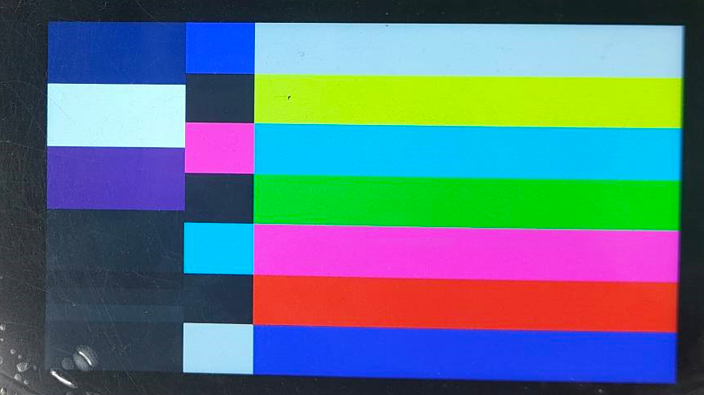
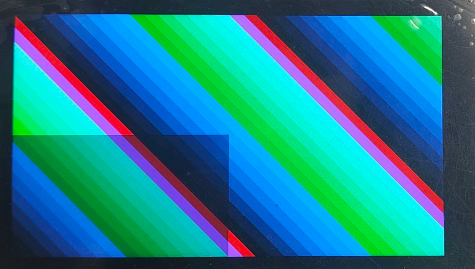
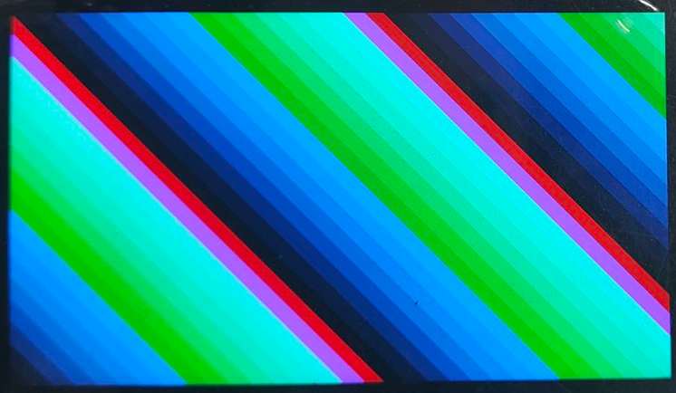

# K230 DRM使用指南


版权所有©2023北京嘉楠捷思信息技术有限公司

<div style="page-break-after:always"></div>

## 免责声明

您购买的产品、服务或特性等应受北京嘉楠捷思信息技术有限公司（“本公司”，下同）及其关联公司的商业合同和条款的约束，本文档中描述的全部或部分产品、服务或特性可能不在您的购买或使用范围之内。除非合同另有约定，本公司不对本文档的任何陈述、信息、内容的正确性、可靠性、完整性、适销性、符合特定目的和不侵权提供任何明示或默示的声明或保证。除非另有约定，本文档仅作为使用指导参考。

由于产品版本升级或其他原因，本文档内容将可能在未经任何通知的情况下，不定期进行更新或修改。

## 商标声明

、“嘉楠”和其他嘉楠商标均为北京嘉楠捷思信息技术有限公司及其关联公司的商标。本文档可能提及的其他所有商标或注册商标，由各自的所有人拥有。

**版权所有 © 2023北京嘉楠捷思信息技术有限公司。保留一切权利。**
非经本公司书面许可，任何单位和个人不得擅自摘抄、复制本文档内容的部分或全部，并不得以任何形式传播。

<div style="page-break-after:always"></div>

## 目录

[TOC]

## 前言

### 概述

本文档主要介绍DRM驱动及其用户态接口libdrm库

### 读者对象

本文档（本指南）主要适用于以下人员：

- 技术支持工程师
- 软件开发工程师

### 缩略词定义

| 简称 | 说明 |
| --- | --- |
| DRM | Direct Rendering Manager |
| KMS | Kernel Mode Setting
| GEM | Graphics Execution Manager

### 修订记录

| 文档版本号 | 修改说明 | 修改者 | 日期 |
| --- | --- | --- | --- |
| V1.0 | 初版 | 王权 | 2023/06/29 |

## 1. DRM简介

DRM是linux内核中负责与显卡交互的管理架构，用户程序可以很方便的利用DRM提供的API，实现显示控制、3D渲染、视频编解码、GPU计算等工作

### 1.1 DRM架构特点

DRM是当前Linux内核中主流的图形显示框架，相比于传统的FB架构，具有如下特点：

1. DRM架构原生支持多图层合成，FB架构原生不支持多图层合成
1. DRM架构原生支持VSYNC、DMA_BUF、Fence机制
1. DRM架构统一管理渲染和显示驱动，让软件开发和维护更简单

### 1.2 DRM架构组成

从整体架构来说，DRM主要分成三个部分：

- libdrm

    libdrm会对底层接口进行封装，向用户态提供通用的API接口

    libdrm内部还提供modetest程序，用于查询DRM设备的详细信息，同时还可以进行基本的显示测试
- KMS

    KMS表示内核模式设置，主要设置显示分辨率、颜色空间、刷新率以及显示buffer切换和多图层合成
- GEM

    显存管理，负责显存分配和释放

## 2. modetest使用说明

modetest是由libdrm提供的测试程序，可以查询DRM设备的详细信息，同时还可以进行基本的显示测试

### 2.1 查询K230 DRM详细信息

具体指令如下所示：

```sh
[root@canaan ~ ]#modetest -M canaan-drm
Encoders:
id      crtc    type    possible crtcs  possible clones
37      36      DSI     0x00000001      0x00000001

Connectors:
id      encoder status          name            size (mm)       modes   encoders
38      37      connected       DSI-1           68x120          1       37
  modes:
        index name refresh (Hz) hdisp hss hse htot vdisp vss vse vtot
  #0 1080x1920 30.00 1080 1310 1330 1350 1920 1925 1931 1939 78529 flags: ; type: preferred, driver
  props:
        1 EDID:
                flags: immutable blob
                blobs:

                value:
        2 DPMS:
                flags: enum
                enums: On=0 Standby=1 Suspend=2 Off=3
                value: 0
        5 link-status:
                flags: enum
                enums: Good=0 Bad=1
                value: 0
        6 non-desktop:
                flags: immutable range
                values: 0 1
                value: 0
        4 TILE:
                flags: immutable blob
                blobs:

                value:

CRTCs:
id      fb      pos     size
36      0       (0,0)   (1080x1920)
  #0 1080x1920 30.00 1080 1310 1330 1350 1920 1925 1931 1939 78529 flags: ; type: preferred, driver
  props:
        24 VRR_ENABLED:
                flags: range
                values: 0 1
                value: 0
        28 GAMMA_LUT:
                flags: blob
                blobs:

                value:
        29 GAMMA_LUT_SIZE:
                flags: immutable range
                values: 0 4294967295
                value: 256

Planes:
id      crtc    fb      CRTC x,y        x,y     gamma size      possible crtcs
31      0       0       0,0             0,0     0               0x00000001
  formats: NV12 NV21 NV16 NV61
  props:
        8 type:
                flags: immutable enum
                enums: Overlay=0 Primary=1 Cursor=2
                value: 0
32      0       0       0,0             0,0     0               0x00000001
  formats: AR24 AR12 AR15 RG24 RG16
  props:
        8 type:
                flags: immutable enum
                enums: Overlay=0 Primary=1 Cursor=2
                value: 1
33      0       0       0,0             0,0     0               0x00000001
  formats: AR24 AR12 AR15 RG24 RG16
  props:
        8 type:
                flags: immutable enum
                enums: Overlay=0 Primary=1 Cursor=2
                value: 2
34      0       0       0,0             0,0     0               0x00000001
  formats: AR24 AR12 AR15 RG24 RG16
  props:
        8 type:
                flags: immutable enum
                enums: Overlay=0 Primary=1 Cursor=2
                value: 0
35      0       0       0,0             0,0     0               0x00000001
  formats: AR24 AR12 AR15 RG24 RG16
  props:
        8 type:
                flags: immutable enum
                enums: Overlay=0 Primary=1 Cursor=2
                value: 0

Frame buffers:
id      size    pitch

[root@canaan ~ ]#

```

上述信息即K230 DRM详细信息，以下是简要说明:

| 模块ID | 模块名称 | 模块说明 |
| --- | --- | --- |
| 37 | Encoder | 无 |
| 38 | Connector | 无 |
| 36 | CRTC | 分辨率支持：1080x1920 |
| 31 | video图层 |  颜色空间支持：NV12、NV21、NV16、NV61 |
| 32 | OSD图层 |  颜色空间支持：AR24、AR12、AR15、RG24、RG16 |
| 33 | OSD图层 |  颜色空间支持：AR24、AR12、AR15、RG24、RG16 |
| 34 | OSD图层 |  颜色空间支持：AR24、AR12、AR15、RG24、RG16 |
| 35 | OSD图层 |  颜色空间支持：AR24、AR12、AR15、RG24、RG16 |

AR24表示ARGB8888

AR12表示ARGB4444

AR15表示ARGB1555

RG24表示RGB888

RG16表示RGB565

### 2.2 video图层输出smpte彩条，颜色空间为NV12

具体指令如下所示：

```sh
modetest -M canaan-drm -D 0 -a -s 38@36:1080x1920-30 -P 31@36:1080x1920@NV12 -v -F smpte
```

下图所示为LCD显示内容：



### 2.3 OSD图层输出tiles彩条，颜色空间为AR24，即ARGB8888

具体指令如下

```sh
modetest -M canaan-drm -D 0 -a -s 38@36:1080x1920-30 -P 32@36:1080x1920@AR24 -v -F tiles
```

下图所示为LCD显示内容：



### 2.4 OSD图层输出tiles彩条，颜色空间为RG16，即RGB565

具体指令如下所示：

```sh
modetest -M canaan-drm -D 0 -a -s 38@36:1080x1920-30 -P 32@36:1080x1920@RG16 -v -F tiles
```

下图所示为LCD显示内容：



## 3. DRM API介绍

### 3.1 打开DRM设备

```c
    fd = open("/dev/dri/card0", O_RDWR | O_CLOEXEC);
    if (fd < 0) {
        fprintf(stderr, "open card0 error \n");
        return -1;
    }

```

### 3.2 检索DRM资源

```c
drmModeResPtr drmModeGetResources(int fd);

typedef struct _drmModeRes {

        int count_fbs;
        uint32_t *fbs;

        int count_crtcs;
        uint32_t *crtcs;

        int count_connectors;
        uint32_t *connectors;

        int count_encoders;
        uint32_t *encoders;

        uint32_t min_width, max_width;
        uint32_t min_height, max_height;
} drmModeRes, *drmModeResPtr;

```

代码调用实例如下：

```c
    res = drmModeGetResources(fd);
    if (res == NULL) {
        fprintf(stderr, "drmModeGetResources error \n");
        return -1;
    }
    conn_id = res->connectors[0];
    crtc_id = res->crtcs[0];

```

### 3.3 使能或者禁止DRM相关特性

```c
int drmSetClientCap(int fd, uint64_t capability, uint64_t value);
```

代码调用实例如下：

```c
    ret = drmSetClientCap(fd, DRM_CLIENT_CAP_UNIVERSAL_PLANES, 1);
    if (ret) {
        fprintf(stderr, "drmSetClientCap DRM_CLIENT_CAP_UNIVERSAL_PLANES error \n");
        return -1;
    }

    ret = drmSetClientCap(fd, DRM_CLIENT_CAP_ATOMIC, 1);
    if (ret) {
        fprintf(stderr, "drmSetClientCap DRM_CLIENT_CAP_ATOMIC error \n");
        return -1;
    }
```

### 3.4 检索图层资源

```c
drmModePlaneResPtr drmModeGetPlaneResources(int fd);

typedef struct _drmModePlaneRes {
        uint32_t count_planes;
        uint32_t *planes;
} drmModePlaneRes, *drmModePlaneResPtr;

```

代码调用实例如下：

```c
    plane_res = drmModeGetPlaneResources(fd);
    if (plane_res == NULL) {
        fprintf(stderr, "drmModeGetPlaneResources error \n");
        return -1;
    }
    plane_id = plane_res->planes[1];

```

K230 DRM中，图层对应关系如下所示：

plane_res->planes[0] 表示Video层

plane_res->planes[1] ~ plane_res->planes[4] 表示OSD层

### 3.5 获得Connector

```c
drmModeConnectorPtr drmModeGetConnector(int fd, uint32_t connector_id);

typedef struct _drmModeConnector {
        uint32_t connector_id;
        uint32_t encoder_id; /**< Encoder currently connected to */
        uint32_t connector_type;
        uint32_t connector_type_id;
        drmModeConnection connection;
        uint32_t mmWidth, mmHeight; /**< HxW in millimeters */
        drmModeSubPixel subpixel;

        int count_modes;
        drmModeModeInfoPtr modes;

        int count_props;
        uint32_t *props; /**< List of property ids */
        uint64_t *prop_values; /**< List of property values */

        int count_encoders;
        uint32_t *encoders; /**< List of encoder ids */
} drmModeConnector, *drmModeConnectorPtr;

```

代码调用实例如下：

```c
    conn = drmModeGetConnector(fd, conn_id);
    if (conn == NULL) {
        fprintf(stderr, "drmModeGetConnector error \n");
        return -1;
    }

```

### 3.6 申请DRM DUMB缓冲区

代码调用实例如下：

```c
    creq.width = 1080;
    creq.height = 1920;
    creq.bpp = 32;
    creq.fourcc = DRM_FORMAT_ARGB8888;
    ret = drmIoctl(fd, DRM_IOCTL_MODE_CREATE_DUMB, &creq);
    if (ret < 0) {
        fprintf(stderr, "cannot create dumb buffer (%d): %m\n",
            errno);
        return -errno;
    }

```

### 3.7 提交DRM请求

代码调用实例如下：

```c
int drmModeAtomicCommit(int fd,
                   drmModeAtomicReqPtr req,
                   uint32_t flags,
                   void *user_data);

```

## 4. 注意事项

1. K230 DRM开发测试依赖LCD屏幕

1. K230 DRM内部各个模块ID并不是一成不变的，请根据各模块实际ID进行开发和测试
