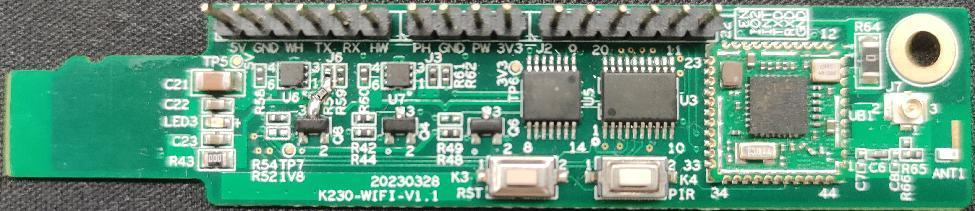
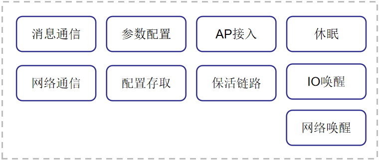
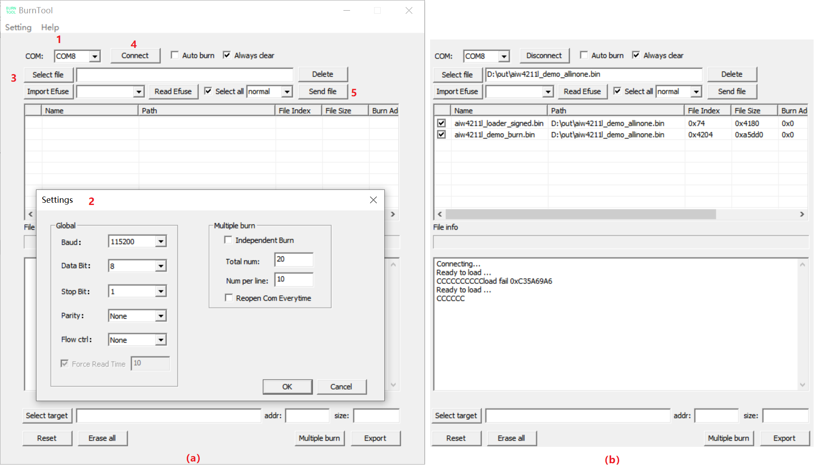
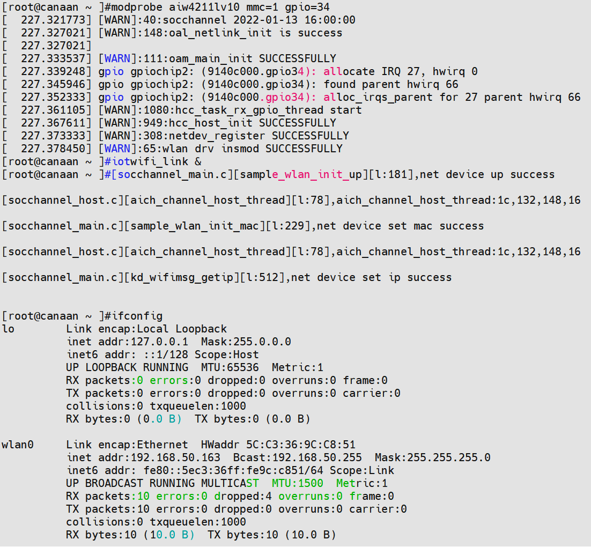
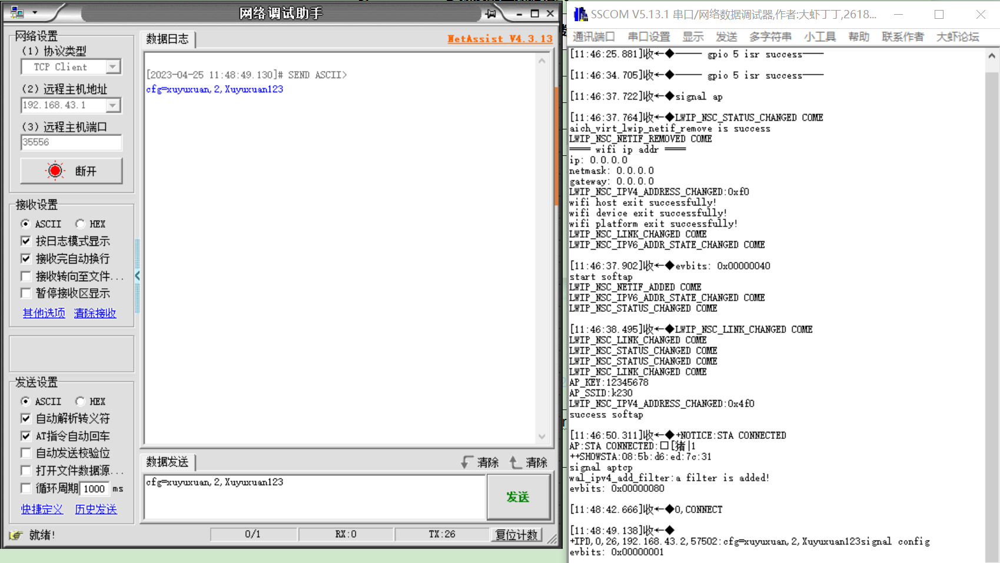
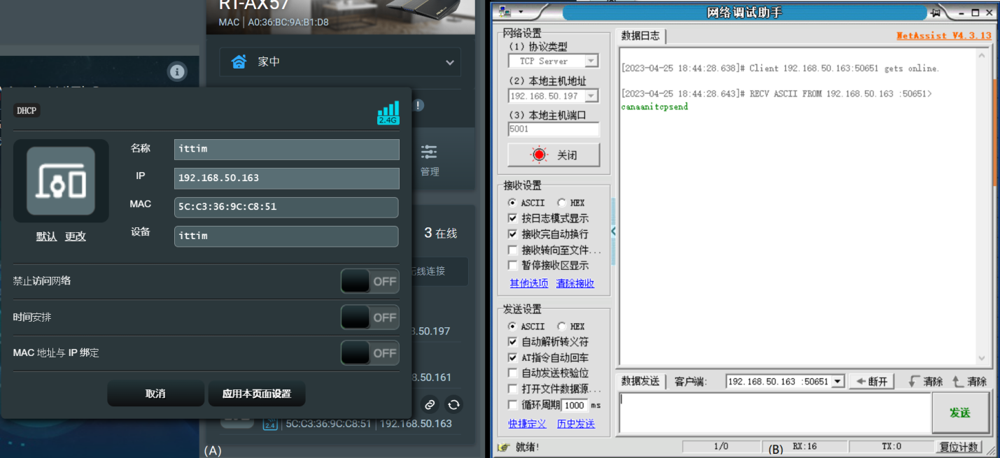
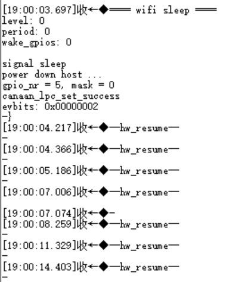
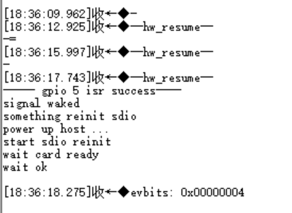
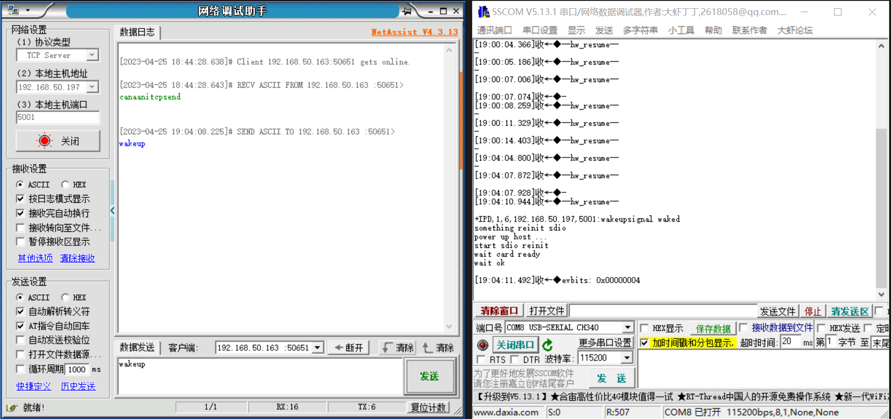

# K230 SDK IoT WiFi AiW4211LV10使用指南


版权所有©2023北京嘉楠捷思信息技术有限公司

<div style="page-break-after:always"></div>

## 免责声明

您购买的产品、服务或特性等应受北京嘉楠捷思信息技术有限公司（“本公司”，下同）及其关联公司的商业合同和条款的约束，本文档中描述的全部或部分产品、服务或特性可能不在您的购买或使用范围之内。除非合同另有约定，本公司不对本文档的任何陈述、信息、内容的正确性、可靠性、完整性、适销性、符合特定目的和不侵权提供任何明示或默示的声明或保证。除非另有约定，本文档仅作为使用指导参考。

由于产品版本升级或其他原因，本文档内容将可能在未经任何通知的情况下，不定期进行更新或修改。

## 商标声明

、“嘉楠”和其他嘉楠商标均为北京嘉楠捷思信息技术有限公司及其关联公司的商标。本文档可能提及的其他所有商标或注册商标，由各自的所有人拥有。

**版权所有 © 2023北京嘉楠捷思信息技术有限公司。保留一切权利。**
非经本公司书面许可，任何单位和个人不得擅自摘抄、复制本文档内容的部分或全部，并不得以任何形式传播。

<div style="page-break-after:always"></div>

## 目录

[TOC]

## 前言

### 概述

本文档主要描述IoT WiFi AiW4211LV10具体使用方法及SDK配置编译方法，其中包括软硬件环境搭建，驱动加载及配置工具使用等信息，并对WiFi控制接口进行介绍。

### 读者对象

本文档（本指南）主要适用于以下人员：

- 技术支持工程师
- 软件开发工程师

### 缩略词定义

| 简称 | 说明 |
|------|------|
|      |      |
|      |      |

### 修订记录

| 文档版本号 | 修改说明 | 修改者 | 日期       |
|------------|----------|--------|------------|
| V1.0       | 初版     | 徐百坤 | 2023/04/24 |

## 1. 功能介绍

AiW4211LV10是一款低功耗IoT WiFi芯片，我司采用该芯片平台设计了一款AiW4211LV10开发板，该开发板可通过TF卡插槽接入K230 EVB板。K230 EVB加载AiW4211LV10驱动之后，可以生成wlan0无线网卡，实现网络数据通信。



图1-1 AiW4211LV10开发板

WiFi主要功能如图1-1所示：



图1-1 WiFi功能框图

WiFi主要功能简介：

- 消息通信：WiFi接收并解析Host端发送的消息指令及指令参数，触发相应事件执行
- 网络通信：网络数据透传
- 参数配置：建立SoftAP，接收配置参数，并触发配置事件
- 配置存取：管理配置数据形成的配置文件，存储在flash上
- AP接入：接入指定AP，监控接入状态并进行相应处理
- 保活链路：建立维护与远程服务器之间的保活链路
- 休眠：设置软硬件环境，给Host下电（依据平台特性，K230自下电），WiFi进入休眠模式
- IO唤醒：处理button或PIR唤醒信号，恢复软硬件环境，给Host上电
- 网络唤醒：处理来自保活链路的唤醒数据包，恢复软硬件环境，给Host上电

## 2. 模块依赖

硬件上依赖AiW4211LV10开发板，依赖K230 EVB开发板。软件上依赖于K230 SDK。

### 2.1 软件环境

K230 SDK V0.5.1及后续版本。
AiW4211LV10 SDK。

### 2.2 硬件环境

K230 EVB开发板设置emmc启动，空出TF卡插槽用于AiW4211LV10开发板接入。
开发板硬件版本及跳线见表2-1：

表2-1开发板版本

| **开发板**  | **硬件版本** | **设置**                                                                  |
|-------------|--------------|---------------------------------------------------------------------------|
| K230 EVB    | V1.1         | POWER BY BUTTON启动模式，跳线关系： 1.JUMPER J1 1----2 2.JUMPER J1 13--14 |
| AiW4211LV10 | V1.1         |                                                                           |

K230 EVB开发板飞线到AiW4211LV10开发板排针，连接关系见表2-2：

表2-2 飞线关系

|                   | **Link1**    | **Link2**              | **Link3**          | **Link4**        | **Link5**    | **Link6**    | **Link7**     |
|-------------------|--------------|------------------------|--------------------|------------------|--------------|--------------|---------------|
| **K230** **排针** | TP21 (5V)    | J8.PIN9 (GPIO34)       | J1.PIN9 (RTC_INT4) | J1.PIN14 (PW_EN) |              |              |               |
| **WiFi** **排针** | J6.PIN1 (5V) | J2.PIN3 (SDIO_INT_OUT) | J6.PIN3 (WH)       | J2.PIN2 (GPIO2)  | J2.PIN4 (TX) | J2.PIN5 (RX) | J2.PIN6 (GND) |
| **TTL-USB**       |              |                        |                    |                  | RX           | TX           | GND           |
| **说明**          | 5V供电线     | WiFi数据中断线         | WiFi唤醒K230中断线 | WiFi监控K230电平 | com口收发    | com口收发    | com口GND      |

连接说明：

- TP21是5V电压测试点，需要焊接一个插针，如果K230 EVB版本为V1.0则需要连接到J5 PIN16
- 如果使用不涉及WiFi唤醒K230 EVB则无需建立Link3
- 如果WiFi配置成通过监控K230 core的电源状态进入休眠则建立Link4，否则不需要。
- TTL-USB与WiFi的连线主要是为了观察WiFi的固件输出，无需要可以不连接
- AiW4211LV10开发板排针说明见表2-3

表2-3 WiFi开发板排针说明

| **WIFI子板** **接口** | **信号定义** | **描述**          | **电平**             | **必要性** | **K230 USIP LP3 EVB** **接口** |                             |
|-----------------------|--------------|-------------------|----------------------|------------|--------------------------------|-----------------------------|
| J4                    | 金手指       | SDIO_CLK/CMD/DATA | SDIO信号及GND        | 3.3V       | 必连                           | TF卡槽                      |
| J6                    | PIN1         | VDD_5V_WIFI       | 供电输入_5V          | POWER      | 必连                           | TP21(V1.1) 或J5.PIN16(V1.0) |
|                       | PIN2         | GND               | GND                  | GND        | 预留                           |                             |
|                       | PIN3         | WIFI_WAKE_HOST    | WIFI唤醒K230         | 1.8V       | 功能信号                       | J1.PIN9                     |
|                       | PIN4         | WIFI_UART0_TX     | 串口TX，可连接K230   | 1.8V       | 预留                           | J8.PIN15，目前无连接需求    |
|                       | PIN5         | WIFI_UART0_RX     | 串口RX，可连接K230   | 1.8V       | 预留                           | J8.PIN13，目前无连接需求    |
|                       | PIN6         | HOST_WAKE_WIFI    | K230唤醒WIFI         | 1.8V       | 功能信号                       | J8.PIN11, 目前无连接需求    |
| J2                    | PIN1         | WIFI_POWER_EN     | WIFI使能，预留       | 3.3V       | 预留                           |                             |
|                       | PIN2         | GPIO2             | 监控K230电平         | 3.3V       | 功能信号                       | J1.PIN14                    |
|                       | PIN3         | SDIO_INT_OUT      | SDIO中断             | 1.8V       | 功能信号                       | J8.PIN9                     |
|                       | PIN4         | UART0_TXD         | 调试串口TXD          | 3.3V       | 调试串口                       | 连PC                        |
|                       | PIN5         | UART0_RXD         | 调试串口RXD          | 3.3V       | 调试串口                       | 连PC                        |
|                       | PIN6         | GND               | GND                  | GND        | 调试串口                       | 连PC                        |
| J3                    | PIN1         | PIR_WAKE_HOST     | PIR唤醒K230          | 1.8V       | 可选                           | J1.PIN待定                  |
|                       | PIN2         | GND               | PIR供电，接PIR黑色线 | GND        | \\                             | \\                          |
|                       | PIN3         | PIR_WAKE_WiFi     | PIR信号，接PIR棕色线 | 3.3V       | \\                             | \\                          |
|                       | PIN4         | VDD_3V3           | PIR供电，接PIR红色线 | POWER      | \\                             | \\                          |

## 3. 模块配置

### 3.1 SDK目录结构

WiFi SDK的目录结构如下：

├── README.txt //简要编译及使用说明文档

├── support //存放固件烧写工具BurnTool.exe，编译环境搭建说明文档及支持包

├── toolchain //固件交叉编译工具链

├── Makefile //编译入口Makefile，可实现一键编译

├── SocChannel //WiFi驱动及配置工具源码

├── AiW4211LV10 //WiFi固件源码

编译驱动的工具链因与平台相关，故未放入SDK之中，如有需要请联系我们。

### 3.2 定制化修改

在WiFi SDK之中，为了便于固件的定制化，与硬件设计关联比较紧密的代码，需要公布且可由用户定制的SoftAP相关参数，以及自定义的被多个文件使用的全局变量等，被放置在canaan_private.h及canaan_private.c文件之中。重点项目说明见表3-1：

表3-1 定制化重点项说明

| **项目**                      | **说明**                                                                                                                                |
|-------------------------------|-----------------------------------------------------------------------------------------------------------------------------------------|
| CONFIG_WIFI_MONITOR_HOSTLEVEL | 使能该宏之后WiFi通过监控K230的电源状态引脚触发休眠，将忽略休眠指令                                                                      |
| HOST_LLEVEL_TIME              | 配合CONFIG_WIFI_MONITOR_HOSTLEVEL使用，电源状态引脚拉低持续HOST_LLEVEL_TIME时间将触发休眠，设置该时间是为了防抖及过滤冷启动的不稳定状态 |
| LONG_PRESS_TIME               | 长按WiFi开发板上的K4按键持续LONG_PRESS_TIME时间WiFi将建立SoftAP模式，用于配置AP接入。参考5.3.1。                                        |
| TCP_SERVER_PORT               | SoftAP建立之后，WiFi启动一个tcp socket server用于接收网络配置信息，TCP_SERVER_PORT是指定监听端口                                        |
| g_softap_ipaddr               | SoftAP的网关、掩码及ip                                                                                                                  |
| g_softapcfg                   | SoftAP的热点名称及密码等                                                                                                                |
| gpios_config\[\] g_gpios_config | WiFi GPIO配置表，与硬件设计相关，描述各功能GPIO的编号、功能名、方向、中断类型及触发方式和中断回调函数                                   |
| kd_gpios_hoststanby           | WiFi给Host下电接口，可根据平台特性实现，因K230自下电，此接口未操作任何IO                                                                |
| kd_gpios_wakehost             | WiFi给Host上电接口，可根据平台特性实现，针对K230平台，WiFi给K230 PMU发送了一个IO信号                                                    |

## 4. 固件编译

### 4.1 编译环境

固件编译环境搭建请参考文档《AiW4211V10／AiW4211LV10 SDK开发环境搭建 用户指南.pdf》，该文档存储于WiFi SDK的support目录。
使用者也可以联系 成都爱旗科技有限公司(<http://www.aichtech.com/>) 索取相关资料。

### 4.2 编译方法

进入WiFi SDK源码目录执行指令make all和make install，编译得到WiFi固件、驱动、配置工具及通信接口共享库文件存储在顶层的out目录下：

out/

├── bin

│ ├── aiw4211l_demo_allinone.bin

│ ├── aiw4211lv10.ko

│ ├── wifi.conf

│ ├── iotwifi_link

│ ├── iotwifi_cli

│ └── k230_pwrdown

├── inc

│ ├── soc_msg.h

│ └── hal_iotwifi_cli.h

└── lib

└── libhal_iotwifi.so

也可以各部分独立编译：
make firmware：编译WiFi固件aiw4211l_demo_allinone.bin
make driver：编译WiFi驱动aiw4211lv10.ko
make tools：编译配置工具和通信接口共享库，iotwifi_link、iotwifi_cli、libhal_iotwifi.so、k230_pwrdown

备注：K230 SDK已经集成了WiFi驱动、配置工具和通信接口库，因此这些可以不编译

## 5. 模块启动

### 5.1 固件烧写

使用WiFi SDK support目录 下的烧写工具BurnTool.exe，通过串口将固件aiw4211l_demo_allinone.bin烧写到AiW4211LV10开发板。

烧写方法请参考文档《AiW4211V10／AiW4211LV10 BurnTool工具 使用指南.pdf》，该文档存储于WiFi SDK的support目录。

使用者也可以联系 成都爱旗科技有限公司(<http://www.aichtech.com/>) 索取相关资料。

图5-1展示的是单板快速烧写的示意图：



图5-1 单板快速烧写

step 1: 选择烧写COM口
step 2: 通过“Setting”菜单项配置COM口参数
step 3: 选择WiFi固件
step 4: 点击“Connect”控件向WiFi开发板发起连接，WiFi开发板上电，工具log窗口可以看到ready to load ...，表示连接已经建立，可以开始烧写了
step 5: 点击“Send file”控件开始烧写

### 5.2 驱动加载

参考2.2节内容配置硬件环境，长按K230 EVB板上K1按键上电启动，加载驱动：

modprobe aiw4211lv10 或者 modprobe aiw4211lv10 mmc=1 gpio=34

启动配置工具server端并置于后台运行：iotwifi_link &

当前驱动支持传入mmc主控编号及用于中断检测的gpio编号，可以实现较为灵活的硬件配置，如果不传参则分别使用代码中规定的默认值1和34。iotwifi_link的功能角色类似于wpa_supplicant，它首先会将wlan0 up起来，然后从WiFi设备侧同步mac地址及ip地址到Host端。



图 5-2 驱动加载及iotwifi_link启动

### 5.3 参数配置

AiW4211LV10的接入AP、休眠等级、休眠周期、唤醒IO、tcp keepalive的目标server、保活参数等直接影响WiFi运行，且需要根据实际场景进行动态调整的参数，可以通过5.3.1和5.3.2节提供的方式方法进行传参配置。

除非用户想要改变配置，否则每次启动之后无需重配。

#### 5.3.1 通过网络配置AP接入

AiW4211LV10开发板支持通过网络配置目标AP的名称、密码和加密方式这三个参数。配置AP接入的步骤如下：

step 1: 准备一个路由器，并记录其热点名称、密码和加密方式信息
step 2: AiW4211LV10开发板在固件烧写之后初次启动运行时，或者在已经完成配置的情况下长按板上K4按键3s，WiFi将启动SoftAP模式生成一个热点并建立一个基于TCP协议的socket server
step 3: 将PC连入该热点，然后启动NetAssist
step 4: 配置NetAssist作为 tcp socket client连接到WiFi
step 5: server解析配置数据后连接到指定AP，退出SoftAP模式

使用者如有能力可以开发一个手机APP进行网络配置，这里为简单起见只是使用了PC+NetAssist方案。SoftAP参数及配置数据格式见表5-1，NetAssist配置运行见图5-1：

表 5-1 SoftAP参数及配置数据格式

| **项目**    | **参数**                                                                                          |
|-------------|---------------------------------------------------------------------------------------------------|
| AP name     | k230                                                                                              |
| AP password | 12345678                                                                                          |
| server ip   | 192.168.43.1                                                                                      |
| server port | 35556                                                                                             |
| config data | cfg=\<targer ap name\>,\<targer ap auth\>,\<targer ap password\> 例如：cfg=xuyuxuan,2,Xuyuxuan123 |



图 5-3 NetAssist配置运行

#### 5.3.2 通过消息配置AP接入

AiW4211LV10开发板支持通过消息通道配置目标AP参数（与5.3.1功能相同），除此之外还可以通过消息通道配置WiFi休眠参数和tcp keepalive参数。消息通道是K230与AiW4211LV10之间通过SDIO总线建立起来的软件通道。

##### 5.3.2.1 通过配置工具配置

配置步骤如下：

step 1: 准备一个路由器并启动热点
step 2: 将PC接入该热点，然后启动NetAssist，这里为简单起见使用PC+NetAssist作为远端保活服务器
step 3: 配置NetAssist作为 tcp socket server等待WiFi保活链路的接入
step 4: K230端根据热点信息和NetAssist启动的server信息编辑配置文件/etc/wifi.conf
step 5: 运行配置工具client端，解析配置文件，发送配置消息：iotwifi_cli --config /etc/wifi.conf
step 6: AiW4211LV10接收到配置参数之后，首先存储休眠参数，然后接入指定AP，最后建立tcp socket client连入NetAssist建立的 tcp socket server

/etc/wifi.conf是WiFi工作参数配置文件，以json格式编写，基本上是对[wifi_config_t](#6121-wifi_config_t)结构体的映射，具体可参考6.1.2章节。文件内容如下：

```c
{
"sleep": {
"level": 2,
"period": 3000,
"wake_gpios": [5]
},
"conn": {
"ssid": "xuyuxuan",
"auth": 2,
"key": "Xuyuxuan123",
"bssid": "",
"pairwise": 0
},
"keepalive": {
"svrip": "192.168.50.197",
"svrport": 5001,
"time": 10,
"intvl": 2,
"probes": 5,
"hrintvl": 60,
"hrprobes": 5
}
}
```

备注： "wake_gpios": \[5\] 是一个数组项，当前数组只有一个元素5，表示WiFi可以被自身的gpio5唤醒，该IO对应按键K4，如果新添加唤醒源可以以逗号分隔追加。这取决于具体的硬件设计。



图 5-4 （A）WiFi接入路由器并被分配IP （B）tcp keepalive server

##### 5.3.2.2 通过调用API配置

在实际的业务程序中，可以通过调用通信接口共享库libhal_iotwifi.so提供的API接口[kd_wifi_config](#6121-wifi_config_t)进行参数配置，API说明请参考6.1.1章节，配置步骤与5.3.2.1相同。

5.3.2.1节当中介绍的工具iotwifi_cli也是通过调用该接口实现WiFi参数配置的。

### 5.4 系统休眠

#### 5.4.1 通过工具配置休眠

运行配置工具client端发送休眠指令触发WiFi休眠：iotwifi_cli --dirsleep



图 5-5 WiFi进入休眠log

#### 5.4.2 通过调用API休眠

在实际的业务程序中，可以通过调用通信接口共享库libhal_iotwifi.so提供的API接口[kd_wifi_sleep](#62-sleep接口)触发WiFi休眠，具体请参考6.2章节。

工具iotwifi_cli也是通过调用该接口触发WiFi休眠的。

#### 5.4.3 通过监控电平休眠

K230 EVB可以实现自下电，下电之后K230 EVB开发板J1 PIN14（PW_EN）引脚的电平将会被拉低，WiFi也可以通过监控该引脚的电平触发休眠。该功能使用的前提是K230功耗管理功能正常，并在编译WiFi固件时使能宏 CONFIG_WIFI_MONITOR_HOSTLEVEL（默认不使能），使能该宏之后WiFi将忽略K230发送的sleep指令，仅依据引脚电平状态进行休眠。

工具k230_pwrdown可以实现较为简单的K230 EVB双核自下电，它未做任何文件存储、状态检测等业务逻辑上的安全处理，因此只可以用于电平触发WiFi休眠的场景验证。该工具未集成到K230 SDK当中，因此需要拷贝到K230 EVB上执行：

./k230_pwrdown

### 5.5 系统唤醒

#### 5.5.1 按键唤醒

如果WiFi已进入休眠状态，短按AiW4211LV10开发板上的K4按键可唤醒WiFi，WiFi将给K230 EVB的PMU发送唤醒信号，如果此时K230 EVB处于5.4.3节配置的下电状态（非冷启动），其将被上电。



图5-6 按键唤醒log

#### 5.5.2 网络唤醒

如果WiFi已进入休眠状态，NetAssist发送wakeup可唤醒WiFi，WiFi将给K230 EVB的PMU发送唤醒信号，如果此时K230 EVB处于5.4.3节配置的下电状态（非冷启动），其将被上电。



图5-7 网络唤醒log

## 6. API参考

AiW4211LV10驱动加载后生成的无线网卡与一般WiFi网卡无异，因此网络通信功能无特殊API需要说明。
除基本的网络通信外，K230与WiFi还存在两个消息通信接口，需要重点说明。

### 6.1 config接口

#### 6.1.1 API

int kd_wifi_config([wifi_config_t](#6121-wifi_config_t) \*config)
配置WiFi工作参数：

- 配置目标AP的名称、密码、认证及加密方式
- 配置WiFi休眠等级，苏醒周期以及可唤醒的gpio
- 配置tcp keepalive时间参数等

#### 6.1.2 数据结构

##### 6.1.2.1 wifi_config_t

```c
typedef struct {
unsigned int config_mask;
#define CFG_MASK_SLEEP (1 << 0)
#define CFG_MASK_CONNECT (1 << 1)
#define CFG_MASK_KEEPALIVE (1 << 2)
wifi_sleep_t sleep;
wifi_connect_t conn;
wifi_keepalive_t keepalive;
} wifi_config_t;
```

表6-1 wifi_config_t结构体成员

| config_mask                    | 配置目标项掩码，使能或屏蔽目标项，例如全部配置则：config_mask = CFG_MASK_SLEEP\|CFG_MASK_CONNECT\|CFG_MASK_KEEPALIVE CFG_MASK_SLEEP：配置休眠参数 CFG_MASK_CONNECT：配置AP连接参数 CFG_MASK_KEEPALIVE：配置tcp keepalive参数 |
|--------------------------------|------------------------------------------------------------------------------------------------------------------------------------------------------------------------------------------------------------------------------|
| [sleep](#6122-wifi_sleep_t)         | 休眠参数                                                                                                                                                                                                                     |
| [conn](#6123-wifi_connect_t)        | AP连接参数                                                                                                                                                                                                                   |
| [keepalive](#6124-wifi_keepalive_t) | tcp keepalive参数                                                                                                                                                                                                            |

##### 6.1.2.2 wifi_sleep_t

```c
typedef struct
{
unsigned int level;
#define WIFI_SLEEP_LIGHT 1
#define WIFI_SLEEP_DEEP 2
#define WIFI_SLEEP_ULTRA 3
unsigned int period;
union
{
/*
* gpioX_wake: 0---disable, 1---enable
*/
struct {
unsigned int gpio0_wake:1;
unsigned int gpio1_wake:1;
unsigned int gpio2_wake:1;
unsigned int gpio3_wake:1;
unsigned int gpio4_wake:1;
unsigned int gpio5_wake:1;
unsigned int gpio6_wake:1;
unsigned int gpio7_wake:1;
unsigned int gpio8_wake:1;
unsigned int gpio9_wake:1;
unsigned int gpio10_wake:1;
unsigned int gpio11_wake:1;
unsigned int gpio12_wake:1;
unsigned int gpio13_wake:1;
unsigned int gpio14_wake:1;
};
unsigned int wake_gpios;
};
} wifi_sleep_t;
```

表6-2 wifi_sleep_t结构体成员

| level      | 休眠等级 WIFI_SLEEP_LIGHT：浅睡 WIFI_SLEEP_DEEP：深睡，主要休眠模式 WIFI_SLEEP_ULTRA：超深睡，只有3/5/7/14号gpio可唤醒，目前不使用 |
|------------|------------------------------------------------------------------------------------------------------------------------------------|
| period     | 苏醒周期，有效数值33\~\~4000ms。WiFi周期性从休眠态醒来，检测AP是否有发给自己的数据缓存                                             |
| wake_gpios | enable或disable可唤醒WiFi的gpio（WiFi侧gpio）                                                                                      |

##### 6.1.2.3 wifi_connect_t

```c
typedef struct
{
char ssid[EXT_WIFI_MAX_SSID_LEN + 1];
ext_wifi_auth_mode auth;
char key[EXT_WIFI_MAX_KEY_LEN + 1];
unsigned char bssid[EXT_WIFI_MAC_LEN];
ext_wifi_pairwise pairwise;
} wifi_connect_t;
```

表6-3 wifi\_**connect**\_t结构体成员

| ssid     | AP名称                                                                                                                                                                                                                                                                         |
|----------|--------------------------------------------------------------------------------------------------------------------------------------------------------------------------------------------------------------------------------------------------------------------------------|
| auth     | 认证类型 EXT_WIFI_SECURITY_OPEN EXT_WIFI_SECURITY_WEP EXT_WIFI_SECURITY_WPA2PSK EXT_WIFI_SECURITY_WPAPSK_WPA2PSK_MIX EXT_WIFI_SECURITY_WPAPSK EXT_WIFI_SECURITY_WPA EXT_WIFI_SECURITY_WPA2 EXT_WIFI_SECURITY_SAE EXT_WIFI_SECURITY_WPA3_WPA2_PSK_MIX EXT_WIFI_SECURITY_UNKNOWN |
| Key      | AP密码                                                                                                                                                                                                                                                                         |
| bssid    | AP bssid，一般为AP mac地址                                                                                                                                                                                                                                                     |
| pairwise | 加密类型 EXT_WIFI_PARIWISE_UNKNOWN EXT_WIFI_PAIRWISE_AES EXT_WIFI_PAIRWISE_TKIP EXT_WIFI_PAIRWISE_TKIP_AES_MIX                                                                                                                                                                 |

##### 6.1.2.4 wifi_keepalive_t

```c
typedef struct
{
unsigned char svrip[16];
unsigned short svrport;
unsigned short tcp_keepalive_time;
unsigned short tcp_keepalive_intvl;
unsigned short tcp_keepalive_probes;
unsigned short heartbeat_intvl;
unsigned short heartbeat_probes;
} wifi_keepalive_t;
```

表6-4 wifi_keepalive_t结构体成员

| svrip                | server端ip地址                                                          |
|----------------------|-------------------------------------------------------------------------|
| svrport              | server端端口号                                                          |
| tcp_keepalive_time   | TCP层keepalive心跳包常规发送周期，秒                                    |
| tcp_keepalive_intvl  | TCP层keepalive心跳包无回应之后新的发送周期，秒                          |
| tcp_keepalive_probes | TCP层keepalive心跳包无回应计数超过该阈值之后，判断TCP连接异常，断开重连 |
| heartbeat_intvl      | 应用层心跳包发送周期，秒                                                |
| heartbeat_probes     | 应用层心跳包无回应计数超过该阈值之后，判断socket连接异常，断开重连      |

### 6.2 sleep接口

int kd_wifi_sleep(void)
控制WiFi进入休眠，休眠相关参数在config API当中设置。

## 7.wifi功能限制

  AiW4211LV10芯片为单频wifi芯片,不支持ap和sta同时共存，当ap启动时固定在某一信道，再起sta的话sta会在不同的信道上扫描，此时ap就会断连。
  当通过sdio传入conf为错误配置时，AiW4211LV10会显示sta连接ap失败 串口打印 please reset conf，此时可通过iotwifi_cli传入新的正确的conf。
  当通过client传入sta错误配置时，wifi从ap会切换到sta模式，AiW4211LV10会显示sta连接ap失败 串口同样打印please reset conf，由于sta与ap不能同时共存，这时wifi芯片会从sta切换到ap模式重新起tcp server ，sta需要重新连接ap,作为client重新接入。
