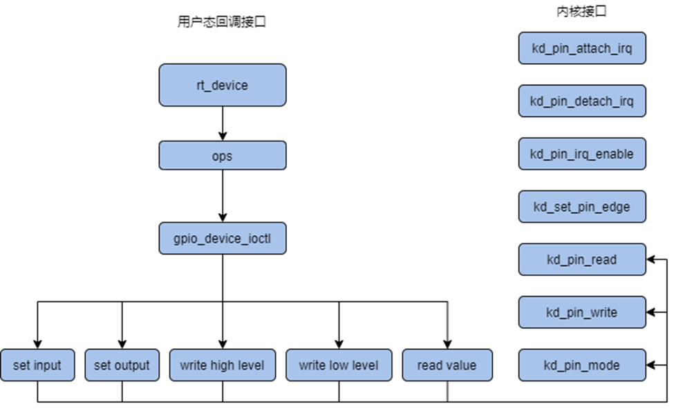
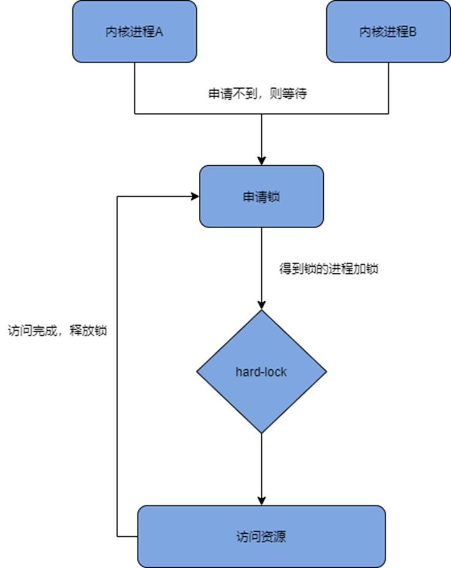

# K230大核低速驱动API参考


版权所有©2023北京嘉楠捷思信息技术有限公司

<div style="page-break-after:always"></div>

## 免责声明

您购买的产品、服务或特性等应受北京嘉楠捷思信息技术有限公司（“本公司”，下同）及其关联公司的商业合同和条款的约束，本文档中描述的全部或部分产品、服务或特性可能不在您的购买或使用范围之内。除非合同另有约定，本公司不对本文档的任何陈述、信息、内容的正确性、可靠性、完整性、适销性、符合特定目的和不侵权提供任何明示或默示的声明或保证。除非另有约定，本文档仅作为使用指导参考。

由于产品版本升级或其他原因，本文档内容将可能在未经任何通知的情况下，不定期进行更新或修改。

## 商标声明

、“嘉楠”和其他嘉楠商标均为北京嘉楠捷思信息技术有限公司及其关联公司的商标。本文档可能提及的其他所有商标或注册商标，由各自的所有人拥有。

**版权所有 © 2023北京嘉楠捷思信息技术有限公司。保留一切权利。**
非经本公司书面许可，任何单位和个人不得擅自摘抄、复制本文档内容的部分或全部，并不得以任何形式传播。

<div style="page-break-after:always"></div>

## 目录

[TOC]

## 前言

### 概述

本文档主要介绍 K230 大核RT-Smart上驱动软件设计，设计内容主要包括 UART、I2C、GPIO、Hard-lock、ADC、WDT、OTP、TS、PWM、RTC、TIMER等驱动在用户态和内核态的使用。

### 读者对象

本文档（本指南）主要适用于以下人员：

- 技术支持工程师
- 软件开发工程师

### 缩略词定义

| 简称      | 说明                                        |
|-----------|---------------------------------------------|
| UART      | Universal Asynchronous Receiver/Transmitter |
| I2C       | Inter-Integrated Circuit                    |
| GPIO      | General-purpose input/output                |
| Hard-lock | 硬件互斥锁                                  |
| ADC       | analog-to_digital converter                 |
| WDT       | watchdog                                    |
| OTP       | One-Time Programmable                       |
| TS        | Temperature Sensor                          |

### 修订记录

| 文档版本号  | 修改说明  | 修改者     | 日期              |
|------------|----------|------------|-------------------|
| V1.0       | 初版                  | 范俊涛 | 2023/4/26 |
| V1.1       | 增加watchdog部分      | 范俊涛 | 2023/5/26 |
| V1.2       | 增加OTP TS部分        | 范俊涛 | 2023/5/31 |
| V1.3       | 增加pwm rtc timer部分 | 范俊涛 | 2023/6/29 |

## 1 概述

### 1.1 概述

UART：

通用异步收发器，该总线双向通信，可以实现全双工传输和接收。在嵌入式设计中，UART用来与PC进行通信，包括与监控调试器和其它器件，如EEPROM通信。

I2C：

由Philips公司（2006年迁移到NXP）在1980年代初开发的一种简单、双线双向的同步串行总线，它利用一根时钟线和一根数据线在连接总线的两个器件之间进行信息的传递，为设备之间数据交换提供了一种简单高效的方法。每个连接到总线上的器件都有唯一的地址，任何器件既可以作为主机也可以作为从机，但同一时刻只允许有一个主机。

GPIO：

（general porpose intput output）通用输入输出端口的简称。可以通过软件控制其输出和输入，通俗来说就是常用引脚，可以控制引脚的高低电平，对其进行读取或者写入。

Hard-lock：

嘉楠自研模块，用于同核不通进程间或异核之间对共享资源的互斥而实现的硬件互斥锁，可用于对共享资源的互斥使用。

ADC：

ADC 即模拟数字转换器（Analog-to-digital converter），是指将连续变化的模拟信号转换为离散的数字信号的器件。真实世界的模拟信号，例如温度、压力、声音或者图像等，需要转换成更容易储存、处理和发射的数字形式。模数转换器可以实现这个功能，在各种不同的产品中都可以找到它的身影。

WDT：
WDT 是watchdog的简称，本质上是一个定时器，软件程序需要每隔一段时间喂一次狗，如果WDT超时则可以产生一个中断信号或复位信号到CPU，由此通过软硬件结合的方式防止程序运行异常而不复位。

OTP：
OTP 主要用于存储安全敏感的机密信息。OTP 集成在安全模块 PUF 中，为整个 SoC 提供安全存储功能，保护根密钥和启动代码等关键数据不被攻击者破坏。大核侧 OTP 驱动主要提供读、写两种功能，可读写区域768bytes 空间。如果产品量产需要用到OTP的读写保护功能等等，请联系我们，我们会提供相关的接口驱动程序。

TS：
K230 TS（Temperature Sensor），自研温度传感器，采用 TSMC 12nm 工艺。TS 的应用场景是降频。大核侧 TS 驱动主要提供读功能，在读 TS 之前，首先需要配置 TS 寄存器使能信号、输出模式，然后才能读出芯片的结温。另外，TS 寄存器每 2.6s 读取一次芯片结温。

PWM：是一种对模拟信号电平进行数字编码的方法，通过不同频率的脉冲使用方波的占空比用来对一个具体模拟信号的电平进行编码，使输出端得到一系列幅值相等的脉冲，用这些脉冲来代替所需要波形的设备。

RTC：实时时钟可以提供精确的实时时间，它可以用于产生年、月、日、时、分、秒、星期等信息。

TIMER(HWTIMER)：通过内部计数器模块对内外部脉冲信号进行计数，可以工作在定时器模式和计数器模式。

### 1.2 功能描述

UART驱动结构如下图：


I2C驱动结构如下图：


GPIO驱动结构如下图：



Hard-lock驱动结构如下图：



adc 驱动结构如下图：


将 adc 硬件抽象为一个设备，设备包含六个通道。支持采样电压范围为 0V\~1.8V，浮动范围为 5mv。

WDT 驱动结构如下图：


OTP 驱动结构如下图：


TS 驱动结构如下图所示：


PWM 驱动结构如下图所示：


RTC 驱动结构如下图所示：


TIMER 驱动结构如下图所示：


### 1.3 驱动API使用方法

#### 1.3.1 UART

##### 内核态程序使用uart

1. 通过设备节点找到设备句柄。

`uart_dev = rt_device_find(“uart”)`

1. 以中断接收及轮询发送模式打开串口设备

`rt_device_open(uart_dev, RT_DEVICE_FLAG_INT_RX)`

1. 设置接收回调函数

`rt_device_set_rx_indicate(uart_dev,call_back)`

1. 发送字符串

`rt_device_write(uart_dev, 0, str, (sizeof(str) - 1))`

#### 1.3.2 I2C

##### 内核态程序使用i2c

1. 通过总线名找到总线句柄

`i2c_bus = rt_i2c_bus_device_find(I2C_NAME)`

1. 构建message

```text
struct rt_i2c_msg msgs
msgs.addr = CHIP_ADDRESS;
msgs.flags = RT_I2C_WR;
msgs.buf = buf;
msgs.len = 2;
```

1. 传输

`rt_i2c_transfer(bus, &msgs, 1)`

#### 1.3.3 GPIO

##### 内核态程序使用gpio

1. 包含头文件

`#include "drv_gpio.h"`

1. 设置关键输入输出模式

`kd_pin_mode(LED_PIN_NUM1, GPIO_DM_OUTPUT)`
`kd_pin_mode(KEY1_PIN_NUM, GPIO_DM_INPUT)`

1. 设置高低电平

`kd_pin_write(LED_PIN_NUM1, GPIO_PV_LOW)`
`kd_pin_write(LED_PIN_NUM1, GPIO_PV_HIGH)`

1. 读取电平

`kd_pin_read(KEY1_PIN_NUM)`

1. 设置中断方式，绑定中断函数

`kd_pin_attach_irq(KEY1_PIN_NUM,GPIO_PE_FALLING, key_irq, RT_NULL)`

1. 中断使能

`kd_pin_irq_enable(KEY1_PIN_NUM, KD_GPIO_IRQ_ENABLE)`

##### 用户态程序使用gpio(仅读写)

1. 打开设备

`gpio_fd = open("/dev/gpio", O_RDWR)`

1. 配置输入输出模式

`ioctl(fd, GPIO_DM_OUTPUT, &mode33)`

1. 输出高低电平

`ioctl(fd, GPIO_WRITE_HIGH, &mode33)`

1. 读取电平

`ioctl(fd, GPIO_READ_VALUE, &mode27)`

#### 1.3.4 Hard-lock

##### 内核态使用hard-lock

1. 包含头文件

`#include "drv_hardlock.h"`

1. 申请使用锁

`kd_request_lock(rt_uint32_t num)`

1. 释放锁

`kd_hardlock_unlock(rt_uint32_t num)`

#### 1.3.5 ADC

##### 1.3.5.1 用户态 msh 使用 adc

用户通过 msh 来获取 adc 采样值的步骤如下：

1. 在使用设备前，需要先查找设备是否存在，可以使用命令 adc probe 后面跟注册的 ADC 设备的名称。如下所示；

`msh />adc probe adc`
`probe adc success`

1. 使能设备的某个通道可以使用命令 adc enable 后面跟通道号；

`msh />adc enable 0`
`adc channel 0 enables success`

1. 读取 ADC 设备某个通道的数据可以使用命令 adc read 后面跟通道号；

`msh />adc read 0`
`adc channel 0 read value is 0x00000796`

1. 关闭设备的某个通道可以使用命令 adc enable 后面跟通道号；

`msh />adc disable 0`
`adc channel 0 disable success`

##### 1.3.5.2 用户态程序使用 adc

用户态程序中获取 adc 采样值的步骤如下：

1. rt_device_find 查找 adc 设备。如下所示：

`rt_device_t adc_dev;`
`adc_dev = rt_device_find("adc");`

1. 通过设备句柄打开 adc 设备。如下所示：

`ret = rt_device_open(adc_dev, RT_DEVICE_OFLAG_RDWR);`

1. 通过设备句柄使能 adc 设备的某个通道。如下所示：

```text
uint32_t *p;
uint32_t channel = 0;
p = (uint32_t *)(intptr_t)channel;
ret = rt_device_control(adc_dev, 0, (void *)p);
```

1. 通过设备句柄从 adc 读取数据。如下所示：

```text
uint32_t channel = 0;
uint32_t reg_value;
rt_device_read(adc_dev, channel, (void *)&reg_value, sizeof(unsigned int));
```

1. 当不再使用 adc 的某个通道时，通过设备句柄失能 adc 设备的某个通道；

```text
uint32_t *p;
uint32_t channel = 0;
p = (uint32_t *)(intptr_t)channel;
ret = rt_device_control(adc_dev, 0, (void *)p);
```

##### 1.3.5.3 内核态程序使用 adc

1. 查找 adc 设备

应用程序根据 adc 设备名称获取设备句柄，进而可以操作 adc 设备，查找设备函数如下所示：

`rt_device_t rt_device_find(const char* name);`

1. 使能 adc 通道

`rt_err_t rt_adc_enable(rt_adc_device_t dev, rt_uint32_t channel);`

1. 读取 adc 通道采样值

`rt_uint32_t rt_adc_read(rt_adc_device_t dev, rt_uint32_t channel);`

1. 关闭 adc 通道

`rt_err_t rt_adc_disable(rt_adc_device_t dev, rt_uint32_t channel);`

#### 1.3.6 WDT

##### 1.3.6.1 用户态程序使用WDT

1. 打开设备节点

`open(WDT_DEVICE_NAME, O_RDWR);`

1. 设置超时时间

`ioctl(wdt_fd, CTRL_WDT_SET_TIMEOUT, &timeout);`

1. 启动看门狗计时

`ioctl(wdt_fd, CTRL_WDT_START, NULL);`

1. 喂狗

`ioctl(wdt_fd, CTRL_WDT_KEEPALIVE, NULL)`

##### 1.3.6.2 内核态程序使用WDT

1. 获取设备句柄

`wdt_dev = rt_device_find(WDT_DEVICE_NAME);`

1. 初始化设备

`rt_device_init(wdt_dev);`

1. 设置超时时间

`rt_device_control(wdt_dev, KD_DEVICE_CTRL_WDT_SET_TIMEOUT, &timeout);`

1. 启动看门狗计时

`rt_device_control(wdt_dev, KD_DEVICE_CTRL_WDT_START, RT_NULL);`

1. 喂狗

`rt_device_control(wdt_dev, KD_DEVICE_CTRL_WDT_KEEPALIVE, RT_NULL);`

#### 1.3.7 OTP

大核侧 OTP 驱动可以支持被内核态其它驱动调用、用户态应用程序调用等场景，下面，将分别介绍这两种应用场景下 OTP 驱动的使用方法、注意事项。

##### 1.3.7.1 用户态程序使用 OTP

在 rt-smart 中，应用程序通过 I/O 设备管理接口来访问硬件设备，当实现对应的设备驱动之后，应用程序就可以访问该硬件。Rt-smart 用户层通过操作 `/dev/otp` 来访问 OTP 硬件，用户态应用程序使用 OTP 时，可以通过 open、read、write 等操作来访问 otp 设备。用户态应用程序使用 OTP 的具体操作如下：

1. 添加头文件 `rtdevice.h`；
1. 应用程序根据设备名称获取设备句柄；
1. 获得设备句柄之后，应用程序可以打开设备；
1. 初始化参数，包括偏移量、缓冲区、大小；
1. 通过设备句柄和参数值从 OTP 设备中读取/写入数据；
1. 利用设备句柄关闭设备。

其中，snippet 代码如下所示：

```c
#include <rtdevice.h>
#include <rtthread.h>

// 查找设备，获取句柄
otp_dev = rt_device_find(“otp”);

//  打开设备
ret = rt_device_open(otp_dev, RT_DEVICE_OFLAG_RDWR);

// 初始化读参数并从OTP空间读值，参数分别代表读取OTP的偏移量、要读取的字节长度、缓冲区
uint32_t pos = 0x0;
uint32_t  size = 0x300;
uint32_t buffer[192] = {0};
ret = rt_device_read(otp_dev, pos, (void *)buffer, size);


// 初始化写参数并写入OTP空间，参数分别代表写入OTP的偏移量、写入的字节长度、要写入的值
pos = 0x0;
size = 0x4;
buffer[0] = 0xff11ff11;
ret = rt_device_write(otp_dev, pos, (void *)buffer, size);

// 关闭设备
rt_device_close(otp_dev);

```

##### 1.3.7.2 内核态程序使用 OTP

在rt-smart中，内核态其它驱动程序想要读写 OTP 空间时，只需要调用 OTP 驱动提供的接口即可。具体的步骤如下所示：

1. 添加头文件 `drv_otp.h`；
1. 根据设备名称获取设备句柄；
1. 初始化参数，包括偏移量、缓冲区、大小；
1. 通过设备句柄和参数值从 OTP 设备中读取/写入数据；
   - otp_device_read
   - otp_device_write

其中，snippet 代码如下所示：

```c
#include drv_otp.h

// 获取句柄
otp_dev = rt_device_find(“otp”);

// 从(otp_read_base + 0x0)地址处读取0xC00字节的数据
uint32_t pos = 0x0;
uint32_t  size = 0x300;
uint32_t buffer[192] = {0};
ret = otp_device_read(otp_dev, pos, (void *)buf, size);

// 向(otp_write_base + 0x0)地址处写 0xff11ff11
pos = 0x0;
size = 0x4;
buffer[0] = 0xff11ff11;
ret = otp_device_write(otp_dev, pos, (void *)buffer, size);

```

##### 1.3.7.3 注意事项

在使用读写 API 的时候，需要注意以下几个关键点：

- 危险操作：OTP 空间为一次可编程的区域，bit 位一旦由0写为1，便不能恢复；
- 读写size：size 是4的倍数。

#### 1.3.8 TS

大核侧 TS 驱动可以支持被内核态其它驱动调用、用户态应用程序调用等场景，下面，将分别介绍这两种应用场景下 TS 驱动的使用方法、注意事项。

##### 1.3.8.1 用户态程序使用 TS

在 rt-smart 中，应用程序通过 I/O 设备管理接口来访问硬件设备，当实现对应的设备驱动之后，应用程序就可以访问该硬件。Rt-smart 用户层通过操作 `/dev/ts` 来访问 TS 硬件，用户态应用程序使用 TS 时，可以通过 `open`、`read`、`close` 等操作来访问 ts 设备。用户态应用程序使用 TS 的具体操作如下：

1. 添加头文件 `rtdevice.h`；
1. 应用程序根据设备名称获取设备句柄；
1. 获得设备句柄之后，应用程序可以打开设备；
1. 初始化参数，包括偏移量、缓冲区、大小；
1. 通过设备句柄和参数值从 TS 设备中读取数据；
1. 利用设备句柄关闭设备。

其中，snippet 代码如下所示：

```c
#include <rtdevice.h>
#include <rtthread.h>

// 查找设备，获取句柄
ts_dev = rt_device_find(“ts”);

//  打开设备
ret = rt_device_open(ts_dev, RT_DEVICE_OFLAG_RDWR);

// 初始化读参数并从TS设备中读值，参数分别代表读取TS的偏移量、要读取的字节长度、缓冲区
uint32_t pos = 0x0;
uint32_t  size = 0x0;
uint32_t buffer[1] = {0};
ret = rt_device_read (ts_dev, pos, (void *)buffer, size);

ts_val = *(uint32_t *)buffer;
code = (double)(ts_val & 0xfff);

usleep(2600000);

if(ts_val >> 12)
{
    temp = (1e-10 * pow(code, 4) * 1.01472 - 1e-6 * pow(code, 3) * 1.10063 + 4.36150 * 1e-3 * pow(code, 2) - 7.10128 * code + 3565.87);

    printf("ts_val: 0x%x, TS = %lf C\n", ts_val, temp);
}

// 关闭设备
rt_device_close(ts_dev);

```

##### 1.3.8.2 内核态程序使用 TS

在rt-smart中，内核态其它驱动程序想要读芯片结温时，只需要调用 TS 驱动提供的接口即可。具体的步骤如下所示：

1. 添加头文件 `drv_ts.h`；
1. 根据设备名称获取设备句柄；
1. 初始化参数，包括偏移量、缓冲区、大小；
1. 通过设备句柄和参数值从 TS 设备中读取温度数据；
   - ts_device_read

其中，snippet 代码如下所示：

```c
#include drv_ts.h

// 查找设备，获取句柄
ts_dev = rt_device_find(“ts”);

// 初始化读参数并从TS设备中读值，参数分别代表读取TS的偏移量、要读取的字节长度、缓冲区
uint32_t pos = 0x0;
uint32_t  size = 0x0;
uint32_t buffer[1] = {0};
ret = ts_device_read (ts_dev, pos, (void *)buffer, size);

```

##### 1.3.8.3 注意事项

在调用API读TS温度的时候，需要注意以下几个关键点：

- TS 驱动会读取 tsensor 寄存器，将寄存器的值返回，但是寄存器的值并不是真正的温度值，需要用数学公式做相应的转换，详细的公式信息如下:

```c
// code为读取TS寄存器的值保留12位得到的结果，temp为芯片结温
code = ts_val & 0xfff;
temp = (1e-10 * pow(code, 4) * 1.01472 - 1e-6 * pow(code, 3) * 1.10063 + 4.36150 * 1e-3 * pow(code, 2) - 7.10128 * code + 3565.87);

```

#### 1.3.9 PWM

目前PWM驱动仅提供了从内核态的调用方法，使用方法如下：

##### 1.3.9.1 内核态程序使用PWM

```c
pwm_demo:
    pwm_dev = (struct rt_device_pwm *)rt_device_find(PWM_DEV_NAME);
    /* 设置PWM周期和脉冲宽度 */
    period = 100000;         /* PWM周期, 单位为纳秒ns */
    pulse = 50000;          /* PWM正脉冲宽度值, 单位为纳秒ns */
    rt_pwm_set(pwm_dev, PWM_DEV_CHANNEL_2, period, pulse);
    period = 100000;
    pulse = 25000;
    rt_pwm_set(pwm_dev, PWM_DEV_CHANNEL_3, period, pulse);
    period = 100000;
    pulse = 75000;
    rt_pwm_set(pwm_dev, PWM_DEV_CHANNEL_4, period, pulse);
    /* 使能设备，同一路pwm的不同channel仅需任意channel使能一次 */
    rt_pwm_enable(pwm_dev, PWM_DEV_CHANNEL_2);
    rt_pwm_enable(pwm_dev, PWM_DEV_CHANNEL_4);
    sleep(10);
    /* disable 时同理 */
    rt_pwm_disable(pwm_dev, PWM_DEV_CHANNEL_2);
    rt_pwm_disable(pwm_dev, PWM_DEV_CHANNEL_4);
```

##### 1.3.9.2 FinSH命令使用PWM

```shell
设置 PWM 设备的某个通道的周期和占空比
msh />pwm_set pwm1 1 500000 5000

使能 PWM 设备的某个通道
msh />pwm_enable pwm1 1

关闭 PWM 设备的某个通道
msh />pwm_disable pwm1 1
```

##### 1.3.9.3 注意事项

K230共有6个PWM通道，其中channel 0 ~ 2（pwm 0 ~ 2）同属一路PWM，channel 3 ~ 5（pwm 3 ~ 5）通属一路PWM，在同时使用多通道PWM时，同属一路的PWM，仅需任意使能其中一个channel即可。
如 [1.3.9.1](#1391-内核态程序使用pwm) 中的示例，channel3和channel4仅使能了channel4，此时channel3也被使能。

#### 1.3.10 RTC

##### 1.3.10.1 内核态使用RTC

RTC驱动提供了内核态的调用方法，使用方法如下：

```c
time_t now;
rt_device_t device = RT_NULL;

device = rt_device_find(RTC_NAME);
rt_device_open(device, 0);
set_date(2024, 1, 1); //设置日期
set_time(12, 30, 0); //设置时间

while(1)
{
    now = time(RT_NULL); //获取当前时间
    rt_kprintf("%s\n", ctime(&now)); //打印
    rt_thread_mdelay(1000);
}
```

如果要使用K230 RTC的中断功能，请参考以下示例：

```c
void user_alarm_callback(void)
{
    rt_kprintf("[ user alarm callback function. ]\n");
}

void alarm_rtc()
{
    time_t now;
    uint32_t i;
    struct tm p_tm;
    rt_device_t dev = RT_NULL;
    struct rt_alarm * alarm = RT_NULL;
    struct kd_alarm_setup setup;

    dev = rt_device_find(RTC_NAME);
    rt_device_open(dev, 0);
    set_date(2024, 1, 1);
    set_time(1, 1, 0);

    now = time(RT_NULL);
    gmtime_r(&now,&p_tm);
    setup.flag = RTC_INT_TICK_SECOND; //秒级tick中断，每秒钟都会触发，请参考宏定义
    setup.tm.tm_year = p_tm.tm_year;
    setup.tm.tm_mon = p_tm.tm_mon;
    setup.tm.tm_mday = p_tm.tm_mday;
    setup.tm.tm_wday = p_tm.tm_wday;
    setup.tm.tm_hour = p_tm.tm_hour;
    setup.tm.tm_min = p_tm.tm_min;
    setup.tm.tm_sec = p_tm.tm_sec;

    rt_device_control(dev, RT_DEVICE_CTRL_RTC_SET_CALLBACK, &user_alarm_callback); //set rtc interrupt callback

    rt_device_control(dev, RT_DEVICE_CTRL_RTC_SET_ALARM, &setup);   //set alarm time

    for (i=0; i<5; i++)
    {
        now = time(RT_NULL);
        rt_kprintf("%s\n", ctime(&now));
        rt_thread_mdelay(1000);
    }
    rt_device_control(dev, RT_DEVICE_CTRL_RTC_STOP_ALARM, RT_NULL); //close interrupt
    rt_device_close(dev);
}
```

##### 1.3.10.2 注意事项

使用K230的RTC模块时，必须在芯片上电时激活PMU(请参考PMU相关文档)，否则RTC无法工作。

以 《K230-USIP-EVB-LP3-V1.1》为例，需要将J1区域的排针io13 io14连接后上电。

K230的RTC支持两种中断模式：

```text
1、alarm中断(定时中断)，在定时时间到时只产生一次中断。最大精度：秒

2、tick中断(周期中断)，如每秒钟，每分钟，每小时，每天等都会产生中断。最大精度：1/64秒
```

#### 1.3.11 TIMER

##### 1.3.11.1 内核态使用TIMER

TIMER驱动提供了内核态的调用方法，使用方法如下：

```c
static rt_err_t tmr_timeout_cb(rt_device_t dev, rt_size_t size)
{
    rt_kprintf("hwtimer timeout callback fucntion @tick\n");
    return RT_EOK;
}

/* 以下示例代码略去了函数调用的错误检查，仅供参考。*/
void test_hwtimer(void)
{
    rt_hwtimerval_t timerval;
    rt_hwtimer_mode_t mode;
    rt_size_t tsize;
    rt_uint32_t freq = 25000000;  /* 计数频率 可选 12.5M 25M 50M 100M*/

    tmr_dev_0 = rt_device_find("hwtimer0");
    tmr_dev_1 = rt_device_find("hwtimer1");

    rt_device_open(tmr_dev_0, RT_DEVICE_OFLAG_RDWR);
    rt_device_open(tmr_dev_1, RT_DEVICE_OFLAG_RDWR);

    /* 将 freq 所表示的计数频率向timer设置 */
    rt_device_control(tmr_dev_0, HWTIMER_CTRL_FREQ_SET, &freq)
    /* freq 不设置则驱动使用默认的计数频率 */


    /* 绑定中断回调函数 */
    rt_device_set_rx_indicate(tmr_dev_0, tmr_timeout_cb);
    rt_device_set_rx_indicate(tmr_dev_1, tmr_timeout_cb);

    timerval.sec = 10;
    timerval.usec = 0;
    tsize = sizeof(timerval);
    mode = HWTIMER_MODE_ONESHOT;

    rt_device_control(tmr_dev_0, HWTIMER_CTRL_MODE_SET, &mode);

    /* 将计数时间向timer设置 */
    rt_device_write(tmr_dev_0, 0, &timerval, tsize);

    timerval.sec = 5;
    timerval.usec = 0;
    tsize = sizeof(timerval);
    mode = HWTIMER_MODE_ONESHOT;

    rt_device_control(tmr_dev_1, HWTIMER_CTRL_MODE_SET, &mode);
    rt_device_write(tmr_dev_1, 0, &timerval, tsize);

    while(1)
    {
        /* 获取当前计数值 */
        rt_device_read(tmr_dev_0, 0, &timerval, sizeof(timerval));
        rt_kprintf("Read timer0: Sec = %d, Usec = %d\n", timerval.sec, timerval.usec);

        rt_device_read(tmr_dev_1, 0, &timerval, sizeof(timerval));
        rt_kprintf("Read timer1: Sec = %d, Usec = %d\n", timerval.sec, timerval.usec);

        rt_thread_mdelay(1000);
    }

}
```

##### 1.3.11.2 注意事项

设置freq计数频率时，只有12.5M 25M 50M 100M可供选择，不可设置其他数值，freq越大计数精度越高。

## 2. API 参考

### 2.1 内核态 API

#### 2.1.1 UART

UART模块提供以下API：

- [rt_serial_init](#2111-rt_serial_init)
- [rt_serial_open](#2112-rt_serial_open)
- [rt_serial_close](#2113-rt_serial_close)
- [rt_serial_read](#2114-rt_serial_read)
- [rt_serial_write](#2115-rt_serial_write)
- [rt_serial_control](#2116-rt_serial_control)

##### 2.1.1.1 rt_serial_init

【描述】

初始化一个串口设备。

【语法】

`rt_serial_init(struct rt_device *dev)`

【参数】

| 参数名称 | 描述     | 输入/输出 |
|----------|----------|-----------|
| dev      | 设备句柄 | 输入      |

【返回值】

| 返回值 | 描述 |
|--------|------|
| RT_EOK | 成功 |
| 其他   | 失败 |

##### 2.1.1.2 rt_serial_open

【描述】

打开一个串口设备。

【语法】

`rt_serial_open(struct rt_device *dev, rt_uint16_t oflag)`

【参数】

| 参数名称 | 描述                                                                                    | 输入/输出 |
|----------|-----------------------------------------------------------------------------------------|-----------|
| dev      | 设备句柄                                                                                | 输入      |
| oflag    | `RT_DEVICE_FLAG_INT_RX RT_DEVICE_FLAG_DMA_RX` `RT_DEVICE_FLAG_INT_TX` `RT_DEVICE_FLAG_DMA_TX` | 输入      |

【返回值】

| 返回值  | 描述 |
|---------|------|
| RT_EOK  | 成功 |
| -RT_EIO | 失败 |

##### 2.1.1.3 rt_serial_close

【描述】

关闭一个串口设备。

【语法】

`rt_serial_close(struct rt_device *dev)`

【参数】

| 参数名称 | 描述     | 输入/输出 |
|----------|----------|-----------|
| dev      | 设备句柄 | 输入      |

【返回值】

| 返回值 | 描述 |
|--------|------|
| RT_EOK | 成功 |
| 其他   | 失败 |

##### 2.1.1.4 rt_serial_read

【描述】

读取串口数据。

【语法】

`rt_serial_read(struct rt_device *dev, rt_off_t pos, void *buffer, rt_size_t size)`

【参数】

| 参数名称 | 描述               | 输入/输出 |
|----------|--------------------|-----------|
| dev      | 设备句柄           | 输入      |
| pos      | 偏移，设0即可      | 输入      |
| buffer   | 用于装载数据的指针 | 输入      |
| size     | 要读取的大小       | 输入      |

【返回值】

| 返回值    | 描述           |
|-----------|----------------|
| rt_size_t | 读取到的字节数 |

##### 2.1.1.5 rt_serial_write

【描述】

发送串口数据。

【语法】

`rt_serial_write(struct rt_device *dev, rt_off_t pos, void *buffer, rt_size_t size)`

【参数】

| 参数名称 | 描述               | 输入/输出 |
|----------|--------------------|-----------|
| dev      | 设备句柄           | 输入      |
| pos      | 偏移，设0即可      | 输入      |
| buffer   | 将要写入数据的指针 | 输入      |
| size     | 要写入的大小       | 输入      |

【返回值】

| 返回值    | 描述         |
|-----------|--------------|
| rt_size_t | 写入的字节数 |

##### 2.1.1.6 rt_serial_control

【描述】

通过控制接口，应用程序可以对串口设备进行配置，如波特率、数据位、校验位、接收缓冲区大小、停止位等参数的修改。

【语法】

`rt_serial_control(struct rt_device *dev, int cmd, void *args)`

【参数】

| 参数名称 | 描述                                           | 输入/输出 |
|----------|------------------------------------------------|-----------|
| dev      | 设备句柄                                       | 输入      |
| cmd      | 命令控制字，可取值：`RT_DEVICE_CTRL_CONFIG`      | 输入      |
| args     | 控制的参数，可取类型： `struct serial_configure` | 输入      |

【返回值】

| 返回值     | 描述               |
|------------|--------------------|
| RT_EOK     | 函数执行成功       |
| -RT_ENOSYS | 执行失败，dev 为空 |
| 其他       | 执行失败           |

【芯片差异】

无。

【需求】

头文件：`rtdevice.h`、`rtthread.h`

【注意】

无

【举例】

无

【相关主题】

无

#### 2.1.2 I2C

将引脚配置为 I2C 时，需要在外部接上拉电阻，或者配置 IOMUX 使用引脚内部上拉，配置 IOMUX 可以通过修改 uboot 中的设备树文件来实现，文件位置在 `src/little/uboot/arch/riscv/dts/<board>.dts`，例如 K230-CanMV 的 uboot 设备树文件就是 `src/little/uboot/arch/riscv/dts/k230_canmv.dts`，在设备树的 iomux 节点中有全部引脚的配置，例如使用 32、33 两个引脚作为 `IIC0_SCL` 和 `IIC0_SDA` 时，可以将 `IO32` 和 `IO33` 的配置修改为如下内容

```plaintext
(IO32) ( 1<<SEL | 0<<SL | BANK_VOLTAGE_IO26_IO37<<MSC | 1<<IE | 1<<OE | 1<<PU | 0<<PD | 7<<DS | 1<<ST )
(IO33) ( 1<<SEL | 0<<SL | BANK_VOLTAGE_IO26_IO37<<MSC | 1<<IE | 1<<OE | 1<<PU | 0<<PD | 7<<DS | 1<<ST )
```

其中 `PU` 为内部上拉，`SEL` 为引脚功能，`IE` 为输入使能，`OE` 为输出使能。

同时还需要确保其他 IIC0 相关引脚（例如48、49、60、61，具体见原理图）的功能没有选中为 IIC0。

I2C模块提供以下API：

- [rt_i2c_bus_device_find](#2121-rt_i2c_bus_device_find)
- [rt_i2c_master_send](#2122-rt_i2c_master_send)
- [rt_i2c_master_recv](#2123-rt_i2c_master_recv)
- [rt_i2c_transfer](#2124-rt_i2c_transfer)

##### 2.1.2.1 rt_i2c_bus_device_find

【描述】

查找i2c总线。

【语法】

`rt_i2c_bus_device_find(const char *bus_name)`

【参数】

| 参数名称 | 描述        | 输入/输出 |
|----------|-------------|-----------|
| bus_name | I2C总线名字 | 输入      |

【返回值】

| 返回值  | 描述                       |
|---------|----------------------------|
| rt_i2c_bus_device* | 函数执行成功，返回总线句柄 |
| RT_NULL | 总线不存在                 |

##### 2.1.2.2 rt_i2c_master_send

【描述】

向 I2C 从设备发送数据。

【语法】

```text
rt_i2c_master_send(struct rt_i2c_bus_device *bus,
rt_uint16_t addr,
rt_uint16_t flags,
const rt_uint8_t *buf,
rt_uint32_t count);
```

【参数】

| 参数名称 | 描述                                                                  | 输入/输出 |
|----------|-----------------------------------------------------------------------|-----------|
| bus      | I2c总线句柄                                                           | 输入      |
| addr     | I2C 从设备地址                                                        | 输入      |
| flags    | 标志位，可为`RT_I2C_WR RT_I2C_RD`及之外的其他标志位，可以进行 `OR` 操作 | 输入      |
| buf      | 待发送数据数据缓冲区                                                  | 输入      |
| count    | 待发送数据大小（单位：字节）                                          | 输入      |

【返回值】

| 返回值 | 描述                                 |
|--------|--------------------------------------|
| 正值 | 成功，返回发送的字节数 |
| 负值 | 失败                                 |

##### 2.1.2.3 rt_i2c_master_recv

【描述】

向 I2C 从设备发送数据。

【语法】

```text
rt_i2c_master_recv(struct rt_i2c_bus_device *bus,
rt_uint16_t addr,
rt_uint16_t flags,
rt_uint8_t *buf,
rt_uint32_t count)
```

【参数】

| 参数名称 | 描述                                                                  | 输入/输出 |
|----------|-----------------------------------------------------------------------|-----------|
| bus      | I2c总线句柄                                                           | 输入      |
| addr     | I2C 从设备地址                                                        | 输入      |
| flags    | 标志位，可为`RT_I2C_WR` `RT_I2C_RD`及之外的其他标志位，可以进行 `OR` 操作 | 输入      |
| buf      | 接收数据数据缓冲区                                                    | 输入      |
| count    | 接收数据大小（单位：字节）                                            | 输入      |

【返回值】

| 返回值 | 描述                 |
|--------|---------------------|
| 正值 | 成功，返回接收到的字节数 |
| 负值 | 失败                   |

##### 2.1.2.4 rt_i2c_transfer

【描述】

向 I2C 从设备发送数据。

【语法】

```text
rt_i2c_transfer(struct rt_i2c_bus_device *bus,
struct rt_i2c_msg msgs[],
rt_uint32_t num)
```

【参数】

| 参数名称 | 描述                 | 输入/输出 |
|----------|----------------------|-----------|
| bus      | I2c总线句柄          | 输入      |
| msg      | 待传输的消息数组指针 | 输入      |
| num      | 消息数组的元素个数   | 输入      |

【返回值】

| 返回值 | 描述                                 |
|--------|--------------------------------------|
| 0    | 失败，总线不支持的操作 |
| 正值 | 成功，返回传输msg的数量 |
| -RT_EIO | 传输失败 |

【芯片差异】

无。

【需求】

头文件：`drivers/i2c.h`

【注意】

无

【举例】

无

【相关主题】

无

##### 2.1.2.5 I2C slave

K230 的 5 个 I2C 模块均支持从机模式，在 `src/big/rt-smart/kernel/bsp/maix3/rtconfig.h` 中声明相应的宏定义即可打开 I2C slave 功能，开启后默认将 I2C 模拟为一个 256 字节的 EEPROM 设备，在用户态可以通过读写 `/dev/slave-eeprom` 文件来使用，也可以 poll 这个文件来监听变更，示例程序放在 `/sharefs/app/sample_i2c_slave.elf`，其代码在 `src/big/mpp/userapps/sample/sample_i2c_slave/sample_i2c_slave.c`。

在 `rtconfig.h` 中添加如下宏定义

- `RT_USING_I2C_SLAVE_EEPROM` 将 I2C slave 模拟为一个256字节的 EEPROM
- `RT_USING_I2C0_SLAVE` 将`I2C0`设置为从机模式
- `RT_USING_I2C1_SLAVE` 将`I2C1`设置为从机模式
- `RT_USING_I2C2_SLAVE` 将`I2C2`设置为从机模式
- `RT_USING_I2C3_SLAVE` 将`I2C3`设置为从机模式
- `RT_USING_I2C4_SLAVE` 将`I2C4`设置为从机模式

I2C 驱动的代码在 `src/big/rt-smart/kernel/bsp/maix3/board/interdrv/i2c/drv_i2c.c`，如果不满足于模拟 EEPROM，需要实现其他功能，可以通过编写 `slave_callback` 回调函数的方式实现，建议参考参考函数 `i2c_slave_eeprom_callback`

简单来说，`slave_callback` 回调函数会在被外部主机访问时被调用，接收三个参数

- `void* ctx` 自定义的上下文
- `enum i2c_slave_event event` 事件类型
- `rt_uint8_t* val` 数据

`event` 为访问事件类型

- `I2C_SLAVE_READ_REQUESTED` 主机请求读，赋值 `*val` 以响应一个字节
- `I2C_SLAVE_WRITE_REQUESTED` 主机请求写，一个字节的数据放在 `*val`
- `I2C_SLAVE_READ_PROCESSED` 主机持续读，赋值 `*val` 以响应一个字节
- `I2C_SLAVE_WRITE_RECEIVED` 主机持续写，一个字节的数据放在 `*val`
- `I2C_SLAVE_STOP` 停止

编写完你的 `slave_callback` 回调函数后，将其赋值给 `i2c_buses` 数组中对应的 I2C 结构体即可。

#### 2.1.3 GPIO

GPIO模块提供以下API：

- [kd_pin_mode](#2131-kd_pin_mode)
- [kd_pin_write](#2132-kd_pin_write)
- [kd_pin_read](#2133-kd_pin_read)
- [kd_pin_attach_irq](#2134-kd_pin_attach_irq)
- [kd_pin_detach_irq](#2135-kd_pin_detach_irq)
- [kd_pin_irq_enable](#2136-kd_pin_irq_enable)
- [gpio_device_ioctl](#2137-gpio_device_ioctl)

##### 2.1.3.1 kd_pin_mode

【描述】

设置gpio管脚输入输出模式。

【语法】

`kd_pin_mode(rt_base_t pin, rt_base_t mode)`

【参数】

| 参数名称 | 描述                                                                                | 输入/输出 |
|----------|-------------------------------------------------------------------------------------|-----------|
| pin      | gpio编号                                                                            | 输入      |
| mode     | 模式。`GPIO_DM_INPUT`、`GPIO_DM_INPUT_PULL_DOWN`、`GPIO_DM_INPUT_PULL_UP`、`GPIO_DM_OUTPUT` | 输入      |

【返回值】

| 返回值 | 描述 |
|--------|------|
| RT_EOK | 成功 |
| 其他   | 失败 |

##### 2.1.3.2 kd_pin_write

【描述】

设置gpio管脚电平。

【语法】

`kd_pin_write(rt_base_t pin, rt_base_t value)`

【参数】

| 参数名称 | 描述                                | 输入/输出 |
|----------|-------------------------------------|-----------|
| pin      | gpio编号                            | 输入      |
| value    | 电平状态。`GPIO_PV_LOW`、`GPIO_PV_HIGH` | 输入      |

【返回值】

| 返回值   | 描述 |
|----------|------|
| 无返回值 |      |

##### 2.1.3.3 kd_pin_read

【描述】

设置gpio管脚电平。

【语法】

`kd_pin_read(rt_base_t pin)`

【参数】

| 参数名称 | 描述     | 输入/输出 |
|----------|----------|-----------|
| pin      | gpio编号 | 输入      |

【返回值】

| 返回值 | 描述                   |
|--------|------------------------|
| 0      | 管脚当前状态低电平     |
| 1      | 管脚当前电平状态高电平 |

##### 2.1.3.4 kd_pin_attach_irq

【描述】

绑定管脚中断函数以及设置中断方式。

【语法】

`kd_pin_attach_irq(rt_int32_t pin,rt_uint32_t mode, void (*hdr)(void *args), void *args)`

【参数】

| 参数名称 | 描述                                                                                    | 输入/输出 |
|----------|-----------------------------------------------------------------------------------------|-----------|
| pin      | gpio编号                                                                                | 输入      |
| mode     | 中断方式。 `GPIO_PE_RISING`、 `GPIO_PE_FALLING`、 `GPIO_PE_BOTH`、 `GPIO_PE_HIGH`、 `GPIO_PE_LOW` | 输入          |
| hdr      | 中断回调函数，由用户设置                                                                | 输入          |
| args     | 中断回调函数的参数，可以为RT_NULL                                                       | 输入          |

【返回值】

| 返回值 | 描述     |
|--------|----------|
| RT_EOK | 绑定成功 |
| 错误码 | 绑定失败 |

##### 2.1.3.5 kd_pin_detach_irq

【描述】

解除管脚中断函数的绑定，并禁止gpio管脚的中断使能。

【语法】

`kd_pin_detach_irq(rt_int32_t pin)`

【参数】

| 参数名称 | 描述     | 输入/输出 |
|----------|----------|-----------|
| pin      | gpio编号 | 输入      |

【返回值】

| 返回值   | 描述     |
|----------|----------|
| 管脚编号 | 解除成功 |
| 错误码   | 解除失败 |

##### 2.1.3.6 kd_pin_irq_enable

【描述】

gpio管脚的中断使能。

【语法】

`kd_pin_irq_enable(rt_base_t pin, rt_uint32_t enabled)`

【参数】

| 参数名称 | 描述                 | 输入/输出 |
|----------|----------------------|-----------|
| pin      | gpio编号             | 输入      |
| enabled  | 是否使能。`True/false` | 输入    |

【返回值】

| 返回值 | 描述     |
|--------|----------|
| RT_EOK | 使能成功 |
| 错误码 | 使能失败 |

##### 2.1.3.7 gpio_device_ioctl

【描述】

gpio功能控制。

【语法】

`gpio_device_ioctl(rt_device_t dev, int cmd, void *args)`

【参数】

| 参数名称 | 描述      | 输入/输出 |
|---------|-----------|----------|
| dev      | gpio句柄 | 输入    |
| cmd      | 控制命令。 `KD_GPIO_DM_OUTPUT`、 `KD_GPIO_DM_INPUT`、 `KD_GPIO_DM_INPUT_PULL_UP`、 `KD_GPIO_DM_INPUT_PULL_DOWN`、 `KD_GPIO_WRITE_LOW`、 `KD_GPIO_WRITE_HIGH`、 `KD_GPIO_READ_VALUE` | 输入 |
| args     | 用于从用户传下来的数据结构指针，数据结构中应包含管脚编号 | 输入 |

【返回值】

| 返回值 | 描述 |
|--------|------|
| RT_EOK | 成功 |
| 错误码 | 失败 |

【芯片差异】

无。

【需求】

头文件：`drv_gpio.h`

【注意】

无

【举例】

无

【相关主题】

无

#### 2.1.4 Hard-lock

Hard-lock模块提供以下API：

- [kd_request_lock](#2141-kd_request_lock)
- [kd_hardlock_lock](#2142-kd_hardlock_lock)
- [kd_hardlock_unlock](#2143-kd_hardlock_unlock)

##### 2.1.4.1 kd_request_lock

【描述】

申请使用锁。

【语法】

`kd_request_lock(rt_uint32_t num)`

【参数】

| 参数名称 | 描述           | 输入/输出 |
|----------|----------------|-----------|
| num      | 锁编号。0\~127 | 输入      |

【返回值】

| 返回值 | 描述     |
|--------|----------|
| 0      | 申请成功 |
| -1     | 申请失败 |

##### 2.1.4.2 kd_hardlock_lock

【描述】

加锁。

【语法】

`kd_hardlock_lock (rt_uint32_t num)`

【参数】

| 参数名称 | 描述           | 输入/输出 |
|----------|----------------|-----------|
| num      | 锁编号。0\~127 | 输入      |

【返回值】

| 返回值 | 描述                         |
|--------|------------------------------|
| 0      | 加锁成功                     |
| -1     | 锁正在加锁状态，本次无法加锁 |

##### 2.1.4.3 kd_hardlock_unlock

【描述】

加锁。

【语法】

`kd_hardlock_unlock (rt_uint32_t num)`

【参数】

| 参数名称 | 描述           | 输入/输出 |
|----------|----------------|-----------|
| num      | 锁编号。0\~127 | 输入      |

【返回值】

| 返回值   | 描述 |
|----------|------|
| 无返回值  |      |

【芯片差异】

无。

【需求】

头文件：`drv_hardlock.h`

【注意】

无

【举例】

无

【相关主题】

无

#### 2.1.5 ADC

ADC 模块提供以下API：

- [rt_device_find](#2151-rt_device_find)
- [rt_adc_enable](#2152-rt_adc_enable)
- [rt_adc_read](#2153-rt_adc_read)
- [rt_adc_disable](#2154-rt_adc_disable)

##### 2.1.5.1 rt_device_find

【描述】

应用程序根据 ADC 设备名称获取设备句柄，进而可以操作 ADC 设备。

【语法】

`rt_device_t rt_device_find(const char* name);`

【参数】

| 参数名称 | 描述          | 输入/输出 |
|----------|---------------|-----------|
| name     | adc 设备名称  | 输入      |

【返回值】

| 返回值   | 描述                               |
|----------|------------------------------------|
| 设备句柄 | 查找到对应设备将返回相应的设备句柄 |
| RT_NULL  | 没有找到设备                       |

【芯片差异】

无。

【需求】

- 头文件：`rtdevice.h`、`rtthread.h`

【注意】

无

【举例】

无

【相关主题】

无

##### 2.1.5.2 rt_adc_enable

【描述】

在读取 adc 设备数据前需要先使能设备，通过此函数使能 adc。

【语法】

`rt_err_t rt_adc_enable(rt_adc_device_t dev, rt_uint32_t channel);`

【参数】

| 参数名称 | 描述         | 输入/输出 |
|----------|--------------|-----------|
| dev      | adc 设备句柄 | 输入      |
| channel  | adc 通道     | 输入      |

【返回值】

| 返回值     | 描述                   |
|------------|------------------------|
| RT_EOK     | 成功                   |
| -RT_ENOSYS | 失败，设备操作方法为空 |
| 其他错误码 | 失败                   |

【芯片差异】

无。

【需求】

- 头文件：`rtdevice.h`、`rtthread.h`

【注意】

无

【举例】

无

【相关主题】

无

##### 2.1.5.3 rt_adc_read

【描述】

读取 adc 通道采样值可通过此函数完成。

【语法】

`rt_err_t rt_adc_read(rt_adc_device_t dev, rt_uint32_t channel);`

【参数】

| 参数名称 | 描述         | 输入/输出 |
|----------|--------------|-----------|
| dev      | adc 设备句柄 | 输入      |
| channel  | adc 通道     | 输入      |

【返回值】

| 返回值     | 描述       |
|------------|------------|
| 读取的数值 | 读取的数值 |

【芯片差异】

无。

【需求】

- 头文件：`rtdevice.h`、`rtthread.h`

【注意】

无

【举例】

无

【相关主题】

无

##### 2.1.5.4 rt_adc_disable

【描述】

关闭 adc 通道可通过此函数完成。

【语法】

`rt_err_t rt_adc_disable(rt_adc_device_t dev, rt_uint32_t channel);`

【参数】

| 参数名称 | 描述         | 输入/输出 |
|----------|--------------|-----------|
| dev      | adc 设备句柄 | 输入      |
| channel  | adc 通道     | 输入      |

【返回值】

| 返回值     | 描述                   |
|------------|------------------------|
| RT_EOK     | 成功                   |
| -RT_ENOSYS | 失败，设备操作方法为空 |
| 其他错误码 | 失败                   |

【芯片差异】

无。

【需求】

- 头文件：`rtdevice.h`、`rtthread.h`

【注意】

无

【举例】

无

【相关主题】

无

#### 2.1.6 WDT

WDT 模块提供以下API：

- [rt_device_find](#2161-rt_device_find)
- [rt_device_init](#2162-rt_device_init)
- [rt_device_control](#2163-rt_device_control)

##### 2.1.6.1 rt_device_find

【描述】

应用程序根据 WDT 设备名称获取设备句柄，进而可以操作 WDT 设备。

【语法】

`rt_device_t rt_device_find(const char* name);`

【参数】

| 参数名称 | 描述          | 输入/输出 |
|----------|---------------|-----------|
| name     | wdt 设备名称  | 输入      |

【返回值】

| 返回值   | 描述                               |
|----------|------------------------------------|
| 设备句柄 | 查找到对应设备将返回相应的设备句柄 |
| RT_NULL  | 没有找到设备                       |

【芯片差异】

无。

【需求】

- 头文件：`rtdevice.h`、`rtthread.h`

【注意】

无

【举例】

无

【相关主题】

无

##### 2.1.6.2 rt_device_init

【描述】

初始化 WDT 设备，主要是对`timeout table`的初始化。

【语法】

`rt_err_t rt_device_init(rt_device_t dev)`

【参数】

| 参数名称 | 描述          | 输入/输出 |
|----------|---------------|-----------|
| dev     | wdt 设备句柄  | 输入      |

【返回值】

| 返回值     | 描述          |
|-----------|---------------|
| RT_EOK    | 初始化成功     |

【芯片差异】

无。

【需求】

- 头文件：`rtthread.h`

【注意】

无

【举例】

无

【相关主题】

无

##### 2.1.6.3 rt_device_control

【描述】

功能型函数，根据传入cmd不同可以向下调用不同功能，类似用户层ioctl的功能。

【语法】

`rt_err_t rt_device_control(rt_device_t dev, int cmd, void *arg)`

【参数】

| 参数名称 | 描述          | 输入/输出 |
|----------|---------------|-----------|
| dev     | wdt 设备句柄         | 输入 |
| cmd     | wdt contrl函数宏定义 | 输入 |
| arg     | 传入的数据的指针      | 输入 |

【返回值】

| 返回值     | 描述             |
|-----------|-----------------|
| RT_EOK    | 功能调用成功      |
| RT_EINVAL | 传入cmd无效      |
| RT_ENOSYS | 驱动无contrl接口 |

【芯片差异】

无。

【需求】

- 头文件：`rtthread.h`

【注意】

无

【举例】

无

【相关主题】

无

#### 2.1.7 OTP

大核 rt-smart 中，OTP 模块主要提供了以下 API：

- [otp_device_read](#2171-otp_device_read)
- [otp_device_write](#2172-otp_device_write)

##### 2.1.7.1 otp_device_read

【描述】

读 OTP 空间，可读范围：偏移量 0x0~0x2fc，size 为 0x300。

【语法】

otp_device_read(rt_device_t dev, rt_off_t pos, void \*buffer, rt_size_t size);

【参数】

| 参数名称        | 描述                                          | 输入/输出 |
|-----------------|----------------------------------------------|-----------|
| dev             | 设备句柄                                      | 输入      |
| pos             | 要读取地址的偏移量                             | 输入      |
| buffer          | 内存缓冲区指针，读取的数据将会被保存在缓冲区中   | 输出      |
| size            | 读取数据的大小（byte）                         | 输入      |

【返回值】

| 返回值                 | 描述                            |
|-----------------------|---------------------------------|
| 读到数据的实际大小      | 以字节 byte 为单位                 |
| 0                     | 读取失败，参考错误码定义          |

【芯片差异】

无

【需求】

- 头文件：drv_otp.h
- 库文件：无

【注意】

无

【举例】

无

【相关主题】

无

##### 2.1.7.2 otp_device_write

【描述】

写 OTP 空间，可写范围：偏移量 0x0~0x2fc，size 为 0x300。

【语法】

otp_device_write(rt_device_t dev, rt_off_t pos, const void \*buffer, rt_size_t size);

【参数】

| 参数名称        | 描述                                          | 输入/输出 |
|-----------------|----------------------------------------------|-----------|
| dev             | 设备句柄                                      | 输入      |
| pos             | 要写入数据的偏移量                             | 输入      |
| buffer          | 内存缓冲区指针，放置要写入的数据                | 输出      |
| size            | 吸入数据的大小（byte）                         | 输入      |

【返回值】

| 返回值                 | 描述                            |
|-----------------------|---------------------------------|
| 写入数据的实际大小      | 以字节 byte 为单位                 |
| 0                     | 写入失败，参考错误码定义          |

【芯片差异】

无

【需求】

- 头文件：drv_otp.h
- 库文件：无

【注意】

无

【举例】

无

【相关主题】

无

#### 2.1.8 TS

大核 rt-smart 中，TS 模块主要提供了以下 API：

- [ts_device_read](#2181-ts_device_read)

##### 2.1.8.1 ts_device_read

【描述】

读芯片结温。

【语法】

ts_device_read(rt_device_t dev, rt_off_t pos, void \*buffer, rt_size_t size);

【参数】

| 参数名称        | 描述                                          | 输入/输出 |
|-----------------|----------------------------------------------|-----------|
| dev             | 设备句柄                                      | 输入      |
| pos             | 要读取地址的偏移量，设置为0                     | 输入      |
| buffer          | 内存缓冲区指针，读取的数据将会被保存在缓冲区中    | 输出      |
| size            | 读取数据的大小（byte），设置为0                 | 输入      |

【返回值】

| 返回值                 | 描述                            |
|-----------------------|---------------------------------|
| 读到数据的实际大小      | 以字节 byte 为单位                 |
| 0                     | 读取失败，参考错误码定义          |

【芯片差异】

无

【需求】

- 头文件：drv_ts.h
- 库文件：无

【注意】

无

【举例】

无

【相关主题】

无

#### 2.1.9 PWM

PWM模块提供以下内核态API：

- [rt_pwm_set](#2191-rt_pwm_set)
- [rt_pwm_enable](#2192-rt_pwm_enable)
- [rt_pwm_disable](#2193-rt_pwm_disable)

##### 2.1.9.1 rt_pwm_set

【描述】

设置PWM设备的周期和正脉冲宽度。

【语法】

`rt_pwm_set(struct rt_device_pwm *device, int channel, rt_uint32_t period, rt_uint32_t pulse)`

【参数】

| 参数名称  | 描述          | 输入/输出 |
|----------|---------------|-----------|
| device   | PWM 设备句柄   | 输入      |
| channel  | pwm通道号      | 输入      |
| period   | pwm周期(ns)    | 输入      |
| pulse    | pwm正脉冲宽度(ns) | 输入    |

【返回值】

| 返回值      | 描述            |
|-------------|----------------|
| RT_EOK      | 成功            |
| -RT_EIO     | device 为空     |
| -RT_ENOSYS  | 设备操作方法为空 |
| 其他错误码   | 执行失败        |

【芯片差异】

无。

【需求】

- 头文件：`drivers/rt_drv_pwm.h`

【注意】

无

【举例】

无

【相关主题】

无

##### 2.1.9.2 rt_pwm_enable

【描述】

使能 PWM 设备。

【语法】

`rt_err_t rt_pwm_enable(struct rt_device_pwm *device, int channel);`

【参数】

| 参数名称  | 描述          | 输入/输出 |
|----------|---------------|-----------|
| device   | PWM 设备句柄   | 输入      |
| channel  | pwm通道号      | 输入      |

【返回值】

| 返回值      | 描述             |
|-------------|-----------------|
| RT_EOK      | 设备使能成功     |
| -RT_ENOSYS  | 设备操作方法为空 |
| 其他错误码   | 设备使能失败     |

【芯片差异】

无。

【需求】

- 头文件：`drivers/rt_drv_pwm.h`

【注意】

无

【举例】

无

【相关主题】

无

##### 2.1.9.3 rt_pwm_disable

【描述】

关闭 PWM 设备对应通道。

【语法】

`rt_err_t rt_pwm_disable(struct rt_device_pwm *device, int channel);`

【参数】

| 参数名称  | 描述          | 输入/输出 |
|----------|---------------|-----------|
| device   | PWM 设备句柄   | 输入      |
| channel  | pwm通道号      | 输入      |

【返回值】

| 返回值      | 描述             |
|-------------|-----------------|
| RT_EOK      | 设备关闭成功     |
| -RT_EIO     | 设备句柄为空     |
| 其他错误码   | 设备关闭失败     |

【芯片差异】

无。

【需求】

- 头文件：`drivers/rt_drv_pwm.h`

【注意】

无

【举例】

无

【相关主题】

无

#### 2.1.10 RTC

PWM模块提供以下内核态API：

- [set_date](#21101-set_date)
- [set_time](#21102-set_time)

##### 2.1.10.1 set_date

【描述】

设置日期，年、月、日。

【语法】

`rt_err_t set_date(rt_uint32_t year, rt_uint32_t month, rt_uint32_t day)`

【参数】

| 参数名称  | 描述          | 输入/输出 |
|----------|---------------|-----------|
| year   | 待设置的年份     | 输入      |
| month  | 待设置的月份     | 输入      |
| day    | 待设置的日       | 输入      |

【返回值】

| 返回值      | 描述                   |
|-------------|-----------------------|
| RT_EOK      | 设置成功               |
| -RT_ERROR   | 失败，没有找到 rtc 设备 |
| 其他错误码   | 失败                   |

【芯片差异】

无。

【需求】

- 头文件：`time.h`

【注意】

无

【举例】

无

【相关主题】

无

##### 2.1.10.2 set_time

【描述】

设置日期，年、月、日。

【语法】

`rt_err_t set_time(rt_uint32_t hour, rt_uint32_t minute, rt_uint32_t second)`

【参数】

| 参数名称  | 描述          | 输入/输出 |
|----------|---------------|-----------|
| hour     | 待设置的时     | 输入      |
| minute   | 待设置的分     | 输入      |
| second   | 待设置的秒     | 输入      |

【返回值】

| 返回值      | 描述                   |
|-------------|-----------------------|
| RT_EOK      | 设置成功               |
| -RT_ERROR   | 失败，没有找到 rtc 设备 |
| 其他错误码   | 失败                   |

【芯片差异】

无。

【需求】

- 头文件：`time.h`

【注意】

无

【举例】

无

【相关主题】

无

#### 2.1.11 TIMER

TIMER模块提供以下内核态API：

- `rt_device_open`
- `rt_device_control`
- [rt_device_set_rx_indicate](#21111-rt_device_set_rx_indicate)
- `rt_device_read`
- `rt_device_write`

##### 2.1.11.1 rt_device_set_rx_indicate

【描述】

设置回调函数，用于device接收到数据时调用。

【语法】

`rt_err_t rt_device_set_rx_indicate(rt_device_t dev, rt_err_t (*rx_ind)(rt_device_t dev, rt_size_t size))`

【参数】

| 参数名称  | 描述          | 输入/输出 |
|----------|---------------|-----------|
| dev      | 打开的设备句柄 | 输入      |
| *rx_ind  | 回调函数指针   | 输入      |

【返回值】

| 返回值      | 描述                   |
|-------------|-----------------------|
| RT_EOK      | 设置成功               |
| 其他错误码   | 失败                   |

【芯片差异】

无。

【需求】

- 头文件：`rtthread.h`

【注意】

无

【举例】

无

【相关主题】

无

### 2.2 用户态 API

#### 2.2.1 ADC

ADC 模块在用户态提供以下API：

- [rt_device_find](#2211-rt_device_find)
- [rt_device_open](#2212-rt_device_open)
- [rt_device_control](#2213-rt_device_control)
- [rt_device_read](#2214-rt_device_read)

##### 2.2.1.1 rt_device_find

【描述】

查找设备。该函数通过指定的名称查找设备。应用程序根据设备名称获取设备句柄，进而可以操作设备。

【语法】

`rt_device_t rt_device_find(const char *name);`

【参数】

| 参数名称 | 描述          | 输入/输出 |
|----------|---------------|-----------|
| name     | 设备的名称。  | 输入      |

【返回值】

| 返回值      | 描述             |
|-------------|------------------|
| rt_device_t | 成功返回设备句柄 |
| RT_NULL     | 失败返回 RT_NULL |

【芯片差异】

无。

【需求】

- 头文件：`rtdevice.h`、`rtthread.h`

【注意】

无

【举例】

无

【相关主题】

无

##### 2.2.1.2 rt_device_open

【描述】

打开设备。通过设备句柄，应用程序可以打开和关闭设备，打开设备时会检测设备是否已经初始化，没有初始化则会默认调用初始化接口初始化设备。

【语法】

`rt_err_t rt_device_open(rt_device_t dev, rt_uint16_t oflag);`

【参数】

| 参数名称 | 描述                                           | 输入/输出 |
|----------|------------------------------------------------|-----------|
| dev      | 设备句柄                                       | 输入      |
| oflag    | 设备的打开模式标志位，支持 `RT_DEVICE_FLAG_RDWR` | 输入      |

【返回值】

| 返回值    | 描述            |
|-----------|-----------------|
| RT_EOK    | 成功返回 RT_EOK |
| rt 错误码 | 失败返回错误码  |

【芯片差异】

无

【需求】

- 头文件：`rtdevice.h`、`rtthread.h`

【注意】

无

【举例】

无

【相关主题】

无

##### 2.2.1.3 rt_device_control

【描述】

该函数将在设备上执行各种控制功能，通过此函数使能 adc 设备的某个通道。

【语法】

`rt_err_t rt_device_control(rt_device_t dev, int cmd, void *arg);`

【参数】

| 参数名称 | 描述                                                                                           | 输入/输出 |
|----------|------------------------------------------------------------------------------------------------|-----------|
| dev      | 设备句柄                                                                                       | 输入      |
| cmd      | 命令控制字，这个参数通常是与设备驱动程序相关。0 代表使能 adc 对应通道，1 代表关闭 adc 对应通道 | 输入      |
| arg      | 控制命令相关的参数。这里对应 adc 通道号                                                        | 输入      |

【返回值】

| 返回值    | 描述            |
|-----------|-----------------|
| RT_EOK    | 成功返回 RT_EOK |
| rt 错误码 | 失败返回错误码  |

【芯片差异】

无

【需求】

- 头文件：`rtdevice.h`、`rtthread.h`

【注意】

- 应该使用 1.2.2 节中第三部分示例代码传入通道号。

【举例】

无

【相关主题】

无

##### 2.2.1.4 rt_device_read

【描述】

该函数将从设备读取数据。参数为 adc 设备句柄时，该函数将读取 adc 通道的采样值。

【语法】

`rt_size_t rt_device_read(rt_device_t dev, rt_off_t pos, void *buffer, rt_size_t size);`

【参数】

| 参数名称 | 描述                                                           | 输入/输出 |
|----------|----------------------------------------------------------------|-----------|
| dev      | 设备句柄。在这里使用获取的 adc 设备句柄                        | 输入      |
| pos      | 读取的偏移量。在这里对应通道号                                 | 输入      |
| buffer   | 用于保存读取数据的数据缓冲区。在这里应该使用一个 32 位无符号数 | 输出      |
| size     | 缓冲区的大小。在这里应该为 4 字节                              | 输入      |

【返回值】

| 返回值    | 描述                                                                                               |
|-----------|----------------------------------------------------------------------------------------------------|
| rt_size_t | 成功则返回实际读取的大小，如果是字符设备，返回大小以字节为单位，如果是块设备，返回的大小以块为单位 |
| buffer    | 用户保存读取数据的数据缓冲区。在这里是 adc 通道的采样值                                            |
| 0         | 失败则返回 0                                                                                       |

【芯片差异】

无

【需求】

- 头文件：`rtdevice.h`、`rtthread.h`

【注意】

无

【举例】

无

【相关主题】

无

#### 2.2.2 WDT

WDT 模块在用户态可以使用posix接口：

- [open](#2221-open)
- [ioctl](#2222-ioctl)

##### 2.2.2.1 open

【描述】

从用户态打开设备节点。

语法】

`int open(const char *file, int flags, ...);`

【参数】

| 参数名称 | 描述                                                           | 输入/输出 |
|----------|----------------------------------------------------------------|-----------|
| file      | 设备节点路径                     | 输入      |
| flags     | 模式 `O_RDONLY` `O_WRONLY` `O_RDWR`等 | 输入      |

【返回值】

| 返回值    | 描述                                                                                               |
|-----------|------------------------------|
| 大于0 | 成功则返回打开的设备节点描述符 |
| 小于0 | 失败                       |

【芯片差异】

无

【需求】

- 头文件：`fcntl.h`

【注意】

无

【举例】

无

【相关主题】

无

##### 2.2.2.2 ioctl

【描述】

通过传入不同的参数调用驱动的不同功能。

语法】

`int ioctl(int fildes, int cmd, ...);`

【参数】

| 参数名称 | 描述                                                           | 输入/输出 |
|----------|----------------------------------------------------------------|-----------|
| fildes  | 设备描述符 | 输入      |
| cmd     | 命令      | 输入      |

【返回值】

| 返回值 | 描述 |
|-----|-----|
| 0   | 成功 |
| 非0 | 失败 |

【芯片差异】

无

【需求】

- 头文件：`sys/ioctl.h`

【注意】

无

【举例】

无

【相关主题】

无

#### 2.2.3 OTP

OTP 模块在用户态提供以下API：

- [rt_device_find](#2231-rt_device_find)
- [rt_device_open](#2232-rt_device_open)
- [rt_device_read](#2233-rt_device_read)
- [rt_device_write](#2234-rt_device_write)
- [rt_device_close](#2235-rt_device_close)

##### 2.2.3.1 rt_device_find

【描述】

查找设备。该函数通过指定的名称查找设备。应用程序根据设备名称获取设备句柄，进而可以操作设备。

【语法】

`rt_device_t rt_device_find(const char *name);`

【参数】

| 参数名称 | 描述          | 输入/输出 |
|----------|---------------|-----------|
| name     | 设备的名称。  | 输入      |

【返回值】

| 返回值      | 描述             |
|-------------|------------------|
| rt_device_t | 成功返回设备句柄 |
| RT_NULL     | 失败返回 RT_NULL |

【芯片差异】

无。

【需求】

- 头文件：`rtdevice.h`、`rtthread.h`

【注意】

无

【举例】

无

【相关主题】

无

##### 2.2.3.2 rt_device_open

【描述】

打开设备。通过设备句柄，应用程序可以打开和关闭设备，打开设备时会检测设备是否已经初始化，没有初始化则会默认调用初始化接口初始化设备。

【语法】

`rt_err_t rt_device_open(rt_device_t dev, rt_uint16_t oflag);`

【参数】

| 参数名称 | 描述                                           | 输入/输出 |
|----------|------------------------------------------------|-----------|
| dev      | 设备句柄                                       | 输入      |
| oflag    | 设备的打开模式标志位，支持 `RT_DEVICE_FLAG_RDWR` | 输入      |

【返回值】

| 返回值    | 描述            |
|-----------|-----------------|
| RT_EOK    | 成功返回 RT_EOK |
| rt 错误码 | 失败返回错误码  |

【芯片差异】

无

【需求】

- 头文件：`rtdevice.h`、`rtthread.h`

【注意】

无

【举例】

无

【相关主题】

无

##### 2.2.3.3 rt_device_read

【描述】

从 OTP 设备中读取数据，可读范围：偏移量 0x0~0xbfc，size 为 0xc00。

【语法】

`rt_size_t rt_device_read(rt_device_t dev, rt_off_t pos, void *buffer, rt_size_t size);`

【参数】

| 参数名称 | 描述                                                           | 输入/输出 |
|----------|----------------------------------------------------------------|-----------|
| dev      | 设备句柄。在这里使用获取的 otp 设备句柄                        | 输入      |
| pos      | 读取的偏移量。在这里对应要读取地址的偏移量                                 | 输入      |
| buffer   | 用于保存读取数据的数据缓冲区。在这里应该使用一个 32 位无符号数 | 输出      |
| size     | 缓冲区的大小。在这里对应读取数据的大小（bytes）                              | 输入      |

【返回值】

| 返回值    | 描述                                                                                               |
|-----------|----------------------------------------------------------------------------------------------------|
| rt_size_t | 成功则返回实际读取的大小，以字节为单位                                                                 |
| 0         | 失败则返回 0                                                                                       |

【芯片差异】

无

【需求】

- 头文件：`rtdevice.h`、`rtthread.h`

【注意】

无

【举例】

无

【相关主题】

无

##### 2.2.3.4 rt_device_write

【描述】

向 OTP 设备中写入数据，可写范围：偏移量 0x0~0x2fc，size 为 0x300。

【语法】

`rt_size_t otp_device_write(rt_device_t dev, rt_off_t pos, const void *buffer, rt_size_t size);`

【参数】

| 参数名称 | 描述                                                           | 输入/输出 |
|----------|----------------------------------------------------------------|-----------|
| dev      | 设备句柄。在这里使用获取的 otp 设备句柄                        | 输入      |
| pos      | 偏移量。在这里对应要写入数据的偏移量                                 | 输入      |
| buffer   | 用于保存读取数据的数据缓冲区。放置要写入的数据 | 输出      |
| size     | 缓冲区的大小。在这里对应写入数据的大小（bytes）                              | 输入      |

【返回值】

| 返回值    | 描述                                                                                               |
|-----------|----------------------------------------------------------------------------------------------------|
| rt_size_t | 成功则返回实际写入数据的大小，以字节为单位                                                                 |
| 0         | 失败则返回 0                                                                                       |

【芯片差异】

无

【需求】

- 头文件：`rtdevice.h`、`rtthread.h`

【注意】

无

【举例】

无

【相关主题】

无

##### 2.2.3.5 rt_device_close

【描述】

关闭设备。

【语法】

`rt_err_t rt_device_close(rt_device_t dev);`

【参数】

| 参数名称 | 描述                                                           | 输入/输出 |
|----------|----------------------------------------------------------------|-----------|
| dev      | 设备句柄。在这里使用获取的 otp 设备句柄                        | 输入      |

【返回值】

| 返回值    | 描述                                                                                               |
|-----------|----------------------------------------------------------------------------------------------------|
| rt_err_t | 成功则关闭设备                                                                 |
| 错误码         | 失败则返回错误码                                                                       |

【芯片差异】

无

【需求】

- 头文件：`rtdevice.h`、`rtthread.h`

【注意】

无

【举例】

无

【相关主题】

无

#### 2.2.4 TS

TS 模块在用户态提供以下 API，这些 API 跟 OTP 提供的 API 保持一致，请参考 [OTP](#223-otp) 中对于用户态 API 的介绍。

- rt_device_find
- rt_device_open
- rt_device_read
- rt_device_close

## 3. 数据类型

UART模块使用到的数据类型：未定义私有数据类型

I2C模块使用到的数据类型：未定义私有数据类型

ADC 模块使用到的数据类型：未定义私有数据类型

GPIO模块使用到的数据类型：

- [struct rt_device_gpio](#31-struct-rt_device_gpio)

ADC 模块使用到的数据类型：未定义私有数据类型

Hard-lock模块使用到的数据类型：

- [struct device_hardlock](#32-device_hardlock)

WDT 模块使用到的数据类型：未定义私有数据类型

OTP 模块使用到的数据类型：未定义私有数据类型

TS 模块使用到的数据类型：未定义私有数据类型

PWM 模块使用到的数据类型：未定义私有数据类型

RTC 模块使用到的数据类型：

- [struct kd_alarm_setup](#33-struct-kd_alarm_setup)

### 3.1 struct rt_device_gpio

【说明】

用户传进来的gpio管脚和读取管脚时用于装载返回值的集合。

【定义】

```text
struct rt_device_gpio
{
    rt_uint16_t pin; //管脚标号
    rt_uint16_t value; //读管脚电平时用于装载读回的电平值
};
```

【注意事项】

无

【相关数据类型及接口】

无

### 3.2 device_hardlock

【说明】

驱动中对hardlock设备的抽象。

【定义】

```text
struct device_hardlock
{
    volatile void *hw_base; // 模块内核基地址
    char used[HARDLOCK_MAX]; //用于标志锁是否被使用，申请时会将对应编号置1
};
```

【注意事项】

无

【相关数据类型及接口】

无

### 3.3 struct kd_alarm_setup

【说明】

在配置RTC中断时，将中断类型和定时时间一同向下注册进驱动中。

【定义】

```text
struct kd_alarm_setup
{
    rt_uint32_t flag;  /* alarm flag */
    struct tm tm;     /* when will the alarm wake up user */
};
```

【注意事项】

无

【相关数据类型及接口】

无

## 4. 错误码

| 错误代码 | 宏定义 | 描述       |
|----------|--------|------------|
| RT_EOK   | 0      | 成功       |
| RT_ERROR | 1      | 发生了错误 |

## 5. 计算公式

### 5.1 ADC 计算公式

adc 硬件参考电压为 1.8V，12 bit 数字信号输出，受噪声干扰有效位为 10 bit。通过 API 获取 adc 采样电压值以后，转换为实际电压值的计算公式如下：

例如，在 msh 获取 adc 的采样值为 0x713，即 1811 时，实际电压值为：

V\~1.8V，浮动范围为 5mv。

### 5.2 WDT超时时间计算公式

```text
value = clock * timeout;   timeout：用户设置的超时时间，单位是：秒
log2(value) = ret + 16;
ret = log2(value) - 16;
```

ret就是最终将要配置到wdt模块的超时时间值。

用户并不需要关心超时时间如何计算，计算过程已经在驱动中实现，当用户调用ioctl或rt_device_control配置超时时间时，驱动将会找到一个最接近用户设置的时间的值配置进wdt模块。
