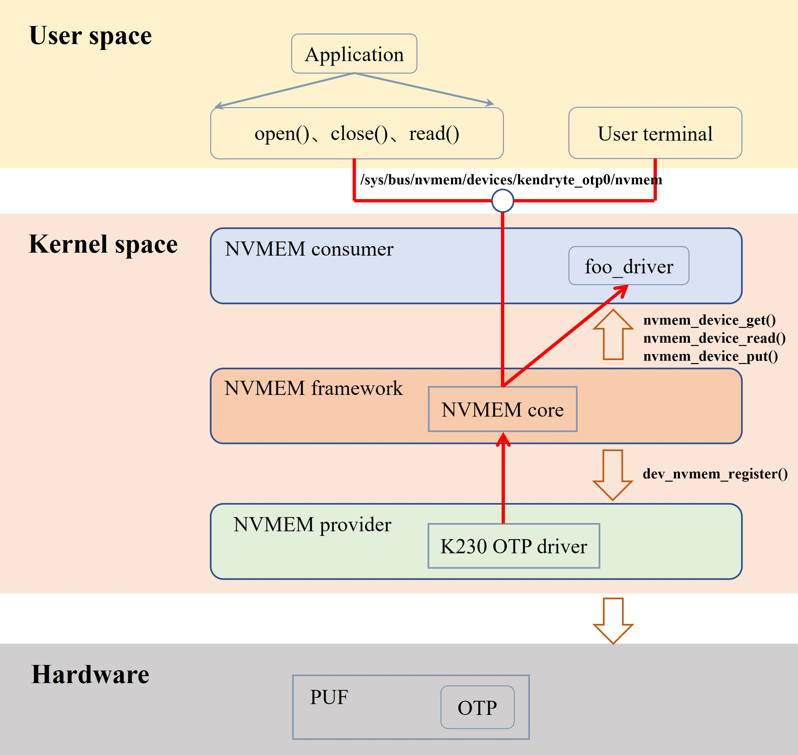
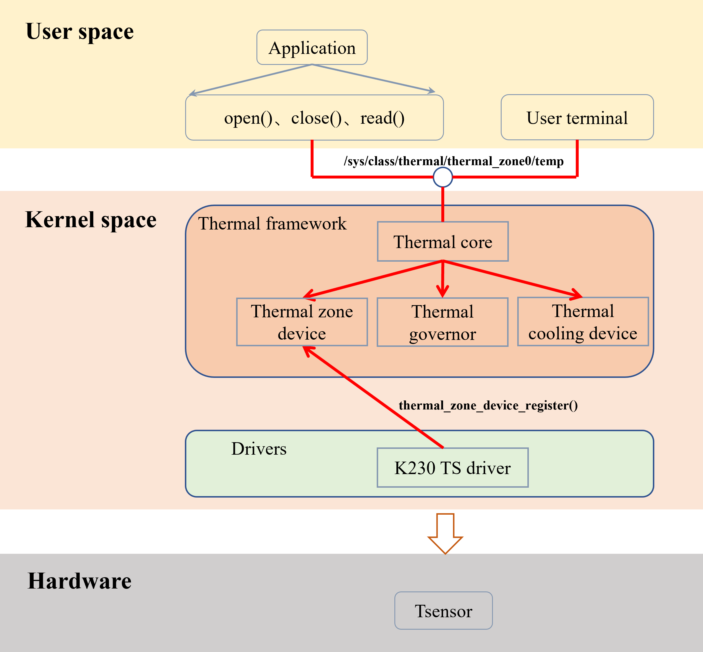
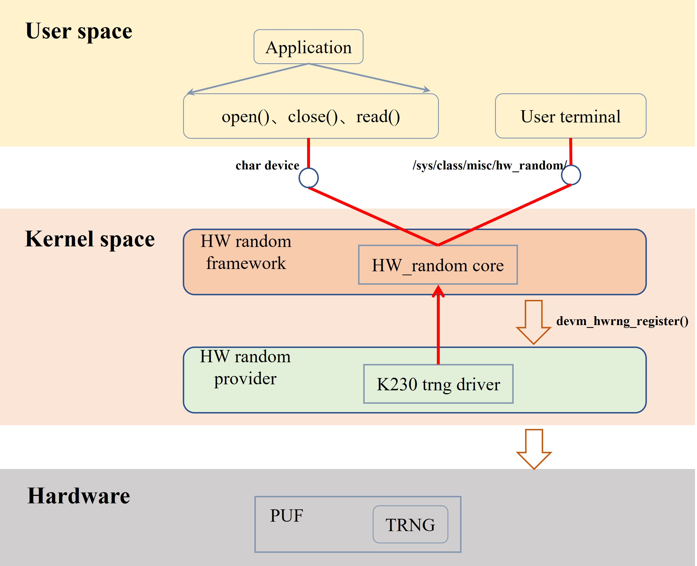

# K230小核Linux驱动API参考


版权所有©2023北京嘉楠捷思信息技术有限公司

<div style="page-break-after:always"></div>

## 免责声明

您购买的产品、服务或特性等应受北京嘉楠捷思信息技术有限公司（“本公司”，下同）及其关联公司的商业合同和条款的约束，本文档中描述的全部或部分产品、服务或特性可能不在您的购买或使用范围之内。除非合同另有约定，本公司不对本文档的任何陈述、信息、内容的正确性、可靠性、完整性、适销性、符合特定目的和不侵权提供任何明示或默示的声明或保证。除非另有约定，本文档仅作为使用指导参考。

由于产品版本升级或其他原因，本文档内容将可能在未经任何通知的情况下，不定期进行更新或修改。

## 商标声明

、“嘉楠”和其他嘉楠商标均为北京嘉楠捷思信息技术有限公司及其关联公司的商标。本文档可能提及的其他所有商标或注册商标，由各自的所有人拥有。

**版权所有 © 2023北京嘉楠捷思信息技术有限公司。保留一切权利。**
非经本公司书面许可，任何单位和个人不得擅自摘抄、复制本文档内容的部分或全部，并不得以任何形式传播。

<div style="page-break-after:always"></div>

## 目录

[TOC]

## 前言

### 概述

本文档主要介绍K230小核Linux的驱动api，主要包括uart、i2c、gpio、watchdog、hardlock、OTP、Tsensor、TRNG等。

### 读者对象

本文档（本指南）主要适用于以下人员：

- 技术支持工程师
- 软件开发工程师

### 缩略词定义

| 简称      | 说明                                         |
|-----------|---------------------------------------------|
| UART      | Universal Asynchronous Receiver/Transmitter |
| I2C       | Inter-Integrated Circuit                    |
| GPIO      | General-purpose input/output                |
| Hard-lock | 硬件互斥锁                                   |
| WDT       | watchdog                                    |
| OTP       | One-Time Programmable                       |
| TS        | Temperature Sensor                          |
| TRNG      | True Random Number Generator                |
| ADC       | analog-to_digital converter                 |
| PWM       | Pulse Width Modulation                      |

### 修订记录

| 文档版本号 | 修改说明 | 修改者 | 日期         |
|------------|----------|--------|---------|
| V1.0       | 初版     | 范俊涛 | 2023/5/26 |
| V1.1       | 增加ADC, PWM部分内容 | 范俊涛 | 2023/8/4 |

## 1 概述

### 1.1 概述

UART：
通用异步收发器，该总线双向通信，可以实现全双工传输和接收。在嵌入式设计中，UART用来与PC进行通信，包括与监控调试器和其它器件，如EEPROM通信。

I2C：
由Philips公司（2006年迁移到NXP）在1980年代初开发的一种简单、双线双向的同步串行总线，它利用一根时钟线和一根数据线在连接总线的两个器件之间进行信息的传递，为设备之间数据交换提供了一种简单高效的方法。每个连接到总线上的器件都有唯一的地址，任何器件既可以作为主机也可以作为从机，但同一时刻只允许有一个主机。

GPIO：
（general porpose intput output）通用输入输出端口的简称。可以通过软件控制其输出和输入，通俗来说就是常用引脚，可以控制引脚的高低电平，对其进行读取或者写入。

Hard-lock：
嘉楠自研模块，用于同核不通进程间或异核之间对共享资源的互斥而实现的硬件互斥锁，可用于对共享资源的互斥使用。

WDT：
WDT是watchdog的简称，本质上是一个硬件定时器，软件程序需要每隔一段时间喂一次狗，如果WDT超时则可以产生一个中断信号或复位信号到CPU，由此通过软硬件结合的方式防止程序运行异常而不能恢复。

OTP：
OTP 主要用于存储安全敏感的机密信息，例如 bootrom 的固件信息、加解密密钥、签名信息以及用户自己定义的安全信息等。

TS：
K230 TS（Temperature Sensor），自研温度传感器，采用 TSMC 12nm 工艺，TS 的应用场景是降频。

TRNG：
TRNG 主要用于产生真随机数，从而为加解密运算提供一个随机熵源。

ADC：
ADC 指模数转换器，是指将连续变化的模拟信号转换为离散的数字信号的器件。

PWM：
PWM 脉冲宽度调制，是一种对模拟信号电平进行数字编码的方法，通过调制正脉冲周期所占的比例来对一个具体模拟信号的电平进行编码。

### 1.2 功能描述

#### 1.2.1 uart模块

K230共有5路uart，且uart模块支持红外模式，支持RS485模式，支持DMA，部分端口支持流控，数据位支持5/6/7/8比特，停止位1/2比特，波特率可以支持到1.5MHz。

#### 1.2.2 i2c模块

K230共有5路i2c，i2c模块支持主模式，支持DMA，支持7/10比特寻址，支持中断，i2c模块传输速率支持100k/400k/1M/3.4M.

#### 1.2.3 gpio模块

k230共有2路gpio，每路gpio包含32个gpio端口，共64个gpio端口，每个gpio端口均支持输入输出功能，支持上升沿中断，下降沿中断，高低电平中断，和双边沿中断。k230的每个gpio端口的中断相互独立互不影响。

#### 1.2.4 hard-lock模块

k230有128个硬件互斥锁，其作用类似Linux的自旋锁，可以用于对同一资源的互斥。

#### 1.2.5 wdt模块

wdt，watchdog模块，k230有两路wdt，大小核分别使用一路，wdt支持中断和复位两种模式，默认使用复位模式，即当wdt的超时时间溢出时，直接使soc复位。

#### 1.2.6 OTP模块

OTP 集成在安全模块 PUF 中，为整个 SoC 提供安全存储功能，保护根密钥和启动代码等关键数据不被攻击者破坏。小核侧 OTP 驱动主要提供读功能，可读区域为包括生产信息在内的 24Kbits 空间。Linux 侧 OTP 驱动挂载在 nvmem 框架上，具体的框架结构如下图所示：



#### 1.2.7 TS模块

大核侧 TS 驱动主要提供读功能，在读 TS 之前，首先需要配置 TS 寄存器使能信号、输出模式，然后才能读出芯片的结温。另外，TS 寄存器每 2.6s 读取一次芯片结温。Rt-smart 侧 TS 驱动的结构如下图所示：



#### 1.2.8 TRNG模块

TRNG 集成在安全模块 PUF 中，为整个 SoC 提供真随机数功能，保护根密钥和启动代码等关键数据不被攻击者破坏。小核侧 TRNG 驱动主要提供读功能，TRNG 驱动挂载在 HW random 框架上，具体的框架结构如下图所示：



#### 1.2.9 ADC模块

K230集成一路ADC转换器，共6各通道，分辨率12bit，最高每秒1M次的单通道连续模数转换。

#### 1.2.10 PWM模块

K230集成了2路PWM，每一路有3各通道，即通道 0~2 属于PWM0，通道 3~5 属于PWM1（软件上表现为通道 0~5 ），每一路都可输出独立波形。

## 2 API参考

### 2.1 UART API参考

Linux封装了termios API用来给用户使用，termios API描述了一个通用的终端接口，提供了控制异步通讯端口的配置和读写。

```text
termios API举例：
int tcgetattr(int fd,struct termios *termios_p);
int tcsetattr(int fd,int potional_actions,struct termios *termios_p);
int tcsendbreak(int fd,int duration);
int tcdrain(int fd);
int tcflush(int fd, int queue_selector);
int tcflow(int fd, int action);
void cfmakeraw(struct termios *termios_p);
speed_t cfgetispeed(const struct termios *termios_p);
speed_t cfgetospeed(const struct termios *termios_p);
int cfsetispeed(struct termios *termios_p, speed_t speed);
int cfsetospeed(struct termios *termios_p, speed_t speed);
int cfsetspeed(struct termios *termios_p, speed_t speed);
```

详细请参考`Documentation/driver-api/serial/tty.rst`。

### 2.2 I2C API参考

linux为用户称封装了系统调用来使用i2c。

[open](#211-open)

[ioctl](#212-ioctl)

[read](#213-read)

[write](#214-write)

### 2.3 GPIO API参考

#### 2.3.1 sysfs控制gpio

GPIO驱动加载后会在 `/sys/class/gpio/` 下创建gpio端口的设备节点，每个节点代表一个gpio端口，通过sysfs操作这个gpio端口即可达到操作gpio输入输出和中断的作用。

方法1：

```text
echo N > /sys/class/gpio/export        //将编号为 N 的gpio端口导出到sysfs

echo in > /sys/class/gpio/gpioN/direction    //将该gpio端口设置成输入模式

cat /sys/class/gpio/gpioN/value      //读取该gpio端口电平状态

echo out > /sys/class/gpio/gpioN/direction    //将该gpio端口设置成输出模式

echo 1 > /sys/class/gpio/gpioN/value     //将该端口输出高电平，注意active_low极性

echo 0 > /sys/class/gpio/gpioN/value     //将该端口输出低电平，注意active_low极性

设置中断属性：
echo rising > /sys/class/gpio/gpioN/edge    上升沿中断，中断只能在direction为in时才可以设置

echo falling > /sys/class/gpio/gpioN/edge   下降沿中断

echo both > /sys/class/gpio/gpioN/edge      双边沿中断
```

方法2：

```text
设置好中断模式后通过poll函数监听中断:

struct pollfd fds[1];
fd = open("/sys/class/gpio/gpioN/value", O_RDONLY)

fds[0].fd = gpio_fd;
fds[0].events = POLLPRI;

while(1)
{
    poll(fds, 1, -1);

    if (fds[0].revents & POLLPRI)
    {
        /* 接收中断 */
    }
}

```

#### 2.3.2 ioctl控制gpio

用户程序直接操作 `/dev/gpiochipN`：

```text
struct gpiohandle_request req;
struct gpiohandle_data data;
struct gpioevent_request event_req;
struct gpioevent_data event_data;
struct pollfd poll_fd;
fd = open("/dev/gpiochipN", O_RDONLY);

.....

req.lineoffsets[0] = 0;
req.flags = GPIOHANDLE_REQUEST_OUTPUT;
req.lines = 1;

event_req.lineoffset = 0;
event_req.handleflags = GPIOHANDLE_REQUEST_INPUT;
event_req.eventflags = GPIOEVENT_REQUEST_RISING_EDGE;

ioctl(fd, GPIO_GET_LINEHANDLE_IOCTL, &req);
ioctl(fd, GPIO_GET_LINEEVENT_IOCTL, &event_req);

close(fd);

poll_fd.fd = event_req.fd;
poll_fd.events = POLLIN;

while(1)
{
    data.values[0] = !data.values[0];
    .....
    ioctl(req.fd, GPIOHANDLE_SET_LINE_VALUES_IOCTL, &data);
    .....

     ret = poll(&poll_fd, 1, 3000);
     if(ret == 0)
     ....
     else {
        read(event_req.fd, &event_data, sizeof(event_data));
     }
}

close(req.fd);

```

### 2.4 Hardlock API参考

Hardlock未提供用户api接口，其使用方法仅限内核态驱动之间使用。

### 2.5 Wadtchdog API参考

#### 2.5.1 通过ioctl使用watchdog

[open](#211-open)

[ioctl](#212-ioctl)

```text
示例：
fd = open("/dev/watchdog", O_WRONLY)

.....

ioctl(fd, WDIOC_SETTIMEOUT, &flags); /* 设置超时 */

ioctl(fd, WDIOC_GETTIMEOUT, &flags); /* 获取超时设置 */

ioctl(fd, WDIOC_SETPRETIMEOUT, &flags); /* 设置预超时 */

ioctl(fd, WDIOC_GETPRETIMEOUT, &flags); /* 获取预超时 */

ioctl(fd, WDIOC_GETTIMELEFT, &flags); /* 获取剩余超时时间 */

ioctl(fd, WDIOC_KEEPALIVE, &dummy); /* 喂狗 */

.....
```

#### 2.5.2 通过文件系统使用watchdog

```text
echo V > /dev/watchdog     watchdog开始计时，内核自动喂狗线程启动

echo A > /dev/watchdog     内核喂狗线程停止喂狗，但计时仍然继续，在默认超时时间后系统复位
```

> 注意：在命令行向watchdog节点写字符时，watchdog被使能并使用默认超时时间计数，且内核自动喂狗线程被唤醒

### 2.6 OTP API 参考

用户可通过 `sysfs` 来访问 OTP 硬件，还可以通过运行用户态程序读取 OTP 空间。

#### 2.6.1 sysfs 文件系统

Linux 内核使用 `sysfs` 文件系统，它的作用是将设备和驱动程序的信息导出到用户空间，方便了用户读取设备信息，同时支持修改和调整。`Sysfs` 虚拟文件系统一般被挂载在 `/sys` 目录下。OTP 一旦被注册到 Linux 中的 `NVMEM` 框架中之后，通过 `sysfs` 虚拟文件系统，可以很容易查看到 OTP 的信息。

OTP sysfs位于 `/sys/bus/nvmem/devices/kendryte_otp0/` 目录下，文件结构如下：

```shell
.
|-- nvmem
|-- of_node -> ../../../../../../firmware/devicetree/base/soc/security/otp@91214000
|-- subsystem -> ../../../../../../bus/nvmem
|-- type
|-- uevent

```

启动 Linux 之后，运行下列命令：

```shell
[root@canaan ~ ]# hexdump -C -v /sys/bus/nvmem/devices/kendryte_otp0/nvmem
00000000  ff ff ff ff ff ff ff ff  ff ff ff ff ff ff ff ff  |................|
00000010  ff ff ff ff ff ff ff ff  ff ff ff ff ff ff ff ff  |................|
00000020  ff ff ff ff ff ff ff ff  ff ff ff ff ff ff ff ff  |................|
00000030  ff ff ff ff ff ff ff ff  ff ff ff ff ff ff ff ff  |................|
00000040  ff ff ff ff ff ff ff ff  ff ff ff ff ff ff ff ff  |................|
00000050  ff ff ff ff ff ff ff ff  ff ff ff ff ff ff ff ff  |................|
00000060  ff ff ff ff ff ff ff ff  ff ff ff ff ff ff ff ff  |................|
00000070  ff ff ff ff ff ff ff ff  ff ff ff ff ff ff ff ff  |................|
00000080  00 02 00 00 50 02 00 00  00 01 00 00 00 00 00 00  |....P...........|
00000090  00 00 00 00 00 00 00 00  00 00 00 00 00 00 00 00  |................|
000000a0  00 00 00 00 00 00 00 00  00 00 00 00 00 00 00 00  |................|
......

```

或者，利用 `dd` 命令：

```shell
[root@canaan ~ ]# dd if=/sys/bus/nvmem/devices/kendryte_otp0/nvmem of=/tmp/file
6+0 records in
6+0 records out
[root@canaan ~ ]# hexdump -C -v /tmp/file
00000000  ff ff ff ff ff ff ff ff  ff ff ff ff ff ff ff ff  |................|
00000010  ff ff ff ff ff ff ff ff  ff ff ff ff ff ff ff ff  |................|
00000020  ff ff ff ff ff ff ff ff  ff ff ff ff ff ff ff ff  |................|
00000030  ff ff ff ff ff ff ff ff  ff ff ff ff ff ff ff ff  |................|
00000040  ff ff ff ff ff ff ff ff  ff ff ff ff ff ff ff ff  |................|
00000050  ff ff ff ff ff ff ff ff  ff ff ff ff ff ff ff ff  |................|
00000060  ff ff ff ff ff ff ff ff  ff ff ff ff ff ff ff ff  |................|
00000070  ff ff ff ff ff ff ff ff  ff ff ff ff ff ff ff ff  |................|
00000080  00 02 00 00 50 02 00 00  00 01 00 00 00 00 00 00  |....P...........|
00000090  00 00 00 00 00 00 00 00  00 00 00 00 00 00 00 00  |................|
......

```

#### 2.6.2 用户态访问 OTP

编写一个用户态应用程序，用户态应用程序通过标准的系统调用open()、close()、read()等函数陷入到内核态，最终会调用 OTP 驱动中注册的接口中，以测试 OTP 功能。

目前用户态应用程序已经编写完成，生成的可执行文件在 `/usr/bin/otp_test_demo` 目录下。

运行步骤如下：

1. 进入应用程序 demo 目录；
1. 在 demo 目录下运行 otp demo，读取长度作为参数；
1. 执行 otp demo。
1. 改变读取长度（长度范围：1~768），重新执行 otp demo。

启动小核Linux之后，运行下列命令：

```shell
[root@canaan ~ ]#cd /usr/bin/
[root@canaan /usr/bin ]# ./otp_test_demo 768
Addr                    Value
00000000                0xffffffff
00000004                0xffffffff
00000008                0xffffffff
0000000c                0xffffffff
00000010                0xffffffff
00000014                0xffffffff
00000018                0xffffffff
0000001c                0xffffffff
00000020                0xffffffff
00000024                0xffffffff
00000028                0xffffffff
0000002c                0xffffffff
00000030                0xffffffff
00000034                0xffffffff
00000038                0xffffffff
0000003c                0xffffffff
00000040                0xffffffff
......

```

#### 2.6.3 OTP 空间默认值

OTP 空间默认值信息如下所示，请对照默认值验证读取OTP空间是否正确。

```text
00000000  ff ff ff ff ff ff ff ff  ff ff ff ff ff ff ff ff  |................|
*
00000080  00 02 00 00 50 02 00 00  00 01 00 00 00 00 00 00  |....P...........|
00000090  00 00 00 00 00 00 00 00  00 00 00 00 00 00 00 00  |................|
*
00000100  8d 3d da 24 1c f6 fa f6  88 4b c3 91 fb 2d 7b 09  |.=.$.....K...-{.|
00000110  a6 64 03 7d ce 98 e0 d2  92 5a a0 cf 3c 58 50 d0  |.d.}.....Z..<XP.|
00000120  3b 77 37 e6 0d 36 eb 9a  21 42 a1 2a 53 d8 aa 87  |;w7..6..!B.*S...|
00000130  ab 53 5c e7 ab 3e 7a c6  f4 29 16 71 45 f1 30 0d  |.S\..>z..).qE.0.|
00000140  91 3f a6 3d 48 30 dd 6d  18 c2 1c 13 97 fe 1f 9b  |.?.=H0.m........|
00000150  fd 08 1c 16 1b a7 9a 20  1d 80 70 8a 20 08 61 a3  |....... ..p. .a.|
00000160  24 2b cf ec 97 9e 3f 25  89 b9 f2 a8 7a 63 5c c7  |$+....?%....zc\.|
00000170  44 86 70 30 45 e4 4f 35  4d 2e 3e 8c e5 3a 49 29  |D.p0E.O5M.>..:I)|
00000180  b6 06 6e 15 6b 62 d3 94  5f 8a ea e3 ea a3 a1 fc  |..n.kb.._.......|
00000190  0f 19 f5 50 05 4d 63 47  77 14 c1 c0 bf 06 3b 55  |...P.McGw.....;U|
000001a0  47 be 7c c6 93 e2 e1 31  05 27 f5 a2 77 16 1f 75  |G.|....1.'..w..u|
000001b0  5a 95 0a 15 24 16 a8 1a  fc d8 67 f4 dd 15 e4 8c  |Z...$.....g.....|
000001c0  25 44 b9 48 59 b1 17 bb  8e 05 15 db ff fa 77 47  |%D.HY.........wG|
000001d0  52 ce f7 86 bf 20 b5 46  ac 83 e9 ac 08 a7 e3 67  |R.... .F.......g|
000001e0  02 24 50 de 49 9d 24 57  9f 78 bb 74 21 8f 74 f0  |.$P.I.$W.x.t!.t.|
000001f0  47 25 9b cb 99 e7 6a 0f  51 52 be 4b ea 6a a3 ee  |G%....j.QR.K.j..|
00000200  7b 8d f8 ad c8 c6 5e c4  13 66 4b 50 3b 02 98 c8  |{.....^..fKP;...|
00000210  20 11 c5 ca 54 ee 32 ea  89 e4 38 58 cd 5a cb 34  | ...T.2...8X.Z.4|
00000220  2f d2 d9 b3 d9 97 50 a8  10 74 73 17 b0 76 19 ec  |/.....P..ts..v..|
00000230  8e 1e 07 58 ba f5 5b b9  a3 6e 0b f8 ae 8c ba 35  |...X..[..n.....5|
00000240  53 6b 5d 52 9d e9 76 46  ae f7 1f 8d 45 b4 93 b6  |Sk]R..vF....E...|
00000250  28 93 b4 07 6f 8e be 37  41 57 86 19 c1 d0 fb 9b  |(...o..7AW......|
00000260  8e 09 7a 77 a4 23 83 db  39 64 6c 5f 73 0d 82 2e  |..zw.#..9dl_s...|
00000270  ca 5b 2e c4 5f b0 6b 23  3d fd 96 88 e8 b9 e9 02  |.[.._.k#=.......|
00000280  a8 e1 22 b1 c4 af 61 4c  bc ab 93 a1 d1 80 aa 6f  |.."...aL.......o|
00000290  01 dc cd c1 a0 71 36 58  86 ed 7e d9 c1 15 95 50  |.....q6X..~....P|
000002a0  f2 4e 9a 0e c9 d8 58 d6  14 93 c9 de 86 0e 87 52  |.N....X........R|
000002b0  85 e6 ff d6 28 e8 dd 29  5a ab b4 b3 ce de 35 e9  |....(..)Z.....5.|
000002c0  48 f2 1f a8 22 8f e3 17  d7 86 d8 e8 de 24 4d 2a  |H..."........$M*|
000002d0  70 89 37 47 9c 53 9b 33  0b 74 95 30 d6 4e e0 36  |p.7G.S.3.t.0.N.6|
000002e0  bc 10 ff da ab bd 74 e7  df 04 08 11 e7 43 94 09  |......t......C..|
000002f0  4d 74 df 13 84 a0 86 54  4c d0 cb c2 63 fb 42 7d  |Mt.....TL...c.B}|
00000300  5b e6 9d 3b dc 86 59 d7  cb df 29 65 53 51 54 8b  |[..;..Y...)eSQT.|
00000310  b1 50 96 a2 85 e0 b6 b4  d2 ce 6d 63 48 09 b3 62  |.P........mcH..b|
00000320  9d f5 d4 16 4c 81 5f b4  e1 f7 91 7b 5f 7f c9 29  |....L._....{_..)|
00000330  43 22 56 e8 f5 ae 68 b3  a0 a8 f9 7d 7b d9 b1 2e  |C"V...h....}{...|
00000340  98 25 07 7b 38 33 9c 99  f6 85 c7 49 cb dc 6f 1d  |.%.{83.....I..o.|
00000350  1c 45 d1 ff 57 a4 b9 d7  2a 6c 3f 9e dd 9a ee 5b  |.E..W...*l?....[|
00000360  f3 0b 21 af 2e d8 e5 ce  4f b7 4d 07 ea ba 5a e9  |..!.....O.M...Z.|
00000370  df 85 d8 6d 88 78 84 9a  dd 1a 4a 4a 86 2e e4 62  |...m.x....JJ...b|
00000380  c2 94 4c e7 77 0b 2c 7a  38 03 2c 2a a1 f7 5b dd  |..L.w.,z8.,*..[.|
00000390  14 a7 d8 4a 66 38 d0 9f  e8 28 a8 7c 33 36 39 72  |...Jf8...(.|369r|
000003a0  1b 7b 84 68 a6 a8 dd 7e  a9 5b f0 8e 2b 50 6e 40  |.{.h...~.[..+Pn@|
000003b0  d2 a5 62 43 5e f1 f4 bf  90 11 0f e2 16 b5 80 4e  |..bC^..........N|
000003c0  10 68 a7 a2 aa 2d dd ba  c1 d7 d6 0c b7 17 a5 a3  |.h...-..........|
000003d0  c2 e2 77 e8 7c 9a ff 23  8c 30 ae b3 5a 79 1c fd  |..w.|..#.0..Zy..|
000003e0  77 4a f6 41 78 53 36 52  d4 45 a6 f9 c2 8e 8d fc  |wJ.AxS6R.E......|
000003f0  03 2e f4 00 58 e8 15 85  bf d9 3f b8 62 58 e2 97  |....X.....?.bX..|
00000400  d2 ea 7f b2 a2 ef 40 f2  fc 68 07 64 51 f7 c9 6e  |......@..h.dQ..n|
00000410  68 eb 68 ec 15 a8 a7 7e  1d 86 8b 12 f1 33 a0 18  |h.h....~.....3..|
00000420  21 06 f4 0a 58 4b ec 17  7d 87 2c ec ea ce 3e ce  |!...XK..}.,...>.|
00000430  02 2f 02 a5 76 61 57 dd  85 6e f5 14 d4 6b fb f9  |./..vaW..n...k..|
00000440  64 d3 60 2c 1f 45 00 9c  50 d4 2a aa 1d f0 96 82  |d.`,.E..P.*.....|
00000450  00 00 00 00 00 00 00 00  00 00 00 00 00 00 00 00  |................|
*
00000bf0  00 00 00 00 00 00 00 00  00 00 00 00 00 00 00 00  |................|

```

### 2.7 TS API 参考

用户可通过 `sysfs` 来访问 TS 硬件，还可以通过运行用户态程序读取芯片结温。

#### 2.7.1 sysfs 文件系统

Linux 内核使用 `sysfs` 文件系统，它的作用是将设备和驱动程序的信息导出到用户空间，方便了用户读取设备信息，同时支持修改和调整。`sysfs` 虚拟文件系统一般被挂载在 `/sys` 目录下。TS 一旦被注册到 Linux 中的 Thermal 框架中之后，通过 `sysfs` 虚拟文件系统，可以很容易查看到 TS 的信息。

TS sysfs位于 `/sys/class/thermal/thermal_zone0/` 目录下，文件结构如下：

```shell
.
|-- available_policies
|-- integral_cutoff
|-- k_d
|-- k_i
|-- k_po
|-- k_pu
|-- mode
|-- offset
|-- passive
|-- policy
|-- slope
|-- subsystem -> ../../../../class/thermal
|-- sustainable_power
|-- temp
|-- type
|-- uevent

```

启动 Linux 之后，运行下列命令：

```shell
[root@canaan ~ ]#cat /sys/class/thermal/thermal_zone0/temp
7182
......

```

`7182` 这个值表示的含义为：读取 tsensor 寄存器的值，并没有做任何数学运算。相应的数学表达式如下:

```text

code = ts_val & 0xfff;
temp = (1e-10 * pow(code, 4) * 1.01472 - 1e-6 * pow(code, 3) * 1.10063 + 4.36150 * 1e-3 * pow(code, 2) - 7.10128 * code + 3565.87);

```

- ts_val：实际读取 TS 寄存器的值；
- code：TS 寄存器的值保留低12位得到的结果；
- temp：计算得到的温度值。

#### 2.7.2 用户态访问 TS

编写一个用户态应用程序，用户态应用程序通过标准的系统调用open()、close()、read()等函数陷入到内核态，最终会调用 TS 驱动中注册的接口中，以测试 TS 功能。

目前用户态应用程序已经编写完成，生成的可执行文件在 `/usr/bin/ts_test_demo` 目录下。

运行步骤如下：

1. 进入应用程序 demo 目录；
1. 在 demo 目录下运行 ts demo，循环次数作为参数；
1. 执行 ts demo。
1. 改变循环次数，重新执行 ts demo。

启动小核Linux之后，运行下列命令：

```shell
[root@canaan ~ ]#cd /usr/bin/
[root@canaan /usr/bin ]#./ts_test_demo 5
ts_val: 0x1c08, TS = 42.176993 C
ts_val: 0x1c07, TS = 41.875168 C
ts_val: 0x1c06, TS = 41.573277 C
ts_val: 0x1c07, TS = 41.875168 C
ts_val: 0x1c0a, TS = 42.780447 C
[root@canaan ~ ]#

```

### 2.8 TRNG API 参考

用户可通过 `sysfs` 来访问 TRNG 硬件，还可以通过运行用户态程序读取真随机数。

#### 2.8.1 sysfs 文件系统

Linux 内核使用 `sysfs` 文件系统，它的作用是将设备和驱动程序的信息导出到用户空间，方便了用户读取设备信息，同时支持修改和调整。`sysfs` 虚拟文件系统一般被挂载在 `/sys` 目录下。TRNG 一旦被注册到 Linux 中的 HW random 框架中之后，通过 `sysfs` 虚拟文件系统，可以很容易查看到 TRNG 的信息。

TRNG sysfs位于 `/sys/class/misc/hw_random/` 目录下，文件结构如下：

```shell
.
|-- dev
|-- rng_available
|-- rng_current
|-- rng_selected
|-- subsystem -> ../../../../class/misc
|-- uevent

```

启动 Linux 之后，运行下列命令：

```shell
[root@canaan ~ ]# cat /sys/class/misc/hw_random/rng_current
91213000.trng
[root@canaan ~ ]# cat /sys/class/misc/hw_random/rng_available
91213000.trng

```

#### 2.8.2 用户态访问 TRNG

编写一个用户态应用程序，用户态应用程序通过标准的系统调用open()、close()、read()等函数陷入到内核态，最终会调用 TRNG 驱动中注册的接口中，查看每次读取得到的数据是否不一致，从而测试 TRNG 的功能。

目前用户态应用程序已经编写完成，生成的可执行文件在 */usr/bin/trng_test_demo* 目录下。

运行步骤如下：

1. 进入应用程序 demo 目录；
1. 在 demo 目录下运行 trng demo；
1. 执行 trng demo。
1. 重复执行 trng demo，查看每次读取的随机数是否一致。

启动小核Linux之后，运行下列命令：

```text
[root@canaan ~ ]#cd /usr/bin/
[root@canaan /usr/bin ]#./trng_test_demo
2C 10 B3 29 C3 98 10 41 3C 2A 90 75 EB C4 61 A5
[root@canaan /usr/bin ]#./trng_test_demo
6E AB 46 DD C1 7D FC 97 65 02 0C 58 1E A1 80 B9
[root@canaan ~ ]#

```

默认每次打印16个字节的随机数，每次打印的随机数不同。

### 2.9 ADC API参考

用户可通过 `sysfs` 来访问 ADC 各通道，还可以通过运行用户态程序读取各通道电压转换数据。

#### 2.9.1 sysfs访问 ADC

Linux下ADC是挂载在IIO子系统下的，通过`sysfs`访问可以参考如下示例；

```shell
1、cd /sys/devices/platform/soc/9140d000.adc/iio:device0
2、cat in_voltage0_raw   读取通道0
3、cat in_voltage1_raw   读取通道1
4、cat in_voltage2_raw   读取通道2
5、cat in_voltage3_raw   读取通道3
6、cat in_voltage4_raw   读取通道4
7、cat in_voltage5_raw   读取通道5
```

注意：在嘉楠 K230_EVB 开发板上，ADC通道5另一端已经接在音频输出接口上，所以不建议将此通道用作他用。

#### 2.9.2 用户态访问 ADC

略。

### 2.10 PWM API参考

用户可通过 `sysfs` 来访问 PWM 各通道，还可以通过运行用户态程序控制各通道输出波形周期及占空比。

#### 2.10.1 sysfs访问 PWM

```shell
1、cd /sys/devices/platform/soc/9140a000.pwm/pwm/pwmchip0
2、echo 4 > export          导出通道4 即PWM4；
3、cd pwm4/                 出现pwm4的目录，进入；
4、echo 100000 > period     设置周期 100us，
5、echo 50000 > duty_cycle  设置正占空比周期 50us，
6、echo 1 >enable           当前通道使能；

```

#### 2.10.2 用户态访问 PWM

略。

### 2.11 open

【描述】

打开设备节点。

【语法】

`int open(const char *pathname, int flags)`

【参数】

| 参数名称 | 描述             | 输入/输出 |
| ------- | ---------------- | --------- |
| patchname | 全路径设备名 | 输入  |
| flags     | 打开方式     | 输入  |

【返回值】

| 返回值 | 描述                 |
| ------ | -------------------- |
| 负值    | 错误 |
| 正值    | 打开的文件描述符id |

【需求】

- 头文件：`sys/types.h`, `sys/stat.h`, `fcntl.h`

【注意】

无

【举例】

`int fd = open("/dev/i2c-0", O_RDWR);`

### 2.12 ioctl

【描述】

设备控制。

【语法】

`int ioctl(int fd, unsigned long request, ...);`

【参数】

| 参数名称 | 描述             | 输入/输出 |
| ------- | ---------------- | --------- |
| fd      | 打开的文件描述符 | 输入  |
| request | 32位命令码       | --  |

命令码请参考`include/uapi/asm-generic/ioctl.h`

【返回值】

| 返回值 | 描述                 |
| ------ | -------------------- |
| 负值    | 错误 |
| 非负值  | 成功 |

【需求】

- 头文件：`sys/ioctl.h`

【注意】

无

【举例】

`err = ioctl(file, I2C_SMBUS, &args);`

### 2.13 read

【描述】

读取打开的文件描述符内容。

【语法】

`ssize_t read(int fd, void *buf, size_t count);`

【参数】

| 参数名称 | 描述             | 输入/输出 |
| ------- | ---------------- | --------- |
| fd      | 打开的文件描述符     | 输入  |
| buf     | 存放输出数据的空间   | 输出  |

【返回值】

| 返回值 | 描述                 |
| ------ | -------------------- |
| -1    | 错误 |
| 非负值  | 读取到的字节数 |

【需求】

- 头文件：`unistd.h`

【注意】

无

【举例】

`int n = read(fd, &buf, num);`

### 2.14 write

【描述】

向打开的文件描述符写数据。

【语法】

`ssize_t write(int fd, const void *buf, size_t count);`

【参数】

| 参数名称 | 描述             | 输入/输出 |
| ------- | ---------------- | --------- |
| fd      | 打开的文件描述符     | 输入  |
| buf     | 存放数据的空间       | 输出  |
| count   | 需要写入的长度       | 输入  |

【返回值】

| 返回值 | 描述                 |
| ------ | -------------------- |
| -1    | 错误 |
| 0     | 未写入 |
| 正值  | 写入的字节数 |

【需求】

- 头文件：`unistd.h`

【注意】

无

【举例】

`int n = write(fd, &buf, num);`
