# K230 ISP图像调优指南

版权所有©2023北京嘉楠捷思信息技术有限公司

## 免责声明

您购买的产品、服务或特性等应受北京嘉楠捷思信息技术有限公司（“本公司”，下同）及其关联公司的商业合同和条款的约束，本文档中描述的全部或部分产品、服务或特性可能不在您的购买或使用范围之内。除非合同另有约定，本公司不对本文档的任何陈述、信息、内容的正确性、可靠性、完整性、适销性、符合特定目的和不侵权提供任何明示或默示的声明或保证。除非另有约定，本文档仅作为使用指导参考。

由于产品版本升级或其他原因，本文档内容将可能在未经任何通知的情况下，不定期进行更新或修改。

## 商标声明

、“嘉楠”和其他嘉楠商标均为北京嘉楠捷思信息技术有限公司及其关联公司的商标。本文档可能提及的其他所有商标或注册商标，由各自的所有人拥有。

**版权所有 © 2023北京嘉楠捷思信息技术有限公司。保留一切权利。**
非经本公司书面许可，任何单位和个人不得擅自摘抄、复制本文档内容的部分或全部，并不得以任何形式传播。

## 目录

[TOC]

## 前言

### 概述

本文档主要是指导用户对K230 ISP进行图像调优。

### 读者对象

本文档（本指南）主要适用于以下人员：

- 技术支持工程师
- 软件开发工程师

### 修订记录

| 文档版本号  | 修改说明                           | 修改者 | 日期       |
|------------|-----------------------------------|--------|------------|
| V1.0       | 初版                              | 刘家安 | 2023-09-04 |

## 1. K230 ISP图像调优概述

在进行图像调优时，亮度、色彩、对比度、清晰度这几个方面是我们的主要关注点。通过对sensor和镜头的标定以及ISP子模块的联合调优做到图像的整体亮度合理，图像中的色彩还原准确，图像的清晰度好，没有明显噪声，图像的对比度高，整体看上去要比较通透。

总体图像调优流程如下所示：

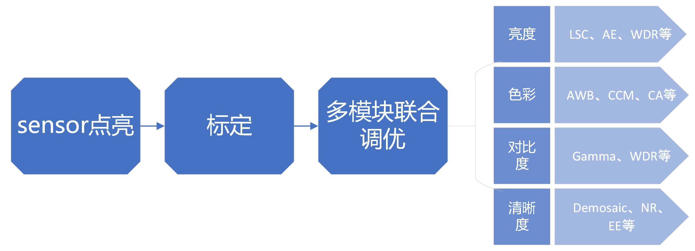

## 2. 标定

### 2.1 概述

使用标定工具完成对BLC、LSC、CC、AWB、Noise Profile、CAC这6个ISP模块的参数标定功能。

模块的标定顺序如下：

在使用标定工具前，需要用户预先安装MATLAB Runtime(R2023a)。下载地址：[https://www.mathworks.com/products/compiler/matlab-runtime.html](https://www.mathworks.com/products/compiler/matlab-runtime.html)

标定工具的主界面如下图所示。

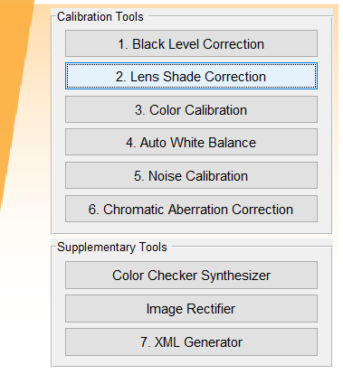

点击相应的模块按钮即可直接跳转至各模块的标定界面开始标定。

### 2.2 Black level correction

#### 2.2.1 黑电平标定的原理及意义

模拟信号很微弱时，有可能不被A/D转换出来，导致光线很暗时，图像细节丢失。因此，Sesnor 会在A/D转换前，给模拟信号一个固定的偏移量，保证输出的数字信号保留更多的图像细节。黑电平校正模块就是通过标定的方式，确定这个偏移量的具体值。后续的ISP处理模
块，需要先减掉该偏移值，才能保证数据的线性一致性。如果事先未获取到sensor的黑电平参数，或者需要获得更精确的黑电平数值，就进行黑电平标定。

#### 2.2.2 黑电平标定采集RAW图

在进行黑电平标定时，采集RAW图的步骤如下：

1. 模组在一个全黑的环境下（如看用黑布盖住镜头），确保没有光进入sensor；
1. 将sensor的曝光模式设置为手动模式；
1. 在不同Gain值（1x，2x，3x，4x）与不同积分时间（0.01ms，0.02ms，0.03ms）组合下采集12张RAW图；
1. 并按照命名规则保存至文件夹下，文件夹的命名形式：Gain_4_T_0.03（Gain_4_T_0.03 表示 exposure gain = 4，exposure time = 0.03s），其他的曝光时间和Gain的命名形式依次类推。

#### 2.2.3 使用标定工具开始标定

当点击了主界面的“Black level correction”后，工具将弹出如图所示对话框。

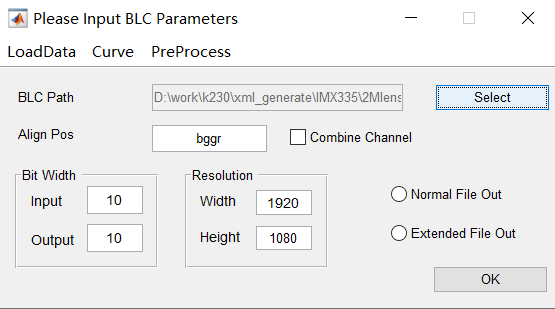

操作步骤：

1. 点击“Select”按钮选择保存的RAW图文件夹；
1. “Align Pos”文本框：填写RAW图的bayer pattern；
1. 设置输入输出的Bit Width；
1. 设置分辨率：图像的宽高；
1. 点击“OK”按钮，进行标定。

其中：

1. Combine Channel文本框：如果勾选，表示用户得到的BLC是R、Gr、Gb、B四通道合并后的测量值。
1. Normal File Out / Extended File Outy：如果勾选 Normal File Out，表示输出的是blc_para.txt；如果勾选Extended File Out，表示R、Gr、Gb、B通道的BLC将按不同的曝光时间和Gain分别输出。

标定完成后，Black Level vs Integration Time的图表如下图所示。

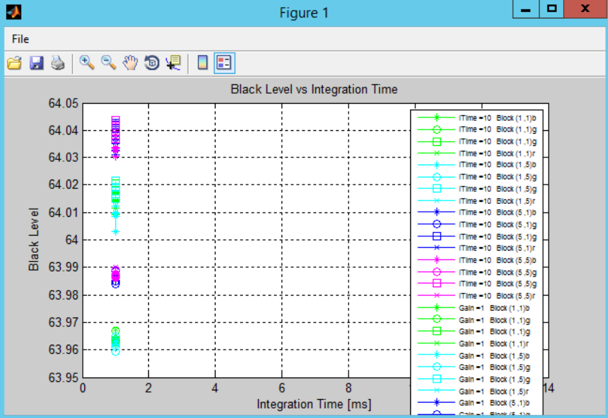

### 2.3 Lens shading Correction

#### 2.3.1 LSC标定的基本原理及意义

LSC标定目的就是为了消除由镜头光学折射不均匀导致的画面暗角。在Lens shading现象中，中心目标点亮度到边角的亮度衰减符合余弦四次方定律，通过标定结果可以有效反应出亮度衰减趋势，使用32x16的网格存储标定结果，再把图像各区域的亮度恢复至目标点亮度。LSC标定包括luma shading和color shading的标定。因为不同色温下的 color shading特征曲线是不相同的，所以为满足在不同色温下的 color shading 的校正要求，需要在不同色温下对 LSC 进行标定校准。

#### 2.3.2 LSC标定采集RAW图

采集RAW图前需要注意的事项：

- 调节AE目标亮度设置，让图像的中心亮度平均值为最大值（如8bit：255）的80%左右
- LSC采集对象的光源环境要求必须是亮度分布平坦且均匀的光源，同时采集对象必须保持平滑无纹理，所以可选择DNP灯箱作为 LSC 标定采集RAW图的场景。

在进行LSC标定时，采集RAW图的步骤如下：

1. 控制设备的镜头对准DNP灯箱目标区域，并保证环境不被干扰；
1. 打开DNP灯箱，色温光源切到D65下，灯箱照度合适；
1. 采集一张RAW图；
1. 切换DNP灯箱的光源（D50、TL84、F12、A），重复步骤2-3。

#### 2.3.3 使用标定工具开始标定

当点击了主界面的“Lens Shade correction”后，工具将弹出如图所示对话框。

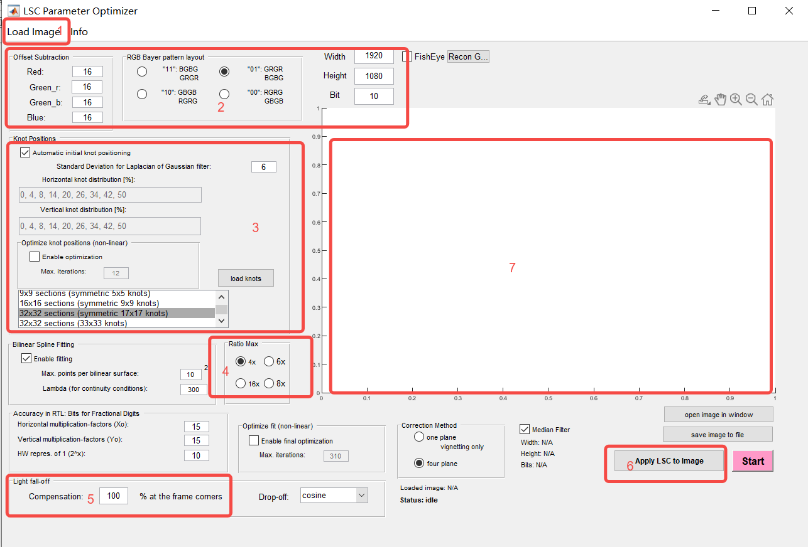

具体操作步骤：

1. 填写区域2里RAW图的bayer pattern、图像宽高、bit位宽及Black Level Offset值；
1. 点击区域1的“load image”按钮导入待标定的RAW图；
1. 区域3的网格结点设置，K230 ISP LSC硬件统计为32x16的，因此可选择“symmetric 17x17 knots”进行标定；
1. 区域4可选择中心/边角的最大校准比率；
1. 区域5可设置边角的补偿比率（如设置为80%，则表示需要校准的边角校准后的亮度为中心亮度的80%就行。）；
1. 其他设置保持默认配置即可；
1. 点击“Start”开始标定，并保存LSC数据；
1. 区域6可选择标定好的LSC数据应用至图像，预览标定效果，并点击“save image to file”保存每个光源下的Png图片。

注意：在步骤5中设置补偿比率时，应当根据镜头的shading严重情况来定。当镜头shading很严重的时候，画面四个角补偿的增益很大，容易导致四角噪声变大。这时就要减小补偿比率，来达到优化四角噪声的目的。

### 2.4 Color Correction

#### 2.4.1 CCM标定原理

CCM 标定的原理是用sensor采集的24 色卡色块的实际颜色信息与其期望值对比，计算出3x3的CCM 矩阵。CCM 的 3x3 矩阵将 sensor 的 色彩空间转换到 sRGB 标准的色彩空间。

#### 2.4.2 CC标定采集RAW图

在进行CC标定时，采集RAW图的步骤如下：

1. 可将24色卡放置标准灯箱内壁（镜头正对色卡采集RAW图）或将24色卡放置灯箱的底部（镜头与24色卡成45度角采集RAW图）；
1. 打开标准灯箱，选择D65光源，调节灯箱照度；
1. 调整镜头到24色卡的距离和位置，保证24色卡占图像范围的2/3左右；
1. 调节AE目标亮度设置，保证RAW图平均亮度在50左右；
1. 采集一张RAW图；
1. 切换光源（D50、TL84、F12、A），重复步骤5；
1. 保持镜头位置不动，将24色卡移开，再采集5种光源下的灯箱内侧灰壁背景RAW图。

#### 2.4.3 使用标定工具开始标定

当点击了主界面的“Color Correction”后，工具将弹出如图所示对话框。

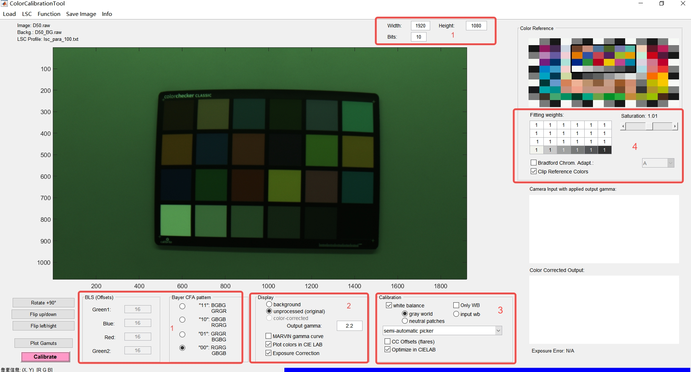

具体操作步骤如下：

1. 在区域1设置好RAW图的宽高、bit位宽、Black level Offset、bayer pattern；
1. 点击“Load”按钮，依次导入sRGB参考文件CC_Standard.cxf、24色卡RAW图、灰壁背景RAW图；
1. 点击“LSC”按钮，导入标定好的LSC参数文件；
1. 配置标定参数；
    - 设置gamma
    - 勾选CIELAB参考
    - 配置24色块权重
    - 设置偏好光源
    - 设置输出饱和度，默认为1
1. 在区域3的下拉键选择选取24色块的方式（有自动、半自动、手动三种模式）；
1. 点击“Caibrate”开始标定。

### 2.5 Auto White Balance

#### 2.5.1 AWB标定的基本原理及意义

AWB 标定，即根据sensor在数个标准光源下的白点特征(R/G, B/G)，计算最佳普朗克拟合曲线和色温拟合曲线。AWB标定的目的是使相机能够自动识别和适应各种色温光源条件，以保证白色和其他颜色在图像中的准确再现。

#### 2.5.3 使用标定工具开始标定

当点击了主界面的“Auto White Balance”后，工具将弹出如图所示对话框。

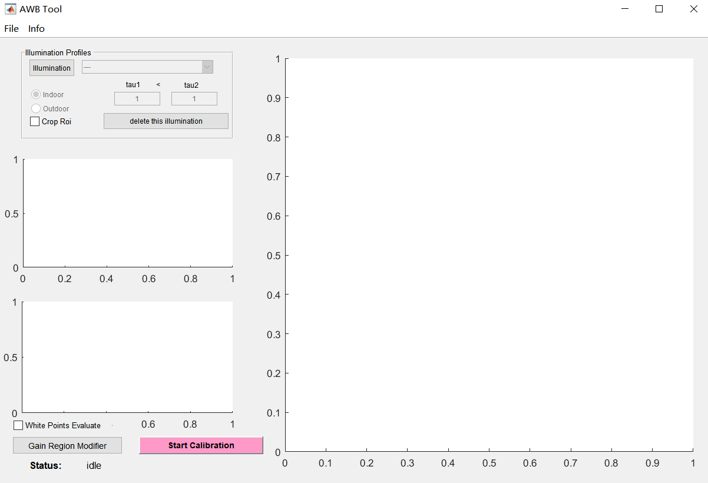

具体操作步骤如下：

1. 点击“file”按钮，导入sensor光谱灵敏度文件，如下图所示；

   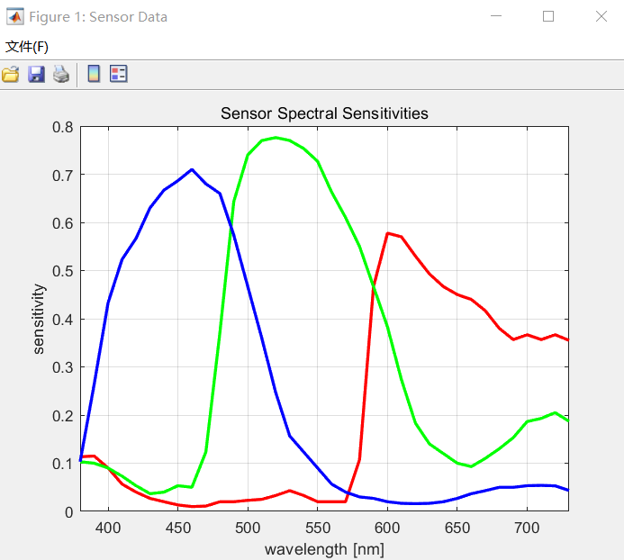

   注：若用户手上没有自己使用的sensor光谱灵敏度文件，用工具包里默认的OV2775_sensitivity.txt即可。因为现在AWB标定已经不依赖于sensor光谱灵敏度文件，但为了不影响后面操作，所以导入任意一个sensor光谱灵敏度文件就可以。

1. 点击“illuination”按钮，导入光源文件CIE_Illuminants.cxf，并选择需要标定的光源（至少3个），如图所示。点击“确定”按钮，各光源的光谱发布将在如图所示的左边展示，并通过下拉键把各光源分为室内光源和室外光源。

   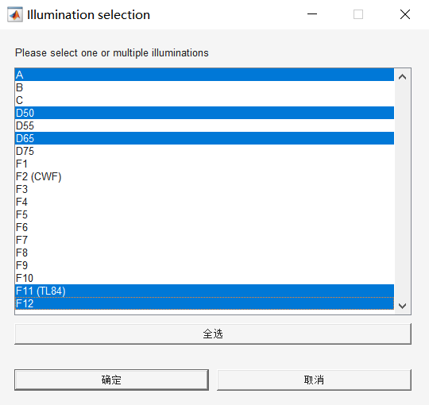

   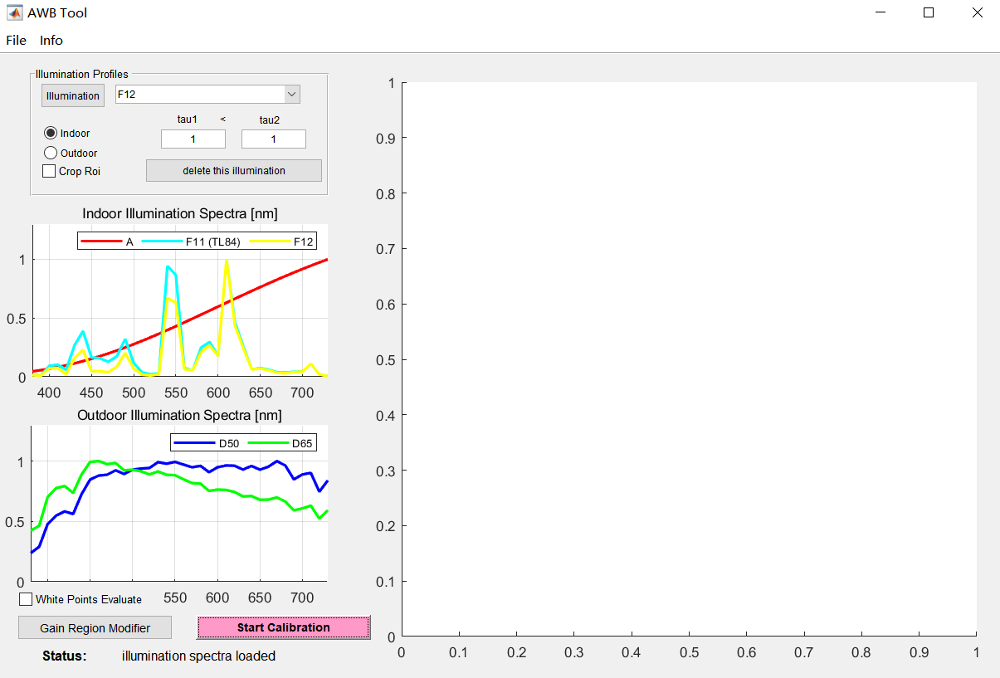

1. 点击“Start Calibration”按钮，根据如图红框中的所示，选择CC标定生成的各光源的参数文件；

   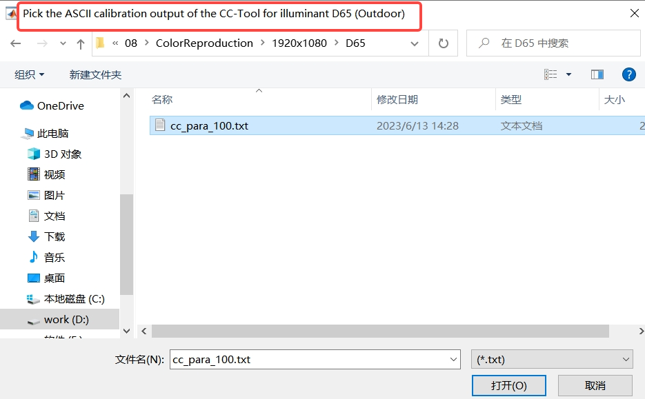

1. 勾选“White Points Evalute”框，选择一张图片用于白点预估；

1. 点击“Gain Region Modifier”按钮，选择在LSC标定中保存的各光源的png图片，如图所示，点击“OK”进入下一步；

   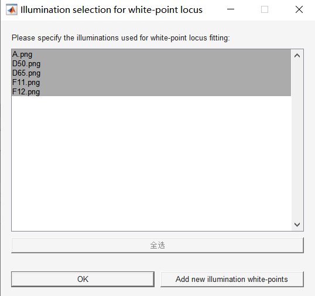

1. 定义增益多边形的起点范围大小，如图所示，点击“确定”按钮，进入下一步；

   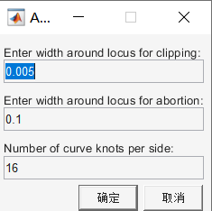

1. 通过红框区域的按钮手动调整橙色框（近白区）和黑色框（落在黑色框里的全部识别为白点）的范围，调整黑色框的范围包含选的所有光源白点，如图所示。保存数据，如果测试不通过，再来重新调整多边形的范围。

   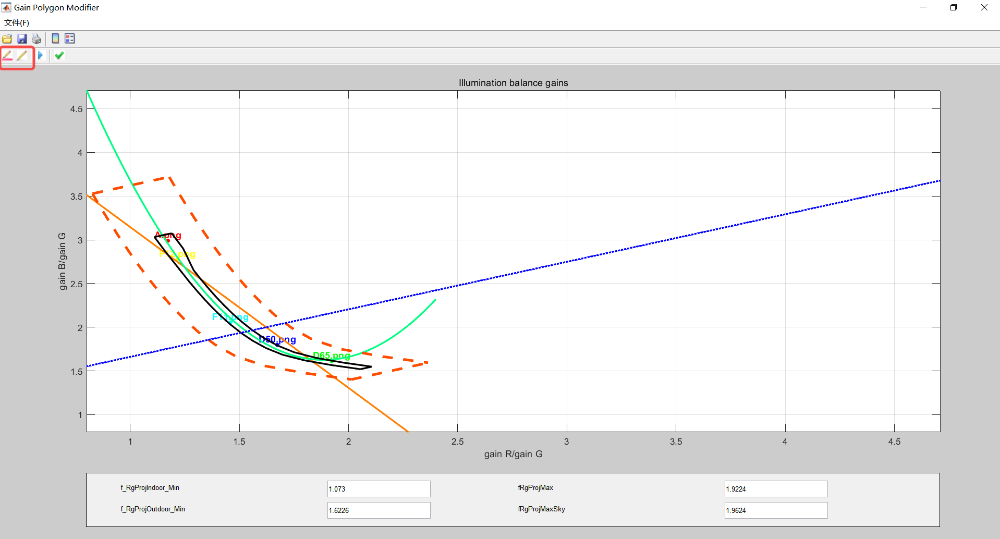

### 2.6 Noise Calibration

#### 2.6.1 Noise Profile标定的原理及意义

Noise Profile 标定涉及到对sensor在不同条件下产生的噪声特性进行定量测量和描述。这是因为，当sensor在不同的光线、温度或ISO设置下工作时，它们会产生不同类型和量级的噪声。了解这些噪声的特性是进行有效噪声降低或修正的关键。

#### 2.6.2 Noise Profile标定采集RAW图

在进行CC标定时，采集RAW图的步骤如下：

1. 将黑白渐变测试卡放置标准灯箱内壁，打开灯箱选择D50色温光源；
1. 关闭AE，改为手动曝光模式，采集两组RAW图，每组30张；
    - 亮组：调节灯箱亮度，保持曝光时间，保持gain 1x不变，让渐变卡黑区域处于中间灰度值；
    - 暗组：调节灯箱亮度，保持曝光时间，保持gain 1x不变，让渐变卡白区域处于中间灰度值。

#### 2.6.3 使用标定工具开始标定

当点击了主界面的“Noise Calibration”后，工具将弹出如图所示对话框。

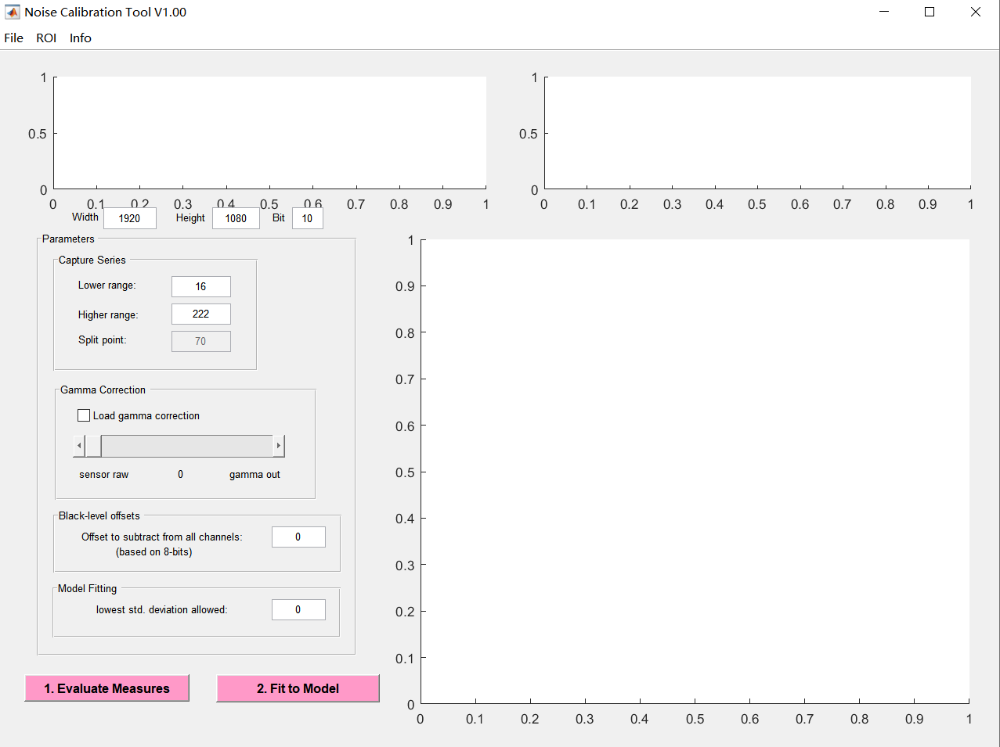

具体操作步骤如下：

1. 设置RAW图的宽高、bit位宽、Black level Offset；
1. 点击“flie”按钮，导入亮暗两组RAW图系列；
1. 点击“ROI”按钮，可设置图片的ROI；
1. 调整参数。对于Lowlight直方图，取Lower range到Split point的直方图区域；对于Highlight直方图，取Split point到Higher ranger的直方图，两者叠加区域，应可基本涵盖0~255的所有值区间（8bit位宽）。对于Split point和high range值点的选取，应该让hightlight和lowlight的保留区域符合泊松分布。若设置了black level offset，则Lower range >= black level；
1. Gamma correction和Model Fitting无需设置；
1. 点击“Evaluate Measures”；
1. 再点击“Fit to Model”，完成Noise标定，保存结果。

### 2.7 Chromatic Aberration Correction

#### 2.7.1 CAC标定的原理及意义

色差是一种常见的光学缺陷，出现在镜头无法使所有颜色的光线都汇聚在相同的焦点上。这通常导致图像边缘出现红绿或蓝紫的色彩偏移。为了纠正这种偏移，我们需要进行 CAC 校正。通过分析捕获的图像数据，可以建立一个数学模型来描述色差。一旦模型建立，可以确定纠正参数，这些参数将用于纠正色差。

#### 2.7.2 CAC标定采集RAW图

在进行CAC标定时，采集RAW图的步骤如下：

1. 将棋盘格或点阵图放置标准灯箱内壁，打开灯箱选择D50色温光源；
1. 调整AE设置，让黑块点的最小值需要大于BLC值，白区最大值不要超过208；
1. 采集一张RAW图保存。

#### 2.7.3 使用标定工具开始标定

当点击了主界面的“Chromatic Aberration Correction”后，工具将弹出如图所示对话框。

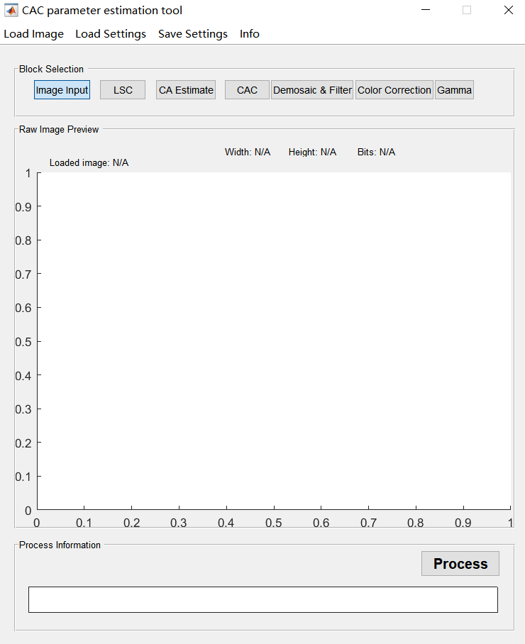

具体操作步骤如下：

1. 点击“Demosaic&Filter"按钮，设置好bayer pattern格式；

1. 点击”load image“按钮，加载RAW图，在预览窗口即可显示图像；

1. 设置“Demosaic&Filter"界面下的参数；

   因为CAC模块在demosaic之后，所以工具先在这里实现了一个简单的demosaic功能。

    - ISP_demosaic_threshold：阈值的默认值设为4。设置值越高，边缘检测算法检测到的边缘越少，较低的值会导致检测到更多的边缘，值255表示边缘检测被完全禁用。
    - Simulate 2 additional Line Buffers：允许用户扩展垂直偏移。这允许将垂直矢量剪裁设置为+-3。在这种情况下，不执行降低色度的滤波，默认不勾选。
    - Filter stage1 select：
    - Sharpen Level：
    - Denoise Level：
    - Lum_weight Off：允许停用过滤器算法的一个特殊功能。该特征有助于抑制暗区域中比亮区域中更强的噪声。由于非线性伽马校正，在处理链中，对比度和噪声在暗区域被强调，而在亮区域被衰减。为了补偿这一点，在将纹理参数与阈值进行比较之前，使用从5x5内核的平均亮度导出的函数对纹理参数进行加权。默认不勾选，图像预览效果噪声小。

1. 点击”Color Correction“按钮，设置该界面下的参数；

    - 勾选”ISP_bls_enable”，设置正确的BLC；
    - 勾选”Auto White-Balance”；
    - 设置CCM；
    - global gain默认设置为1.0。

1. 点击”Gamma“按钮，设置gamma曲线，默认设置为gamma 2.2；

1. 点击”LSC“按钮，然后再点击”Load parameters“，加载对应光源D50下的LSC标定参数，并勾选”Enable”；

1. 点击”CA Estimate“按钮，勾选”CA_Estimate”框，点击”Process”运行；

1. 点击”CAC“按钮，可从该界面下看到标定结果。

## 3. 模块介绍

### 3.1 BLS

#### 3.1.1 功能描述

减去黑电平的偏移值，才能保证数据的线性一致性。

#### 3.1.2 主要参数

| 参数       | 类型及取值范围    | 描述                                        |
| ---------- | ----------------- | ------------------------------------------- |
| bls_enable | bool              | BLS使能开关                                 |
| bls        | int bls[4] 0~4095 | 四通道的黑电平补偿值，数值是基于RAW 12bit的 |

#### 3.1.3 调试策略

尽管支持四通道单独的黑电平补偿值，但还是建议使用相同的值。

### 3.2 LSC

#### 3.2.1 功能描述

在K230中LSC算法使用32x16网格的方式对图像进行校准。在RAW图数据处理过程中，LSC算法将图像分成32x16个子块并对RAW图的四个通道进行处理。

#### 3.2.2 主要参数

| 参数   | 类型及取值范围   | 描述                                                     |
| ------ | ---------------- | -------------------------------------------------------- |
| enable | bool             | LSC使能开关                                              |
| matrix | matrix[4] [1089] | R、Gr、Gb、B四通道的Lens shading校准参数，从标定文件获得 |
| x_size | xSize[32]        | x轴每两个网格结点的距离，从标定文件获得                  |
| y_size | ySize[16]        | y轴每两个网格结点的距离，从标定文件获得                  |

### 3.3 Dgain

#### 3.3.1 功能描述

ISP的数字增益主要用于提升图像的亮度。

#### 3.3.2 主要参数

| 参数            | 类型及取值范围   | 描述                  |
| --------------- | ---------------- | --------------------- |
| driver_load     | bool             | ISP数字增益的使能开关 |
| digital_gain_r  | float 1.0~255.99 | R通道的数字增益       |
| digital_gain_gr | float 1.0~255.99 | Gr通道的数字增益      |
| digital_gain_gb | float 1.0~255.99 | Gb通道的数字增益      |
| digital_gain_b  | float 1.0~255.99 | B通道的数字增益       |

### 3.4 AE

#### 3.4.1 功能描述

AE自动曝光控制图像的亮度。AE模块主要的调试有对AE目标值亮度的调整、对AE收敛速度和平滑性的调整。

#### 3.4.2 主要参数

| 参数            | 类型及取值范围 | 描述                                                   |
| --------------- | -------------- | ------------------------------------------------------ |
| antiBandingMode | int            | 抗工频干扰工作模式                                     |
| dampOver        | float 0~1.0    | 阻尼因子，用于平滑过曝时的AE收敛                       |
| dampOverGain    | float          | AE过曝时clip范围外的收敛加速增益因子，值越大，收敛越快 |
| dampOverRatio   | float 1.0~3.0  | AE过曝时clip范围外比例因子，值越小，收敛越快           |
| dampUnder       | float 0~1.0    | 阻尼因子，用于平滑欠曝时的AE收敛                       |
| dampUnderGain   | float          | AE欠曝时clip范围外的收敛加速增益因子，值越大，收敛越快 |
| dampUnderRatio  | float 0~1.0    | AE欠曝时clip范围比例因子，值越大，收敛越快             |
| setPoint        | float 0~255.0  | 设置AE的亮度目标值                                     |
| tolerance       | float 0~100.0  | 设置AE的亮度目标值百分比锁定范围                       |

### 3.5 AWB

#### 3.5.1 功能描述

在不同的光源环境下，物体呈现的颜色会有所不同。人眼睛有恒常性的特性，在不同的色温光源下都能识别出物体的真实颜色，但sensor在不同光源的反应与人眼的反应不同，就会导致偏色。AWB就是能降低外界光源对物体真实颜色的影响，使得偏色的物体转变为在理想日光光源下无偏色的物体。

#### 3.5.2 主要参数

| 参数    | 类型及取值范围 | 描述                                 |
| ------- | -------------- | ------------------------------------ |
| kFactor | float          | 用于判别outdoor和tansition的感光系数 |

#### 3.5.3 调试策略

环境为outdoor的判别为: Exp*kFactor <=0.12（其他Exp为曝光量）。

可测量灯箱最亮时的照度，比如以2000K为outdoor与transition的分割点，找到对应该照度的曝光值(ET*gain)，即可计算出kFactor。

kFactor越大，说明sensor的sensitivity越强；kFactor越小，说明sensor的sensitivity越弱。

### 3.6 WDR

#### 3.6.1 功能描述

在图像处理过程中，极容易发现图像的对比度不足，并且有可能出现亮区和暗区的细节丢失，WDR模块借助直方图统计均衡的方法提升图像的对比度，同时提升亮区和暗区细节信息。

#### 3.6.2 主要参数

| 参数            | 类型及取值范围 | 描述                                                         |
| --------------- | -------------- | ------------------------------------------------------------ |
| enable          | bool           | WDR的使能开关                                                |
| contrast        | int -1023~1023 | 值越大，局部对比度越强                                       |
| entropy         | int[20]        | local weight                                                 |
| entropy_base    | int            | 亮度因子参数。base越大，slope越小，局部对比度越强            |
| entropy_slope   | int            | 亮度因子参数。base越大，slope越小，局部对比度越强            |
| flat_strength   | int 0~19       | 平坦区域拉伸强度                                             |
| flat_thr        | int 0~20       | 平坦区域阈值。值越大，判别图像越平坦，小于阈值判别为平坦区，大于阈值判别为纹理区 |
| gamma_down      | int[20]        | local weight                                                 |
| gamma_up        | int[20]        | global curve                                                 |
| global_strength | int 0~128      | 全局对比度强度                                               |
| high_strength   | int 0~128      | 对图像亮区信息的保护强度。值越大，对图像中亮区信息保护越强   |
| low_strength    | int 0~255      | 对图像暗区信息的保护强度。值越大，对图像中暗区信息保护越强   |
| strength        | int 0~128      | 总强度                                                       |

#### 3.6.3 调试策略

在线性模式下，Stength设置固定在128。Low Strength实际上是最大增益，它与High Strength一起用于调整图像亮度。当图像的暗区需要变亮时，可以增加Low Strength。当图像的高亮区域曝光过度并且需要抑制时，可以增加High Strength。为了避免噪声的过度增强，随着增益的增加，Low Strength应逐渐降低，而High Strength可以保持不变或逐渐增加。Global Strength用于控制整体对比度。当图像的整体对比度较弱时，可以适当地增加该参数。Contrast, Flat Strength and Flat Threshold用于调整局部对比度。可以先使用默认参数，如果局部对比度不好，可以适当增加Contrast。增加对比度可以使平坦区域的灰色阴影更加明显。目前，调整Flat Threshold以识别纹理区域和平面区域，并增加Flat Strength以平滑平面区域以减少灰色阴影。

### 3.7 GE

#### 3.7.1 功能描述

绿平衡的主要功能是为了平衡RAW数据中邻近像素Gr与Gb的差异，防止后续在demosaic插值算法中产生方格、迷宫格等类似纹路。

#### 3.7.2 主要参数

| 参数        | 类型及取值范围 | 描述             |
| ----------- | -------------- | ---------------- |
| driver_load | bool           | 绿平衡的使能开关 |
| threshold   | float 0~511.0  | 绿平衡强度阈值。 |

### 3.8 DPCC

#### 3.8.1 功能描述

受到sensor制造工艺的限制，对于几百万像素的sensor来说，不可能做到所有的像素都是完好的，特别是对于那种成本较低的sensor来说，坏点数可能更多。若sensor中的坏像素点不尽早处理掉，在后续的demosaic插值算法中就有可能被放大扩散。因此该模块就是在demosaic模块之前完成对坏像素的校准。固定坏点表最大能容纳2048个坏点。提供7组设置值可供选择。

#### 3.8.2 主要参数

| 参数         | 类型及取值范围              | 描述               |
| ------------ | --------------------------- | ------------------ |
| enable       | bool                        | DPCC使能开关       |
| set_use      | int 1~7                     | 选择哪组校准设置值 |
| out_mode     | int 0~15                    | 校准单元的插值模式 |
| line_mad_fac | int lineMadFac [2] [3] 0~63 | 平均绝对差系数     |

### 3.9 DPF

#### 3.9.1 功能描述

双边滤波降噪。

#### 3.9.2 主要参数

| 参数        | 类型及取值范围   | 描述                                |
| ----------- | ---------------- | ----------------------------------- |
| enable      | bool             | 使能开关。                          |
| gain        | float 1.0~1000.0 | sensor gain                         |
| gradient    | float 0.1~128    | 梯度                                |
| min         | float 1.0~128.0  | strength clip                       |
| offset      | float 0~128.0    | 值越大，降噪强度越大                |
| div         | float 0~64.0     | 值越大，降噪强度越小                |
| sigma_g     | float 1.0~128.0  | G通道的空域滤波，值越大，权重越大   |
| sigma_rb    | float 1.0~128.0  | R&B通道的空域滤波，值越大，权重越大 |
| noise_curve | float 0~4095.0   | 17个点的曲线，从标定文件中得到      |

### 3.10 3DNR

#### 3.10.1 功能描述

图像去噪是数字图像处理中的重要环节和步骤，去噪效果将对后续图像处理产生影响。3DNR结合时间域信息和空间域信息，从而能够更有效地识别并降低噪声，并有运动检测，确保降噪过程不会影响移动对象的细节和清晰度。

#### 3.10.2 主要参数

| 参数             | 类型及取值范围  | 描述                                                         |
| ---------------- | --------------- | ------------------------------------------------------------ |
| enable           | bool            | 2DNR和3DNR总使能开关                                         |
| tnr_en           | bool            | 3DNR使能开关                                                 |
| nlm_en           | bool            | 2DNR使能开关                                                 |
| sigma            | float 0.1~16.0] | 2DNR强度，值越大，降噪强度越大                               |
| strength         | float 0~128.0   | 2DNR强度，值越大，降噪强度越大                               |
| blend_motion     | float 0~100.0   | 代表 2DNR处理过的帧与tnr输出帧的权重。改变它会影响去噪强度，但运动估计是不变的 |
| blend_slope      | float 0.1~32.0  | 合并坡度；该值越大，NLM图像的权重就越大。2DNR混合的权重斜率。值越小，静态混合权重高；值越大，运动混合权重高。 |
| blend_static     | float 0~100.0   | 代表的是静止区域2DNR处理过的帧与tnr输出帧的权重              |
| dialte_h         | float           | 3DNR motion dilation的窗口宽度                               |
| filter_len       | float 0~1024    | 时域滤波窗口长度，表示参考了多少帧的信息                     |
| filter_len2      | float 0~100     | 运动历史帧的长度                                             |
| motion_dilate_en | bool            | motion_dilate使能开关                                        |
| motion_erode_en  | bool            | motion_erode使能开关                                         |
| noise_level      | float 0~1024    | 运动检测阈值，大于这个值的判断为运动区                       |
| noisemodel_a     | float           | 自定义pregamma曲线的斜率                                     |
| noisemodel_b     | float           | 自定义pregamma曲线的offset值                                 |
| pregamma_en      | bool            | pregamma transform的使能开关                                 |
| preweight        | float           | 前一帧运动信息的权重                                         |
| range_h          | float           | 水平方向上运动检测窗口的半径，7代表采用15x15的               |
| range_v          | float           | 垂直方向上运动检测窗口的半径，7代表采用15x15的               |
| sadweight        | float           | 设置运动差类型a的权重，最终运动检测是两种类型的运动差的加权和，计算block diff的参数 |
| thr_motion_slope | float           | 过渡段，过了slope就是百分百的运动区域                        |

#### 3.10.3 调试策略

1. 先打开tnr，nlm，dilate，erode，pregamma；
1. 设置filter_len控制参考帧的damping ratio；
1. 设置filter_len2控制运动帧的damping ratio；
1. 用noise_level来区分前景与背景；
1. 设置thr_motion_slope，sad weight，preweight来计算运动区域。

### 3.11 Demosaic

#### 3.11.1 功能描述

Demosaic模块实现的功能主要是通过插值算法将输入的bayer格式数据转换成RGB格式数据，同时支持降噪、锐化、去摩尔纹、去紫边功能。

#### 3.11.2 主要参数

| 参数                         | 类型及取值范围 | 描述                                                         |
| ---------------------------- | -------------- | :----------------------------------------------------------- |
| demosaic_enable              | bool           | demosaic使能开关                                             |
| demosaic_thr                 | int 0~255      | r和b通道的插值阈值，小于这个值做无方向的插值                 |
| dmsc_dir_thr_min             | int 0~4095     | 暗区G通道插值                                                |
| dmsc_dir_thr_max             | int 0~4095     | 亮区G通道插值                                                |
| dmsc_denoise_strength        | int 0~32       | 低频滤波降噪强度                                             |
| dmsc_sharpen_enable          | bool           | sharpen的使能开关                                            |
| dmsc_sharpen_clip_black      | int 0~2047     | 黑边锐化限制参数                                             |
| dmsc_sharpen_clip_white      | int 0~2047     | 白边锐化限制参数                                             |
| dmsc_sharpen_factor_black    | int 0~511      | 针对黑边的锐化增强，值越大，锐化增强效果越明显               |
| dmsc_sharpen_factor_white    | int 0~511      | 针对边边的锐化增强，值越大，锐化增强效果越明显               |
| dmsc_sharpen_line_enable     | bool           | 图像相邻短线条使能开关                                       |
| dmsc_sharpen_line_r1         | int 0~255      | /                                                            |
| dmsc_sharpen_line_r2         | int 0~255      | /                                                            |
| dmsc_sharpen_line_strength   | int 0~4095     | 值越大，线条锐化强度越大                                     |
| dmsc_sharpen_line_thr        | int            | 线条锐化阈值                                                 |
| dmsc_sharpen_line_thr_shift1 | int 0~10       | /                                                            |
| dmsc_sharpen_r1              | int 0~255      | 锐化曲线参数                                                 |
| dmsc_sharpen_r2              | int 0~255      | 锐化曲线参数                                                 |
| dmsc_sharpen_r3              | int 0~255      | 锐化曲线参数                                                 |
| dmsc_sharpen_size            | int 0~16       | 表示高频信号的呈现情况。值越小，表示锐化区域中的细节越多，更多的小细节会被锐化 |
| dmsc_sharpen_t1              | int 0~2047     | 锐化曲线参数                                                 |
| dmsc_sharpen_t2_shift        | int 0~11       | 锐化曲线参数                                                 |
| dmsc_sharpen_t3              | int 0~2047     | 锐化曲线参数                                                 |
| dmsc_sharpen_t4_shift        | int 0~11       | 锐化曲线参数                                                 |
| dmsc_demoire_area_thr        | int 0~32       | 去摩尔纹面积阈值，大于阈值的才进行去摩尔纹处理               |
| dmsc_demoire_enable          | bool           | 去摩尔纹使能开关                                             |
| dmsc_demoire_r1              | int 0~255      | 摩尔纹消除强度曲线参数                                       |
| dmsc_demoire_r2              | int 0~255      | 摩尔纹消除强度曲线参数                                       |
| dmsc_demoire_t1              | int 0~255      | 摩尔纹消除强度曲线参数                                       |
| dmsc_demoire_t2_shift        | int 0~8        | 摩尔纹消除强度曲线参数                                       |
| demoire_edge_r1              | int 0~255      | 摩尔纹转换曲线参数                                           |
| demoire_edge_r2              | int 0~255      | 摩尔纹转换曲线参数                                           |
| demoire_edge_t1              | int 0~511      | 摩尔纹转换曲线参数                                           |
| demoire_edge_t2_shift        | int 0~9        | 摩尔纹转换曲线参数                                           |
| dmsc_demoire_sat_shrink      | int 0~32       | 值越大，摩尔纹区域饱和度消减越强                             |
| dmsc_depurple_cbcr_mode      | int [0,1,2,3]  | depurple通道模式。0：关闭depurple，1：R通道depurple，2：B通道depurple，3：R&B通道depurple |
| dmsc_depurple_enable         | bool           | depurple使能开关                                             |
| dmsc_depurple_sat_shrink     | int 0~8        | 紫边区域饱和度缩减值。值越大，饱和度缩减越强                 |
| dmsc_depurple_thr            | int 8~255      | 检测紫边的强度阈值。值越小，被视为紫色条纹的像素就越多       |

#### 3.11.3 调试策略

1. 插值

   对于12bit raw，值0对应的插值Threshold为dir_thr_min，值4095对于的插值Threshold为dir_thr_max，处于中间的值对应的Threshold为dir_thr_min和dir_thr_max所决定线段上的对应值点。

   

   demosaic_thr的设置：梯度差异>阈值，方向插值；梯度差异<阈值，平均值插值。较小的值意味着在高频区域出现更多的伪彩。

1. 锐化及降噪

   denoise_strength表示低频噪声滤波强度，当设置为0时，相当于关闭降噪功能。一般情况下在demosaic模块里都将降噪功能关闭，只有当图像的噪声特别大的时候，才在这里使用降噪。

   锐化曲线参数的设置：曲线越陡峭，锐化强度越大。

   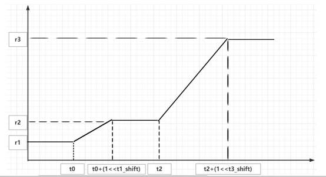

   sharpen_line的设置：当图像的噪声比较大的时候，想让边缘平滑连续一些，就可以打开sharpen_line。sharpen_line的基本效果就是在垂直或水平方向上平滑线条或纹理。纵轴sharpen_line_r1、sharpen_line_r2越大，锐化结果就越接近定向（水平或垂直）增强。此外，更多的点被错误连接，这可能导致高频细节中的错误。

   sharpen_factor&clip设置：factor值越大，锐化效果越强；clip值越大，表示截断效果越弱，保留的细节越多。应该尽量避免factor>clip的设置情况，这样黑白细节保持少，而锐化强度高，会导致没有层次感。

1. 去摩尔纹

   摩尔纹转换曲线：

   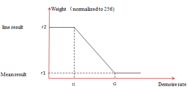

   摩尔纹校准曲线：

   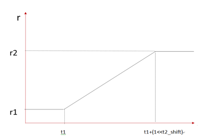

### 3.12 ManualWB

#### 3.12.1 功能描述

手动设置白平衡的gain值。

#### 3.12.2 主要参数

| 参数        | 类型及取值范围      | 描述                       |
| ----------- | ------------------- | -------------------------- |
| driver_load | bool                | 表示是否加载该模块下的参数 |
| gain        | float [4] 1.0~3.999 | 四通道的白平衡gain值       |

### 3.13 CCM

#### 3.13.1 功能描述

通过标准3×3的矩阵和矢量偏移量完成颜色空间的线性校正。CCM 的 3x3 矩阵将 sensor 的 色彩空间转换到 sRGB 标准的色彩空间。

#### 3.13.2 主要参数

| 参数        | 类型及取值范围                | 描述                       |
| ----------- | ----------------------------- | -------------------------- |
| driver_load | bool                          | 表示是否加载该模块下的参数 |
| ccmatrix    | float ccMatrix[9] -8.0~7.996  | 色彩校准矩阵               |
| ccoffset    | ccOffset[3] -2048~2047(12bit) | 偏移量                     |

### 3.14 Gamma

#### 3.14.1 功能描述

Gamma模块主要是对亮度空间进行非线性转化以适应一般的输出设备。

#### 3.14.2 主要参数

| 参数         | 类型及取值范围 | 描述                       |
| ------------ | -------------- | -------------------------- |
| driver_load  | bool           | 表示是否加载该模块下的参数 |
| standard     | bool           | 标准gamma使能开关          |
| standard_val | float          | gamma值的大小，默认2.2     |
| curve        | int [64]       | 64个点的gamma曲线          |

#### 3.14.3 调试策略

默认使用gamma2.2的值，用户可根据需要自定义gamma曲线。

### 3.15 EE

#### 3.15.1 功能描述

EE模块用于对图像细节纹理的锐化增强，实现图像清晰度的提升。对图像边缘锐化的同时，控制相关参数，还能抑制图像的黑白边。

#### 3.15.2 主要参数

| 参数            | 类型及范围  | 描述                                                   |
| :-------------- | :---------- | :----------------------------------------------------- |
| enable          | bool        | EE功能的使能控制                                       |
| ee_strength     | int 0~128   | EEq强度                                                |
| ee_src_strength | int 0~128   | 值越大，降噪强度越大。默认设为1                        |
| ee_y_up_gain    | int 0~10000 | 亮边的gain强度                                         |
| ee_y_down_gain  | int 0~10000 | 暗边的gain强度                                         |
| ee_uv_gain      | int 0~1024  | 对边缘色彩饱和度的控制，值越大，饱和度下降越明显       |
| ee_edge_gain    | int 0~10000 | 对边缘细节的检测强度。gain值越大，检测到的边缘细节越多 |

### 3.16 CA

#### 3.16.1 功能描述

CA模块是基于UV gain曲线去调节图像饱和度，它主要的功能是消除暗区域或低饱和度区域的彩色噪声。实际应用时可以帮助消除高亮过曝区域由于R/G/B三通道的非线性造成的伪彩色和低饱和度区域的白平衡偏差。

#### 3.16.2 主要参数

| 参数     | 类型及取值范围 | 描述                                                         |
| -------- | -------------- | ------------------------------------------------------------ |
| ca_en    | bool           | CA模块的使能开关                                             |
| curve_en | bool           | ca_curve和dci_curve的使能开关                                |
| ca_mode  | int [0,1,2]    | 0：根据亮度调节饱和度；1：根据原饱和度调节饱和度；2：根据亮度和原饱和度调节饱和度 |
| ca_curve | flaot          | 64个点的ca曲线                                               |

### 3.17 DCI

#### 3.17.1 功能描述

Dynamic Contrast Improve用于调整图像的全局对比度。

#### 3.17.2 主要参数

| 参数      | 类型及取值范围 | 描述            |
| --------- | -------------- | --------------- |
| dci_en    | bool           | dci使能开关     |
| dci_curve | float          | 64个点的dci曲线 |

### 3.18 CProcess

#### 3.18.1 功能描述

在YUV域对图像的颜色进行处理。

#### 3.18.2 主要参数

| 参数        | 类型及取值范围      | 描述                                                         |
| ----------- | ------------------- | ------------------------------------------------------------ |
| driver_load | bool                | CProcess使能开关                                             |
| luma_in     | int                 | luminance input range。0: Y_in range [64..940]，1: Y_in full range [0..1023] |
| luma_out    | int                 | luminance output clipping range。0: Y_out clipping range [16..235]，1: Y_out clipping range [0..255] |
| chroma_out  | int                 | chrominance pixel clipping range at output。0: CbCr_out clipping range [16..240]，1: Full UV_out clipping range [0..255] |
| bright      | float -128~127      | 亮度调整值                                                   |
| contrast    | float 0.3~1.9921875 | 对比度调整值                                                 |
| hue         | float -90~89        | 色调调整值                                                   |
| saturation  | float 0~1.9921875   | 饱和度调整值                                                 |
