# K230 SDK Tuning Tool使用指南

版权所有©2023北京嘉楠捷思信息技术有限公司

## 免责声明

您购买的产品、服务或特性等应受北京嘉楠捷思信息技术有限公司（“本公司”，下同）及其关联公司的商业合同和条款的约束，本文档中描述的全部或部分产品、服务或特性可能不在您的购买或使用范围之内。除非合同另有约定，本公司不对本文档的任何陈述、信息、内容的正确性、可靠性、完整性、适销性、符合特定目的和不侵权提供任何明示或默示的声明或保证。除非另有约定，本文档仅作为使用指导参考。

由于产品版本升级或其他原因，本文档内容将可能在未经任何通知的情况下，不定期进行更新或修改。

## 商标声明

、“嘉楠”和其他嘉楠商标均为北京嘉楠捷思信息技术有限公司及其关联公司的商标。本文档可能提及的其他所有商标或注册商标，由各自的所有人拥有。

**版权所有 © 2023北京嘉楠捷思信息技术有限公司。保留一切权利。**
非经本公司书面许可，任何单位和个人不得擅自摘抄、复制本文档内容的部分或全部，并不得以任何形式传播。

## 目录

[TOC]

## 前言

### 概述

本文档描述了Tuning Tool的使用说明。

### 读者对象

本文档（本指南）主要适用于以下人员：

- 技术支持工程师
- 软件开发工程师

### 缩略词定义

| 简称 | 说明                                                       |
|------|------------------------------------------------------------|
| BLS  | Black Level Subtraction                                    |
| HDR  | High Dynamic Range                                         |
| 3A   | AE(Auto Exposure)、AF(Auto Focus)、AWB(Auto White Balance) |
| DG   | Digital Gain                                               |
| LSC  | Lens Shading Correction                                    |
| WB   | White Balance                                              |
| DM   | Demosaic                                                   |
| DPCC | Defect Pixel Cluster Correction                            |
| DPF  | Denoising Prefilter                                        |
| CNR  | Color Noise Reduction                                      |
| CAC  | Chromatic Aberration Correction                            |
| CA   | Color Adjustment                                           |
| DCI  | Dynamic Contrast Improvement                                           |
| 2DNR | 2D Noise Reduction                                         |
| 3DNR | 3D Noise Reduction                                         |
| GC   | Gamma Correction                                           |
| GE   | Green Equilibrate                                          |
| EE   | Edge Enhance                                               |
| CP   | Color Processing                                           |
| ROI  | Region Of Interested                                       |
| DW   | De-warp                                                    |
| TS   | Tuning-Server                                              |
| TC   | Tuning-Client                                              |
| RTSP | Real Time Streaming Protocol                               |

### 修订记录

| 文档版本号  | 修改说明                           | 修改者 | 日期       |
|------------|-----------------------------------|--------|------------|
| V1.0       | 初版                              | 郭世栋 | 2023-02-20 |
| V1.1       | 更新部分功能描述                   | 刘家安 | 2023-04-07 |
| V1.2       | 更新部分功能描述 新增部分功能描述   | 郭世栋 | 2023-05-05 |
| V1.3       | 增加RTSP功能描述  | 郭世栋 | 2023-07-28 |
| V2.0       | 更新为新版本 VTunerClient | 黄子懿 | 2024-01-10 |
| V2.1       | 更新部分功能描述 新增部分功能描述   | 荣坚 | 2024-01-11 |

## 1. 模块软件架构

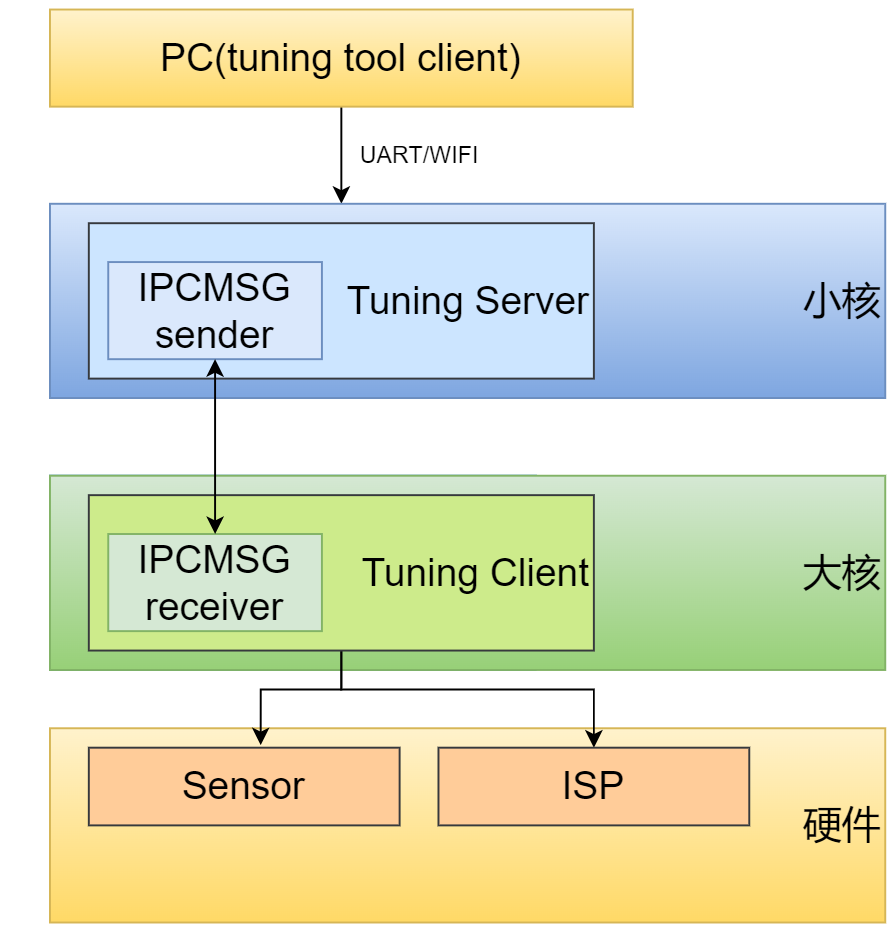

图1-1

## 2. Tuning Tool的连接及启用

### 2.1 工具获取路径

| **文件名**      | **存放位置**       | **功能**                                            |
|-----------------|--------------------|-----------------------------------------------------|
| PC tuning-tool软件包（tuning-client.exe） | relaese的源码包k230_sdk/tools/tuning-tool-client/Kendyte_ISP_Tool_TuningClient-6.2.23.5-Win32-x86_64-10-26-2023-09.28.16.7z                  | 用于图像dump，ISP调试等PC端工具  |
| t_server_c-6.1.0                        | 小核文件系统 /mnt/             | tuning server可执行程序 |
| sample_sys_init.elf                     | 大核文件系统 /sdcard/app       | 大核服务端              |
**表2-1 文件列表**

### 2.2 启动流程

1. 板端小核配置IP
1. 板端小核等待sharefs启动后，在大核启动 sample_sys_init.elf，运行 `/sharefs/app/sample_sys_init.elf` 即可
1. 板端小核启动tuning server，运行 `/mnt/t_server_c-6.1.0`，需要根据实际情况添加参数，使用 `-?` 参数查看帮助
1. PC端启动VTunnerClient，连接K230

## 3. Tuning Tool界面介绍

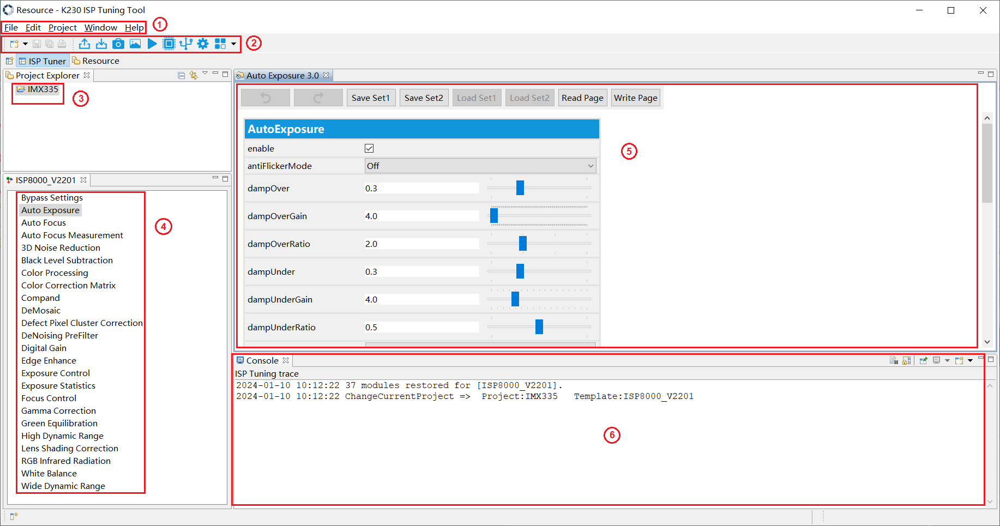

图3-1

如图3-1所示为VTunnerClient的基本操作UI全部展开后共六个区域：

(1) 菜单操作区域：文件操作、窗口管理等功能

(2) 工具栏区域：支持关键功能的操作

| 按钮 | 描述|
|------|------------------------------------------------------------|
|   | 将设置导出到文件|
|  | 从文件导入设置|
|   | 拍摄图像或视频|
|   | 将本地raw图像或视频发送到调试服务器由ISP处理|
|    | 视频预览|
|    | 配置寄存器|
|    | 配置连接调试服务器|
|    | 修改首选项|
|    | 提供对额外组件的访问|

(3) 工程管理区域：选择和管理不同工程

(4) 功能区域：用于ISP各模块UI的切换

(5) 调试区域：用于调试某一个模块的参数

(6) 回显区域：用于打印部分参数下发和接收的日志

### 3.1 连接板端tuning-server

#### 3.1.1 使用HTTP方式连接板端tuning-server

SDK默认支持HTTP方式连接，点击工具栏中的配置连接调试服务器按钮，将弹出图3-2。

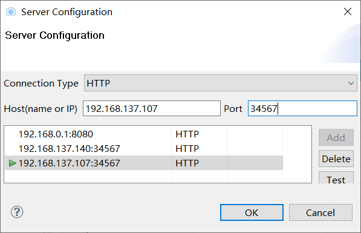

图3-2

选择HTTP模式，保证PC与板端连接的网络处于同一网段，在“Host”输入框中输入板端的IP，在“Port”输入框中请输入固定端口34567，配置完成后点击“OK”按钮，如果板端tuning-server已经启动，则会自动完成连接。任意切换图3-1中④区域的模块，则会看到tuning-server端的函数打印。

### 3.2 创建/选择工程

若所需调试的工程已在图3-1中③区域，则点击选中该工程即可开始ISP调试。
若还没有创建所需调试的工程，则需先创建该工程。

#### 3.2.1 创建调试工程

如图3-3，依次点击File-\>New-\>Project...，弹出工程创建向导窗口，如图3-4。
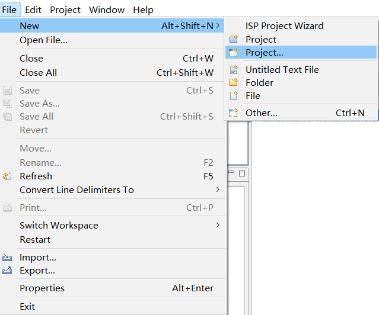

图3-3

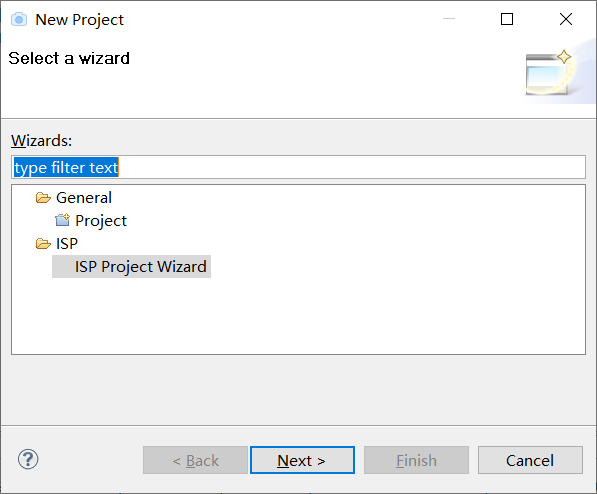

图3-4

点击“Next”按钮，弹出创建工程窗口，如图3-5。
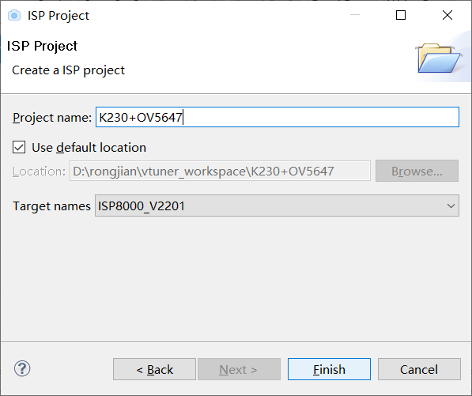

图3-5

输入工程名称，指定工程地址后，点击“Finish”按钮即可完成工程创建，该工程将显示在图3-1中的区域③。点击该工程即可开始ISP调试。

### 3.3 在线调试界面及功能描述

本节只是简单介绍一些tuning tool界面上调试模块的主要功能，具体的调试策略及步骤在图像调优文档中进行详细的描述。

ISP功能模块如图3-6所示。

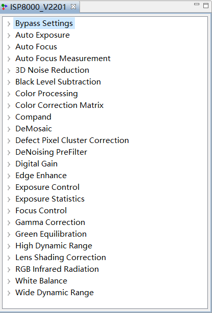

图3-6

#### 3.3.1 Bypass Setting

所有ISP功能模块的使能控制。

#### 3.3.2 Auto Exposure

自动曝光控制参数，控制图像亮度和AE调节时的收敛速度等。

支持设置ROI窗口。开启ROI模式需要，需要semMode中选择FIX模式并enable AE才能开启ROI模式。

#### 3.3.3 Auto Focus

暂未支持。

#### 3.3.4 Auto Focus Measurement

暂未支持。

#### 3.3.5 3D Noise Reduction

通过调整参数配置，对图像降噪强度的调节。

#### 3.3.6 Black Level Subtraction

提供与Sensor相关的黑电平校正，可对R、Gr、Gb、B四通道进行设置。

#### 3.3.7 Color Processing

颜色处理模块，可调节图像的对比度、亮度、饱和度及色调，设置不同的颜色喜好或风格。

#### 3.3.8 Color Correction Matrix

色彩还原矩阵。通过调节3x3 CCM矩阵及偏移量可完成颜色偏差的校准。

#### 3.3.9 Compand

数据拉伸、压缩模块，可设置作用曲线。

#### 3.3.10 Demosaic

通过插值将Bayer格式的Raw图转为RGB图，并提供去摩尔纹、去紫边、锐化及降噪处理功能。

该模块中还包含了CAC子模块，用于校准主要由镜头引入的色差，由标定工具生成校准参数。

#### 3.3.11 Defect Pixel Cluster Correction

提供对像素坏点的检测及校准的功能，通过选择set可设置不同的校准方法。

#### 3.3.12 DeNoising Prefilter

双边滤波降噪模块。

#### 3.3.13 Digital Gain

用于对ISP Digital Gain使能控制及调节大小。

#### 3.3.14 Edge Enhance

用于提升图像的清晰度。通过设置合适的参数，提升图像清晰度的同时，也可抑制噪声的增强。

该模块中还包含了CA和DCI两个子模块。

CA模块用于调节图像的饱和度。根据图像亮度或者原饱和度的变化来调整饱和度，达到局部调整饱和度的目的，让亮区域的颜色更鲜艳以及消除暗区域或低饱和度区域的彩噪。

DCI模块实现对图像的动态对比度调整。

#### 3.3.15 Exposure Control

支持获取自动曝光和增益，支持通过工具界面设置曝光和增益，设置时需要关闭自动曝光功能。

#### 3.3.16 Exposure Statics

暂未支持。

#### 3.3.17 Focus Control

未支持。

#### 3.3.18 Gamma Correction

支持客户自定义gamma，该模式下可更改gamma指数。

#### 3.3.19 Green Equilibrate

校准Gr与Gb两通道的不平衡，可设置不同的绿平衡强度。

#### 3.3.20 High Dynamic Range

多曝光宽动态，可调节各曝光间的曝光量比例系数、融合取值范围。

#### 3.3.21 Lens Shading Correction

提供镜头阴影校正，校准系数由标定工具生成。

#### 3.3.22 RGB Infrared Radiation

暂未支持。

#### 3.3.23 White Balance

提供白平衡R、Gr、Gb、B四通道增益设置。

#### 3.3.24 Wide Dynamic Range

提供对图像全局和局部对比度的调整。

### 3.4 拍摄图像

#### 3.4.1 设置图像格式和大小

点击工具栏中的预览按钮，将弹出图3-7。

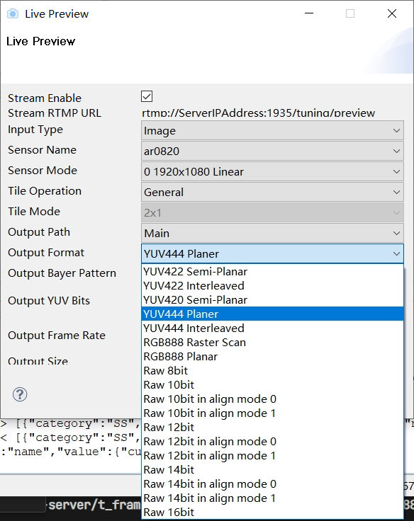

图3-7

勾选“Stream Enable”。在“Output Format”栏中选择需拍摄的图像格式：
若需拍摄YUV图像，当前仅支持8bit yuvNV12格式数据，请选择“YUV420 Semi_Planar”；
若需拍摄raw data图像，请根据ISP接入的raw data位宽选择相应位宽选项。

如下图3-8，在“Output Size”栏中正确设置图像大小。
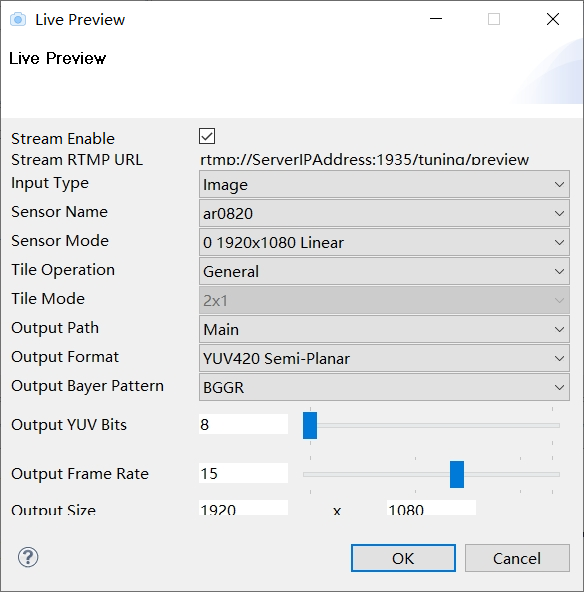

图3-8

点击“OK”按钮完成设置。

#### 3.4.2 采集图像

点击工具栏中的拍摄按钮，将弹出图3-9。

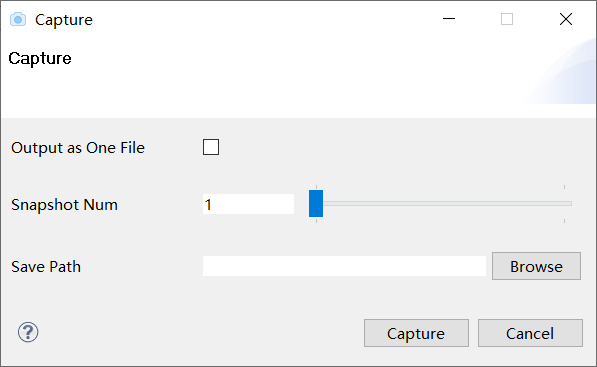

图3-9

在“Save Path”栏中选择图像文件保存的地址。
若拍摄单帧图像，直接点击“Capture”按钮即可；
若拍摄多帧图像，请在“Snapshot Num”选项中设置所需拍摄的帧数，并根据所希望输出的文件数量设置“Output as One File”选项（勾选或不勾选），完成上述配置后，点击“Capture”按钮开始拍摄。

### 3.5 参数的导入与导出

#### 3.5.1 参数导入

工具默认支持导入的参数文件为标准xml和json格式，分为标定参数和tuning参数两部分，支持PC本地导入。

点击工具栏中的导入按钮，将弹出图3-10。

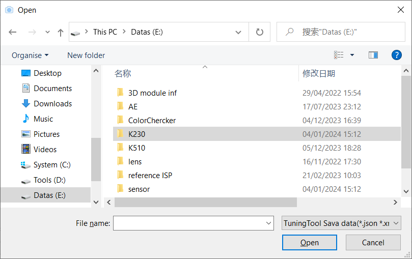

图3-10

在图3-10所示窗口中选择需要导入的xml或json参数文件，点击“Open”按钮即可开始导入。

#### 3.5.2 参数导出

工具默认导出方式会将在线调试参数汇总为一个json文件存放。

点击工具栏中的导出按钮，将弹出图3-11。

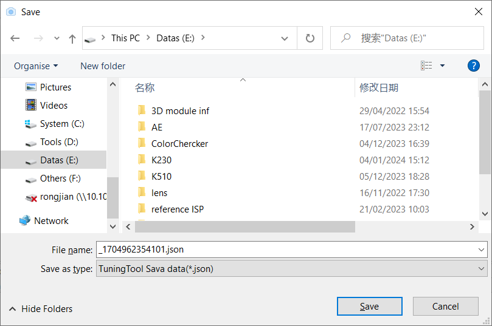

图3-11

在图3-11所示窗口中选择需要导出的json参数文件，点击“Save”按钮即可开始导出。
