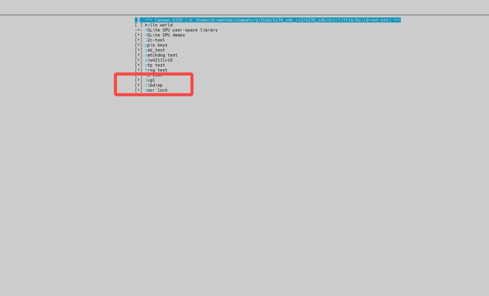

# K230 场景实战-智能门锁POC


版权所有©2023北京嘉楠捷思信息技术有限公司

<div style="page-break-after:always"></div>

## 免责声明

您购买的产品、服务或特性等应受北京嘉楠捷思信息技术有限公司（“本公司”，下同）及其关联公司的商业合同和条款的约束，本文档中描述的全部或部分产品、服务或特性可能不在您的购买或使用范围之内。除非合同另有约定，本公司不对本文档的任何陈述、信息、内容的正确性、可靠性、完整性、适销性、符合特定目的和不侵权提供任何明示或默示的声明或保证。除非另有约定，本文档仅作为使用指导参考。

由于产品版本升级或其他原因，本文档内容将可能在未经任何通知的情况下，不定期进行更新或修改。

## 商标声明

、“嘉楠”和其他嘉楠商标均为北京嘉楠捷思信息技术有限公司及其关联公司的商标。本文档可能提及的其他所有商标或注册商标，由各自的所有人拥有。

**版权所有 © 2023北京嘉楠捷思信息技术有限公司。保留一切权利。**
非经本公司书面许可，任何单位和个人不得擅自摘抄、复制本文档内容的部分或全部，并不得以任何形式传播。

<div style="page-break-after:always"></div>

## K230 智能门锁

在K230平台开发的一套集成UI、人脸检测、人脸识别、人脸注册功能的程序。

### 硬件环境

- K230-USIP-LP3-EVB-V1.0/K230-USIP-LP3-EVB-V1.1
- 配套的LCD模组
- K230-USIP-IMX335-SENSOR-V1.1模组

### 概述

智能门锁程序作为一个POC项目，提供给客户如何使用lvgl、大小核通信、多媒体pipeline及ai等功能的参考，程序主要分两部分，大核端程序主要完成视频输入输出，AI处理等相关的功能，小核端完成UI及人脸特征值管理的功能，大小核通过IPCMSG进行通信，现阶段只支持sd卡启动，后续会支持emmc、norflash等启动。

### 源码位置

大核端程序源码路径位于`src/reference/business_poc/door_lock`，目录结构如下：

```sh
.
├── anchors_320.cc
├── CMakeLists.txt
├── main.cc
├── mbface.kmodel
├── mobile_face.cc
├── mobile_face.h
├── mobile_retinaface.cc
├── mobile_retinaface.h
├── model.cc
├── model.h
├── retinaface.kmodel
├── util.cc
├── util.h
└── vi_vo.h

```

小核端程序源码路径位于`src/little/buildroot-ext/package/door_lock`，目录结构如下：

```sh
.
├── Config.in
├── src
│   ├── CMakeLists.txt
│   └── ui
│       ├── CMakeLists.txt
│       ├── data
│       │   └── img
│       │       ├── delete.png
│       │       ├── import.png
│       │       └── signup.png
│       ├── demo
│       │   └── main.c
│       ├── lvgl_port
│       │   ├── CMakeLists.txt
│       │   ├── k230
│       │   │   ├── buf_mgt.cpp
│       │   │   ├── buf_mgt.hpp
│       │   │   ├── CMakeLists.txt
│       │   │   ├── lv_port_disp.cpp
│       │   │   └── lv_port_indev.c
│       │   ├── lv_conf_demo.h
│       │   ├── lv_conf.h
│       │   └── lv_port.h
│       └── src
│           ├── db_proc.c
│           ├── db_proc.h
│           ├── main.c
│           ├── msg_proc.cpp
│           ├── msg_proc.h
│           ├── scr_main.c
│           ├── scr_signup.c
│           ├── sdk_autoconf.h
│           └── ui_common.h
└── src.mk

```

#### 编译程序

大核程序编译：在`k230_sdk`目录下执行`make poc`，在`k230_sdk/src/reference/business_poc/door_lock/out`目录下生成`door_lock.elf`
小核程序编译：在`k230_sdk`目录下执行`make buildroot-menuconfig`，进入`External options`选项，选中以下选项,如图所示：
保存配置并退出图形配置界面，依次执行`make buildroot-savedefconfig`和`make buildroot`命令，
在`k230_sdk/output/k230_evb_defconfig/little/buildroot-ext/target`下生成`app`目录

#### 运行程序

1. 加载模型到开发板
从`k230_sdk/src/big/kmodel/door_lock`目录下拷贝`retinaface.kmodel`和`mbface.kmodel`两个模型拷贝到小核/sharefs下
1. 加载程序到开发板
将大核编译好的程序拷贝到小核/sharefs下
将小核编译好的程序整个`app`目录拷贝到小核根目录下
1. 加载动态链接库
将小核编译好的动态链接库`libdisp.so`、`liblvgl.so`和`liblv_drivers.so`放到小核的`/usr/lib`下，编译完成的动态链接库位置`k230_sdk/output/k230_evb_defconfig/little/buildroot-ext/target/usr/lib/`
1. 系统启动后大核进入/sharefs之后在大核端执行命令
`door_lock.elf retinaface.kmodel mbface.kmodel`
1. 在小核端执行命令
`/app/door_lock/ui/ui`

#### 功能演示

1. 大小核程序启动后界面显示如下：

1. sd人脸图片导入功能，必须在/sharefs/pic下放入图片，为保证识别效果，导入图片的格式要求为jpg，分辨率为720*1280，用户把需要导入的人脸图片放到`/sharefs/pic`下，按下图片导入键，程序会自动完成提取特征值功能，并以图片的文件名为识别成功后的lable,操作效果如下：

1. 人脸实时注册功能，点击人脸注册按钮，通过UI展示的键盘输入lable，为保证识别效果，注册时人脸应位于图像的中央，操作效果如下：
识别效果：

1. 人脸底库删除功能，删除所有通过sd卡和人脸实时注册的人脸，操作效果如下：
