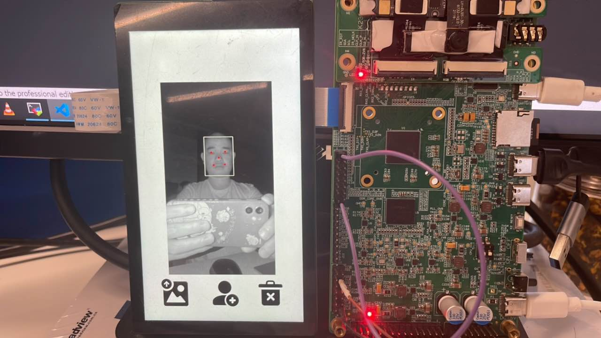
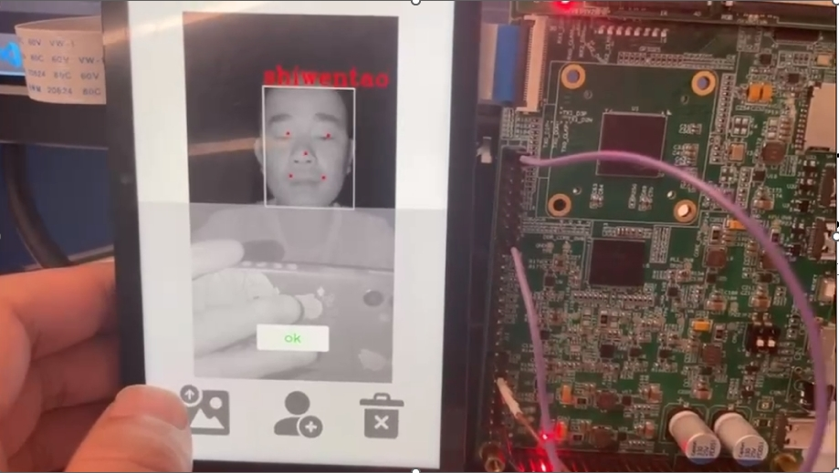
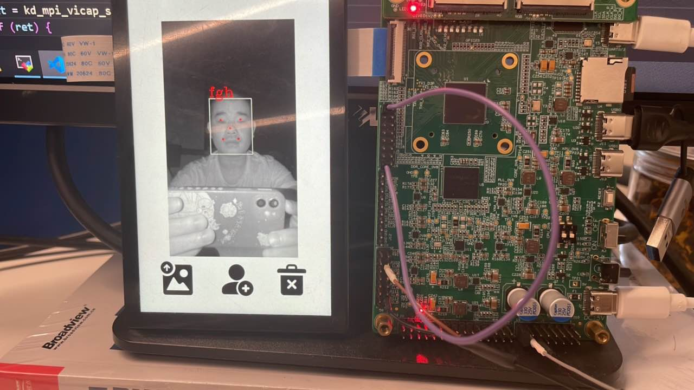
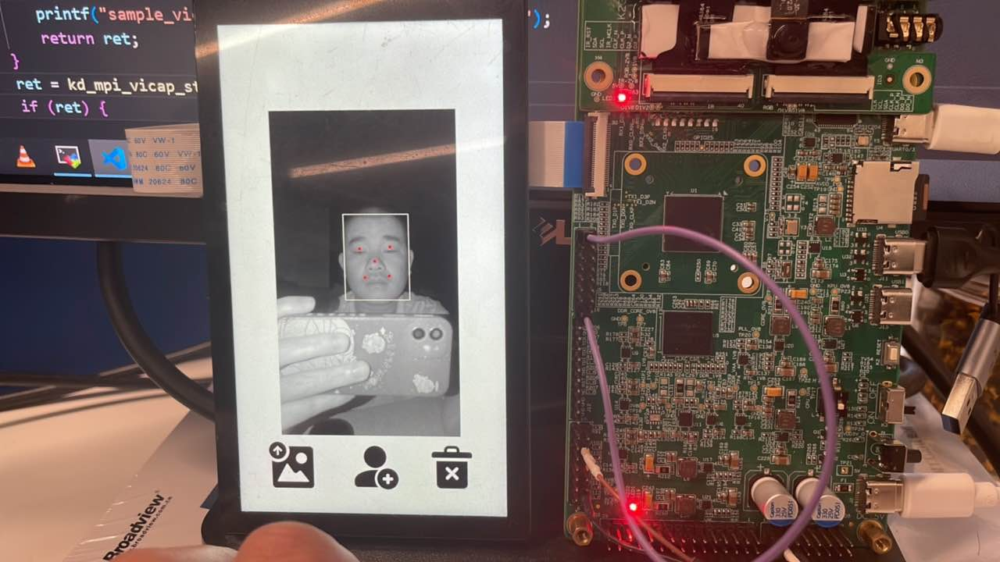

# K230 场景实战-智能门锁POC


版权所有©2023北京嘉楠捷思信息技术有限公司

<div style="page-break-after:always"></div>

## 免责声明

您购买的产品、服务或特性等应受北京嘉楠捷思信息技术有限公司（“本公司”，下同）及其关联公司的商业合同和条款的约束，本文档中描述的全部或部分产品、服务或特性可能不在您的购买或使用范围之内。除非合同另有约定，本公司不对本文档的任何陈述、信息、内容的正确性、可靠性、完整性、适销性、符合特定目的和不侵权提供任何明示或默示的声明或保证。除非另有约定，本文档仅作为使用指导参考。

由于产品版本升级或其他原因，本文档内容将可能在未经任何通知的情况下，不定期进行更新或修改。

## 商标声明

、“嘉楠”和其他嘉楠商标均为北京嘉楠捷思信息技术有限公司及其关联公司的商标。本文档可能提及的其他所有商标或注册商标，由各自的所有人拥有。

**版权所有 © 2023北京嘉楠捷思信息技术有限公司。保留一切权利。**
非经本公司书面许可，任何单位和个人不得擅自摘抄、复制本文档内容的部分或全部，并不得以任何形式传播。

<div style="page-break-after:always"></div>

## K230 智能门锁

在K230平台开发的一套集成UI、人脸检测、ir检测、depth检测、人脸识别、人脸注册功能的程序。使用8线 nor flash快起，从上电到出图400ms以内，到开锁700ms以内，使用flash大小为32M,DDR大小为128M。

### 硬件环境

- K230-USIP-LP3-EVB-V1.0/K230-USIP-LP3-EVB-V1.1
- 配套的LCD模组
- K230-USIP-OV9286-SENSOR-V1.1模组

### 概述

智能门锁程序作为一个POC项目，提供给客户如何使用lvgl、大小核通信、多媒体pipeline及ai等功能的参考，程序主要分两部分，大核端程序主要完成视频输入输出，AI处理等相关的功能，小核端完成UI及人脸特征值管理的功能，大小核通过IPCMSG进行通信，在开发板通过norflash启动。

### 备注

1.为确保识别效果，DPU使用的配置文件和参考帧文件必须与使用的sensor配套，若不匹配，请在`src/reference/business_poc/doorlock_ov9286/big/bin/`路径下替换配套的`H1280W720_conf.bin`和`H1280W720_ref.bin`，替换后重新编译镜像。

2.下电和reset之前，应现在小核串口端输入`halt`,保护文件系统不被损坏。

3.门锁POC场景中，人脸特征值等个人私密信息必须以密文方式存储到介质中，以避免私密信息被攻击者窃取从而留下安全隐患。K230智能门锁POC场景中，人脸特征值被加密存储在norflash中，uboot阶段会将密文数据从flash中搬到ddr中并完成数据解密。本项目使用AES-GCM加解密算法完成特征值加解密，加解密使用的密钥以明文形式被硬编码到app中，这样做的目的是客户可以更方便地体验门锁POC功能。但是，密钥以明文形式编码到app中本身属于不安全的行为，如果有需求，后期我们会提供一套完整的人脸特征值加解密存储方案，具体的流程如下：

3.1 客户拿到k230开发板套件后，需要把密钥烧录到OTP密钥区；

3.2 门锁POC场景下，当客户需要存储人脸特征值时，会从OTP中读取密钥，然后利用密钥实现AES-GCM加密；

3.3 uboot阶段，读取OTP密钥区中用户烧录的密钥进行解密。

### 源码位置

大核端程序源码路径位于`src/reference/business_poc/doorlock_ov9286/big`，目录结构如下：

```sh
.
├── anchors_320.cc
├── bin
│   ├── H1280W720_conf.bin
│   └── H1280W720_ref.bin
├── build
├── CMakeLists.txt
├── main.cc
├── mobile_face.cc
├── mobile_face.h
├── mobilenetv2_depth.cc
├── mobilenetv2_depth.h
├── mobilenetv2_ir.cc
├── mobilenetv2_ir.h
├── mobile_retinaface.cc
├── mobile_retinaface.h
├── model.cc
├── model.h
├── util.cc
├── util.h
└── vi_vo.h


```

小核端程序源码路径位于`src/little/buildroot-ext/package/door_lock`，目录结构如下：

```sh
.
├── Config.in
├── src
│   ├── CMakeLists.txt
│   └── ui
│       ├── CMakeLists.txt
│       ├── data
│       │   └── img
│       │       ├── delete.png
│       │       ├── import.png
│       │       └── signup.png
│       ├── demo
│       │   └── main.c
│       ├── lvgl_port
│       │   ├── CMakeLists.txt
│       │   ├── k230
│       │   │   ├── buf_mgt.cpp
│       │   │   ├── buf_mgt.hpp
│       │   │   ├── CMakeLists.txt
│       │   │   ├── lv_port_disp.cpp
│       │   │   └── lv_port_indev.c
│       │   ├── lv_conf_demo.h
│       │   ├── lv_conf.h
│       │   └── lv_port.h
│       └── src
│           ├── db_proc.c
│           ├── db_proc.h
│           ├── main.c
│           ├── msg_proc.cpp
│           ├── msg_proc.h
│           ├── scr_main.c
│           ├── scr_signup.c
│           └── ui_common.h
└── src.mk

```

#### 编译程序

K230-USIP-LP3-EVB-V1.0/K230-USIP-LP3-EVB-V1.1开发板编译程序：
在`k230_sdk`目录下执行`make CONF=k230_evb_doorlock_ov9286_defconfig`，`k230_sdk/src/reference/business_poc/doorlock_ov9286/big/out`目录下生成大核程序`door_lock.elf`，`k230_sdk/output/k230_evb_doorlock_ov9286_defconfig/little/buildroot-ext/target`下生成小核程序`app`目录。

#### 运行程序

智能门锁在nor flash镜像中，大小核程序自启，K230-USIP-LP3-EVB-V1.0/K230-USIP-LP3-EVB-V1.1开发板编译完成之后会在`output/k230_evb_doorlock_ov9286_defconfig/images/`目录下生成`sysimage-spinor32m.img`镜像，烧写nor flash镜像，开发板拨码开关设置成nor flash启动

#### 功能演示

1. 大小核程序启动后界面显示如下：

1. sd人脸图片导入功能，必须在/sharefs/pic下放入图片，为保证识别效果，导入图片的格式要求为jpg，分辨率为720*1280，比例为9:16，用户把需要导入的人脸图片放到`/sharefs/pic`下，按下图片导入键，程序会自动完成提取特征值功能，并以图片的文件名为识别成功后的lable,操作效果如下：

1. 人脸实时注册功能，点击人脸注册按钮，通过UI展示的键盘输入lable，为保证识别效果，注册时人脸应位于图像的中央，操作效果如下：
识别效果：

1. 人脸底库删除功能，删除所有通过sd卡和人脸实时注册的人脸，操作效果如下：
