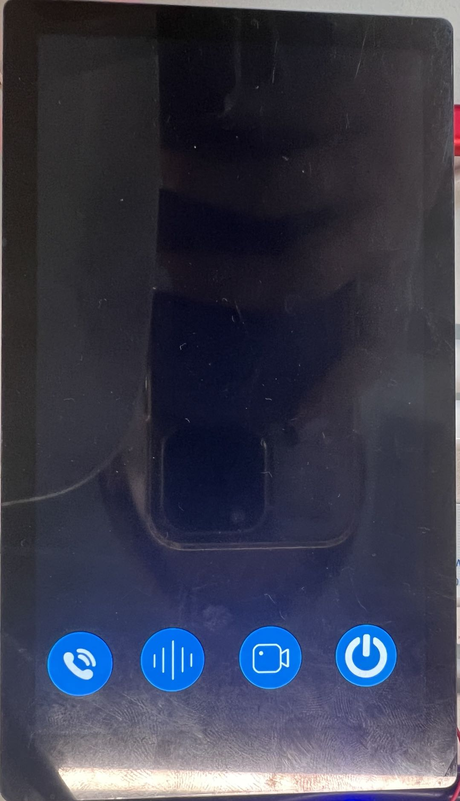

# K230 场景实战-猫眼POC


版权所有©2023北京嘉楠捷思信息技术有限公司

<div style="page-break-after:always"></div>

## 免责声明

您购买的产品、服务或特性等应受北京嘉楠捷思信息技术有限公司（“本公司”，下同）及其关联公司的商业合同和条款的约束，本文档中描述的全部或部分产品、服务或特性可能不在您的购买或使用范围之内。除非合同另有约定，本公司不对本文档的任何陈述、信息、内容的正确性、可靠性、完整性、适销性、符合特定目的和不侵权提供任何明示或默示的声明或保证。除非另有约定，本文档仅作为使用指导参考。

由于产品版本升级或其他原因，本文档内容将可能在未经任何通知的情况下，不定期进行更新或修改。

## 商标声明

、“嘉楠”和其他嘉楠商标均为北京嘉楠捷思信息技术有限公司及其关联公司的商标。本文档可能提及的其他所有商标或注册商标，由各自的所有人拥有。

**版权所有 © 2023北京嘉楠捷思信息技术有限公司。保留一切权利。**
非经本公司书面许可，任何单位和个人不得擅自摘抄、复制本文档内容的部分或全部，并不得以任何形式传播。

<div style="page-break-after:always"></div>

## K230 猫眼

在K230平台开发的一套集成UI、视频对讲、人形检测功能的产品级程序。猫眼产品支持远程猫眼和本地猫眼两种，本文档暂时只描述远程猫眼，所谓远程猫眼即猫眼设备可以与远程手机设备进行交互。

### 硬件环境

- K230-USIP-LP3-EVB-V1.0/K230-USIP-LP3-EVB-V1.1
- 配套的LCD模组
- K230-USIP-IMX335-SENSOR-V1.1模组

远程猫眼需要两套以上设备，一套作为猫眼设备，一套模拟手机设备。

## 概述

猫眼程序作为一个POC项目，提供给客户如何使用lvgl、大小核通信、多媒体pipeline及ai等功能的参考，程序主要两大部分：

- 猫眼设备侧程序：包括大核程序和小核程序两个
  1. 大核程序
  主要完成ai人形检测功能，并在检测到人长期逗留后，抓拍人形并存盘
  1. 小核程序
  主要完成音视频的推流和音频的播放，和手机设备交互实现视频对讲功能

- 手机设备侧程序：只包括小核程序
  小核侧程序主要完成通过UI界面控制视频对讲的开始、结束、变声以及存盘功能，和猫眼设备交互实现视频对讲功能

### 源码位置

- 猫眼设备大核程序源码路径位于`k230_sdk/src/reference/business_poc/peephole/big`，目录结构如下：

```sh
.
├── CMakeLists.txt
├── include
│   ├── ai_base.h
│   ├── person_detect.h
│   ├── scoped_timing.h
│   ├── utils.h
│   └── vi_vo.h
├── main.cpp
└── src
    ├── ai_base.cpp
    ├── person_detect.cpp
    └── utils.cpp
```

- 猫眼设备小核程序源码路径位于 `k230_sdk/src/reference/business_poc/peephole/common`，目录结构如下：

```sh
.
├── caller_audio
│   └── doorbell.g711u
├── main.cpp
├── Makefile
├── media.cpp
└── media.h
```

- 模拟手机设备程序源码路径位于`k230_sdk/src/reference/business_poc/peephole/little`，目录结构如下：

```sh
.
├── Config.in
├── src
│   ├── CMakeLists.txt
│   └── ui
│       ├── CMakeLists.txt
│       ├── data
│       │   └── img
│       │       ├── intercom.png
│       │       ├── record.png
│       │       ├── shutdown.png
│       │       └── voice_change.png
│       ├── demo
│       │   └── main.c
│       ├── lvgl_port
│       │   ├── CMakeLists.txt
│       │   ├── k230
│       │   │   ├── buf_mgt.cpp
│       │   │   ├── buf_mgt.hpp
│       │   │   ├── CMakeLists.txt
│       │   │   ├── lv_port_disp.cpp
│       │   │   └── lv_port_indev.c
│       │   ├── lv_conf_demo.h
│       │   ├── lv_conf.h
│       │   └── lv_port.h
│       └── src
│           ├── db_proc.c
│           ├── db_proc.h
│           ├── intercom.cpp
│           ├── intercom.h
│           ├── main.c
│           ├── media.cpp
│           ├── media.h
│           ├── msg_proc.cpp
│           ├── msg_proc.h
│           ├── scr_main.c
│           ├── scr_signup.c
│           ├── sdk_autoconf.h
│           ├── ui_common.h
│           ├── vo_cfg.c
│           └── vo_cfg.h
└── src.mk

```

### 编译程序

#### 猫眼设备

1. 大核侧程序编译：在 `k230_sdk` 目录下面执行 `make poc`，编译完成后，在 `k230_sdk/src/reference/business_poc/peephole/big/out/` 下面会生成大核侧可执行程序 `person_snap.elf`

1. 小核侧程序编译：在 `k230_sdk` 目录下面执行 `make cdk-user` ，编译完成后，在 `k230_sdk/src/common/cdk/user/out/little` 下会生成小核侧可执行程序 `peephole_dev` 。

#### 模拟手机设备

小核程序编译：在`k230_sdk`目录下执行`make buildroot-menuconfig`，进入`External options`选项，选中`lvgl`、`libdisp`和`peephole`。


保存配置并退出图形配置界面，依次执行`make buildroot-savedefconfig`和`make buildroot`命令，
在`k230_sdk/output/k230_evb_defconfig/little/buildroot-ext/target/app`目录下生成`peephole`目录

## 运行程序

### 运行猫眼设备端程序

1. 拷贝大核侧程序到开发板
将 `k230_sdk/src/reference/business_poc/peephole/big/out/` 下生成的大核侧可执行程序 `person_snap.elf` 拷贝到开发板小核 `/sharefs/app` 下

1. 拷贝人形检测模型到开发板
将 `k230_sdk/src/big/kmodel/peephole` 下面人形检测模型 `person_detect_yolov5n.kmodel` 拷贝到开发板小核 `/sharefs/app` 下

1. 执行大核程序
在开发板大核侧 `/sharefs/app` 下执行 `./person_snap.elf person_detect_yolov5n.kmodel`

1. 大核程序启动以后，启动小核程序
在开发板小核侧 `/mnt` 下，执行 `./peephole_dev`，启动小核程序，此时开始推流，在手机设备侧可通过按键开启对讲

### 运行模拟手机端

1. 将`k230_sdk/output/k230_evb_defconfig/little/buildroot-ext/target/app/peephole`拷贝到小核`/app/`目录下。
1. 将`k230_sdk/output/k230_evb_defconfig/images/little-core/rootfs/usr/lib/`目录下的`libdisp.so`、`liblvgl.so`、`liblv_drivers.so`拷贝到小核`lib`目录下。
1. 执行 `/app/peephole/ui/ui rtsp://ip:8554/BackChannelTest`，开始运行手机端程序。需要注意这里的rtsp地址是猫眼设备小核程序运行后获得的

### 模拟手机端存盘回放

在小核/mnt目录下执行`./sample_kplayer test.mp4`，屏幕和耳机会输出对讲录像音视频。

### 功能演示

- 猫眼设备

1. 大核程序
大核程序开始执行后，会开始检测人形，当连续检测到人形超过10s（模拟人员逗留）时，显示屏会显示人形框，同时保存当前图像为jpg图片，如下图：
对于抓拍下来的jpg图片，暂时需要拷贝到pc上查看

1. 小核程序
在开发板上插入耳机，小核程序开始执行后，可以首先听到门铃声，同时小核会打印出形如 `rtsp://ip:8554/BackChannelTest` 的url地址，手机设备使用此url开始与猫眼设备进行视频对讲

- 模拟手机设备

模拟手机设备端程序运行后，屏幕显示如下界面:

屏幕下方的四个按键为手机设备功能控制按键，从左往右四个按键介绍如下：

- 第一个按键控制对讲使能/取消，程序运行起来第一次按下后，对讲开始。

- 第二个按键控制变声使能/取消，默认为变声

- 第三个按键控制存盘使能/取消，默认为存盘。

- 第四个按键为退出程序。
