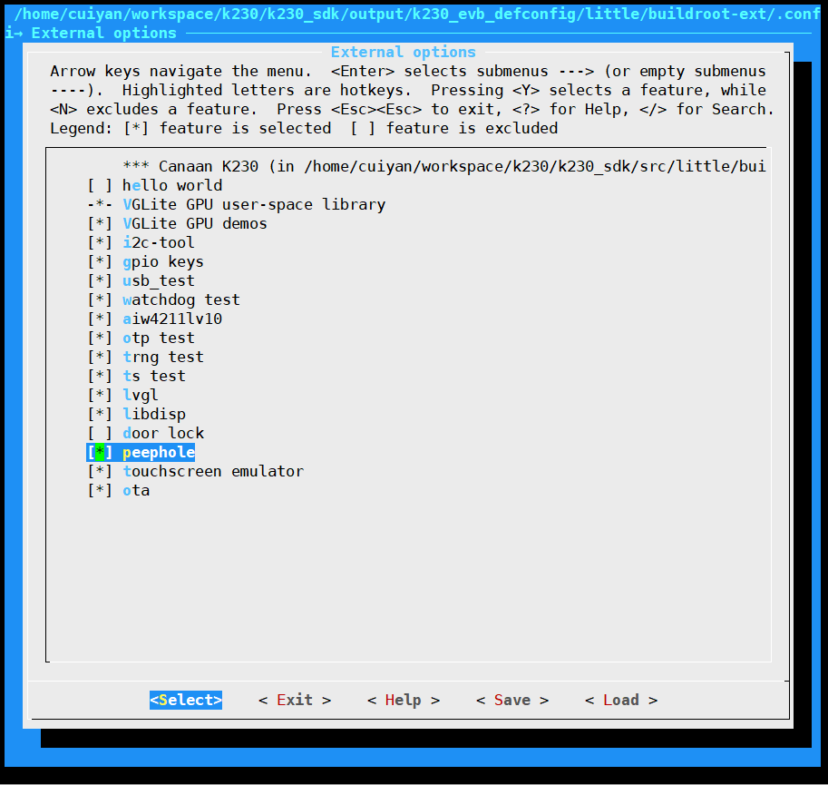
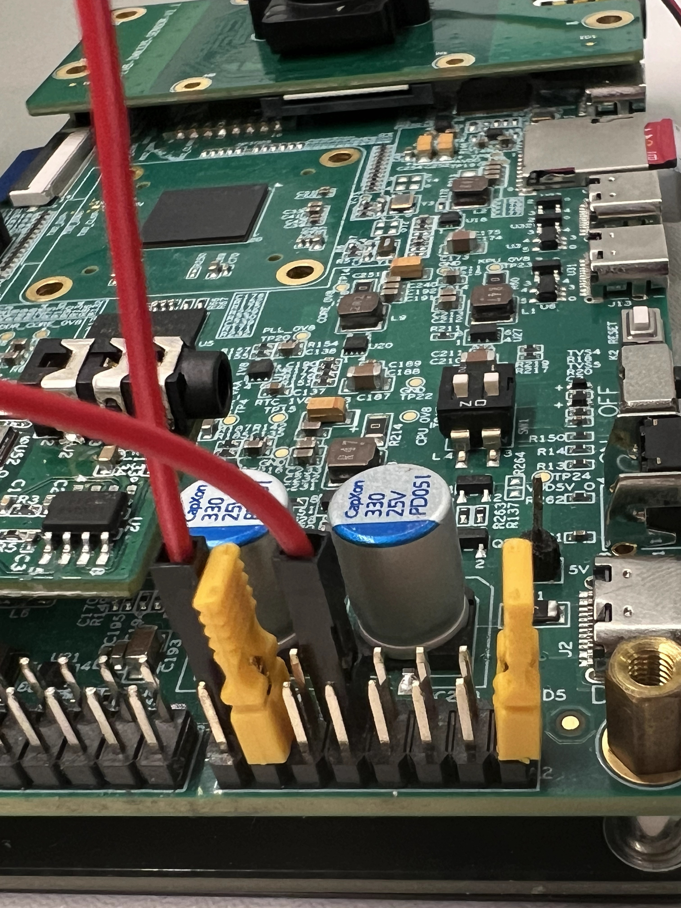

# K230 场景实战-猫眼POC


版权所有©2023北京嘉楠捷思信息技术有限公司

<div style="page-break-after:always"></div>

## 免责声明

您购买的产品、服务或特性等应受北京嘉楠捷思信息技术有限公司（“本公司”，下同）及其关联公司的商业合同和条款的约束，本文档中描述的全部或部分产品、服务或特性可能不在您的购买或使用范围之内。除非合同另有约定，本公司不对本文档的任何陈述、信息、内容的正确性、可靠性、完整性、适销性、符合特定目的和不侵权提供任何明示或默示的声明或保证。除非另有约定，本文档仅作为使用指导参考。

由于产品版本升级或其他原因，本文档内容将可能在未经任何通知的情况下，不定期进行更新或修改。

## 商标声明

、“嘉楠”和其他嘉楠商标均为北京嘉楠捷思信息技术有限公司及其关联公司的商标。本文档可能提及的其他所有商标或注册商标，由各自的所有人拥有。

**版权所有 © 2023北京嘉楠捷思信息技术有限公司。保留一切权利。**
非经本公司书面许可，任何单位和个人不得擅自摘抄、复制本文档内容的部分或全部，并不得以任何形式传播。

<div style="page-break-after:always"></div>

## K230 猫眼

在K230平台开发的一套集成UI、视频对讲、人形检测功能的产品级程序。猫眼产品支持远程猫眼和本地猫眼两种，本文档暂时只描述远程猫眼，所谓远程猫眼即猫眼设备可以与远程手机设备进行交互。

### 硬件环境

- K230-USIP-LP3-EVB-V1.0/K230-USIP-LP3-EVB-V1.1
- 配套的LCD模组
- K230-USIP-IMX335-SENSOR-V1.1模组
- 外置音频子板

除外置音频子板外，远程猫眼需要两套以上设备，一套作为猫眼设备，一套模拟手机设备。音频子板用于猫眼设备端。

## 概述

猫眼程序作为一个POC项目，提供给客户如何使用lvgl、大小核通信、网络通信
多媒体pipeline及ai等功能的参考。

程序的主要功能：

1. 模拟两种唤醒模式：PIR唤醒和门铃唤醒。

   - PIR唤醒：
     - 猫眼设备端向手机端发送PIR唤醒消息以及一张抓拍图像，并存储抓拍图像。
     - 手机端收到PIR唤醒消息后，会在UI界面弹框提示收到PIR唤醒消息。
   - 门铃唤醒：
     - 猫眼设备向手机端发送门铃唤醒消息，向手机端推送视频流，并存储视频。

1. rtsp网络服务以及rpc服务。
1. 大小核事件、数据通信。
1. 图像抓拍、录像以及回放。
1. GUI显示。

程序主要两大部分：

- 猫眼设备侧程序：包括大核程序和小核程序两个
  1. 大核程序
  主要完成ai人形检测、视频/图像编码、音频输入及编码、音频解码及输出功能。
  1. 小核程序
  主要完成UI界面控制、音视频的推流、存盘、回放、与手机设备交互实现视频对讲功能。

- 手机设备侧程序：只包括小核程序
  小核侧程序主要完成通过UI界面控制视频对讲的开始、结束、变声功能，和猫眼设备交互实现视频对讲功能。

### 源码位置

- 猫眼设备大核程序源码路径位于`k230_sdk/src/reference/business_poc/peephole/big`，目录结构如下：

```sh
.
├── app
│   ├── data
│   │   └── doorbell.g711u
│   ├── main.cpp
│   ├── my_app.cpp
│   ├── my_app.h
│   ├── my_comm_server.h
│   └── util.h
├── build
├── CMakeLists.txt
├── comm_server
│   ├── include
│   │   ├── comm_msg.h
│   │   └── comm_server.h
│   └── src
│       ├── avdata_reader.cpp
│       ├── avdata_reader.h
│       ├── avdata_writer.cpp
│       ├── avdata_writer.h
│       ├── comm_server.cpp
│       ├── data_fifo_reader.cpp
│       ├── data_fifo_reader.h
│       ├── data_fifo_writer.cpp
│       ├── data_fifo_writer.h
│       ├── data_shm.h
│       ├── event_writer.cpp
│       └── event_writer.h
├── media
│   ├── include
│   │   └── media.h
│   └── src
│       └── media.cpp
└── person_detect
    ├── include
    │   ├── ai_base.h
    │   ├── person_detect.h
    │   └── person_detect_utils.h
    └── src
        ├── ai_base.cpp
        ├── person_detect.cpp
        └── person_detect_utils.cpp

```

- 猫眼设备小核程序源码路径位于 `k230_sdk/src/reference/business_poc/peephole/peephole_device`，目录结构如下：//TODO:

```sh
.
├── Config.in
├── src
│   ├── CMakeLists.txt
│   ├── data
│   │   └── img
│   │       ├── intercom_gray.png
│   │       ├── intercom.png
│   │       ├── play.png
│   │       ├── shutdown.png
│   │       ├── voice_change_gray.png
│   │       └── voice_change.png
│   ├── lvgl_port
│   │   ├── CMakeLists.txt
│   │   ├── k230
│   │   │   ├── buf_mgt.cpp
│   │   │   ├── buf_mgt.hpp
│   │   │   ├── CMakeLists.txt
│   │   │   ├── lv_port_disp.cpp
│   │   │   └── lv_port_indev.c
│   │   ├── lv_conf_demo.h
│   │   ├── lv_conf.h
│   │   └── lv_port.h
│   └── src
│       ├── assets
│       │   ├── img_lv_btn_list_pause.c
│       │   ├── img_lv_btn_list_play.c
│       │   ├── img_lv_btn_loop.c
│       │   ├── img_lv_btn_next.c
│       │   ├── img_lv_btn_pause.c
│       │   ├── img_lv_btn_play.c
│       │   ├── img_lv_btn_prev.c
│       │   └── img_lv_slider_knob.c
│       ├── audio_talk.c
│       ├── audio_talk.h
│       ├── comm
│       │   ├── include
│       │   │   ├── comm_client.h
│       │   │   ├── comm_msg.h
│       │   │   ├── comm_rpc_msg.h
│       │   │   └── comm_rpc_server.h
│       │   └── src
│       │       ├── avdata_reader.cpp
│       │       ├── avdata_reader.h
│       │       ├── avdata_writer.cpp
│       │       ├── avdata_writer.h
│       │       ├── comm_client.cpp
│       │       ├── comm_rpc_server.cpp
│       │       ├── data_fifo_reader.cpp
│       │       ├── data_fifo_reader.h
│       │       ├── data_fifo_writer.cpp
│       │       ├── data_fifo_writer.h
│       │       ├── data_shm.cpp
│       │       ├── data_shm.h
│       │       ├── event_reader.cpp
│       │       └── event_reader.h
│       ├── intercom.h
│       ├── lv_picture_files.c
│       ├── lv_picture_files.h
│       ├── lv_record_files.c
│       ├── lv_record_files.h
│       ├── main.cpp
│       ├── my_app.cpp
│       ├── my_app.h
│       ├── my_muxer.cpp
│       ├── my_muxer.h
│       ├── scr_main.cpp
│       ├── scr_playback.cpp
│       ├── scr_playback_ctrl.cpp
│       ├── scr_playback_list.cpp
│       ├── scr_playback_picture_ctrl.cpp
│       ├── scr_playback_picture_list.cpp
│       ├── ui_common.h
│       ├── vo_cfg.cpp
│       └── vo_cfg.h
└── src.mk
```

- 模拟手机设备程序源码路径位于`k230_sdk/src/reference/business_poc/peephole/peephole_phone`，目录结构如下：

```sh
.
├── Config.in
├── src
│   ├── CMakeLists.txt
│   ├── data
│   │   └── img
│   │       ├── intercom.png
│   │       ├── record.png
│   │       ├── shutdown.png
│   │       └── voice_change.png
│   ├── lvgl_port
│   │   ├── CMakeLists.txt
│   │   ├── k230
│   │   │   ├── buf_mgt.cpp
│   │   │   ├── buf_mgt.hpp
│   │   │   ├── CMakeLists.txt
│   │   │   ├── lv_port_disp.cpp
│   │   │   └── lv_port_indev.c
│   │   ├── lv_conf_demo.h
│   │   ├── lv_conf.h
│   │   └── lv_port.h
│   └── src
│       ├── comm_rpc_client.cpp
│       ├── comm_rpc_client.h
│       ├── comm_rpc_msg.h
│       ├── main.cpp
│       ├── media.cpp
│       ├── media.h
│       ├── my_app.cpp
│       ├── my_app.h
│       ├── my_app_impl.cpp
│       ├── my_app_impl.h
│       ├── scr_main.cpp
│       ├── ui_common.h
│       ├── vo_cfg.cpp
│       └── vo_cfg.h
└── src.mk
```

### 编译程序

#### 猫眼设备

猫眼设备端需要用用猫眼设备配置脚本进行编译，编译命令为`make CONF=k230_evb_peephole_device_defconfig`。
**需要注意，配置过CONF后，后面的编译命令即使不配置CONF，也会用上一次的CONF进行编译，编译产物在`k230_sdk/output/${CONF}`目录下**
默认的CONF为`k230_evb_defconfig`。
生成的镜像在`output/k230_evb_peephole_device_defconfig/images/sysimage-sdcard.img.gz`，烧录该镜像，启动后自动运行猫眼设备端。

单独编译猫眼设备端程序的方法：

1. 大核侧程序编译：在 `k230_sdk` 目录下面执行 `make peephole`，编译完成后，在 `k230_sdk/src/reference/business_poc/peephole/big/out/` 下面会生成大核侧可执行程序 `peephole_dev.elf`

1. 小核侧程序编译：在 `k230_sdk` 目录下面执行 `make CONF=k230_evb_peephole_device_defconfig buildroot` ，编译完成后，在 `k230_sdk/output/k230_evb_peephole_device_defconfig/little/buildroot-ext/target/app/` 下会生成小核侧可执行程序 `peephole_device`目录 。

#### 模拟手机设备

小核程序编译：在`k230_sdk`目录下执行`make buildroot-menuconfig`，进入`External options`选项，选中`Simulate phone app for peephole`。


保存配置并退出图形配置界面，依次执行`make buildroot-savedefconfig`和`make buildroot`命令，
在`k230_sdk/output/k230_evb_defconfig/little/buildroot-ext/target/app`目录下生成`peephole_phone`目录

## 运行程序

### 运行猫眼设备端程序

猫眼设备端如下图所示，可以通过两种方式启动。

- 方式一：将拨码开关拨到`ON`，此方式模拟PIR唤醒。
  - 设备会进行抓拍，并存储。
- 方式二：长按按键，此方式模拟门铃唤醒。
  - 内置codec的耳机输出门铃音效，外置codec的耳机输出语音对讲声音。


猫眼镜像为自启动模式，烧录猫眼镜像后，需要分别将J1的1、2引脚，13、14引脚，9、15引脚两两短接，如下图所示。



### 运行模拟手机端

1. 将`k230_sdk/output/k230_evb_defconfig/little/buildroot-ext/target/app/peephole_phone`拷贝到小核`/app/`目录下。
1. 将以下动态库拷贝到小核`lib`目录下

   - `k230_sdk/output/k230_evb_defconfig/little/buildroot-ext/build/libdisp/`目录下的`libdisp.so`
   - `k230_sdk/output/k230_evb_defconfig/little/buildroot-ext/build/peephole_phone/lvgl_port/`目录下的`liblvgl.so`
   - `k230_sdk/output/k230_evb_defconfig/little/buildroot-ext/build/peephole_phone/lvgl_port/k230/`目录下的`liblv_drivers.so`拷贝到小核`lib`目录下。

1. 大核执行`/sharefs/app/sample_sys_init.elf`
1. 执行 `/app/peephole_phone/peephole_phone ipaddr`，开始运行手机端程序，这里的ipaddr为猫眼设备端的ip地址。

### 功能演示

#### 门铃模式

猫眼设备
通过长按按键的方式启动，启动显示的UI界面如下：


下方的四个按键，从左到右依次为：

- 第一个按键控制对讲使能/取消，仅用于本地门铃对讲。程序运行起来第一次按下后，对讲开始。
- 第二个按键控制变声使能/取消，仅用于本地门铃对讲，默认不变声。
- 第三个按键为回放，用于播放本地存储的视频和图像。(注意本地对讲时，需要先取消对讲再进行回放)
- 第四个按键为关机。

对讲按钮上方显示的为本地IP地址。

当门铃唤醒猫眼设备后，屏幕显示本地摄像头采集的视频，可以通过两种方式进行视频对讲。一种为本地门铃对讲，另外一种为远程门铃对讲。

##### 本地门铃语音对讲

点击猫眼设备端的对讲按键，开始门内外对讲。将耳机连接到猫眼设备的内置codec和外置codec的耳机接口，可以听到对端声音。

##### 远程门铃可视对讲

远程对讲，需要另外一块开发板运行手机端手机端程序。手机端UI界面如下：


下方的四个按键，从左到右依次为：

- 第一个按键控制对讲使能/取消，程序运行起来后，会出现唤醒模式的弹框。此后通过此按键触发对讲，第一次按下后，对讲开始。
- 第二个按键控制变声使能/取消，默认不变声。
- 第三个按键为关机。
