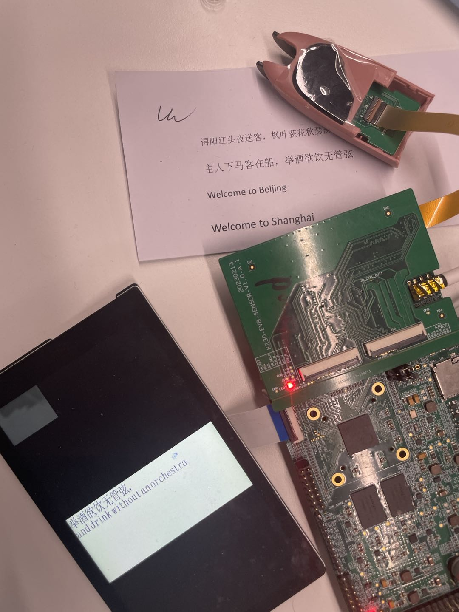
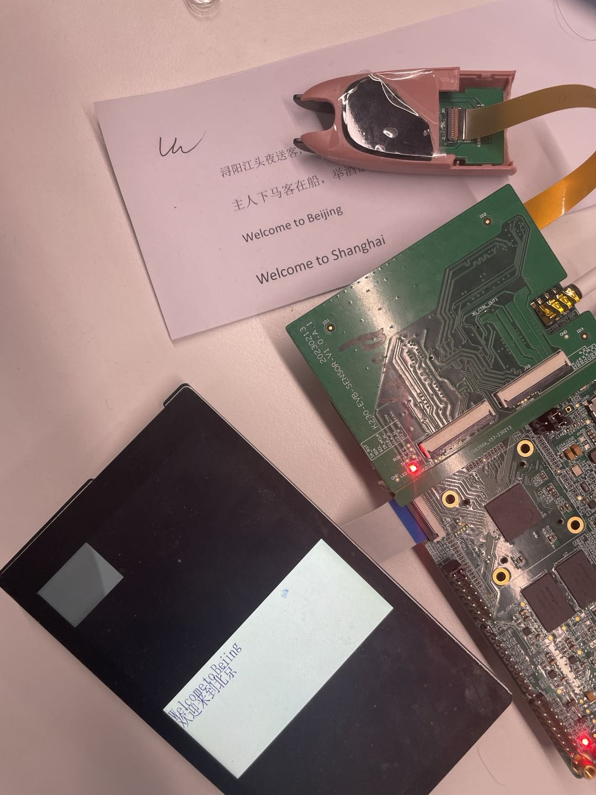

# K230 场景实战-词典笔POC


版权所有©2023北京嘉楠捷思信息技术有限公司

<div style="page-break-after:always"></div>

## 免责声明

您购买的产品、服务或特性等应受北京嘉楠捷思信息技术有限公司（“本公司”，下同）及其关联公司的商业合同和条款的约束，本文档中描述的全部或部分产品、服务或特性可能不在您的购买或使用范围之内。除非合同另有约定，本公司不对本文档的任何陈述、信息、内容的正确性、可靠性、完整性、适销性、符合特定目的和不侵权提供任何明示或默示的声明或保证。除非另有约定，本文档仅作为使用指导参考。
由于产品版本升级或其他原因，本文档内容将可能在未经任何通知的情况下，不定期进行更新或修改。

## 商标声明

、“嘉楠”和其他嘉楠商标均为北京嘉楠捷思信息技术有限公司及其关联公司的商标。本文档可能提及的其他所有商标或注册商标，由各自的所有人拥有。

**版权所有 © 2023北京嘉楠捷思信息技术有限公司。保留一切权利。**
非经本公司书面许可，任何单位和个人不得擅自摘抄、复制本文档内容的部分或全部，并不得以任何形式传播。

<div style="page-break-after:always"></div>

## K230 词典笔

在K230平台开发的一套集成UI、文字识别、文字翻译功能的程序。

### 硬件环境

- K230-USIP-LP4-EVB-V1.0
- 配套的LCD模组
- K230-USIP-SC035-SENSOR-V1.1模组

### 概述

词典笔程序作为一个POC项目，提供给客户如何使用vicap采集数据、在做ai处理，最后推给显示功能的参考，程序主要在大核上运行，大核上完成了图像采集、图像转成文字、文字翻译的功能，在开发板通过sd卡启动，ddr大小需要使用2G。

### 备注

1.下电和reset之前，应现在小核串口端输入`halt`,保护文件系统不被损坏。

### 源码位置

程序源码路径位于`src/reference/business_poc/dictionary_pen_poc`，目录结构如下：

```sh
.
├── audio
│   ├── audio_buf_play.cc
│   ├── audio_buf_play.h
│   └── sample_audio.c
├── build.sh
├── CMakeLists.txt
├── main.cpp
├── README.md
├── include
│   ├── API
│   ├── det_ocr
│   └── stitch
│   └── tts
└── vo
    ├── vo.cc
    └── vo.h
```

其中include中的代码时算法同事提供的、每个kmodel和代码需要匹配使用。

#### 编译程序

K230-USIP-LP4-EVB-V1.0开发板编译程序：
在`k230_sdk`目录下执行`make prepare_sourcecode CONF=k230_evb_usiplpddr4_dictionary_pen_defconfig`，这个时下载词典笔的源码和komdel 。在`k230_sdk`目录下执行 `make CONF=k230_evb_usiplpddr4_dictionary_pen_defconfig` ，目录`k230_sdk/output/k230_evb_usiplpddr4_dictionary_pen_defconfig/images/big-core/app/`下生成程序目录`dictionary_pen`，其中执行程序是`dictionary_pen.elf`。

备注：
在`make prepare_sourcecode` 的时候必须加上`CONF=k230_evb_usiplpddr4_dictionary_pen_defconfig` 否则不会下载词典笔运行所需的kmodel。

#### 运行程序

词典笔demo在sd卡镜像中，默认时不启动的，需要手动运行。K230-USIP-LP4-EVB-V1.0开发板编译完成之后会在`output/k230_evb_usiplpddr4_dictionary_pen_defconfig/images/`目录下生成`sysimage-sdcard.img`镜像。运行开发板进入大核`sharefs\app\dictionary_pen`目录下运行`dictionary_pen.elf`,然后就可以通过词典笔的笔头去扫描文字做翻译。

备注：
1.当词典笔的笔头按下的时候开始扫描文字、松开词典笔的笔头开始做翻译，词典笔的显示会显示翻译的前文字和翻译后的文字。
2.目前词典笔的demo只支持中英文之间的翻译。

#### 功能演示

程序运行结果中文翻译成英文如下：

程序运行结果英文翻译成中文如下：
