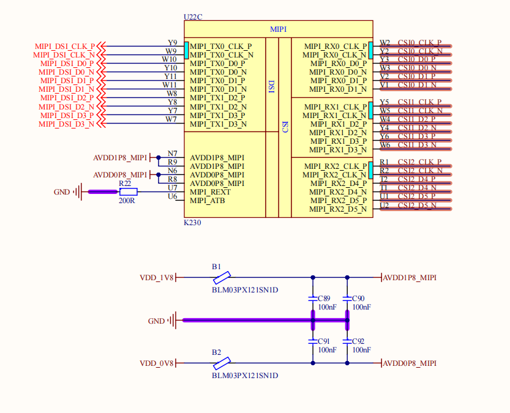
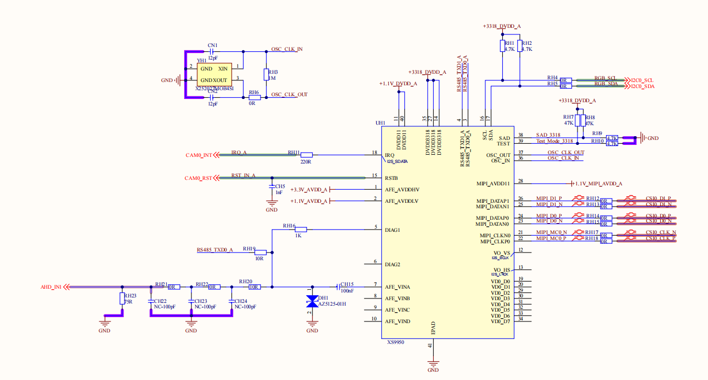

# K230 ahd sensor 移植参考


版权所有©2023北京嘉楠捷思信息技术有限公司

<div style="page-break-after:always"></div>

## 免责声明

您购买的产品、服务或特性等应受北京嘉楠捷思信息技术有限公司（“本公司”，下同）及其关联公司的商业合同和条款的约束，本文档中描述的全部或部分产品、服务或特性可能不在您的购买或使用范围之内。除非合同另有约定，本公司不对本文档的任何陈述、信息、内容的正确性、可靠性、完整性、适销性、符合特定目的和不侵权提供任何明示或默示的声明或保证。除非另有约定，本文档仅作为使用指导参考。

由于产品版本升级或其他原因，本文档内容将可能在未经任何通知的情况下，不定期进行更新或修改。

## 商标声明

、“嘉楠”和其他嘉楠商标均为北京嘉楠捷思信息技术有限公司及其关联公司的商标。本文档可能提及的其他所有商标或注册商标，由各自的所有人拥有。

**版权所有 © 2023北京嘉楠捷思信息技术有限公司。保留一切权利。**
非经本公司书面许可，任何单位和个人不得擅自摘抄、复制本文档内容的部分或全部，并不得以任何形式传播。

<div style="page-break-after:always"></div>

## 目录

[TOC]

## 前言

### 概述

本文档主要描述k230 sdk如何适配ahd sensor 和 对应的ahd 转mipi 的芯片使用，本次介绍需要用到的k230 芯片模块比较多、大家可以根据自己的需求做对应的裁剪。

### 模块

本次demo 使用的模块如下：

- vicap ：vicap是将接受到的sensor的输出数据存储到ddr。在vicap配置AHD sensor中，sensor 的输入只支持YUV422_8 , vicap输出的格式是yuv444。
- nonai-2d ： nonai-2d是格式转换模块，可以将yuv444的图像转换成yuv420、rgb888 plane等。
- dw：dw模块是做任意比例缩放，但是stride 必须是4的倍数。
- gdma ： gdma模块可以进行图像旋转和mirror。

### 读者对象

本文档（本指南）主要适用于以下人员：

- 技术支持工程师
- 软件开发工程师

### 修订记录

| 文档版本号 | 修改说明 | 修改者 | 日期 |
| --- | --- | --- | --- |
| V1.0 | 初版 | zs | 2024/10/23 |

## 1. ahd sensor介绍

AHD（Analog High Definition）即模拟高清技术，是一种基于模拟同轴电缆传输逐行扫描的高清视频技术，具有高清、传输距离远的特点。本次用的AHD 转 mipi 的芯片是XS9950 芯片，这款芯片是国产的支持将高清制式AHD 信号转换成mipi 信号的芯片。

## 2.硬件介绍

k230 芯片支持3路mipi 输出，也就可以同时支持3路AHD sensor 输入， 下边是AHD sensor 接入k230 芯片的示意图，第一张是k230 芯片的mipi 引脚图、第二张是 AHD sensor 的接线图。




本次的测试用板是以k230 canmv 开发板为基础开发、共接入了三路AHD sensor，需要注意的事项如下

- 三路AHD sensor 必须接到三个不同的mipi接口上、需要确认mipi的线序不要接错。
- 三路AHD sesnor 需要确认每路的IIC电压必须与芯片的io 电压相匹配、否则电压不匹配可能导致芯片烧毁或者通信失败
- 三路AHD sesnor 需要确认复位，pwdn 是否接入到k230 芯片，接入需要注意电压是否匹配、没有接入需要保证满足AHD sensor 启动时序。

本次的测试是已经在k230 canmv 开发板基础上做的适配、所以每个ahd 的配置已经在sdk当中配置完成、如果需要设计对应自己的开发板，具体的硬件设置请参考硬件设置指南 [K230_硬件设计指南](../../00_hardware/K230_%E7%A1%AC%E4%BB%B6%E8%AE%BE%E8%AE%A1%E6%8C%87%E5%8D%97.md)

## 3.软件介绍

k230 软件部分采用的是RTT 操作系统，这个操作系统分为两部分，一部分是RTT 内核态、另一部分是RTT 用户态 ，配置AHD sensor 也需要修改这两部分。

RTT 内核态 主要是修改跟硬件相关的修改、包含AHD sensor 的复位、iic、pwdn，具体的修改参考下一章节 rtt kernel 修改。

RTT 用户态 部分主要是用户态程序、本次的用例是以3路720p 25fps 的输入、最终在屏幕上显示三路ahd sensor 采集到的图像。具体的pipe 流程如下：

第一路 ：

- vicap（dev0 chn0）-> 2d(dev0 chn0) -> dw (dev0 chn0) -> gdma(dev0 chn0) -> vo(dev0, chn1)

第二路 ：

- vicap（dev1 chn0）-> 2d(dev0 chn1) -> dw (dev1 chn0) -> gdma(dev0 chn1) -> vo(dev0, chn2)

第三路 ：

- vicap（dev2 chn0）-> 2d(dev0 chn2) -> dw (dev2 chn0) -> gdma(dev0 chn2) -> vo(dev0, chn3)

三路AHD输出720p 25fps图像到vicap，vicap采集720P yuv444的图像发送给nonai-2d，nonai-2d 将720P yuv444的图像转化成720p yuv420发送给dw，dw 将720p图像缩放到640x360 的大小在送给gdma，gdma将640x360旋转90度变成360x640在推送给屏幕显示，本次的屏幕是采用的720x1280 的屏幕，采用的是竖屏当作横屏用，所以需要旋转。后续章节会按照每个pipe 的模块做详细介绍

补充：pipe 中的 dev 和 chn 是模块的通道、每个模块支持的不同、有的可能支持多个dev、多个chn。以pipe 0 vicap （dev0 chn0）为例子dev0 ：vicap 的dev 0 设置，chn0 ：vicap 的 0 通道。

### 3.1 RTT 内核态修改介绍

本次本次的测试是已经在k230 canmv 开发板基础上做的适配，所以AHD sesnor 的drver 已经是是配好的、如果需要设配新的AHD sensor 或者以XS9950为基础设置新的开发板请参考sensor配置指南[K230_Camera_Sensor](../../01_software/board/mpp/K230_Camera_Sensor%E9%80%82%E9%85%8D%E6%8C%87%E5%8D%97.md)

目前在k230 sdk 当中已经有了三路xs9950 的驱动driver，里边的默认配置都是使用720p 25fps的AHD sensor 输入，具体的代码在k230_sdk/src/big/mpp/kernel/sensor/src 中，具体的文件如下：

- xs9950_csi0_drv.c
- xs9950_csi1_drv.c
- xs9950_csi2_drv.c

每个driver 对应的是接到mipi 的csi0 和 csi1 和 csi2 三个接口上。driver 的部分修改只需要关注下边几部分，本次以 xs9950_csi0_drv.c 为例：

reset 的 gpio 控制需要改成你接到 k230 的gpio，这是以k230 canmv 卡发板为基础，reset 的gpio 是0。

```sh
k230_sdk/src/big/mpp/kernel/sensor/src/xs9950_csi0_drv.c:

static int xs9950_power_rest(k_s32 on)
{
    #define VICAP_XS9950_RST_GPIO     (0)  //24// 

    kd_pin_mode(VICAP_XS9950_RST_GPIO, GPIO_DM_OUTPUT);

    if (on) {
        kd_pin_write(VICAP_XS9950_RST_GPIO, GPIO_PV_HIGH); // GPIO_PV_LOW  GPIO_PV_HIGH
        rt_thread_mdelay(100);
        kd_pin_write(VICAP_XS9950_RST_GPIO, GPIO_PV_LOW); // GPIO_PV_LOW  GPIO_PV_HIGH
        rt_thread_mdelay(100);
        kd_pin_write(VICAP_XS9950_RST_GPIO, GPIO_PV_HIGH); // GPIO_PV_LOW  GPIO_PV_HIGH
    } else {
        kd_pin_write(VICAP_XS9950_RST_GPIO, GPIO_PV_LOW); // GPIO_PV_LOW  GPIO_PV_HIGH
    }
    rt_thread_mdelay(1);

    return 0;
}
```

iic 的选择需要你连接到k230上对应的iic name。这是以k230 canmv 卡发板为基础，iic是i2c3.

```sh
k230_sdk/src/big/mpp/kernel/sensor/src/xs9950_csi0_drv.c:

struct sensor_driver_dev xs9950_csi0_sensor_drv = {
    .i2c_info = {
        .i2c_bus = NULL,
        .i2c_name = "i2c3",   //"i2c0", //"i2c3",
        .slave_addr = 0x30,
        .reg_addr_size = SENSOR_REG_VALUE_16BIT,
        .reg_val_size = SENSOR_REG_VALUE_8BIT,
    },
    .
    .
}
```

### 3.2 RTT 用户态 修改介绍

上边已经介绍了用户态代码的流程、下边就按照这个流程做逐个模块介绍。

所有的宏定义如下：

```sh
k230_sdk/src/big/mpp/userapps/sample/sample_ahd_sensor/ahd_sensor.c:

#define ISP_CHN0_WIDTH              (1280)
#define ISP_CHN0_HEIGHT             (720)
#define VICAP_OUTPUT_BUF_NUM        10
#define VENC_BUF_NUM                6
#define NONAI_2D_BUF_NUM            6

#define TOTAL_ENABLE_2D_CH_NUMS     6
#define NONAI_2D_RGB_CH             4
#define NONAI_2D_BIND_CH_0          0
#define NONAI_2D_BIND_CH_1          1
#define NONAI_2D_BIND_CH_2          2

#define DW200_CHN0_INPUT_WIDTH 1280
#define DW200_CHN0_INPUT_HEIGHT 720
#define DW200_CHN0_OUTPUT_WIDTH 640 //960
#define DW200_CHN0_OUTPUT_HEIGHT 360//540
#define DW200_CHN0_VB_NUM 4

#define DW200_CHN1_INPUT_WIDTH 1280
#define DW200_CHN1_INPUT_HEIGHT 720
#define DW200_CHN1_OUTPUT_WIDTH 640//960
#define DW200_CHN1_OUTPUT_HEIGHT 360 //540
#define DW200_CHN1_VB_NUM 4

#define DW200_CHN2_INPUT_WIDTH 1280
#define DW200_CHN2_INPUT_HEIGHT 720
#define DW200_CHN2_OUTPUT_WIDTH 640 //960
#define DW200_CHN2_OUTPUT_HEIGHT 360//540
#define DW200_CHN2_VB_NUM 4
#define GDMA_BUF_NUM 6
```

上边主要是定义了一些输出和输入的size和每个模块对应vb大小的定义。

#### 3.2.1 vb

vb（Video Buff）是用来在各个模块存储数据和数据中转的内存空间，每个模块接受数据和发送数据都是以VB 的形式做传输的、所以每个模块都需要分配一些vb 用来存储和发送数据，初始化整个pipe 的时候先把所有模块的vb先配置好。下边是vb 初始化用例：

```sh
k230_sdk/src/big/mpp/userapps/sample/sample_ahd_sensor/ahd_sensor.c:

static int sample_vb_init(void)
{
    k_s32 ret;
    k_vb_config config;
    k_vb_pool_config pool_config;
    k_vb_supplement_config supplement_config;
    k_u32 pool_id;

    memset(&config, 0, sizeof(config));
    memset(&pool_config, 0, sizeof(pool_config));
    config.max_pool_cnt = 64;

    // for vo install plane data
    config.comm_pool[0].blk_cnt = 5;
    config.comm_pool[0].blk_size = PRIVATE_POLL_SZE;          // osd0 - 3 argb 320 x 240
    config.comm_pool[0].mode = VB_REMAP_MODE_NOCACHE;           //VB_REMAP_MODE_NOCACHE;

    k_u16 sride = ISP_CHN0_WIDTH;
    //VB for YUV444 output for dev0
    config.comm_pool[1].blk_cnt = VICAP_OUTPUT_BUF_NUM;
    config.comm_pool[1].mode = VB_REMAP_MODE_NOCACHE;
    config.comm_pool[1].blk_size = VICAP_ALIGN_UP((sride * ISP_CHN0_HEIGHT * 3), 0x1000);

    //VB for YUV444 output for dev1
    config.comm_pool[2].blk_cnt = VICAP_OUTPUT_BUF_NUM;
    config.comm_pool[2].mode = VB_REMAP_MODE_NOCACHE;
    config.comm_pool[2].blk_size = VICAP_ALIGN_UP((sride * ISP_CHN0_HEIGHT * 3 ), 0x1000);

    //VB for YUV444 output for dev2
    config.comm_pool[3].blk_cnt = VICAP_OUTPUT_BUF_NUM;
    config.comm_pool[3].mode = VB_REMAP_MODE_NOCACHE;
    config.comm_pool[3].blk_size = VICAP_ALIGN_UP((sride * ISP_CHN0_HEIGHT * 3 ), 0x1000);

    //VB for nonai_2d
    config.comm_pool[4].blk_cnt = NONAI_2D_BUF_NUM;
    config.comm_pool[4].mode = VB_REMAP_MODE_NOCACHE;
    config.comm_pool[4].blk_size = VICAP_ALIGN_UP((ISP_CHN0_WIDTH * ISP_CHN0_HEIGHT * 3), 0x1000);

    // DW output vb CHN 0 vb mem = 11,059,200
    config.comm_pool[5].blk_cnt = DW200_CHN0_VB_NUM;
    config.comm_pool[5].blk_size = VICAP_ALIGN_UP((DW200_CHN0_OUTPUT_WIDTH * DW200_CHN0_OUTPUT_HEIGHT * 3), 0x1000);
    config.comm_pool[5].mode = VB_REMAP_MODE_NOCACHE;

    config.comm_pool[6].blk_cnt = DW200_CHN1_VB_NUM;
    config.comm_pool[6].blk_size = VICAP_ALIGN_UP((DW200_CHN1_OUTPUT_WIDTH * DW200_CHN1_OUTPUT_HEIGHT * 3), 0x1000);
    config.comm_pool[6].mode = VB_REMAP_MODE_NOCACHE;

    config.comm_pool[7].blk_cnt = DW200_CHN2_VB_NUM;
    config.comm_pool[7].blk_size = VICAP_ALIGN_UP((DW200_CHN1_OUTPUT_WIDTH * DW200_CHN1_OUTPUT_HEIGHT * 3), 0x1000);
    config.comm_pool[7].mode = VB_REMAP_MODE_NOCACHE;

    // for gdma chn0 
    config.comm_pool[8].blk_cnt = GDMA_BUF_NUM;
    config.comm_pool[8].blk_size = VICAP_ALIGN_UP((DW200_CHN0_OUTPUT_WIDTH * DW200_CHN0_OUTPUT_HEIGHT * 3), 0x1000);
    config.comm_pool[8].mode = VB_REMAP_MODE_NOCACHE;

    // for gdma chn 1
    config.comm_pool[9].blk_cnt = GDMA_BUF_NUM;
    config.comm_pool[9].blk_size = VICAP_ALIGN_UP((DW200_CHN1_OUTPUT_WIDTH * DW200_CHN1_OUTPUT_HEIGHT * 3), 0x1000);
    config.comm_pool[9].mode = VB_REMAP_MODE_NOCACHE;

     // for gdma chn 1
    config.comm_pool[10].blk_cnt = GDMA_BUF_NUM;
    config.comm_pool[10].blk_size = VICAP_ALIGN_UP((DW200_CHN2_OUTPUT_WIDTH * DW200_CHN2_OUTPUT_HEIGHT * 3), 0x1000);
    config.comm_pool[10].mode = VB_REMAP_MODE_NOCACHE;


    ret = kd_mpi_vb_set_config(&config);
    if (ret) {
        printf("vb_set_config failed ret:%d\n", ret);
        return ret;
    }

    memset(&supplement_config, 0, sizeof(supplement_config));
    supplement_config.supplement_config |= VB_SUPPLEMENT_JPEG_MASK;

    ret = kd_mpi_vb_set_supplement_config(&supplement_config);
    if (ret) {
        printf("vb_set_supplement_config failed ret:%d\n", ret);
        return ret;
    }

    ret = kd_mpi_vb_init();
    if (ret) {
        printf("vb_init failed ret:%d\n", ret);
        return ret;
    }

    memset(&pool_config, 0, sizeof(pool_config));
    pool_config.blk_cnt = PRIVATE_POLL_NUM;
    pool_config.blk_size = PRIVATE_POLL_SZE;
    pool_config.mode = VB_REMAP_MODE_NONE;
    pool_id = kd_mpi_vb_create_pool(&pool_config);          // osd0 - 3 argb 320 x 240

    g_vo_pool_id = pool_id;

    return ret;
}
```

```sh
k230_sdk/src/big/mpp/userapps/sample/sample_ahd_sensor/ahd_sensor.c:

#define GDMA_BUF_NUM 6
#define DW200_CHN1_VB_NUM 4
#define DW200_CHN0_VB_NUM 4
#define DW200_CHN2_VB_NUM 4
#define NONAI_2D_BUF_NUM            6
#define VICAP_OUTPUT_BUF_NUM        10
```

上边是所有模块的vb 定义，gdma 分配了6个、三路dw 每路分配了4个、三路vicap 每路分配了10个，这个可以根据内存做自己的裁剪。如果你裁剪了某个模块，对应的内存可以去掉。

#### 3.2.2 vicap

vicap 主要是用来接受sensor 的输出，然后经过处理存储到内存中的模块，在这里主要接收AHD sensor 的yuv422_8 的数据转换成yuv444 的数据存储到ddr 当中，如果想具体了解vicap，可以参考[K230_VICAP_API](../../01_software/board/mpp/K230_VICAP_API%E5%8F%82%E8%80%83.md) 参考指南。下边是vicap 相关的代码：

```sh
k230_sdk/src/big/mpp/userapps/sample/sample_ahd_sensor/ahd_sensor.c:

static int sample_vicap_init(k_vicap_dev dev_chn, k_vicap_sensor_type type)
{
    k_vicap_dev vicap_dev;
    k_vicap_chn vicap_chn;
    k_vicap_dev_attr dev_attr;
    k_vicap_chn_attr chn_attr;
    k_vicap_sensor_info sensor_info;
    k_vicap_sensor_type sensor_type;
    k_s32 ret = 0;

    memset(&dev_attr, 0 ,sizeof(dev_attr));
    memset(&chn_attr, 0 ,sizeof(chn_attr));
    memset(&sensor_info, 0 ,sizeof(sensor_info));

    sensor_type = type;
    vicap_dev = dev_chn;

    memset(&sensor_info, 0, sizeof(k_vicap_sensor_info));
    ret = kd_mpi_vicap_get_sensor_info(sensor_type, &sensor_info);
    if (ret) {
        printf("sample_vicap, the sensor type not supported!\n");
        return ret;
    }

    memset(&dev_attr, 0, sizeof(k_vicap_dev_attr));
    dev_attr.acq_win.h_start = 0;
    dev_attr.acq_win.v_start = 0;
    dev_attr.acq_win.width = ISP_CHN0_WIDTH;
    dev_attr.acq_win.height = ISP_CHN0_WIDTH;
    dev_attr.mode = VICAP_WORK_ONLY_MCM_MODE;
    dev_attr.buffer_num = VICAP_OUTPUT_BUF_NUM;
    dev_attr.buffer_size = VICAP_ALIGN_UP((ISP_CHN0_WIDTH * ISP_CHN0_HEIGHT * 3), VICAP_ALIGN_1K);
    dev_attr.pipe_ctrl.data = 0xFFFFFFFF;
    dev_attr.pipe_ctrl.bits.af_enable = 0;
    dev_attr.pipe_ctrl.bits.ahdr_enable = 0;
    dev_attr.dw_enable = K_FALSE;

    dev_attr.cpature_frame = 0;
    memcpy(&dev_attr.sensor_info, &sensor_info, sizeof(k_vicap_sensor_info));

    ret = kd_mpi_vicap_set_dev_attr(vicap_dev, dev_attr);
    if (ret) {
        printf("sample_vicap, kd_mpi_vicap_set_dev_attr failed.\n");
        return ret;
    }

    memset(&chn_attr, 0, sizeof(k_vicap_chn_attr));

    //set chn0 output yuv444
    chn_attr.out_win.h_start = 0;
    chn_attr.out_win.v_start = 0;
    chn_attr.out_win.width = ISP_CHN0_WIDTH;
    chn_attr.out_win.height = ISP_CHN0_HEIGHT;
    chn_attr.crop_win = dev_attr.acq_win;
    chn_attr.scale_win = chn_attr.out_win;
    chn_attr.crop_enable = K_FALSE;
    chn_attr.scale_enable = K_FALSE;
    // chn_attr.dw_enable = K_FALSE;
    chn_attr.chn_enable = K_TRUE;

    chn_attr.pix_format = PIXEL_FORMAT_YUV_SEMIPLANAR_444;
    chn_attr.buffer_size = VICAP_ALIGN_UP((ISP_CHN0_WIDTH * ISP_CHN0_HEIGHT * 3), VICAP_ALIGN_1K);


    chn_attr.buffer_num = VICAP_OUTPUT_BUF_NUM;//at least 3 buffers for isp
    vicap_chn = VICAP_CHN_ID_0;

    // printf("sample_vicap ...kd_mpi_vicap_set_chn_attr, buffer_size[%d]\n", chn_attr.buffer_size);
    ret = kd_mpi_vicap_set_chn_attr(vicap_dev, vicap_chn, chn_attr);
    if (ret) {
        printf("sample_vicap, kd_mpi_vicap_set_chn_attr failed.\n");
        return ret;
    }

    // printf("sample_vicap ...kd_mpi_vicap_init\n");
    ret = kd_mpi_vicap_init(vicap_dev);
    if (ret) {
        printf("sample_vicap, kd_mpi_vicap_init failed.\n");
        return ret;
    }

    return ret;
}
```

这部分是vicap的初始化代码、参数介绍如下：

- dev 的 参数是 VICAP_DEV_ID_0， VICAP_DEV_ID_1， VICAP_DEV_ID_2，
- type 的参数是：XS9950_MIPI_CSI0_1280X720_30FPS_YUV422， XS9950_MIPI_CSI1_1280X720_30FPS_YUV422， XS9950_MIPI_CSI2_1280X720_30FPS_YUV422

参考示例如下，下边的是三路的初始化，你也可以用其中的一路或者两路：

```sh
k230_sdk/src/big/mpp/userapps/sample/sample_ahd_sensor/ahd_sensor.c:

ret = sample_vicap_init(VICAP_DEV_ID_0, XS9950_MIPI_CSI0_1280X720_30FPS_YUV422);
if(ret < 0)
{
    printf("vicap VICAP_DEV_ID_0 init failed \n");
    goto vicap_init_error;
}

ret = sample_vicap_init(VICAP_DEV_ID_1, XS9950_MIPI_CSI1_1280X720_30FPS_YUV422);
if(ret < 0)
{
    printf("vicap VICAP_DEV_ID_1 init failed \n");
    goto vicap_init_error;
}

ret = sample_vicap_init(VICAP_DEV_ID_2, XS9950_MIPI_CSI2_1280X720_30FPS_YUV422);
if(ret < 0)
{
    printf("vicap VICAP_DEV_ID_2 init failed \n");
    goto vicap_init_error;
}
```

开始或者停止vicap的代码如下：

```sh
k230_sdk/src/big/mpp/userapps/sample/sample_ahd_sensor/ahd_sensor.c:

static k_s32 sample_vicap_stream(k_vicap_dev vicap_dev, k_bool en)
{
    k_s32 ret = 0;
    if(en)
    {
        ret = kd_mpi_vicap_start_stream(vicap_dev);
        if (ret) {
            printf("sample_vicap, kd_mpi_vicap_start_stream failed.\n");
            return ret;
        }
    }
    else
    {
        ret = kd_mpi_vicap_stop_stream(vicap_dev);
        if (ret) {
            printf("sample_vicap, stop stream failed.\n");
            return ret;
        }
        ret = kd_mpi_vicap_deinit(vicap_dev);
        if (ret) {
            printf("sample_vicap, kd_mpi_vicap_deinit failed.\n");
        }
    }
    return ret;
}
```

参数解释如下：

- vicap_dev 和上边的dev一样
- en ：开 和 关

使用方法如下，这个是开启三路代码

```sh
k230_sdk/src/big/mpp/userapps/sample/sample_ahd_sensor/ahd_sensor.c:

sample_vicap_stream(VICAP_DEV_ID_0, K_TRUE);
sample_vicap_stream(VICAP_DEV_ID_1, K_TRUE);
sample_vicap_stream(VICAP_DEV_ID_2, K_TRUE);
```

本次的AHD sensor 的demo 是以k230 canmv 开发板为基础做的开发、所以目前已经支持了三路AHD sesnor 的 支持了，用户只需要配置XS9950_MIPI_CSI0_1280X720_30FPS_YUV422， XS9950_MIPI_CSI1_1280X720_30FPS_YUV422， XS9950_MIPI_CSI2_1280X720_30FPS_YUV422 这三个sensor type 到对应的dev就可以了，不需要自己做修改，如果需要配置其他的开发板可以参考[K230_Camera_Sensor](../../01_software/board/mpp/K230_Camera_Sensor%E9%80%82%E9%85%8D%E6%8C%87%E5%8D%97.md) 配置指南这个文档。

#### 3.2.3 nonai-2d

nonai-2d 主要是做格式转换的模块、可以将输入的yuv444格式转换成yuv420、rgb888 plane 等格式，具体的功能可以参考[K230_nonai_2D](../../01_software/board/mpp/K230_nonai_2D_API%E5%8F%82%E8%80%83.md) nonai-2d配置指南这个文档。

本次配置的是输入的格式是yuv444、输出的格式分别是yuv422用来显示，输出格式rgb888 plane 用来做ai，具体的初始化代码如下：

```sh
k230_sdk/src/big/mpp/userapps/sample/sample_ahd_sensor/ahd_sensor.c:

static k_s32 nonai_2d_init()
{
    int i;
    k_s32 ret = 0;
    k_nonai_2d_chn_attr attr_2d;

    for(i = 0; i < TOTAL_ENABLE_2D_CH_NUMS; i++)
    {
        attr_2d.mode = K_NONAI_2D_CALC_MODE_CSC;
        if(i == NONAI_2D_RGB_CH)
        {
            attr_2d.dst_fmt = PIXEL_FORMAT_RGB_888_PLANAR;
        }
        else
        {
            attr_2d.dst_fmt = PIXEL_FORMAT_YUV_SEMIPLANAR_420;
        }
        // kd_mpi_nonai_2d_init(i, &attr_2d);
        ret = kd_mpi_nonai_2d_create_chn(i, &attr_2d);
        if(ret != 0 )
            printf("kd_mpi_nonai_2d_create_chn failed \n");
        // kd_mpi_nonai_2d_start(i);
        ret = kd_mpi_nonai_2d_start_chn(i);
        if(ret != 0 )
            printf("kd_mpi_nonai_2d_start_chn failed \n");
    }

    return K_SUCCESS;
}
```

2d的代码的退出代码如下：

```sh
k230_sdk/src/big/mpp/userapps/sample/sample_ahd_sensor/ahd_sensor.c:

static k_s32 nonai_2d_exit()
{
    int ret = 0;
    int i;

    for(i = 0; i < TOTAL_ENABLE_2D_CH_NUMS; i++)
    {
        kd_mpi_nonai_2d_stop_chn(i);
        kd_mpi_nonai_2d_destroy_chn(i);
    }

    ret = kd_mpi_nonai_2d_close();
    CHECK_RET(ret, __func__, __LINE__);

    return K_SUCCESS;
}
```

#### 3.2.4 dw

dw 主要是做图像缩放使用、根据不同的需求做不同尺寸的缩放，代码如下：

```sh
k230_sdk/src/big/mpp/userapps/sample/sample_ahd_sensor/ahd_sensor.c:

static k_s32 sample_dw200_init(void)
{
    k_s32 ret = 0;
    struct k_dw_settings dw0_settings;
    struct k_dw_settings dw1_settings;
    struct k_dw_settings dw2_settings;

    memset(&dw0_settings, 0, sizeof(struct k_dw_settings));
    memset(&dw1_settings, 0, sizeof(struct k_dw_settings));
    memset(&dw2_settings, 0, sizeof(struct k_dw_settings));

#if DW_DEV0_USE_RGB
    dw0_settings.vdev_id = DEWARP_DEV_ID;
    dw0_settings.input.width = DW200_CHN0_INPUT_WIDTH;
    dw0_settings.input.height = DW200_CHN0_INPUT_HEIGHT;
    dw0_settings.input.format = K_DW_PIX_YUV420SP;
    dw0_settings.input.bit10 = K_FALSE;
    dw0_settings.input.alignment = K_FALSE;
    dw0_settings.output_enable_mask = 1;

    dw0_settings.output[0].width = DW200_CHN0_OUTPUT_WIDTH;
    dw0_settings.output[0].height = DW200_CHN0_OUTPUT_HEIGHT;
    dw0_settings.output[0].format = K_DW_PIX_RGB888;
    dw0_settings.output[0].alignment = 0;
    dw0_settings.output[0].bit10= K_FALSE;
    dw0_settings.crop[0].bottom = 0;
    dw0_settings.crop[0].left = 0;
    dw0_settings.crop[0].right = 0;
    dw0_settings.crop[0].top = 0;
#else
    dw0_settings.vdev_id = DEWARP_DEV_ID;
    dw0_settings.input.width = DW200_CHN0_INPUT_WIDTH;
    dw0_settings.input.height = DW200_CHN0_INPUT_HEIGHT;
    dw0_settings.input.format = K_DW_PIX_YUV420SP;
    dw0_settings.input.bit10 = K_FALSE;
    dw0_settings.input.alignment = K_FALSE;
    dw0_settings.output_enable_mask = 1;

    dw0_settings.output[0].width = DW200_CHN0_OUTPUT_WIDTH;
    dw0_settings.output[0].height = DW200_CHN0_OUTPUT_HEIGHT;
    dw0_settings.output[0].format = K_DW_PIX_YUV420SP;
    dw0_settings.output[0].alignment = 0;
    dw0_settings.output[0].bit10= K_FALSE;
    dw0_settings.crop[0].bottom = 0;
    dw0_settings.crop[0].left = 0;
    dw0_settings.crop[0].right = 0;
    dw0_settings.crop[0].top = 0;
#endif

#if DW_DEV1_USE_RGB
    dw1_settings.vdev_id = DEWARP_DEV_ID + 1;
    dw1_settings.input.width = DW200_CHN1_INPUT_WIDTH;
    dw1_settings.input.height = DW200_CHN1_INPUT_HEIGHT;
    dw1_settings.input.format = K_DW_PIX_YUV420SP;
    dw1_settings.input.bit10 = K_FALSE;
    dw1_settings.input.alignment = K_FALSE;
    dw1_settings.output_enable_mask = 1;

    dw1_settings.output[0].width = DW200_CHN1_OUTPUT_WIDTH;
    dw1_settings.output[0].height = DW200_CHN1_OUTPUT_HEIGHT;
    dw1_settings.output[0].format = K_DW_PIX_RGB888;
    dw1_settings.output[0].alignment = 0;
    dw1_settings.output[0].bit10= K_FALSE;
    dw1_settings.crop[0].bottom = 0;
    dw1_settings.crop[0].left = 0;
    dw1_settings.crop[0].right = 0;
    dw1_settings.crop[0].top = 0;
#else
    dw1_settings.vdev_id = DEWARP_DEV_ID + 1;
    dw1_settings.input.width = DW200_CHN1_INPUT_WIDTH;
    dw1_settings.input.height = DW200_CHN1_INPUT_HEIGHT;
    dw1_settings.input.format = K_DW_PIX_YUV420SP;
    dw1_settings.input.bit10 = K_FALSE;
    dw1_settings.input.alignment = K_FALSE;
    dw1_settings.output_enable_mask = 1;

    dw1_settings.output[0].width = DW200_CHN1_OUTPUT_WIDTH;
    dw1_settings.output[0].height = DW200_CHN1_OUTPUT_HEIGHT;
    dw1_settings.output[0].format = K_DW_PIX_YUV420SP;
    dw1_settings.output[0].alignment = 0;
    dw1_settings.output[0].bit10= K_FALSE;
    dw1_settings.crop[0].bottom = 0;
    dw1_settings.crop[0].left = 0;
    dw1_settings.crop[0].right = 0;
    dw1_settings.crop[0].top = 0;
#endif

    dw2_settings.vdev_id = DEWARP_DEV_ID + 2;
    dw2_settings.input.width = DW200_CHN2_INPUT_WIDTH;
    dw2_settings.input.height = DW200_CHN2_INPUT_HEIGHT;
    dw2_settings.input.format = K_DW_PIX_YUV420SP;
    dw2_settings.input.bit10 = K_FALSE;
    dw2_settings.input.alignment = K_FALSE;
    dw2_settings.output_enable_mask = 1;

    dw2_settings.output[0].width = DW200_CHN2_OUTPUT_WIDTH;
    dw2_settings.output[0].height = DW200_CHN2_OUTPUT_HEIGHT;
    dw2_settings.output[0].format = K_DW_PIX_RGB888;
    dw2_settings.output[0].alignment = 0;
    dw2_settings.output[0].bit10= K_FALSE;
    dw2_settings.crop[0].bottom = 0;
    dw2_settings.crop[0].left = 0;
    dw2_settings.crop[0].right = 0;
    dw2_settings.crop[0].top = 0;

    ret = kd_mpi_dw_init(&dw0_settings);
    if(ret)
    {
        printf("kd_mpi_dw_init init o failed \n");
    }

    ret = kd_mpi_dw_init(&dw1_settings);
    if(ret)
    {
        printf("kd_mpi_dw_init init o failed \n");
    }

    ret = kd_mpi_dw_init(&dw2_settings);
    if(ret)
    {
        printf("kd_mpi_dw_init init o failed \n");
    }

    return ret ;
}
```

上边一共是初始了三路dw 的代码，dw 的功能是将图像缩放、这里边我写了两种数据格式的缩放、一个是输入是yuv、输出是yuv 的，另外一个是输入是yuv、输出是rgb 的。具体的可以看上边的程序。注意如下：

- 输入只需要关注input.width 和 input.height 。
- 输出要关注output[0].width 和 output[0].height 、output[0].format 。
- 这个的初始化必须是在vicap 初始化之后、否则会出问题。

本次输入的参数input.width：1280，input.height：720， 输出参数output[0].width：640， output[0].height：360 ，output[0].format 为yuv420，主要是将nonai-2d 输入的720p 图像缩放成 640x360 的图像做显示使用。

下边的是退出的程序

```sh
k230_sdk/src/big/mpp/userapps/sample/sample_ahd_sensor/ahd_sensor.c:

static void dw_exit(void)
{
    kd_mpi_dw_exit(DEWARP_DEV_ID);
    kd_mpi_dw_exit(DEWARP_DEV_ID + 1);
    kd_mpi_dw_exit(DEWARP_DEV_ID + 2);
}
```

#### 3.2.5 gdma

gdma 主要是用来做mirror、 rotation 功能，具体的可以参考[K230_DMA_API](../../01_software/board/mpp/K230_DMA_API%E5%8F%82%E8%80%83.md) dma 配置指南这个文档。

本次采用gdma 主要是需要将图像旋转90°，将图像640x360 的图像旋转成360x640 的图像，送给display 做显示。具体的代码如下：

```sh
k230_sdk/src/big/mpp/userapps/sample/sample_ahd_sensor/ahd_sensor.c:

static k_s32 dma_dev_attr_init(void)
{
    k_dma_dev_attr_t dev_attr;

    dev_attr.burst_len = 0;
    dev_attr.ckg_bypass = 0xff;
    dev_attr.outstanding = 7;

    int ret = kd_mpi_dma_set_dev_attr(&dev_attr);
    if (ret != K_SUCCESS)
    {
        printf("set dma dev attr error\r\n");
        return ret;
    }

    ret = kd_mpi_dma_start_dev();
    if (ret != K_SUCCESS)
    {
        printf("start dev error\r\n");
        return ret;
    }

    return ret;
}

static void gdma_init(k_u8 chn, k_u8 rot, k_pixel_format pix, k_u32 width, k_u32 height)
{
    k_u8 gdma_rotation = rot;
    k_pixel_format pix_format = pix;//PIXEL_FORMAT_YVU_SEMIPLANAR_420;
    k_dma_chn_attr_u gdma_attr;
    k_u8 ret = 0;

    memset(&gdma_attr, 0, sizeof(gdma_attr));
    gdma_attr.gdma_attr.buffer_num = 3;//GDMA_BUF_NUM;
    gdma_attr.gdma_attr.rotation = gdma_rotation;
    gdma_attr.gdma_attr.x_mirror = K_FALSE;
    gdma_attr.gdma_attr.y_mirror = K_FALSE;
    gdma_attr.gdma_attr.width = width;
    gdma_attr.gdma_attr.height = height;
    gdma_attr.gdma_attr.work_mode = DMA_BIND;
    gdma_attr.gdma_attr.src_stride[0] = width;
    if (gdma_rotation == DEGREE_180) {
        gdma_attr.gdma_attr.dst_stride[0] = width;
    } else {
        gdma_attr.gdma_attr.dst_stride[0] = height;
    }
    if (pix_format == PIXEL_FORMAT_RGB_888) {
        gdma_attr.gdma_attr.pixel_format = DMA_PIXEL_FORMAT_RGB_888;
        gdma_attr.gdma_attr.src_stride[0] *= 3;
        gdma_attr.gdma_attr.dst_stride[0] *= 3;
    } else {
        gdma_attr.gdma_attr.pixel_format = DMA_PIXEL_FORMAT_YUV_SEMIPLANAR_420_8BIT;
        gdma_attr.gdma_attr.src_stride[1] = gdma_attr.gdma_attr.src_stride[0];
        gdma_attr.gdma_attr.dst_stride[1] = gdma_attr.gdma_attr.dst_stride[0];
    }

    ret = kd_mpi_dma_set_chn_attr(chn, &gdma_attr);
    if (ret != K_SUCCESS) {
        printf("set chn attr error\r\n");
    }
    ret = kd_mpi_dma_start_chn(chn);
    if (ret != K_SUCCESS) {
        printf("start chn error\r\n");
    }
}
```

参数解释如下：

- chn 通道： 0，1，2，3
- rot ：旋转的格式，0，90，180，360.
- width，输入的宽度， height 输入的高度， pix 输入的数据格式

使用方法如下：

```sh
k230_sdk/src/big/mpp/userapps/sample/sample_ahd_sensor/ahd_sensor.c:

dma_dev_attr_init();
gdma_init(0, DEGREE_90, PIXEL_FORMAT_YVU_SEMIPLANAR_420, DW200_CHN0_OUTPUT_WIDTH, DW200_CHN0_OUTPUT_HEIGHT);
gdma_init(1, DEGREE_90, PIXEL_FORMAT_YVU_SEMIPLANAR_420, DW200_CHN0_OUTPUT_WIDTH, DW200_CHN0_OUTPUT_HEIGHT);
gdma_init(2, DEGREE_90, PIXEL_FORMAT_RGB_888, DW200_CHN0_OUTPUT_WIDTH, DW200_CHN0_OUTPUT_HEIGHT);
```

首先初始化gdma 的dev、然后在初始化chn，这块需要注意的是第二个参数的格式不要选错了，还有就是你的这个尺寸必须是和你上一级的bind 的尺寸一致，否则就会出问题，本次配置的宽是640， 高是360，旋转是90°。

退出代码：

```sh
k230_sdk/src/big/mpp/userapps/sample/sample_ahd_sensor/ahd_sensor.c:

static void gdma_exit(k_u8 gdma_chn)
{
    k_u8 ret = 0 ;
    ret = kd_mpi_dma_stop_chn(gdma_chn);
    if (ret != K_SUCCESS) {
        printf("stop chn error\r\n");
    }

}
```

使用方法如下，下边是三路退出的代码：

```sh
k230_sdk/src/big/mpp/userapps/sample/sample_ahd_sensor/ahd_sensor.c:

gdma_exit(0);
gdma_exit(1);
gdma_exit(2);
```

#### 3.2.6 display

display 主要是用来做显示用的、具体的可以参考[K230_VO_API](../../01_software/board/mpp/K230_%E8%A7%86%E9%A2%91%E8%BE%93%E5%87%BA_API%E5%8F%82%E8%80%83.md) display 配置指南。本次主要是用来显示采集三路AHD sensor 的图像。

```sh
k230_sdk/src/big/mpp/userapps/sample/sample_ahd_sensor/ahd_sensor.c:

static k_s32 sample_connector_init(k_connector_type type)
{
    k_u32 ret = 0;
    k_s32 connector_fd;
    k_connector_type connector_type = type;
    k_connector_info connector_info;

    memset(&connector_info, 0, sizeof(k_connector_info));

    //connector get sensor info
    ret = kd_mpi_get_connector_info(connector_type, &connector_info);
    if (ret) {
        printf("sample_vicap, the sensor type not supported!\n");
        return ret;
    }

    connector_fd = kd_mpi_connector_open(connector_info.connector_name);
    if (connector_fd < 0) {
        printf("%s, connector open failed.\n", __func__);
        return K_ERR_VO_NOTREADY;
    }

    // set connect power
    kd_mpi_connector_power_set(connector_fd, K_TRUE);
    // connector init
    kd_mpi_connector_init(connector_fd, connector_info);

    return 0;
}

static void sample_vo_init(k_connector_type type)
{
    osd_info osd;
    layer_info info;

    memset(&info, 0, sizeof(info));
    memset(&osd, 0, sizeof(osd));

    sample_connector_init(type);

#if  DW_DEV0_USE_RGB
         // osd0 init
        osd.act_size.width = DW200_CHN0_OUTPUT_WIDTH ;
        osd.act_size.height = DW200_CHN0_OUTPUT_HEIGHT;
        osd.offset.x = 0;
        osd.offset.y = 0;
        osd.global_alptha = 0xff;// 0x7f;
        osd.format = PIXEL_FORMAT_RGB_888;
        sample_vo_creat_osd_test(K_VO_OSD2, &osd);
#else
        info.act_size.width = DW200_CHN0_OUTPUT_HEIGHT;//DW200_CHN0_OUTPUT_WIDTH ;
        info.act_size.height = DW200_CHN0_OUTPUT_WIDTH;//DW200_CHN0_OUTPUT_HEIGHT;
        info.format = PIXEL_FORMAT_YVU_PLANAR_420;
        info.func = 0;////K_ROTATION_90;
        info.global_alptha = 0xff;
        info.offset.x = 0;//(1080-w)/2,
        info.offset.y = 0;//(1920-h)/2;
        vo_creat_layer_test(K_VO_LAYER1, &info);
#endif
        
#if DW_DEV1_USE_RGB
         // osd0 init
        osd.act_size.width = DW200_CHN1_OUTPUT_WIDTH ;
        osd.act_size.height = DW200_CHN1_OUTPUT_HEIGHT;
        osd.offset.x = DW200_CHN1_OUTPUT_WIDTH ;//960;
        osd.offset.y = 0;
        osd.global_alptha = 0xff;// 0x7f;
        osd.format = PIXEL_FORMAT_RGB_888;
        sample_vo_creat_osd_test(K_VO_OSD1, &osd);
#else
        // layer2 init
        info.act_size.width = DW200_CHN1_OUTPUT_HEIGHT;//DW200_CHN1_OUTPUT_WIDTH ;
        info.act_size.height = DW200_CHN1_OUTPUT_WIDTH; //DW200_CHN1_OUTPUT_HEIGHT;
        info.format = PIXEL_FORMAT_YVU_PLANAR_420;
        info.func = 0;////K_ROTATION_90;
        info.global_alptha = 0xff;
        info.offset.x = DW200_CHN1_OUTPUT_HEIGHT + 50;//(1080-w)/2,
        info.offset.y = 0;//(1920-h)/2;
        vo_creat_layer_test(K_VO_LAYER2, &info);
#endif

         // osd0 init
        osd.act_size.width = DW200_CHN2_OUTPUT_HEIGHT ;
        osd.act_size.height = DW200_CHN2_OUTPUT_WIDTH;
        osd.offset.x = 0;
        osd.offset.y = DW200_CHN2_OUTPUT_WIDTH;//540;
        osd.global_alptha = 0xff;// 0x7f;
        osd.format = PIXEL_FORMAT_RGB_888;
        sample_vo_creat_osd_test(K_VO_OSD0, &osd);

}
```

这块主要是配置显示相关的代码，type 这个参数是已经支持的屏幕或者hdmi 的connector 的type，具体的看k_connector_comm.h 中已经支持的参数，剩下的就是配置图层了、目前显示部分大核支持两个layer（显示yuv）、4个osd（显示rgb），所以三个sensor 的显示采用了配置两个layer 和 一个osd， 最后的那个osd 是用来给ai 画字使用的，不用在这个pipe 中关系。在这里边主要是配置plane的尺寸和位置信息还有格式，每个图层显示的尺寸都是360x640的。

#### 3.2.7 bind

bind 这个是mpp的一种数据传输方式、将上级模块和下级模块绑定，通过绑定的方式将数据从上级传入到下一级，这样可以保证数据正确传输。下边就是本demo 的整个绑定方式、分为三路，具体流程如下：

第一路 ：

- vicap（dev0 chn0）-> 2d(dev0 chn0) -> dw (dev0 chn0) -> gdma(dev0 chn0) -> vo(dev0, chn1)

第二路 ：

- vicap（dev1 chn0）-> 2d(dev0 chn1) -> dw (dev1 chn0) -> gdma(dev0 chn1) -> vo(dev0, chn2)

第三路 ：

- vicap（dev2 chn0）-> 2d(dev0 chn2) -> dw (dev2 chn0) -> gdma(dev0 chn2) -> vo(dev0, chn3)

具体的代码如下：

```sh
k230_sdk/src/big/mpp/userapps/sample/sample_ahd_sensor/ahd_sensor.c:

static void sample_bind()
{
    k_s32 ret;
    k_mpp_chn vi_mpp_chn;
    k_mpp_chn nonai_2d_mpp_chn;
    k_mpp_chn dw_mpp_chn;
    k_mpp_chn vo_mpp_chn;
    k_mpp_chn gdma;

    // pipe 1 
    vi_mpp_chn.mod_id = K_ID_VI;
    vi_mpp_chn.dev_id = 0;
    vi_mpp_chn.chn_id = 0;

    nonai_2d_mpp_chn.mod_id = K_ID_NONAI_2D;
    nonai_2d_mpp_chn.dev_id = 0;
    nonai_2d_mpp_chn.chn_id = NONAI_2D_BIND_CH_0;
    ret = kd_mpi_sys_bind(&vi_mpp_chn, &nonai_2d_mpp_chn);
    CHECK_RET(ret, __func__, __LINE__);

    dw_mpp_chn.mod_id = K_ID_DW200;
    dw_mpp_chn.dev_id = 0;
    dw_mpp_chn.chn_id = 0;
    ret = kd_mpi_sys_bind(&nonai_2d_mpp_chn, &dw_mpp_chn);
    CHECK_RET(ret, __func__, __LINE__);

    gdma.mod_id = K_ID_DMA;
    gdma.dev_id = 0;
    gdma.chn_id = 0;
    ret = kd_mpi_sys_bind(&dw_mpp_chn, &gdma);
    CHECK_RET(ret, __func__, __LINE__);

    vo_mpp_chn.mod_id = K_ID_VO;
    vo_mpp_chn.dev_id = 0;
    vo_mpp_chn.chn_id = K_VO_LAYER1;
    ret = kd_mpi_sys_bind(&gdma, &vo_mpp_chn);
    CHECK_RET(ret, __func__, __LINE__);

    // pipe 2 
    vi_mpp_chn.mod_id = K_ID_VI;
    vi_mpp_chn.dev_id = 1;
    vi_mpp_chn.chn_id = 0;
    nonai_2d_mpp_chn.mod_id = K_ID_NONAI_2D;
    nonai_2d_mpp_chn.dev_id = 0;
    nonai_2d_mpp_chn.chn_id = 1;
    ret = kd_mpi_sys_bind(&vi_mpp_chn, &nonai_2d_mpp_chn);
    CHECK_RET(ret, __func__, __LINE__);

    dw_mpp_chn.mod_id = K_ID_DW200;
    dw_mpp_chn.dev_id = 1;
    dw_mpp_chn.chn_id = 0;
    ret = kd_mpi_sys_bind(&nonai_2d_mpp_chn, &dw_mpp_chn);
    CHECK_RET(ret, __func__, __LINE__);

    gdma.mod_id = K_ID_DMA;
    gdma.dev_id = 0;
    gdma.chn_id = 1;
    ret = kd_mpi_sys_bind(&dw_mpp_chn, &gdma);
    CHECK_RET(ret, __func__, __LINE__);

    vo_mpp_chn.mod_id = K_ID_VO;
    vo_mpp_chn.dev_id = 0;
    vo_mpp_chn.chn_id = K_VO_LAYER2;
    ret = kd_mpi_sys_bind(&gdma, &vo_mpp_chn);
    CHECK_RET(ret, __func__, __LINE__);

     // pipe 3
    vi_mpp_chn.mod_id = K_ID_VI;
    vi_mpp_chn.dev_id = 2;
    vi_mpp_chn.chn_id = 0;
    nonai_2d_mpp_chn.mod_id = K_ID_NONAI_2D;
    nonai_2d_mpp_chn.dev_id = 0;
    nonai_2d_mpp_chn.chn_id = 2;
    ret = kd_mpi_sys_bind(&vi_mpp_chn, &nonai_2d_mpp_chn);
    CHECK_RET(ret, __func__, __LINE__);

    dw_mpp_chn.mod_id = K_ID_DW200;
    dw_mpp_chn.dev_id = 2;
    dw_mpp_chn.chn_id = 0;
    ret = kd_mpi_sys_bind(&nonai_2d_mpp_chn, &dw_mpp_chn);
    CHECK_RET(ret, __func__, __LINE__);

    gdma.mod_id = K_ID_DMA;
    gdma.dev_id = 0;
    gdma.chn_id = 2;
    ret = kd_mpi_sys_bind(&dw_mpp_chn, &gdma);
    CHECK_RET(ret, __func__, __LINE__);

    vo_mpp_chn.mod_id = K_ID_VO;
    vo_mpp_chn.dev_id = 0;
    vo_mpp_chn.chn_id = 3;
    ret = kd_mpi_sys_bind(&gdma, &vo_mpp_chn);
    CHECK_RET(ret, __func__, __LINE__);

    return;
}
```

上边很清楚的写出了bind关系，每个设备都有自己的dev和chn，下边以pipe 0 为例：vicap dev：0 chn：0 和 nonai-2d 的dev： 0 ，chn：0 绑定。nonai-2d 的dev： 0 ，chn：0 和 dw的dev： 0 ，chn：0 绑定。 dw的dev： 0 ，chn：0 和 gdma的dev： 0 ，chn：0 绑定。gdma的dev： 0 ，chn：0 和 vo的dev： 0 ，chn：1  绑定。这个就是绑定关系、也是数据流动的关系。

```sh
k230_sdk/src/big/mpp/userapps/sample/sample_ahd_sensor/ahd_sensor.c:

static void sample_unbind()
{
    k_s32 ret;
    k_mpp_chn vi_mpp_chn;
    k_mpp_chn nonai_2d_mpp_chn;
    k_mpp_chn dw_mpp_chn;
    k_mpp_chn vo_mpp_chn;
    k_mpp_chn gdma;

    // pipe 1 
    vi_mpp_chn.mod_id = K_ID_VI;
    vi_mpp_chn.dev_id = 0;
    vi_mpp_chn.chn_id = 0;

    nonai_2d_mpp_chn.mod_id = K_ID_NONAI_2D;
    nonai_2d_mpp_chn.dev_id = 0;
    nonai_2d_mpp_chn.chn_id = NONAI_2D_BIND_CH_0;
    ret = kd_mpi_sys_unbind(&vi_mpp_chn, &nonai_2d_mpp_chn);
    CHECK_RET(ret, __func__, __LINE__);

    dw_mpp_chn.mod_id = K_ID_DW200;
    dw_mpp_chn.dev_id = 0;
    dw_mpp_chn.chn_id = 0;
    ret = kd_mpi_sys_unbind(&nonai_2d_mpp_chn, &dw_mpp_chn);
    CHECK_RET(ret, __func__, __LINE__);

    gdma.mod_id = K_ID_DMA;
    gdma.dev_id = 0;
    gdma.chn_id = 0;
    ret = kd_mpi_sys_unbind(&dw_mpp_chn, &gdma);
    CHECK_RET(ret, __func__, __LINE__);

    vo_mpp_chn.mod_id = K_ID_VO;
    vo_mpp_chn.dev_id = 0;
    vo_mpp_chn.chn_id = K_VO_LAYER1;
    ret = kd_mpi_sys_unbind(&gdma, &vo_mpp_chn);
    CHECK_RET(ret, __func__, __LINE__);

    // pipe 2 
    vi_mpp_chn.mod_id = K_ID_VI;
    vi_mpp_chn.dev_id = 1;
    vi_mpp_chn.chn_id = 0;
    nonai_2d_mpp_chn.mod_id = K_ID_NONAI_2D;
    nonai_2d_mpp_chn.dev_id = 0;
    nonai_2d_mpp_chn.chn_id = 1;
    ret = kd_mpi_sys_unbind(&vi_mpp_chn, &nonai_2d_mpp_chn);
    CHECK_RET(ret, __func__, __LINE__);

    dw_mpp_chn.mod_id = K_ID_DW200;
    dw_mpp_chn.dev_id = 1;
    dw_mpp_chn.chn_id = 0;
    ret = kd_mpi_sys_unbind(&nonai_2d_mpp_chn, &dw_mpp_chn);
    CHECK_RET(ret, __func__, __LINE__);

    gdma.mod_id = K_ID_DMA;
    gdma.dev_id = 0;
    gdma.chn_id = 1;
    ret = kd_mpi_sys_unbind(&dw_mpp_chn, &gdma);
    CHECK_RET(ret, __func__, __LINE__);

    vo_mpp_chn.mod_id = K_ID_VO;
    vo_mpp_chn.dev_id = 0;
    vo_mpp_chn.chn_id = K_VO_LAYER2;
    ret = kd_mpi_sys_unbind(&gdma, &vo_mpp_chn);
    CHECK_RET(ret, __func__, __LINE__);

     // pipe 3
    vi_mpp_chn.mod_id = K_ID_VI;
    vi_mpp_chn.dev_id = 2;
    vi_mpp_chn.chn_id = 0;

    nonai_2d_mpp_chn.mod_id = K_ID_NONAI_2D;
    nonai_2d_mpp_chn.dev_id = 0;
    nonai_2d_mpp_chn.chn_id = 2;
    ret = kd_mpi_sys_unbind(&vi_mpp_chn, &nonai_2d_mpp_chn);
    CHECK_RET(ret, __func__, __LINE__);

    dw_mpp_chn.mod_id = K_ID_DW200;
    dw_mpp_chn.dev_id = 2;
    dw_mpp_chn.chn_id = 0;
    ret = kd_mpi_sys_unbind(&nonai_2d_mpp_chn, &dw_mpp_chn);
    CHECK_RET(ret, __func__, __LINE__);

    gdma.mod_id = K_ID_DMA;
    gdma.dev_id = 0;
    gdma.chn_id = 2;
    ret = kd_mpi_sys_unbind(&dw_mpp_chn, &gdma);
    CHECK_RET(ret, __func__, __LINE__);

    vo_mpp_chn.mod_id = K_ID_VO;
    vo_mpp_chn.dev_id = 0;
    vo_mpp_chn.chn_id = 3;
    ret = kd_mpi_sys_unbind(&gdma, &vo_mpp_chn);
    CHECK_RET(ret, __func__, __LINE__);

    return;
}
```

需要注意先关掉每个模块之后在去做解绑。在这块不用哪个模块只需要将哪个模块在bind 当中去掉即可，比如去掉dw ，就可以2d 和 下一级的gdma 做bind ，但是就需要修改gdma 的 size 和数据格式了。

#### 3.2.8 main

main 函数主要是将上边的所有模块串接起来，分别建立三个 Pipeline, 将 3个 AHD Sensor的内容送到 Display 做显示，具体的代码如下：

```sh
k230_sdk/src/big/mpp/userapps/sample/sample_ahd_sensor/ahd_sensor.c:

int main(int argc, char *argv[])
{
    int ret;
    k_video_frame_info dump_info;
    k_video_frame_info rgb_vf_info;

    // vb init
    ret = sample_vb_init();
    if(ret) {
        goto vb_init_error;
    }

    // vo init
    sample_vo_init(ILI9881C_MIPI_4LAN_800X1280_60FPS);

    // init 2d 
    nonai_2d_init();

    // init bind 
    sample_bind();

    dma_dev_attr_init();
    gdma_init(0, DEGREE_90, PIXEL_FORMAT_YVU_SEMIPLANAR_420, DW200_CHN0_OUTPUT_WIDTH, DW200_CHN0_OUTPUT_HEIGHT);
    gdma_init(1, DEGREE_90, PIXEL_FORMAT_YVU_SEMIPLANAR_420, DW200_CHN0_OUTPUT_WIDTH, DW200_CHN0_OUTPUT_HEIGHT);
    gdma_init(2, DEGREE_90, PIXEL_FORMAT_RGB_888, DW200_CHN0_OUTPUT_WIDTH, DW200_CHN0_OUTPUT_HEIGHT);

    // three mcm init
    ret = sample_vicap_init(VICAP_DEV_ID_0, XS9950_MIPI_CSI0_1280X720_30FPS_YUV422);
    if(ret < 0)
    {
        printf("vicap VICAP_DEV_ID_0 init failed \n");
        goto vicap_init_error;
    }

    ret = sample_vicap_init(VICAP_DEV_ID_1, XS9950_MIPI_CSI1_1280X720_30FPS_YUV422);
    if(ret < 0)
    {
        printf("vicap VICAP_DEV_ID_1 init failed \n");
        goto vicap_init_error;
    }

    ret = sample_vicap_init(VICAP_DEV_ID_2, XS9950_MIPI_CSI2_1280X720_30FPS_YUV422);
    if(ret < 0)
    {
        printf("vicap VICAP_DEV_ID_2 init failed \n");
        goto vicap_init_error;
    }

    sample_dw200_init();

    sample_vicap_stream(VICAP_DEV_ID_0, K_TRUE);
    sample_vicap_stream(VICAP_DEV_ID_1, K_TRUE);
    sample_vicap_stream(VICAP_DEV_ID_2, K_TRUE);


    while(exit_flag != 1)
    {
        memset(&dump_info, 0 , sizeof(k_video_frame_info));
        memset(&rgb_vf_info, 0 , sizeof(k_video_frame_info));
        ret = kd_mpi_vicap_dump_frame(VICAP_DEV_ID_0, VICAP_CHN_ID_0, VICAP_DUMP_YUV444, &dump_info, 300);
        if (ret)
        {
            printf("sample_vicap...kd_mpi_vicap_dump_frame failed.\n");
            continue;
        }

        ret = kd_mpi_nonai_2d_send_frame(NONAI_2D_RGB_CH, &dump_info, 1000);
        if (ret)
        {
            printf("sensor 0：kd_mpi_nonai_2d_send_frame ch 4 failed. %d\n", ret);
            ret = kd_mpi_vicap_dump_release(VICAP_DEV_ID_0, VICAP_CHN_ID_0, &dump_info);
            if (ret)
            {
                printf("sensor 0：sample_vicap...kd_mpi_vicap_dump_release failed.\n");
                continue;
            }
        }


        ret = kd_mpi_nonai_2d_get_frame(NONAI_2D_RGB_CH, &rgb_vf_info, 1000);
        if (ret)
        {
            printf("sensor 0：kd_mpi_nonai_2d_get_frame ch 4 failed. %d\n", ret);
            // goto vicap_release;
            ret = kd_mpi_vicap_dump_release(VICAP_DEV_ID_0, VICAP_CHN_ID_0, &dump_info);
            if (ret)
            {
                printf("sensor 0：sample_vicap...kd_mpi_vicap_dump_release failed.\n");
                continue;
            }
        }

        // todo ai 

        ret = kd_mpi_nonai_2d_release_frame(NONAI_2D_RGB_CH, &rgb_vf_info);
        if (ret) {
            printf("sensor 0：kd_mpi_nonai_2d_release_frame ch 4 failed. %d\n", ret);
        }

        ret = kd_mpi_vicap_dump_release(VICAP_DEV_ID_0, VICAP_CHN_ID_0, &dump_info);
        if (ret) {
            printf("sample_vicap...kd_mpi_vicap_dump_release failed.\n");
        }
    }


    sample_vicap_stream(VICAP_DEV_ID_0 , K_FALSE);
    sample_vicap_stream(VICAP_DEV_ID_1 , K_FALSE);
    sample_vicap_stream(VICAP_DEV_ID_2 , K_FALSE); 


    usleep(1000 * 34);

    nonai_2d_exit();

    dw_exit();

    gdma_exit(0);
    gdma_exit(1);

    kd_mpi_vo_disable_video_layer(K_VO_LAYER1);
    kd_mpi_vo_disable_video_layer(K_VO_LAYER2);

    sample_unbind();

    ret = kd_mpi_vb_exit();
    if (ret) {
        printf("fastboot_app, kd_mpi_vb_exit failed.\n");
        return ret;
    }

    return 0;

vicap_init_error:
    for(int i = 0; i < VICAP_DEV_ID_MAX; i++)
    {
        sample_vicap_stream(VICAP_DEV_ID_0 + i, K_FALSE);
    }

vb_init_error:
    return 0;
}
```

while 之前是所有模块的初始话和start、这个需要注意将所有的模块都配置完成之后才可以调用vicap start。在while中的代码完全是为了做ai 使用的，dump 一帧vcaip 的数据、通过2d 转换成rgb888 plane 格式、给ai 做识别、然后再将2d 和vicap 给release 掉即可，最后边就是退出了，整体的代码详见 k230_sdk/src/big/mpp/userapps/sample/ahd_sensor/ 目录。

## 4 编译

这份文档撰写时是以 SDK V1.7 以基础，需要下载SDK V1.7 的源码。

### 4.1 sdk编译

首先需要编译sdk 、编译AHD sensor demo 需要依赖sdk 相关的代码，编译命令如下：

```sh
make CONF=k230_canmv_defconfig
```

如果你用的不同的板子可以根据[K230 SDK 使用说明](../../01_software/board/K230_SDK_%E4%BD%BF%E7%94%A8%E8%AF%B4%E6%98%8E.md) 来修改。

### 4.2 ahd sensor 编译

ahd 编译需要先编译完成sdk 才可以编译，编译命令如下：

```sh
vim /home/zhaoshuai/sdk/k230/4k/k230_sdk/src/big/mpp/userapps/sample/Makefile

在all里边增加：
@cd sample_ahd_sensor; make || exit 1

在clean 中增加：
@cd sample_ahd_sensor; make clean

增加完成之后运行下边命令：
make mpp-apps
会在/home/zhaoshuai/sdk/k230/4k/k230_sdk/src/big/mpp/userapps/sample/elf/  中生成 sample_ahd_sensor.elf  可执行文件

```

## 5 运行

将 生成的 sample_ahd_sensor.elf 拷贝到开发板上，在大核命令行执行：

```sh
./sample_ahd_sensor.elf
```

## 6 注意事项

- 第一个就是注意上一级传过来的图像尺寸和数据格式和当前模块对应的尺寸和数据格式是否一致、因为这块做个很多尺寸的变换、比如gdma 的旋转，dw 的缩放都是做了尺寸的改变，2d 的yuv444转换成yuv420，dw 将yuv420 转换成 rgb888 ，如果配置的格式不对和尺寸不对、后边的整个显示都是错误的
- 第二个就是vb 大小和数量，每个模块用的尺寸可能不一样、可以根据不同的尺寸和数据格式计算出大小来申请vb，如果系统的内存不够、就得注意这个问题、根据实验找到一个可以运行的最小子集
- 第三个就是必须先初始化vicap、在初始化dw、在启动vicap 这样的流程，否则会出现dw 运行不正常的问题
- 用户态的线程优先级设置不可以配置比内核的优先级大、因为rtt 的 线程优先级和内核的优先级采用的是一套系统，最好用户的优先级设置25以上（用户态的线程优先级默认是25）
- 目前的显示模式是将三路ahd 都缩放显示到vo 中，这个也可以做原图和缩放图切换的功能，这个的做法是先断掉 2d 和 后边的bind ，deinit 后边的模块， 从新配置后边的模块、然后在bind 。
- vo 更换屏幕只需要更换connector 支持的type 就可以，但是需要注意你配置的图层的尺寸和位置不要超过屏幕的最大尺寸，否则显示会有问题
- 运行接口默认是必须从mcm raw0（VICAP_SOURCE_CSI0）、raw1（VICAP_SOURCE_CSI1）、raw2（VICAP_SOURCE_CSI2） 的顺序进去才行。

最后一点举个例子，k230 canmv 默认使用一路采用的是csi0 接入进去的，接入isp 采用的是VICAP_SOURCE_CSI0 是没有问题，但是如果你只能接csi1 进入isp、你就休要修改默认的配置，修改如下：

```sh
k230_sdk/src/big/mpp/userapps/src/sensor/mpi_sensor.c：

{
        "xs9950_csi0",
        "xs9950-1280x720",
        1920,
        1080,
        VICAP_CSI0,
        VICAP_MIPI_2LANE,   //VICAP_MIPI_4LANE
        VICAP_SOURCE_CSI0,
        K_FALSE,
        VICAP_MIPI_PHY_1200M,   //VICAP_MIPI_PHY_1200M
        VICAP_CSI_DATA_TYPE_YUV422_8,
        VICAP_LINERA_MODE,//VICAP_VCID_HDR_3FRAME,  VICAP_LINERA_MODE
        VICAP_FLASH_DISABLE,
        VICAP_VI_FIRST_FRAME_FS_TR0,
        0,
        30,
        XS9950_MIPI_CSI0_1920X1080_30FPS_YUV422,
    },
这个是k230 canmv 默认的csi0 接入的 配置参数，选择isp 的接入源是VICAP_SOURCE_CSI0 ，直接单独跑这一路是没有问题的

{
        "xs9950_csi1",
        "xs9950-1280x720",
        1280,
        720,
        VICAP_CSI1,
        VICAP_MIPI_2LANE,   //VICAP_MIPI_4LANE
        VICAP_SOURCE_CSI1,
        K_FALSE,
        VICAP_MIPI_PHY_1200M,   //VICAP_MIPI_PHY_1200M
        VICAP_CSI_DATA_TYPE_YUV422_8,
        VICAP_LINERA_MODE,//VICAP_VCID_HDR_3FRAME,  VICAP_LINERA_MODE
        VICAP_FLASH_DISABLE,
        VICAP_VI_FIRST_FRAME_FS_TR0,
        0,
        30,
        XS9950_MIPI_CSI1_1280X720_30FPS_YUV422,
    },
这个是k230 canmv 默认的csi1 接入的 配置参数，选择isp 的接入源是VICAP_SOURCE_CSI1 ，如果单独跑这个是没有办法运行的，需要将修改VICAP_SOURCE_CSI1为VICAP_SOURCE_CSI0 才可以正常跑，这个是一个限制。跑一路必须是VICAP_SOURCE_CSI0，跑两路 VICAP_SOURCE_CSI0，VICAP_SOURCE_CSI1，跑三路 VICAP_SOURCE_CSI0 VICAP_SOURCE_CSI1 VICAP_SOURCE_CSI2. 这个就是一个限制、按照这个规则运行就可以。修改办法按照上边修改即可。

```

## 7 后续

这个只是在已经有的ahd 的sensor drver 基础上做的开发，如果你要移植新的ahd sensor 可一参考文档中的[K230_Camera_Sensor适配指南](../../01_software/board/mpp/K230_Camera_Sensor%E9%80%82%E9%85%8D%E6%8C%87%E5%8D%97.md) 。该文档详细的写了怎么移植一个新的sensor，ahd sensor 移植过程和别的sensor 没有任何区别.
