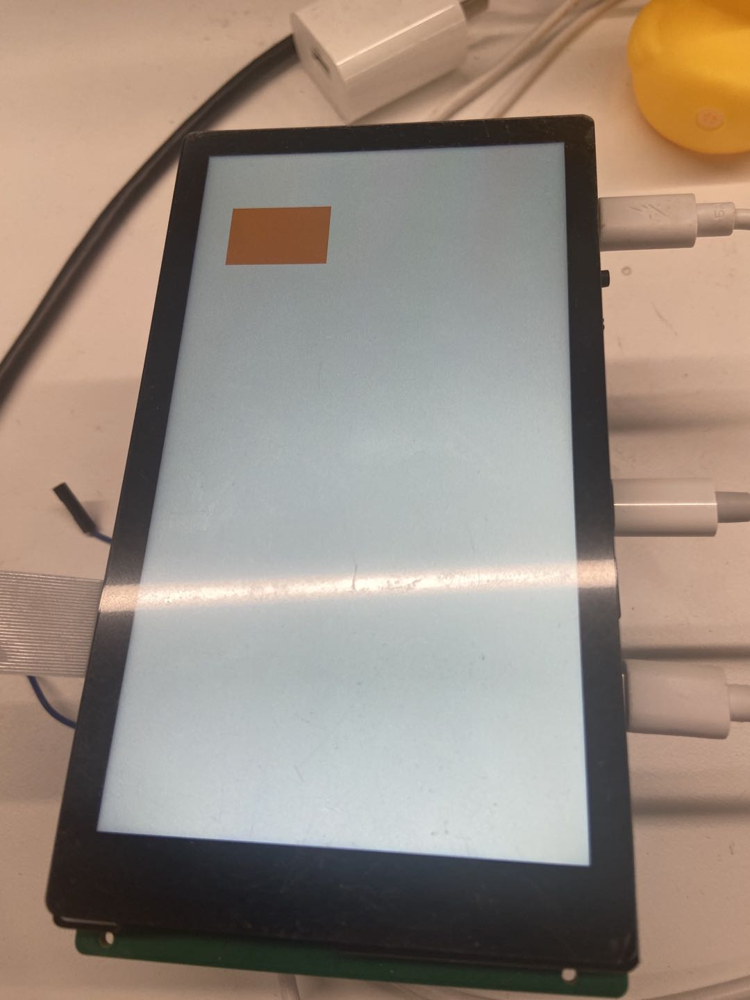
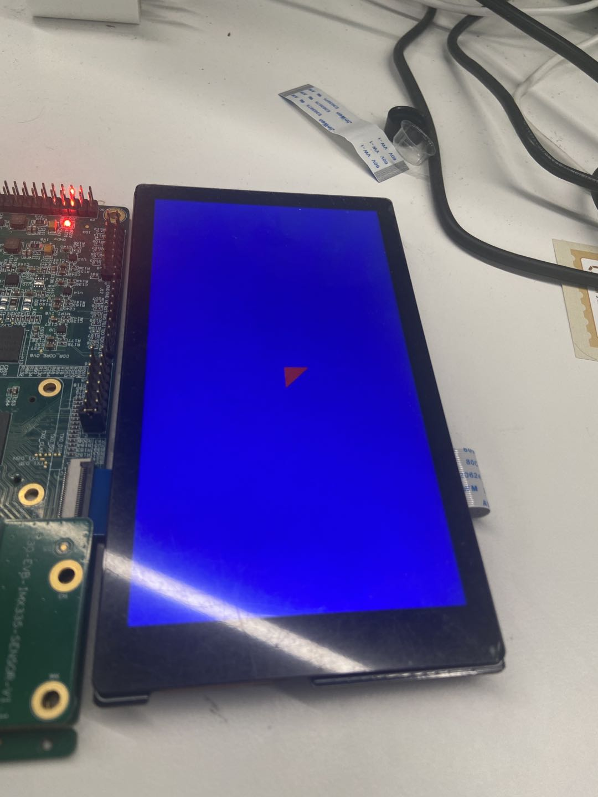
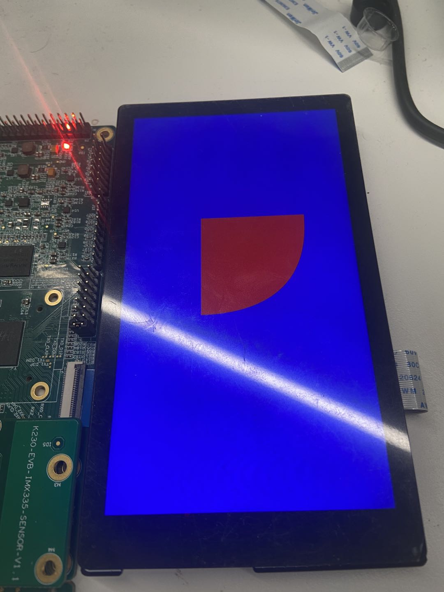

# K230 GPU 应用实战 - VGLite 绘制酷炫图形


版权所有©2023北京嘉楠捷思信息技术有限公司

<div style="page-break-after:always"></div>

## 免责声明

您购买的产品、服务或特性等应受北京嘉楠捷思信息技术有限公司（“本公司”，下同）及其关联公司的商业合同和条款的约束，本文档中描述的全部或部分产品、服务或特性可能不在您的购买或使用范围之内。除非合同另有约定，本公司不对本文档的任何陈述、信息、内容的正确性、可靠性、完整性、适销性、符合特定目的和不侵权提供任何明示或默示的声明或保证。除非另有约定，本文档仅作为使用指导参考。

由于产品版本升级或其他原因，本文档内容将可能在未经任何通知的情况下，不定期进行更新或修改。

## 商标声明

、“嘉楠”和其他嘉楠商标均为北京嘉楠捷思信息技术有限公司及其关联公司的商标。本文档可能提及的其他所有商标或注册商标，由各自的所有人拥有。

**版权所有 © 2023北京嘉楠捷思信息技术有限公司。保留一切权利。**
非经本公司书面许可，任何单位和个人不得擅自摘抄、复制本文档内容的部分或全部，并不得以任何形式传播。

<div style="page-break-after:always"></div>

## 目录

[TOC]

## 前言

### 概述

本文档主要介绍使用K230 GPU 绘制矢量图形。

### 读者对象

本文档（本指南）主要适用于以下人员：

- 技术支持工程师
- 软件开发工程师

### 缩略词定义

| 简称 | 全称                  |
|------|-----------------------|
| GPU  | Graphics Process Unit |
| SVG | Scalable Vector Graphics |
| DRM | Direct Rendering Manager |

### 修订记录

| 文档版本号 | 修改说明 | 修改者     | 日期       |
| ---------- | -------- | ---------- | ---------- |
| V1.0       | 初版     | 黄子懿 | 2023-06-20 |

## 概念介绍

### 矢量图基础

矢量图形是用点、直线或者多边形等基于数学方程的几何图元表示的图像，矢量图形与使用像素表示图像的位图不同，可以无限放大而不失真。SVG是一种典型的矢量图格式，其本身是XML文本文件，描述各种图元的位置，通过浏览器打开即可看到渲染后的效果，如果你完全不了解 K230 GPU 使用的 VGLite API，可以把他看成是一个弱化版的 SVG。

K230 GPU 支持多种二维图元

- 直线
- 二次贝塞尔曲线
- 三次贝塞尔曲线
- 圆曲线（当然也可以用三次贝塞尔曲线拟合）

注意：**这些图形都是线条，GPU 不能直接绘制线条，只能绘制由这些线条围成的闭合图形。**

### GPU 基础

在 K230 SDK 的小核 Linux 上，主要通过调用 VGLite API 来与 GPU 交互。VGLite 内部会维护一个 GPU 的命令队列，当需要完成绘制，或者队列满时会提交到 GPU 硬件进行渲染。命令队列的长度默认为65536，可以调用 `vg_lite_set_command_buffer_size` 函数进行修改。

注意：**VGLite API 不支持在多线程上下文中使用，如果你的应用程序使用了多线程，请确保只有一个线程会使用VGLite API**。

K230 GPU 是一个 memory-to-memory 设备，本身不具备显示输出能力，如果需要显示可以与 DRM 配合使用。

## 使用 VGLite API

### 开发环境准备

VGLite API 主要包含两个部分，头文件和库文件，其中头文件的位置在

```text
<K230 SDK>/src/little/buildroot-ext/package/vg_lite/inc/vg_lite.h
```

将 K230 SDK 完整编译后，库文件会放在

```text
<K230 SDK>/output/k230_evb_defconfig/little/buildroot-ext/target/usr/lib/libvg_lite.so
```

#### make

将代码的源文件放到 `src` 目录下，创建一个 Makefile 并将如下内容粘贴进去即可使用`make`命令进行构建，构建完成后将在 Makefile 同级目录下生成可执行文件，将其拷贝到小核 linux 上运行即可，也可以使用 `make install` 将其拷贝到 K230 SDK，再到 K230 SDK 目录下构建镜像，再烧录到 SD 卡或 eMMC 启动。

```Makefile
K230SDK ?= /path/to/k230_sdk
BIN := test-vglite

CC := "$(K230SDK)/toolchain/Xuantie-900-gcc-linux-5.10.4-glibc-x86_64-V2.6.0/bin/riscv64-unknown-linux-gnu-gcc"
CXX := "$(K230SDK)/toolchain/Xuantie-900-gcc-linux-5.10.4-glibc-x86_64-V2.6.0/bin/riscv64-unknown-linux-gnu-g++"

CFLAGS += -I"$(K230SDK)/src/little/buildroot-ext/package/vg_lite/inc" -I"$(K230SDK)/output/k230_evb_defconfig/little/buildroot-ext/host/riscv64-buildroot-linux-gnu/sysroot/usr/include"
CFLAGS += -L"$(K230SDK)/output/k230_evb_defconfig/little/buildroot-ext/target/usr/lib"
CFLAGS += -lvg_lite -lvg_lite_util -ldrm
CFLAGS += -Wall -g

CXXFLAGS := $(CFLAGS)

SRCDIR := ./src
OBJDIR := ./objs
SRCS := $(wildcard $(SRCDIR)/*.c) $(wildcard $(SRCDIR)/*.cpp)
OBJS := $(patsubst $(SRCDIR)/%.c,$(OBJDIR)/%.o,$(filter %.c, $(SRCS))) \
        $(patsubst $(SRCDIR)/%.cpp,$(OBJDIR)/%.o,$(filter %.cpp, $(SRCS)))
DEPS := $(patsubst $(SRCDIR)/%.c,$(OBJDIR)/%.d,$(filter %.c, $(SRCS))) \
        $(patsubst $(SRCDIR)/%.cpp,$(OBJDIR)/%.d,$(filter %.cpp, $(SRCS)))

all: $(BIN)

$(OBJDIR):
	mkdir -p $(OBJDIR)

$(BIN): $(OBJS)
	$(CXX) $(CXXFLAGS) $(OBJS) -o $@

$(OBJDIR)/%.o: $(SRCDIR)/%.c | $(OBJDIR)
	$(CC) $(CFLAGS) -MMD -c $< -o $@

$(OBJDIR)/%.o: $(SRCDIR)/%.cpp | $(OBJDIR)
	$(CXX) $(CXXFLAGS) -MMD -c $< -o $@

-include $(DEPS)

clean:
	rm -rf $(OBJDIR) $(BIN)

install:
	cp $(BIN) "$(K230SDK)/output/k230_evb_defconfig/little/buildroot-ext/target/usr/bin"

uninstall:
	rm "$(K230SDK)/output/k230_evb_defconfig/little/buildroot-ext/target/usr/bin/$(BIN)"

.PHONY: all clean install

```

#### CMake

将代码的源文件放到 `src` 目录下，创建一个 `CMakeLists.txt` 文件并粘贴如下内容进去即可使用 cmake 构建。

```CMakeLists.txt
cmake_minimum_required(VERSION 3.0)
project(test-vglite)
set(K230SDK /path/to/k230_sdk)

set(CMAKE_C_COMPILER "${K230SDK}/toolchain/Xuantie-900-gcc-linux-5.10.4-glibc-x86_64-V2.6.0/bin/riscv64-unknown-linux-gnu-gcc")
set(CMAKE_CXX_COMPILER "${K230SDK}/toolchain/Xuantie-900-gcc-linux-5.10.4-glibc-x86_64-V2.6.0/bin/riscv64-unknown-linux-gnu-g++")
set(CMAKE_C_FLAGS "-Wall")
set(CMAKE_CXX_FLAGS "-Wall")

include_directories(
    "$(K230SDK)/output/k230_evb_defconfig/little/buildroot-ext/host/riscv64-buildroot-linux-gnu/sysroot/usr/include"
    "$(K230SDK)/src/little/buildroot-ext/package/vg_lite/inc"
)

link_directories("${K230SDK}/output/k230_evb_defconfig/little/buildroot-ext/target/usr/lib")
link_libraries(vg_lite vg_lite_util drm)

file(GLOB SOURCES "src/*.c" "src/*.cpp")

add_executable(${PROJECT_NAME} ${SOURCES})

install(TARGETS ${PROJECT_NAME} DESTINATION "$(K230SDK)/output/k230_evb_defconfig/little/buildroot-ext/target/usr/bin")

```

### 显示

K230 EVB 有一个1080x1920的显示屏，在小核linux上可以用 DRM 进行显示，让 GPU 驱动加载 DRM dumb buffer 可以减少内存拷贝，实现高效渲染。GPU+DRM 的相关代码可以参考 `vglite_drm` 这个 demo，读者可以将 `drm.c` 添加到自己的程序中。

需要注意截至 K230 SDK v0.8，linux 上的 DRM 驱动仍然**不能**独立工作，需要依赖大核对 SoC 视频输出模块的配置，可以通过在大核上执行 `sample_vo.elf 3` 来完成。

其次 DRM 的颜色格式枚举与 `vg_lite_buffer_format_t` 并不完全一致，例如 `VGLITE_BGRA8888` 表示的是红色在低8位，alpha在高8位的32位颜色，对应 DRM 中的 `DRM_FORMAT_ARGB8888`。



如图是 vglite_drm 运行后屏幕正确显示的颜色：R(255)G(128)B(16)

一般来说为了实现同步显示会需要两张 buffer 进行 ping-pong 交替显示，但是为了简化演示代码这里就只用了一张，读者可以自行实现垂直同步的双重缓冲区进行连续渲染。

## 绘图

### 一些准备

首先需要初始化 VGLite，调用 `vg_lite_init` 来完成，它有两个参数 `tessellation_width` 和 `tessellation_height`，用于渲染窗口的大小，越大的话效率越高，如果为0则表示不使用矢量绘制功能，只能 BLIT，通常会设置为最大 buffer 的大小。

渲染需要 buffer，可以从 DRM dumb 导入，像下面这样

```c
vg_lite_buffer_t buffer;
int buf_fd;
memset(&buffer, 0, sizeof(buffer));
buf_fd = drm_get_dmabuf_fd(0);
if (buf_fd < 0) {
    perror("get fd");
    return buf_fd;
}
memset(&buffer, 0, sizeof(buffer));
buffer.width = width;
buffer.height = height;
buffer.format = VG_LITE_ARGB8888;
buffer.stride = buffer.width * 4;
if (vg_lite_from_dma_buf(buf_fd, &buffer.address)) {
    perror("import dma-buf");
    return -1;
}
```

也可以从 GPU 驱动分配离屏 buffer，像下面这样

```c
vg_lite_buffer_t buffer;
memset(&buffer, 0, sizeof(buffer));
buffer.width = width;
buffer.height = height;
buffer.format = VG_LITE_ARGB8888;
if (vg_lite_allocate(&buffer)) {
    return -1;
}
```

显然分配离屏 buffer 更简单，只需要配置分辨率和像素格式即可，而从 DRM dumb 导入还需要自己计算 stride(一行的字节数量)，当然从 DRM dumb 导入的好处就是可以直接用于显示，当然从驱动分配的 buffer 也可以导入到 DRM 进行显示。

### 多边形

有 buffer 就可以开始绘制了。多边形由多条直线组成，以三角形为例，首先需要确定三角形三个顶点的坐标，例如`(0,0) (0,1) (1,0)`，整个过程如下

1. 将画笔移动到`(0,0)`
1. 画一条线到`(0,1)`
1. 画一条线到`(1,0)`
1. 画一条线到`(0,0)`
1. 闭合图形

查阅K230 GPU API参考可以看到移动的操作码是2，直线的操作码是4，闭合路径的操作码是0，使用第一种数据格式，可以构造 `path_data` 数组如下

```c
uint8_t path_data[] = {
    2, 0, 0, // 移动到 (0,0)
    4, 0, 1, // 直线到 (0,1)
    4, 1, 0, // 直线到 (1,0)
    4, 0, 0, // 直线到 (0,0)
0};
```

只有 path_data 还是不够的，渲染需要的参数是 path，path 中除了 path_data 外还包含数据格式等信息，数据的格式可以指定为以下几种：

1. 8bit 有符号整数
1. 16bit 有符号整数
1. 32bit 有符号整数
1. 32bit 浮点数

从上到下性能依次递减，不过即使是8bit有符号整数也不意味着只能覆盖-128到127的像素范围，因为还需要矩阵变换来计算最终坐标。

现在构造 path，并绘制到 buffer

```c
vg_lite_path_t path = {
    .bounding_box = {0., 1., 1., 0.}, // 图形的包围盒
    .quality = VG_LITE_HIGH, // 渲染质量
    .format = VG_LITE_S8, // 考虑到坐标很简单，所以 8bit 足够
    .uploaded = 0, // 路径没有被上传过 GPU，所以用0
    .path_length = sizeof(path_data), // 路径数据长度，以字节为单位
    .path = path_data, // 路径数据就放在这了
    .path_changed = 1, // 用来表示路径被更新过
    .pdata_internal = 0 // 表示路径数据不是由驱动分配的
};
```

有了上面那些变量后就可以执行渲染了，步骤如下

1. 将 buffer 清空，即用一个单色填充，可以使用 `vg_lite_clear` 来完成
1. 一个变换矩阵，关于矩阵可以参考仿射变换有关的内容，这里直接使用一个缩放矩阵，将图像放大100倍，这样最终长度为1的直线在图像中会使用100个像素
1. 调用 `vg_lite_draw` 来将 path “渲染”到 buffer
1. 最后，使用 `vg_lite_finish` 提交渲染

为了方便错误处理，使用 `CHECK_ERROR` 宏来包裹返回 `vg_lite_error_t` 的函数

```c
vg_lite_matrix_t matrix;
CHECK_ERROR(vg_lite_clear(&buffer, NULL, 0xffff0000)); // 使用蓝色填充整个 buffer
vg_lite_identity(&matrix); // 初始化为单位矩阵
vg_lite_translate(buffer.width / 2., buffer.height / 2., &matrix); // 移动到 buffer 中间位置
vg_lite_scale(100., 100., &matrix); // x y 方向都放d大100倍
CHECK_ERROR(vg_lite_draw(
    &buffer, &path,
    VG_LITE_FILL_NON_ZERO, //  填充规则，像素只要被覆盖就会被绘制
    &matrix,
    VG_LITE_BLEND_NONE, // 颜色混合规则，None 表示忽略透明度直接覆盖
    0xff0000ff // RGBA 颜色，这个值表示不透明的红色
));
CHECK_ERROR(vg_lite_finish()); // 提交到 GPU
```

完整的参考代码可以在 vglite_drm 中查看，下面是绘制出来的效果。



可以很容易地发现，坐标系是以右为x正方向，以下为y正方向，这也是 SVG 所使用的坐标系。

需要注意的是，我刚才说到 `vg_lite_draw` 时“渲染”是打了引号的，因为并没有真的渲染，只是写入渲染指令，最终渲染需要调用 `vg_lite_finish`，这样对性能是有好处的，实际使用中可以多次调用 `vg_lite_draw`，再最后实际显示前再执行 `vg_lite_finish`，因为 `vg_lite_finish`是系统调用，存在一定开销，而 `vg_lite_draw` 不是，可以执行得很快。

当渲染完成后，可以将结果显示到屏幕或者保存为图片，需要注意保存图片时是用 CPU 来读取数据的，所以需要确保 `vg_lite_buffer_t::memory` 可读，如果读者使用上面 DRM 的代码来创建 `vg_lite_buffer_t`，那么没有映射 DRM dumb 的话是没法读取的。

### 曲线

K230 GPU 支持三种曲线，分别是

1. 二次贝塞尔曲线
1. 三次贝塞尔曲线
1. 椭圆曲线

当然椭圆曲线可以用三次贝塞尔曲线拟合，本质上可以看成是同样的曲线类型，与绘制多边形的情况一样，只需要修改操作码和数据即可。

下面我们尝试将刚才画的三角形的底边改为二次贝塞尔曲线，并将中点放在`(1,1)`处，绘制一个近似圆角的图案，将上面 `path_data` 改为

```c
uint8_t path_data[] = {
    2, 0, 0,
    4, 0, 1,
    6, 1, 1, 1, 0, // 二次贝塞尔曲线，控制点(1,1)，画到(1,0)
    4, 0, 0,
0};
```

当然，为了更好地观察这条曲线，我们将缩放倍数开得更大一些，比如500倍，同时将位移也改小一些，使得图案近似在屏幕中央

```c
vg_lite_translate(buffer.width / 2., buffer.height / 2., &matrix);
vg_lite_scale(500., 500., &matrix);
```

最后绘制的图案就像下面这样了



### 位图填充

当不满足于单色的填充时，可以使用位图图来填充，位图文件会被渲染到目标位置，当然位图也得是 `vg_lite_buffer_t` 才行，如果需要从本地的 JPEG/PNG 等文件中加载，那么建议使用离屏 buffer 来存储像素内容，用 `vg_lite_blit` 或者 `vg_lite_draw_pattern` 来渲染。

### 渐变

对于 VGLite 的实现来说，渐变本身是一种特殊的位图填充，`linear_grad` 相关函数会分配一个 1x256 的 buffer 进行 BLIT，当然使用者可以不关心上面的细节，拿来用就好，参考 `linearGrad` demo，具体过程可以分为以下几个调用

1. `vg_lite_init_grad` 初始化一个渐变
1. `vg_lite_set_grad` 设置颜色和止点，最多支持16个止点
1. `vg_lite_update_grad` 更新渐变
1. `vg_lite_get_grad_matrix` 获得渐变的变换矩阵指针
1. 对变换矩阵进行调整，例如旋转和缩放，默认长度为256像素从左到右，如果需要其他方向的渐变需要用这个矩阵来操作
1. `vg_lite_draw_gradient` 绘制渐变
