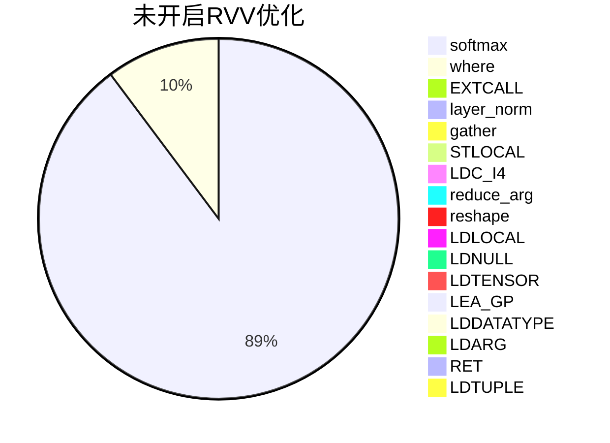
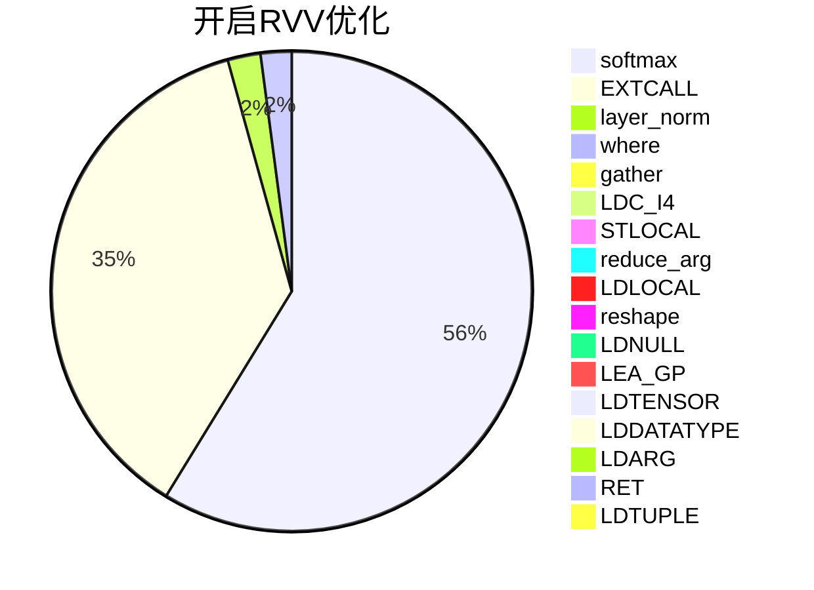
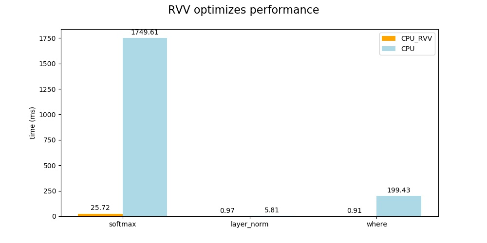

# K230 RVV优化性能说明


版权所有©2023北京嘉楠捷思信息技术有限公司

<div style="page-break-after:always"></div>

## 免责声明

您购买的产品、服务或特性等应受北京嘉楠捷思信息技术有限公司（“本公司”，下同）及其关联公司的商业合同和条款的约束，本文档中描述的全部或部分产品、服务或特性可能不在您的购买或使用范围之内。除非合同另有约定，本公司不对本文档的任何陈述、信息、内容的正确性、可靠性、完整性、适销性、符合特定目的和不侵权提供任何明示或默示的声明或保证。除非另有约定，本文档仅作为使用指导参考。

由于产品版本升级或其他原因，本文档内容将可能在未经任何通知的情况下，不定期进行更新或修改。

## 商标声明

、“嘉楠”和其他嘉楠商标均为北京嘉楠捷思信息技术有限公司及其关联公司的商标。本文档可能提及的其他所有商标或注册商标，由各自的所有人拥有。

**版权所有 © 2023北京嘉楠捷思信息技术有限公司。保留一切权利。**
非经本公司书面许可，任何单位和个人不得擅自摘抄、复制本文档内容的部分或全部，并不得以任何形式传播。

<div style="page-break-after:always"></div>

## 目录

[toc]

<div style="page-break-after:always"></div>

## 前言

### 概述

本文档主要介绍RVV对于模型推理性能的影响。

### 读者对象

本文档（本指南）主要适用于以下人员：

- 技术支持工程师
- 软件开发工程师

### 修订记录

| 文档版本号 | 修改说明 | 修改者 | 日期       |
| ---------- | -------- | ------ | ---------- |
| V1.0       | 初版     | 杨浩琪 | 2023/08/04 |

## 1. 概述

近些年AI领域的快速发展，衍生出各种各样的神经网络模型，不断出现新的算子。但是AI芯片的迭代周期相比AI模型会长很多，这些新出现的算子多数不能直接使用AI芯片进行推理加速，同时旧的算子中也有一部分不适合使用AI芯片进行推理加速。因此CPU成为这部分算子的执行载体，这也意味着CPU的性能会成为模型部署时影响最终性能的一个因素，而RVV扩展就是RISC-V CPU提升性能的一个重要手段。K230 中采用的玄铁C908双核处理器中大核具备RVV1.0扩展的特性，能够大幅度提升CPU算子推理时的表现。

K230进行模型推理时需要使用 `.kmodel`格式的模型，`.kmodel`是由[nncase](https://github.com/kendryte/nncase) 对 `ONNX`和 `TFLite`模型进行编译后的模型格式，适用于本公司及相关合作企业生产的开发板。nncase支持目前常见的神经网络算子，但是部分算子无法通过K230进行推理加速，这部分算子只能使用CPU进行推理。

## 2. RVV应用场景

目前研究应用最广泛的神经网络 `Transformer`中，模型结构与 `CNN`存在较大差异，很多基于 `CNN`设计的AI芯片无法完全对 `Transformer`进行加速。以下为 `Transformer`中 `Decoder`模型在开启RVV优化和不开启RVV优化的算子执行情况。

### 2.1 未开启RVV优化

| stackvm tensor op | count | time consumption(ms) | percentage(%) |
| ----------------- | ----- | -------------------- | ------------- |
| softmax           | 5     | 1749.61              | 88.6574       |
| where             | 4     | 199.432              | 10.1058       |
| EXTCALL           | 65    | 16.099               | 0.815779      |
| layer_norm        | 7     | 5.81                 | 0.294408      |
| gather            | 2     | 0.393                | 0.0199144     |
| STLOCAL           | 212   | 0.391                | 0.019813      |
| LDC_I4            | 241   | 0.388                | 0.019661      |
| reduce_arg        | 1     | 0.336                | 0.017026      |
| reshape           | 26    | 0.281                | 0.014239      |
| LDLOCAL           | 149   | 0.26                 | 0.0131749     |
| LDNULL            | 106   | 0.166                | 0.00841166    |
| LDTENSOR          | 29    | 0.103                | 0.00521929    |
| LEA_GP            | 58    | 0.097                | 0.00491525    |
| LDDATATYPE        | 29    | 0.07                 | 0.00354709    |
| LDARG             | 5     | 0.008                | 0.000405381   |
| RET               | 1     | 0.004                | 0.000202691   |
| LDTUPLE           | 1     | 0.003                | 0.000152018   |
| total             | 941   | 1973.45              | 100           |

### 2.2 开启RVV优化

| stackvm tensor op | count | time consumption(ms) | percentage(%) |
| ----------------- | ----- | -------------------- | ------------- |
| softmax           | 5     | 25.722               | 55.6175       |
| EXTCALL           | 65    | 16.179               | 34.9831       |
| layer_norm        | 7     | 0.967                | 2.0909        |
| where             | 4     | 0.912                | 1.97198       |
| gather            | 2     | 0.39                 | 0.84328       |
| LDC_I4            | 241   | 0.386                | 0.834631      |
| STLOCAL           | 212   | 0.379                | 0.819495      |
| reduce_arg        | 1     | 0.34                 | 0.735167      |
| LDLOCAL           | 149   | 0.259                | 0.560024      |
| reshape           | 26    | 0.243                | 0.525428      |
| LDNULL            | 106   | 0.17                 | 0.367583      |
| LEA_GP            | 58    | 0.103                | 0.222712      |
| LDTENSOR          | 29    | 0.103                | 0.222712      |
| LDDATATYPE        | 29    | 0.076                | 0.164331      |
| LDARG             | 5     | 0.011                | 0.0237848     |
| RET               | 1     | 0.005                | 0.0108113     |
| LDTUPLE           | 1     | 0.003                | 0.00648677    |
| total             | 941   | 46.248               | 100           |

### 2.3 性能分析及说明

上述模型推理中，K230的KPU单元不支持对 `softmax`、`layer_norm`、`where`、`gather`，`reduce_arg`，`reshape` 进行硬件推理加速，因此需要使用C908实现推理，目前已经完成了对 `softmax`、`layer_norm`、`where`的RVV优化，性能提升明显。

以下为使用RVV优化前后各算子在模型推理时间中的占比图。





以下为使用RVV优化前后相关算子的性能对比。



从以上的对比结果可以看出，在开启RVV优化后能够极大的提升CPU算子的推理性能，缩短整个模型的推理时间(1973--> 46)ms，RVV优化后占据大部分时间的 `softmax`算子时间减少到25ms，`layer_norm`算子时间减少到0.97ms，`where`算子时间减少到0.91ms，整个模型的推理时间缩短了97.6%，在实际模型部署时具有很高的应用价值。

### 2.4 RVV优化示例

#### 2.4.1 RVV代码

具体实现请参考 `nncase`中的[layer_norm](https://github.com/kendryte/nncase/blob/master/src/Native/src/kernels/stackvm/optimized/riscv64/layer_norm.cpp)，需要具备一定RV指令和V扩展指令知识。

`layer_norm`的计算公式如下：

```plaintext
y= (x−E[x])/sqrt(Var[x]+ϵ)∗γ+β
```

整体计算流程详见 `layernorm_impl`函数，为了代码具备更高的可读性，该流程中将RVV优化代码拆分成三个部分：

1. 计算 `E[x]`，具体请参考 `get_mean`函数。
1. 计算 `Var[x]`，具体请参考 `get_var`函数。
1. 按照上述公式进行layer_norm的计算，具体请参考 `layer_norm_update1`函数。

由于乘法相比除法耗时更短，第3步的计算中进行了公式变换，使用 `rsqrt`代替 `sqrt`，再用乘法替代除法。

#### 2.4.2 核心代码说明

以下为 `get_mean`中核心代码的说明，这段代码实现了对a1处数组的循环加载求和,求和结果存储在v0,最后求平均值保存在ret中。它利用RVV的向量加载,向量累加指令来实现求和,从而提高计算性能。

```plaintext
"vle32.v v8, (a1);"   // 加载a1地址处的32bit向量到v8寄存器
"sub a0,a0, t0;"      // a0 -= t0,用于循环控制计数
"slli t1, t0, 2;"     // t1 = t0 << 2,因为每个float32是4字节,所以地址增加4*t0
"vfredsum.vs v0,v8,v0;"  // v0 += v8,向量累加求和到v0

"add a1, a1, t1;"      // a1 += t1,更新加载地址
"bnez a0, XXXXXX%=;"   // 如果a0!=0,跳转至循环开始地址
"vfmv.f.s f0, v0;"     // 把v0向量累加结果移动到f0
"fcvt.s.w f1, %[avl];"  // 将avl转换为float保存到f1 
"fdiv.s %[ret], f0, f1;" // ret = f0/f1,即求平均值
```

#### 2.4.3 添加RVV算子流程

以下流程中路径均以[nncase](https://github.com/kendryte/nncase)作为根目录

1. 函数声明：src/Native/src/kernels/stackvm/optimized/opt_ops.h
1. 算子实现：
   - 通用优化   src/Native/src/kernels/stackvm/optimized
   - x86优化   src/Native/src/kernels/stackvm/optimized/x86_64
   - RVV优化  src/Native/src/kernels/stackvm/optimized/riscv64
1. 逻辑调用：src/Native/src/kernels/stackvm/tensor_ops.cpp
1. 修改CMakeLists：src/Native/src/kernels/stackvm/optimized/CMakeLists.txt
   - 通用优化：15行增加源文件名
   - 特定平台优化：44行增加源文件名

### 2.5 tips

如果遇到尚未支持RVV优化的算子，且需要进行支持的，欢迎在[nncase提issue和PR](https://github.com/kendryte/nncase/issues)。
