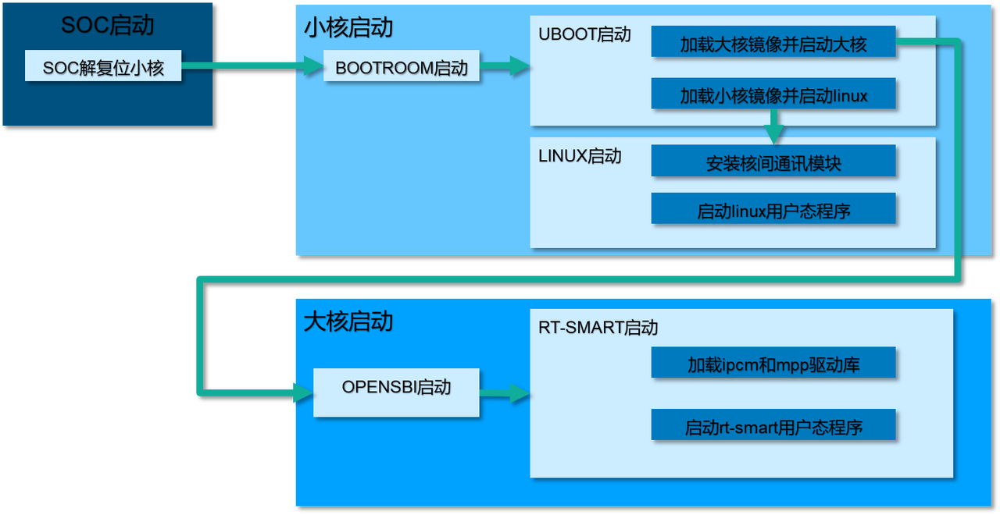
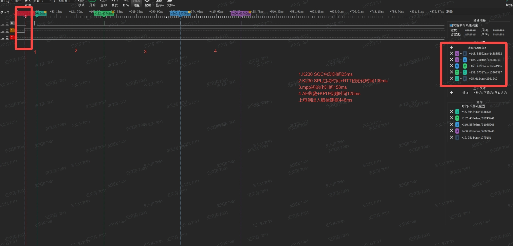
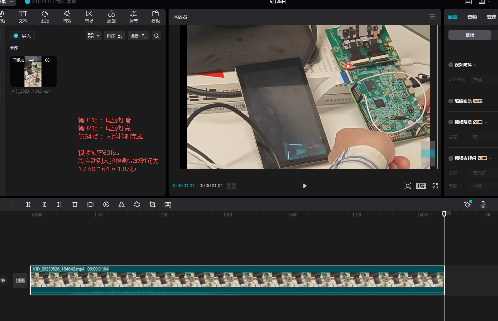
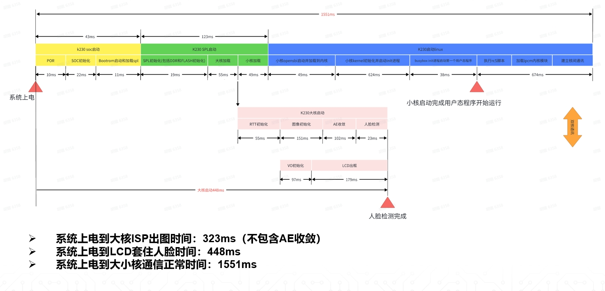

# K230 启动优化指南


版权所有©2023北京嘉楠捷思信息技术有限公司

<div style="page-break-after:always"></div>

## 免责声明

您购买的产品、服务或特性等应受北京嘉楠捷思信息技术有限公司（“本公司”，下同）及其关联公司的商业合同和条款的约束，本文档中描述的全部或部分产品、服务或特性可能不在您的购买或使用范围之内。除非合同另有约定，本公司不对本文档的任何陈述、信息、内容的正确性、可靠性、完整性、适销性、符合特定目的和不侵权提供任何明示或默示的声明或保证。除非另有约定，本文档仅作为使用指导参考。

由于产品版本升级或其他原因，本文档内容将可能在未经任何通知的情况下，不定期进行更新或修改。

## 商标声明

、“嘉楠”和其他嘉楠商标均为北京嘉楠捷思信息技术有限公司及其关联公司的商标。本文档可能提及的其他所有商标或注册商标，由各自的所有人拥有。

**版权所有 © 2023北京嘉楠捷思信息技术有限公司。保留一切权利。**
非经本公司书面许可，任何单位和个人不得擅自摘抄、复制本文档内容的部分或全部，并不得以任何形式传播。

<div style="page-break-after:always"></div>

## k230启动顺序

k230整体启动流程如下图所示



## 启动时间测量

### 软件测量

k230的CPU核为RISCV，用户可以在大小核的任意软件内使用以下代码获取当前时间。

``` C
uint64_t perf_get_smodecycles(void)
{
    uint64_t cnt;
    __asm__ __volatile__(
        "rdcycle %0" : "=r"(cnt)
    );
    return cnt;
}
```

获取的值为当前CPU运行的时钟周期数，除以CPU的频率即为当前运行的时间。k230_sdk默认大核的时钟频率为1.6GHz，小核的时钟频率为800MHz。

### 硬件测量

在需要测量的点加入GPIO的边沿变化，通过逻辑分析仪或示波器可获得更精准的时间。
可通过K230_EVB_LPDDR3_UNSIP板J1的14脚检测开发板上电信号(需要用跳线帽短接15、16脚)。


### 外部观测

视频录制整个系统启动过程，板载电源灯亮代表系统上电，VO显示VI图像代表视频pipeline完成建立且可以显示。出现画框框住人脸表示完成人脸识别。


## 系统裁剪

从上一节的图中看出bootrom启动后第一步就是要加载大小核的镜像，所以优化启动时间的第一步就是要先裁剪大小核镜像。

### 小核裁剪

#### linux镜像裁剪

请参考文档[K230_内存优化指南.md](K230_内存优化指南.md)中的Linux模块删除章节。

#### rootfs裁剪

删除rootfs中不会被使用的程序或库，对于门锁POC项目主要包括如下内容，裁剪过程参考文件`k230_sdk/board/k230_evb_doorlock/gen_image_script/gen_doorlock_image.sh`

``` shell
rm -rf usr/bin/fio;
rm -rf usr/bin/lvgl_demo_widgets;
rm -rf usr/bin/ssh*
rm -rf usr/bin/sftp
rm -rf usr/bin/lat*
rm -rf usr/bin/hostapd_cli
rm -rf usr/bin/*test*
rm -rf usr/bin/k230_timer_demo
rm -rf usr/bin/gpio_keys_demo
rm -rf lib/modules/5.10.4+/kernel/drivers/gpu/
rm -rf lib/tuning-server;
rm -rf usr/bin/stress-ng  bin/bash usr/sbin/sshd usr/bin/trace-cmd usr/bin/lvgl_demo_widgets;
```

#### 文件系统选型

当前nor flash支持的文件系统有ubifs和jffs2，门锁POC默认使用ubifs的镜像。他们都是压缩文件系统，ubifs的读写性能要强于jffs2。注意使用ubifs文件系统时，系统下电前，小核需要先输入halt命令，再进行断电否则可能会对文件系统造成破坏

### 大核裁剪

#### 大核应用程序裁剪

strip会去掉应用程序与库的符号信息和调试信息，大大减少空间占用。编译门锁POC时，会在`k230_sdk/board/k230_evb_doorlock/gen_image_script/gen_doorlock_image.sh`中裁剪大核应用程序。

``` shell
/opt/toolchain/riscv64-linux-musleabi_for_x86_64-pc-linux-gnu/bin/riscv64-unknown-linux-musl-strip fastboot_app.elf;
```

### 裁剪效果

门锁POC项目默认使用的是裁剪后的镜像，各镜像大小如下

- 小核rootfs.ubifs 11M
- 小核系统压缩镜像linux_system.bin(opensbi + image + dtb) 3.8M
- 大核系统压缩镜像rtt_system.bin(opensbi + rtthread.bin) 1.2M
- 大核应用程序fastboot_app.elf 11M
- 大核AI模型 mbface.kmodel + retinaface.kmodel 1.9M

## uboot启动优化

k230_sdk针对uboot代码，集成了快启配置，uboot本身的运行分为俩段SPL+UBOOT，当使能快启时SPL会负责加载后续的大小核镜像并运行，当没有使能快启时，SPL会加载后半段的UBOOT代码运行。代码位置`little/uboot/board/canaan/common/k230_spl.c`

``` C
int spl_board_init_f(void)
{
    int ret = 0;
    device_disable();
    g_bootmod = sysctl_boot_get_boot_mode();
    ddr_init_training();
    memset(__bss_start, 0, (ulong)&__bss_end - (ulong)__bss_start);
    if(quick_boot()){//默认快起
        //record_boot_time_info("ls");
        ret += k230_img_load_boot_sys(BOOT_SYS_AUTO);
    }
    ret = k230_img_load_boot_sys(BOOT_SYS_UBOOT);
    if(ret )
        printf("uboot boot failed\n");

    return ret;
}
```

quick_boot的返回结果受uboot的环境变量quick_boot影响，用户可手动在uboot下通过setenv命令配置，也可以在k230_sdk中通过`make menuconfig-->board configuration`配置quick_boot。

## linux启动优化

### 删除内核启动打印

在uboot的默认环境变量配置中，把flash启动时的bootargs中的fw_devlink设置为off，代码文件位置为`src/little/uboot/board/canaan/common/k230_img.c`。linux启动时控制台不再打印启动日志，进入linux命令行后，可以通过dmesg查看内核启动日志。

``` C
char *board_fdt_chosen_bootargs(void){
    char *bootargs = env_get("bootargs");
    if(NULL == bootargs) {
        if(g_bootmod == SYSCTL_BOOT_SDIO0)
            bootargs = "root=/dev/mmcblk0p3 loglevel=8 rw rootdelay=4 rootfstype=ext4 console=ttyS0,115200 crashkernel=256M-:128M earlycon=sbi";
        else if(g_bootmod == SYSCTL_BOOT_SDIO1)
            bootargs = "root=/dev/mmcblk1p3 loglevel=8 rw rootdelay=4 rootfstype=ext4 console=ttyS0,115200 crashkernel=256M-:128M earlycon=sbi";
        else  if(g_bootmod == SYSCTL_BOOT_NORFLASH)
            //bootargs = "root=/dev/mtdblock9 rw rootwait rootfstype=jffs2 console=ttyS0,115200 earlycon=sbi";
            //bootargs = "ubi.mtd=9 rootfstype=ubifs rw root=ubi0_0 console=ttyS0,115200 earlycon=sbi";
            bootargs = "ubi.mtd=9 rootfstype=ubifs rw root=ubi0_0 console=ttyS0,115200 earlycon=sbi fw_devlink=off quiet";
    }
    //printf("%s\n",bootargs);
    return bootargs;
```

### 将耗时的驱动编为模块

门锁POC需要用到usb驱动用来连接网络，以及mmc驱动用来导入人脸数据。这俩个驱动probe较为耗时，且会触发外设驱动的probe流程，所以需要将这些驱动编译成模块，内核启动后会使用modprobe机制自动加载他们。config配置可参考`k230_sdk/src/little/linux/arch/riscv/configs/k230_evb_doorlock_defconfig`

``` shell
CONFIG_MMC=m
# CONFIG_MMC_TEST is not set
CONFIG_MMC_SDHCI=m
CONFIG_MMC_SDHCI_PLTFM=m
CONFIG_MMC_SDHCI_OF_KENDRYTE=m
CONFIG_USB=y
CONFIG_USB_ANNOUNCE_NEW_DEVICES=y
CONFIG_USB_STORAGE=y
CONFIG_USB_DWC2=m
CONFIG_USB_TEST=m
CONFIG_USB_GADGET=m
CONFIG_USB_SNP_UDC_PLAT=m
CONFIG_USB_CONFIGFS=m
CONFIG_USB_CONFIGFS_MASS_STORAGE=y
CONFIG_USB_CONFIGFS_F_LB_SS=y
CONFIG_USB_CONFIGFS_F_UVC=y
```

### 应用程序启动优化

将应用程序的运行时间提前，修改根文件系统中的/etc/inittab文件，使其运行的第一个进程为我们需要率先启动的程序。例如在`k230_sdk/board/k230_evb_doorlock/inittab`文件中，系统第一个启动的进程为`sysinit:nice -n -20 /app/door_lock/ui/ui &`。这个initab文件在编译门锁镜像时，会替换调rootfs中原来的/etc/inittab文件。其中ui程序是门锁POC的小核应用程序

## 大核启动优化

### rt-smart启动

修改rt-smart内核源码，在shell线程建立前先运行一个init.sh脚本，在脚本中定义要运行的大核程序。代码位置`big/rt-smart/kernel/rt-thread/components/finsh/shell.c`

``` C
if(shell_thread_first_run) {
    shell_thread_first_run = 0;
    msh_exec("/bin/init.sh", 13);
    continue;
}
```

### 应用程序优化

以门锁poc为例:`k230_sdk/src/reference/business_poc/doorlock/big/`

应用程序可以通过多线程并行的方式初始化各设备。例如将核间通讯以及vo的初始化单独放在不同的线程中进行。

``` C
    pthread_create(&ipc_message_handle, NULL, ipc_msg_server, NULL);
    pthread_create(&exit_thread_handle, NULL, exit_app, NULL);
    pthread_create(&vo_thread_handle, NULL, sample_vo_thread, NULL);
```

## 其他优化

- k230内置了硬件解压单元，SDK编译的flash镜像为压缩镜像，uboot会使用硬件解压单元对后续的各大小核镜像进行解压，已提高加载速度。

## 优化效果

门锁POC的启动时间统计，该统计数据的测量时间为6月9日，与当前最新的sdk版本数据可能存在误差
