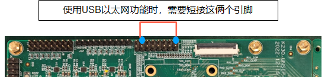
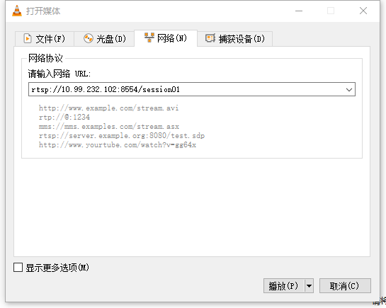

# K230 编码实战 - rtsp sever搭建和推流


版权所有©2023北京嘉楠捷思信息技术有限公司

<div style="page-break-after:always"></div>

## 免责声明

您购买的产品、服务或特性等应受北京嘉楠捷思信息技术有限公司（“本公司”，下同）及其关联公司的商业合同和条款的约束，本文档中描述的全部或部分产品、服务或特性可能不在您的购买或使用范围之内。除非合同另有约定，本公司不对本文档的任何陈述、信息、内容的正确性、可靠性、完整性、适销性、符合特定目的和不侵权提供任何明示或默示的声明或保证。除非另有约定，本文档仅作为使用指导参考。

由于产品版本升级或其他原因，本文档内容将可能在未经任何通知的情况下，不定期进行更新或修改。

## 商标声明

、“嘉楠”和其他嘉楠商标均为北京嘉楠捷思信息技术有限公司及其关联公司的商标。本文档可能提及的其他所有商标或注册商标，由各自的所有人拥有。

**版权所有 © 2023北京嘉楠捷思信息技术有限公司。保留一切权利。**
非经本公司书面许可，任何单位和个人不得擅自摘抄、复制本文档内容的部分或全部，并不得以任何形式传播。

<div style="page-break-after:always"></div>

## 1. 环境准备

### 1.1 硬件环境

- K230-USIP-LP3-EVB-V1.0/K230-UNSIP-LP3-EVB-V1.1
- Ubuntu PC 20.04
- Typec USB线 * 2。
  - 一根连接到UART0/3，用于串口收发，UART0对应小核，UART3对应大核。
  - 一根连接到DC:5V接口，用于供电。
- USB TypeC转以太网，连接到USB0。
- 网线一根
- SD卡(如果使用SD卡启动，或软件需要访问SD卡)
- 摄像头子板（IMX335，用于rtsp推音视频流）
- 耳机（用于语音对讲）
- 杜邦线一根，按下图连接USB0_OTG_EN和高电平



注意：音频对讲需要两套设备。

### 1.2 软件环境

- K230 SDK
- VLC播放器

### 1.3 运行准备

在EVB上执行rtsp程序需要启动网络服务，并保证PC和EVB板在同一个网段。

## 2. 源码介绍

### 2.1 源码位置

在SDK中包含的rtsp相关demo位于`k230_sdk/src/common/cdk/user/samples`目录下，其中

- `rtsp_demo`：语音推音视频流程序
- `rtsp_server`：语音对讲服务器端程序
- `backchannel_client`：语音对讲客户端程序

### 2.2 源码介绍

K230 SDK采用双核架构，小核运行linux系统，实现网络控制服务。大核运行RTT系统，实现对音视频硬件的控制。小核在启动过程中负责引导大核。大小核通过核间通信进行消息通信和内存共享。

小核网络服务移植了live源码，路径为`k230_sdk/src/common/cdk/user/thirdparty/live`
音频使用G711编码。
音视频推流中，视频默认最大分辨率与配置的sensor_type相关，默认最大分辨率为1920x1080。

#### 2.2.1 程序主要步骤

##### 2.2.1.1 音视频推流程序

1. `new StreamingPlayer`
   - 初始化核间通信。
   - 配置video buffer。
1. `InitVicap`：初始化摄像头。
1. `CreateSession`：
   - 创建server session。
   - 创建并开启音频输入通道，音频采样率为44.1k，采样宽度16bit。
   - 初始化音频编码，音频采用G711A编码。
   - 创建视频编码通道，使能IDR帧。
1. `Start`：
   - 开启视频编码通道并绑定到vo。
   - 开启视频编码通道，并将视频输入绑定到视频编码。
   - 开始音视频推流。

##### 2.2.1.2 语音对讲程序

1. `Init`：
   - 创建server session。
   - 初始化核间通信。
   - 配置video buffer。
   - 创建并开启音频输入通道，音频采样率为8k，采样宽度为16bit。
   - 创建音频编码通道，音频采用G711U编码。
   - 创建音频输出通道和音频解码通道，并将音频解码绑定到音频输出。
1. `Start`：
   - 开始推音频流。
   - 开启视频编码通道，并将视频输入绑定到视频编码。

## 3.程序执行

### 3.1 rtsp推音视频流

#### 3.1.1 参数说明

| 参数名 | 描述 |参数范围 | 默认值 |
|:--|:--|:--|:--|
| help | 打印命令行参数信息 | - | - |
| n | session个数 | `[1, 3]` | 1 |
| t | 编码类型 | h264、h265、mjpeg | h264 |
| w | 视频编码宽度 | `[640, 1920]` | 1280 |
| h | 视频编码高度 | `[480, 1080]` |720 |
| s | sensor类型| 查看camera sensor文档 | 7 |

sensor类型取值查看`k230_docs/zh/01_software/board/mpp/K230_Camera_Sensor适配指南.md`文档中关于k_vicap_sensor_type的描述

#### 3.1.2 编译程序

在`k230_sdk`目录下执行`make cdk-user`，在`k230_sdk/src/common/cdk/user/out/little/`目录下生成`rtsp_demo`

程序源码目录`k230_sdk/src/common/cdk/user/samples/rtsp_demo`

#### 3.1.3 运行程序

支持音视频码流同时推流到rtsp server上，其中通过`mapi venc&aenc`接口实现对音视频的编码；推流之后通过url进行拉取，目前支持两路url推拉流。

1. 在大核上执行：`cd /sharefs; ./sample_sys_init.elf`
1. 在小核上执行：`./rtsp_demo`
1. 小核上运行rtsp_demo后，会打印出形如：`rtsp://ip:8554/session0` 和 `rtsp://ip:8554/session01` 的url地址，可通过vlc拉取对应的流进行播放。
   vlc拉流方式：媒体->打开网络串流->在打开的窗口中输入对应的url。
   

### 3.2 语音对讲

用于实现音频数据的双向传输和处理。
语音对讲涉及到两端，两端均能实时采集编码发送音频数据到对端，同时也能接收对端来的音频数据进行解码和输出。
当前实现参照了ONVIF，在rtsp协议的基础上扩展backchannel，从而支持从client向server发送音频数据；下文使用server和client分别代指语音对讲的两端。

1. 音频码流格式为G711 mu-Law；
1. sever端实现了实时的音频采集编码和发送，以及通过backchannel接收来自client的音频数据进行解码和输出；
1. client端实现了音频码流的接收,解码和播放，以及实时采集音频，G711 mu-Law编码，并通过backchannel发送到server端
1. 仅支持一对一的对讲（仅支持一路backchannel）；
1. 不支持回声消除等处理（设备侧需要音频输出到耳机，不能使用外放speaker）；

#### 3.2.1 编译程序

在`k230_sdk`目录下执行`make cdk-user`，在`k230_sdk/src/common/cdk/user/out/little/`目录下生成`rtsp_server`和`backclient_test`

程序源码目录:
`k230_sdk/src/common/cdk/user/samples/rtsp_demo/rtsp_server`
`k230_sdk/src/common/cdk/user/samples/rtsp_demo/backchannel_client`

#### 3.2.2 rtsp_server参数说明

| 参数名 | 描述 |参数范围 | 默认值 |
|:--|:--|:--|:--|
| h | 打印命令行参数信息 | - | - |
| v | 是否创建video session | - | - |
| t | 编码类型 | h264、h265 | h265 |
| w | 视频编码宽度 | `[640, 1920]` | 1280 |
| h | 视频编码高度 | `[480, 1080]` |720 |
| b | 视频编码码率 | - | 2000 |
| a | 变声设置 | `[-12, 12]`| 0 |
| s | sensor类型| 查看camera sensor文档 | 7 |

sensor类型查看`k230_docs/zh/01_software/board/mpp/K230_Camera_Sensor适配指南.md`文档中关于k_vicap_sensor_type的描述

#### 3.2.3 运行程序

两块EVB连到同一个网段，一个作为server，一个作为client。大小核完全启动后。

server端运行如下命令：

- 在大核上执行：`cd /sharefs; ./sample_sys_init.elf`
- 在小核上执行：`cd /mnt; ./rtsp_server`（运行rtsp_server后，会打印出形如：`rtsp://<server_ip>:8554/BackChannelTest` 的url地址）

client端运行如下命令：

- 在大核上执行：`cd /sharefs; ./sample_sys_init.elf`
- 在小核上执行：`./backclient_test rtsp://<server_ip>:8554/BackChannelTest`）

backclient_test执行命令说明：`./backclient_test <rtsp_url> <out_type>`, 其中rtsp_url为rtsp地址，out_type为vo输出connect type，参看`k230_docs/zh/01_software/board/mpp/K230_视频输出_API参考.md`中关于k_connector_type的描述，out_type默认设置为0

## 4. 运行sharefs

大核的`sample_sys_init.elf`默认没有装载到大核。可以通过下面两中方式将其在大核运行。

1. 修改`k230_sdk/Makefile`中`mpp-apps`的编译脚本，在`cd -;`前增加如下命令，并在`k230_sdk`目录下执行`make rt-smart;make build-image`，生成的镜像文件中，在大核的`/bin`目录下即包含`sample_sys_init.elf`

    ```sh
    cp userapps/sample/elf/sample_sys_init.elf $(RTSMART_SRC_DIR)/userapps/root/bin/; \
    ```

1. 启动大小核之后，通过sharefs和tftp将可执行程序传输到EVB板上运行。
/sharefs用于在大小核之间共享文件，大小核均可以通过访问各自的/sharefs目录来实现共享文件系统的功能。大核的自身文件系统为只读模式。可以在小核将/sharefs目录mount到SD卡分区或者PC的nfs目录等，并可通过tftp实现文件传输功能。

    ```sh
    mount /dev/mmcblk1p4 /sharefs #将/sharefs mount到SD卡分区
    ```

    ```sh
    mount -t nfs -o nolock <ipaddr>:<nfs_path> /sharefs/ #将/sharefs mount到ipaddr的nfs_path目录
    ```

    tftp的命令如下：

    ```sh
    tftp -gr <filename> <ipaddr> #从ipaddr的主机上将文件<filename>传输到板卡上
    tftp -pl <filename> <ipaddr> #将文件<filename>从板卡传输到ipaddr的主机上
    ```
