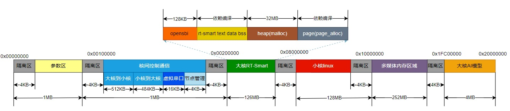

# K230 SDK版本说明

版权所有©2023北京嘉楠捷思信息技术有限公司

## 免责声明

您购买的产品、服务或特性等应受北京嘉楠捷思信息技术有限公司（“本公司”，下同）及其关联公司的商业合同和条款的约束，本文档中描述的全部或部分产品、服务或特性可能不在您的购买或使用范围之内。除非合同另有约定，本公司不对本文档的任何陈述、信息、内容的正确性、可靠性、完整性、适销性、符合特定目的和不侵权提供任何明示或默示的声明或保证。除非另有约定，本文档仅作为使用指导参考。

由于产品版本升级或其他原因，本文档内容将可能在未经任何通知的情况下，不定期进行更新或修改。

## 商标声明

、“嘉楠”和其他嘉楠商标均为北京嘉楠捷思信息技术有限公司及其关联公司的商标。本文档可能提及的其他所有商标或注册商标，由各自的所有人拥有。

**版权所有 © 2023北京嘉楠捷思信息技术有限公司。保留一切权利。**
非经本公司书面许可，任何单位和个人不得擅自摘抄、复制本文档内容的部分或全部，并不得以任何形式传播。

## 目录

[TOC]

## 前言

### 概述

本文档主要介绍了K230 SDK V1.5.0 版本发布相关的内容，包括当前版本支持的硬件、功能、使用限制等。

### 读者对象

本文档（本指南）主要适用于以下人员：

- 技术支持工程师
- 软件开发工程师

### 缩略词定义

| 简称               | 说明                                                   |
|--------------------|--------------------------------------------------------|
| K230 USIP LP3 EVB | USIP封装形式的K230芯片搭载LPDDR3的开发板              |
| VENC               | Video Encoder，视频编码模块                            |
| VDEC               | Video Decoder，视频解码模块                            |
| VICAP              | Video Input Capture，图像输入采集模块                  |
| VO                 | Video Output，视频输出模块                             |
| AI                 | Audio Input，音频输入模块                              |
| AO                 | Audio Output，音频输出模块                             |
| AENC               | Audio Encoder，音频编码模块                            |
| ADEC               | Audio Decoder，音频解码模块                            |
| NonAI-2D           | 2D图形加速处理模块，支持OSD叠加，画框，CSC变换等功能。 |
| MCM                | Multi Camera Management ,多摄像头管理                  |

## 1. 版本信息

| 所属产品 | 版本号 | 发布日期 |
|----------|--------|----------|
| K230 SDK | V1.5.0 | 2024-4-15|

## 2. 支持的硬件

K230平台支持K230 USIP LP3 EVB 、CanMV-K230等主板，具体硬件信息参考文档目录：[00_hardware](../00_hardware)。

## 3. 版本使用限制说明

当前SDK的USIP LP3 EVB、CanMV-K230上内存布局如下图所示：

图-1 SDK内存布局

可通过在k230_sdk目录下输入`make menuconfig` 选择`Memory->Configuration`来配置各模块的内存区间，暂不支持配置
参数区和核间通讯区域的内存配置

## 4. 版本功能统计

### 4.1 多媒体

| ID | 支持版本      | 功能概要             | 功能描述                                                                                   | 备注 |
|----|---------------|----------------------|--------------------------------------------------------------------------------------------|------|
| 1  | K230 SDK V0.5 | venc                 | H264/H265/JPEG编码                                                                         |      |
| 2  | K230 SDK V0.5 | vdec                 | H264/H265/JPEG解码                                                                         |      |
| 3  | K230 SDK V0.5 | vicap bind venc      | vicap输入绑定到venc输出                                                                    |      |
| 4  | K230 SDK V0.5 | vdec bind vo         | vdec绑定到vo输出图像                                                                       |      |
| 5  | K230 SDK V0.5 | venc_2d              | OSD叠加后编码                                                                              |      |
| 6  | K230 SDK V0.5 | nonai_2d             | OSD叠加                                                                                    |      |
| 7  | K230 SDK V0.5 | i2s 音频输入         | 采样精度(16/24/32),采样率(8k-192k)，时间戳（us），双声道，每帧采样点可配。                 |      |
| 8  | K230 SDK V0.5 | pdm 音频输入         | 采样精度(16/24),采样率(8k-192k),过采样(32/64/128),单双声道，时间戳（us），每帧采样点可配。 |      |
| 9  | K230 SDK V0.5 | i2s 音频输出         | 采样精度(16/24/32),采样率(8k-192k)，双声道，每帧采样点可配。                               |      |
| 10 | K230 SDK V0.5 | 内置audio codec      | 支持adc、dac、采样精度(16/24),采样率(8k-192k)                                              |      |
| 11 | K230 SDK V0.5 | ai(i2s) bind ao(i2s) | ai 绑定ao，i2s音频采集到i2s音频输出回环                                                    |      |
| 12 | K230 SDK V0.5 | ai(pdm) bind ao(i2s) | ai 绑定ao，pdm音频采集到i2s音频输出回环                                                    |      |
| 13 | K230 SDK V0.6 | venc                 | 多路编码，旋转和镜像                                                                       |      |
| 14 | K230 SDK V0.6 | venc_2d              | 画框                                                                                       |      |
| 15 | K230 SDK V0.6 | venc MAPI            | VI-\>VENC-\>小核存文件                                                                     |      |
| 16 | K230 SDK V0.6 | aenc                 | 音频编码，内置g711a/u                                                                      |      |
| 17 | K230 SDK V0.6 | adec                 | 音频解码，内置g711a/u                                                                      |      |
| 18 | K230 SDK V0.6 | ai bind aenc         | ai绑定aenc，采集编码后的数据                                                               |      |
| 19 | K230 SDK V0.6 | adec bind ao         | adec绑定ao，播放输出解码后的音频                                                           |      |
| 20 | K230 SDK V0.6 | audio 3a             | AEC(回声消除)，ANS（噪声抑制）,AGC（自动增益）                                             |      |
| 21 | K230 SDK V0.7 | venc gop | 支持设置编码GOP | |
| 22 | K230 SDK V0.7 | venc mirror | 支持设置编码水平、垂直翻转 | |
| 23 | K230 SDK V0.7 | venc idr | 支持编码IDR帧enable/disable | |
| 24 | K230 SDK V0.7 | venc multi channel | mapi_venc_2路 h264编码 | |
| 25 | K230 SDK V0.7 | audio i2s mapi | mapi-audio_i2S采集音频编码后传递给大核 | |
| 26 | K230 SDK V0.7 | audio enc mapi | mapi-audio_小核编码文件传给大核解码并播放 | |
| 27 | K230 SDK V0.7 | audio volume | 增加内置audio codec 数字、模拟音量控制接口。 | |
| 28 | K230 SDK V0.7 | mapi rtsp | mapi-网络传输-rtsp 音视频推流 | |
| 29 | K230 SDK V0.8 | mapi vdec | 小核视频编码文件传给大核解码并播放 | |
| 30 | K230 SDK V0.8 | venc mpi | deblock, sao, entropy： enable/disable | |
| 31 | K230 SDK V0.8 | vdec mpi | 支持down scale | |
| 32 | K230 SDK V0.8 | dpu demo | 屏显深度图：vicap->dma->dpu->vo | |
| 32 | K230 SDK V0.8 | 语音对讲 demo | 增加语音对讲demo | |
| 33 | K230 SDK V0.9 | 猫眼poc | 远程猫眼，实现可视对讲、变声、录像、人形检测及抓拍功能。 | |
| 34 | K230 SDK V1.0 | 猫眼poc | 1. 猫眼设备端增加UI控制。 2. 增加本地猫眼语音对讲功能。3. 手机端录像功能改为设备端实现，始终为录像。4. 猫眼设备端增加回放功能。| |
| 35 | K230 SDK V1.2 | 猫眼poc | 更改为nor flash启动 | |
| 35 | K230 SDK V1.3 | 深度相机poc | 增加深度相机poc功能，猫眼poc改为sd卡启动 | |
| 36 | K230 SDK V1.4 | nonai_2d API | 增加nonai_2d CSC功能mpi和mapi | |
| 37 | K230 SDK V1.4 | YUV Sensor Demo | 增加yuv sensor demo，3路yuv sensor输入，3路推流和屏显 | |

### 4.2 图像

| ID | 支持版本      | 功能概要      | 功能描述                                                                                                                              | 备注 |
|----|---------------|---------------|---------------------------------------------------------------------------------------------------------------------------------------|------|
| 1  | K230 SDK V0.5 | vicap         | 支持sensor图像采集（OV9732、OV9286）                                                                                                  |      |
| 2  | K230 SDK V0.5 | AE            | 支持AE自动曝光                                                                                                                        |      |
| 3  | K230 SDK V0.5 | vicap bind vo | vicap 绑定到 vo输出图像                                                                                                               |      |
| 4  | K230 SDK V0.5 | GPU绘图       | 矢量绘制填充（直线、二次贝塞尔曲线、三次贝塞尔曲线、椭圆曲线） 线性渐变 颜色查找表 图像合成/混合，BLIT                                     |      |
| 5  | K230 SDK V0.5 | 图像调优      | tuning tool 通过网络、串口连接开发板进行图像调优。 black level correction  lens shading correction  color calibration  AWB CAC  gamma   |      |
| 6  | K230 SDK V0.5 | display bind  | 支持vo和vicap，vo 和 vdec 绑定                                                                                                        |      |
| 7  | K230 SDK V0.5 | display 显示  | 支持osd和yuv 显示 支持dump 帧功能 支持dsi 和 vo timing 可配 支持插帧功能                                                                 |      |
| 8  | K230 SDK V0.6 | 图像调优       | tuning tool可以配置sensor寄存器                                                                                                       |      |
| 9  | K230 SDK V0.6 | 时间戳、帧号   | 支持时间戳、帧号                                                                                                                      |      |
| 10 | K230 SDK V0.6 | ISP+KPU Demo  | 人脸检测联动demo                                                                                                                      |      |
| 11 | K230 SDK V0.7 | dewarp        | 添加dewarp功能，可以实现畸变校正                                                                                                       |      |
| 12 | K230 SDK V0.7 | Face AE       | 添加了FaceAE的功能及对应的FaceAE demo                                                                                                  |      |
| 13 | K230 SDK V0.7 | 添加Imx335    | 添加Imx335 sensor驱动及demo                                                                                                            |      |
| 14 | K230 SDK V0.8 | 添加DRM       | Linux小核添加DRM驱动及demo                                                                                                             |      |
| 15 | K230 SDK V0.8 | 添加LVGL      | Linux小核添加LVGL及demo                                                                                                                |      |
| 16 | K230 SDK V0.8 | 快启APP       | 快启APP Sensor改为Imx335(带晶振)                                                                                                       |      |
| 17 | K230 SDK V0.9 | mcm           | 支持最多三路sensor                                                                                                                     |      |
| 18 | K230 SDK V0.9 | display mapi  | 添加视频输出类MAPI                                                                                                                     |      |
| 19 | K230 SDK V1.0 | 调测-Dump sensor raw     | 支持dump sensor raw数据                                                                                                     |      |
| 20 | K230 SDK V1.0 | 调测-帧数统计             | 支持总输入、输出帧数统计功能                                                                                                 |      |
| 21 | K230 SDK V1.0 | dewarp -分屏             | 支持2、4分屏输出                                                                                                            |      |
| 22 | K230 SDK V1.0 | HDR                      | 支持HDR功能，支持Imx335 2dol HDR                                                                                            |      |
| 23 | K230 SDK V1.1 | MAPI                     | 增加vicap的MAPI                                                                                                             |      |
| 24 | K230 SDK V1.1 | HDR频率变换               | 支持HDR 频率变换                                                                                                            |      |
| 25 | K230 SDK V1.1 | 参数导出                  | 支持isp dewarp参数导出                                                                                                      |      |
| 26 | K230 SDK V1.2 | 增加词典笔POC             | 增加词典笔POC                                                                                                               |      |
| 27 | K230 SDK V1.3 | 增加三摄demo             | Canmv-K230板增加3摄(ov5647)同时工作的demo                                                                                    |      |
| 28 | K230 SDK V1.4 | Vicap MCM only 模式      | Vicap MCM only 模式 适配YUV sensor                                                                                          |      |
| 29 | K230 SDK V1.4 | linear mode 支持adaptive      | linear mode 支持adaptive                                                                                               |      |
| 29 | K230 SDK V1.5 | gc2053      | 添加gc2053的驱动                                                                                                                         |      |

### 4.3 平台

| ID | 支持版本      | 功能概要               | 功能描述                                                                                                                                                                                                                                           | 备注 |
|----|---------------|------------------------|----------------------------------------------------------------------------------------------------------------------------------------------------------------------------------------------------------------------------------------------------|------|
| 1  | K230 SDK V0.5 | 启动外设               | 支持eMMC、1/4线SD card                                                                                                                                                                                                                             |      |
| 2  | K230 SDK V0.5 | 大核DPU驱动            | 图像输入、输出驱动开发；基本功能，eg读取参数、支持动态更新长周期参数、输出缓冲、时间戳、算法等;支持pipeline绑定                                                                                                                                    |      |
| 3  | K230 SDK V0.5 | 小核UBOOT              | DDR训练、磁盘驱动（emmc、sd、spi 1线）; 支持pufs和gzip解压缩                                                                                                                                                                                       |      |
| 4  | K230 SDK V0.5 | 小核SPI驱动            | 1线                                                                                                                                                                                                                                                |      |
| 5  | K230 SDK V0.5 | 小核SDIO驱动           | 支持SDIO0/1挂接SDCard                                                                                                                                                                                                                              |      |
| 6  | K230 SDK V0.5 | 小核USB（UVC）驱动     | 支持UVC驱动（K230芯片做slave）                                                                                                                                                                                                                     |      |
| 7  | K230 SDK V0.5 | 小核GPIO驱动           | 支持每个IO单独作为逻辑资源分配;支持IO和中断                                                                                                                                                                                                        |      |
| 8  | K230 SDK V0.5 | 小核磁盘和文件系统     | 支持SDIO0/1挂接SDCard、支持SDIO0/1挂接eMMC;支持ext2/3/4, fat32文件系统                                                                                                                                                                             |      |
| 9  | K230 SDK V0.5 | I2C驱动                | 大小核I2C总线驱动                                                                                                                                                                                                                                  |      |
| 10 | K230 SDK V0.5 | uart驱动               | 大小核uart驱动                                                                                                                                                                                                                                     |      |
| 11 | K230 SDK V0.5 | UVC基础demo            | uvc camera,将板子作为摄像头                                                                                                                                                                                                                        |      |
| 12 | K230 SDK V0.5 | GSDMA（大核驱动）      | 支持使用 gdma 进行图像搬移，通过配置通道属性来实现图像的旋转和镜像，搬运多种图像格式（例如YUV400，YUV420，YUV444），搬运多种像素位宽的图像（例如 8bit, 10bit，16bit）； 支持使用 sdma 进行数据搬移，支持 1d 模式和 2d 模式的搬运。支持pipeline绑定。 |      |
| 13 | K230 SDK V0.6 | 大核GPIO驱动           | 支持独立配置和使用IO功能，独立配置和触发中断，加入了硬件互斥锁以保证寄存器访问的互斥。                                                                                                                                                             |      |
| 14 | K230 SDK V0.6 | 启动外设               | 支持spi nor flash镜像生成和启动                                                                                                                                                                                                                    |      |
| 15 | K230 SDK V0.6 | uboot SPI norflash驱动 | 支持8线 DMA                                                                                                                                                                                                                                        |      |
| 16 | K230 SDK V0.6 | 大核 ADC 驱动          | 支持 ADC 读取电压值                                                                                                                                                                                                                                |      |
| 17   | K230 SDK  V0.7 | 大小核WDT驱动          | 支持watchdog复位soc                                          |      |
| 18   | K230 SDK V0.7  | 大核SPI驱动            | 支持spi单线模式，支持nandflash                               |      |
| 19   | K230 SDK V0.7  | 小核SPI驱动            | 支持spi单线、八线模式，支持nordflash                         |      |
| 20   | K230 SDK V0.7  | 快起功能               | sdk默认快起，非快起版本可通过make menuconfig关闭CONFIG_QUICK_BOOT宏。快起版本uboot不会进命令行。 |      |
| 21   | K230 SDK V0.7  | 安全镜像               | sdk默认不产生安全镜像，可通过make menuconfig配置CONFIG_GEN_SECURITY_IMG产生安全镜像 |      |
| 22   | K230 SDK V0.7  | UVC基础demo            | 增加支持H264格式，当前存在bug，只能运行一会儿时间            |      |
| 23 | K230 SDK V0.7 | DPU、GSDMA | buffer数量可配置 | |
| 24 | K230 SDK V0.8 | 大核timer、rtc、pwm | 大核新增timer 驱动及demo；大核新增pwm驱动及demo；大核新增rtc驱动及demo。 | |
| 25 | K230 SDK V0.8 | spi nand 支持 | 小核(uboot,linux)支持4线spi nand驱动, sdk支持从spinand启动; | |
| 26 | K230 SDK V0.8 | UVC基础demo | UVC支持IMX335摄像头，UVC支持MJPEG格式 | |
| 27 | K230 SDK V0.8 | spinor 增加人脸特性等参数分区 | spi nor 新增人脸特性、ai模型、标定参数、大核app、散斑、快起参数等参数分区；从spinor启动时uboot会解析并加载各个分区数据。 | |
| 28 | K230 SDK V0.9 | 小核PWM驱动 | 支持小核PWM驱动 | |
| 29 | K230 SDK V0.9 | 小核ADC驱动 | 支持小核ADC驱动 | |
| 30 | K230 SDK V0.9 | 支持K230D开发板 | SDK支持K230D开发板（SD卡启动） | |
| 31 | K230 SDK V0.9 | OTA | 支持OTA升级 | |
| 32 | K230 SDK V1.0 | 大核FFT | 支持FFT驱动 | |
| 33 | K230 SDK V1.0.1 | 支持CanMV-K230开发板 | SDK支持CanMV-K230开发板（SD卡启动）| |
| 34 | K230 SDK V1.1 | 小核Wifi驱动 | 小核支持AP6256驱动| |
| 35 | K230 SDK V1.1 | 小核三色灯驱动 | 小核支持I2S接口WS2812驱动| |
| 35 | K230 SDK V1.1 | 小核SPI LCD驱动 | 小核支持SPI接口ST7735S 0.96寸LCD屏驱动| |
| 36  | K230 SDK V1.1 | burntool烧录工具V2           | 删除完整镜像烧录页，增加loader_sip.bin支持SIP烧录,具体可查看 [K230_SDK_Burntool使用指南.md](../01_software/pc/burntool/K230_SDK_Burntool使用指南.md) |      |
| 37  | K230 SDK V1.1 | usb口使用           | usb1固定为host模式，可以连接usb-eth或U盘等外设，EVB的J5排针pin3与pin4跳线帽连接，给外设供电使能。usb0用于usb gadget测试和usb升级，EVB的J5排针pin1与pin2不再使用跳线帽连接。 |      |
| 38  | K230 SDK V1.2 | canmv wifi ap6212           | canmv support ap6212 |      |
| 39  | K230 SDK V1.2 | canmv only linux           |canmv 新增 大核运行带向量linux(k230_canmv_only_linux_defconfig)配置 |      |
| 40  | K230 SDK V1.3 | 新增debian和ubuntu发行版镜像           |新增canmv的debian和ubuntu发行版镜像  |      |
| 41 | K230 SDK V1.3 | OTA | buildroot增加swupdate OTA升级功能，支持双分区切换升级(需要配合双分区启动方案) | 使用参考描述k230_sdk/tools/ota/README |
| 42 | K230 SDK V1.5 | U转eth | 修复了U转eth网络不稳定性的问题                                                                                  |  |
| 43 | K230 SDK V1.5 | 触控 | 添加LCD屏触控                                                                                                    |  |
| 44 | K230 SDK V1.5 | Canmv2.0 | 支持Canmv-K230-V2.0板                                                                                        |  |
| 45 | K230 SDK V1.6 | 01Studio-CanMV-K230 | 支持01Studio-CanMV-K230板                                                                         |  |
| 46 | K230 SDK V1.6 | 支持rtt only系统 | 支持rtt only单系统                                                                                    |  |

### 4.4 架构

| ID | 支持版本      | 功能概要       | 功能描述                                                                                                                            | 备注                                |
|----|---------------|----------------|-------------------------------------------------------------------------------------------------------------------------------------|-------------------------------------|
| 1  | K230 SDK V0.5 | 多媒体内存管理 | 多媒体区域内存管理驱动、MPI、MAPI；视频缓存池驱动、MPI、MAPI                                                                        |                                     |
| 2  | K230 SDK V0.5 | 日志管理       | 多媒体日志管理驱动、MPI、MAPI                                                                                                       |                                     |
| 3  | K230 SDK V0.5 | 系统绑定       | 多媒体系统绑定驱动、MPI                                                                                                             |                                     |
| 4  | K230 SDK V0.5 | 大核多媒体调试 | 提供proc文件系统用于调试                                                                                                            |                                     |
| 5  | K230 SDK V0.5 | 核间通讯       | 核间通讯驱动                                                                                                                        |                                     |
| 6  | K230 SDK V0.5 | 核间控制通信   | IPCMSG库                                                                                                                            |                                     |
| 7  | K230 SDK V0.5 | 核间数据通信   | DATAFIFO库                                                                                                                          |                                     |
| 8  | K230 SDK V0.5 | 共享文件系统   | sharefs                                                                                                                             | 小核做server，大核做client          |
| 9  | K230 SDK V0.5 | 系统控制       | 大小核时钟电源与复位驱动                                                                                                            |                                     |
| 10 | K230 SDK V0.5 | KPU            | KPU驱动                                                                                                                             |                                     |
| 11 | K230 SDK V0.5 | 大核系统调试   | JTAG调试；本地串口；CPU占用率统计分析等                                                                                             |                                     |
| 12 | K230 SDK V0.5 | 小核系统调试   | JTAG调试、串口调试、网口调试、CPU占用率统计分析、性能调试手段、调试及log输出端口（物理串口）、kernel及异常信息输出、转储、debug版本 | perf没有默认配置到内核和buildroot中 |
| 13 | K230 SDK V0.7 | 软件SHA256     | 大核MPP下增加SHA256软件实现                                                                                                         |                                     |
| 14 | K230 SDK V0.7 | OTP读写功能    | 大核rt-smart中增加OTP读写功能，小核Linux中增加OTP读功能                                                                             |                                     |
| 15 | K230 SDK V0.7 | Tsensor读功能  | 大核rt-smart中增加Tsensor读功能，小核Linux中增加Tsensor读功能，用于读取芯片结温                                                      |                                     |
| 16 | K230 SDK V0.7 | TRNG读功能     | 小核Linux中增加TRNG读功能                                                                                                         |                                     |
| 17 | K230 SDK V0.7 | 快起demo       | 添加大核快速启动人脸检测demo                                                                                                       |                                     |
| 18 | K230 SDK V0.7 | PMU功能        | 添加小核linux的PMU待机和唤醒功能                                                                                                   |                                     |
| 19 | K230 SDK V0.8 | 门锁 POC        | 大核添加 POC 门锁功能，小核添加 UI 功能，通过 UI 界面或 SD 卡注册人脸并完成识别 |                                     |
| 20 | K230 SDK V0.9 | 门锁 POC        | 支持 ov9286,人脸检测和识别（包含 IR 和散斑活体，散斑包含 DPU 深度提取） |                                     |
| 21 | K230 SDK V0.9 | 加解密        | 添加小核 linux 的 aes-gcm 加解密功能 |                                     |
| 22 | K230 SDK V0.9 | 功耗控制        | uboot 中增加对芯片时钟/电源域管理，大核 rt-smart 中增加对 CPU1，DPU，VPU，KPU，display 的功耗控制，小核 linux 中增加对 display 的功耗控制                                                                                                |                                     |
| 23 | K230 SDK V1.0 | 门锁POC        | 添加人脸特征值加解密功能 |                                     |
| 24 | K230 SDK V1.0 | SH256驱动        | 增加了大小核硬件SH256驱动 |                                     |
| 25 | K230 SDK V1.1 | 大核加解密驱动        | 增加了大核硬件 AES-GCM 驱动和 SM4-ECB/CBC/CFB/OFB/CTR 驱动 |                                     |
| 26 | K230 SDK V1.2 | 门锁OTA功能        | 增加了门锁OTA功能 | |
| 27 | K230 SDK V1.3 | OTP空间调整        | 调整SDK操作的OTP空间，用户可读写768bytes。其余的空间为芯片厂商保留使用 | |

### 4.5 其它

| ID | 支持版本      | 功能概要             | 功能描述                                                         | 备注 |
|----|---------------|----------------------|------------------------------------------------------------------|------|
| 1  | K230 SDK V0.5 | ai demo              | 提供三个ai demo 分别是door_lock、object_detect、image_classify； |      |
| 2  | K230 SDK V0.5 | AiW4211LV10 WiFi驱动 | 支持网络数据通信；支持控制指令发送；                             |      |
| 3  | K230 SDK V0.6 | AiW4211LV10 WiFi固件 | 固件兼容指令及网络配置，支持断网重连，支持k230电平监测及唤醒     |      |
| 4  | K230 SDK V0.6 | 触摸屏支持           | 触摸屏支持                                                       |      |
| 5  | K230 SDK V0.7 | 软件镜像           | sdk编译会生成demo 可执行文件，但默认不打包到镜像；安全镜像文件默认不生成，可需手动配置  |      |
| 6  | K230 SDK V0.7 | 工具链           | 大核工具链版本更新为：riscv64-unknown-linux-musl-rv64imafdcv-lp64d-20230420.tar.bz2  |      |
| 7  | K230 SDK V0.8 | 软件镜像           | Emmc/Sdcard镜像打包时，会将大核的demo打包到小核/sharefs |      |
| 8  | K230 SDK V0.8 | Demo           | 为了适配不同的camera模组而修改相关的demo，比如编码/UVC,demo具体使用可查看《K230 SDK Demo使用指南》 |      |
