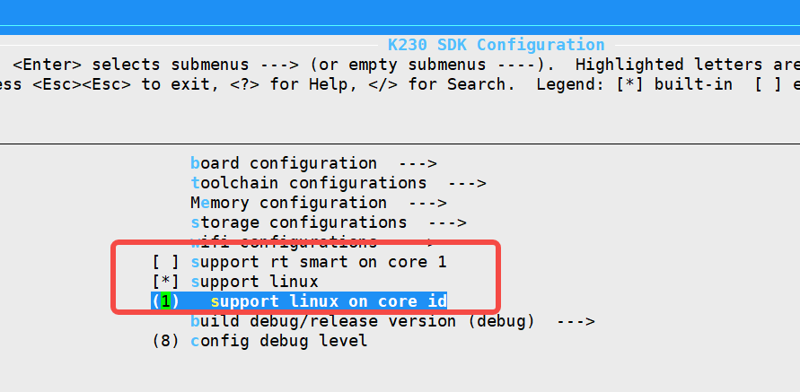

# K230 SDK 常见问题解答（C）


版权所有©2023北京嘉楠捷思信息技术有限公司

<div style="page-break-after:always"></div>

## 免责声明

您购买的产品、服务或特性等应受北京嘉楠捷思信息技术有限公司（“本公司”，下同）及其关联公司的商业合同和条款的约束，本文档中描述的全部或部分产品、服务或特性可能不在您的购买或使用范围之内。除非合同另有约定，本公司不对本文档的任何陈述、信息、内容的正确性、可靠性、完整性、适销性、符合特定目的和不侵权提供任何明示或默示的声明或保证。除非另有约定，本文档仅作为使用指导参考。

由于产品版本升级或其他原因，本文档内容将可能在未经任何通知的情况下，不定期进行更新或修改。

## 商标声明

、“嘉楠”和其他嘉楠商标均为北京嘉楠捷思信息技术有限公司及其关联公司的商标。本文档可能提及的其他所有商标或注册商标，由各自的所有人拥有。

**版权所有 © 2023北京嘉楠捷思信息技术有限公司。保留一切权利。**
非经本公司书面许可，任何单位和个人不得擅自摘抄、复制本文档内容的部分或全部，并不得以任何形式传播。

<div style="page-break-after:always"></div>

## 目录

[TOC]

## 1 TF boot failed with exit code 13

问题： TF卡启动报boot failed with exit code 13错误

答：原因如下  1.启动介质里面文件错误。2.启动管脚设置错误。

TF卡启动管脚设置特别说明： 两个启动管脚电平为高(需要拨到丝印的1和2，也就是ON的反方向)时才会从TF卡启动。

## 2 bootrom启动错误码

问题：bootrom 启动错误码含义是什么？

bootrom引导失败时会打印类似下面错误  boot failed with exit code 19，最后的数字是错误原因，常见错误含义如下

| 值   | 含义                                                |
| ---- | --------------------------------------------------- |
| 13   | 启动介质里面文件错误                                |
| 19   | 启动介质初始化失败，比如没有插sd卡等                |
| 17   | otp要求必需是安全镜像，但是介质里面文件是非安全镜像 |

## 3 spi nor 和 spi nand flash识别

问题： 怎么知道evb板上连接的是spi nor还是spi nand flash？

答：方法1：子板丝印不一样，丝印会有nor或nand标识。

​       方法2：linux启动log会有打印，比如连接spi nor时会有类似下面打印

```bash
[root@canaan ~ ]#dmesg | grep spi
[    1.299989] spi spi0.0: setup mode 0, 8 bits/w, 100000000 Hz max --> 0
[    1.306704] spi-nor spi0.0: gd25lx256e (32768 Kbytes)
[    1.311786] 2 fixed-partitions partitions found on MTD device spi0.0
[    1.318147] Creating 2 MTD partitions on "spi0.0":
```

## 4 perf 使用

问题：perf如何编译，支持那些硬件事件？

答：带perf功能的参考镜像链接如下<https://kvftsfijpo.feishu.cn/file/LJjpbwxnzowI9RxvL0NcEK73nkf?from=from_copylink>

perf的时候可以使用raw事件，比如perf stat -e r12 ,perf工具编译命令如下

```bash
cd src/little/linux/tools
make CROSS_COMPILE=riscv64-unknown-linux-gnu- ARCH=riscv perf V=1 WERROR=0
#目标文件是  perf/perf ，把这个文件复制到板子上就可以了。
```

特别说明：1.1以前版本进行如下修改

```bash
#src/little/linux/arch/riscv/boot/dts/kendryte/k230_evb.dtsi 添加如下内容
pmu_thead: pmu_thead {
    interrupt-parent = <&cpu0_intc>;
    interrupts = <17>;
    compatible = "thead,c900_pmu";
};
#src/little/linux/arch/riscv/configs/k230_evb_defconfig  文件增加如下配置
CONFIG_KALLSYMS=y
CONFIG_KALLSYMS_ALL=y
CONFIG_PERF_EVENTS=y
CONFIG_DEBUG_PERF_USE_VMALLOC=y
CONFIG_KUSER_HELPERS=y
CONFIG_DEBUG_INFO=y
CONFIG_FRAME_POINTER=y
```

```bash
[root@canaan ~ ]#perf list hw cache  > a ;cat a
  branch-instructions OR branches                    [Hardware event]
  branch-misses                                      [Hardware event]
  bus-cycles                                         [Hardware event]
  cache-misses                                       [Hardware event]
  cache-references                                   [Hardware event]
  cpu-cycles OR cycles                               [Hardware event]
  instructions                                       [Hardware event]
  ref-cycles                                         [Hardware event]
  stalled-cycles-backend OR idle-cycles-backend      [Hardware event]
  stalled-cycles-frontend OR idle-cycles-frontend    [Hardware event]
  L1-dcache-load-misses                              [Hardware cache event]
  L1-dcache-loads                                    [Hardware cache event]
  L1-dcache-store-misses                             [Hardware cache event]
  L1-dcache-stores                                   [Hardware cache event]
  L1-icache-load-misses                              [Hardware cache event]
  L1-icache-loads                                    [Hardware cache event]
  LLC-load-misses                                    [Hardware cache event]
  LLC-loads                                          [Hardware cache event]
  LLC-store-misses                                   [Hardware cache event]
  LLC-stores                                         [Hardware cache event]
  dTLB-load-misses                                   [Hardware cache event]
  dTLB-loads                                         [Hardware cache event]
  dTLB-store-misses                                  [Hardware cache event]
  dTLB-stores                                        [Hardware cache event]
  iTLB-load-misses                                   [Hardware cache event]
  iTLB-loads                                         [Hardware cache event]
[root@canaan ~ ]#

```

## 5大核运行vector linux

问题：大核如何运行带vector的linux？

答：在sdk主目录执行make menuconfig;取消CONFIG_SUPPORT_RTSMART，把CONFIG_LINUX_RUN_CORE_ID配置为1，

就可以让linux运行在大核，如下图所示：

linux内核配置文件增加CONFIG_VECTOR=y，linux系统就会使能向量1.0功能。

备注：可以参考configs/k230_evb_only_linux_defconfig文件修改配置 ，make CONF=k230_evb_only_linux_defconfig 会生成evb板的大核带向量linux镜像。

## 6 大核串口id

问题：怎么修改大核的串口id？

答：configs下面配置文件 CONFIG_RTT_CONSOLE_ID代表大核串口id，修改为正确的值就可以了。

## 7 uboot命令行

怎么编译可以进入uboot命令行的版本

答：  configs下面配置文件 CONFIG_QUICK_BOOT代表快起，修改为CONFIG_QUICK_BOOT=n 就可以生成可进去uboot命令行版本。

## 8 慢启怎么变快启动

答：进入uboot命令行执行如下命令：

```bash
setenv quick_boot true;saveenv;reset;
```

## 9 linux如何修改最后一个分区大小

答：使用parted工具可以动态修改最后一个分区大小，参考命令如下：

```bash
umount /sharefs/
parted   -l /dev/mmcblk1
parted  -a minimal  /dev/mmcblk1  resizepart 4  31.3GB
mkfs.ext2 /dev/mmcblk1p4
mount /dev/mmcblk1p4 /sharefs
#参考操作log如下
[root@canaan ~ ]#parted   -l /dev/mmcblk1
Model: SD SD32G (sd/mmc)
Disk /dev/mmcblk1: 31.3GB
Sector size (logical/physical): 512B/512B
Partition Table: gpt
Disk Flags: 
 
Number  Start   End     Size    File system  Name        Flags
 1      10.5MB  31.5MB  21.0MB               rtt
 2      31.5MB  83.9MB  52.4MB               linux
 3      134MB   218MB   83.9MB  ext4         rootfs
 4      218MB   487MB   268MB   fat16        fat32appfs
 
 
[root@canaan ~ ]#umount /sharefs/
[root@canaan ~ ]#parted  -a minimal  /dev/mmcblk1  resizepart 4  31.3GB
Information: You may need to update /etc/fstab.
 
[root@canaan ~ ]#parted   -l /dev/mmcblk1
Model: SD SD32G (sd/mmc)
Disk /dev/mmcblk1: 31.3GB
Sector size (logical/physical): 512B/512B
Partition Table: gpt
Disk Flags: 
 
Number  Start   End     Size    File system  Name        Flags
 1      10.5MB  31.5MB  21.0MB               rtt
 2      31.5MB  83.9MB  52.4MB               linux
 3      134MB   218MB   83.9MB  ext4         rootfs
 4      218MB   31.3GB  31.1GB  fat16        fat32appfs
 
 
[root@canaan ~ ]#mkfs.ext2 /dev/mmcblk1p4
Filesystem label=
OS type: Linux
Block size=4096 (log=2)
Fragment size=4096 (log=2)
1896832 inodes, 7586811 blocks
379340 blocks (5%) reserved for the super user
First data block=0
Maximum filesystem blocks=8388608
232 block groups
32768 blocks per group, 32768 fragments per group
8176 inodes per group
Superblock backups stored on blocks:
32768, 98304, 163840, 229376, 294912, 819200, 884736, 1605632, 2654208, 4096000
[root@canaan ~ ]#parted   -l /dev/mmcblk1
Model: SD SD32G (sd/mmc)
Disk /dev/mmcblk1: 31.3GB
Sector size (logical/physical): 512B/512B
Partition Table: gpt
Disk Flags: 
 
Number  Start   End     Size    File system  Name        Flags
 1      10.5MB  31.5MB  21.0MB               rtt
 2      31.5MB  83.9MB  52.4MB               linux
 3      134MB   218MB   83.9MB  ext4         rootfs
 4      218MB   31.3GB  31.1GB  ext2         fat32appfs
 
 
[root@canaan ~ ]#mount /dev/mmcblk1p4 /sharefs/
[  332.688642] EXT4-fs (mmcblk1p4): mounted filesystem without journal. Opts: (null)
[root@canaan ~ ]#df -h
Filesystem                Size      Used Available Use% Mounted on
/dev/root                73.5M     60.9M     10.2M  86% /
devtmpfs                 41.7M         0     41.7M   0% /dev
tmpfs                    51.8M         0     51.8M   0% /dev/shm
tmpfs                    51.8M     56.0K     51.7M   0% /tmp
tmpfs                    51.8M     36.0K     51.7M   0% /run
/dev/mmcblk1p4           28.5G     20.0K     27.0G   0% /sharefs
[root@canaan ~ ]#
 
```

## 10如何修改bootargs

答：方法1：修改使用env文件里面的bootargs 。比如可以在board/common/env/default.env文件里面添加如下内容：

```bash
bootargs=root=/dev/mmcblk1p3 loglevel=8 rw rootdelay=4 rootfstype=ext4 console=ttyS0,115200 earlycon=sbi；
```

方法2：进入uboot命令行，参考下面命令修改bootargs。

```bash
setenv bootargs  "root=/dev/mmcblk1p3 loglevel=8 rw rootdelay=4 rootfstype=ext4 console=ttyS0,115200 earlycon=sbi" ;saveenv;reset;
```

## 11如何查看bootargs

答：方法1：linux下 输入cat /proc/cmdline  查看

```bash
[root@canaan ~ ]#cat /proc/cmdline 
root=/dev/mmcblk0p3 loglevel=8 rw rootdelay=4 rootfstype=ext4 console=ttyS0,115200 crashkernel=256M-:128M earlycon=sbi
[root@canaan ~ ]#

```

方法2：linux命令行输入 dmesg | grep  command查看

```bash
[root@canaan ~ ]#dmesg | grep  command
[    0.000000] Kernel command line: root=/dev/mmcblk0p3 loglevel=8 rw rootdelay=4 rootfstype=ext4 console=ttyS0,115200 crashkernel=256M-:128M earlycon=sbi
[root@canaan 
```

## 12小核默认串口修改

答：目前sdk里面小核串口默认0，如果需要修改成其他串口(比如串口2)，请参考下面进行修改：

修改1：参考下面修改uboot设备树(比如arch/riscv/dts/k230_evb.dts)：

```bash
aliases {
        uart2 = &serial2;
    };

    chosen {
        stdout-path = "uart2:115200n8";
    };
    
    serial2: serial@91402000 {
    compatible = "snps,dw-apb-uart";
    reg = <0x0 0x91402000 0x0 0x400>;
    clock-frequency = <50000000>;
    clock-names = "baudclk";
    reg-shift = <2>;
    reg-io-width = <4>;
    u-boot,dm-pre-reloc;
};
```

修改2：参考下面修改linux设备树(比如arch/riscv/boot/dts/kendryte/k230_evb.dts)

```bash
aliases {
        serial2 = &uart2;
    };
chosen {
        stdout-path = "serial2";
    };
    
&uart2 {
    status = "okay";
};
```

修改3：  修改使用env文件里面的bootargs (参考2.10)。

 比如可以在board/common/env/default.env文件里面添加如下内容：

```bash
bootargs=root=/dev/mmcblk1p3 loglevel=8 rw rootdelay=4 rootfstype=ext4 console=ttyS2,115200 earlycon=sbi；
```

## 13如何彻底重编sdk

答：更新修改SDK源代码之后，或者修改SDK源代码之后，建议输入如下命令彻底重编下sdk。

```bash
make clean; make;
```

### 2.14支持sensor list在哪里

答：请参考 [K230_Camera_Sensor适配指南](../01_software/board/mpp/K230_Camera_Sensor适配指南.md) 第4.1章节“支持的sensor类型”，目前支持

ov9732

ov9286

imx335

sc035

ov5647

sc201

### 2.15canmmv板子是否可以使用平头哥的cklink进行jtag调试

答：默认不可以(uboot会关闭jtag功能)，需要进行如下修改才可以使用平头哥cklink进行jtag调试。

``` bash
    #src/little/uboot/arch/riscv/dts/k230_canmv.dts 文件gpio5和gipi6修改为如下内容
    (IO5 ) ( 1<<SEL | 0<<SL | BANK_VOLTAGE_IO2_IO13 <<MSC | 1<<IE | 0<<OE | 0<<PU | 0<<PD | 4<<DS | 0<<ST )
    (IO6 ) ( 1<<SEL | 0<<SL | BANK_VOLTAGE_IO2_IO13 <<MSC | 1<<IE | 0<<OE | 1<<PU | 0<<PD | 4<<DS | 0<<ST )
```

>修改完后需要重新编译uboot代码

特别说明：sdk不支持多进程编译，不要增加类似-j32多进程编译选项。
