# CanMV K230 教程


版权所有©2023北京嘉楠捷思信息技术有限公司

<div style="page-break-after:always"></div>

## 免责声明

您购买的产品、服务或特性等应受北京嘉楠捷思信息技术有限公司（“本公司”，下同）及其关联公司的商业合同和条款的约束，本文档中描述的全部或部分产品、服务或特性可能不在您的购买或使用范围之内。除非合同另有约定，本公司不对本文档的任何陈述、信息、内容的正确性、可靠性、完整性、适销性、符合特定目的和不侵权提供任何明示或默示的声明或保证。除非另有约定，本文档仅作为使用指导参考。

由于产品版本升级或其他原因，本文档内容将可能在未经任何通知的情况下，不定期进行更新或修改。

## 商标声明

、“嘉楠”和其他嘉楠商标均为北京嘉楠捷思信息技术有限公司及其关联公司的商标。本文档可能提及的其他所有商标或注册商标，由各自的所有人拥有。

**版权所有 © 2023北京嘉楠捷思信息技术有限公司。保留一切权利。**
非经本公司书面许可，任何单位和个人不得擅自摘抄、复制本文档内容的部分或全部，并不得以任何形式传播。

<div style="page-break-after:always"></div>

## 目录

[toc]

## 前言

本文基于CanMV-K230开发板，介绍K230 SDK、nncase及AI的开发流程。

## 快速上手

### 开发板概况

CanMV-K230开发板采用的是嘉楠科技Kendryte®系列AIoT芯片中的最新一代SoC芯片K230。该芯片采用全新的多异构单元加速计算架构，集成了2个RISC-V高能效计算核心，内置新一代KPU（Knowledge Process Unit）智能计算单元，具备多精度AI算力，广泛支持通用的AI计算框架，部分典型网络的利用率超过了70%。

该芯片同时具备丰富多样的外设接口，以及2D、2.5D等多个标量、向量、图形等专用硬件加速单元，可以对多种图像、视频、音频、AI等多样化计算任务进行全流程计算加速，具备低延迟、高性能、低功耗、快速启动、高安全性等多项特性。

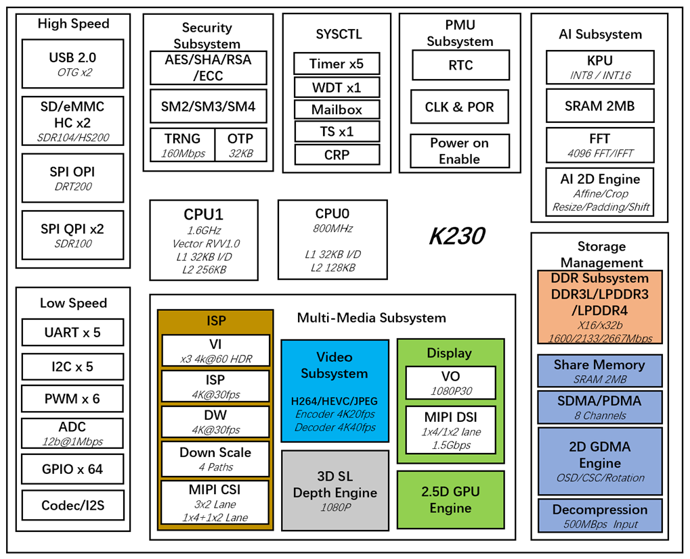

CanMV-K230采用单板设计，扩展接口丰富，极大程度的发挥K230高性能的优势，可直接用于各种智能产品的开发，加速产品落地。


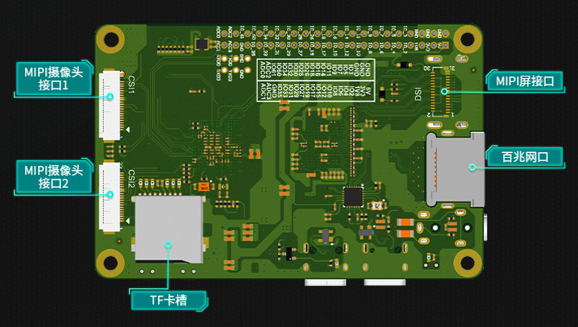

### CanMV-K230默认套件

CanMV-K230开发板默认套件包含以下物品：

1、CanMV-K230主板 x 1

2、OV5647摄像头 x 1

3、Type-C数据线 x 1

另外，需要用户准备以下配件：

1、TF卡， 用于烧写固件，启动系统（必须）

2、带HDMI接口的显示器及HDMI连接线，显示器要求支持1080P30，否则无法显示

3、100M/1000M 以太网线缆，及有线路由器

### 调试说明

#### 串口连接

使用Type-C线连接CanMV-K230如下图的位置，线另一端连接至电脑。

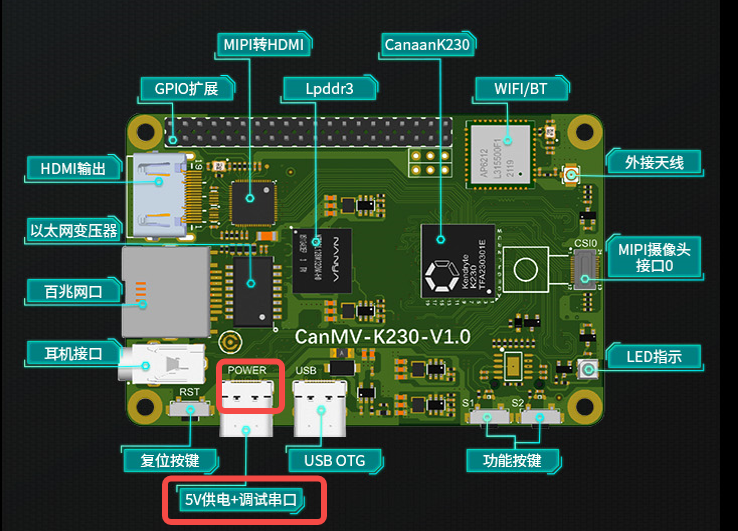

#### 串口调试

##### Windows

安装驱动

CanMV-K230自带usb转串口芯片 CH342，驱动下载地址<https://www.wch.cn/downloads/CH343SER_EXE.html>。

查看串口号

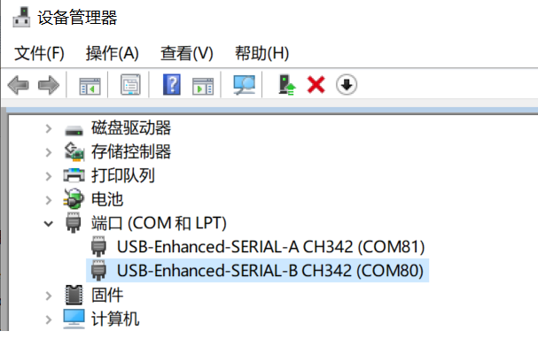

这里显示两个串口，COM80为小核Linux的调试串口，COM81为大核rt-smart的调试串口。

配置串口信息

打开工具Xshell（也可以使用其它串口工具）。

1、端口号选择设备管理器显示的端口号

2、波特率 115200

3、数据位 8

4、停止位 1

5、奇偶检验 无

6、流控制 无

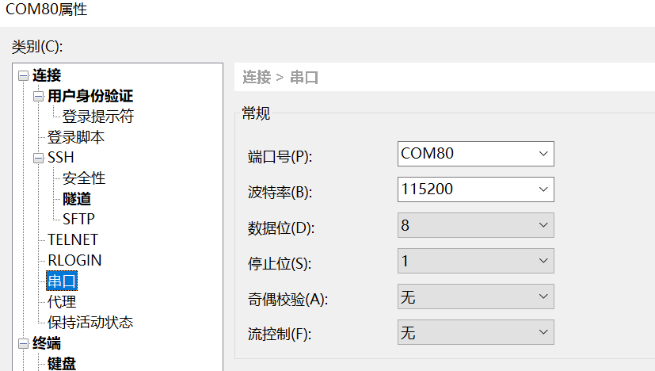

##### linux

Linux串口显示如下：

- `/dev/ttyACM0`为小核linux调试串口
- `/dev/ttyACM1`为大核rt-smart调试串口

可以使用linux的minicom或其它串口工具进行连接调试，串口配置信息与windows一致。

### 固件获取及烧录

#### 固件获取

CanMV-K230 固件下载地址： <https://kendryte-download.canaan-creative.com/developer/k230>

请下载“k230_canmv”开头的gz压缩包，解压得到sysimage-sdcard.img文件，即为CanMV-K230的固件。

#### 固件烧录

将固件通过电脑烧写至TF卡中。

##### Linux下烧录

在TF卡插到宿主机之前，输入：

`ls -l /dev/sd\*`

查看当前的存储设备。

将TF卡插入宿主机后，再次输入：

`ls -l /dev/sd\*`

查看此时的存储设备，新增加的就是TF卡设备节点。

假设/dev/sdc就是TF卡设备节点，执行如下命令烧录TF卡：

`sudo dd if=sysimage-sdcard.img of=/dev/sdc bs=1M oflag=sync`

##### Windows下烧录

Windows下可通过balena Etcher工具对TF卡进行烧录（balena Etcher工具下载地址<https://www.balena.io/etcher/>）。注意打开balenaEtcher软件的时候要以“管理员身份运行”，否则可能会出现烧录失败的情况。

1）将TF卡插入PC，然后启动balena Etcher工具，点击工具界面的"Flash from file”按钮，选择待烧写的固件。

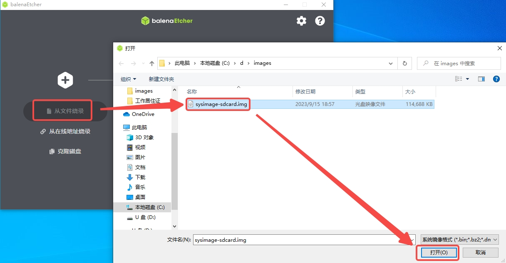

2）点击工具界面的“Select target”按钮，选择目标sdcard卡。

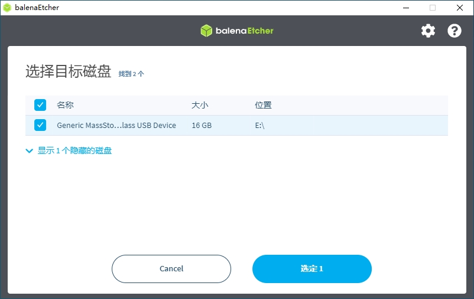

3）点击“Flash”按钮开始烧写，烧写过程有进度条展示，烧写结束后会提示Flash Finish。

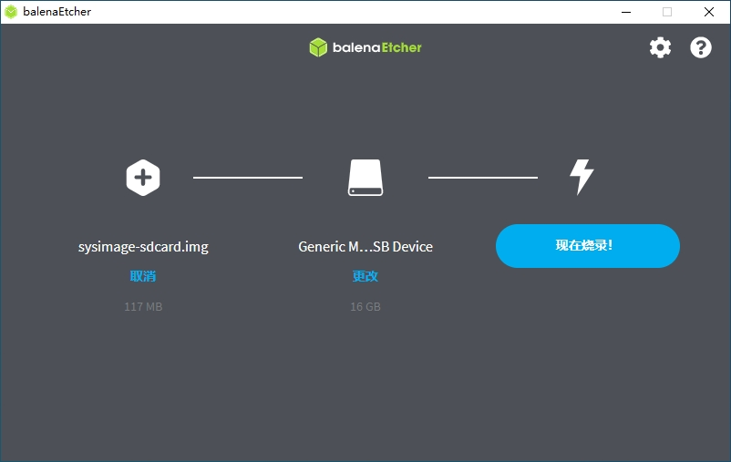
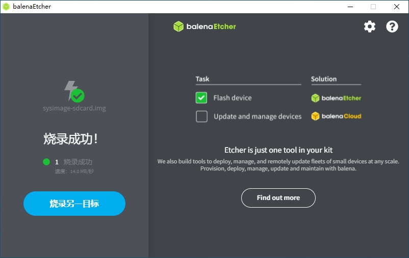

### 启动系统

将烧好固件的TF卡插入CanMV-K230 TF卡插槽，Type-C线连接电脑和板端的POWER口，板子即上电，系统开始启动。
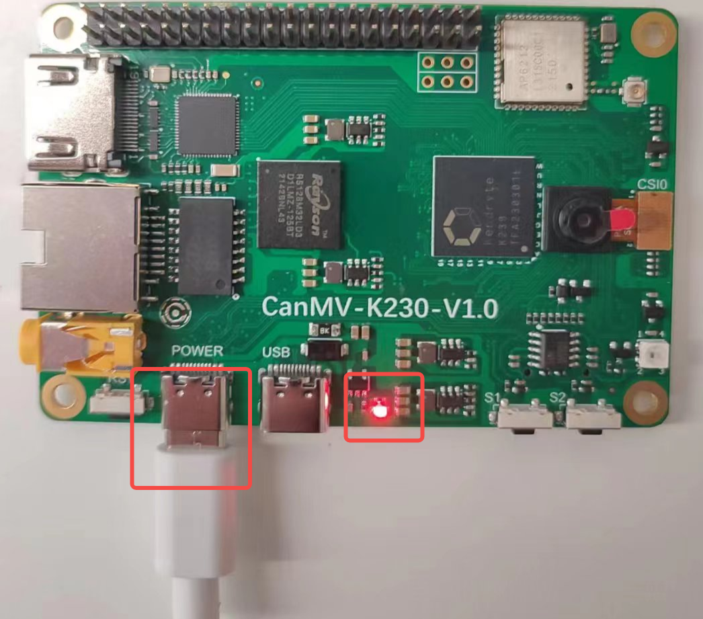

红框的中红灯亮，则说明开发板正常上电。此时查看串口信息。

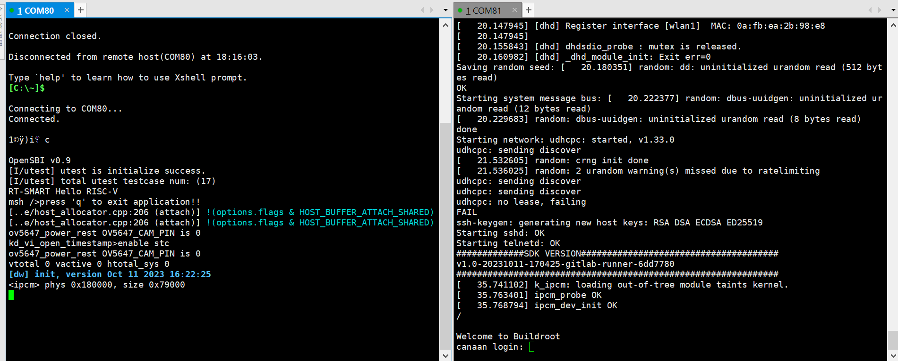

系统启动后默认运行人脸检测程序，将摄像头对准人脸，在显示器上会将人脸框出。

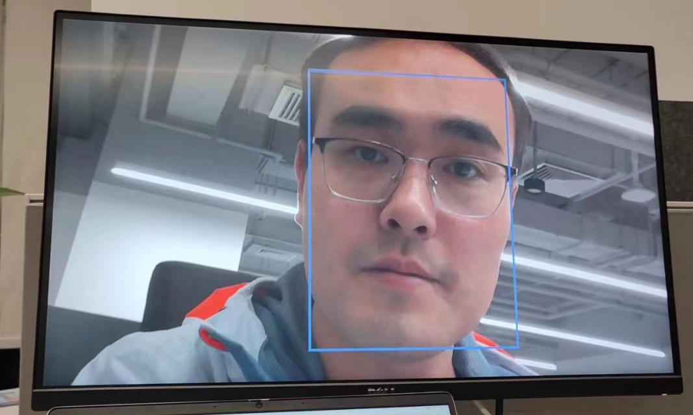

## Linux+RT-smart双系统开发

本章节介绍如何使用K230 SDK进行Linux、RT-smart系统的开发。K230 SDK 包含了基于Linux和RT-smart 双核异构系统开发需要用到的源代码，工具链和其他相关资源。

### 开发环境搭建

#### 编译环境

| 主机环境                    | 描述                                                 |
|-----------------------------|------------------------------------------------------|
| Docker编译环境              | SDK提供了dockerfile，可以生成docker镜像，用于编译SDK |
| Ubuntu 20.04.4 LTS (x86_64) | SDK可以在ubuntu 20.04环境下编译                      |

K230 SDK需要在linux环境下编译，SDK支持docker环境编译，SDK开发包中发布了docker file（`tools/docker/Dockerfile`），可以生成docker镜像。具体dockerfile使用和编译步骤，在后面的编译章节会有详细介绍。

SDK使用的Docker 镜像以ubuntu 20.04 为基础，如果不使用docker编译环境，可以在ubuntu 20.04 主机环境下参考dockerfile的内容，安装相关HOST package和工具链后，编译SDK。

K230 SDK没有在其他Linux版本的主机环境下验证过，不保证SDK可以在其他环境下编译通过。

#### SDK开发包获取

SDK目前在github和gitee同步发布

<https://github.com/kendryte/k230_sdk>

<https://gitee.com/kendryte/k230_sdk>

用户可以直接下载压缩包，下载地址 [github](https://github.com/kendryte/k230_sdk/releases)或者[gitee](https://gitee.com/kendryte/k230_sdk/releases)，或者使用`git clone https://github.com/kendryte/k230_sdk`或者 `git clone https://gitee.com/kendryte/k230_sdk.git`

用户可以根据自己的网络状况选择使用github或者gitee。

### SDK编译

#### 编译介绍

K230 SDK支持一键编译大小核操作系统和公共组件，生成可以烧写的镜像文件，用于部署到开发板启动运行。设备上linux系统的用户名是root无密码；

Setp 1：参考上文获取 SDK开发包

Step 2：进入SDK根目录

`cd k230_sdk`

Step 3：下载toolchain

`source tools/get_download_url.sh && make prepare_sourcecode`

>`make prepare_sourcecode` will download both Linux and RT-Smart toolchain, buildroot package and AI package from Microsoft Azure cloud server with CDN, the download cost time may based on your network connection speed.

Step 4：生成docker镜像（第一次编译需要，已经生成docker镜像后跳过此步骤）

`docker build -f tools/docker/Dockerfile -t k230_docker tools/docker`

Step 5: 进入docker环境，

`docker run -u root -it -v $(pwd):$(pwd) -v $(pwd)/toolchain:/opt/toolchain -w $(pwd) k230_docker /bin/bash`

Step 6: Docker环境下执行下面命令编译SDK

make CONF=k230_canmv_defconfig  #编译CanMV-K230板子镜像

sdk不支持多进程编译，不要增加类似-j32多进程编译参数。

#### 编译输出产物

编译完成后，在`output/k230_canmv_defconfig/images`目录下可以看到编译输出产物

`images`目录下镜像文件说明如下：

`sysimage-sdcard.img` -------------是TF卡的启动镜像；

`sysimage-sdcard.img.gz` ---------是TF卡的启动镜像压缩包(sysimage-sdcard.img文件的gzip压缩包)，烧录时需要先解压缩。

至此整个SDK编译完成，成生镜像sysimage-sdcard.img，可烧录到TF卡启动系统。

#### 示例1

基础的hello world请参考 [K230_实战基础篇_hello_world](https://github.com/kendryte/k230_docs/blob/main/zh/02_applications/tutorials/K230_%E5%AE%9E%E6%88%98%E5%9F%BA%E7%A1%80%E7%AF%87_hello_world.md)

以Vicap_demo为例，代码位于 k230_sdk/src/big/mpp/userapps/sample/sample_vicap

vicap demo通过调用mpi接口实现摄像头数据采集预览功能。CanMV开发板默认使用OV5647摄像头模组，支持单个摄像头最多输出三路数据流。

##### 编译

在k230_sdk目录下执行make rt-smart-clean && rt-smart && make build-image，将大核的修改编译进sd卡镜像中，会在k230_sdk/output/k230_canmv_defconfig/images/目录下生成镜像文件sysimage-sdcard.img

对应的程序位于 k230_sdk/src/big/mpp/userapps/sample/elf/sample_vicap.elf

##### 执行

大核端进入 /sharefs/app，在该目录下执行`./sample_vicap`命令获取命令帮助信息
当输入：`sample_vicap`命令后打印如下提示信息：

```shell
usage: ./sample_vicap -mode 0 -dev 0 -sensor 0 -chn 0 -chn 1 -ow 640 -oh 480 -preview 1 -rotation 1
Options:
 -mode:         vicap work mode[0: online mode, 1: offline mode. only offline mode support multiple sensor input]     default 0
 -dev:          vicap device id[0,1,2]        default 0
 -dw:           enable dewarp[0,1]    default 0
 -sensor:       sensor type[0: ov9732@1280x720, 1: ov9286_ir@1280x720], 2: ov9286_speckle@1280x720]
 -ae:           ae status[0: disable AE, 1: enable AE]        default enable
 -awb:          awb status[0: disable AWB, 1: enable AWb]     default enable
 -chn:          vicap output channel id[0,1,2]        default 0
 -ow:           the output image width, default same with input width
 -oh:           the output image height, default same with input height
 -ox:           the output image start position of x
 -oy:           the output image start position of y
 -crop:         crop enable[0: disable, 1: enable]
 -ofmt:         the output pixel format[0: yuv, 1: rgb888, 2: rgb888p, 3: raw], only channel 0 support raw data, default yuv
 -preview:      the output preview enable[0: disable, 1: enable], only support 2 output channel preview
 -rotation:     display rotaion[0: degree 0, 1: degree 90, 2: degree 270, 3: degree 180, 4: unsupport rotaion]
 -help:         print this help
```

参数说明如下：

| **参数名称** | **可选参数值** | **参数说明** |
|---|---|---|
| -dev         | 0：vicap设备0 1：vicap设备1 2：vicap设备2.                             | 指定当前使用的vicap设备，系统最多支持三个vicap设备。通过指定设备号实现sensor与不同vicap设备之间的绑定关系。 例如： -dev 1 -sensor 0即表示将ov9732 1280x720 RGB图像输出绑定到vicap设备1.                   |
| -mode | 0：在线模式；1：离线模式 | 指定vicap设备工作模式，当前之前在线模式和离线模式。对于多个sensor输入，必须指定为离线模式。 |
| -sensor      | 23：OV5647（CanMV开发板仅支持该sensor） | 指定当前使用的sensor类型                                                         |
| -chn         | 0：vicap设备输出通道0 1：vicap设备输出通道1 2：vicap设备输出通道2.     | 指定当前使用的vicap设备的输出通道，一个vicap设备最多支持三路输出，仅通道0支持RAW图像格式输出  |
| -ow          |                                                                         | 指定输出图像宽度，默认为输入图像宽度。宽度需要16字节对齐。 如果默认宽度超过显示屏输出最大宽度，则使用显示输出宽度作为图像最终输出宽度 如果输出宽度小于输入图像宽度，且未指定ox或者oy参数，则默认为缩放输出 |
| -oh          |                                                                         | 指定输出图像高度，默认为输入图像高度。 如果默认高度超过显示屏输出最大高度，则使用显示输出高度作为图像最终输出高度 如果输出高度小于输入图像高度，且未指定ox或者oy参数，则默认为缩放输出  |
| -ox          |                                                                         | 指定图像输出水平起始位置，该参数大于0将执行输出裁剪操作  |
| -oy          |                                                                         | 指定图像输出垂直起始位置，该参数大于0将执行输出裁剪操作 |
| -crop        | 0：禁用裁剪功能 1：使能裁剪功能                                         | 当输出图像尺寸小于输入图像尺寸时，默认未缩放输出，如果指定了该标志，则为裁剪输出  |
| -ofmt        | 0：yuv格式输出 1：rgb格式输出 2：raw格式输出                            | 指定输出图像格式，默认为yuv输出。  |
| -preview     | 0：禁用预览显示 1：使能预览显示                                         | 指定输出图像预览显示功能。默认为使能。当前最多支持2路输出图像同时预览。 |
| -rotation    | 0：旋转0度 1：旋转90度 2：旋转180度 3：旋转270度 4：不支持旋转          | 指定预览显示窗口旋转角度。默认仅第一路输出图像窗口支持旋转功能。 |

示例1：

`./sample_vicap -dev 0 -sensor 23 -chn 0 -chn 1 -ow 640 -oh 480`

说明：将ov5647@1920x1080 RGB输出 绑定到vicap设备0,并使能vicap设备输出通道0和通道1，其中通道0输出大小默认为输入图像大小（1920x1080），通道1输出图像大小为640x480

该示例使用的API请参考 [K230_VICAP_API参考.md](https://github.com/kendryte/k230_docs/blob/main/zh/01_software/board/mpp/K230_VICAP_API%E5%8F%82%E8%80%83.md) [K230_视频输出_API参考.md](https://github.com/kendryte/k230_docs/blob/main/zh/01_software/board/mpp/K230_%E8%A7%86%E9%A2%91%E8%BE%93%E5%87%BA_API%E5%8F%82%E8%80%83.md)

CanMV-K230开发板支持的其它demo请参考 [K230_SDK_CanMV_Board_Demo使用指南](https://github.com/kendryte/k230_docs/blob/main/zh/01_software/board/examples/K230_SDK_CanMV_Board_Demo%E4%BD%BF%E7%94%A8%E6%8C%87%E5%8D%97.md)

其它SDK相关的文档请访问 [K230 SDK 文档](https://github.com/kendryte/k230_docs)

#### 示例2

快起程序，源码位于k230_sdk/src/big/mpp/userapps/sample/fastboot_app，该程序为简单的人脸检测程序，是快述入门指南里面最后系统启动默认运行的程序。

##### 编译程序

在k230_sdk目录下执行make rt-smart-clean && rt-smart && make build-image，将大核的修改编译进sd卡镜像中，会在k230_sdk/output/k230_canmv_defconfig/images/目录下生成镜像文件sysimage-sdcard.img

对应的程序位于 k230_sdk/src/big/mpp/userapps/sample/fastboot_elf/fastboot_app.elf

##### 执行程序

大核端进入 /bin，在该目录下执行`./fastboot_app.elf test.kmodel`

代码分析

```c
/* ov5647 sensor 输出1920x1080分辨率的raw图给isp，输出1920x1080YUV用于显示，1280x720的RGB图给KPU用于人脸检测 */
#define ISP_INPUT_WIDTH (1920)
#define ISP_INPUT_HEIGHT (1080)
#define ISP_CHN1_HEIGHT (720)
#define ISP_CHN1_WIDTH  (1280)
#define ISP_CHN0_WIDTH  (1920)
#define ISP_CHN0_HEIGHT (1080)

k_vicap_dev vicap_dev;  /* vicap的设备，负责抓取图像 */
k_vicap_chn vicap_chn;  /* vicap的输出通道，ISP输出的图像，这一路跟显示器显示 */
k_vicap_dev_attr dev_attr; /* vicap的设备属性 */
k_vicap_chn_attr chn_attr; /* vicap输出的通道属性，用于配置输出给显示和AI的图像参数 */
k_vicap_sensor_info sensor_info; /* sensor 驱动相关的配置信息 */
k_vicap_sensor_type sensor_type; /* 使用的sensor 类型，CanMV-K230默认使用的OV5647 */
k_video_frame_info dump_info;    /* dump图像的信息，用于AI运算 */

/* 首先配置缓存池 */
int sample_vb_init(void)
{
    k_s32 ret;
    k_vb_config config;
    memset(&config, 0, sizeof(config));
    config.max_pool_cnt = 64;
    //VB for YUV420SP output
    config.comm_pool[0].blk_cnt = 5;  /* 缓存5个buffer */
    config.comm_pool[0].mode = VB_REMAP_MODE_NOCACHE;
    config.comm_pool[0].blk_size = VICAP_ALIGN_UP((ISP_CHN0_WIDTH * ISP_CHN0_HEIGHT * 3 / 2), VICAP_ALIGN_1K);  /* 缓存块大小，用于显示 */

    //VB for RGB888 output
    config.comm_pool[1].blk_cnt = 5;  /* 缓存5个buffer */
    config.comm_pool[1].mode = VB_REMAP_MODE_NOCACHE;
    config.comm_pool[1].blk_size = VICAP_ALIGN_UP((ISP_CHN1_HEIGHT * ISP_CHN1_WIDTH * 3 ), VICAP_ALIGN_1K);  /* 缓存块大小，用于AI */

    ret = kd_mpi_vb_set_config(&config); /* 配置缓存 */
    if (ret) {
        printf("vb_set_config failed ret:%d\n", ret);
        return ret;
    }

    ret = kd_mpi_vb_init(); /* 创建缓存池 */
    if (ret) {
        printf("vb_init failed ret:%d\n", ret);
    }
    return ret;
}

/* 其次配置显示相关的参数，我们使用的HDMI */
k_s32 sample_connector_init(void)
{
    k_u32 ret = 0;
    k_s32 connector_fd;

    k_connector_type connector_type = LT9611_MIPI_4LAN_1920X1080_30FPS; /* CanMV-K230使用的HDMI类型 */

    k_connector_info connector_info;

    memset(&connector_info, 0, sizeof(k_connector_info));

    //获取HDMI相对应的配置信息
    ret = kd_mpi_get_connector_info(connector_type, &connector_info);
    if (ret) {
        printf("sample_vicap, the sensor type not supported!\n");
        return ret;
    }

    /* 打开显示设备 */
    connector_fd = kd_mpi_connector_open(connector_info.connector_name);
    if (connector_fd < 0) {
        printf("%s, connector open failed.\n", __func__);
        return K_ERR_VO_NOTREADY;
    }

    /* 上电 */
    kd_mpi_connector_power_set(connector_fd, K_TRUE);
    /* 初始化HDMI */
    kd_mpi_connector_init(connector_fd, connector_info);

    return 0;
}

/* 配置vicap，用于采集sensor的图像 */
int sample_vivcap_init( void )
{
    k_s32 ret = 0;
    /* OV5647 1920x1080 30fps raw10 linear 模式 */
    sensor_type = OV_OV5647_MIPI_CSI0_1920X1080_30FPS_10BIT_LINEAR;
    /* 使用vicap的设备0 */
    vicap_dev = VICAP_DEV_ID_0;

    memset(&sensor_info, 0, sizeof(k_vicap_sensor_info));
    /* 获取sensor的信息 */
    ret = kd_mpi_vicap_get_sensor_info(sensor_type, &sensor_info);
    if (ret) {
        printf("sample_vicap, the sensor type not supported!\n");
        return ret;
    }

    /* 配置sensor的设备属性，为初始化ISP做准备 */
    memset(&dev_attr, 0, sizeof(k_vicap_dev_attr));
    dev_attr.acq_win.h_start = 0; /* ISP输入框水平无偏移 */
    dev_attr.acq_win.v_start = 0; /* ISP输入框垂直无偏移 */
    dev_attr.acq_win.width = ISP_INPUT_WIDTH; /* ISP输入图像宽度 */
    dev_attr.acq_win.height = ISP_INPUT_HEIGHT; /* ISP输入图像高度 */
    dev_attr.mode = VICAP_WORK_ONLINE_MODE; /* 在线模式，Sensor输入的raw数据不需要内存缓存 */

    dev_attr.pipe_ctrl.data = 0xFFFFFFFF;
    dev_attr.pipe_ctrl.bits.af_enable = 0; /* 无AF功能 */
    dev_attr.pipe_ctrl.bits.ahdr_enable = 0; /* 非HDR */


    dev_attr.cpature_frame = 0; /* 持续采集图像 */
    memcpy(&dev_attr.sensor_info, &sensor_info, sizeof(k_vicap_sensor_info));

    /* 配置vicap的设备属性 */
    ret = kd_mpi_vicap_set_dev_attr(vicap_dev, dev_attr);
    if (ret) {
        printf("sample_vicap, kd_mpi_vicap_set_dev_attr failed.\n");
        return ret;
    }

    memset(&chn_attr, 0, sizeof(k_vicap_chn_attr));

    /* 配置输出通道0的参数 */
    chn_attr.out_win.h_start = 0; /* 输出图像水平偏移 */
    chn_attr.out_win.v_start = 0; /* 输出图像垂直偏移 */
    chn_attr.out_win.width = ISP_CHN0_WIDTH; /* 输出图像的宽度 */
    chn_attr.out_win.height = ISP_CHN0_HEIGHT; /* 输出图像的高度 */
    chn_attr.crop_win = dev_attr.acq_win; /* 裁剪参数与输入的参数相同 */
    chn_attr.scale_win = chn_attr.out_win; /* 缩放参数与输出参数相同，既不缩放 */
    chn_attr.crop_enable = K_FALSE; /* 不裁剪 */
    chn_attr.scale_enable = K_FALSE; /* 不缩放 */
    chn_attr.chn_enable = K_TRUE; /* 通道使能，通道参数配置会生效 */
    chn_attr.pix_format = PIXEL_FORMAT_YVU_PLANAR_420; /* 输出的格式YUV420 */
    chn_attr.buffer_num = VICAP_MAX_FRAME_COUNT; /* 配置缓存个数 */
    chn_attr.buffer_size = VICAP_ALIGN_UP((ISP_CHN0_WIDTH * ISP_CHN0_HEIGHT * 3 / 2), VICAP_ALIGN_1K); /* 缓存大小，会在缓存池中拿buffer */
    vicap_chn = VICAP_CHN_ID_0; /* 配置ISP输出第0通道的属性 */

    /* 配置输出通道参数 */
    ret = kd_mpi_vicap_set_chn_attr(vicap_dev, vicap_chn, chn_attr);
    if (ret) {
        printf("sample_vicap, kd_mpi_vicap_set_chn_attr failed.\n");
        return ret;
    }

    /* 配置输出通道1的参数 */
    chn_attr.out_win.h_start = 0;
    chn_attr.out_win.v_start = 0;
    chn_attr.out_win.width = ISP_CHN1_WIDTH ;
    chn_attr.out_win.height = ISP_CHN1_HEIGHT;

    chn_attr.crop_win = dev_attr.acq_win;
    chn_attr.scale_win = chn_attr.out_win;
    chn_attr.crop_enable = K_FALSE;
    chn_attr.scale_enable = K_FALSE;
    chn_attr.chn_enable = K_TRUE;
    chn_attr.pix_format = PIXEL_FORMAT_BGR_888_PLANAR; /* 输出的格式为RGB888Planar */
    chn_attr.buffer_num = VICAP_MAX_FRAME_COUNT;//at least 3 buffers for isp
    chn_attr.buffer_size = VICAP_ALIGN_UP((ISP_CHN1_HEIGHT * ISP_CHN1_WIDTH * 3 ), VICAP_ALIGN_1K);

    ret = kd_mpi_vicap_set_chn_attr(vicap_dev, VICAP_CHN_ID_1, chn_attr);
    if (ret) {
        printf("sample_vicap, kd_mpi_vicap_set_chn_attr failed.\n");
        return ret;
    }

    /* 初始化vicap，初始化ISP */
    ret = kd_mpi_vicap_init(vicap_dev);
    if (ret) {
        printf("sample_vicap, kd_mpi_vicap_init failed.\n");
        return ret;
    }
    /* 启动sensor，ISP可以出图，后面可以使用dump函数获取图像 */
    ret = kd_mpi_vicap_start_stream(vicap_dev);
    if (ret) {
        printf("sample_vicap, kd_mpi_vicap_start_stream failed.\n");
        return ret;
    }
    return ret;
}

/* 设置绑定关系，ISP输出0通道与VO绑定，图像直接从ISP给显示器显示，不需要用户态程序操作 */
int sample_sys_bind_init(void)
{
    k_s32 ret = 0;
    k_mpp_chn vicap_mpp_chn;
    k_mpp_chn vo_mpp_chn;
    vicap_mpp_chn.mod_id = K_ID_VI; /*  */
    vicap_mpp_chn.dev_id = vicap_dev;
    vicap_mpp_chn.chn_id = vicap_chn;

    vo_mpp_chn.mod_id = K_ID_VO; /* 视频输出，CanMV-K230是HDMI */
    vo_mpp_chn.dev_id = K_VO_DISPLAY_DEV_ID;
    vo_mpp_chn.chn_id = K_VO_DISPLAY_CHN_ID1;

    ret = kd_mpi_sys_bind(&vicap_mpp_chn, &vo_mpp_chn);
    if (ret) {
        printf("kd_mpi_sys_unbind failed:0x%x\n", ret);
    }
    return ret;
}

int main(int argc, char *argv[])
{
    while(app_run)
    {
        /* Dump ISP输出通道1，既RGB图，用于AI */
        memset(&dump_info, 0 , sizeof(k_video_frame_info));
        ret = kd_mpi_vicap_dump_frame(vicap_dev, VICAP_CHN_ID_1, VICAP_DUMP_YUV, &dump_info, 1000);
        if (ret) {
            quit.store(false);
            printf("sample_vicap...kd_mpi_vicap_dump_frame failed.\n");
            break;
        }

        /* 调用mmap获取虚拟地址 */
        auto vbvaddr = kd_mpi_sys_mmap(dump_info.v_frame.phys_addr[0], size);

        boxes.clear();

        // 运行KPU，进行AI运算
        model.run(reinterpret_cast<uintptr_t>(vbvaddr), reinterpret_cast<uintptr_t>(dump_info.v_frame.phys_addr[0]));

        /* 调用munmap释放虚地址 */
        kd_mpi_sys_munmap(vbvaddr, size);
        // 获取AI运算的结果，这里是有脸坐标
        box_result = model.get_result();
        boxes = box_result.boxes;

        if(boxes.size() > 0)
        {
            num++;
            if(num == 1)
            {
                TEST_BOOT_TIME_TRIGER();
            }
            printf("boxes %llu \n",(perf_get_smodecycles()));
        }

        if(boxes.size() < face_count)
        {
            for (size_t i = boxes.size(); i < face_count; i++)
            {
                vo_frame.draw_en = 0;
                vo_frame.frame_num = i + 1;
                kd_mpi_vo_draw_frame(&vo_frame);
            }
        }

        /* 根据人脸坐标画框，此时可以显示器上显示人脸框 */
        for (size_t i = 0, j = 0; i < boxes.size(); i += 1)
        {
            // std::cout << "[" << boxes[i] << ", " << boxes[i + 1] << ", " << boxes[i + 2] <<", " << boxes[i + 3] << "]" << std::endl;
            vo_frame.draw_en = 1;
            vo_frame.line_x_start = ((uint32_t)boxes[i].x1) * ISP_CHN0_WIDTH / ISP_CHN1_WIDTH;
            vo_frame.line_y_start = ((uint32_t)boxes[i].y1) * ISP_CHN0_HEIGHT / ISP_CHN1_HEIGHT;
            vo_frame.line_x_end = ((uint32_t)boxes[i].x2) * ISP_CHN0_WIDTH / ISP_CHN1_WIDTH;
            vo_frame.line_y_end = ((uint32_t)boxes[i].y2) * ISP_CHN0_HEIGHT / ISP_CHN1_HEIGHT;
            vo_frame.frame_num = ++j;
            kd_mpi_vo_draw_frame(&vo_frame);
        }

        face_count = boxes.size();

        /* 调用dump_release释放前面dump的图像 */
        ret = kd_mpi_vicap_dump_release(vicap_dev, VICAP_CHN_ID_1, &dump_info);
        if (ret) {
            printf("sample_vicap...kd_mpi_vicap_dump_release failed.\n");
        }
    }
}
```

上面的代码及注释详细介绍了sensor、显示的初始化过程，也介绍了如何获取图像用于AI计算，后面的AI开发也是基于此进行的开发，更详细的AI开发请参考 “AI开发”章节。

## nncase开发

`nncase`是面向 AI 加速器的神经网络编译器，用于为 `Kendryte`系列芯片生成推理所需要的模型文件 `.kmodel`，并提供模型推理所需要的 `runtime lib`。

本教程主要包括以下内容：

1. 使用 `nncase`完成模型编译，生成 `kmodel`。
1. 在PC和开发板上执行 `kmodel`推理。

> Tips：
>
> 1. 本教程旨在让用户熟悉nncase的使用流程,文中模型输入数据均为随机数。实际应用场景的具体流程请参阅后续章节《AI开发》。
> 1. 官方CanMV镜像中的nncase版本可能已过时，如果需使用最新nncase，需自行更新运行时库并重新编译CanMV镜像。

### 模型编译和模拟器推理

#### 安装nncase工具链

nncase工具链包括 `nncase`和 `nncase-kpu`插件包，两者均需正确安装才可以编译出CanMV-K230所支持的模型文件。`nncase`和 `nncase-kpu`插件包均在[nncase github release](https://github.com/kendryte/nncase/releases)发布，并且依赖dotnet-7.0。

- `Linux`平台可以直接使用pip进行 `nncase`和 `nncase-kpu`插件包在线安装，Ubuntu环境下可使用 `apt`安装 `dotnet`。

    ```Python
    pip install --upgrade pip
    pip install nncase
    pip install nncase-kpu
    # nncase-2.x need dotnet-7
    sudo apt-get update
    sudo apt-get install -y dotnet-sdk-7.0
    ```

    >Tips：如果使用官方提供的CanMV镜像，必须检查SDK中nncase的版本和使用pip安装的nncase版本是否一致。

- **`Windows`平台仅支持`nncase`在线安装，`nncase-kpu`需要在[nncase github release](https://github.com/kendryte/nncase/releases)手动下载安装。**
- 用户若没有Ubuntu环境, 可使用 `nncase docker`(Ubuntu 20.04 + Python 3.8 + dotnet-7.0)

    ```Python
    cd /path/to/nncase_sdk
    docker pull ghcr.io/kendryte/k230_sdk
    docker run -it --rm -v `pwd`:/mnt -w /mnt ghcr.io/kendryte/k230_sdk /bin/bash -c "/  bin/bash"  
    ```

    > Tips：目前仅支持py3.6-3.10，如果pip安装失败请检查pip对应的Python版本。

#### 环境配置

使用pip安装软件包后,需将安装路径添加到PATH环境变量中。

```Python
export PATH=$PATH:/path/to/python/site-packages/
```

#### 原始模型说明

`nncase`目前支持 `tflite`、`onnx`格式的模型，更多格式的支持还在进行中。

> Tips：
>
> 1. 对于TensorFlow的`pb`模型,请参考官方文档将其转换为`tflite`格式。注意不要设置量化选项,直接输出浮点模型即可。如果模型中存在quantize和dequantize算子,则属于量化模型，目前不支持。
> 1. 对于PyTorch的`pth`等格式模型,需使用`torch.export.onnx`接口导出`onnx`格式。

#### 编译参数说明

进行模型编译前,您需要了解以下关键信息:

1. `KPU`推理使用定点运算。因此在编译模型时,必须配置量化相关参数,用于将模型从浮点转换为定点。详见 `nncase`文档中的[PTQTensorOptions](https://github.com/kendryte/nncase/blob/master/docs/USAGE_v2.md#ptqtensoroptions)说明。
1. `nncase`支持将前处理层集成到模型中，这可以减少推理时的前处理开销。相关参数和示意图见 `nncase`文档的[CompileOptions](https://github.com/kendryte/nncase/blob/master/docs/USAGE_v2.md#compileoptions)部分。

#### 编译脚本说明

本[Jupyter notebook](https://github.com/kendryte/nncase/blob/master/examples/user_guide/k230_simulate-ZH.ipynb)分步骤详细描述了使用nncase编译、推理kmodel的流程，notebook内容涵盖:

- 参数配置:介绍如何正确配置编译参数,以满足实际部署需求；
- 获取模型信息:说明从原始模型中获取网络结构、层信息等关键数据的方法；
- 设置校正集数据:阐述如何准备好校正集样本数据，包括单输入和多输入模型两种情况，以用于量化校准过程；
- 设置推理数据格式:讲解推理部署时如何配置输入数据，支持不同需求场景；
- 配置多输入模型:介绍处理多输入模型时,如何正确设置每个输入的形状、数据格式等信息；
- PC模拟器推理:说明如何在PC上利用模拟器推理`kmodel`，这是验证编译效果的关键步骤；
- 比较推理结果:通过与不同框架(TensorFlow、PyTorch等)的推理结果比较,验证kmodel的正确性；

  以上步骤系统地介绍了模型编译的全流程,既适合初学者从零开始学习,也可作为经验丰富用户的参考指南。

#### 示例代码

当您阅读了Jupyter笔记本中的完整教程后，可以基于以下示例代码进行修改。

```Python
import nncase
import numpy as np
from sklearn.metrics.pairwise import cosine_similarity

import onnx
import onnxsim

def get_cosine(vec1, vec2):
    """
    result compare
    """
    return cosine_similarity(vec1.reshape(1, -1), vec2.reshape(1, -1))


def read_model_file(model_file):
    """
    read model
    """
    with open(model_file, 'rb') as f:
        model_content = f.read()
    return model_content


def parse_model_input_output(model_file):
    """
    parse onnx model
    """
    onnx_model = onnx.load(model_file)
    input_all = [node.name for node in onnx_model.graph.input]
    input_initializer = [node.name for node in onnx_model.graph.initializer]
    input_names = list(set(input_all) - set(input_initializer))
    input_tensors = [
        node for node in onnx_model.graph.input if node.name in input_names]

    # input
    inputs = []
    for _, e in enumerate(input_tensors):
        onnx_type = e.type.tensor_type
        input_dict = {}
        input_dict['name'] = e.name
        input_dict['dtype'] = onnx.mapping.TENSOR_TYPE_TO_NP_TYPE[onnx_type.elem_type]
        input_dict['shape'] = [i.dim_value for i in onnx_type.shape.dim]
        inputs.append(input_dict)

    return onnx_model, inputs

def model_simplify(model_file):
    """
    simplify model
    """
    if model_file.split('.')[-1] == "onnx":
        onnx_model, inputs = parse_model_input_output(model_file)
        onnx_model = onnx.shape_inference.infer_shapes(onnx_model)
        input_shapes = {}
        for input in inputs:
            input_shapes[input['name']] = input['shape']

        onnx_model, check = onnxsim.simplify(onnx_model, input_shapes=input_shapes)
        assert check, "Simplified ONNX model could not be validated"

        model_file = os.path.join(os.path.dirname(model_file), 'simplified.onnx')
        onnx.save_model(onnx_model, model_file)
        print("[ onnx done ]")
    elif model_file.split('.')[-1] == "tflite":
        print("[ tflite skip ]")
    else:
        raise Exception(f"Unsupport type {model_file.split('.')[-1]}")

    return model_file

def run_kmodel(kmodel_path, input_data):
    print("\n---------start run kmodel---------")
    print("Load kmodel...")
    model_sim = nncase.Simulator()
    with open(kmodel_path, 'rb') as f:
        model_sim.load_model(f.read())

    print("Set input data...")
    for i, p_d in enumerate(input_data):
        model_sim.set_input_tensor(i, nncase.RuntimeTensor.from_numpy(p_d))

    print("Run...")
    model_sim.run()

    print("Get output result...")
    all_result = []
    for i in range(model_sim.outputs_size):
        result = model_sim.get_output_tensor(i).to_numpy()
        all_result.append(result)
    print("----------------end-----------------")
    return all_result


def compile_kmodel(model_path, dump_path, calib_data):
    """
    Set compile options and ptq options.
    Compile kmodel.
    Dump the compile-time result to 'compile_options.dump_dir'
    """
    print("\n----------   compile    ----------")
    print("Simplify...")
    model_file = model_simplify(model_path)

    print("Set options...")
    # import_options
    import_options = nncase.ImportOptions()

    ############################################
    # 你需要修改下面这段代码中的参数来适配你的模型。
    ############################################
    # compile_options
    compile_options = nncase.CompileOptions()
    compile_options.target = "k230" #"cpu"
    compile_options.dump_ir = True  # if False, will not dump the compile-time result.
    compile_options.dump_asm = True
    compile_options.dump_dir = dump_path
    compile_options.input_file = ""
  
    # preprocess args
    compile_options.preprocess = False
    if compile_options.preprocess:
        compile_options.input_type = "uint8" # "uint8" "float32"
        compile_options.input_shape = [1,224,320,3]
        compile_options.input_range = [0,1]
        compile_options.input_layout = "NHWC" # "NHWC"
        compile_options.swapRB = False
        compile_options.mean = [0,0,0]
        compile_options.std = [1,1,1]
        compile_options.letterbox_value = 0
        compile_options.output_layout = "NHWC" # "NHWC"

    # quantize options
    ptq_options = nncase.PTQTensorOptions()
    ptq_options.quant_type = "uint8" # datatype : "float32", "int8", "int16"
    ptq_options.w_quant_type = "uint8"  # datatype : "float32", "int8", "int16"
    ptq_options.calibrate_method = "NoClip" # "Kld"
    ptq_options.finetune_weights_method = "NoFineTuneWeights"
    ptq_options.dump_quant_error = False
    ptq_options.dump_quant_error_symmetric_for_signed = False

    # mix quantize options
    # more details in docs/MixQuant.md
    ptq_options.quant_scheme = ""
    ptq_options.export_quant_scheme = False
    ptq_options.export_weight_range_by_channel = False
    ############################################
  
    ptq_options.samples_count = len(calib_data[0])
    ptq_options.set_tensor_data(calib_data)
  
    print("Compiling...")
    compiler = nncase.Compiler(compile_options)
    # import
    model_content = read_model_file(model_file)
    if model_path.split(".")[-1] == "onnx":
        compiler.import_onnx(model_content, import_options)
    elif model_path.split(".")[-1] == "tflite":
        compiler.import_tflite(model_content, import_options)
  
    compiler.use_ptq(ptq_options)
  
    # compile
    compiler.compile()
    kmodel = compiler.gencode_tobytes()
  
    # 可自行修改kmodel_path,在推理时需要传入正确的kmodel_path
    kmodel_path = os.path.join(dump_path, "test.kmodel")
    with open(kmodel_path, 'wb') as f:
        f.write(kmodel)
    print("----------------end-----------------")
    return kmodel_path

if __name__ == "__main__":
    # compile kmodel single input
    model_path = "./test.tflite"
    dump_path = "./tmp_tflite"

    # 校正集的数量为2
    calib_data = [[np.random.rand(1, 240, 320, 3).astype(np.float32), np.random.rand(1, 240, 320, 3).astype(np.float32)]]
    kmodel_path = compile_kmodel(model_path, dump_path, calib_data)

    # run kmodel(simulate)
    kmodel_path = "./tmp_tflite/test.kmodel"
    input_data = [np.random.rand(1, 240, 320, 3).astype(np.float32)]
    input_data[0].tofile(os.path.join(dump_path,"input_0.bin"))
  
    result = run_kmodel(kmodel_path, input_data)
  
    for idx, i in enumerate(result):
        print(i.shape)
        i.tofile(os.path.join(dump_path,"nncase_result_{}.bin".format(idx)))
```

#### 注意事项

当编译模型时遇到问题，可以在[FAQ](https://github.com/kendryte/nncase/blob/master/docs/FAQ_ZH.md)中查找出错log寻找解决办法，也可以在github中按照模板提[issue](https://github.com/kendryte/nncase/issues)，或者在 `nncase QQ交流群 :790699378`中直接提问。

同时，也欢迎您将您遇到的问题以及解决方案，提 `PR`到 `nncase`中，为开源工作贡献力量。

### 基于开发板进行模型推理

目前 `CanMV`支持两套开发API，`C++`和 `MicroPython`，您可以根据您的需求进行选择。

- `MicroPython`具有较低的开发门槛，用户可以直接编写类似于 `Python`的代码进行应用开发；
- `C++`具有较高的门槛，但是更具灵活性，有着更好的性能（芯片的推理性能不受语言的影响）。

在开发板上推理时，我们提供两个模块用于加速模型推理

- 基于硬件的前处理模块：`AI2D`，详细功能说明见[AI2D运行时APIs](https://github.com/kendryte/k230_docs/blob/main/zh/01_software/board/ai/K230_nncase_%E5%BC%80%E5%8F%91%E6%8C%87%E5%8D%97.md#5-ai2d-%E8%BF%90%E8%A1%8C%E6%97%B6apisc)；
- 基于硬件的模型推理模块：`KPU`，详细功能说明见[KPU运行时APIs](https://github.com/kendryte/k230_docs/blob/main/zh/01_software/board/ai/K230_nncase_%E5%BC%80%E5%8F%91%E6%8C%87%E5%8D%97.md#4-kpu%E8%BF%90%E8%A1%8C%E6%97%B6apisc)；

接下来，我们将在C++代码示例中说明这两个模块如何使用，有哪些需要注意的地方。

这里以人脸检测为例，下面将对编译的目录结构，代码重要功能进行说明，完整的代码示例见 `k230_sdk/src/big/nncase/examples/image_face_detect`。

#### 目录结构

在example目录下，与模型推理相关的文件结构如下：

```C++
k230_sdk/src/big/nncase/examples/
├── build_app.sh
├── CMakeLists.txt
├── image_face_detect
│   ├── anchors_320.cc
│   ├── CMakeLists.txt
│   ├── main.cc
│   ├── mobile_retinaface.cc
│   ├── mobile_retinaface.h
│   ├── model.cc
│   ├── model.h
│   ├── util.cc
│   └── util.h
└── README.md
```

- build_app.sh：编译生成可执行文件 `image_face_detect.elf`的脚本，输出到out目录。
- CMakeLists.txt：设置编译时需要链接的库：`opencv`、`mmz`、`nncase`，在工程中仅需要修改 `add_subdirectory()`即可。
- image_face_detect：完整的人脸检测demo，其中包含了 `AI2D`、`KPU`、模型后处理等功能。

#### AI2D 配置

在 `mobile_retinaface.cc`中使用了AI2D功能中的 `Pad`和 `Resize`功能，接下来将对类 `MobileRetinaface`的构造函数进行代码块解释，这里完成了 `AI2D`的参数配置：

1. 设置 `AI2D`的输出tensor

```C++
    ai2d_out_tensor_ = input_tensor(0);
```

`input_tensor(0)`是在获取 `KPU`的输入tensor。这一步就是在将 `KPU`的输入tensor同时设置为`AI2D`的输出tensor，将这两部分硬件连接起来使用。

1. 设置 `AI2D`的参数

```C++
    dims_t in_shape { 1, ai2d_input_c_, ai2d_input_h_, ai2d_input_w_ };
    auto out_shape = input_shape(0);

    ai2d_datatype_t ai2d_dtype { ai2d_format::NCHW_FMT, ai2d_format::NCHW_FMT, typecode_t::dt_uint8, typecode_t::dt_uint8 };
    ai2d_crop_param_t crop_param { false, 0, 0, 0, 0 };
    ai2d_shift_param_t shift_param { false, 0 };

    float h_ratio = static_cast<float>(height) / out_shape[2];
    float w_ratio = static_cast<float>(width) / out_shape[3];
    float ratio = h_ratio > w_ratio ? h_ratio : w_ratio;

    int h_pad = out_shape[2] - height / ratio;
    int h_pad_before = h_pad / 2;
    int h_pad_after = h_pad - h_pad_before;

    int w_pad = out_shape[3] - width / ratio;
    int w_pad_before = w_pad / 2;
    int w_pad_after = w_pad - w_pad_before;

#if ENABLE_DEBUG
    std::cout << "h_ratio = " << h_ratio << ", w_ratio = " << w_ratio << ", ratio = " << ratio << std::endl;
    std::cout << "h_pad = " << h_pad << ", h_pad_before = " << h_pad_before << ", h_pad_after = " << h_pad_after << std::endl;
    std::cout << "w_pad = " << w_pad << ", w_pad_before = " << w_pad_before << ", w_pad_after = " << w_pad_after << std::endl;
#endif

    ai2d_pad_param_t pad_param{true, {{ 0, 0 }, { 0, 0 }, { h_pad_before, h_pad_after }, { w_pad_before, w_pad_after }}, ai2d_pad_mode::constant, { 0, 0, 0 }};
    ai2d_resize_param_t resize_param { true, ai2d_interp_method::tf_bilinear, ai2d_interp_mode::half_pixel };
    ai2d_affine_param_t affine_param { false };
```

首先需要设置`AI2D`的基础参数，包括输入格式、输出格式、输入类型和输出类型，具体参见文档。
然后设置`AI2D`功能参数，在人脸检测中仅使用了 `Pad`和 `Resize`功能，但是仍需要显式设置其他功能(`crop`，`shift`，`affine`)的参数，只将第一个参数设置为 `false`，其余参数符合语法即可。

1. 生成 `AI2D`相关指令

```C++
    ai2d_builder_.reset(new ai2d_builder(in_shape, out_shape, ai2d_dtype, crop_param, shift_param, pad_param, resize_param, affine_param));
    ai2d_builder_->build_schedule();
```

首先需要创建`ai2d_builder`对象，如果已经存在该对象，那么需要使用reset函数来更新其中的参数，之后调用 `build_schedule()`功能即可完成指令生成。

到此，`AI2D`的配置就已经结束了，接下来我们来看一下 `KPU`相关的配置。

#### KPU 配置

在 `model.cc`中进行了 `KPU`相关的配置，主要是提前分配输入tensor的内存。我们来看类 `Model`的构造函数：

```C++
Model::Model(const char *model_name, const char *kmodel_file): model_name_(model_name)
{
    // load kmodel
    kmodel_ = read_binary_file<unsigned char>(kmodel_file);
    interp_.load_model({ (const gsl::byte *)kmodel_.data(), kmodel_.size() }).expect("cannot load kmodel.");

    // create kpu input tensors
    for (size_t i = 0; i < interp_.inputs_size(); i++)
    {
        auto desc = interp_.input_desc(i);
        auto shape = interp_.input_shape(i);
        auto tensor = host_runtime_tensor::create(desc.datatype, shape, hrt::pool_shared).expect("cannot create input tensor");
        interp_.input_tensor(i, tensor).expect("cannot set input tensor");
    }

}
```

1. 读取模型

```C++
std::ifstream ifs(kmodel_file, std::ios::binary);
interp_.load_model(ifs).expect("load_model failed");
```

首先将文件路径转换为流，然后通过 `load_model()` 进行流式加载。

1. 输入tensor内存分配

```C++
auto desc = interp_.input_desc(i);
auto shape = interp_.input_shape(i);
auto tensor = host_runtime_tensor::create(desc.datatype, shape, hrt::pool_shared).expect("cannot create input tensor");
```

这里根据从模型中获取到的shape信息以及类型信息，创建一个空的tensor。

> Q：为什么是空的tensor，而不是直接填充数据进去呢？
>
> A：可以先看一下 `AI2D`设置输出tensor时我们做了什么，没错，空的tensor是为了接收AI2D的输出数据，因此没有必要直接设置数据。但是，如果不使用 `AI2D`模块，那么这里是需要设置输入数据的，例如：
>
> auto tensor = host_runtime_tensor::create(
> desc.datatype, shape, { (gsl::bytes*)vector.data(), (size_t)vector.size()  },
> true,  hrt::pool_shared).expect("cannot create input tensor");

到此，`KPU`相关的配置也完成了，接下来我们看如何执行这两部分模块。

#### 启动推理

在 `main.cc`的 `ai_proc`函数中进行了推理，启动推理的代码为：

```Python
model.run(reinterpret_cast<uintptr_t>(vaddr), reinterpret_cast<uintptr_t>(paddr));
auto result = model.get_result();
```

`result`即为模型的输出结果，而在 `run()`中调用了 `AI2D`和 `KPU`。

```C++
void Model::run(uintptr_t vaddr, uintptr_t paddr)
{
    preprocess(vaddr, paddr);
    kpu_run();
    postprocess();
}

void MobileRetinaface::preprocess(uintptr_t vaddr, uintptr_t paddr)
{
    // ai2d input tensor
    dims_t in_shape { 1, ai2d_input_c_, ai2d_input_h_, ai2d_input_w_ };
    auto ai2d_in_tensor = host_runtime_tensor::create(typecode_t::dt_uint8, in_shape, { (gsl::byte *)vaddr, compute_size(in_shape) },
        false, hrt::pool_shared, paddr).expect("cannot create input tensor");
    hrt::sync(ai2d_in_tensor, sync_op_t::sync_write_back, true).expect("sync write_back failed");

    // run ai2d
    ai2d_builder_->invoke(ai2d_in_tensor, ai2d_out_tensor_).expect("error occurred in ai2d running");
}

void Model::kpu_run()
{
    interp_.run().expect("error occurred in running model");
}
```

其中 `preprocess`函数启动了 `AI2D`的推理 `invoke`，`kpu_run`函数中启动了 `kpu`的推理，当然在开始推理之前，需要设置 `AI2D`的输入，这里直接通过设定物理地址的方式，将其输入数据绑定在输入设备上。

> Tips：postprocess() 函数调用了模型的后处理部分，由于不同模型后处理各不相同，并且相同模型还有不同版本后处理的区别，在进行完整的推理之前，
>
> 请先确保您的后处理C++代码的结果和您的Python模型后处理结果是一致的！！！
>
> 请先确保您的后处理C++代码的结果和您的Python模型后处理结果是一致的！！！
>
> 请先确保您的后处理C++代码的结果和您的Python模型后处理结果是一致的！！！
>

## AI开发

AI开发需要实现环境搭建、数据准备、模型训练和测试、CANMV k230镜像编译和烧录、C++代码编译、网络配置和文件传输、k230端部署等环节。以蔬菜分类场景为例，代码参见:<https://github.com/kendryte/K230_training_scripts/tree/main/end2end_cls_doc>。

### 环境搭建

（1）Linux系统；

（2）安装显卡驱动；

（3）安装Anaconda，用于创建模型训练环境；

（4）安装Docker，用于创建SDK镜像编译环境；

（5）安装dotnet SDK;

### 数据准备

图像分类任务自定义数据集按照如下图格式组织：

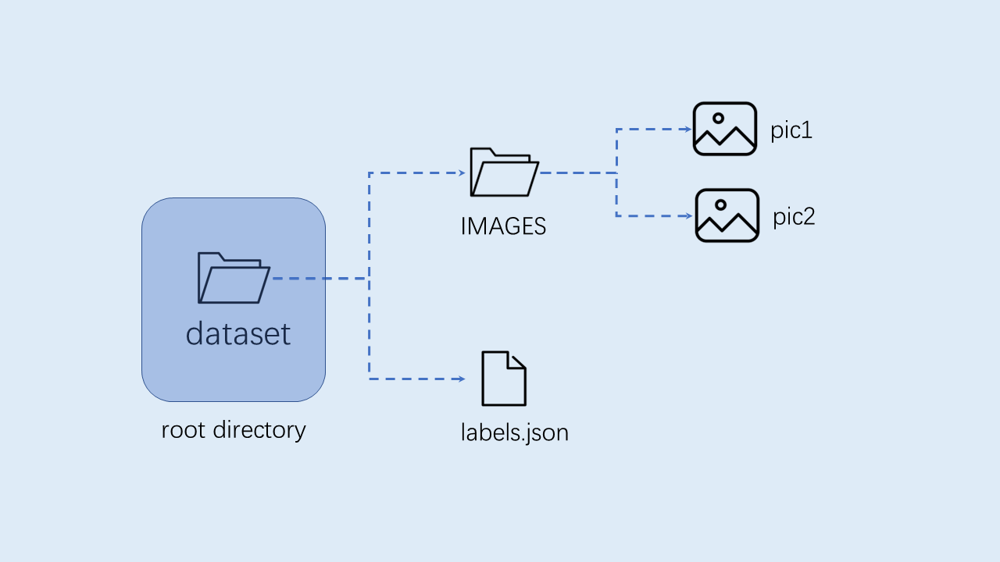

注意：图像分类必须按照上述格式进行组织。

### 模型训练和测试

本节内容在训练环境中实现。

#### 创建虚拟环境

开启命令终端：

```Shell
conda create -n myenv python=3.9
conda activate myenv
```

#### 安装python库

按照项目内的requriements.txt安装训练所用的python库,等待安装：

```Shell
pip install -r requriements.txt
```

在requriments.txt中会安装模型转换的包nncase和nncase-kpu，nncase 是一个为 AI 加速器设计的神经网络编译器。

#### 配置训练参数

给出的训练脚本中配置文件yaml/config.yaml设置如下：

```YAML
dataset:
  root_folder: ../data/veg_cls # 分类数据集路径
  split: true # 是否重新执行拆分，第一次执行必须为true
  train_ratio: 0.7 # 训练集比例
  val_ratio: 0.15 # 验证集比例
  test_ratio: 0.15 # 测试集比例

train:
  device: cuda
  txt_path: ../gen # 拆分过程生成的训练集、验证集、测试集txt文件，标签名称文件、校正集文件
  image_size: [ 224,224 ] # 分辨率
  mean: [ 0.485, 0.456, 0.406 ]
  std: [ 0.229, 0.224, 0.225 ]
  epochs: 10
  batchsize: 8
  learningrate: 0.001
  save_path: ../checkpoints # 模型保存路径

inference:
  mode: image # 推理模式，分为image和video; image模式下可推理单张图片和目录下所有图片，video调用摄像头实现推理
  inference_model: best # 分为best和last，分别调用checkpoints下的best.pth和last.pth进行推理
  images_path: ../data/veg_cls/bocai # 如果该路径为图片路径，则进行单张图片推理；如果该路径为目录，则对目录下所有图片进行推理

deploy:
  chip: k230 # 芯片类型，分为“k230”和“cpu”两种
  ptq_option: 0 # 量化类型，0为uint8，1，2，3，4为uint16的不同形式
```

#### 模型训练

进入到工程的scripts目录，执行训练代码：

```Shell
python3 main.py
```

如果训练成功，在配置文件的model_save_dir目录下可以找到训练好的last.pth、best.pth、best.onnx、best.kmodel。

#### 模型测试

设置配置文件中的inference部分，设置测试配置，执行测试代码：

```shell
python3 inference.py
```

#### 准备文件

后面部署步骤需要用到的文件包括：

（1）checkpoints/best.kmodel;

（2）gen/labels.txt;

（3）待测试图片test.jpg;

### CANMV K230镜像编译和烧录

#### Docker环境搭建

```Shell
# 下载docker编译镜像
docker pull ghcr.io/kendryte/k230_sdk
# 可以使用以下命令确认docker镜像是否拉取成功
docker images | grep ghcr.io/kendryte/k230_sdk
# 下载1.0.1版本sdk
git clone -b v1.0.1 --single-branch https://github.com/kendryte/k230_sdk.git
cd k230_sdk
# 下载工具链Linux和RT-Smart toolchain, buildroot package, AI package等
make prepare_sourcecode
# 创建docker容器，$(pwd):$(pwd)表示系统当前目录映射到docker容器内部的相同目录下，将系统下的工具链目录映射到docker容器内部的/opt/toolchain目录下
docker run -u root -it -v $(pwd):$(pwd) -v $(pwd)/toolchain:/opt/toolchain -w $(pwd) ghcr.io/kendryte/k230_sdk /bin/bash
```

#### 镜像编译

```Shell
# 在docker容器中编译镜像耗时较长，请耐心等待完成
make CONF=k230_canmv_defconfig
```

#### 镜像烧录

编译结束后在output/k230_canmv_defconfig/images目录下可以找到编译好的镜像文件：

```shell
k230_evb_defconfig/images
 ├── big-core
 ├── little-core
 ├── sysimage-sdcard.img    # SD卡启动镜像
 └──  sysimage-sdcard.img.gz # SD卡启动镜像压缩包
```

CANMV K230 支持SDCard启动方式。为方便开发，建议您准备一张TF卡(Micro SD卡)。

**Linux:** 如使用Linux烧录TF卡,需要先确认SD卡在系统中的名称/dev/sdx, 并替换如下命令中的/dev/sdx

sudo dd if=sysimage-sdcard.img of=/dev/sdx bs=1M oflag=sync

**Windows:** 如使用Windows烧录, 建议使用[the balena Etcher](https://etcher.balena.io/)工具。将生成的sysimage-sdcard.img下载到本地，使用烧录工具the balena Etcher进行烧录。


烧录成功后会弹出通知消息。在烧录前最好将SD卡格式化。

### 上电启动开发板

安装MobaXterm实现串口通信，MobaXterm下载地址:<https://mobaxterm.mobatek.net>。


将烧录完成的SD卡插入进开板板卡槽中，HDMI输出连显示器，百兆网口连以太网，POWER连串口并供电。

系统上电后，默认会有**两个串口设备**，可分别用于访问小核Linux和大核RTSmart

小核Linux默认用户名root，密码为空。大核RTSmart系统中开机会自动启动一个应用程序，可按`q`键退出至命令提示符终端。

### C++代码编译

完成上述开发板的准备工作后，我们可以使用C++编写自己的代码，下面以图像分类任务为例，给出相关图像分类任务的示例代码，并进行解析。示例代码参考:<https://github.com/kendryte/K230_training_scripts/tree/main/end2end_cls_doc/k230_code>。

#### 代码结构

```shell
k230_code
├── cmake
│    ├── link.lds #链接脚本
│    ├── Riscv64.cmake
├── k230_deploy
│    ├── ai_base.cc # 模型部署基类实现
│    ├── ai_base.h # 模型部署基类，封装了nncase加载、input设置、模型推理、获取output操作，后续具体任务开发只需关注模型的前处理、后处理即可
│    ├── classification.cc # 图像分类code类实现
│    ├── classification.h # 图像分类任务类定义，继承AIBase，用于封装模型推理的前后处理
│    ├── main.cc # 主函数，参数解析，初始化Classification类示例，实现上板功能
│    ├── scoped_timing.hpp # 时间测试工具
│    ├── utils.cc # 工具类实现
│    ├── utils.h # 工具类, 封装了图像预处理和图像分类的常用函数，包括读取二进制文件、保存图片、图像处理、结果绘制等，用户可根据自己需求丰富该文件
│    ├── vi_vo.h # 视频输入输出头文件
│    ├── CMakeLists.txt # CMake脚本用于构建一个使用C/C++源文件的可执行文件，并链接到各种库
├── build_app.sh # 编译脚本，使用交叉编译工具链编译k230_deploy工程
└── CMakeLists.txt # CMake脚本用于构建 nncase_sdk 的项目工程
```

#### 核心代码

当您得到kmodel模型之后，具体AI上板代码包括：sensor&display初始化、kmodel加载、模型输入输出设置、获取图像、输入数据加载、输入数据预处理、模型推理、模型输出获取、输出后处理、OSD显示等步骤。如图所示：

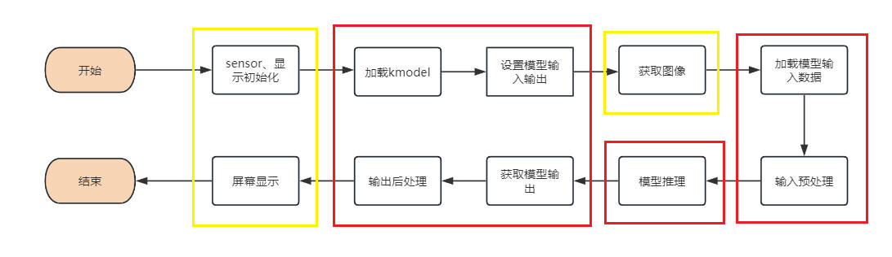

图中黄框部分在SDK编译章节的示例2给出了示例代码，下面针对红框部分，介绍如何实现AI开发。

在上述过程中，kmodel加载、模型输入设置、模型推理、模型输出获取是所有任务的共有步骤。我们对此做了封装，ai_base.h和ai_base.cc可以直接拷贝使用。

ai_base.h定义了AIBase基类以及共有操作的接口：

```c++
#ifndef AI_BASE_H
#define AI_BASE_H
#include <vector>
#include <string>
#include <fstream>
#include <nncase/runtime/interpreter.h>
#include "scoped_timing.hpp"

using std::string;
using std::vector;
using namespace nncase::runtime;

/**
 * @brief AI基类，封装nncase相关操作
 * 主要封装了nncase的加载、设置输入、运行、获取输出操作，后续开发demo只需要关注模型的前处理、后处理即可
 */
class AIBase
{
public:
    /**
     * @brief AI基类构造函数，加载kmodel,并初始化kmodel输入、输出
     * @param kmodel_file kmodel文件路径
     * @param debug_mode  0（不调试）、 1（只显示时间）、2（显示所有打印信息）None
     * @return None
     */
    AIBase(const char *kmodel_file,const string model_name, const int debug_mode = 1);
    /**
     * @brief AI基类析构函数
     * @return None
    */
    ~AIBase();

    /**
     * @brief 设置kmodel输入
     * @param buf 输入数据指针
     * @param size 输入数据大小
     * @return None
     */
    void set_input(const unsigned char *buf, size_t size);

    /**
     * @brief 根据索引获取kmodel输入tensor
     * @param idx 输入数据索引
     * @return None
     */
    runtime_tensor get_input_tensor(size_t idx);

    /**
     * @brief 设置模型的输入tensor
     * @param idx 输入数据索引
     * @param tensor 输入tensor
     */
    void set_input_tensor(size_t idx, runtime_tensor &tensor);

    /**
     * @brief 初始化kmodel输出
     * @return None
     */
    void set_output();

    /**
     * @brief 推理kmodel
     * @return None
     */
    void run();

    /**
     * @brief 获取kmodel输出，结果保存在对应的类属性中
     * @return None
     */
    void get_output();


protected:
    string model_name_;                    // 模型名字
    int debug_mode_;                       // 调试模型，0（不打印），1（打印时间），2（打印所有）
    vector<float *> p_outputs_;            // kmodel输出对应的指针列表
    vector<vector<int>> input_shapes_;     //{{N,C,H,W},{N,C,H,W}...}
    vector<vector<int>> output_shapes_;    //{{N,C,H,W},{N,C,H,W}...}} 或 {{N,C},{N,C}...}}等
    vector<int> each_input_size_by_byte_;  //{0,layer1_length,layer1_length+layer2_length,...}
    vector<int> each_output_size_by_byte_; //{0,layer1_length,layer1_length+layer2_length,...}
    
private:
    /**
     * @brief 首次初始化kmodel输入，并获取输入shape
     * @return None
     */
    void set_input_init();

    /**
     * @brief 首次初始化kmodel输出，并获取输出shape
     * @return None
     */
    void set_output_init();

    vector<unsigned char> kmodel_vec_; // 通过读取kmodel文件得到整个kmodel数据，用于传给kmodel解释器加载kmodel
    interpreter kmodel_interp_; // kmodel解释器，从kmodel文件构建，负责模型的加载、输入输出设置和推理
};
#endif
```

ai_base.cc是ai_base.h中定义所有接口的具体实现。

```c++
/*
ai_base.h中AIBase类定义接口的具体实现
*/
#include "ai_base.h"
#include <iostream>
#include <cassert>
#include "utils.h"

using std::cout;
using std::endl;
using namespace nncase;
using namespace nncase::runtime::detail;

/*AIBase构造函数*/
AIBase::AIBase(const char *kmodel_file,const string model_name, const int debug_mode) : debug_mode_(debug_mode),model_name_(model_name)
{
    if (debug_mode > 1)
        cout << "kmodel_file:" << kmodel_file << endl;
    std::ifstream ifs(kmodel_file, std::ios::binary);//读入kmodel
    kmodel_interp_.load_model(ifs).expect("Invalid kmodel");//kmodel解释器加载kmodel
    set_input_init();
    set_output_init();
}

/*析构函数*/
AIBase::~AIBase()
{
}

/*
首次初始化kmodel输入
*/
void AIBase::set_input_init()
{
    ScopedTiming st(model_name_ + " set_input init", debug_mode_);//计时
    int input_total_size = 0;
    each_input_size_by_byte_.push_back(0); // 先补0,为之后做准备
    for (int i = 0; i < kmodel_interp_.inputs_size(); ++i)
    {
        auto desc = kmodel_interp_.input_desc(i);//索引为i的输入描述
        auto shape = kmodel_interp_.input_shape(i);//索引为i的输入shape
        auto tensor = host_runtime_tensor::create(desc.datatype, shape, hrt::pool_shared).expect("cannot create input tensor");//创建输入tensor
        kmodel_interp_.input_tensor(i, tensor).expect("cannot set input tensor");//绑定tensor到模型输入
        vector<int> in_shape = {shape[0], shape[1], shape[2], shape[3]};
        input_shapes_.push_back(in_shape);//存储输入shape
        int dsize = shape[0] * shape[1] * shape[2] * shape[3];//输入总字节数
        if (debug_mode_ > 1)
            cout << "input shape:" << shape[0] << " " << shape[1] << " " << shape[2] << " " << shape[3] << endl;
        if (desc.datatype == 0x06)//输入数据为uint8类型
        {
            input_total_size += dsize;
            each_input_size_by_byte_.push_back(input_total_size);
        }
        else if (desc.datatype == 0x0B)//输入数据为float32类型
        {
            input_total_size += (dsize * 4);
            each_input_size_by_byte_.push_back(input_total_size);
        }
        else
            assert(("kmodel input data type supports only uint8, float32", 0));
    }
    each_input_size_by_byte_.push_back(input_total_size); // 最后一个保存总大小
}

/*
设置模型的输入数据,加载模型输入的具体数据，和set_input_init的区别是是否有数据拷贝过程
*/
void AIBase::set_input(const unsigned char *buf, size_t size)
{
    //检查输入数据大小是否和模型要求大小相匹配
    if (*each_input_size_by_byte_.rbegin() != size)
        cout << "set_input:the actual input size{" + std::to_string(size) + "} is different from the model's required input size{" + std::to_string(*each_input_size_by_byte_.rbegin()) + "}" << endl;
    assert((*each_input_size_by_byte_.rbegin() == size));
    //计时
    ScopedTiming st(model_name_ + " set_input", debug_mode_);
    //循环遍历模型输入
    for (size_t i = 0; i < kmodel_interp_.inputs_size(); ++i)
    {
        //获取模型的输入描述和形状
        auto desc = kmodel_interp_.input_desc(i);
        auto shape = kmodel_interp_.input_shape(i);
        //创建tensor
        auto tensor = host_runtime_tensor::create(desc.datatype, shape, hrt::pool_shared).expect("cannot create input tensor");
        //将输入tensor映射到可写区域
        auto mapped_buf = std::move(hrt::map(tensor, map_access_::map_write).unwrap()); // mapped_buf实际是有缓存数据的
        //拷贝数据到tensor的缓冲区
        memcpy(reinterpret_cast<void *>(mapped_buf.buffer().data()), buf, each_input_size_by_byte_[i + 1] - each_input_size_by_byte_[i]);
        //解除映射
        auto ret = mapped_buf.unmap();
        ret = hrt::sync(tensor, sync_op_t::sync_write_back, true);
        if (!ret.is_ok())
        {
            std::cerr << "hrt::sync failed" << std::endl;
            std::abort();
        }
        //将tensor和模型的输入绑定
        kmodel_interp_.input_tensor(i, tensor).expect("cannot set input tensor");
    }
}

/*
按照索引获取模型的输入tensor
*/
runtime_tensor AIBase::get_input_tensor(size_t idx)
{
    return kmodel_interp_.input_tensor(idx).expect("cannot get input tensor");
}

/*
按照索引设置模型的输入tensor
*/
void AIBase::set_input_tensor(size_t idx, runtime_tensor &tensor)
{
    ScopedTiming st(model_name_ + " set_input_tensor", debug_mode_);
    kmodel_interp_.input_tensor(idx, tensor).expect("cannot set input tensor");
}

/*
首次初始化kmodel输出
*/
void AIBase::set_output_init()
{
    //计时
    ScopedTiming st(model_name_ + " set_output_init", debug_mode_);
    each_output_size_by_byte_.clear();
    int output_total_size = 0;
    each_output_size_by_byte_.push_back(0);
    //循环遍历模型的输出
    for (size_t i = 0; i < kmodel_interp_.outputs_size(); i++)
    {
        //获取输出描述和形状
        auto desc = kmodel_interp_.output_desc(i);
        auto shape = kmodel_interp_.output_shape(i);
        vector<int> out_shape;
        int dsize = 1;
        for (int j = 0; j < shape.size(); ++j)
        {
            out_shape.push_back(shape[j]);
            dsize *= shape[j];
            if (debug_mode_ > 1)
                cout << shape[j] << ",";
        }
        if (debug_mode_ > 1)
            cout << endl;
        output_shapes_.push_back(out_shape);
        //获取数据的总大小
        if (desc.datatype == 0x0B)
        {
            output_total_size += (dsize * 4);
            each_output_size_by_byte_.push_back(output_total_size);
        }
        else
            assert(("kmodel output data type supports only float32", 0));
        //创建tensor
        auto tensor = host_runtime_tensor::create(desc.datatype, shape, hrt::pool_shared).expect("cannot create output tensor");
        //将tensor和模型的输出绑定
        kmodel_interp_.output_tensor(i, tensor).expect("cannot set output tensor");
    }
}

/*
设置kmodel模型的输出
*/
void AIBase::set_output()
{
    ScopedTiming st(model_name_ + " set_output", debug_mode_);
    //循环将输出tensor和模型的输出绑定
    for (size_t i = 0; i < kmodel_interp_.outputs_size(); i++)
    {
        auto desc = kmodel_interp_.output_desc(i);
        auto shape = kmodel_interp_.output_shape(i);
        auto tensor = host_runtime_tensor::create(desc.datatype, shape, hrt::pool_shared).expect("cannot create output tensor");
        kmodel_interp_.output_tensor(i, tensor).expect("cannot set output tensor");
    }
}

/*
调用kmodel_interp_.run()实现模型推理
*/
void AIBase::run()
{
    ScopedTiming st(model_name_ + " run", debug_mode_);
    kmodel_interp_.run().expect("error occurred in running model");
}

/*
获取模型的输出(float指针形式，后处理时由后处理的具体要求取出)，为后续后处理做准备
*/
void AIBase::get_output()
{
    ScopedTiming st(model_name_ + " get_output", debug_mode_);
    //p_outputs_存储模型的输出的指针，可以有多个输出
    p_outputs_.clear();
    for (int i = 0; i < kmodel_interp_.outputs_size(); i++)
    {
        //获取输出tensor
        auto out = kmodel_interp_.output_tensor(i).expect("cannot get output tensor");
        //将输出tensor映射到主机内存
        auto buf = out.impl()->to_host().unwrap()->buffer().as_host().unwrap().map(map_access_::map_read).unwrap().buffer();
        //将映射后的数据转换为float指针
        float *p_out = reinterpret_cast<float *>(buf.data());
        p_outputs_.push_back(p_out);
    }
}
```

不同任务场景的前处理和后处理有所不同，比如分类使用softmax计算类别概率，目标检测要做nms；因此您可以定义您的任务场景类继承AIBase类，将针对该任务的前处理和后处理代码进行封装。以图像分类为例：

classification.h中的Classification类继承自AIBase类，实现了图像分类任务的类定义，主要定义了图像分类模型的前处理、推理、后处理接口。初始化ai2d构建器实现图像预处理。还定义了一些图像分类任务的变量，比如分类阈值、类别名称、类别数等。

```c++
#ifndef _CLASSIFICATION_H
#define _CLASSIFICATION_H
#include "utils.h"
#include "ai_base.h" 

/**
 * @brief 分类任务
 * 主要封装了对于每一帧图片，从预处理、运行到后处理给出结果的过程
 */
class Classification : public AIBase
{
    public:
    /**
    * @brief Classification构造函数，加载kmodel,并初始化kmodel输入、输出分类阈值
    * @param kmodel_path kmodel路径
    * @param image_path 推理图片路径（静态图使用）
    * @param labels 类别名称列表
    * @param cls_thresh 分类阈值
    * @param debug_mode  0（不调试）、 1（只显示时间）、2（显示所有打印信息）
    * @return None
    */
    Classification(string &kmodel_path, string &image_path,std::vector<std::string> labels, float cls_thresh,const int debug_mode);

    /**
    * @brief Classification构造函数，加载kmodel,并初始化kmodel输入、输出分类阈值
    * @param kmodel_path kmodel路径
    * @param image_path  推理图片路径（静态图使用）
    * @param labels      类别名称列表
    * @param cls_thresh  分类阈值
    * @param isp_shape   isp输入大小（chw）
    * @param vaddr       isp对应虚拟地址
    * @param paddr       isp对应物理地址
    * @param debug_mode  0（不调试）、 1（只显示时间）、2（显示所有打印信息）
    * @return None
    */
    Classification(string &kmodel_path, string &image_path,std::vector<std::string> labels,float cls_thresh, FrameCHWSize isp_shape, uintptr_t vaddr, uintptr_t paddr,const int debug_mode);
    
    /**
    * @brief Classification析构函数
    * @return None
    */
    ~Classification();

    /**
    * @brief 静态图片预处理
    * @param ori_img 原始图片
    * @return None
    */
    void pre_process(cv::Mat ori_img);

    /**
    * @brief 视频流预处理（ai2d for isp）
    * @return None
    */
    void pre_process();

    /**
    * @brief kmodel推理
    * @return None
    */
    void inference();

    /**
    * @brief kmodel推理结果后处理
    * @param results 后处理之后的基于原始图像的分类结果集合
    * @return None
    */
    void post_process(vector<cls_res> &results);
    
    private:

    /**
    * @brief 计算exp
    * @param x 自变量值
    * @return 返回计算exp后的结果
    */
    float fast_exp(float x);

    /**
    * @brief 计算sigmoid
    * @param x 自变量值
    * @return 返回计算sigmoid后的结果
    */
    float sigmoid(float x);

    std::unique_ptr<ai2d_builder> ai2d_builder_; // ai2d构建器
    runtime_tensor ai2d_in_tensor_;              // ai2d输入tensor
    runtime_tensor ai2d_out_tensor_;             // ai2d输出tensor
    uintptr_t vaddr_;                            // isp的虚拟地址
    FrameCHWSize isp_shape_;                     // isp对应的地址大小

    float cls_thresh;      //分类阈值
    vector<string> labels; //类别名字
    int num_class;         //类别数

    float* output;         //读取kmodel输出，float指针类型
};
#endif
```

在classification.cc中实现上述接口：

```c++
#include "classification.h"

/*
静态图推理，构造函数
*/
Classification::Classification(std::string &kmodel_path, std::string &image_path,std::vector<std::string> labels_,float cls_thresh_,const int debug_mode)
:AIBase(kmodel_path.c_str(),"Classification", debug_mode)
{   
    cls_thresh=cls_thresh_;
    labels=labels_;
    num_class = labels.size();
    ai2d_out_tensor_ = this -> get_input_tensor(0);//继承自AIBase的接口
}

/*
视频流推理，构造函数
*/
Classification::Classification(std::string &kmodel_path, std::string &image_path,std::vector<std::string> labels_,float cls_thresh_, FrameCHWSize isp_shape, uintptr_t vaddr, uintptr_t paddr,const int debug_mode)
:AIBase(kmodel_path.c_str(),"Classification", debug_mode)
{
    cls_thresh=cls_thresh_;
    labels=labels_;
    num_class = labels.size();
    vaddr_ = vaddr;
    isp_shape_ = isp_shape;
    dims_t in_shape{1, isp_shape.channel, isp_shape.height, isp_shape.width};
    ai2d_in_tensor_ = hrt::create(typecode_t::dt_uint8, in_shape, hrt::pool_shared).expect("create ai2d input tensor failed");
    ai2d_out_tensor_ = this -> get_input_tensor(0);
    Utils::resize(ai2d_builder_, ai2d_in_tensor_, ai2d_out_tensor_);
}

/*
析构函数
*/
Classification::~Classification()
{
}

/*
静态图预处理函数
*/
void Classification::pre_process(cv::Mat ori_img)
{
    //计时
    ScopedTiming st(model_name_ + " pre_process image", debug_mode_);
    std::vector<uint8_t> chw_vec;
    //bgr转rgb,hwc转chw
    Utils::bgr2rgb_and_hwc2chw(ori_img, chw_vec);
    //resize
    Utils::resize({ori_img.channels(), ori_img.rows, ori_img.cols}, chw_vec, ai2d_out_tensor_);
}

/*
视频流预处理，具体参见ai2d应用部分
*/
void Classification::pre_process()
{
    ScopedTiming st(model_name_ + " pre_process video", debug_mode_);
    size_t isp_size = isp_shape_.channel * isp_shape_.height * isp_shape_.width;
    auto buf = ai2d_in_tensor_.impl()->to_host().unwrap()->buffer().as_host().unwrap().map(map_access_::map_write).unwrap().buffer();
    memcpy(reinterpret_cast<char *>(buf.data()), (void *)vaddr_, isp_size);
    hrt::sync(ai2d_in_tensor_, sync_op_t::sync_write_back, true).expect("sync write_back failed");
    ai2d_builder_->invoke(ai2d_in_tensor_, ai2d_out_tensor_).expect("error occurred in ai2d running");
}

/*
推理函数，run()和get_output()继承自AIBase
*/
void Classification::inference()
{
    this->run();
    this->get_output();
}

/*
后处理计算 exp
*/
float Classification::fast_exp(float x)
{
    union {
        uint32_t i;
        float f;
    } v{};
    v.i = (1 << 23) * (1.4426950409 * x + 126.93490512f);
    return v.f;
}

/*
后处理计算 sigmoid
*/
float Classification::sigmoid(float x)
{
    return 1.0f / (1.0f + fast_exp(-x));
}

/*
后处理函数
*/
void Classification::post_process(vector<cls_res> &results)
{
    ScopedTiming st(model_name_ + " post_process", debug_mode_);
    //p_outputs_中存放的是float类型指针，指向输出
    output = p_outputs_[0];
    cls_res b;
    //如果是多分类
    if(num_class > 2){
        float sum = 0.0;
        for (int i = 0; i < num_class; i++){
            sum += exp(output[i]);
        }
        b.score = cls_thresh;
        int max_index;
        //softmax处理
        for (int i = 0; i < num_class; i++)
        {
            output[i] = exp(output[i]) / sum;
        }
        max_index = max_element(output,output+num_class) - output; 
        if (output[max_index] >= b.score)
        {
            b.label = labels[max_index];
            b.score = output[max_index];
            results.push_back(b);
        }
    }
    else// 2分类
    {
        float pre = sigmoid(output[0]);
        if (pre > cls_thresh)
        {
            b.label = labels[0];
            b.score = pre;
        }
        else{
            b.label = labels[1];
            b.score = 1 - pre;
        }
        results.push_back(b);
    }
}
```

在上述代码中的预处理部分，使用了一些工具函数，我们将其封装在utils.h中：

```c++
#ifndef UTILS_H
#define UTILS_H
#include <algorithm>
#include <vector>
#include <iostream>
#include <fstream>
#include <opencv2/core.hpp>
#include <opencv2/highgui.hpp>
#include <opencv2/imgcodecs.hpp>
#include <opencv2/imgproc.hpp>
#include <nncase/functional/ai2d/ai2d_builder.h>
#include <string>
#include <string.h>
#include <cmath>
#include <stdio.h>
#include <stdlib.h>
#include <sys/types.h>
#include <sys/stat.h>
#include <fcntl.h>
#include <sys/ioctl.h>
#include <unistd.h>
#include <stdint.h>
#include <random>


using namespace nncase;
using namespace nncase::runtime;
using namespace nncase::runtime::k230;
using namespace nncase::F::k230;


using namespace std;
using namespace cv;
using cv::Mat;
using std::cout;
using std::endl;
using std::ifstream;
using std::vector;

#define STAGE_NUM 3
#define STRIDE_NUM 3
#define LABELS_NUM 1

/**
 * @brief 分类结果结构
 */
typedef struct cls_res
{
    float score;//分类分数
    string label;//分类标签结果
}cls_res;

/**
 * @brief 单张/帧图片大小
 */
typedef struct FrameSize
{
    size_t width;  // 宽
    size_t height; // 高
} FrameSize;

/**
 * @brief 单张/帧图片大小
 */
typedef struct FrameCHWSize
{
    size_t channel; // 通道
    size_t height;  // 高
    size_t width;   // 宽
} FrameCHWSize;

/**
 * @brief AI工具类
 * 封装AI常用的函数，包括二进制文件读取、文件保存、图片预处理等操作
 */
class Utils
{
public:
    /**
     * @brief 对图片resize
     * @param ori_img             原始图片
     * @param frame_size      需要resize图像的宽高
     * @param padding         需要padding的像素，默认是cv::Scalar(104, 117, 123),BGR
     * @return                处理后图像
     */
    static cv::Mat resize(const cv::Mat ori_img, const FrameSize &frame_size);


    /**
     * @brief 将BGR图片从hwc转为chw
     * @param ori_img          原始图片
     * @param chw_vec          转为chw后的数据
     * @return None
     */
    static void bgr2rgb_and_hwc2chw(cv::Mat &ori_img, std::vector<uint8_t> &chw_vec);

    /*************************for ai2d ori_img process********************/
    // resize
    /**
     * @brief resize函数，对chw数据进行resize
     * @param ori_shape        原始数据chw
     * @param chw_vec          原始数据
     * @param ai2d_out_tensor  ai2d输出
     * @return None
     */
    static void resize(FrameCHWSize ori_shape, std::vector<uint8_t> &chw_vec, runtime_tensor &ai2d_out_tensor);

    /**
     * @brief resize函数
     * @param builder          ai2d构建器，用于运行ai2d
     * @param ai2d_in_tensor   ai2d输入
     * @param ai2d_out_tensor  ai2d输出
     * @return None
     */
    static void resize(std::unique_ptr<ai2d_builder> &builder, runtime_tensor &ai2d_in_tensor, runtime_tensor &ai2d_out_tensor);

    /**
     * @brief 将分类任务的结果绘制到图像上
     * @param frame         原始图像
     * @param results       分类的结果
     * @return None
     */
    static void draw_cls_res(cv::Mat& frame, vector<cls_res>& results);

    /**
     * @brief 将分类任务的结果绘制到屏幕的osd中
     * @param frame                 原始图像
     * @param results               分类的结果
     * @param osd_frame_size        osd的宽高
     * @param sensor_frame_size     sensor的宽高
     * @return None
     */
    static void draw_cls_res(cv::Mat& frame, vector<cls_res>& results, FrameSize osd_frame_size, FrameSize sensor_frame_size);
};
#endif
```

如果您有需要还可以添加其他的工具函数。下面是utils.cc文件，完成工具类接口的实现：

```c++
#include <iostream>
#include "utils.h"

using std::ofstream;
using std::vector;

auto cache = cv::Mat::zeros(1, 1, CV_32FC1);

cv::Mat Utils::resize(const cv::Mat img, const FrameSize &frame_size)
{
    cv::Mat cropped_img;
    cv::resize(img, cropped_img, cv::Size(frame_size.width, frame_size.height), cv::INTER_LINEAR);
    return cropped_img;
}

void Utils::bgr2rgb_and_hwc2chw(cv::Mat &ori_img, std::vector<uint8_t> &chw_vec)
{
    // for bgr format
    std::vector<cv::Mat> bgrChannels(3);
    cv::split(ori_img, bgrChannels);
    for (auto i = 2; i > -1; i--)
    {
        std::vector<uint8_t> data = std::vector<uint8_t>(bgrChannels[i].reshape(1, 1));
        chw_vec.insert(chw_vec.end(), data.begin(), data.end());
    }
}

void Utils::resize(FrameCHWSize ori_shape, std::vector<uint8_t> &chw_vec, runtime_tensor &ai2d_out_tensor)
{
    // build ai2d_in_tensor
    dims_t in_shape{1, ori_shape.channel, ori_shape.height, ori_shape.width};
    runtime_tensor ai2d_in_tensor = host_runtime_tensor::create(typecode_t::dt_uint8, in_shape, hrt::pool_shared).expect("cannot create input tensor");

    auto input_buf = ai2d_in_tensor.impl()->to_host().unwrap()->buffer().as_host().unwrap().map(map_access_::map_write).unwrap().buffer();
    memcpy(reinterpret_cast<char *>(input_buf.data()), chw_vec.data(), chw_vec.size());
    hrt::sync(ai2d_in_tensor, sync_op_t::sync_write_back, true).expect("write back input failed");

    // run ai2d
    // ai2d_datatype_t ai2d_dtype{ai2d_format::NCHW_FMT, ai2d_format::NCHW_FMT, typecode_t::dt_uint8, typecode_t::dt_uint8};
    ai2d_datatype_t ai2d_dtype{ai2d_format::NCHW_FMT, ai2d_format::NCHW_FMT, ai2d_in_tensor.datatype(), ai2d_out_tensor.datatype()};
    ai2d_crop_param_t crop_param { false, 30, 20, 400, 600 };
    ai2d_shift_param_t shift_param{false, 0};
    ai2d_pad_param_t pad_param{false, {{0, 0}, {0, 0}, {0, 0}, {0, 0}}, ai2d_pad_mode::constant, {114, 114, 114}};
    ai2d_resize_param_t resize_param{true, ai2d_interp_method::tf_bilinear, ai2d_interp_mode::half_pixel};
    ai2d_affine_param_t affine_param{false, ai2d_interp_method::cv2_bilinear, 0, 0, 127, 1, {0.5, 0.1, 0.0, 0.1, 0.5, 0.0}};

    dims_t out_shape = ai2d_out_tensor.shape();
    ai2d_builder builder { in_shape, out_shape, ai2d_dtype, crop_param, shift_param, pad_param, resize_param, affine_param };
    builder.build_schedule();
    builder.invoke(ai2d_in_tensor,ai2d_out_tensor).expect("error occurred in ai2d running");
}

void Utils::resize(std::unique_ptr<ai2d_builder> &builder, runtime_tensor &ai2d_in_tensor, runtime_tensor &ai2d_out_tensor)
{
    // run ai2d
    ai2d_datatype_t ai2d_dtype{ai2d_format::NCHW_FMT, ai2d_format::NCHW_FMT, ai2d_in_tensor.datatype(), ai2d_out_tensor.datatype()};
    ai2d_crop_param_t crop_param { false, 30, 20, 400, 600 };
    ai2d_shift_param_t shift_param{false, 0};
    ai2d_pad_param_t pad_param{false, {{0, 0}, {0, 0}, {0, 0}, {0, 0}}, ai2d_pad_mode::constant, {114, 114, 114}};
    ai2d_resize_param_t resize_param{true, ai2d_interp_method::tf_bilinear, ai2d_interp_mode::half_pixel};
    ai2d_affine_param_t affine_param{false, ai2d_interp_method::cv2_bilinear, 0, 0, 127, 1, {0.5, 0.1, 0.0, 0.1, 0.5, 0.0}};

    dims_t in_shape = ai2d_in_tensor.shape();
    dims_t out_shape = ai2d_out_tensor.shape();
    builder.reset(new ai2d_builder(in_shape, out_shape, ai2d_dtype, crop_param, shift_param, pad_param, resize_param, affine_param));
    builder->build_schedule();
    builder->invoke(ai2d_in_tensor,ai2d_out_tensor).expect("error occurred in ai2d running");
}


void Utils::draw_cls_res(cv::Mat& frame, vector<cls_res>& results)
{
    double fontsize = (frame.cols * frame.rows * 1.0) / (300 * 250);
    if (fontsize > 2)
    {
        fontsize = 2;
    }

    for(int i = 0; i < results.size(); i++)
    {   
        std::string text = "class: " + results[i].label + ", score: " + std::to_string(round(results[i].score * 100) / 100.0).substr(0, 4);

        cv::putText(frame, text, cv::Point(1, 40), cv::FONT_HERSHEY_SIMPLEX, 0.8, cv::Scalar(255, 255, 0), 2);
        std::cout << text << std::endl;
    }
}

void Utils::draw_cls_res(cv::Mat& frame, vector<cls_res>& results, FrameSize osd_frame_size, FrameSize sensor_frame_size)
{
    double fontsize = (frame.cols * frame.rows * 1.0) / (1100 * 1200);
    for(int i = 0; i < results.size(); i++)
    {   
        std::string text = "class: " + results[i].label + ", score: " + std::to_string(round(results[i].score * 100) / 100.0).substr(0, 4);
        cv::putText(frame, text, cv::Point(1, 40), cv::FONT_HERSHEY_SIMPLEX, 0.8, cv::Scalar(255, 255, 255, 0), 2);
        std::cout << text << std::endl;
    }
}
```

为了便于调试，我们在scoped_timing.hpp中封装了计时类ScopedTiming，用于统计在该类实例生命周期内的耗时。

```c++
#include <chrono>
#include <string>
#include <iostream>

/**
 * @brief 计时类
 * 统计在该类实例生命周期内的耗时
 */
class ScopedTiming
{
public:
    /**
     * @brief ScopedTiming 构造函数,初始化计时对象名称并开始计时
     * @param info 计时对象名称
     * @param enable_profile 是否开始计时
     * @return None
     */
    ScopedTiming(std::string info = "ScopedTiming", int enable_profile = 1)
    : m_info(info), enable_profile(enable_profile)
    {
        if (enable_profile)
        {
            m_start = std::chrono::steady_clock::now();
        }
    }

    /**
     * @brief ScopedTiming析构,结束计时，并打印耗时
     * @return None
     */ 
     ~ScopedTiming()
    {
        if (enable_profile)
        {
            m_stop = std::chrono::steady_clock::now();
            double elapsed_ms = std::chrono::duration<double, std::milli>(m_stop - m_start).count();
            std::cout << m_info << " took " << elapsed_ms << " ms" << std::endl;
        }
    }

private:
    int enable_profile;                            // 是否统计时间
    std::string m_info;                            // 计时对象名称
    std::chrono::steady_clock::time_point m_start; // 计时开始时间
    std::chrono::steady_clock::time_point m_stop;  // 计时结束时间
};
```

main.cc是实现板端推理的主要代码，主要实现解析传入参数，打印使用说明，实现两个不同分支的推理。如果输入的第二个参数是推理图像路径，则调用image_proc函数进行图像推理；如果传入的是None，则调用video_proc函数进行视频流推理。

- 静态图推理代码

```C++
void image_proc_cls(string &kmodel_path, string &image_path,vector<string> labels,float cls_thresh ,int debug_mode)
{
    cv::Mat ori_img = cv::imread(image_path);
    int ori_w = ori_img.cols;
    int ori_h = ori_img.rows;
    //创建任务类实例
    Classification cls(kmodel_path,image_path,labels,cls_thresh,debug_mode);
    //前处理
    cls.pre_process(ori_img);
    //推理
    cls.inference();
    vector<cls_res> results;
    //后处理
    cls.post_process(results);
    Utils::draw_cls_res(ori_img,results);
    cv::imwrite("result_cls.jpg", ori_img);
    
}
```

上述代码是main.cc中的静态图像推理代码部分，首先从图片路径初始化cv::Mat对象ori_img，然后初始化Classification实例cls，调用cls预处理函数pre_process，推理函数reference，后处理函数post_process，最后调用utils.h中的draw_cls_res将结果绘制在图片上并保存为result_cls.jpg。如您需要修改前后处理部分，可在Classification.cc中进行修改，如您想添加其他工具方法，可在utils中定义，并在utils.cc中实现。

- 视频流推理代码可以参考**SDK编译章节**的示例2部分代码。其中AI开发的核心代码为：

```c++
Classification cls(kmodel_path,labels,cls_thresh, {3, ISP_CHN1_HEIGHT, ISP_CHN1_WIDTH}, reinterpret_cast<uintptr_t>(vbvaddr), reinterpret_cast<uintptr_t>(dump_info.v_frame.phys_addr[0]), debug_mode);
vector<cls_res> results;
results.clear();
cls.pre_process();
cls.inference();
cls.post_process(results);
```

为了使用方便，我们对视频流处理部分做了封装，您可以参考示例代码：<[K230_training_scripts/end2end_cls_doc at main · kendryte/K230_training_scripts (github.com)](https://github.com/kendryte/K230_training_scripts/tree/main/end2end_cls_doc)>中k230_code中的vi_vo.h文件和main.cc中的具体实现。

- k230_code/k230_deploy/CMakeLists.txt说明

这是k230_code/k230_deploy目录下的CMakeLists.txt脚本，设置编译的C++文件和生成的elf可执行文件名称，由下面：

```Shell
set(src main.cc utils.cc ai_base.cc classification.cc) 
set(bin main.elf)

include_directories(${PROJECT_SOURCE_DIR})：添加项目的根目录到头文件搜索路径中。
include_directories(${nncase_sdk_root}/riscv64/rvvlib/include)：添加 nncase RISC-V 向量库的头文件目录。
include_directories(${k230_sdk}/src/big/mpp/userapps/api/)：添加 k230 SDK 中的用户应用程序 API 头文件目录。
include_directories(${k230_sdk}/src/big/mpp/include)：添加 k230 SDK 的一般头文件目录。
include_directories(${k230_sdk}/src/big/mpp/include/comm)：添加与通信相关的头文件目录。
include_directories(${k230_sdk}/src/big/mpp/userapps/sample/sample_vo)：添加示例 VO（视频输出）应用程序头文件目录。

link_directories(${nncase_sdk_root}/riscv64/rvvlib/): 添加链接器搜索路径，指向 nncase RISC-V 向量库的目录。
add_executable(${bin} ${src}): 创建一个可执行文件，将之前设置的源文件列表作为输入。
target_link_libraries(${bin} ...)：设置可执行文件需要链接的库。列表中列出了各种库，包括 nncase 相关的库、k230 SDK 的库，以及其他一些库。
target_link_libraries(${bin} opencv_imgproc opencv_imgcodecs opencv_core zlib libjpeg-turbo libopenjp2 libpng libtiff libwebp csi_cv): 将一些 OpenCV 相关的库和其他一些库链接到可执行文件中。
install(TARGETS ${bin} DESTINATION bin): 安装生成的可执行文件到指定的目标路径（bin 目录）中。
```

- k230_code/CMakeLists.txt说明

```Shell
cmake_minimum_required(VERSION 3.2)
project(nncase_sdk C CXX)

set(nncase_sdk_root "${PROJECT_SOURCE_DIR}/../../nncase/")
set(k230_sdk ${nncase_sdk_root}/../../../)
set(CMAKE_EXE_LINKER_FLAGS "-T ${PROJECT_SOURCE_DIR}/cmake/link.lds --static")

# set opencv
set(k230_opencv ${k230_sdk}/src/big/utils/lib/opencv)
include_directories(${k230_opencv}/include/opencv4/)
link_directories(${k230_opencv}/lib ${k230_opencv}/lib/opencv4/3rdparty)

# set mmz
link_directories(${k230_sdk}/src/big/mpp/userapps/lib)

# set nncase
include_directories(${nncase_sdk_root}/riscv64)
include_directories(${nncase_sdk_root}/riscv64/nncase/include)
include_directories(${nncase_sdk_root}/riscv64/nncase/include/nncase/runtime)
link_directories(${nncase_sdk_root}/riscv64/nncase/lib/)

add_subdirectory(k230_deploy)
```

这是k230_code目录下的CMakeLists.txt脚本。该脚本重点关注如下部分:

```Shell
set(nncase_sdk_root "${PROJECT_SOURCE_DIR}/../../nncase/"):设置nncase目录
set(k230_sdk ${nncase_sdk_root}/../../../):设置k230_sdk的目录，当前是从nncase目录的三级父目录得到
set(CMAKE_EXE_LINKER_FLAGS "-T ${PROJECT_SOURCE_DIR}/cmake/link.lds --static"):设置链接脚本路径，链接脚本放于k230_code/cmake下
...
add_subdirectory(k230_deploy): 添加待编译的工程子目录，如您要编译自己的工程，可以更换该行
```

- k230_code/build_app.sh说明

```Shell
#!/bin/bash
set -x

# set cross build toolchain
# 将交叉编译工具链的路径添加到系统的 PATH 环境变量中，以便在后续的命令中使用。该工具链是使用的大核编译工具链。
export PATH=$PATH:/opt/toolchain/riscv64-linux-musleabi_for_x86_64-pc-linux-gnu/bin/

clear
rm -rf out
mkdir out
pushd out
cmake -DCMAKE_BUILD_TYPE=Release                 \
      -DCMAKE_INSTALL_PREFIX=`pwd`               \
      -DCMAKE_TOOLCHAIN_FILE=cmake/Riscv64.cmake \
      ..

make -j && make install
popd

# 生成的main.elf可以在k230_code目录下的k230_bin文件夹下找到
k230_bin=`pwd`/k230_bin
rm -rf ${k230_bin}
mkdir -p ${k230_bin}

if [ -f out/bin/main.elf ]; then
      cp out/bin/main.elf ${k230_bin}
fi
```

#### 代码编译

将项目中的k230_code文件夹拷贝到k230_sdk目录下的src/big/nncase下，执行编译脚本，将C++代码编译成main.elf可执行文件。

```Shell
# 在k230_SDK根目录下执行
make CONF=k230_canmv_defconfig prepare_memory
# 回到当前项目目录，赋予权限
chmod +x build_app.sh
./build_app.sh
```

#### 准备ELF文件

后面部署步骤需要用到的文件包括：

1. k230_code/k230_bin/main.elf;

### 网络配置与文件传输

将待使用文件拷贝到开发板上有两种方式可供选择。一种是tftp传输方法，一种是scp传输方法。

#### tftp文件传输

- Windows系统PC端网络配置

控制面板->网络和共享中心->更改适配器设置->以太网网卡->右键属性->选中(TCP/IPv4)->属性

配置IP地址、掩码、网关，配置DNS服务器地址：


- 开发板网络配置

进入小核命令行，执行：

```Shell
# 查看是否有eth0
ifconfig
# 配置开发板IP，和PC在同一网段下
ifconfig eth0 192.168.1.22
# 查看IP配置
ifconfig
```

- 工具：tftpd64

安装tftp通信工具，下载地址：<https://bitbucket.org/phjounin/tftpd64/downloads/>

启动tftpd64，配置待传输文件存放目录和服务网卡

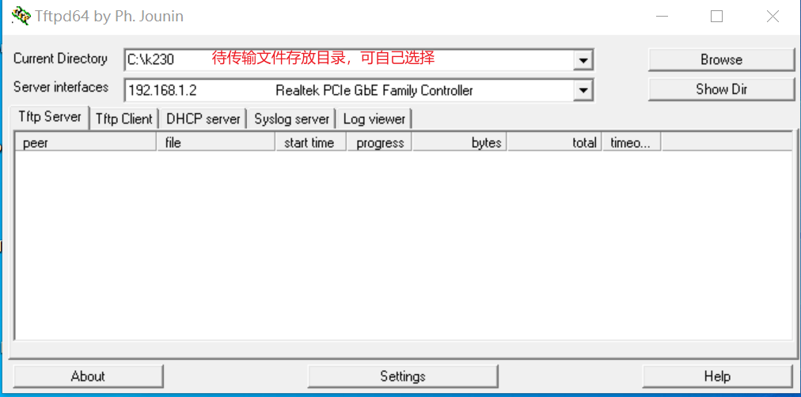

- sharefs说明

```Shell
# 进入小核根目录
cd /
# 查看目录
ls
# sharefs目录是大小核共用目录，因此从小核拷贝到sharefs目录下的文件对大核也可见
```

- 文件传输

```Shell
# 以下代码在小核串口执行
# 将PC上tftpd64配置文件存放目录中的文件传输至开发板的当前目录
tftp -g -r your_file 192.168.1.2
# 将开发板当前目录下的文件传输至tftpd64配置文件存放目录
tftp -p -r board_file 192.168.1.2
```

#### scp文件传输

在Linux系统中，PC正常连接网络，开发板可以通过网线连接PC所在网关下其他网口，通过scp命令实现文件传输。

开发板上电，进入大小核COM界面，在小核执行scp传输命令：

```Shell
# 从PC拷贝文件至开发板
scp 用户名@域名或IP:文件所在目录 开发板目的目录
#拷贝文件夹
scp -r 用户名@域名或IP:文件所在目录 开发板目的目录
# 从开发板拷贝文件至PC
scp 开发板待拷贝目录 用户名@域名或IP:PC目的目录
# 拷贝文件夹
scp -r 开发板待拷贝目录 用户名@域名或IP:PC目的目录
```

### K230端部署

#### 板端部署过程

按照上节配置好的文件传输过程，在MobaXterm上的小核界面进入/sharefs，创建测试文件夹：

```Shell
cd /sharefs
mkdir test_cls
cd test_cls
```

将模型训练和测试部分准备好的文件和C++代码编译部分准备好的elf文件拷贝到开发板。

```shell
test_cls
 ├──best.kmodel
 ├──labels.txt
 ├──main.elf
 ├──test.jpg
```

在大核COM口进入到/sharefs/test_cls目录下，

执行静态图推理，执行下述代码(注意：代码需在大核下执行，文件拷贝需在小核下完成)：

```Shell
# "模型推理时传参说明："
# "<kmodel_path> <image_path> <labels_txt> <debug_mode>"
# "Options:"
# "  kmodel_path     Kmodel的路径\n"
# "  image_path      待推理图片路径/摄像头(None)\n"
# "  labels_txt      类别标签文件路径\n"
# "  debug_mode      是否需要调试，0、1、2分别表示不调试、简单调试、详细调试\n"
main.elf best.kmodel test.jpg labels.txt 2 
```

如执行摄像头视频流推理，执行下述代码：

```Shell
main.elf best.kmodel None labels.txt 2 
```

#### 上板部署效果

静态图推理图示：

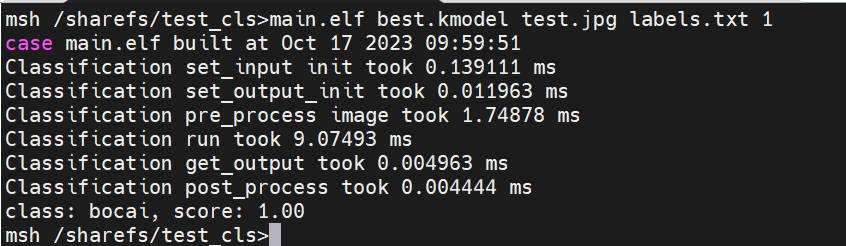

视频流推理图示：

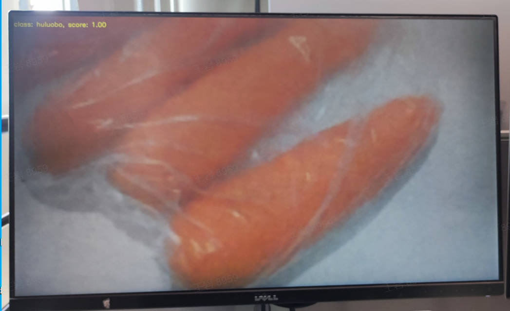

## 常见问题问答(FAQ)

请参考常见问题问答

[SDK](03_other/K230_SDK常见问题解答_C.md)

[nncase](03_other/K230_nncase常见问题解答.md)

[AI demo](03_other/K230_AI_demo常见问题解答_C++.md)
